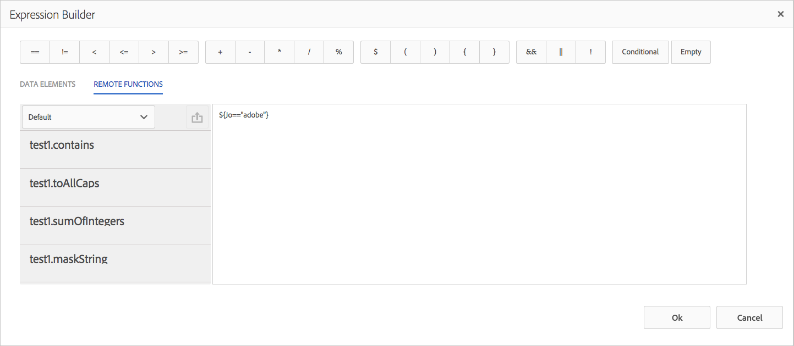

# Fjärrfunktioner i Expression Builder{#remote-functions-in-expression-builder}

Med Expression Builder kan du skapa uttryck eller villkor som utför beräkningar på datavärden som tillhandahålls av Data Dictionary eller av slutanvändare. Correspondence Management använder resultatet av uttrycksutvärderingen för att välja resurser som text, bilder, listor och villkor och infoga dem i korrespondensen efter behov.

## Skapa uttryck och fjärrfunktioner med uttrycksverktyget {#creating-expressions-and-remote-functions-with-expression-builder}

I Expression Builder används JSP EL-bibliotek internt, vilket innebär att uttrycket följer JSPEL-syntaxen. Mer information finns i [Exempeluttryck](#exampleexpressions).


### Operatorer {#operators}

De operatorer som är tillgängliga för användning i uttryck är tillgängliga i det övre fältet i uttrycksverktyget.

### Exempeluttryck {#exampleexpressions}

Här är några vanliga JSP EL-exempel som du kan använda i din Correspondence Management-lösning:

* Så här lägger du till två tal: ${number1 + number2}
* Så här sammanfogar du två strängar: ${str1} ${str2}
* Så här jämför du två tal: ${age &lt; 18}

Mer information finns i [JSP EL-specifikationen](https://download.oracle.com/otn-pub/jcp/jsp-2.1-fr-spec-oth-JSpec/jsp-2_1-fr-spec-el.pdf). Uttryckshanteraren på klientsidan stöder inte vissa variabler och funktioner i JSP EL-specifikationen, närmare bestämt:

* Samlingsindex och kartnycklar (med [] notation) stöds inte i variabelnamn för uttryck som utvärderas på klientsidan.
* Följande är parametertyper eller returtyper för funktioner som används i uttryck:

   * java.lang.String
   * java.lang.Character
   * Char
   * java.lang.Boolean
   * Boolesk
   * java.lang.Integer
   * Int
   * java.util.list
   * java.lang.Short
   * Kort
   * java.lang.Byte
   * byte
   * java.lang.Double
   * Dubbel
   * java.lang.Long
   * Lång
   * java.lang.Float
   * Flyttal
   * java.util.Calendar
   * java.util.Date
   * java.util.List

### Fjärrfunktion {#remote-function}

Med fjärrfunktioner kan du använda anpassad logik i uttryck. Du kan skriva egen logik som ska användas i uttryck som en metod i Java, och samma funktion kan användas i uttryck. Tillgängliga fjärrfunktioner visas på fliken Fjärrfunktioner till vänster i Expression Editor.



#### Lägga till anpassade fjärrfunktioner {#adding-custom-remote-functions}

Du kan skapa ett anpassat paket för att exportera dina egna fjärrfunktioner för användning inuti uttryck. Utför följande åtgärder om du vill skapa ett anpassat paket för att exportera egna fjärrfunktioner. Det visar hur du skriver en anpassad funktion som ändrar indatasträngen till versaler.

1. Definiera ett gränssnitt för OSGi-tjänsten som innehåller metoder som exporteras för användning av Expression Manager.
1. Deklarera metoder i gränssnittet A och kommentera dem med @ServiceMethod-anteckningen (com.adobe.exm.expeval.ServiceMethod). Uttryckshanteraren ignorerar alla metoder som inte kommenteras. ServiceMethod-anteckningen har följande valfria attribut som också kan anges:

   1. **Aktiverad**: Avgör om den här metoden är aktiverad. Uttryckshanteraren ignorerar inaktiverade metoder.
   1. **familyId**: Anger metodens familj (grupp). Om den är tom antar Expression Manager att metoden tillhör standardfamiljen. Det finns inget register över familjer (utom standardvalet) som funktioner väljs från. Med Expression Manager skapas registret dynamiskt genom en union av alla familj-ID:n som anges av alla funktioner som exporteras av de olika paketen. Se till att det ID som de anger här är läsbart eftersom det även visas i uttrycksredigeringsgränssnittet.
   1. **displayName**: Ett namn som kan läsas av människor för funktionen. Det här namnet används för visning i redigeringsgränssnittet. Om det är tomt skapar Expression Manager ett standardnamn med funktionens prefix och local-name.
   1. **Beskrivning**: En detaljerad beskrivning av funktionen. Den här beskrivningen används för visning i redigeringsgränssnittet. Om det är tomt skapar Expression Manager en standardbeskrivning med funktionens prefix och local-name.

   ```java
   package mergeandfuse.com;
   import com.adobe.exm.expeval.ServiceMethod;
   
   public interface RemoteFunction {
    @ServiceMethod(enabled=true,displayName="Returns_all_caps",description="Function to convert to all CAPS", familyId="remote")
    public String toAllCaps(String name);
   
   }
   ```

   Parametrarna för metoderna kan också kommenteras med @ServiceMethodParameter-anteckningen (com.adobe.exm.expeval.ServiceMethodParameter). Den här anteckningen används bara för att ange namn som kan läsas av människor och beskrivningar av metodparametrar som ska användas i utvecklingsgränssnittet. Kontrollera att gränssnittsmetodernas parametrar och returvärden tillhör någon av följande typer:

   * java.lang.String
   * java.lang.Character
   * Char
   * java.lang.Boolean
   * Boolesk
   * java.lang.Integer
   * Int
   * java.lang.Short
   * Kort
   * java.lang.Byte
   * byte
   * java.lang.Double
   * Dubbel
   * java.lang.Long
   * Lång
   * java.lang.Float
   * Flyttal
   * java.util.Calendar
   * java.util.Date
   * java.util.List


1. Definiera implementeringen av gränssnittet, konfigurera det som en OSGI-tjänst och definiera följande egenskaper:

```
@org.apache.felix.scr.annotations.Properties({
  @org.apache.felix.scr.annotations.Property(name = "connectors.jsoninvoker", boolValue = true),
  @org.apache.felix.scr.annotations.Property(name = "connectors.jsoninvoker.alias", value = "<service_id>"),
  @org.apache.felix.scr.annotations.Property(name = "exm.service", boolValue = true)})
```

Posten exm.service=true instruerar Expression Manager att tjänsten innehåller fjärrfunktioner som är lämpliga att använda i uttryck. Värdet för &lt;service_id> måste vara en giltig Java-identifierare (alfanumerisk,$, _ utan andra specialtecken). Det här värdet, som har nyckelordet REMOTE_ som prefix, utgör prefixet som används i uttryck. Ett gränssnitt med en kommenterad metod bar() och tjänst-ID:t foo i tjänsteegenskaperna kan till exempel refereras inuti uttryck med REMOTE_foo:bar().

```
package mergeandfuse.com;

import org.apache.felix.scr.annotations.Component;
import org.apache.felix.scr.annotations.Service;

@Component(metatype = true, immediate = true, label = "RemoteFunctionImpl")
@Service(value = RemoteFunction.class)
@org.apache.felix.scr.annotations.Properties({
  @org.apache.felix.scr.annotations.Property(name = "connectors.jsoninvoker", boolValue = true),
  @org.apache.felix.scr.annotations.Property(name = "connectors.jsoninvoker.alias", value = "test1"),
  @org.apache.felix.scr.annotations.Property(name = "exm.service", boolValue = true)})
public class RemoteFuntionImpl implements RemoteFunction {

 @Override
 public String toAllCaps(String name) {
  System.out.println("######Got######"+name);
  
  return name.toUpperCase();
 }
 
}
```

Nedan finns exempelarkiv att använda:

* **GoodFunctions.jar.zip** är en jar-fil med ett paket som innehåller en fjärrfunktionsdefinition. Ladda ned filen GoodFunctions.jar.zip och zippa upp den för att få filen jar.
* **GoodFunctions.zip** är det paket med källkod som används för att definiera en anpassad fjärrfunktion och skapa ett paket för den.

GoodFunctions.jar.zip

[Hämta fil](assets/goodfunctions.jar.zip)

GoodFunctions.zip

[Hämta fil](assets/goodfunctions.zip)
