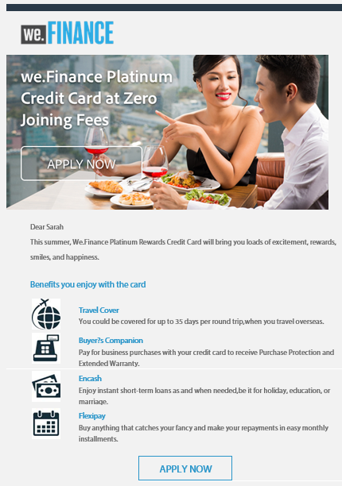
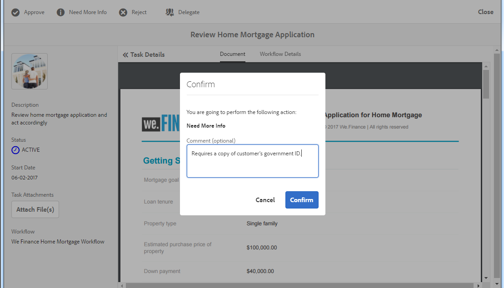

# Genomgång av referenswebbplatser för ekonomi{#we-finance-reference-site-walkthrough}

## Krav {#pre-requisites}

Konfigurera referenswebbplatserna enligt beskrivningen i [Konfigurera och konfigurera AEM Forms-referenswebbplatser](../../forms/using/setup-reference-sites.md).

## Scenarier om webbplatsen för Vi.Finance Reference {#we-finance-reference-site-scenarios}

Vi.Finance är en ledande organisation inom finanssektorn som erbjuder omfattande och personaliserade finansiella lösningar som passar behoven i olika kundprofiler. De erbjuder kreditkort, bostadslån och hemförsäkring.

Deras mål är att nå ut till befintliga och potentiella kunder på den enhet de föredrar, förklara fördelarna med deras tjänster och hjälpa dem att registrera sig för sina tjänster. Dessutom letar de efter fler finansiella produkter som tilläggskort som kunderna tycker är intressanta.

Läs vidare för att få en mer detaljerad genomgång av våra användningsområden.Användningsexempel inom finanssektorn och se hur AEM Forms hjälper finansorganisationer att uppnå sina mål. Följande genomgångar omfattas:

* [Genomgång av kreditkortsansökningar](#credit-card-application-walkthrough)
* [Genomgång av låneansökningar för hemmabruk](#home-mortgage-application-walkthrough)
* [Programgenomgång av Home Mortgage med Microsoft Dynamics](#home-mortgage-application-walkthrough-with-microsoft-dynamics)
* [Genomgång av försäkringsprogram för hemmabruk](#home-insurance-application-walkthrough)
* [Genomgång av förmögenhetsförvaltning](#wealthmanagementwalkthrough)
* [Genomgång av autoförsäkringsprogram](#autoinsuranceapplicationwalkthrough)

## Genomgång av kreditkortsansökningar {#credit-card-application-walkthrough}

Scenariot med kreditkortsansökningar för We.Finance omfattar följande:

* Sarah Rose, en We.Finance-kund
* Gloria Rios, Head of Credit Card and Mortgage, We.Finance

Följande infografik visar ett steg-för-steg-arbetsflöde för kreditkortsprogrammet.

Låt oss titta närmare på scenariot med referenswebbplatser för att förstå hur AEM Forms hjälper oss att uppnå målen.

### Sarah får ett nyhetsbrev från We.Finance och ansöker om kreditkort {#sarah-receives-a-newsletter-from-we-finance-and-applies-for-a-credit-card}

Sarah Rose är en befintlig We.Finance-kund. Hon får ett nyhetsbrev från We.Finance om nya kreditkort. Hon tycker att erbjudandena är spännande och bestämmer sig för att ansöka om kreditkort. Hon klickar på knappen Apply Now (Tillämpa nu) i nyhetsbrevet, som tar henne till kreditkortsprogrammet på webbportalen.

#### Så här fungerar det {#how-it-works}

Nyhetsbrevet som skickas till Sarah är en anpassad implementering som utlöser ett e-postmeddelande till det angivna e-post-ID:t. Knappen Använd nu i e-postmeddelandet är länkad till kreditkortsprogrammet, som är ett anpassat formulär i en publiceringsinstans.

#### Se det själv {#see-it-yourself}

Öppna följande URL på publiceringsinstansen för att utlösa ett nyhetsbrevets e-postmeddelande. Se till att du ersätter `[emailID]` med ett giltigt e-postkonto för att få nyhetsbrevet. Öppna nyhetsbrevet och klicka på **[!UICONTROL Använd nu]** för att gå till kreditkortsprogrammet.

`https://[publishServer]:[publsihPort]/content/campaigns/we-finance/start.html?app=cc&email=[emailID]&givenName=Sarah&familyName=Rose`

### Sarah tycker att erbjudandet är intressant och väljer att tillämpa {#sarah-finds-the-offer-interesting-and-chooses-to-apply}

Sarah bestämmer sig för att ansöka om kreditkort och klickar på knappen **Använd nu** i e-postmeddelandet. Det tar Sarah till kreditkortsapplikationen på We.Finance-portalen. Ansökningsformuläret är organiserat i avsnitt med hjälp av en kortlayout.

Sarah väljer ett kreditkort bland de tillgängliga alternativen och klickar på **[!UICONTROL Fortsätt]**.

På sidan Personlig information får hon ett meddelande om att hon måste logga in med sina inloggningsuppgifter eftersom Sarah skickar sitt socialförsäkringsnummer.

Sarah är en befintlig We.Finance-kund. Hon loggar in med sina inloggningsuppgifter för kontot We.Finance och hennes personliga information fylls i automatiskt i formuläret. Sarah fortsätter att fylla i ansökningsformuläret och det är när en påminnelse visas för ett möte som hon måste närvara vid. Hon klickar på **[!UICONTROL Spara mitt förlopp]** i ansökningsformuläret. Den sparar all information som Sarah har fyllt i hittills och en dialogruta öppnas som bekräftar om hon vill få ett e-postmeddelande med en länk till hennes utkast till ansökan som ska fyllas i senare.

Sarah klickar på **[!UICONTROL Skicka e-post]**. Hon får ett mejl med en länk för att återuppta sin kreditkortsansökan.

**Sarah har åtkomst till kreditkortsprogrammet från sin mobila enhet**

Om Sarah använder kreditkortsprogrammet från sin mobila enhet öppnas det responsiva programmet i en vy som är optimerad för mobila enheter. I den här vyn återges programformuläret som ett avsnitt i taget. Det gör att Sarah kan visa och tillhandahålla information progressivt när hon navigerar i programmet.

**Så här fungerar det**

Knappen **Använd nu** dirigerar Sarah till kreditkortsprogrammet. Programmet är ett anpassat formulär som du kan granska i redigeringsinstanserna `https://[host]:[Port]/editor.html/content/forms/af/we-finance/cc-app.html`.

Några av de funktioner du kan granska i den anpassade formen är:

* Det baseras på ett XSD-schema.
* Den har skapats med tema A för Web Finance för formatering och We.Finance för layout. Dessutom används Layout utan panelrubriker i formulärrubrikslayouten för mobil navigering. Den visar en progressiv mobil layout när den öppnas från en mobil enhet. Du kan granska mallen på `https://[host]:[Port]/libs/wcm/core/content/sites/templates.html/conf/we-finance` och temat på `https://[host]:[Port]/editor.html/content/dam/formsanddocuments-themes/we-finance/we-finance-theme-a/jcr:content`.
* Den innehåller anpassningsbara formulärregler som anropar Form Data Model-tjänster för att förifylla användarinformation för inloggad användare. Den anropar också tjänster för att förifylla information med personnummer eller e-postadress som anges i formuläret. Du kan läsa formulärdatamodeller och deras tjänster på `https://[host]:[Port]/aem/forms.html/content/dam/formsanddocuments-fdm`.
* Här används olika adaptiva formulärkomponenter för att hämta in indata och anpassa dem efter användarens svar. Den använder också komponenter som e-post som stöder HTML5-indatatyper.
* Den använder komponenten Signature Step för att visa det ifyllda formuläret och tillåter elektronisk signatur i formuläret.
* Knappen Spara mitt förlopp genererar ett unikt ID för användaren och sparar det delvis ifyllda programmet som ett utkast i en nod i AEM-databasen. Dessutom visas en dialogruta där du söker behörighet att skicka ett e-postmeddelande med en länk till noden som innehåller utkastet till program. Knappen Skicka e-post i bekräftelsedialogrutan utlöser ett e-postmeddelande med en länk till noden som innehåller utkastet.
* Den använder åtgärden Anropa AEM Workflow för att starta arbetsflödet för godkännande av kreditkort. Du kan granska arbetsflödet som används i det här formuläret på `https://[host]:[Port]/editor.html/conf/global/settings/workflow/models/we-finance-credit-card-workflow.html`

Vi rekommenderar att du granskar formuläret för att förstå vilket schema, vilka komponenter, regler, formulärdatamodeller, arbetsflöde för formulär och vilken skicka-åtgärd som används för att skapa formuläret.

Se även följande dokumentation för mer information om funktioner som används i formulär för kreditkortsprogram:

* [Introduktion till utveckling av anpassningsbara formulär](../../forms/using/introduction-forms-authoring.md)
* [Skapa anpassningsbara formulär med XML-schema](../../forms/using/adaptive-form-xml-schema-form-model.md)
* [Regelredigeraren](../../forms/using/rule-editor.md)
* [Teman](../../forms/using/themes.md)
* [Dataintegrering](../../forms/using/data-integration.md)
* [Använda Adobe Sign i anpassningsbara formulär](../../forms/using/working-with-adobe-sign.md)
* [Formulärbaserat arbetsflöde i OSGi](../../forms/using/aem-forms-workflow.md)

**Se det själv**

När du är inloggad som Sarah Rose klickar du på knappen **Använd nu** i kreditkortsprogrammet. Fyll i vissa detaljer, utforska olika adaptiva formulärkomponenter och klicka på **Spara förloppet** för att få ett e-postmeddelande med en **Återuppta** -knapp som länkar till utkastet. Se till att du anger ditt e-post-ID i programformuläret som ska ta emot e-postmeddelandet.

Läs mer om Web.Finance-temat:

`https://<host>:<AuthorPort>/editor.html/content/dam/formsanddocuments-themes/we-Finance/we-Finance-Theme-A/jcr:content`

Du kan läsa Web.Finance-mallen på:

`https://<host>:<AuthorPort>/editor.html/conf/we-finance/settings/wcm/templates/we-finance-template/structure.html`

### Sarah återupptar och skickar ansökan {#sarah-resumes-and-submits-the-application}

Sarah kommer tillbaka senare och hittar ett e-postmeddelande från We.Finance. Hon klickar på knappen **Återuppta** i det mejl som tar henne till utkastet till kreditkortsansökan. Informationen som hon fyllde tidigare är förifylld. Hon fyller i det återstående ansökningsformuläret, signerar ansökan och skickar in den.

Alternativt kan hon få åtkomst till sitt utkast från **My Forms** på hemsidan We.Finance.

#### Så här fungerar det {#how-it-works-1}

Knappen Återuppta i e-postmeddelandet dirigerar om Sarah till noden som innehåller hennes utkast.

#### Se det själv {#see-it-yourself-1}

Du måste ha fått ett e-postmeddelande med en länk till utkastet till program på ditt e-post-ID som du angav när du fyllde i ansökningsformuläret. Fyll i de återstående avsnitten i programmet och skicka in det.

### We.Finance tar emot och godkänner ansökan {#approving-the-application}

We.Finance får den kreditkortsansökan som Sarah har lämnat in. Gloria Rios har tilldelats en uppgift. Hon granskar uppgiften i sin AEM Inbox och godkänner den.

#### Så här fungerar det {#how-it-works-2}

När Sarah fyller i och skickar in kreditkortsprogrammet utlöses ett Forms Workflow och en uppgift skapas i Glorias AEM-inkorg.

AEM Forms on OSGi innehåller formulärbaserade arbetsflöden som gör att du kan skapa anpassningsbara formulärbaserade arbetsflöden. Dessa arbetsflöden kan användas för granskning och godkännande, affärsprocessflöden, för att starta dokumenttjänster, integrera med signaturarbetsflöden i Adobe Sign och så vidare. Mer information finns i [Formulärorienterat arbetsflöde i OSGi](../../forms/using/aem-forms-workflow.md).

Följande bild visar AEM-arbetsflödet som bearbetar kreditkortsprogrammet och genererar en PDF-fil av programmet.

#### Se det själv {#see-it-yourself-2}

Du kan komma åt AEM-inkorg för webbplatsen we.Finance på https://&lt;*värdnamn*>:&lt;*PublishPort*>/content/we-finance/global/en.html. Tryck på **Logga in** på sidan, markera kryssrutan **Logga in som representativ** , logga in i AEM-inkorgen med `grios/password` användarnamnet/lösenordet för Gloria Rios och godkänn kreditkortsprogrammet. Information om hur du använder AEM Inbox för formulärbaserade arbetsflödesuppgifter finns i [Hantera formulärprogram och uppgifter i AEM Inbox](../../forms/using/manage-applications-inbox.md).

När du godkänner programmet får Sarah ett e-postmeddelande med välkomstpaketet.

### Sarah får välkomstpaketet och ansöker om ett tilläggskort {#sarah-receives-the-welcome-kit-and-applies-for-an-add-on-card}

När Sarah kreditkortsansökan godkänns får hon ett e-postmeddelande med en länk till välkomstpaketet. Hon öppnar välkomstpaketet, som innehåller information om hennes kreditkortskonto. Välkomstpaketet innehåller även erbjudanden som är anpassade för Sarah. När hon rullar ned innehåller välkomstpaketet ett inbäddat formulär som du kan använda för att ansöka om ett tilläggskort. Sarah fyllde snabbt i de obligatoriska uppgifterna inifrån välkomstpaketet och ansöker om tilläggskortet. En bekräftelsedialogruta för tilläggskortsprogrammet visas.

Välkomstpaketet är personaliserat för Sarah och visar information som är relevant för henne. Det ger henne möjlighet att ladda ned en PDF-version av välkomstpaketet.

Välkomstpaketet innehåller ett annat ansökningsformulär som Sarah kan fylla i och skicka in för att ansöka om ett tilläggskort inifrån välkomstpaketet utan att besöka webbportalen för Web.Finance.

#### Så här fungerar det {#how-it-works-3}

Välkomstpaketet är en interaktiv kommunikation som ingår i `cq-we-finance-content-pkg.zip` paketet. De interaktiva korten i persondatorversionen för att visa fördelarna med kreditkortet i välkomstpaketet är en anpassad layout som skapats med standardkortlayouten för ett dokumentfragment.

Tilläggsprogrammet är en inbäddad adaptiv form i interaktiv kommunikation med välkomstpaketet.

#### Se det själv {#see-it-yourself-3}

Klicka på knappen Återuppta i det e-postmeddelande som du fick i föregående steg. Utkastprogrammet öppnas. Fyll i alla uppgifter och skicka in ansökan. Du får då ett välkomstpaket. Läs välkomstpaketet.

Du kan även visa välkomstpaketet på följande URL:

https://&lt;*host*> : &lt;*port*>/content/aemforms-refsite/doclink.html?document=/content/forms/af/we-Finance/credit-card/creditcomekit&amp;customerId=197&amp;channel=web

Du kan komma åt den på författare och publiceringsinstanser.

### Sarah får ett kreditkortsutdrag {#sarah-receives-a-credit-card-statement}

När Sarah börjar använda kreditkortet får hon ett mejl från We.Finance som innehåller en kreditkortsbeställning. I följande bilder visas e-postmeddelandet med en länk till kontoutdraget på mobilen.

Sarah klickar på Visa kontoutdrag i e-postmeddelandet för att visa kontoutdraget för kreditkort. Programsatsen är en interaktiv kommunikation. Den har både webb- och utskriftsversion (PDF). Programsatsen integreras med Forms Data Model för att hämta data som är specifika för kunden från databasen. Den interaktiva programsatsen består av olika element:

* Sammanfattning av utdrag
* Detaljerad utgiftsrapport
* Grafisk utgiftsanalys
* Möjlighet att göra en betalning för förfallobeloppet inifrån utdraget
* Hämta kvittot

Sarah behöver inte gå till portalen eller söka i sina mejl efter PDF-version av kontoutdrag för arkivering offline. Hon klickar bara på nedladdningsinstruktionen för att ladda ned en PDF-version av kontoutdraget.

Den detaljerade programsatsen läggs ut i en responsiv tabell. Programsatsen ger även möjlighet att betala en del eller hela förfallna beloppet inifrån utdraget.

Sarah schemalägger betalning inifrån kontoutdraget. Sarah kan också använda alternativet Flexi Pay för att dela upp betalningen i lika stora delar.

#### Så här fungerar det {#how-it-works-4}

Kreditkortsutdraget är en interaktiv kommunikation. Den detaljerade utgiftstabellen i utdraget är en responsiv tabell. Grafiken för utgiftsanalys är en diagramkomponent och läser utgiftstabellen och genererar cirkeldiagrammet.

#### Se det själv {#see-it-yourself-4}

Du kan läsa kontoutdraget för det interaktiva kreditkortet på följande URL:

https://&lt;*värdnamn*>:&lt;*port*>/content/aemforms-refsite/doclink.html?document=/content/forms/af/we-Finance/credit-card/credit-card-statement&amp;customerId=197&amp;channel=web

Du kan komma åt den på författare och publiceringsinstanser.

Kreditkortsutdraget visar kampanjerbjudanden mot slutet av utdraget. Ni kan integrera Adobe Target med AEM Forms Interactive Communication för att leverera riktade kampanjer baserade på specifika kundsegment. Information om hur du konfigurerar din interaktiva kommunikation så att den använder Adobe Target för anpassade och målinriktade erbjudanden finns i [Skapa riktade upplevelser](/help/forms/using/experience-targeting-forms.md).

### Vi.Finance analyserar kreditkortsprogrammets prestanda {#we-finance-analyzes-the-performance-of-the-credit-card-application}

Vi.Finance granskar då och då hur deras kreditkortsprogram fungerar för att hitta eventuella problem som kunderna kan ställas inför. De använder den här analysen för att fatta välgrundade beslut om de ändringar som krävs i kreditkortsansökan för att förbättra användarupplevelsen, minska avhoppsfrekvensen för formulär och därigenom förbättra konverteringsgraden. De utnyttjar integreringen av AEM Forms med Adobe Analytics för sin analys. Följande bild visar deras kontrollpanel för analys.

Mer information om hur du tolkar kontrollpanelen för analyser finns i [Visa och förstå AEM Forms-analysrapporter](../../forms/using/view-understand-aem-forms-analytics-reports.md).

#### Så här fungerar det {#how-it-works-5}

Prestandamätningar för kreditkortsansökningsformuläret spåras med Adobe Analytics. Mer information om hur du konfigurerar Adobe Analytics och visar rapporter finns i [Konfigurera analyser för formulär och dokument](../../forms/using/configure-analytics-forms-documents.md).

#### Se det själv {#see-it-yourself-br}

För att du ska kunna se och utforska analysrapporten tillhandahåller vi startdata för kreditkortstillämpningen på referenswebbplatsen. Innan du använder dirigerade data, se [Konfigurera analys](../../forms/using/setup-reference-sites.md#configureanalytics). Utför följande steg i författarinstansen för att visa rapporten med startdata:

1. Gå till **användargränssnittet för formulär och dokument** på https://&lt;*värdnamn*>:&lt;*AuthorPort*>/aem/forms.html/content/dam/formSanddocuments.

1. Klicka för att öppna mappen **We.Finance** .
1. Välj **Application for Credit Card** adaptive form och klicka sedan på **[!UICONTROL Enable Analytics (Aktivera analys]**) i verktygsfältet.

1. Välj det adaptiva formuläret igen och klicka på **[!UICONTROL Analysrapport]** i verktygsfältet för att generera rapporten. Du kommer att se en tom rapport från början.

Så här genererar du en analysrapport med dirigerade data:

1. I adressläsaren för CRXDE lite skriver du: `/apps/we-finance/demo-artifacts/analyticsTestData/Credit card Analytics Test Data`
1. Testdata väljs i den vänstra sidans katalogstruktur.
1. Dubbelklicka på den markerade filen för att öppna dess innehåll på den högra panelen.
1. Kopiera allt innehåll i startdatafilen.
1. I CRXDE navigerar du till: `/content/dam/formsanddocuments/we-finance/cc-app/jcr:content/analyticsdatanode/lastsevendays`
1. Klistra in det kopierade innehållet i startdatafilen i fältet **[!UICONTROL analytiska data]** under **[!UICONTROL Egenskaper]**.

1. Välj **Application for Credit Card** adaptive form och klicka på **[!UICONTROL Analytics Report]** (Analysrapport) i verktygsfältet för att generera rapporten med dirigerade data.

**A/B-testning av kreditkortsansökan**

Förutom att analysera kreditkortsprogrammets prestanda och ständigt förbättra det, utnyttjar Web.Finance integreringen av AEM Forms med Target för att skapa A/B-tester. De kan leverera olika upplevelser av kreditkortsansökningsformuläret och identifiera den upplevelse som ger bättre konverteringsgrad när det gäller ifyllande och inlämning av formulär.

Information om hur du konfigurerar mål i AEM Forms-servern finns i [Konfigurera och integrera mål i AEM Forms](../../forms/using/ab-testing-adaptive-forms.md#set%20up%20and%20integrate%20target%20in%20aem%20forms).

Utför följande steg för att skapa ett A/B-test för ansökningsformuläret We.Finance:

1. Gå till **Formulär och dokument** på https://&lt;*värdnamn*>:&lt;*AuthorPort*>/aem/forms.html/content/dam/formSanddocuments.

1. Klicka för att öppna mappen **We.Finance** .
1. Välj **Ansökan för anpassat formulär för kreditkort** .
1. Klicka på **Mer** i verktygsfältet och välj **Konfigurera A/B-testning**. Sidan Konfigurera A/B-testning öppnas.

1. Ange ett **aktivitetsnamn**.
1. I listrutan Målgrupp väljer du en målgrupp till vilken du vill leverera olika upplevelser av formuläret. Exempel: **Besökare som använder Chrome**.
1. I fälten **Experience Distribution** för upplevelserna A och B anger du fördelningen, uttryckt i procent, för att avgöra hur upplevelserna ska fördelas mellan den totala publiken. Om du till exempel anger 40, 60 för upplevelserna A respektive B kommer upplevelsen A att visas för 40 % av publiken och de återstående 60 % kommer att se upplevelsen B.
1. Klicka på **Konfigurera**. En dialogruta visas som bekräftar att A/B-testet har skapats.
1. Klicka på **Klar**.
1. Välj **ansökningsformuläret för kreditkort** och klicka på **Redigera**. Det ger möjlighet att öppna en av upplevelserna. Klicka på **Upplevelse B**. Formuläret öppnas i redigeringsläge.

1. Ändra formuläret efter behov för att skapa en annan upplevelse än standardupplevelsen A.
1. Gå till användargränssnittet för formulär och dokument, markera formuläret, klicka på **Mer** och välj **Starta A/B-testning**.
1. Öppna formuläret i webbläsaren flera gånger med följande URL:

   `https://&lt;*hostname*&gt;:&lt;*port*&gt;/content/dam/formsanddocuments/we-finance/cc-app/jcr:content?wcmmode=disabled`

   >[!NOTE] Obs! Ta bort cookien med **namnrutan** från webbläsarens cookie-beständighet innan du öppnar formuläret nästa gång. Du kommer att se upplevelsen A och B av formuläret på måfå.

1. Markera formuläret, klicka på **Mer** och klicka på **A/B-testrapport**. Du hittar inte så mycket data i rapporten som du just har påbörjat testningen. Nu ska vi tillhandahålla vissa startdata för att se hur A/B-testrapporten ser ut.
1. Öppna CRXDE Lite och ta en säkerhetskopia av följande fil: /libs/fd/fmaddon/gui/components/admin/targetreport/clientlibs/targetreport/js/targetreport.js
1. Ersätt definitionen av funktion `onReportLoadSuccess` i den ovannämnda filen med funktionsdefinitionen i följande fil: /apps/we-finance/demo-artifacts/targetreport.js

   Obs! Dessa ändringar är endast avsedda för demonstrationssyften. Se till att du återställer filinnehållet när du har slutfört den här proceduren.

1. Uppdatera rapporten som du skapade så ser du något liknande. Granska rapportkontrollpanelen.

Om du vill avsluta A/B-testet klickar du på **Slut på A/B-test** på kontrollpanelen för rapporter. Nu visas en dialogruta där du uppmanas att deklarera en upplevelse. Välj en vinnare och bekräfta att du vill avsluta A/B-testet.

Om ni väljer upplevelse A som vinnare kommer A/B-testet att avslutas och om ni fortsätter kommer endast upplevelse A att användas för alla målgrupper, inklusive de i Chrome.

## Genomgång av låneansökningar för hemmabruk {#home-mortgage-application-walkthrough}

Scenariot för bostadslån hos We.Finance omfattar följande:

* Sarah Rose, en We.Finance-kund
* Gloria Rios, Head of Credit Card and Mortgage, We.Finance
* John Doe, kundtjänstrepresentant, We.Finance

Följande bild visar ett steg-för-steg-arbetsflöde för en bostadslån.

Nu ska vi i detalj titta på stegen i scenariot på referenswebbplatsen för att se hur AEM Forms hjälper oss att uppnå målen.

### Sarah besöker webbplatsen We.Finance och ansöker om bostadslån {#sarah-visits-we-finance-website-and-applies-for-home-mortgage}

Sarah Rose planerar att köpa ett hus och leta efter en bostadsplan. Hon är kund hos We.Finance och besöker därför Web.Finance-portalen för att utforska bostadserbjudanden. Hon går till lånedelen och hittar en låneberäkning på portalen. Hon fyller i detaljerna och klickar på Beräkna min inteckning, som returnerar en inteckningsplan.

 

Lånekalkylator

Resultat av ränteberäkning

#### Så här fungerar det {#how-it-works-6}

Heminteckningsräknaren på sidan Lån är en inbäddad anpassningsbar form på sidan AEM Sites. Du kan granska sidan Lån i redigeringsläge på `https://[authorHost]:[authorPort]/editor.html/content/we-finance/global/en/loan-landing-page.html`.

Den inbäddade låneberäkningsenheten, som är en adaptiv form, använder regler för att beräkna EMI-beloppet baserat på låneinformationen i beräkningsfälten. Du kan granska det adaptiva formuläret på `https://[authorHost]:[authorPort]/editor.html/content/forms/af/we-finance/hm-calc.html`.

#### Se det själv {#see-it-yourself-5}

Gå till We.Finance portal på `https://<publishHost>:<publishPort>/content/we-finance/global/en.html` och klicka på **[!UICONTROL Loans]**. Ange detaljerad information i inteckningsberäkningen och se resultatet.

### Sarah tycker att erbjudandet är intressant och väljer att tillämpa {#sarah-finds-the-offer-interesting-and-chooses-to-apply-1}

Sarah väljer att ansöka om bostadslån och klickar på **[!UICONTROL Använd nu]** för beräkning av bostadslån. Ansökan om bostadslån öppnas.

Om Sarah öppnar bostadslåneprogrammet från sin mobila enhet öppnas ansökningsformuläret i en vy som är optimerad för visning på en mobil enhet. I den här vyn återger programformuläret ett avsnitt i taget. Det gör att Sarah kan visa och ange information progressivt när hon navigerar i ansökningsformuläret.

Följande bilder visar arbetsflödet när Sarah navigerar genom bostadslådan på sin mobila enhet.

Om Sarah klickar på **Använd nu** från sin dator öppnas låneansökningsformuläret enligt följande. Den information Sarah har lämnat i låneberäkningen är förifylld i ansökningsformuläret. Sarah fyller i de återstående detaljerna och klickar på **Fortsätt**.

Baserat på den information Sarah fyllde i hypotekskalkylatorn presenteras hon med några hypoteksplaner. Hon väljer den plan som passar hennes behov och fortsätter att fylla i ansökan. Hon signerar och skickar ansökan till slut.

Den inskickade ansökan går till We.Finance för godkännande.

#### Så här fungerar det {#how-it-works-7}

Knappen **Använd nu** dirigerar Sarah till bostadslådan. Programmet är ett anpassat formulär som du kan granska i redigeringsinstanserna `https://[host]:[Port]/editor.html/content/forms/af/we-finance/hm-app.html`.

Några av de funktioner du kan granska i den anpassade formen är:

* Det baseras på ett XSD-schema `homeMortgageApplication.xsd`.
* Det har skapats med We Finance Theme B för formatering och We.Finance för layout. Dessutom används Layout utan panelrubriker i formulärrubrikslayouten för mobil navigering. Den visar en progressiv mobil layout när den öppnas från en mobil enhet. Du kan granska mallen och temat som används i det adaptiva formuläret på följande platser i din AEM-författarinstans:

   * `https://[host]:[Port]/libs/wcm/core/content/sites/templates.html/conf/we-finance`
   * `https://[host]:[Port]/editor.html/content/dam/formsanddocuments-themes/we-finance/we-finance-theme-b/jcr:content`

* Den första fliken, Komma igång, i programmet är en dynamisk låneberäkning som visar alternativ baserat på vad användaren väljer. Fälten och värdena är till exempel olika för alternativen Inköp och Refinansiering. Den här funktionaliteten uppnås med hjälp av regler för att visa/dölja. När du klickar på Fortsätt och fliken Planer initieras anropas dessutom en webbtjänst som konfigurerats i en formulärdatamodell för att hämta och visa hypoteksplaner. Du kan läsa formulärdatamodeller och konfigurerade tjänster på `https://[host]:[Port]/aem/forms.html/content/dam/formsanddocuments-fdm`.
* Här används olika adaptiva formulärkomponenter för att hämta in indata och anpassa dem efter användarens svar. Den använder också komponenter som e-post som stöder HTML5-indatatyper.
* Den använder komponenten Signature Step för att visa det ifyllda formuläret och tillåter elektronisk signatur i formuläret.
* Den använder åtgärden Invoke AEM Workflow för att starta Web Finance Home Mortgage AEM-arbetsflödet. Du kan granska arbetsflödet som används i det här formuläret på `https://[host]:[Port]/editor.html/conf/global/settings/workflow/models/we-finance-home-mortgage-workflow.html`

Vi rekommenderar att du granskar formuläret för att förstå vilket schema, vilka komponenter, regler, formulärdatamodeller, arbetsflöde för formulär och vilken skicka-åtgärd som används för att skapa formuläret.

Se även följande dokumentation för mer information om funktioner som används i en anpassningsbar form för bostadslån:

* [Introduktion till utveckling av anpassningsbara formulär](../../forms/using/introduction-forms-authoring.md)
* [Skapa anpassningsbara formulär med XML-schema](../../forms/using/adaptive-form-xml-schema-form-model.md)
* [Regelredigeraren](../../forms/using/rule-editor.md)
* [Teman](../../forms/using/themes.md)
* [Dataintegrering](../../forms/using/data-integration.md)
* [Använda Adobe Sign i anpassningsbara formulär](../../forms/using/working-with-adobe-sign.md)
* [Formulärbaserat arbetsflöde i OSGi](../../forms/using/aem-forms-workflow.md)

#### Se det själv {#see-it-yourself-6}

Gå till `https://[server]:[port]/content/we-finance/global/en/all-forms.html` och klicka på knappen **Använd nu** i Home Mortgage Application. Fyll i informationen på fliken Komma igång, prova olika alternativ och skicka programmet.

Se till att du anger ett giltigt e-post-ID i programmet för att få ett bekräftelsemeddelande i inkorgen.

### Vi.Finance tar emot ansökan {#approving_the_application-1}

Vi.Finance får en låneansökan från Sarah. Uppgiften att godkänna eller avvisa programmet tilldelas Gloria Rios. Hon granskar ansökan och upptäcker att Sarah saknar myndighets-ID.

Gloria öppnar uppgiften och klickar på Behöver mer information och lägger till en kommentar om att ett myndighets-ID saknas.

Uppgiften är nu tilldelad John Doe, en kundtjänstrepresentant hos We.Finance. Han öppnar uppgiften och granskar Glorias kommentar. Han kontaktar Sarah och ber henne skicka en kopia av sitt ID. När han fått en kopia av Sarah ID bifogar han det till uppgiften och lämnar in ansökan om omprövning.

Uppgiften har tilldelats Gloria på nytt. Hon granskar det bifogade ID:t och godkänner programmet.

#### Så här fungerar det {#how-it-works-8}

När Sarah fyller i och skickar bostadslådan aktiveras ett Forms Workflow och en uppgift skapas i Glorias AEM-inkorg. När Gloria granskar programmet och begär mer information tilldelas uppgiften John Doe. När John Doe bifogar ID:t och skickar in programmet igen tilldelas det Gloria. Detta definieras i det AEM-arbetsflöde som är kopplat till låneansökan.

AEM Forms on OSGi innehåller formulärbaserade arbetsflöden som gör att du kan skapa anpassningsbara formulärbaserade arbetsflöden. Dessa arbetsflöden kan användas för granskning och godkännande, affärsprocessflöden, för att starta dokumenttjänster, integrera med signaturarbetsflöden i Adobe Sign och så vidare. Mer information finns i [Formulärorienterat arbetsflöde i OSGi](../../forms/using/aem-forms-workflow.md).

Följande bild visar det AEM-arbetsflöde som är kopplat till låneansökan.

#### Se det själv {#see-it-yourself-7}

Du kommer åt AEM-inkorg på `https://<hostname>:<AuthorPort>/content/we-finance/global/en/login.html?resource=/aem/inbox.html`. Logga in på AEM-inkorgen `grios/password` `jdoe/jdoe` som användarnamn/lösenord för Gloria Rios och John Doe och utforska arbetsflödet för bostadslån.

Information om hur du använder AEM Inbox för formulärbaserade arbetsflödesuppgifter finns i [Hantera formulärprogram och uppgifter i AEM Inbox](../../forms/using/manage-applications-inbox.md).

### Sarah får välkomstpaketet {#sarah-receives-the-welcome-kit}

När Sarah godkänner låneansökan får hon ett mejl med en länk till välkomstpaketet. Hon öppnar välkomstpaketet, som innehåller en karusell med reklamerbjudanden som är skräddarsydda för Sarah.

Välkomstpaketet är personaliserat för Sarah och visar information som är relevant för henne. Det ger henne möjlighet att ladda ned en PDF-version av välkomstpaketet. Pilknappen längst ned gör att Sarah kan rulla nedåt och navigera genom andra avsnitt i välkomstpaketet.

#### Så här fungerar det {#how-it-works-9}

Välkomstpaketet är en interaktiv kommunikation som ingår i `cq-we-finance-content-pkg.zip` paketet. Kampanjerbjudandena i välkomstpaketet hanteras av Adobe Target-servern. Erbjudandena är anpassade och inriktade på specifika kundsegment. Välkomstpaketet hämtar erbjudanden från en förkonfigurerad Adobe Target-server för ett målgruppssegment med kvinnliga kunder.

De interaktiva korten i skrivbordsversionen av välkomstpaketet använder en anpassad layout som skapats med standardkortlayouten för ett dokumentfragment.

#### Se det själv {#see-it-yourself-8}

Om du angav ditt e-post-ID när du fyllde i låneansökan bör du ha fått ett e-postmeddelande med en länk till välkomstpaketet. Kontrollera din inkorg och läs välkomstpaketet.

Du kan visa den i AEM-publiceringsinstansen på följande URL:

`https://[host]:[port]/content/forms/af/we-finance/mortgage-loan-welcome-kit.html`

### Sarah får ett kontoutdrag {#sarah-receives-an-account-statement}

När Sarah skaffar lånet och börjar betala avbetalningarna får hon ett e-postmeddelande från We.Finance som innehåller en månadsredovisning.

Sarah klickar på Visa kontoutdrag i e-postmeddelandet för att visa kontoutdraget för hypotekslån. Den interaktiva programsatsen består av olika element:

* Sammanfattning av utdrag
* Utdragsdetaljer

Följande bild visar olika delar av kontoutdraget på skrivbordet.

Den detaljerade programsatsen läggs ut i en responsiv tabell och ger möjlighet att betala en del av eller hela det förfallna beloppet inifrån programsatsen.

#### Så här fungerar det {#how-it-works-10}

Avgiften är en interaktiv kommunikation. Den genereras med JSON-grupperingsprocessen. Den detaljerade utgiftstabellen i utdraget är en responsiv tabell.

#### Se det själv {#see-it-yourself-9}

Du kan läsa den interaktiva kontoutdraget på följande URL:

https://&lt;*värdnamn*>:&lt;*port*>/content/forms/af/we-finance/mortgage-account-statement.html?wcmmode=disabled

Du kan komma åt den på författare och publiceringsinstanser.

### Vi.Finance analyserar hur låneansökan fungerar {#we-finance-analyzes-the-performance-of-the-mortgage-application}

Vi.Ekonomi granskar då och då hur deras låneansökan fungerar för att hitta eventuella problem som kunderna kan ställas inför. De använder denna analys för att fatta välgrundade beslut om de ändringar som krävs i låneansökan för att förbättra användarupplevelsen, minska avhoppsfrekvensen på formulär och därigenom förbättra konverteringsgraden. De utnyttjar integreringen av AEM Forms med Adobe Analytics för sin analys. Följande bild visar deras kontrollpanel för analys.

Mer information om hur du tolkar kontrollpanelen för analyser finns i [Visa och förstå AEM Forms-analysrapporter](../../forms/using/view-understand-aem-forms-analytics-reports.md).

#### Så här fungerar det {#how-it-works-11}

Resultatstatistik för låneansökningsformuläret spåras med Adobe Analytics. Mer information om hur du konfigurerar Adobe Analytics och visar rapporter finns i [Konfigurera analyser för formulär och dokument](../../forms/using/configure-analytics-forms-documents.md).

#### Se det själv {#see-it-yourself-br-1}

För att du ska kunna se och utforska analysrapporten tillhandahåller vi startdata för låneansökan på referenswebbplatsen. Innan du använder dirigerade data, se [Konfigurera analys](../../forms/using/setup-reference-sites.md#configureanalytics). Utför följande steg i författarinstansen för att visa rapporten med startdata:

1. Gå till **användargränssnittet för formulär och dokument** på https://&lt;*värdnamn*>:&lt;*AuthorPort*>/aem/forms.html/content/dam/formSanddocuments.

1. Klicka för att öppna mappen för **webbfinansiering** .
1. Välj **[!UICONTROL Application for Home Mortgage]** adaptive form och klicka sedan på **[!UICONTROL Enable Analytics (Aktivera analys]**) i verktygsfältet.

1. Markera formuläret igen och klicka på **[!UICONTROL Analysrapport]** i verktygsfältet för att generera rapporten. Inledningsvis visas en tom rapport.

Så här genererar du en analysrapport med dirigerade data:

1. I adresswebbläsaren för CRXDE lite skriver du följande: `/apps/we-finance/demo-artifacts/analyticsTestData/HomeMortgageAnalyticsTestData`
1. Testdata väljs i den vänstra sidans katalogstruktur.
1. Dubbelklicka på den markerade filen för att öppna dess innehåll på den högra panelen.
1. Kopiera allt innehåll i startdatafilen.
1. I CRXDE navigerar du till: `/content/dam/formsanddocuments/we-finance/hm-app/jcr:content/analyticsdatanode/lastsevendays`
1. Klistra in det kopierade innehållet i startdatafilen under Egenskaper i analysdatafältet.
1. Generera analysrapporten igen för Home Mortgage Application Form. Du kommer att se rapporten med startdata.

**A/B-testning av låneansökan**

Förutom att analysera hur låneansökan fungerar och ständigt förbättra den, utnyttjar Web.Finance integreringen av AEM Forms med Target för att skapa A/B-tester. De kan leverera olika upplevelser av ansökningsformuläret och identifiera den upplevelse som ger bättre konverteringsgrad när det gäller ifyllande och inskickande av formulär.

Information om hur du konfigurerar mål i AEM Forms-servern finns i [Konfigurera och integrera mål i AEM Forms](../../forms/using/ab-testing-adaptive-forms.md#set%20up%20and%20integrate%20target%20in%20aem%20forms).

Utför följande steg i författarinstansen för att skapa A/B-test för låneansökningsformuläret We.Finance:

1. Gå till **Formulär och dokument** på https://&lt;*värdnamn*>:&lt;*AuthorPort*>/aem/forms.html/content/dam/formSanddocuments.

1. Klicka för att öppna mappen **We.Finance** .
1. Välj **Program för anpassat formulär för** hemlån.
1. Klicka på **Mer** i verktygsfältet och välj **Konfigurera A/B-testning**. Sidan Konfigurera A/B-testning öppnas.

1. Ange ett **aktivitetsnamn**.
1. I listrutan Målgrupp väljer du en målgrupp till vilken du vill leverera olika upplevelser av formuläret. Exempel: **Besökare som använder Chrome**.
1. I fälten **Experience Distribution** för upplevelserna A och B anger du fördelningen, uttryckt i procent, för att avgöra hur upplevelserna ska fördelas mellan den totala publiken. Om du till exempel anger 40, 60 för upplevelserna A respektive B kommer upplevelsen A att visas för 40 % av publiken och de återstående 60 % kommer att se upplevelsen B.
1. Klicka på **Konfigurera**. En dialogruta visas som bekräftar att A/B-testet har skapats.
1. Klicka på **Klar**.
1. Välj **Application for Home Mortgage** adaptive form och klicka på **Edit**. Det ger möjlighet att öppna en av upplevelserna. Klicka på **Upplevelse B**. Formuläret öppnas i redigeringsläge.
1. Ändra formuläret efter behov för att skapa en annan upplevelse än standardupplevelsen A.
1. Gå till användargränssnittet för formulär och dokument, markera formuläret, klicka på **Mer** och välj **Starta A/B-testning**.
1. Öppna formuläret i webbläsaren flera gånger med följande URL:
   `https://&lt;hostname&gt;:&lt;port&gt;/content/dam/formsanddocuments/we-finance/hm-app/jcr:content?wcmmode=disabled`

   >[!NOTE]
   >  Ta bort cookien med **namnrutan** från webbläsarens cookie-beständighet innan du öppnar formuläret nästa gång. Du kommer att se upplevelsen A och B av formuläret på måfå.

1. Markera formuläret, klicka på **Mer** och klicka på **A/B-testrapport**. Du hittar inte så mycket data i rapporten som du just har påbörjat testningen. Nu ska vi tillhandahålla vissa startdata för att se hur A/B-testrapporten ser ut.
1. Öppna CRXDE Lite och ta en säkerhetskopia av följande fil: /libs/fd/fmaddon/gui/components/admin/targetreport/clientlibs/targetreport/js/targetreport.js
1. Ersätt definitionen av `onReportLoadSuccess` funktionen i den ovannämnda filen med funktionsdefinitionen i följande fil: /apps/we-finance/demo-artifacts/targetreport.js

   Obs! Dessa ändringar är endast avsedda för demonstrationssyften. Se till att du återställer filinnehållet när du har slutfört den här proceduren.

1. Uppdatera rapporten som du skapade så ser du något liknande. Granska rapportkontrollpanelen.

Om du vill avsluta A/B-testet klickar du på **Slut på A/B-test** på kontrollpanelen för rapporter. Nu visas en dialogruta där du uppmanas att deklarera en upplevelse. Välj en vinnare och bekräfta att du vill avsluta A/B-testet.

Om ni väljer upplevelse A som vinnare kommer A/B-testet att avslutas och om ni fortsätter kommer endast upplevelse A att användas för alla målgrupper, inklusive de i Chrome.

## Programgenomgång av Home Mortgage med Microsoft Dynamics {#home-mortgage-application-walkthrough-with-microsoft-dynamics}

Scenariot Web.Finance-bostadslån med Microsoft Dynamics omfattar följande:

* Sarah Rose, en We.Finance-kund
* Administratören för Microsoft Dynamics-instansen We.Finance

Hemmasappen som genomsöker Microsoft Dynamics visar hur en We.Finance-kund kan använda webbplatsen för att ansöka om en bostadslån när referenswebbplatsen använder Microsoft Dynamics för dataintegrering. Genomgången avslutas med de data som fylls i av användaren som tas emot av Microsoft Dynamics. Innan du fortsätter med det här scenariot måste du slutföra [Microsoft Dynamics 365-konfigurationen för heminteckningsarbetsflödet på webbsidan](/help/forms/using/ms-dynamics-configuration-home-mortgage.md)för webbfinansiering.

### Sarah besöker webbplatsen We.Finance och ansöker om bostadslån {#sarah-visits-we-finance-website-and-applies-for-home-mortgage-1}

Sarah Rose planerar att köpa ett hus och leta efter en bostadsplan. Hon är kund hos We.Finance och besöker därför Web.Finance-portalen för att utforska bostadserbjudanden. Hon går till lånedelen och hittar en låneberäkning på portalen. Hon fyller i detaljerna och klickar på Beräkna min inteckning, som returnerar en inteckningsplan.

 

Lånekalkylator

Resultat av ränteberäkning

#### Så här fungerar det {#how-it-works-12}

Heminteckningsräknaren på sidan Lån är en inbäddad anpassningsbar form på sidan AEM Sites. Du kan granska sidan Lån i redigeringsläge på `https://[authorHost]:[authorPort]/editor.html/content/we-finance/global/en/loan-landing-page.html`.

Den inbäddade låneberäkningsenheten, som är en adaptiv form, använder regler för att beräkna EMI-beloppet baserat på låneinformationen i beräkningsfälten. Du kan granska det adaptiva formuläret på `https://[authorHost]:[authorPort]/editor.html/content/forms/af/we-finance/ms-dynamics/home-mortgage-calculator.html`.

#### Se det själv {#see-it-yourself-10}

Gå till We.Finance portal på `https://<publishHost>:<publishPort>/content/we-finance/global/en.html` och klicka på **[!UICONTROL Loans]**. Ange detaljerad information i inteckningsberäkningen och se resultatet.

### Sarah tycker att erbjudandet är intressant och väljer att tillämpa {#sarah-finds-the-offer-interesting-and-chooses-to-apply-2}

Sarah väljer att ansöka om bostadslån och klickar på **[!UICONTROL Använd nu]** för beräkning av bostadslån. Ansökan om bostadslån öppnas.

Om Sarah öppnar bostadslåneprogrammet från sin mobila enhet öppnas ansökningsformuläret i en vy som är optimerad för visning på en mobil enhet. I den här vyn återger programformuläret ett avsnitt i taget. Det gör att Sarah kan visa och ange information progressivt när hon navigerar i ansökningsformuläret.

Följande bilder visar arbetsflödet när Sarah navigerar genom bostadslådan på sin mobila enhet.

Om Sarah klickar på **Använd nu** från sin dator öppnas låneansökningsformuläret enligt följande. Den information Sarah har lämnat i låneberäkningen är förifylld i ansökningsformuläret. Sarah fyller i de återstående detaljerna och klickar på **Fortsätt**.

Baserat på den information Sarah fyllde i hypotekskalkylatorn presenteras hon med några hypoteksplaner. Hon väljer den plan som passar hennes behov och fortsätter att fylla i ansökan. Hon signerar och skickar ansökan till slut.

Den inskickade ansökan går till We.Finance för godkännande.

#### Så här fungerar det {#how-it-works-13}

Knappen **Använd nu** dirigerar Sarah till bostadslådan. Programmet är ett anpassat formulär som du kan granska i redigeringsinstanserna `https://[host]:[Port]/editor.html/content/forms/af/we-finance/ms-dynamics/application-for-home-mortgage.html`.

Några av de funktioner du kan granska i den anpassade formen är:

* Det baseras på ett XSD-schema `homeMortgageApplication.xsd`.
* Det har skapats med We Finance Theme B för formatering och We.Finance för layout. Dessutom används Layout utan panelrubriker i formulärrubrikslayouten för mobil navigering. Den visar en progressiv mobil layout när den öppnas från en mobil enhet. Du kan granska mallen och temat som används i det adaptiva formuläret på följande platser i din AEM-författarinstans:

   * `https://[host]:[Port]/libs/wcm/core/content/sites/templates.html/conf/we-finance`
   * `https://[host]:[Port]/editor.html/content/dam/formsanddocuments-themes/we-finance/we-finance-theme-b/jcr:content`

* Den första fliken, Komma igång, i programmet är en dynamisk låneberäkning som visar alternativ baserat på vad användaren väljer. Fälten och värdena är till exempel olika för alternativen Inköp och Refinansiering. Den här funktionaliteten uppnås med hjälp av regler för att visa/dölja. När du klickar på Fortsätt och fliken Planer initieras anropas dessutom en webbtjänst som konfigurerats i en formulärdatamodell för att hämta och visa hypoteksplaner. Du kan läsa formulärdatamodeller och konfigurerade tjänster på `https://[host]:[Port]/aem/forms.html/content/dam/formsanddocuments-fdm`.
* Här används olika adaptiva formulärkomponenter för att hämta in indata och anpassa dem efter användarens svar. Den använder också komponenter som e-post som stöder HTML5-indatatyper.
* Den använder komponenten Signature Step för att visa det ifyllda formuläret och tillåter elektronisk signatur i formuläret.

Vi rekommenderar att du granskar formuläret för att förstå vilket schema, vilka komponenter, regler, formulärdatamodeller, arbetsflöde för formulär och vilken skicka-åtgärd som används för att skapa formuläret.

### Administratören visar skickade data i Microsoft Dynamics-instansen {#the-administrator-views-the-submitted-data-in-the-microsoft-dynamics-instance}

Vi.Finance tar emot den låneansökan som Sarah har skickat in i Microsoft Dynamics-instansen. Administratören trycker på posten i lead-kolumnen för att gå till den lead-post som skapats för Sarah Rose.

## Genomgång av försäkringsprogram för hemmabruk {#home-insurance-application-walkthrough}

Scenariot för hemförsäkring inom We.Finance omfattar följande:

* Sarah Rose, en We.Finance-kund
* Gloria Rios, Head of Credit Card and Mortgage, We.Finance
* Frank De Costa, försäkringsagent, We.Finance

I följande bild visas ett steg-för-steg-arbetsflöde för ett ansökningsscenario för hemförsäkring.

Nu ska vi i detalj titta på stegen i scenariot på referenswebbplatsen för att se hur AEM Forms hjälper oss att uppnå målen.

### Sarah får ett nyhetsbrev från We.Finance och ansöker om hemförsäkring {#sarah-receives-a-newsletter-from-we-finance-and-applies-for-home-insurance}

Sarah Rose är bostadskund hos We.Finance och söker en bra överenskommelse om hemförsäkring. Hon besöker We.Finance-portalen och utforskar bostadsplaner. Vi.Finance identifierade henne som en befintlig kund och skickar ett målinriktat nyhetsbrev till henne via sin e-post. Nyhetsbrevet innehåller erbjudanden om hemförsäkring.

#### Så här fungerar det {#how-it-works-14}

Nyhetsbrevet som skickas till Sarah är en anpassad implementering som utlöser ett e-postmeddelande till det angivna e-post-ID:t. Knappen Tillämpa nu i nyhetsbrevet är länkad till hemförsäkringsprogrammet, som är ett adaptivt formulär i en publiceringsinstans.

#### Se det själv {#see-it-yourself-11}

Öppna följande URL för att utlösa ett nyhetsbrev via e-post. Se till att du ersätter `[emailID]` med ett giltigt e-postkonto för att få nyhetsbrevet. Öppna nyhetsbrevet och klicka på **[!UICONTROL Använd nu]** för att gå till försäkringsappen.

`https://[authorServer]:[authorPort]/content/campaigns/we-finance/start.html?app=ins&email=[emailID]&givenName=Sarah&familyName=Rose`

### Sarah tycker att erbjudandet om hemförsäkring är intressant och väljer att tillämpa {#sarah-finds-the-home-insurance-offer-interesting-and-chooses-to-apply}

Sarah gillar hemförsäkringsplanen i nyhetsbrevet och bestämmer sig för att ansöka om den. Hon klickar på Apply Now i nyhetsbrevet, som öppnar försäkringsansökan på webbportalen We.Finance. Ansökningsformuläret är organiserat i avsnitt med hjälp av en kortlayout.

På sidan Personlig information får hon ett meddelande om att hon måste logga in med sina inloggningsuppgifter eftersom Sarah skickar sitt socialförsäkringsnummer.

Sarah är en befintlig We.Finance-kund. Hon loggar in med sina inloggningsuppgifter för kontot We.Finance och hennes personliga information fylls i automatiskt i formuläret. Hon fortsätter att fylla i och lämna in ansökan.

Om Sarah skickade in programmet på en mobil enhet skulle hon gå igenom följande skärmar.

#### Så här fungerar det {#how-it-works-15}

Knappen **Använd nu** i nyhetsbrevet dirigerar Sarah till hemförsäkringsprogrammet på webbportalen. Programmet är ett anpassat formulär som du kan granska i redigeringsinstansen på `https://[host]:[Port]/editor.html/content/forms/af/we-finance/insurance/application-for-insurance.html`.

Några av de funktioner du kan granska i den anpassade formen är:

* Det baseras på ett XSD-schema `insurance.xsd`.
* Det har skapats med försäkringstemat för formatering och använder Layout utan panelrubriker i formulärrubrikslayouten för mobil navigering. Den visar en progressiv mobil layout när den öppnas från en mobil enhet. Du kan granska mallen på `https://[host]:[Port]/libs/wcm/core/content/sites/templates.html/conf/we-finance` och temat på `https://[host]:[Port]/editor.html/content/dam/formsanddocuments-themes/we-finance/insurance/jcr:content`.

* Den innehåller anpassningsbara formulärregler som anropar Form Data Model-tjänster för att förifylla användarinformation för inloggad användare. Den anropar också tjänster för att förifylla information med personnummer eller e-postadress som anges i formuläret. Du kan läsa formulärdatamodeller och deras tjänster på `https://[host]:[Port]/aem/forms.html/content/dam/formsanddocuments-fdm`.
* Här används olika adaptiva formulärkomponenter för att hämta in indata och anpassa dem efter användarens svar. Den använder också komponenter som e-post som stöder HTML5-indatatyper.
* Knappen Spara mitt förlopp genererar ett unikt ID för användaren och sparar det delvis ifyllda programmet som ett utkast i en nod i AEM-databasen. Dessutom visas en dialogruta där du söker behörighet att skicka ett e-postmeddelande med en länk till noden som innehåller utkastet till program. Knappen Skicka e-post i bekräftelsedialogrutan utlöser ett e-postmeddelande med en länk till noden som innehåller utkastet.
* Den använder åtgärden Invoke AEM Workflow för att starta arbetsflödet för godkännande av försäkring. Du kan granska arbetsflödet som används i det här formuläret på `https://[host]:[Port]/editor.html/conf/global/settings/workflow/models/we-finance-insurance-workflow.html`

Vi rekommenderar att du granskar formuläret för att förstå vilket schema, vilka komponenter, regler, formulärdatamodeller, arbetsflöde för formulär och vilken skicka-åtgärd som används för att skapa formuläret.

Se även följande dokumentation för mer information om funktioner som används i ansökningsformuläret för hemförsäkring:

* [Introduktion till utveckling av anpassningsbara formulär](../../forms/using/introduction-forms-authoring.md)
* [Skapa anpassningsbara formulär med XML-schema](../../forms/using/adaptive-form-xml-schema-form-model.md)
* [Regelredigeraren](../../forms/using/rule-editor.md)
* [Teman](../../forms/using/themes.md)
* [Dataintegrering](../../forms/using/data-integration.md)
* [Använda Adobe Sign i anpassningsbara formulär](../../forms/using/working-with-adobe-sign.md)
* [Formulärbaserat arbetsflöde i OSGi](../../forms/using/aem-forms-workflow.md)

#### Se det själv {#see-it-yourself-12}

Klicka på knappen **Använd nu** i nyhetsbrevet som du skulle ha fått i ditt e-postmeddelande. Du kan också gå till `https://[publishHost]:[publishPort]/content/we-finance/global/en/all-forms.html` och klicka på **[!UICONTROL Använd]** i försäkringsansökan. Ange `123456789` i fältet socialförsäkringsnummer. Logga in med `srose/srose` användarnamn/lösenord när du uppmanas till detta.

Fyll i detaljer, utforska olika adaptiva formulärkomponenter och skicka in programmet. Du kan granska det adaptiva formuläret på `https://[authorHost]:[authorPort]/editor.html/content/forms/af/we-finance/insurance/application-for-insurance.html`.

### Vi.Ekonomi godkänner ansökan och ett kontrakt signeras {#we-finance-approves-the-application-and-a-contract-is-signed}

Vi.Finance får en hemförsäkring från Sarah. Gloria Rios har tilldelats en uppgift. Hon granskar programmet i sin AEM Inbox och godkänner det.

När Gloria godkänner Sarah hemförsäkring skapas en uppgift i Frank De Costa&#39;s AEM Inbox. Frank granskar uppgiften. Han förbereder ett avtal om försäkring för hemmabruk för Sarah, bifogar avtalet till hennes ansökan och skickar det till Sarah för signering av avtalet. Kontraktet, som visas nedan i agentens användargränssnitt, är en utskriftsversion av den interaktiva kommunikationen.

Sarah får ett mejl med en länk till försäkringsavtalet för hemmabruk för undertecknande. Sarah granskar och skriver under kontraktet.

#### Så här fungerar det {#how-it-works-16}

När Sarah skickar in hemförsäkringsprogrammet utlöses ett Forms Workflow och en uppgift skapas i Glorias AEM-inkorg. När Gloria granskar ansökan och godkänner den tilldelas uppgiften Frank De Costa. Arbetsflödet från en person till en annan definieras i det AEM-arbetsflöde som är kopplat till försäkringsansökan. Mer information om arbetsflöden finns i [Formulärcentrerat arbetsflöde i OSGi](../../forms/using/aem-forms-workflow.md).

Följande bild visar det AEM-arbetsflöde som är kopplat till försäkringsprogrammet.

Frank använder korrespondenshantering för att förbereda ett försäkringsavtal. Han laddar ned PDF:en och bifogar den till Sarah och klickar på Skicka kontrakt. Arbetsflödet utlöser en post till Sarah med ett försäkringsavtal för hemförsäkring för signering.

#### Se det själv {#see-it-yourself-13}

Gör följande:

1. Gå till AEM Inbox `https://[publishHost]:[publishPort]/content/we-finance/global/en/login.html?resource=/aem/inbox.html`och logga in med `grios/grios` ett användarnamn för Gloria&#39;s persona. Godkänn uppgiften för Saras försäkringsansökan.

1. Logga sedan in på AEM Inbox med `fdcosta/password` användarnamn för Frank&#39;s persona. Visa uppgiften.
1. Gå till `https://[authorHost]:[authorPort]/aem/forms.html/content/dam/formsanddocuments/we-finance/insurance` och förhandsgranska brevmallen för HomeInsuranceWelcomeKit.
1. Ange information i datapanelen. Klicka på **[!UICONTROL Förhandsgranska]** och hämta PDF-filen till ditt lokala filsystem. Se till att PDF-filen sparas med filnamnet contract.pdf.
1. Gå till Frank&#39;s AEM Inbox, öppna uppgiften, bifoga PDF:en med det nedladdade kontraktet och klicka på **[!UICONTROL Skicka kontrakt]**.
1. Öppna e-postmeddelandet med kontrakt och signera dokumentet.

### Sarah får ett välkomstpaket {#sarah-receives-a-welcome-kit}

När Sarah skriver under hemförsäkringsavtalet får hon ett mejl med information om försäkringsvillkoren.

Kort och gott får hon ett mejl från We.Finance med ett välkomstpaket för sin försäkring. I välkomstpaketet kan Sarah få tillgång till sina policydokument och visa kontoutdrag.

#### Se det själv {#see-it-yourself-14}

Om du angav ditt e-post-ID i programmet skulle du ha fått ett e-postmeddelande med en länk till välkomstpaketet. Klicka på **[!UICONTROL Mitt välkomstpaket]** för att öppna välkomstpaketet.

## Genomgång av prospekt för förmögenhetsförvaltning {#wealth-management-prospectus-walkthrough}

Scenariot Web.Finance WeHealth Management omfattar följande:

* Sarah Rose, en We.Finance-kund

Genomgången av förmögenhetsförvaltning visar hur en We.Finance-kund kan använda webbplatsen för att lära sig mer om en gemensam fond, Blue Chip Growth Fund. Referenswebbplatsen använder en interaktiv kommunikation för att visa information om fonden. Informationen är tillgänglig i både webb- och PDF-format. Genomgången avslutas med att kunden mejlar PDF-versionen av informationen till sin bror.

Följande bild visar arbetsflödet för genomgången av förmögenhetsförvaltning:

### Sarah besöker webbplatsen We.Finance och öppnar prospektet om fonden för tillväxt av unga {#sarah-visits-we-finance-website-and-opens-the-blue-chip-growth-fund-prospectus}

Sarah Rose planerar att investera i en gemensam fond. Hon är en befintlig We.Finance-kund och besöker därför Web.Finance-portalen för att utforska tillgängliga gemensamma medel. Hon går till avdelningen för förmögenhetsförvaltning och öppnar sidan&quot;We.Finance Blue Chip Growth Fund&quot;. Sidan innehåller länkar till prospekt som innehåller detaljer om aktuella och historiska priser, månadsvisa resultat, sektorsvis diversifiering, utgifter, avgifter, skatt och mer information om fonderna.

#### Så här fungerar det {#how-it-works-17}

The Blue Chip Growth Fund protus is an interactive communication. Det använder texter, bilder, diagram och tabellkomponenter (dokumentfragment) för att visa produktsammanfattning, aktieformat, fondprestanda, fondinformation och annan relaterad information. Du kan granska den interaktiva kommunikationen i redigeringsläget på `https://[authorHost]:[ authorPort]/editor.html/content/forms/af/we-finance/wealth-management/wealth-management/channels/web.html`

Diagrammen och tabellerna hämtar data från en formulärdatamodell. Formulärdatamodellen ansluter till konfigurerade datakällor, en databas i den här genomgången, för att hämta information som är specifik för fonden. Du kan granska formulärdatamodellen på `https://[authorHost]:[authorPort]/aem/fdm/editor.html/content/dam/formsanddocuments-fdm/we-finance/wealth-management`

#### Se det själv {#see-it-yourself-15}

Gå till We.Finance-portalen på `https://[publishHost]:[publishPort]/wefinance`, tryck på förmögenhetsförvaltning, expandera fonder per tillgångsklass och tryck på We.Finance Blue Chip Growth Fund. Prospektet om fonden för tillväxt av den blå chipen, Web.Finance, öppnas.

### Sarah utforskar The Blue Chip Growth Fund-prospektet för att lära sig mer om fonden {#sarah-explores-the-blue-chip-growth-fund-prospectus-to-learn-about-the-fund}

Sarah utforskar flikarna Översikt, Pris och resultat, Portföljhantering, Avgifter och minimibelopp samt Skatter och Betalningar i prospektet för att lära sig om aktuella och historiska priser, historisk tillväxt, jämförelse med index S&amp;P 500, sektorsvis diversifiering, personer som förvaltar fonden och utgifter i samband med fonden. Relaterad information är indelad i olika flikar. Prospektet är en interaktiv kommunikation. Den interaktiva kommunikationen har en responsiv design. Hon kan öppna den interaktiva kommunikationen på en enhet av valfri skärmstorlek och den interaktiva kommunikationen flödar om designen så att den passar den underliggande enheten.

#### Så här fungerar det {#how-it-works-18}

I den interaktiva kommunikationen från Blue Chip Growth Fund används överordnade och underordnade paneler för att dela upp relaterad information i olika avsnitt. Den överordnade panelen ordnar alla underordnade paneler i flikar.

Layouten för den överordnade fliken är inställd på Tabbar överst för att konvertera alla underordnade paneler till tabbar. Du kan granska panelerna i den interaktiva kommunikationen i redigeringsläget på `https://[authorHost]:[ authorPort]/editor.html/content/forms/af/we-finance/wealth-management/wealth-management/channels/web.html`.

#### Se det själv {#see-it-yourself-16}

Gå till den interaktiva informationen från Blue Chip Growth Fund på `https://[publishHost]:[ publishPort]/content/forms/af/we-finance/wealth-management/wealth-management/channels/web.html?wcmmode=disabled`. Utforska alla flikar.

### Sarah visar och mejlar PDF-versionen av Blue Chip Growth Fund {#sarah-views-and-emails-the-pdf-version-of-the-blue-chip-growth-fund-page}

Sarah reser till landet i helgen. Hon planerar att diskutera Blue Chip Growth Fund med sin storebror. Hennes storebror arbetar med en bank och hjälper henne i beslut som rör ekonomi. Sarah laddar ned en PDF-version av Blue Chip Growth Fund på sin bärbara dator för läsning offline. Hon mejlar också en kopia av PDF-versionen till sin bror.

#### Så här fungerar det {#how-it-works-19}

The Blue Chip Growth Fund protus is an interactive communication. Den har en webb- och PDF-kanal. Den interaktiva kommunikationen integreras med AEM Workflows för att skicka PDF-versionen via e-post. Du kan granska arbetsflödesmodellen på `https://[authorHost]:[ authorPort]/editor.html/conf/global/settings/workflow/models/wealthmanagement.html`.

#### Se det själv {#see-it-yourself-17}

Ladda ned PDF-versionen genom att gå till Blue Chip Growth Fund interactive communication `https://[publishHost]:[ publishPort]/content/forms/af/we-finance/wealth-management/wealth-management/channels/web.html`och trycka på Download PDF.

Om du vill skicka PDF via e-post går du till den interaktiva kommunikationen med Blue Chip Growth Fund `https://[publishHost]:[ publishPort]/content/forms/af/we-finance/wealth-management/wealth-management/channels/web.html`och trycker på EMAIL PDF. Ange **fullständigt namn** och **e-postadress**. Klicka på **Skicka e-post**.

## Genomgång av autoförsäkringsprogram {#auto-insurance-application-walkthrough}

Scenariot för autoförsäkring för Web.Finance omfattar följande:

* Sarah Rose, en We.Finance-kund
* Conrad Simms, Insurance Agent, We.Finance

Sarah Rose är en befintlig We.Finance-kund och har köpt en bilförsäkring. Nu är det dags att förnya sin försäkring. Conrad Simms, Insurance Agent, We.Finance skickar en påminnelse till Sarah om förnyandet av sin policy. Påminnelsemeddelandet innehåller en PDF med information om förnyelse av profiler och en länk till webbversionen av den interaktiva kommunikationen. Den interaktiva kommunikationen har en mobilvänlig och responsiv design. Hon kan öppna den interaktiva kommunikationen på vilken enhet som helst och den interaktiva kommunikationen flödar om för att passa skärmstorleken på den underliggande enheten. PDF-versionen av den interaktiva kommunikationen, som bifogas till e-post, är användbar vid läsning offline.

Sarah följer instruktionerna i e-postmeddelandet och förnyar processen. Följande bild visar arbetsflödet för genomgången av autoförsäkringsprogram:  autoförsäkring- 

### Conrad skickar ett meddelande om förnyelse av försäkringsavtal från We.Finance {#conrad-sends-an-insurance-policy-renewal-communication-from-we-finance}

Conrad loggar in på AEM-instansen, öppnar kontrollpanelen för automatisk försäkring där Sarah anges **kund-ID** och klickar på **Förnya princip**. Agentanvändargränssnittet **** öppnas med principinformation om Sarah Rose är ifylld. Conrad angav en e-postadress för Sarah och klickar på **Skicka**. Sarah får ett mejl med ämnet **Förnyelse** av autoförsäkring.

#### Så här fungerar det {#how-it-works-20}

Förnyelsekommunikation om försäkringsbrev är en interaktiv kommunikation. Conrad Simms använder Agent UI för att skicka informationen om förnyelse av försäkringsavtal till Sarah. Kommunikationen innehåller utskrift (PDF) och länkar till webbkanalen för den interaktiva kommunikationen. Den interaktiva kommunikationen använder AEM Workflow för att skicka e-postmeddelandet. Du kan se arbetsflödet på `https://[authorHost]:[ authorPort]/editor.html/conf/global/settings/workflow/models/we-finance-auto-insurance-renewal.html`

#### Se det själv {#see-it-yourself-18}

Logga in på **instrumentpanelen** för automatisk försäkring i We.Finance som Conrad Simms (csimms/password). URL:en är `https://[publishhost]:[publishport]/content/we-finance/global/en/login.html?resource=/content/we-finance/ccdashboard.html`. Ange **kund-ID**. Sarah Rose kund-ID är 900001. Klicka på **Förnya princip**. Den interaktiva kommunikationen öppnas i agentgränssnittet. I agentgränssnittet anger du en giltig e-postadress för att skicka e-postmeddelandet med ett policydokument bifogat och klickar på **Skicka**. Ett meddelande, Inskickning initierad, visas på skärmen och sedan visas ett meddelande, Skickat utan fel, om några sekunder. Ett e-postmeddelande med ämnet **Förnyelse** av autoförsäkring skickas till den angivna e-postadressen. Den policy som Sarah Rose erbjuds är en premiepolicy.

Genomgången av bilförsäkringen innehåller även en annan kund, Alison Jones. Alison Jones kund-ID är 900002. När du skickar den interaktiva kommunikationen till Alison Jones skickas en standardpolicy. Skillnaden mellan standardpolicy och premiepolicy är:

* Premium-principen har en banderollbild och standardprincipen har bara text under adressblocket.
* Standardpolicyn kostar mindre än premiepolicyn.
* Premiumpolicyn har antistölderbelöning och standardpolicyn har smart rightbelöning

Båda profilerna använder samma interaktiva kommunikation. Avsnitten i profilen ändras eller döljs baserat på villkoret av principtyp. Du kan öppna och granska den interaktiva kommunikationen om förnyelse av autoförsäkring direkt från `https://[authorHost]: authorPort]/aem/formdetails.html/content/dam/formsanddocuments/we-finance/autoinsurance/auto-insurance-renewal`

**Använda Microsoft Dynamics som datakälla**

Referenswebbplatsen innehåller också en interaktiv kommunikation som använder Microsoft Dynamics som datakälla för formulärdatamodellen. Utför följande steg för att konfigurera den interaktiva kommunikationen för genomgången av autoförsäkring:

1. Logga in på `https://[author]:[port]/crx/de as an administrator`.
1. Open the `/apps/we-finance/components/ccrui/ccrui.jsp`file.
1. Ange värdet för `FormFieldRequestParameter`till `/content/dam/formsanddocuments/we-finance/autoinsurance/auto-insurance-renewal-dynamics`
1. Tryck på **Spara alla**. Referenswebbplatsen är konfigurerad att använda interaktiv kommunikation som använder MS Dynamics som datakälla.

Logga nu in på **Web.Finance Auto Insurance Dashboard** som Conrad Simms (csimms/password). URL:en är `https://[publishhost]:[publishport]/content/we-finance/global/en/login.html?resource=/content/we-finance/ccdashboard.html`. Ange **kund-ID**. Sarah Rose kund-ID är 900001. Klicka på **Förnya princip**. Den interaktiva kommunikationen öppnas i agentgränssnittet. I agentgränssnittet anger du en giltig e-postadress för att skicka e-postmeddelandet med ett policydokument bifogat och klickar på **Skicka**. Ett meddelande, Inskickning initierad, visas på skärmen och sedan visas ett meddelande, Skickat utan fel, om några sekunder. Ett e-postmeddelande med ämnet **Förnyelse** av autoförsäkring skickas till den angivna e-postadressen.

>[!NOTE]
>
>När du använder den interaktiva kommunikationen som använder Microsoft Dynamics som datakälla pekar länkarna i de e-postmeddelanden som skickas till Sarah på interaktiv kommunikation som inte använder Microsoft Dynamics. Åtgärda problemet genom att manuellt ändra länkarna i e-postmallarna.

### Sarah får ett meddelande om förnyelse av försäkringsavtal från We.Finance och bestämmer sig för att förnya {#sarah-receives-an-insurance-policy-renewal-communication-from-we-finance-and-decides-to-renew}

Sarah får ett mejl med en bilaga från We.Finance som påminner henne om att hennes bilförsäkring håller på att gå ut. Den bifogade filen är den utskrivna versionen av hennes förnyelseinformation för bilförsäkring.

Sarah klickar på **Förnya nu** och är dirigerad till webbversionen av sitt bilförsäkringsbrev. Utöver det här brevet hittar Sarah ett antal dagar kvar innan hennes policy upphör att gälla. Sidan ger Sarah en översikt över sin försäkringsinformation, t.ex. försäkringsnummer, förfallobelopp och annan information som rabatterbjudanden och förmånsersättningar. Sarah klickar igen på **Förnya nu** längst ned i policyn.

#### Så här fungerar det {#how-it-works-21}

Utdata för webb och utskrift av ditt automatiska försäkringsbrev skapas med hjälp av flerkanalsfunktionerna i Interactive Communications. Knappen **Förnya nu** i e-postmeddelandet är länkad till programmet för autoförsäkringsförnyelse, som är en interaktiv kommunikation i en publiceringsinstans.

#### Se det själv {#see-it-yourself-19}

Du måste ha fått ett e-postmeddelande med en bifogad PDF. PDF-filen är en utskriftsversion av ditt automatiska försäkringsbrev. Klicka på **Förnya nu** för att gå till webbversionen av profilen. Kontrollera dina personuppgifter och din policy och klicka på **Förnya nu**. Du kommer till ett anpassat betalningsformulär.

Knappen **Förnya nu** i e-postmeddelandet dirigerar Sarah till webbversionen av policyn. Du kan gå till följande URL:

`https://[publishServer]:[publishPort]/content/document.html?schema=fdm&documentId=/content/forms/af/we-finance/autoinsurance/auto-insurance-renewal/channels/web.html&customerId=900001`

Du kan kontrollera den detaljerade sammanfattningen av förnyelsen av din automatiska försäkring och klicka på **Förnya nu** längst ned på sidan.

### Sarah öppnar betalningssidan och gör betalningen och slutför processen {#sarah-opens-the-payment-page-and-makes-the-payment-and-completes-the-process}

När Sarah klickar på **Förnya nu** på webbversionen av det interaktiva meddelandet öppnas betalningssidan. Sarah omkontrollerar sitt principnummer och utgångsdatum med sina register. Till höger på sidan kontrollerar hon betalningsöversikten för förnyelsen med 10 % premiumrabatt på det totala beloppet. Sarah fyller i sin kreditkortsinformation och klickar på **Gör betalning**.

#### Så här fungerar det {#how-it-works-22}

Knappen Förnya nu dirigerar Sarah till betalningssidan. Betalningssidan är ett anpassningsbart formulär. Sarah fyller i kreditkortsinformationen och klickar på **Skicka**. Hennes kreditkortsbetalning behandlas och ett tackmeddelande som är konfigurerat i anpassningsformuläret visas på skärmen.

#### Se det själv {#see-it-yourself-20}

Klicka på **Förnya nu** för att nå betalningssidan. Fyll i kreditkortsinformationen och klicka på **Gör betalning**. Du kan nå betalningssidan i utvecklingsinstansen på:

`https://[authorServer]:[authorPort]/content/document.html?documentId=/content/forms/af/we-finance/credit-card/ccbillpayment.html&schema=fdm&customerId=900001`

Tacka-meddelandet visas när du har klickat på knappen Gör betalning.
