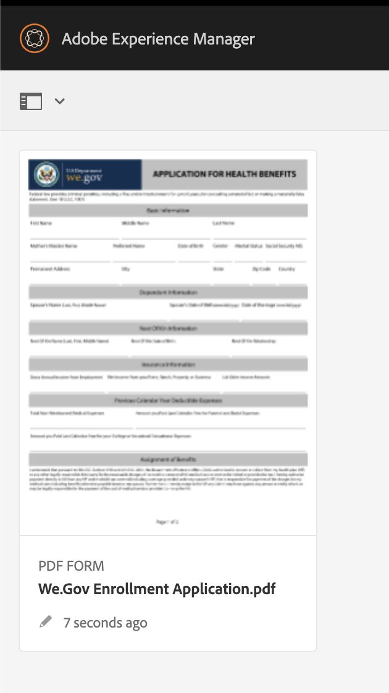
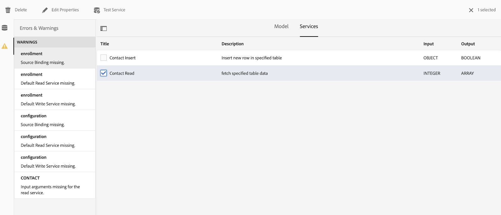

# Genomgång av vår Gov-referenswebbplats {#we-gov-reference-site-walkthrough}

## Krav {#pre-requisites}

Konfigurera referenswebbplatsen enligt beskrivningen i [Konfigurera och konfigurera referenswebbplatsen](../../forms/using/forms-install-configure-gov-reference-site.md)Web.Gov.

## Användarberättelse {#user-story}

* AEM Forms

   * Automatiserad Forms-konvertering
   * Redigering
   * Formulärdatamodeller/datakällor

* AEM Forms

   * Datainhämtning
   * (Valfritt) Dataintegrering (MS Dynamics)
   * (Valfritt) Adobe Sign

* Arbetsflöde
* E-postmeddelanden
* (Valfritt) Kundkommunikation

   * Utskriftskanal
   * Webbkanal

* Adobe Analytics
* Integrering av datakällor

### Fictitious users and groups {#fictitious-users-and-groups}

Demonspaketet We.Gov innehåller följande inbyggda fiktiva användare:

* **Aya Tan**: Medborgare som är berättigad till en tjänst från en myndighet


* **George Lang**: Business Analyst för myndigheter


* **Camila Santos**: Vi.Gov Agency CX Lead


Följande grupper ingår också:

* **Vi.Gov Forms-användare**

   * George Lang (medlem)
   * Camila Santos (medlem)

* **We.Gov-användare**

   * George Lang (medlem)
   * Camila Santos (medlem)
   * Aya Tan (medlem)

### Förklaring av termer i demoöversikt {#demo-overview-terms-legend}

1. **Personifiera**: Definierade användare och grupper i AEM demo.
1. **Knapp**: Färgad rektangel eller inringad pil för navigering.
1. **Klicka**: Så här kör du en åtgärd i användarartikeln.
1. **Länkar**: Finns högst upp på huvudmenyn på webbplatsen We.Gov.
1. **Användarinstruktioner**: En uppsättning numeriska steg som du kan följa när du navigerar i användarens berättelse.
1. **Forms Portal**: *https://&lt;aemserver>:&lt;port>/content/we-gov/formsportal.html*
1. **Mobilvy**:We.Gov-användare som vill replikera en mobilvy med en ny webbläsare.
1. **Skrivbordsvy**: Vi.gov-användare kan se en demo på en bärbar eller stationär dator.
1. **Pre-screener Form**: Formulär på startsidan för webbsidan We.Gov.
1. **Adaptiv form**: Anmälningsansökningsformulär för Web.gov demo.

   *https://&lt;aemserver>:&lt;port>/content/forms/af/adobe-gov-forms/enrollment-application-for-health-benefits.html*

1. **Adobe Web.GOV Site**: *https://&lt;aemserver>:&lt;port>/content/we-gov/home.html*
1. **Inkorgen** Adobe: Ikonen [Bell på den övre menyraden](assets/bell.svg) i AEM.

   *https://&lt;aemserver>:&lt;port>/aem/start.html*

1. **E-postklient**: Önskat sätt att visa e-postmeddelanden (Gmail, Outlook)
1. **CTA**: Uppmaning
1. **Navigera**: Om du vill hitta en specifik referenspunkt på webbläsarsidan.
1. **AFC**: Automatiserad Forms-konvertering

## Automatiserad Forms-konvertering (Camila) {#automated-forms-conversion}

**Detta avsnitt**: Camila the CX Lead har ett befintligt PDF-baserat formulär som användes som en del av en pappersbaserad process. Som en del i en moderniseringssatsning vill hon använda det här PDF-formuläret för att automatiskt skapa en ny modern Adaptiv Forms.

### Automatiserad Forms-konvertering - We.gov (Camila) {#automated-forms-conversion-wegov}

1. Gå till *https://&lt;aemserver>:&lt;port>/aem/start.html*

1. Logga in med:
   * **Användare**: camila.santos
   * **Lösenord**: lösenord
1. På huvudsidan väljer du Forms > Forms &amp; Documents > AEM Forms Web.gov Forms > AFC.
1. Camila överför PDF-filen till AEM Forms.

   

1. Camilla väljer sedan PDF-formuläret och klickar på **Starta automatisk konvertering** för att starta konverteringen. Du kan behöva klicka på **Skriv över konvertering** om du har konverterat formuläret.

   >[!NOTE]
   >
   >Observera att inställningarna i AFC är förkonfigurerade för slutanvändaren, vilket betyder att de inte bör ändras.

   * **Valfritt**: Om du vill använda temat Accessible Ultramarine klickar du bara på Specificera ett adaptivt formulärtema och väljer temat Accessible-Ultramarine som visas i listan med alternativ.

   

   

   Statusen för Procent färdigt visas under konverteringen. När statusen visas **Konverterad** klickar du på **utdatamappen** , markerar det adaptiva formuläret och klickar på **Redigera** för att öppna det konverterade formuläret.

1. Camilla granskar sedan formuläret och ser till att alla fält finns

   

1. Camilla börjar sedan redigera formuläret. Hon väljer Rotpanel > Redigera (skiftnyckel) > väljer Tabbar överst på panellayoutmenyn > markerar kryssrutan.

   

1. Camilla lägger sedan till alla CSS- och fältändringar som behövs för att producera slutprodukten.

   

### Formulärdatamodell och datakällor (Camila) {#data-sources}

**Detta avsnitt**: När dokumentet har konverterats och skapats i ett adaptivt formulär måste Camila sedan ansluta det adaptiva formuläret till en datakälla.

1. Camila öppnar egenskaperna i formuläret som konverterades i [Automated Forms Conversion - We.Gov](#automated-forms-conversion-wegov).

1. Camila väljer sedan Formulärmodell > Väljer formulärdatamodell i listrutan Välj från > Väljer FDM för registrering hos Web.gov i listan med alternativ.

1. Klicka på knappen Spara och stäng.

   

1. Camila klickar på **utdatamappen** , väljer det adaptiva formuläret och klickar på **Redigera** för att öppna det ifyllda formuläret We.Gov.
1. Camila väljer ett adaptivt formulärfält och klickar på Konfigurera. Hon skapar bindning med formulärdatamodellenheter med hjälp av fältet **Bindningsreferens** . Hon upprepar det här steget för alla fält i det anpassade formuläret.

### Testning av formulärtillgänglighet (Camila) {#form-accessibility-testing}

Camila kontrollerar också att det skapade innehållet är korrekt och fullt tillgängligt enligt företagsstandarder.

1. Camila klickar på **utdatamappen** , väljer det adaptiva formuläret och klickar på **Förhandsgranska** för att öppna det färdiga We.Gov-formuläret.

1. Öppnar fliken Granska i Chrome Developer Tool.

1. Utför en tillgänglighetskontroll för att validera det adaptiva formuläret.

   

## Demo av mobilvyn Adaptiv form (Aya) {#mobile-view-demo}

**Detta avsnitt måste utföras före demonstrationen.**

**Användarinstruktioner:**

1. Navigera till: *https://&lt;aemserver>:&lt;port>/content/we-gov/home.html*
1. Logga in med:

   1. **Användare**: aya.tan
   1. **Lösenord**: lösenord

1. Ändra storlek på webbläsarfönstret eller använd webbläsarens emulator för att replikera en mobilenhetsstorlek.

### Webbplats för Web.Gov (Aya) {#aya-user-story-we-gov-website}


**Detta avsnitt**: Aya är medborgare. Hon hör från en vän att hon kan vara berättigad till en tjänst från en myndighet. Aya navigerar till webbsidan We.Gov från sin mobiltelefon för att lära sig mer om tjänster som hon är berättigad till.

### We.GOV Pre-Screener (Aya) {#aya-user-story-we-gov-pre-screener}

Svar på några frågor som bekräftar hennes behörighet genom att fylla i ett kort anpassningsbart formulär på mobiltelefonen.

**Användarinstruktioner:**

1. Gör ett val i varje listruta.

   >[!NOTE]
   >
   >Om användaren tjänar mer än 200 000 USD/år är de inte berättigade.

1. Klicka på&quot;**Är jag berättigad?**” button.
1. Klicka på knappen &quot;**Tillämpa nu**&quot; för att fortsätta.

   

### Adaptiv form (AYA) {#aya-user-story-we-gov-adaptive-form}

Aya får reda på att hon är berättigad och börjar fylla i sin ansökan för att få service på sin mobila enhet.

Du måste granska vissa dokument hemma innan hon kan slutföra tjänstbegäran. Hon sparar och avslutar programmet från sin mobila enhet.

**Användarinstruktioner:**

1. Fyll i de grundläggande informationsfälten, följande är obligatoriska fält och listrutor:

   1. Grundläggande information

      1. Förnamn
      1. Efternamn
      1. DOB
      1. E-post

1. Använd följande **dynamiska logik** för att demonstrera den dynamiska funktionen i listrutan **Familjestatus** :

   1. **En**: Visa nästa dockpanel
   1. **Gift**: Visa äktenskapsberoende panel
   1. **Skilt**: Visa nästa dockpanel
   1. **Ändvis**: Visa nästa dockpanel
   1. **Har du barn?**: (Ja/Nej) om du vill visa den underordnade beroende panelen.

      1. (Lägg till/ta bort) om du vill lägga till/ta bort flera underordnade paneler.

1. Klicka på högerpilen i det grå menyfältet.
1. Klicka på knappen Spara längst ned.

   

## Demo {#desktop-demo}

**Detta avsnitt:** Hemma har Aya hittat den information hon behövde och återupptar programmet från sin dator. Gå till onlineformulärportalen och återuppta hennes ansökan. Med viss enkel anpassning kan man också automatiskt generera och mejla en länk för att återuppta ansökningen.

### Fortsatt adaptiv form (AYA) {#aya-user-story-continued-adaptive-form}

**Användarinstruktioner:**

1. Gå till *https://&lt;aemserver>:&lt;port>/content/we-gov/home.html*
1. Välj klicka på&#x200B;**Onlinetjänster** i navigeringsfältet.
1. På panelen Utkast till Forms väljer du det befintliga programmet för hälsoförmåner.

   

   Utseendet och känslan är desamma, och hon behöver inte ange några data igen.

   **Användarinstruktioner:**

1. Klicka på höger cirkel CTA för att gå till nästa avsnitt.

   

   Formuläret fylls i fram till den punkt där Aya senast fyllde i. Aya har angett alla hennes uppgifter och är redo att skicka in.

   

   >[!NOTE]
   >
   >När Aya fyller i telefonnummerfältet måste hon fylla i det som ett kontinuerligt 11-siffrigt nummer utan bindestreck, blanksteg eller bindestreck.

   När du har skickat in Aya får du en tacksida. Hon kan också få ett mejl som hon kan öppna för att signera urkunder elektroniskt med Adobe Sign.

### Valfritt: Adobe Sign (Aya) {#adobe-sign}

**Användarinstruktioner:**

1. Navigera till din e-postklient och hitta e-postadressen till Adobe Sign.
1. Klicka på länken till Adobe Sign.

   

**Användarinstruktioner:**

1. Markera rutan &quot;**Jag godkänner**&quot;.
1. Klicka på&#x200B;**Godkänn**.
1. Rulla längst ned i det granskade dokumentet.
1. Klicka på den markerade gula fliken för att signera dokumentet.

    

## Statlig agent (George) {#government-agent-george}


**Detta avsnitt:** George är affärsanalytiker på den statliga myndigheten Aya begär en tjänst från. George har en enda kontrollpanel där han kan se alla serviceförfrågningar som han har tilldelats för granskning.

### AEM Inkorg (George) {#george-user-story-aem-inbox}

**Användarinstruktioner:**

1. Gå till *https://&lt;aemserver>:&lt;port>/aem/start.html*
1. Klicka på användarikonen (övre högra hörnet) och använd menyalternativet **Logga ut** eller **Personifiera som** om du är inloggad med en administrativ användare.

   1. Logga in med:

      1. **Användare:** george.lang
      1. **Lösenord:** lösenord
   1. Eller personifiera:

      1. Skriv&quot;**George**&quot; i fältet&quot;**Personifiera som**&quot;.

      1. Klicka OK för att personifiera.


1. Klicka på ikonen Meddelande (klockan) i det övre högra hörnet.
1. Klicka på&#x200B;**Visa alla** för att gå till Inkorgen.
1. Öppna den senaste aktiviteten &quot;**Health Benefits Application Review**&quot; i Inkorgen.

   

### Valfritt: AEM Inbox &amp; MS Dynamics (George) {#george-user-story-aem-inbox-and-ms-dynamics}

Tack vare dataintegreringar och automatiserade arbetsflöden visas Ayas program tillsammans med en CRM-post som automatiskt har genererats när data skickades.

**Användarinstruktioner:**

1. Öppna och inspektera det skrivskyddade anpassningsbara formuläret.
1. Klicka på knappen &quot;**Öppna MS Dynamics**&quot; för att öppna MS Dynamics-posten i ett nytt fönster.
1. I CRM kan du se att all information kan uppdateras

   1. Du kan också lägga till några granskningsanteckningar direkt i Dynamics.

1. Stäng och gå tillbaka till AEM Inkorg.

   

### Tillbaka till AEM Inkorg (George) {#george-user-story-back-to-aem-inbox}

George godkänner Ayas ansökan, och tack vare ett befintligt automatiserat arbetsflöde skickas även ett bekräftelsemeddelande via e-post till Aya.

**Användarinstruktioner:**

1. Navigera till det övre vänstra hörnet och klicka på&#x200B;**Godkänn** för att godkänna programmet.
1. I modala medier kan du lämna ett meddelande till CX-leadet.
1. Klicka på Klar.
1. (Medborgarroll) Öppna din e-postklient för att visa e-postmeddelandet som skickats till Aya.

   

## CX Lead (Camila) {#cx-lead-camila}


**Detta avsnitt:** Camila på CX Lead ringer ett välkomstsamtal med Aya för att förklara hur man använder de myndighetstjänster hon har godkänts för.

### (Valfritt) AEM Inbox &amp; MS Dynamics {#camila-user-story-aem-inbox-ms-dynamics}

**Användarinstruktioner:**

1. Gå till *https://&lt;aemserver>:&lt;port>/aem/start.html*
1. Klicka på användarikonen (övre högra hörnet) och använd menyalternativet **Logga ut** eller **Personifiera som** om du är inloggad med en administrativ användare.

   1. Logga in med:

      1. **Användare**: camila.santos
      1. **Lösenord**: lösenord
   1. Eller personifiera:

      1. Skriv&quot;**Camila**&quot; i fältet&quot;**Impersonate as**&quot;.

      1. Klicka OK för att personifiera.


1. Klicka på ikonen Meddelande (klockan) i det övre högra hörnet.
1. Klicka på&#x200B;**Visa alla** för att gå till Inkorgen.
1. Öppna den senaste aktiviteten&quot;**Nytt kontaktgodkännande**&quot; i Inkorgen.


**(Valfritt) Användarinstruktioner:**

1. Öppna och inspektera det skrivskyddade anpassningsbara formuläret.
1. Klicka på knappen &quot;**Öppna MS Dynamics**&quot; för att öppna MS Dynamics-posten i ett nytt fönster.
1. I CRM kan du se att all information kan uppdateras

   1. Du kan också lägga till en ny samtalsaktivitet direkt i Dynamics.
   1. Öppna avsnittet **Verksamheter**.
   1. Klicka på alternativet&quot;**Nytt telefonsamtal**&quot;.
   1. Lägg till telefonsamtalsinformation.
   1. Spara och stäng fönstret.

1. Gå AEM till det övre vänstra hörnet och klicka på&#x200B;**Skicka** för att skicka programmet.
1. I modala medier kan du lämna ett meddelande.
1. Klicka på Klar.

    Aktiviteter 

## (Valfritt) Välkomstpaket (Aya) {#welcome-kit-citizen-aya}

**Detta avsnitt:** Aya får ett e-postmeddelande med en länk till ett interaktivt meddelande som sammanfattar hennes fördelar och även innehåller formulärfält som ska fyllas i. Med PDF-förmånsutdrag bifogat och länk till interaktivt brev i e-postmeddelandet (med samma tema/varumärke som det interaktiva meddelandet).

### E-postklientmeddelande (AYA) {#aya-user-story-email-client}

**Användarinstruktioner:**

1. Leta reda på och öppna e-postmeddelandet om välkomstpaketet.
1. Bläddra till bifogad PDF-fil längst ned på sidan.
1. Klicka för att öppna den bifogade PDF-filen.
1. Bläddra tillbaka i e-postklienten och klicka på&#x200B;**Visa välkomstkit online**.

   1. Då öppnas webbkanalversionen av samma dokument.

1. En snabb referens till PDF:

   *https://&lt;aemserver>:&lt;port>/aem/formdetails.html/content/dam/formsanddocuments/adobe-gov-forms/welcome-handbook/we-gov-welcome-handbook*

1. En snabb referens till IC direkt:

   *https://&lt;port>/content/dam/formsanddocuments/adobe-gov-forms/welcome-handbook/we-gov-welcome-handbook/jcr:content?channel=web&amp;mode=preview&amp;wcmmode=disabled*

    för 

## Påminnelse om förnyelse - medborgare (Aya) {#renewal-reminder-citizen-aya}

**Detta avsnitt:** Camila schemalägger också en påminnelse så ett år senare. (Arbetsflödessteg som automatiserar/kör och skickar e-post).

### E-postklientmeddelande (AYA) {#aya-user-story-email-client-updated}

**Användarinstruktioner:**

1. Navigera till din e-postklient.
1. Leta reda på och öppna e-postmeddelandet med en påminnelse om förnyelse.
1. Klicka på knappen&quot;**Skicka ett nytt program**&quot; för att öppna det anpassade formuläret.

   1. Detta avsnitt är avsiktligt tomt för att stödja förifyllning av data i fas 2.

   

## (Valfritt) Formulärdatamodell (Camila) {#form-data-model}

**Detta avsnitt**: Camila navigerar till AEM Forms Data Integrations där hon kan göra ett snabbt test för att se att den information som skickas till den externa datakällan via integrering med formulärdatamodellen verkligen finns.

### Formulärdatamodell (Camila) {#form-data-model-camila}

**Detta avsnitt**: Camila navigerar till sidan Datakällor för att validera data som servern har replikerat i Derby-databasen.

1. När användarupplevelsen är klar och användarinlämningen är klar navigerar Camila till fliken Datakällor i AEM Forms (**Forms** > **Dataintegreringar**).

1. Camila väljer sedan AEM Forms **We.gov FDM** och redigerar sedan **We.gov Enrollment FDM**.

1. Camila väljer sedan den **kontakt** > **lästjänst** som ska testas.

   

1. Camila förser sedan testtjänsten med ett kontakt-ID och klickar sedan på knappen Test. Exempel: 1 eller 2, om du har skickat in formuläret. Om du inte har skickat formuläret returneras inga data.

   

1. Camila kan sedan validera att data har infogats i datakällan.

   * Uppgifterna i Derby DS liknar följande format:

   ```xml
      [
         {
         "ADDRESS_COUNTRY": "USA",
         "LAST_NAME": "Tan",
         "ADDRESS_CITY": "New York",
         "FIRST_NAME": "Aya",
         "ADDRESS_STATE": "AL",
         "ADDRESS_LINE1": "123 Street crescent",
         "GENDER_CODE": "2",
         "ADDRESS_LINE2": "123 Street crescent",
         "ADDRESS_POSTAL_CODE": "90210",
         "BIRTH_DATE": "1991-12-12",
         "CONTACT_ID": 1,
         "MIDDLE_NAME": "M",
         "HAS_CHILDREN_CODE": "0"
         }
   ]
   ```

## (Valfritt) Analytics (Camila) {#analytics-cx-lead-camila}

**Detta avsnitt:** Camila navigerar till en kontrollpanel där hon kan se nyckeltal från olika myndigheter, t.ex. procent av de medborgare som börjar fylla i ett formulär och överge det, den genomsnittliga tiden från att begära in det till svar på ansökan om godkännande/avslag, och engagemangsstatistik för de förmånsböcker hon har skickat till medborgarna.

### Adobe Analytics Sites Reporting (Camila) {#camila-reviews-sites-reporting-we-gov-adobe-analytics}

1. Gå till *https://&lt;aemserver>:&lt;port>/sites.html/content*
1. Välj&quot;**AEM Forms Web.Gov Site**&quot; för att visa webbplatssidorna.
1. Välj en av webbplatssidorna (t.ex. Hem) och välj&quot;**Analytics &amp; Recommendations**&quot;.

   

1. På den här sidan ser du hämtad information från Adobe Analytics som gäller AEM Sites (OBS: den här informationen uppdateras regelbundet från Adobe Analytics och visas inte i realtid).

   

1. På sidan för sidvisning (som du kommer åt i steg 3.0) kan du även visa sidvisningsinformationen genom att ändra visningsinställningen så att objekt i **listvyn** visas.
1. Leta upp listrutan **Visa** och välj **Listvy**.

   

1. På samma meny väljer du &quot;**Visningsinställning**&quot; och markerar de kolumner som du vill visa under &quot;**Analytics**&quot;.

   

1. Klicka på&#x200B;**Uppdatera** för att göra de nya kolumnerna tillgängliga.

   

### Adobe Analytics Forms Reporting (Camila) {#camila-reviews-forms-reporting-we-gov-adobe-analytics}

1. Navigera till

   *https://&lt;aemserver>:&lt;port>/aem/forms.html/content/dam/formsanddocuments/adobe-gov-forms*

1. Välj anpassningsformuläret &quot;**Registreringsprogram för hälsoförmåner**&quot; och välj alternativet &quot;**Analysrapport**&quot;.

   

1. Vänta tills sidan har lästs in och visa analysrapportdata.

   

