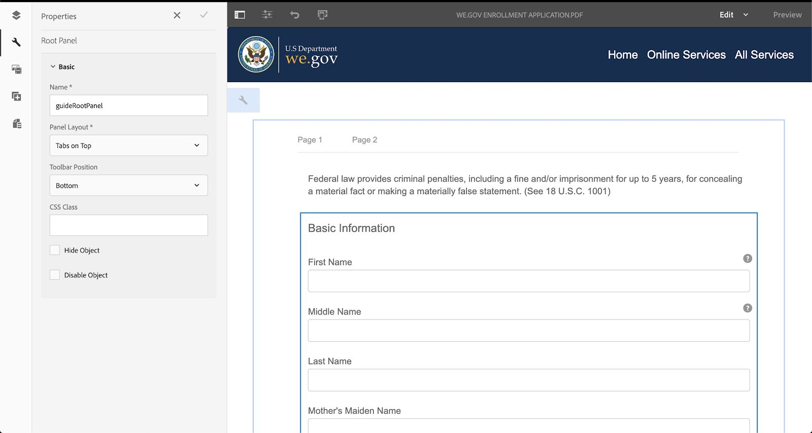

# Genomgång av referenswebbplatser för Web.Gov och We.Finance {#we-gov-reference-site-walkthrough}

## Krav {#pre-requisites}

Konfigurera referenswebbplatsen enligt beskrivningen i [Konfigurera och konfigurera referenswebbplatsen Web.Gov och We.Finance](../../forms/using/forms-install-configure-gov-reference-site.md).

## Användarberättelse {#user-story}

* AEM Forms

   * Automated forms conversion
   * Redigering
   * Formulärdatamodeller/datakällor

* AEM Forms

   * Datainhämtning
   * (Valfritt) Dataintegrering (MS® Dynamics)
   * (Valfritt) Adobe Sign

* Arbetsflöde
* E-postmeddelanden
* (Valfritt) Kundkommunikation

   * Utskriftskanal
   * Webbkanal

* Adobe Analytics
* Data Source Integrations

### Faktiska användare och grupper {#fictitious-users-and-groups}

Demonspaketet We.Gov innehåller följande inbyggda fiktiva användare:

* **Aya Tan**: En person som är berättigad till en tjänst från en myndighet


* **George Lang**: Business Analyst på Web.Gov-byrån


* **Camila Santos**: Vi.Gov Agency CX Lead


Följande grupper ingår också:

* **We.GOV Forms Users**

   * George Lang (medlem)
   * Camila Santos (medlem)

* **We.GOV Users**

   * George Lang (medlem)
   * Camila Santos (medlem)
   * Aya Tan (medlem)

### Förklaring av termer i demoöversikt {#demo-overview-terms-legend}

1. **Personifiera**: Definierade användare och grupper i AEM demo.
1. **Knapp**: Färgad rektangel eller inringad pil för navigering.
1. **Klicka**: Om du vill köra en åtgärd i användarartikeln.
1. **Länkar**: Högst upp på huvudmenyn på webbplatsen Web.Gov.
1. **Användarinstruktioner**: En uppsättning numeriska steg som ska följas när användaren navigerar i användarens berättelse.
1. **Forms Portal**: *https://&lt;aemserver>:&lt;port>/content/we-gov/formsportal.html*
1. **Mobilvy**:Vi.Gov-användare för att replikera en mobilvy med en webbläsare som har ändrat storlek.
1. **Skrivbordsvy**: We.gov användare för att visa en demo på en bärbar eller stationär dator.
1. **Pre-screener Form**: Formulär på startsidan för Web.Gov-webbplatsen.
1. **Anpassat formulär**: Registreringsansökningsformulär för We.gov.

   *https://&lt;aemserver>:&lt;port>/content/forms/af/adobe-gov-forms/enrollment-application-for-health-benefits.html*

1. **Adobe We.GOV Site**: *https://&lt;aemserver>:&lt;port>/content/we-gov/home.html*
1. **Inkorgen för Adobe**: Den översta menyraden [Bellikon](assets/bell.svg) finns i AEM.

   *https://&lt;aemserver>:&lt;port>/aem/start.html*

1. **E-postklient**: Önskat sätt att visa e-postmeddelanden (Gmail, Outlook)
1. **CTA**: Call to action
1. **Navigera**: Om du vill hitta en specifik referenspunkt på webbläsarsidan.
1. **AFC**: Automated forms conversion

## Automated forms conversion (Camila) {#automated-forms-conversion}

**Det här avsnittet**: CX-leadet i Camila har ett befintligt PDF-baserat formulär som användes som en del av en pappersbaserad process. Som en del av en moderniseringssatsning vill Camila använda det här PDF-formuläret för att automatiskt skapa en modern Adaptiv Forms.

### Automated forms conversion - We.GOV (Camila) {#automated-forms-conversion-wegov}

1. Navigera till *https://&lt;aemserver>:&lt;port>/aem/start.html*

1. Logga in med:
   * **Användare**: camila.santos
   * **Lösenord**: lösenord
1. På huvudsidan väljer du Forms > Forms &amp; Documents > AEM Forms We.gov Forms > AFC.
1. Camila överför PDF till AEM Forms.

   

1. Camilla markerar sedan formuläret PDF och klickar på **Starta automatisk konvertering** för att starta konverteringen. Du kan behöva klicka på **Skriv över konvertering** om du har konverterat formuläret.

   >[!NOTE]
   >
   >Inställningarna i AFC är förkonfigurerade för slutanvändaren, vilket betyder att de inte ska ändras.

   * **Valfritt**: Om du vill använda det hjälpmedelsanpassade Ultramarine-temat klickar du bara på Ange ett anpassat formulärtema och väljer det hjälpmedelsanpassade Ultramarine-tema som visas i listan med alternativ.

   

   

   Statusen för Procent färdigt visas under konverteringen. När statusen är **Konverterad** klickar du på mappen **output**, markerar det adaptiva formuläret och klickar på **Redigera** för att öppna det konverterade formuläret.

1. Camilla granskar sedan formuläret och ser till att alla fält finns

   

1. Camilla börjar sedan redigera formuläret och väljer Rotpanel > Redigera (skiftnyckel) > väljer Tabbar överst på panellayoutmenyn > markerar kryssrutan.

   

1. Camilla lägger sedan till alla CSS- och fältändringar som behövs för att producera slutprodukten.

   

### Formulärdatamodell och datakällor (Camila) {#data-sources}

**Det här avsnittet**: När dokumentet har konverterats och skapats med ett adaptivt formulär måste Camila ansluta det adaptiva formuläret till en datakälla.

1. Camila öppnar egenskaperna för formuläret som har konverterats i [Automated forms conversion - We.Gov](#automated-forms-conversion-wegov).

1. Camila väljer sedan Formulärmodell > Väljer formulärdatamodell i listrutan Välj från > Väljer We.gov för registrering i listan över alternativ.

1. Klicka på Spara och stäng.

   

1. Camila klickar på mappen **output**, väljer det adaptiva formuläret och klickar på **Redigera** för att öppna det färdiga webbformuläret.
1. Camila väljer ett adaptivt formulärfält och klickar på ikonen  och skapar bindning med entiteterna i formulärdatamodellen med fältet **Bindningsreferens** . Camila upprepar det här steget för alla fält i det adaptiva formuläret.

### Testning av formulärtillgänglighet (Camila) {#form-accessibility-testing}

Camila kontrollerar också att det skapade innehållet är korrekt och fullt tillgängligt enligt företagsstandarder.

1. Camila klickar på mappen **output**, väljer det adaptiva formuläret och klickar på **Preview** för att öppna det färdiga webbformuläret.

1. Öppnar granskningsfliken i Chrome Developer Tool.

1. Utför en tillgänglighetskontroll för att validera det adaptiva formuläret.

   

## Demo av mobilvyn Adaptiv form (Aya) {#mobile-view-demo}

**Det här avsnittet måste utföras före demonstrationen.**

**Användarinstruktioner:**

1. Navigera till: *https://&lt;aemserver>:&lt;port>/content/we-gov/home.html*
1. Logga in med:

   1. **Användare**: aya.tan
   1. **Lösenord**: lösenord

1. Ändra storlek på webbläsarfönstret eller använd webbläsarens emulator för att replikera en mobilenhetsstorlek.

### Webbplats för Web.Gov (Aya) {#aya-user-story-we-gov-website}


**Det här avsnittet**: Aya är medborgare och hör från en vän som kan ha rätt att få en tjänst från en myndighet. Aya navigerar till webbsidan We.Gov från sin mobiltelefon för att lära sig mer om tjänster som hon är berättigad till.

### We.GOV Pre-Screener (Aya) {#aya-user-story-we-gov-pre-screener}

Svar på några frågor som bekräftar hennes behörighet genom att fylla i ett kort anpassningsbart formulär på mobiltelefonen.

**Användarinstruktioner:**

1. Gör ett val i varje listruta.

   >[!NOTE]
   >
   >Om användaren tjänar mer än 200 000 USD/år är de inte berättigade.

1. Klicka på **Är jag berättigad?**.
1. Klicka på **Använd nu** för att fortsätta.

   

### Adaptiv form (AYA) {#aya-user-story-we-gov-adaptive-form}

Aya får reda på att hon är berättigad och börjar fylla i sin ansökan för att få service på sin mobila enhet.

Du måste granska vissa dokument hemma innan hon kan fylla i serviceförfrågningen. Hon sparar och avslutar programmet från sin mobila enhet.

**Användarinstruktioner:**

1. Fyll i de grundläggande informationsfälten, följande är obligatoriska fält och listrutor:

   1. Grundläggande information

      1. Förnamn
      1. Efternamn
      1. DOB
      1. E-post

1. Använd följande **dynamiska logik** för att demonstrera den dynamiska funktionen i listrutan **Familjestatus**:

   1. **Enskild**: Visa nästa panel
   1. **Gift**: Visa äktenskapsberoende panel
   1. **Skilt**: Visa nästa panel
   1. **Ändrad**: Visa nästa panel
   1. **Har du barn?**: (Ja/Nej) om du vill visa den underordnade beroende panelen.

      1. (Lägg till/ta bort) om du vill lägga till/ta bort flera underordnade paneler.

1. Klicka på högerpilen i det grå menyfältet.
1. Klicka på knappen Spara längst ned.

   

## Demo {#desktop-demo}

**Det här avsnittet:** Hemma har Aya hittat den information hon behövde och återtar programmet från sin dator. Aya navigerar till Forms-portalen online för att återuppta sin tillämpning. Med viss enkel anpassning kan man också automatiskt generera och mejla en länk för att återuppta ansökningen.

### Fortsatt adaptiv form (AYA) {#aya-user-story-continued-adaptive-form}

**Användarinstruktioner:**

1. Navigera till *https://&lt;aemserver>:&lt;port>/content/we-gov/home.html*
1. Välj **Onlinetjänster** i navigeringsfältet.
1. På panelen Utkast till Forms väljer du det befintliga programmet för hälsoförmåner.

   

   Utseendet och känslan är desamma, och hon behöver inte skriva in några data igen.

   **Användarinstruktioner:**

1. Högerklicka på Circle CTA för att gå till nästa avsnitt.

   

   Formuläret fylls i fram till den punkt där Aya senast anmälde sig. Aya har angett alla hennes uppgifter och är redo att skicka in.

   

   >[!NOTE]
   >
   >När Aya fyller i telefonnummerfältet måste hon fylla i det som ett kontinuerligt 11-siffrigt nummer utan bindestreck, mellanslag eller bindestreck.

   När Aya har skickat in en sida med tack. Aya kan också få ett e-postmeddelande som hon kan öppna för att signera urkunder elektroniskt med Adobe Sign.

### Tillval: Adobe Sign (Aya) {#adobe-sign}

**Användarinstruktioner:**

1. Navigera till din e-postklient och hitta Adobe Sign e-postadress.
1. Klicka på länken till Adobe Sign.

   

**Användarinstruktioner:**

1. Kontrollera **Jag godkänner**.
1. Klicka på **Acceptera**.
1. Rulla längst ned i det granskade dokumentet.
1. Klicka på den markerade gula fliken så att du kan signera dokumentet.

    

## Statlig agent (George) {#government-agent-george}


**Det här avsnittet:** George är affärsanalytiker på myndigheten Aya begär en tjänst från. George har en enda kontrollpanel där han kan se alla serviceförfrågningar som han har tilldelats för granskning.

### AEM Inkorg (George) {#george-user-story-aem-inbox}

**Användarinstruktioner:**

1. Navigera till *https://&lt;aemserver>:&lt;port>/aem/start.html*
1. Klicka på användarikonen (det övre högra hörnet) och använd menyalternativet **Logga ut** eller **Personifiera som** om du är inloggad med en administrativ användare.

   1. Logga in med:

      1. **Användare:** george.lang
      1. **Lösenord:** lösenord

   1. Eller personifiera:

      1. Skriv `George` i fältet **Personifiera som**.

      1. Klicka OK för att personifiera.

1. Klicka på ikonen Meddelande (klockan) i det övre högra hörnet.
1. Klicka på **Visa alla** för att navigera till Inkorgen.
1. Öppna den senaste **hälsobidragsprogramgranskningen**-aktiviteten i Inkorgen.

   

### Valfritt: AEM Inbox &amp; MS® Dynamics (George) {#george-user-story-aem-inbox-and-ms-dynamics}

Tack vare dataintegreringar och automatiserade arbetsflöden visas Ayas program tillsammans med en CRM-post som automatiskt har genererats när data skickades.

**Användarinstruktioner:**

1. Öppna och inspektera det skrivskyddade anpassningsbara formuläret.
1. Klicka på **Öppna MS® Dynamics** för att öppna MS® Dynamics-posten i ett nytt fönster.
1. I CRM visas all information som kan uppdateras.

   1. Du kan också lägga till några granskningsanteckningar direkt i Dynamics.

1. Stäng och gå tillbaka till AEM Inkorg.

   

### Tillbaka till AEM Inkorg (George) {#george-user-story-back-to-aem-inbox}

George godkänner Ayas ansökan, och tack vare ett befintligt automatiserat arbetsflöde skickas även ett bekräftelsemeddelande via e-post till Aya.

**Användarinstruktioner:**

1. Navigera till det övre vänstra hörnet och klicka på **Godkänn** för att godkänna programmet.
1. I modala medier kan du lämna ett meddelande till CX-leadet.
1. Klicka på Klar.
1. (Medborgarroll) Öppna din e-postklient för att visa e-postmeddelandet som skickats till Aya.

   

## CX Lead (Camila) {#cx-lead-camila}


**Det här avsnittet:** Camila the CX Lead skapar ett välkomstsamtal med Aya för att förklara hur hon använder myndighetstjänster som hon har godkänts för.

### (Valfritt) AEM Inbox &amp; MS® Dynamics {#camila-user-story-aem-inbox-ms-dynamics}

**Användarinstruktioner:**

1. Navigera till *https://&lt;aemserver>:&lt;port>/aem/start.html*
1. Klicka på användarikonen (det övre högra hörnet) och använd menyalternativet **Logga ut** eller **Personifiera som** om du är inloggad med en administrativ användare.

   1. Logga in med:

      1. **Användare**: camila.santos
      1. **Lösenord**: lösenord

   1. Eller personifiera:

      1. Skriv `Camila` i fältet **Personifiera som**.

      1. Klicka OK för att personifiera.

1. Klicka på ikonen Meddelande (klockan) i det övre högra hörnet.
1. Klicka på **Visa alla** för att navigera till Inkorgen.
1. Öppna den senaste **nya kontaktgodkännandeåtgärden** i Inkorgen.


**(Valfritt) Användarinstruktioner:**

1. Öppna och inspektera det skrivskyddade anpassningsbara formuläret.
1. Klicka på **Öppna MS® Dynamics** för att öppna MS® Dynamics-posten i ett nytt fönster.
1. I CRM kan du se all information som kan uppdateras.

   1. Du kan också lägga till en samtalsaktivitet direkt i Dynamics.
   1. Öppna avsnittet **Aktiviteter**.
   1. Klicka på **Nytt telefonsamtal**.
   1. Lägg till telefonsamtalsinformation.
   1. Spara och stäng fönstret.

1. Gå AEM till det övre vänstra hörnet och klicka på **Skicka** för att skicka programmet.
1. I modala medier kan du lämna ett meddelande.
1. Klicka på Klar.

    

## (Valfritt) Välkomstpaket (Aya) {#welcome-kit-citizen-aya}

**Det här avsnittet:** Du får ett e-postmeddelande som innehåller en länk till ett interaktivt meddelande som sammanfattar hennes fördelar och även innehåller formulärfält som ska fyllas i. Med PDF Benefits Statement bifogat och länk till interaktivt kommunikationsbrev i e-postmeddelandet (med samma tema/varumärke som det interaktiva meddelandet).

### E-postklientmeddelande (AYA) {#aya-user-story-email-client}

**Användarinstruktioner:**

1. Leta reda på och öppna e-postmeddelandet om välkomstpaketet.
1. Bläddra till den bifogade PDF-filen längst ned på sidan.
1. Klicka för att öppna den bifogade filen PDF.
1. Bläddra tillbaka i e-postklienten och klicka på **Visa välkomstpaketet online**.

   1. Då öppnas webbkanalversionen av samma dokument.

1. En snabb referens till PDF direkt:

   *https://&lt;aemserver>:&lt;port>/aem/formdetails.html/content/dam/formsanddocuments/adobe-gov-forms/welcome-handbook/we-gov-welcome-handbook*

1. En snabb referens till IC direkt:

   *https://&lt;aemserver>:&lt;port>/content/dam/formsanddocuments/adobe-gov-forms/welcome-handbook/we-gov-welcome-handbook/jcr:content?channel=web&amp;mode=preview&amp;wcmmode=disabled*

    

## Påminnelse om förnyelse - medborgare (Aya) {#renewal-reminder-citizen-aya}

**Det här avsnittet:** Camila schemalägger även en påminnelse så ett år senare. (Arbetsflödessteg som automatiserar/kör och skickar e-post).

### E-postklientmeddelande (AYA) {#aya-user-story-email-client-updated}

**Användarinstruktioner:**

1. Navigera till din e-postklient.
1. Leta reda på och öppna e-postmeddelandet med en påminnelse om förnyelse.
1. Klicka på **Skicka in ett nytt program** så att du kan öppna det anpassade formuläret.

   1. Detta avsnitt är avsiktligt tomt för att stödja förifyllning av data i fas 2.

   

## (Valfritt) Formulärdatamodell (Camila) {#form-data-model}

**Det här avsnittet**: Camila navigerar till AEM Forms Data Integrations där hon kan göra ett snabbt test för att se att det finns information som skickas till den externa datakällan via integrering med formulärdatamodellen.

### Formulärdatamodell (Camila) {#form-data-model-camila}

**Det här avsnittet**: Camila navigerar till sidan Datakällor för att validera data som servern har replikerat i Derby-databasen.

1. När användarupplevelsen är klar och användaröverföringen är klar går Camila till fliken Datakällor i AEM Forms (**Forms** > **Dataintegreringar**)

1. Camila väljer sedan AEM Forms We.gov FDM och redigerar sedan **We.gov Enrollment FDM**.

1. Camila väljer sedan den **kontakt** > **Lästjänst** som ska testas.

   

1. Camila förser sedan testtjänsten med ett kontakt-ID och klickar sedan på **Test**. Exempel: 1 eller 2, om du har skickat in formuläret. Om du inte har skickat formuläret returneras inga data.

   

1. Camila kan sedan validera att data har infogats i datakällan.

   * Uppgifterna i Derby DS liknar följande format:

   ```xml
      [
         {
         "ADDRESS_COUNTRY": "USA",
         "LAST_NAME": "Tan",
         "ADDRESS_CITY": "New York",
         "FIRST_NAME": "Aya",
         "ADDRESS_STATE": "AL",
         "ADDRESS_LINE1": "123 Street crescent",
         "GENDER_CODE": "2",
         "ADDRESS_LINE2": "123 Street crescent",
         "ADDRESS_POSTAL_CODE": "90210",
         "BIRTH_DATE": "1991-12-12",
         "CONTACT_ID": 1,
         "MIDDLE_NAME": "M",
         "HAS_CHILDREN_CODE": "0"
         }
   ]
   ```

## (Valfritt) Analytics (Camila) {#analytics-cx-lead-camila}

**Det här avsnittet:** Camila navigerar till en kontrollpanel där hon kan se nyckeltal för olika myndigheter, t.ex. procent av de medborgare som börjar fylla i ett formulär och överge en serviceförfrågan, genomsnittlig tid från att begära in en ansökan till ett svar på en ansökan om godkännande/avslag, och engagemangsstatistik för de förmånsböcker som hon har skickat till medborgarna.

### Adobe Analytics Sites Reporting (Camila) {#camila-reviews-sites-reporting-we-gov-adobe-analytics}

1. Navigera till *https://&lt;aemserver>:&lt;port>/sites.html/content*
1. Välj **AEM Forms Web.Gov Site** om du vill visa webbplatssidorna.
1. Välj en av webbplatssidorna (till exempel Home) och välj **Analytics &amp; Recommendations**.

   

1. På den här sidan ser du hämtad information från Adobe Analytics som gäller för AEM Sites-sidan (Obs! Den här informationen uppdateras regelbundet från Adobe Analytics och visas inte i realtid).

   

1. Tillbaka på sidan för sidvisning (som du kom åt i steg 3.) kan du även visa sidvyinformationen genom att ändra visningsinställningen så att objekt visas i **listvyn**.
1. Leta reda på listrutan **Visa** och välj **Listvy**.

   

1. Välj **Visningsinställning** på samma meny och markera de kolumner som du vill visa i avsnittet **Analytics**.

   

1. Klicka på **Uppdatera** för att göra de nya kolumnerna tillgängliga.

   

### Adobe Analytics Forms Reporting (Camila) {#camila-reviews-forms-reporting-we-gov-adobe-analytics}

1. Navigera till

   *https://&lt;aemserver>:&lt;port>/aem/forms.html/content/dam/formsanddocuments/adobe-gov-forms*

1. Välj det anpassade formuläret **Registreringsprogram för hälsoförmåner** och välj alternativet **Analysrapport**.

   

1. Vänta tills sidan har lästs in och visa analysrapportdata.

   
