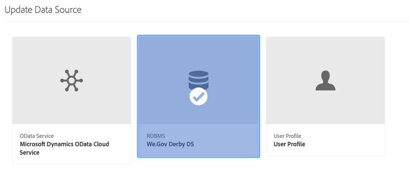
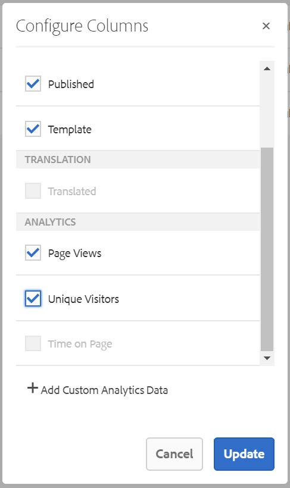
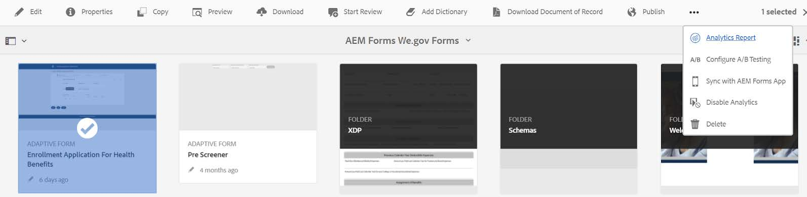

# Konfigurera referenswebbplatsen för Web.Gov {#set-up-and-configure-we-gov-reference-site}

## Information om demopaket {#demo-package-details}

### Installationskrav {#installation-prerequisites}

Paketet skapades för **AEM Forms 6.4 OSGI Author**, har testats och stöds därför i följande plattformsversioner:

| AEM VERSION | AEM FORMS PACKAGE VERSION | STATUS |
|---|---|---|
| 6.4 | 5.0.86 | **Stöds** |
| 6.5 | 6.0.80 | **Stöds** |
| 6.5.3 | 6.0.122 | **Stöds** |

Paketet innehåller en molnkonfiguration som stöder följande plattformsversioner:

| MOLNLEVERANTÖR | SERVICEVERSION | STATUS |
|---|---|---|
| Adobe Sign | v5 API | **Stöds** |
| Microsoft Dynamics 365 | 1710 (9.1.0.3020) | **Stöds** |
| Adobe Analytics | v1.4 Rest API | **Stöds** |
**Paketinstallationshänsyn:**

* Paketet förväntas installeras på en ren server, utan andra demopaket eller äldre versioner av demopaket
* Paketet förväntas installeras på en OSGI-server som körs i redigeringsläge

### Vad innehåller det här paketet? {#what-does-this-package-include}

AEM Forms We.Gov demopaket (**we-gov-forms.pkg.all-&lt;version>.zip**) levereras som ett paket som innehåller flera andra underpaket och tjänster. Paketet innehåller följande moduler:

* **we-gov-forms.pkg.all-&lt;version>.zip** - *Fullständigt demopaket*

   * **we-gov-forms.ui.apps-&lt;version>.zip** *- Innehåller alla komponenter, klientbibliotek, exempelanvändare, arbetsflödesmodeller osv.*

      * **we-gov-forms.core-&lt;version>.jar** - *Innehåller alla OSGI-tjänster, anpassad implementering av arbetsflödessteg osv.*

      * **we-gov-forms.derby&lt;version>.jar** - *Innehåller alla OSGI-tjänster, databasschema osv.*

      * **core.wcm.components.all-2.0.4.zip** - *Samling av WCM-exempelkomponenter*

      * **grid-aem.ui.apps-1.0-SNAPSHOT.zip** - *AEM Sites stödrasterlayoutpaket för kolumnkontroll för webbplatser*
   * **we-gov-forms.ui.content-&lt;version>.zip** - *Innehåller allt innehåll, alla sidor, bilder, formulär, interaktiva kommunikationsresurser osv.*

   * **we-gov-forms.ui.analytics-&lt;version>.zip** - *Innehåller alla Web.Gov Forms Analytics-data som ska lagras i databasen.*

   * **we-gov-forms.config.public-&lt;version>.zip** - *Innehåller alla standardkonfigurationsnoder inklusive platshållarmolnkonfigurationer för att undvika problem med formulärdatamodell och tjänstbindning.*

De tillgångar som ingår i detta paket omfattar:

* AEM-webbplatssidor med redigerbara mallar
* AEM Forms Adaptiva former
* AEM Forms Interactive Communications (Print and Web Channel)
* AEM Forms XDP-dokument för inspelning
* AEM Forms MS Dynamics Forms-datamodell
* Integrering med Adobe Sign
* AEM Workflow Model
* Exempelbilder för AEM Assets
* Exempel (i minnet) på Apache Derby-databas
* Apache Derby-datakälla (för användning med formulärdatamodell)

## Installation av demopaket {#demo-package-installation}

Det här avsnittet innehåller information om hur du installerar demopaketet.

### Från paketresurs {#from-package-share}

1. Gå till *https://&lt;aemserver>:&lt;port>/crx/packageshare/*

   Du kan också klicka på Distribution i AEM och navigera till ikonen Paketdelning.

   

1. Logga in med Adobe ID.
1. Sök efter och hitta paketet **we-gov-forms.pkg.all-&lt;version>** .
1. Välj&quot;Ladda ned&quot; och acceptera villkoren.
1. När du har hämtat paketet väljer du alternativet &quot;Hämtad&quot; för att leta reda på paketet i pakethanteraren.
1. Välj alternativet Install för att installera paketet.

   

1. Tillåt att installationsprocessen slutförs.
1. Gå till *https://&lt;aemserver>:&lt;port>/content/we-gov/home.html?wcmmode=disabled* för att kontrollera att installationen lyckades.

### Från en lokal ZIP-fil {#from-a-local-zip-file}

1. Hämta och hitta filen **we-gov-forms.pkg.all-&lt;version>.zip** .
1. Gå till *https://&lt;aemserver>:&lt;port>/crx/packmgr/index.jsp*.
1. Välj alternativet &quot;Överför paket&quot;.

   

1. Använd filläsaren för att navigera till och välja den hämtade ZIP-filen.
1. Klicka på Öppna för att överföra.
1. När du har överfört paketet väljer du alternativet Installera för att installera det.

   

1. Tillåt att installationsprocessen slutförs.
1. Gå till *https://&lt;aemserver>:&lt;port>/content/we-gov/home.html?wcmmode=disabled* för att kontrollera att installationen lyckades.

### Installera nya paketversioner {#installing-new-package-versions}

Installera den nya paketversionen genom att följa stegen i 4.1 och 4.2. Det går att installera en nyare paketversion medan ett annat äldre paket redan är installerat, men du bör avinstallera den äldre paketversionen först. Gör så här:

1. Gå till *https://&lt;aemserver>:&lt;port>/crx/packmgr/index.jsp*
1. Leta reda på den äldre filen **we-gov-forms.pkg.all-&lt;version>.zip** .
1. Välj alternativet &quot;Mer&quot;.
1. I listrutan väljer du alternativet Avinstallera.

   

1. När du har bekräftat väljer du Avinstallera igen och tillåter att avinstallationen slutförs.

## Konfiguration av demonstrationspaket {#demo-package-configuration}

Det här avsnittet innehåller information och instruktioner om konfigurationen efter distributionen av demopaketet innan presentationen.

### Konfiguration av praktisk användare {#fictional-user-configuration}

1. Gå till *https://&lt;aemserver>:&lt;port>/libs/granite/security/content/groupadmin.html*
1. Logga in som administratör för att utföra uppgifterna nedan.
1. Bläddra ned till slutet av sidan om du vill läsa in alla användargrupper.
1. Sök efter&quot;**arbetsflöde**&quot;.
1. Markera gruppen&quot;**workflow-users**&quot; och klicka på&quot;Properties&quot;.
1. Gå till fliken Medlemmar.
1. Skriv in **wegov** i fältet Välj användare eller grupp.
1. Välj &quot;**We.Gov Forms Users**&quot; i listrutan.

   

1. Klicka på&quot;Spara och stäng&quot; i menyraden.
1. Upprepa steg 2-7 genom att söka efter&quot;**analys**&quot;, markera gruppen&quot;**Analytics-administratörer**&quot; och lägga till gruppen&quot;**Web.Gov Forms Users**&quot; som medlem.
1. Upprepa steg 2-7 genom att söka efter&quot;**formuläranvändare**&quot;, markera gruppen&quot;**forms-power-users**&quot; och lägga till gruppen&quot;**We.Gov Forms Users**&quot; som medlem.
1. Upprepa steg 2-7 genom att söka efter&quot;**forms-users**&quot;, markera gruppen&quot;**forms-users**&quot; och den här gången lägga till gruppen&quot;**We.Gov Users**&quot; som medlem.

### E-postserverkonfiguration {#email-server-configuration}

1. Granska installationsdokumentation [Konfigurera e-postmeddelande](/help/sites-administering/notification.md)
1. Logga in som administratör för att utföra den här uppgiften.
1. Gå till *https://&lt;aemserver>:&lt;port>/system/console/configMgr*
1. Leta upp och klicka på **Day CQ Mail Service** .

   

1. Konfigurera tjänsten så att den ansluter till valfri SMTP-server:

   1. **SMTP-servervärdnamn**: t.ex. (smtp.gmail.com)
   1. **Serverport**: t.ex. (465) för gmail med SSL
   1. **SMTP-användare:** demo@ &lt;företagsnamn>.com
   1. **&quot;Från&quot;-adress**: aemformsdemo@adobe.com

   

1. Klicka på Spara för att spara konfigurationen.

### (Valfritt) AEM SSL-konfiguration {#aemsslconfig}

Det här avsnittet innehåller information om hur du konfigurerar SSL på AEM-instansen för att kunna konfigurera Adobe Sign Cloud-konfigurationen.

**Referenser:**

1. [SSL som standard](/help/sites-administering/ssl-by-default.md)

**Anteckningar:**

1. Gå till https://&lt;port>/aem/inbox där du kan slutföra processen som beskrivs i länken för referensdokumentation ovan.
1. Paketet innehåller ett exempel på en SSL-nyckel och ett certifikat som du kan komma åt genom att extrahera den `we-gov-forms.pkg.all-[version].zip` `we-gov-forms.pkg.all-[version].zip/ssl` mapp som är en del av paketet.

1. SSL-certifikat och nyckelinformation:

   1. utfärdas till &quot;CN=localhost&quot;
   1. 10 års giltighet
   1. lösenordsvärde för password
1. Den privata nyckeln är *localhostprivate.der*.
1. Certifikatet är *localhost.crt*.
1. Klicka på Nästa.
1. HTTPS-värdnamn ska anges som *lokal värd*.
1. Porten bör anges till en port som systemet har exponerat.

### (Valfritt) Adobe Sign-molnkonfiguration {#adobe-sign-cloud-configuration}

Det här avsnittet innehåller information och instruktioner om Adobe Sign-molnkonfigurationen.

**Referenser:**

1. [Integrera Adobe Sign med AEM Forms](adobe-sign-integration-adaptive-forms.md)

#### Molnkonfiguration {#cloud-configuration}

1. Granska förutsättningarna. Se [AEM SSL-konfiguration](../../forms/using/forms-install-configure-gov-reference-site.md#aemsslconfig) för nödvändig SSL-konfiguration.
1. Navigera till:

   *https://&lt;aemserver>:&lt;port>/libs/adobesign/cloudservices/adobesign.html/conf/we-gov*

   >[!NOTE]
   >
   >Den URL som används för att komma åt AEM-servern bör matcha den URL som konfigurerats i omdirigerings-URI för Adobe Sign OAuth för att undvika konfigurationsproblem (t.ex. *https://&lt;aemserver>:&lt;port>/mnt/overlay/adobesign/cloudservices/adobesign/properties.html*)

1. Välj konfigurationen &quot;We.gov Adobe Sign&quot;.
1. Klicka på &quot;Egenskaper&quot;.
1. Gå till fliken Inställningar.
1. Ange autentiserings-URL, t.ex.: [https://secure.na1.echosign.com/public/oauth](https://secure.na1.echosign.com/public/oauth)
1. Ange konfigurerat klient-ID och klienthemlighet från den konfigurerade Adobe Sign-instansen.
1. Klicka på&quot;Anslut till Adobe Sign&quot;.
1. När anslutningen är klar klickar du på Spara och stäng för att slutföra integreringen.

### Fylla i och signera flera formulär {#fill-sign-multiple-forms}

I det här dokumentet förklaras de steg som krävs för att ställa in möjligheten att fylla i och signera flera formulär. Du kan också prova [samma funktion här](https://forms.enablementadobe.com/content/dam/formsanddocuments/formsandsigndemo/refinanceform/jcr:content?wcmmode=disabled). Det här exemplet lagrar nödvändiga data för det här exemplet i AME-databasen. Detta görs för att säkerställa en smidig upplevelse vid driftsättningen av demoresurser på den lokala servern. I verkligheten kommer vi att lagra samma information i valfritt RDMS.

#### Förutsättningar {#pre-requisites-fill-sign-multiple-forms}

* [Konfigurera daglig CQ Mail-tjänst](https://docs.adobe.com/content/help/en/experience-manager-65/communities/administer/email.html)

* [Konfigurera AEM Forms med Adobe Sign](https://docs.adobe.com/content/help/en/experience-manager-65/forms/adaptive-forms-advanced-authoring/adobe-sign-integration-adaptive-forms.html)

#### Konfigurera exemplet på den lokala servern {#setup-sample-local-server}

Utför följande steg för att konfigurera exemplet på den lokala servern:

1. Installera paketet. Paketet innehåller följande:
   * Adaptiva former. Formulären finns i mappen **formsandsigndemo**
   * Anpassade OSGI-paket
   * Arbetsflöden
1. Konfigurera [medgivandeformulär](http://localhost:4502/editor.html/content/forms/af/formsandsigndemo/consentform.html) för att använda din Adobe Sign-konfiguration.
1. Konfigurera formuläret för låsning av [flerlägesintresse](http://localhost:4502/editor.html/content/forms/af/formsandsigndemo/multistateinterestratelock.html) för att använda din Adobe Sign-konfiguration.
1. Arbetsflödesmodell för Open [Formsandsigningdemo](http://localhost:4502/editor.html/conf/global/settings/workflow/models/formsandsigningdemo.html) :
   1. Öppna steget Spara formulär i CRX.
   1. Ändra localhost till din AEM Server IP-adress.
   1. Spara ändringarna.
   1. Synkronisera arbetsflödet för att generera körningsmodellen.

      

   1. Öppna [refinansieringsblanketten](http://localhost:4502/content/dam/formsanddocuments/formsandsigndemo/refinanceform/jcr:content?wcmmode=disabled).
   1. Fyll i de obligatoriska fälten. Se till att du anger en giltig e-postadress och välj ett eller flera formulär att signera och skicka formuläret med.
Du får ett e-postmeddelande med en länk för att fylla i och signera formulären.

#### Felsökning {#troubleshoot-sign-multiple-forms}

* Felsökningsloggarna skrivs till `signingmultipleforms.log` filen i serverns loggmapp.

* Formulären som ska signeras lagras under `/content/formsforsigning`.

* Se till att du har alla paket i aktivt läge.

* Kontrollera e-postserverkonfigurationen.

### (Valfritt) MS Dynamics-molnkonfiguration {#ms-dynamics-cloud-configuration}

Det här avsnittet innehåller information och instruktioner om konfigurationen för MS Dynamics Cloud.

**Referenser:**

1. [Microsoft Dynamics OData-konfiguration](https://docs.adobe.com/content/help/en/experience-manager-64/forms/form-data-model/ms-dynamics-odata-configuration.html)
1. [Konfigurerar Microsoft Dynamics för AEM Forms](https://helpx.adobe.com/experience-manager/kt/forms/using/config-dynamics-for-aem-forms.html)

#### Molntjänsten MS Dynamics OData {#ms-dynamics-odata-cloud-service}

1. Navigera till:

   https://&lt;aemserver>:&lt;port>/libs/fd/fdm/gui/components/admin/fdmcloudservice/fdm.html/conf/we-gov

   1. Se till att du använder samma omdirigerings-URL som konfigurerats i MS Dynamics-programregistreringen.

1. Markera konfigurationen för Microsoft Dynamics OData-Cloud Service.
1. Klicka på &quot;Egenskaper&quot;.

   

1. Gå till fliken Autentiseringsinställningar.
1. Ange följande information:

   1. **Tjänstrot:** t.ex. https://msdynamicsserver.api.crm3.dynamics.com/api/data/v9.1/
   1. **Autentiseringstyp:** OAuth 2.0
   1. **Autentiseringsinställningar** (mer information finns i Konfigurationsinställningar [för](../../forms/using/forms-install-configure-gov-reference-site.md#dynamicsconfig) MS Dynamics i molnet):

      1. Klient-ID - även kallat program-ID
      1. Klienthemlighet
      1. OAuth URL - t.ex. [https://login.windows.net/common/oauth2/authorize](https://login.windows.net/common/oauth2/authorize)
      1. Uppdatera token-URL, t.ex. [https://login.windows.net/common/oauth2/token](https://login.windows.net/common/oauth2/token)
      1. Åtkomsttoken-URL, t.ex. [https://login.windows.net/common/oauth2/token](https://login.windows.net/common/oauth2/token)
      1. Auktoriseringsomfång - **öppet**
      1. Autentiseringsrubrik - **auktoriseringsansvarig**
      1. Resurs - t.ex. [https://msdynamicsserver.api.crm3.dynamics.com](https://msdynamicsserver.api.crm3.dynamics.com)
   1. Klicka på Anslut till OAuth.

1. När autentiseringen är klar klickar du på Spara och stäng för att slutföra integreringen.

#### Konfigurationsinställningar för MS Dynamics-molnet {#dynamicsconfig}

Stegen som beskrivs i det här avsnittet finns för att hjälpa dig att hitta klient-ID, klienthemlighet och information från din MS Dynamics Cloud-instans.

1. Gå till [https://portal.azure.com/](https://portal.azure.com/) och logga in.
1. Välj Alla tjänster på den vänstra menyn.
1. Sök efter eller navigera till&quot;App Registration&quot;.
1. Skapa eller välj en befintlig programregistrering.
1. Kopiera det **program-ID** som ska användas som OAuth- **klient-ID** i AEM-molnkonfigurationen
1. Klicka på Inställningar eller Manifest för att konfigurera **svars-URL:er.**

   1. Den här URL:en måste matcha den URL som används för att komma åt AEM-servern när OData-tjänsten konfigureras.

1. I inställningsvyn klickar du på&quot;Tangenter&quot; för att visa den nya nyckeln (som används som klienthemlighet i AEM).

   1. Se till att behålla en kopia av nyckeln eftersom du inte kan visa den senare i Azure eller AEM.

1. Navigera till MS Dynamics-instansens kontrollpanel för att hitta resurs-URL:en/tjänstens rot-URL.
1. I det övre navigeringsfältet klickar du på&quot;Försäljning&quot; eller på din egen instanstyp och&quot;Välj inställningar&quot;.
1. Klicka på&quot;Anpassningar&quot; och&quot;Resurser för utvecklare&quot; längst ned till höger.
1. Där hittar du Service Root URL: t.ex.

   *[https://msdynamicsserver.api.crm3.dynamics.com/api/data/v9.1/](https://msdynamicsserver.api.crm3.dynamics.com/api/data/v9.1/)*

1. Information om URL:en för uppdaterings- och åtkomsttoken finns här:

   *[https://docs.microsoft.com/en-us/rest/api/datacatalog/authenticate-a-client-app](https://docs.microsoft.com/en-us/rest/api/datacatalog/authenticate-a-client-app)*

#### Testa formulärdatamodellen (Dynamics) {#testing-the-form-data-model}

När molnkonfigurationen är klar kanske du vill testa formulärdatamodellen.

1. Navigera till

   *https://&lt;aemserver>:&lt;port>/aem/forms.html/content/dam/formsanddocuments-fdm/we-gov*

1. Välj &quot;We.gov Microsoft Dynamics CRM FDM&quot; och välj &quot;Properties&quot;.

   

1. Gå till fliken Uppdatera källa.
1. Kontrollera att Kontextmedveten konfiguration är inställd på /conf/we-gov och att den konfigurerade datakällan är ms-dynamics-data-cloud-service.

   

1. Redigera formulärdatamodellen.

1. Testa tjänsterna för att kontrollera att de är anslutna till den konfigurerade datakällan.

   >[!NOTE]
   När du har testat tjänsterna klickar du på **Avbryt** för att kontrollera att ofrivilliga ändringar inte sprids till formulärdatamodellen.

   >[!NOTE]
   Det har rapporterats att en omstart av AEM-servern krävdes för att datakällan skulle kunna binda till FDM.

#### Testa formulärdatamodellen (Derby) {#test-fdm-derby}

När molnkonfigurationen är klar kanske du vill testa formulärdatamodellen.

1. Gå till *https://&lt;aemserver>:&lt;port>/aem/forms.html/content/dam/formsanddocuments-fdm/we-gov*

1. Välj **We.gov Enrollment FDM** och välj **Properties**.

   

1. Gå till fliken **Uppdatera källa** .

1. Kontrollera att den **kontextmedvetna konfigurationen** är inställd på `/conf/we-gov` och att den konfigurerade datakällan är **We.Gov Derby DS**.

   

1. Klicka på **Spara och stäng**.

1. [Testa tjänsterna](work-with-form-data-model.md#test-data-model-objects-and-services) för att kontrollera att de är anslutna till den konfigurerade datakällan

   * Om du vill testa anslutningen väljer du **HOMEMORTGAGEACCOUNT** och ger den en get-tjänst. Testa tjänsten och systemadministratörerna för att se data som hämtas.

### Adobe Analytics (tillval) {#adobe-analytics-configuration}

Det här avsnittet innehåller information och instruktioner om Adobe Analytics Cloud-konfigurationen.

**Referenser:**

* [Integrera med Adobe Analytics](../../sites-administering/adobeanalytics.md)

* [Ansluta till Adobe Analytics och skapa ramverk](../../sites-administering/adobeanalytics-connect.md)

* [Visa Analytics-data för sidan](../../sites-authoring/pa-using.md)

* [Konfigurera analyser och rapporter](configure-analytics-forms-documents.md)

* [Visa och förstå AEM Forms analysrapporter](view-understand-aem-forms-analytics-reports.md)

### Adobe Analytics molntjänstkonfiguration {#adobe-analytics-cloud-service-configuration}

Det här paketet levereras förkonfigurerat för att ansluta till Adobe Analytics. Följ stegen nedan för att tillåta att konfigurationen uppdateras.

1. Gå till *https://&lt;aemserver>:&lt;port>/libs/cq/core/content/tools/cloudservices.html*
1. Gå till Adobe Analytics och välj länken &quot;Visa konfigurationer&quot;.
1. Välj konfigurationen &quot;We.Gov Adobe Analytics (Analytics Configuration)&quot;.

   

1. Klicka på knappen&quot;Redigera&quot; för att uppdatera Adobe Analytics-konfigurationen (du måste ange den delade hemligheten). Klicka på Anslut till Analytics för att ansluta och OK för att slutföra.

   

1. På samma sida klickar du på&quot;We.Gov Adobe Framework (Analytics Framework)&quot; om du vill uppdatera ramverkskonfigurationerna (se [Aktivera AEM-redigering](../../forms/using/forms-install-configure-gov-reference-site.md#enableauthoring) för att aktivera redigering).

#### Adobe Analytics Hitta användaruppgifter {#analytics-locating-user-credentials}

Kontoadministratören måste utföra följande uppgifter för att kunna hitta inloggningsuppgifterna för ett Adobe Analytics-konto.

1. Gå till Adobe Experience Cloud-portalen.
   * Logga in med dina administratörsuppgifter
1. Välj ikonen Adobe Analytics på huvudkontrollpanelen.
   
1. Navigera till fliken Admin och markera alternativet Användarhantering (äldre)
   
1. Välj fliken **Användare** .
   
1. Välj önskad användare i listan över användare.
1. Rulla längst ned på sidan så visas inloggningsinformationen längst ned på sidan.
   
1. Användarnamnet och den delade hemliga informationen visas till höger om behörighetsrutan.
1. Observera att användarnamnet kommer att ha ett kolon i namnet. All information till vänster om kolonet är användarnamnet, och all information till höger om kolonet kommer att vara företagsnamnet.
   * Här är ett exempel: *användarnamn: företagsnamn*

#### Konfigurera användarautentisering i Adobe Analytics {#setup-user-authentication}

Administratörer kan ge användarna AEM-analysbehörigheter genom att utföra följande åtgärder.

1. Gå till Adobe Admin Console.

1. Klicka på den Analytics-instans som visas för Admin Console.

   * Detta finns på administratörsidans huvudsida.

1. Välj fullständig administratörsåtkomst för Analytics.

1. Lägg till en användare i profilen.

   

1. Klicka på fliken Behörigheter när användar-ID:t har mappats till profilen.

1. Kontrollera att alla behörigheter är mappade till profilen.

   

1. Observera att när behörigheterna har mappats kan det ta några timmar för en användare att logga in.

### Rapporter från Adobe Analytics {#adobe-analytics-reporting}

#### Visa rapporter om Analytics-webbplatser {#view-adobe-analytics-sites-reporting}

>[!NOTE]
AEM Forms Analytics-data är tillgängliga offline eller utan någon Adobe Analytics-molnkonfiguration om `we-gov-forms.ui.analytics-<version>.zip` paketet är installerat, men AEM Sites-data kräver en aktiv molnkonfiguration.

1. Gå till *https://&lt;aemserver>:&lt;port>/sites.html/content*
1. Markera AEM Forms We.Gov Site om du vill visa webbplatssidorna.
1. Välj en av webbplatssidorna (t.ex. Hem) och välj&quot;Analytics &amp; Recommendations&quot;.

   

1. På den här sidan ser du hämtad information från Adobe Analytics som gäller AEM Sites (Obs! den här informationen uppdateras regelbundet från Adobe Analytics och visas inte i realtid).

   

1. På sidan för sidvisning (som du kommer åt i steg 3.0) kan du även visa sidvisningsinformationen genom att ändra visningsinställningen så att objekt i listvyn visas.
1. Leta upp listrutan Visa och välj Listvy.

   

1. På samma meny väljer du &quot;Visningsinställning&quot; och markerar de kolumner som du vill visa under &quot;Analytics&quot;.

   

1. Klicka på Uppdatera för att göra de nya kolumnerna tillgängliga.

   

#### Visa rapporter om Analytics-formulär {#view-adobe-analytics-forms-reporting}

>[!NOTE]
AEM Forms Analytics-data är tillgängliga offline eller utan någon Adobe Analytics-molnkonfiguration om `we-gov-forms.ui.analytics-<version>.zip` paketet är installerat, men AEM Sites-data kräver en aktiv molnkonfiguration.

1. Navigera till

   *https://&lt;aemserver>:&lt;port>/aem/forms.html/content/dam/formsanddocuments/adobe-gov-forms*

1. Markera anpassningsformuläret &quot;Registreringsprogram för hälsoförmåner&quot; och välj alternativet &quot;Analytics-rapport&quot;.

   

1. Vänta tills sidan har lästs in och visa rapportdata för Analytics.

   

### Aktivera automatisk formulärkonfiguration för Adobe {#automated-forms-enablement}

För att kunna installera och konfigurera AEM Forms med Adobe Forms måste användare av konverteringsverktyget ha följande:

1. Tillgång till Adobe IO.

1. Behörighet att skapa en integrering med tjänsten Adobe Forms Conversion.

1. Adobe AEM 6.5 senaste Service Pack som körs som författare.

Läs mer här:

* [Konfigurera den automatiserade konverteringstjänsten för formulär](https://docs.adobe.com/content/help/en/aem-forms-automated-conversion-service/using/configure-service.html)

#### Skapa en IMS-konfiguration, del 1 {#creating-ims-config}

För att kunna konfigurera tjänsten så att den kommunicerar korrekt med formulärkonverteringsverktyget måste användarna konfigurera tjänsten Identity Management System (IMS) så att den kan registreras hos Adobe I/O.

1. Navigera till https://&lt;adserver>:&lt;port> > Klicka på Adobe Experience Manager överst till vänster > Verktyg > Dokumentskydd > Adobe IMS-konfiguration.

1. Klicka på Skapa.

1. Utför åtgärderna i bilden nedan.

   

1. Glöm inte att hämta certifikatet.

1. Fortsätt inte med resten av konfigurationen - gå igenom avsnittet [Skapa integrering i Adobe I/O](#create-integration-adobeio)

>[!NOTE]
Certifikatet som skapas i det här avsnittet kommer att användas för att skapa integreringstjänsten i Adobe I/O. När användarna har skapat integreringstjänsten kan de använda informationen från Adobe I/O för att slutföra konfigurationen.

#### Skapa integrering i Adobe I/O {#create-integration-adobeio}

Se till att du har möjlighet att skapa en integrering inom din Adobe-domän om du inte kontaktar systemadministratören för att göra det.

1. Gå till [Adobe I/O Console](https://console.adobe.io/).

1. Klicka på Skapa integrering.

1. Välj Åtkomst till ett API.

1. Se till att du är i rätt grupp (den övre högra listrutan).

1. I avsnittet Experience Cloud väljer du verktyget för formulärkonvertering.

1. Klicka på Fortsätt.

1. Ange integreringens namn och beskrivning.

1. Använd den publika nyckeln från Avsnitt 2.1 för att placera den i integreringen av nyckeln.

1. Välj en profil för automatisk formulärkonvertering.

   

#### Skapar IMS-konfigurationsdel 2 {#create-ims-config-part-next}

Nu när du har skapat en integrering kan vi slutföra installationen av IMS-konfigurationen.

1. Klicka på integreringen i Adobe I/O för att visa anslutningsinformationen.

1. Navigera till din IMS-konfiguration i AEM (Verktyg > Säkerhet > IMS)

1. Klicka på Nästa på skärmen IMS-konfiguration.

1. Ange auktoriseringsservern (värdet visas på skärmbilden).

1. Ange API-nyckeln.

1. Ange klienthemligheten (måste klicka på exponera på integreringen i Adobe I/O för att den ska visas).

1. Klicka på JWT-fliken i Adobe I/O för att hämta JWT-nyttolasten och klistra in den i nyttolasten för IMS-konfigurationen.

   

1. Klicka på IMS-konfigurationen och välj Hälsokontroll för att se följande resultat.

   

#### Konfigurera molnkonfiguration (Web.Gov AFC-produktion) {#configure-cloud-configuration}

När IMS-konfigurationen är klar kan vi fortsätta att granska molnkonfigurationen i AEM. Om konfigurationen inte finns skapar du molnkonfigurationen i AEM enligt följande:

1. Öppna webbläsaren och gå till system-URL:en https://&lt;domän_namn>:&lt;system_port>

1. Klicka Adobe Experience Manager i skärmens övre vänstra hörn > Verktyg > Cloud Service > Automatiserad formulärkonversationskonfiguration.

1. Markera konfigurationsmappen som du vill montera konfigurationen i.

1. Klicka på Skapa.

1. Ange informationen i skärmbilden nedan.

   

1. Ange en titel och ett namn för konfigurationen.

1. Tjänst-URL:en för systemet är inställd på https://aemformsconversion.adobe.io/.

1. Mallens URL */conf/we-gov/settings/wcm/templates/we-gov-flamingo-template*.

1. Temats-URL: */content/dam/formSanddocuments-themes/adobe-gov-forms-themes/we-gov-theme*

1. Klicka på Nästa.

1. För den här konfigurationen lämnade vi de två värdena för kryssrutorna tomma.

   * Mer information om de här alternativen finns i [Konfigurera molntjänsten](https://docs.adobe.com/content/help/en/aem-forms-automated-conversion-service/using/configure-service.html#configure-the-cloud-service).

#### Konfigurera molnkonfiguration (Web.Finance AFC Production) {#configure-cloud-configuration-wefinance}

När IMS-konfigurationen är klar kan vi fortsätta att skapa molnkonfigurationen i AEM.

1. Öppna webbläsaren och gå till system-URL:en https://&lt;domän_namn>:&lt;system_port>

1. Klicka Adobe Experience Manager i skärmens övre vänstra hörn > Verktyg > Cloud Service > Automatiserad formulärkonversationskonfiguration.

1. Markera konfigurationsmappen som du vill montera konfigurationen i.

1. Klicka på Skapa.

1. Ange informationen i skärmbilden nedan.

   

1. Ange en titel och ett namn för konfigurationen.

1. Tjänst-URL:en för systemet är inställd på https://aemformsconversion.adobe.io/

1. Mall-URL: */conf/we-Finance/settings/wcm/templates/we-Finance-adaptive-form*

1. Temats-URL: */content/dam/formsanddocuments-themes/adobe-Finance-forms-themes/we-Finance-theme*

1. Klicka på Nästa.

1. För den här konfigurationen lämnade vi de två värdena för kryssrutorna tomma.

   * Mer information om de här alternativen finns i [Konfigurera molntjänsten](https://docs.adobe.com/content/help/en/aem-forms-automated-conversion-service/using/configure-service.html#configure-the-cloud-service).

#### Testa formulärkonverteringen (Anmälningsprogram för Web.GOV) {#test-forms-conversion}

När konfigurationen är klar kan användarna testa den genom att ladda upp ett PDF-dokument.

1. Navigera till AEM-systemet https://&lt;domän_namn>:&lt;system_port>

1. Klicka på Formulär > Formulär och dokument > AEM Forms Web.gov Forms > AFC.

1. Välj PDF-filen till registreringsprogrammet Web.GOV.

1. Klicka på knappen **Starta automatisk konvertering** i det övre högra hörnet.

1. Användarna ska kunna se alternativet som visas nedan.

   

1. När knappen har valts visas följande alternativ för användarna

   * Se till att användarna väljer *Web.Gov AFC Production* configuration

   

   

1. Välj att starta konverteringen när du har konfigurerat alla alternativ som du vill använda.

1. När konverteringsprocessen börjar bör användarna se följande skärm:

   

1. När konverteringen är klar visas följande skärm:

   

   Klicka på mappen **Utdata** för att visa det skapade adaptiva formuläret.

#### Kända fel och anteckningar {#known-issues-notes}

Tjänsten Automated Forms Conversion innehåller vissa [metodtips, kända komplexa mönster](https://docs.adobe.com/content/help/en/aem-forms-automated-conversion-service/using/styles-and-pattern-considerations-and-best-practices.html)och [kända problem](https://docs.adobe.com/content/help/en/aem-forms-automated-conversion-service/using/known-issues.html). Granska dessa innan du börjar använda tjänsten AEM Forms Automated Forms Conversion.

1. Generera formuläret med Skapa anpassningsbara formulär utan aktiverade databindningar om du vill binda formuläret till en FDM efter konverteringen.

1. Se till att mallmappen har jcr:read för alla behörigheter aktiverade, annars kan tjänstanvändaren inte läsa mallen från databasen och konverteringen misslyckas.

## Anpassningar av demopaket {#demo-package-customizations}

I det här avsnittet finns anvisningar om hur du anpassar demon.

### Anpassning av mallar {#templates-customization}

Redigerbara mallar finns på följande plats:

*https://&lt;aemserver>:&lt;port>/libs/wcm/core/content/sites/templates.html/conf/we-gov*

Mallarna innehåller mallarna AEM Site, Adaptive Form och Interactive Communications, som skapats och sammanställts med komponenter som finns på:

*https://&lt;server>:&lt;port>/crx/de/index.jsp#/apps/we-gov/components*

#### Style system {#customizetemplates}

Den här webbplatsen innehåller även klientbibliotek, varav ett importerar Bootstrap 4 ( [https://getbootstrap.com/](https://getbootstrap.com/) ). Det här klientbiblioteket är tillgängligt på

*https://&lt;aemserver>:&lt;port>/crx/de/index.jsp#/apps/we-gov/clientlibs/clientlib-base/css/bootstrap*

De redigerbara mallarna som ingår i det här paketet levereras även förkonfigurerade med mall-/sidprinciper som använder CSS-klasserna i Bootstrap 4 för sidnumrering, formatering osv. Alla klasser har inte lagts till i mallprofilerna, men alla klasser som stöds av Bootstrap 4 kan läggas till i profilerna. På sidan Komma igång finns en lista med tillgängliga klasser:

[https://getbootstrap.com/docs/4.1/getting-started/introduction/](https://getbootstrap.com/docs/4.1/getting-started/introduction/)

Mallar som ingår i paketet har även stöd för Style System:

[Formatsystem](../../sites-authoring/style-system.md)

#### Malllogotyper {#template-logos}

Project DAM Assets innehåller också logotyper och bilder från We.Gov. Dessa resurser finns på:

*https://&lt;aemserver>:&lt;port>/assets.html/content/dam/we-gov*

När du redigerar sid- och formulärmallar kan du välja att uppdatera logotyper genom att redigera komponenterna Navigering och Sidfot. De här komponenterna har en konfigurerbar varumärkesdialogruta och logotypdialogruta som kan användas för att uppdatera logotyper:

Mer information finns i Redigera sidinnehåll:

[Redigera sidinnehåll](../../sites-authoring/editing-content.md)

### Anpassning av webbplatssidor {#sites-pages-customization}

Alla webbplatssidor är tillgängliga från: *https://&lt;aemserver>:&lt;port>/sites.html/content/we-gov*

På dessa webbplatssidor används även AEM Grid-paketet för att styra layouten för några komponenter.

#### Style system {#style-system}

Sidorna i paketet har också stöd för Style System:

[Formatsystem](../../sites-authoring/style-system.md)

Du kan även läsa mer om vilka format som stöds i [mallanpassningssystem](../../forms/using/forms-install-configure-gov-reference-site.md#customizetemplates) .

### Anpassning av adaptiva blanketter {#adaptive-forms-customization}

Alla anpassningsbara formulär finns i:

*https://&lt;aemserver>:&lt;port>/aem/forms.html/content/dam/formsanddocuments/adobe-gov-forms*

Dessa formulär kan anpassas efter vissa användningssätt. Observera att vissa fält och inskickningslogik inte bör ändras för att säkerställa att formuläret fortsätter att fungera korrekt. Detta omfattar följande:

**Registreringsprogram för hälsofördelar:**

* contact_id - dolt fält som används för att ta emot kontakt-ID för MS Dynamics under överföringen
* Skicka - Knapplogiken för överföring kräver anpassning för att stödja återanrop. Anpassningen är dokumenterad, men ett stort skript krävdes för att skicka formuläret samtidigt som en POST- och GET-åtgärd utfördes till MS Dynamics via formulärdatamodellen.
* Rotpanelen - Händelsen Initialize används för att lägga till en MS Dynamics-knapp i AEM Inbox på ett så lite påträngande sätt som möjligt eftersom alla AEM Inbox Granite-komponenter inte kan ändras.

#### Adaptiv formulärformatering {#adaptive-form-styling}

Anpassningsbara formulär kan också formateras med stilredigeraren eller temaredigeraren:

* [Textbunden formatering av adaptiva formulärkomponenter](inline-style-adaptive-forms.md)
* [Skapa och använda teman](themes.md)

### Anpassa arbetsflöden {#workflow-customization}

Anmälningsblanketten skickas till ett arbetsflöde för att behandlas av OSGI. Det här arbetsflödet finns på *https://&lt;aemserver>:&lt;port>/conf/we-gov/settings/models/we-gov-process.html*.

På grund av vissa begränsningar innehåller det här arbetsflödet flera skript och anpassade arbetsflödessteg för OSGI. Dessa arbetsflödessteg skapades som allmänna steg och har inte skapats med konfigurationsdialogrutor. För närvarande bygger konfigurationen av arbetsflödesstegen på processargument.

All Java-kod för arbetsflödessteg finns i paketet **we-gov-forms.core-&lt;version>.jar** .

## Demonstrationsfrågor och kända problem {#demo-considerations-and-known-issues}

Det här avsnittet innehåller information om demonstrationsfunktioner och designbeslut som kan kräva speciella överväganden under demonstrationsprocessen.

### Demoversioner {#demo-considerations}

* Enligt AGRS-159 ska namnet (för-, mitten- och efternamn) på kontakten som används i det anpassade registreringsformuläret vara unikt.
* Det anpassningsbara registreringsformuläret skickar e-postmeddelandet från Adobe Sign till det e-postmeddelande som anges i formulärets e-postfält. E-postadressen får inte vara samma e-postadress som e-postadressen som används för att konfigurera Adobe Sign-molnkonfigurationen.

### Known issues {#known-issues}

* (AGRS-120) Webbplatsnavigeringskomponenten stöder för närvarande inte kapslade underordnade sidor som är mer än två nivåer djupa.
* (AGRS-159) Aktuell MS Dynamics FDM måste utföra två åtgärder först, först POST av data i det anpassade registreringsformuläret till Dynamics och sedan hämta användarposten för att hämta kontakt-ID:t. I det aktuella läget kommer hämtning av kontakt-ID att misslyckas om fler än två användare med samma namn finns i Dynamics, vilket inte tillåter att det anpassade registreringsformuläret skickas.

## Konfigurera hjälpmedelstestning {#configure-accessibility-testing}

### Aktivera hjälpmedelstestning av Chrome Lägg till på {#enable-chrome-add-on}

För att kunna utföra tillgänglighetstestning först måste du installera Chrome-plugin-programmet, [här](https://chrome.google.com/webstore/detail/accessibility-developer-t/fpkknkljclfencbdbgkenhalefipecmb?hl=en).

När den är installerad läser du in sidan som du vill testa i webbläsaren Chrome (Obs! Om du har flera flikar öppna kan det påverka poängen, du bör bara ha en flik öppen). När sidan har lästs in **högerklickar du** på sidan och väljer fliken **Granskningar** . Det finns utvecklare som kan välja vilken typ av granskning som ska utföras av plugin-programmet för tillgänglighet. När alla önskade alternativ har valts kan användaren välja knappen Generera rapport. Detta genererar ett PDF-dokument som visar den övergripande tillgänglighetsgraderingen och vad som kan användas för att öka tillgänglighetsgraderingen generellt.

När rapporten har körts kan användarna förvänta sig följande:

Antalet som visas framför användarna är den övergripande tillgänglighetsgraderingen som de har fått. Det finns också en beskrivning av hur detta beräknades efter poängen.

Om du vill exportera det här kan du klicka på de tre knapparna till höger på skärmen och välja bland de andra alternativ som finns i plugin-programmet.

### Ultramarintema {#ultramarine-theme}

Det allmänt tillgängliga Ultramarine-temat som hanteras av Adobe är inbyggt i den`we-gov-forms.pkg.all-<version>.zip` installationsbara ZIP-filen. När paketet har installerats med CRX.

Med Package Manager kan man komma åt Ultramarine-temat i AEM Forms genom att gå till **Forms** > **Themes** > **Reference Themes** > **Ultramarine-Accessible**.

## Konfigurationsalternativ {#configuration-options}

Användare kan konfigurera olika alternativ för arbetsflödestjänster, som omfattar följande:

1. Microsoft Dynamics-post
1. Adobe Sign
1. AEM Custom Communication Management
1. Adobe Analytics

För att kunna konfigurera dem så att de aktiveras i arbetsflödet måste användarna utföra följande uppgifter.

1. Gå till https://&#39;[server]:[port]&#39;/system/console/configMgr.

1. Leta upp *WebGov-konfigurationer*.

1. Öppna tjänstdefinitionen och aktivera de valda tjänsterna för att anropas i arbetsflödet.

>[!NOTE]
Bara för att en användare aktiverar tjänsten på Configuration Manager-sidan måste användaren ändå konfigurera en tjänstkonfiguration för att kunna kommunicera med de externa tjänster som efterfrågas.

1. Klicka på knappen Spara när du är klar för att spara inställningarna.

## Nästa steg {#next-steps}

Nu är du redo att utforska referenswebbplatsen We.Gov. Mer information om hur du använder referenswebbplatsens arbetsflöde och steg finns i [Genomgång av Gov-referenswebbplatser](../../forms/using/forms-gov-reference-site-user-demo.md).
