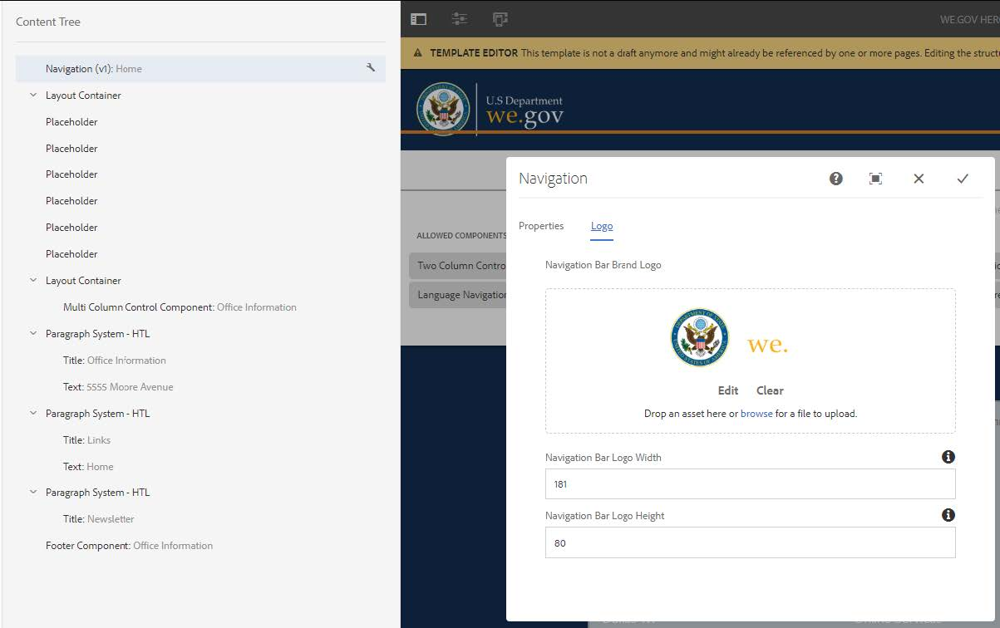

# Konfigurera referenswebbplatsen för Web.Gov{#set-up-and-configure-we-gov-reference-site}

## Information om demopaket {#demo-package-details}

### Installationskrav {#installation-prerequisites}

Paketet skapades för **AEM Forms 6.4 OSGI Author**, har testats och stöds därför i följande plattformsversioner:

| AEM VERSION | AEM FORMS PACKAGE VERSION | STATUS |
|---|---|---|
| 6.4 | 5.0.86 | **Stöds** |
| 6.5 | 6.0.80 | **Stöds** |

Paketet innehåller en molnkonfiguration som stöder följande plattformsversioner:

| MOLNLEVERANTÖR | SERVICEVERSION | STATUS |
|---|---|---|
| Adobe Sign | v5 API | **Stöds** |
| Microsoft Dynamics 365 | 1710 (9.1.0.3020) | **Stöds** |

**Paketinstallationshänsyn:**

* Paketet förväntas installeras på en ren server, utan andra demopaket eller äldre versioner av demopaket
* Paketet förväntas installeras på en OSGI-server som körs i redigeringsläge

### Vad innehåller det här paketet? {#what-does-this-package-include}

AEM Forms We.Gov demopaket ( **we-gov-forms.pkg.all-&lt;version>.zip **) levereras som ett paket som innehåller flera andra underpaket och tjänster. Paketet innehåller följande moduler:

* **we-gov-forms.pkg.all-&lt;version>.zip** -* Fullständigt demopaket*

   * **we-gov-forms.ui.apps-&lt;version>.zip** *- Innehåller alla komponenter, klientbibliotek, exempelanvändare, arbetsflödesmodeller osv.*

      * **we-gov-forms.core-&lt;version>.jar*** - Innehåller alla OSGI-tjänster, anpassad implementering av arbetsflödessteg osv.*

      * **core.wcm.components.all-2.0.4.zip** - *Samling av WCM-exempelkomponenter*

      * **grid-aem.ui.apps-1.0-SNAPSHOT.zip** - *Layoutpaket för AEM Sites Grid för kolumnkontroll för Sites*
   * **we-gov-forms.ui.content-&lt;version>.zip*** - Innehåller allt innehåll, alla sidor, bilder, *formulär, interaktiva kommunikationsresurser osv.

   * **we-gov-forms.config.public-&lt;version>.zip** - *Innehåller alla standardkonfigurationsnoder inklusive platshållarmolnkonfigurationer för att undvika problem med formulärdatamodell och tjänstbindning.*

De tillgångar som ingår i detta paket omfattar:

* AEM-webbplatssidor med redigerbara mallar
* AEM Forms Adaptive Forms
* AEM Forms Interactive Communications (Print and Web Channel)
* AEM Forms XDP - arkivhandling
* AEM Forms MS Dynamics Forms datamodell
* Integrering med Adobe Sign
* AEM Workflow Model
* Exempelbilder för AEM Assets

## Konfigurationsalternativ {#configuration-options}

Det här avsnittet innehåller information om konfigurationsalternativ. För närvarande är det här avsnittet avsiktligt tomt.

## Installation av demopaket {#demo-package-installation}

Det här avsnittet innehåller information om hur du installerar demopaketet.

### Från paketresurs {#from-package-share}

1. Gå till *https://&lt;aemserver>:&lt;port>/crx/packageshare/*

   Du kan också klicka på Distribution i AEM och navigera till ikonen Paketdelning.

   

1. Logga in med ditt Adobe ID.
1. Sök efter och hitta paketet **we-gov-forms.pkg.all-&lt;version>** .
1. Välj&quot;Ladda ned&quot; och acceptera villkoren.
1. När du har hämtat paketet väljer du alternativet &quot;Hämtad&quot; för att leta reda på paketet i pakethanteraren.
1. Välj alternativet Install för att installera paketet.

   

1. Tillåt att installationsprocessen slutförs.
1. Gå till *https://&lt;aemserver>:&lt;port>/content/we-gov/home.html?wcmmode=disabled* för att kontrollera att installationen lyckades.

### Från en lokal ZIP-fil {#from-a-local-zip-file}

1. Hämta och hitta filen **we-gov-forms.pkg.all-&lt;version>.zip** .
1. Gå till *https://&lt;aemserver>:&lt;port>/crx/packmgr/index.jsp*.
1. Välj alternativet &quot;Överför paket&quot;.

   

1. Använd filläsaren för att navigera till och välja den hämtade ZIP-filen.
1. Klicka på Öppna för att överföra.
1. När du har överfört paketet väljer du alternativet Installera för att installera det.

   

1. Tillåt att installationsprocessen slutförs.
1. Gå till *https://&lt;aemserver>:&lt;port>/content/we-gov/home.html?wcmmode=disabled* för att kontrollera att installationen lyckades.

### Installera nya paketversioner {#installing-new-package-versions}

Installera den nya paketversionen genom att följa stegen i 4.1 och 4.2. Det går att installera en nyare paketversion medan ett annat äldre paket redan är installerat, men du bör avinstallera den äldre paketversionen först. Gör så här:

1. Gå till *https://&lt;aemserver>:&lt;port>/crx/packmgr/index.jsp*
1. Leta reda på den äldre filen **we-gov-forms.pkg.all-&lt;version>.zip** .
1. Välj alternativet &quot;Mer&quot;.
1. I listrutan väljer du alternativet Avinstallera.

   

1. När du har bekräftat väljer du Avinstallera igen och tillåter att avinstallationen slutförs.

## Konfiguration av demonstrationspaket {#demo-package-configuration}

Det här avsnittet innehåller information och instruktioner om konfigurationen efter distributionen av demopaketet innan presentationen.

### Konfiguration av praktisk användare {#fictional-user-configuration}

1. Gå till *https://&lt;aemserver>:&lt;port>/libs/granite/security/content/groupadmin.html*
1. Sök efter&quot;**arbetsflöde**&quot;.
1. Markera gruppen&quot;**workflow-users**&quot; och klicka på&quot;Properties&quot;.
1. Gå till fliken Medlemmar.
1. Skriv in **wegov** i fältet Välj användare eller grupp.
1. Välj i listrutan &quot;**Vi.Gov Form Users**&quot;.

   

1. Klicka på&quot;Spara och stäng&quot; i menyraden.
1. Upprepa steg 2-7 genom att söka efter&quot;**analyser**&quot;, markera gruppen&quot;**Analysadministratörer**&quot; och lägga till gruppen&quot;**Vi.Gov-formuläranvändare**&quot; som medlem.
1. Upprepa steg 2-7 genom att söka efter&quot;**formuläranvändare**&quot;, markera gruppen&quot;**forms-power-users**&quot; och lägga till gruppen&quot;**We.Gov Form Users**&quot; som medlem.
1. Upprepa steg 2-7 genom att söka efter&quot;**formuläranvändare**&quot;, välja gruppen&quot;**formuläranvändare**&quot; och lägga till gruppen &quot;** We.Gov Users**&quot; som medlem.

### E-postserverkonfiguration {#email-server-configuration}

1. Granska installationsdokumentation [Konfigurera e-postmeddelande](/help/sites-administering/notification.md)

1. Gå till *https://&lt;aemserver>:&lt;port>/system/console/configMgr*
1. Leta upp och klicka på **Day CQ Mail Service **tjänsten som du vill konfigurera.

   

1. Konfigurera tjänsten så att den ansluter till valfri SMTP-server:

   1. **SMTP-servervärdnamn**: t.ex. (smtp.gmail.com)
   1. **Serverport**: t.ex. (465) för gmail med SSL
   1. **** SMTP-användare: demo@ &lt;företagsnamn>.com
   1. **&quot;Från&quot;-adress**: aemformsdemo@adobe.com
   

1. Klicka på Spara för att spara konfigurationen.

### AEM SSL-konfiguration {#aemsslconfig}

Det här avsnittet innehåller information om hur du konfigurerar SSL på AEM-instansen för att kunna konfigurera Adobe Sign Cloud-konfigurationen.

**Referenser:**

1. [SSL som standard](/help/sites-administering/ssl-by-default.md)

**Anteckningar:**

1. Gå till https://&lt;port>/aem/inbox där du kan slutföra processen som beskrivs i länken för referensdokumentation ovan.
1. Paketet **we-gov-forms.pkg.all-&lt;version>.zip** innehåller ett exempel på en SSL-nyckel och ett certifikat som du kan komma åt genom att extrahera mappen **we-gov-forms.pkg.all-&lt;version>.zip/ssl** som ingår i paketet.

1. SSL-certifikat och nyckelinformation:

   1. utfärdas till &quot;CN=localhost&quot;
   1. 10 års giltighet
   1. lösenordsvärde för password

### Molnkonfiguration för Adobe Sign {#adobe-sign-cloud-configuration}

Det här avsnittet innehåller information och instruktioner om Adobe Sign-molnkonfigurationen.

**Referenser:**

1. [Integrera Adobe Sign med AEM Forms](adobe-sign-integration-adaptive-forms.md)

#### Molnkonfiguration {#cloud-configuration}

1. **Granska förutsättningarna. Se[AEM SSL-konfiguration](../../forms/using/forms-install-configure-gov-reference-site.md#aemsslconfig)för nödvändig SSL-konfiguration.**
1. Navigera till:

   *https://&lt;aemserver>:&lt;port>/libs/adobesign/cloudservices/adobesign.html/conf/we-gov*

   >[!NOTE]
   >
   >Den URL som används för att komma åt AEM-servern bör matcha den URL som konfigurerats i omdirigerings-URI för Adobe Sign OAuth för att undvika konfigurationsproblem (t.ex. *https://&lt;aemserver>:&lt;port>/mnt/overlay/adobesign/cloudservices/adobesign/properties.html*)

1. Välj konfigurationen &quot;We.gov Adobe Sign&quot;.
1. Klicka på &quot;Egenskaper&quot;.
1. Gå till fliken Inställningar.
1. Ange autentiserings-URL, t.ex.: [https://secure.na1.echosign.com/public/oauth](https://secure.na1.echosign.com/public/oauth)
1. Ange konfigurerat klient-ID och klienthemlighet från den konfigurerade Adobe Sign-instansen.
1. Klicka på&quot;Anslut till Adobe Sign&quot;.
1. När anslutningen är klar klickar du på Spara och stäng för att slutföra integreringen.

### MS Dynamics molnkonfiguration {#ms-dynamics-cloud-configuration}

Det här avsnittet innehåller information och instruktioner om konfigurationen för MS Dynamics Cloud.

**Referenser:**

1. [Microsoft Dynamics OData-konfiguration](https://docs.adobe.com/content/help/en/experience-manager-64/forms/form-data-model/ms-dynamics-odata-configuration.html)
1. [Konfigurerar Microsoft Dynamics för AEM-formulär](https://helpx.adobe.com/experience-manager/kt/forms/using/config-dynamics-for-aem-forms.html)

#### Molntjänsten MS Dynamics OData {#ms-dynamics-odata-cloud-service}

1. Navigera till:

   https://&lt;aemserver>:&lt;port>/libs/fd/fdm/gui/components/admin/fdmcloudservice/fdm.html/conf/we-gov

   1. Se till att du använder samma omdirigerings-URL som konfigurerats i MS Dynamics-programregistreringen.

1. Välj konfigurationen för Microsoft Dynamics OData Cloud Service.
1. Klicka på &quot;Egenskaper&quot;.

   

1. Gå till fliken Autentiseringsinställningar.
1. Ange följande information:

   1. **** Tjänstrot: t.ex. https://msdynamicsserver.api.crm3.dynamics.com/api/data/v9.1/
   1. **** Autentiseringstyp: OAuth 2.0
   1. **Autentiseringsinställningar** (mer information finns i Konfigurationsinställningar [för](../../forms/using/forms-install-configure-gov-reference-site.md#dynamicsconfig) MS Dynamics i molnet):

      1. Klient-ID - även kallat program-ID
      1. Klienthemlighet
      1. OAuth URL - t.ex. [https://login.windows.net/common/oauth2/authorize](https://login.windows.net/common/oauth2/authorize)
      1. Uppdatera token-URL, t.ex. [https://login.windows.net/common/oauth2/token](https://login.windows.net/common/oauth2/token)
      1. Åtkomsttoken-URL, t.ex. [https://login.windows.net/common/oauth2/token](https://login.windows.net/common/oauth2/token)
      1. Auktoriseringsomfång - **öppet**
      1. Autentiseringsrubrik - **auktoriseringsansvarig**
      1. Resurs - t.ex. [https://msdynamicsserver.api.crm3.dynamics.com](https://msdynamicsserver.api.crm3.dynamics.com)
   1. Klicka på Anslut till OAuth.

1. När autentiseringen är klar klickar du på Spara och stäng för att slutföra integreringen.

#### Konfigurationsinställningar för MS Dynamics-molnet {#dynamicsconfig}

Stegen som beskrivs i det här avsnittet finns för att hjälpa dig att hitta klient-ID, klienthemlighet och information från din MS Dynamics Cloud-instans.

1. Gå till [https://portal.azure.com/](https://portal.azure.com/) och logga in.
1. Välj Alla tjänster på den vänstra menyn.
1. Sök efter eller navigera till&quot;App Registration&quot;.
1. Skapa eller välj en befintlig programregistrering.
1. Kopiera det **program-ID** som ska användas som OAuth- **klient-ID** i AEM-molnkonfigurationen
1. Klicka på Inställningar eller Manifest för att konfigurera **svars-URL:er.**

   1. Den här URL:en måste matcha den URL som används för att komma åt AEM-servern när OData-tjänsten konfigureras.

1. I inställningsvyn klickar du på&quot;Tangenter&quot; för att visa den nya nyckeln (som används som klienthemlighet i AEM).

   1. Se till att behålla en kopia av nyckeln eftersom du inte kan visa den senare i Azure eller AEM.

1. Navigera till MS Dynamics-instansens kontrollpanel för att hitta resurs-URL:en/tjänstens rot-URL.
1. I det övre navigeringsfältet klickar du på&quot;Försäljning&quot; eller på din egen instanstyp och&quot;Välj inställningar&quot;.
1. Klicka på&quot;Anpassningar&quot; och&quot;Resurser för utvecklare&quot; längst ned till höger.
1. Där hittar du Service Root URL: t.ex.

* [https://msdynamicsserver.api.crm3.dynamics.com/api/data/v9.1/](https://msdynamicsserver.api.crm3.dynamics.com/api/data/v9.1/)*

1. Information om URL:en för uppdaterings- och åtkomsttoken finns här:

* [https://docs.microsoft.com/en-us/rest/api/datacatalog/authenticate-a-client-app](https://docs.microsoft.com/en-us/rest/api/datacatalog/authenticate-a-client-app)*

#### Testa formulärdatamodellen {#testing-the-form-data-model}

När molnkonfigurationen är klar kanske du vill testa formulärdatamodellen.

1. Navigera till

   *https://&lt;aemserver>:&lt;port>/aem/forms.html/content/dam/formsanddocuments-fdm/we-gov*

1. Välj &quot;We.gov Microsoft Dynamics CRM FDM&quot; och välj &quot;Properties&quot;.

   

1. Gå till fliken Uppdatera källa.
1. Kontrollera att Kontextmedveten konfiguration är inställd på /conf/we-gov och att den konfigurerade datakällan är ms-dynamics-data-cloud-service.

   

1. Redigera formulärdatamodellen.

   >[!NOTE]
   Klicka på **Avbryt** i stället för **Spara och stäng** för att undvika problem som kräver ominstallation.

1. Testa tjänsterna för att kontrollera att de är anslutna till den konfigurerade datakällan.

   >[!NOTE]
   Det har rapporterats att en omstart av AEM-servern krävdes för att datakällan skulle kunna binda till FDM.

### Adobe Analytics-konfiguration {#adobe-analytics-configuration}

Det här avsnittet innehåller information och instruktioner om Adobe Analytics Cloud-konfigurationen.

**Referenser:**

1. [https://helpx.adobe.com/experience-manager/6-5/help/sites-administering/adobeanalytics.html](https://helpx.adobe.com/experience-manager/6-5/help/sites-administering/adobeanalytics.html)
1. [https://helpx.adobe.com/experience-manager/6-5/help/sites-administering/adobeanalytics-connect.html](https://helpx.adobe.com/experience-manager/6-5/help/sites-administering/adobeanalytics-connect.html)
1. [https://helpx.adobe.com/experience-manager/6-5/help/sites-authoring/pa-using.html](https://helpx.adobe.com/experience-manager/6-5/help/sites-authoring/pa-using.html)
1. [https://helpx.adobe.com/experience-manager/6-5/forms/using/configure-analytics-forms-documents.html](https://helpx.adobe.com/experience-manager/6-5/forms/using/configure-analytics-forms-documents.html)
1. [https://helpx.adobe.com/experience-manager/6-5/forms/using/view-understand-aem-forms-analytics-reports.html](https://helpx.adobe.com/experience-manager/6-5/forms/using/view-understand-aem-forms-analytics-reports.html)

### Konfiguration av molntjänster för Adobe Analytics {#adobe-analytics-cloud-service-configuration}

Det här paketet levereras förkonfigurerat för att ansluta till Adobe Analytics. Följ stegen nedan för att tillåta att konfigurationen uppdateras.

1. Gå till *https://&lt;aemserver>:&lt;port>/libs/cq/core/content/tools/cloudservices.html*
1. Gå till avsnittet Adobe Analytics och välj länken Show Configurations (Visa konfigurationer).
1. Välj konfigurationen &quot;Web.Gov Adobe Analytics (Analytics-konfiguration)&quot;.

   

1. Klicka på knappen Redigera om du vill uppdatera Adobe Analytics-konfigurationen (du måste ange Delad hemlighet). Klicka på Anslut till analys för att ansluta och OK för att slutföra.

   

1. På samma sida klickar du på&quot;We.Gov Adobe Analytics Framework (Analytics Framework)&quot; om du vill uppdatera ramverkskonfigurationerna (se [Aktivera AEM-redigering](../../forms/using/forms-install-configure-gov-reference-site.md#enableauthoring) för att aktivera redigering).

### Adobe Analytics-rapportering {#adobe-analytics-reporting}

#### Visa rapporter om Adobe Analytics-webbplatser {#view-adobe-analytics-sites-reporting}

1. Gå till *https://&lt;aemserver>:&lt;port>/sites.html/content*
1. Välj&quot;AEM Forms We.Gov Site&quot; för att visa webbplatssidorna.
1. Välj en av webbplatssidorna (t.ex. Hem) och välj Analys och rekommendationer.

   

1. På den här sidan ser du hämtad information från Adobe Analytics som gäller sidan AEM Sites (Obs! den här informationen uppdateras regelbundet från Adobe Analytics och visas inte i realtid).

   

1. På sidan för sidvisning (som du kommer åt i steg 3.0) kan du även visa sidvisningsinformationen genom att ändra visningsinställningen så att objekt i listvyn visas.
1. Leta upp listrutan Visa och välj Listvy.

   

1. På samma meny väljer du &quot;Visningsinställning&quot; och markerar de kolumner som du vill visa under &quot;Analys&quot;.

   

1. Klicka på Uppdatera för att göra de nya kolumnerna tillgängliga.

   

#### Visa rapporter om Adobe Analytics-formulär {#view-adobe-analytics-forms-reporting}

1. Navigera till

   *https://&lt;aemserver>:&lt;port>/aem/forms.html/content/dam/formsanddocuments/adobe-gov-forms*

1. Välj anpassningsformuläret &quot;Registreringsprogram för hälsoförmåner&quot; och välj alternativet &quot;Analysrapport&quot;.

   

1. Vänta tills sidan har lästs in och visa analysrapportdata.

   

#### Visa Adobe Analytics-rapporter {#view-adobe-analytics-reporting}

Du kan också navigera till Adobe Analytics direkt för att se analysdata.

1. Navigera till [https://my.omniture.com/login/](https://my.omniture.com/login/)
1. Logga in med dina inloggningsuppgifter:

   1. **** Företag: AEM Forms - demo
   1. **** Användare: &lt;tillgängligt på begäran>
   1. **** Lösenord: &lt;tillgängligt på begäran>

1. Välj &quot;Referenswebbplats för Web.Gov&quot; i rapportsviterna.

   

1. Välj en av de tillgängliga rapporterna om du vill visa analysdata för den rapporten.

   

## Anpassningar av demopaket {#demo-package-customizations}

I det här avsnittet finns anvisningar om hur du anpassar demon.

### Aktivera AEM-redigering {#enableauthoring}

Det här demopaketet innehåller en OSGI-tjänstkonfigurationsfil som styr beteendet för WCM-filtertjänsten på målförfattarservern. Den här konfigurationen gör att servern arbetar i inaktiverat författarläge (motsvarar ?wcmmode=disabled) för att tillåta demonstration. Så här uppdaterar du konfigurationen och aktiverar redigering:

1. Gå till *https://&lt;aemserver>:&lt;port>/system/console/configMgr*
1. Leta upp och klicka på **Day CQ WCM Filter **Service för att konfigurera.

   

1. Ange värdet för **WCM-läge** till **Redigera**.
1. Klicka på&#x200B;**Spara** för att använda konfigurationen.

### Anpassning av mallar {#templates-customization}

Redigerbara mallar finns på följande plats:

*https://&lt;aemserver>:&lt;port>/libs/wcm/core/content/sites/templates.html/conf/we-gov*

Mallarna innehåller mallarna AEM Site, Adaptive Form och Interactive Communications, som skapats och sammanställts med komponenter som finns på:

*https://&lt;server>:&lt;port>/crx/de/index.jsp#/apps/we-gov/components*

#### Formatsystem {#customizetemplates}

Den här webbplatsen innehåller även klientbibliotek, varav ett importerar Bootstrap 4 ( [https://getbootstrap.com/](https://getbootstrap.com/) ). Det här klientbiblioteket är tillgängligt på

*https://&lt;aemserver>:&lt;port>/crx/de/index.jsp#/apps/we-gov/clientlibs/clientlib-base/css/bootstrap*

De redigerbara mallarna som ingår i det här paketet levereras även förkonfigurerade med mall-/sidprinciper som använder CSS-klasserna för Bootstrap 4 för sidnumrering, formatering osv. Alla klasser har inte lagts till i mallprofilerna, men alla klasser som stöds av Bootstrap 4 kan läggas till i profilerna. På sidan Komma igång finns en lista med tillgängliga klasser:

[https://getbootstrap.com/docs/4.1/getting-started/introduction/](https://getbootstrap.com/docs/4.1/getting-started/introduction/)

Mallar som ingår i paketet har även stöd för Style System:

[https://helpx.adobe.com/ca/experience-manager/6-5/help/sites-authoring/style-system.html](https://helpx.adobe.com/ca/experience-manager/6-5/help/sites-authoring/style-system.html)

#### Malllogotyper {#template-logos}

Project DAM Assets innehåller också logotyper och bilder från We.Gov. Dessa resurser finns på:

*https://&lt;aemserver>:&lt;port>/assets.html/content/dam/we-gov*

När du redigerar sid- och formulärmallar kan du välja att uppdatera logotyper genom att redigera komponenterna Navigering och Sidfot. De här komponenterna har en konfigurerbar varumärkesdialogruta och logotypdialogruta som kan användas för att uppdatera logotyper:

Mer information finns i Redigera sidinnehåll:

[https://helpx.adobe.com/ca/experience-manager/6-5/help/sites-authoring/editing-content.html#main-pars_title_32](https://helpx.adobe.com/ca/experience-manager/6-5/help/sites-authoring/editing-content.html#main-pars_title_32)

### Anpassning av webbplatssidor {#sites-pages-customization}

Alla webbplatssidor är tillgängliga från: *https://&lt;aemserver>:&lt;port>/sites.html/content/we-gov*

På dessa webbplatssidor används även AEM Grid-paketet för att styra layouten för några komponenter.

#### Formatsystem {#style-system}

Sidorna i paketet har också stöd för Style System:

[https://helpx.adobe.com/ca/experience-manager/6-5/help/sites-authoring/style-system.html](https://helpx.adobe.com/ca/experience-manager/6-5/help/sites-authoring/style-system.html)

Du kan även läsa mer om vilka format som stöds i [mallanpassningssystem](../../forms/using/forms-install-configure-gov-reference-site.md#customizetemplates) .

### Anpassning av adaptiva blanketter {#adaptive-forms-customization}

Alla anpassningsbara formulär finns i:

*https://&lt;aemserver>:&lt;port>/aem/forms.html/content/dam/formsanddocuments/adobe-gov-forms*

Dessa formulär kan anpassas efter vissa användningssätt. Observera att vissa fält och inskickningslogik inte bör ändras för att säkerställa att formuläret fortsätter att fungera korrekt. Detta omfattar följande:

**Registreringsprogram för hälsofördelar:**

* contact_id - dolt fält som används för att ta emot kontakt-ID för MS Dynamics under överföringen
* Skicka - Knapplogiken för överföring kräver anpassning för att stödja återanrop. Anpassningen är dokumenterad, men ett stort skript krävdes för att skicka formuläret samtidigt som en POST- och GET-åtgärd utfördes till MS Dynamics via formulärdatamodellen.
* Rotpanelen - Händelsen Initialize används för att lägga till en MS Dynamics-knapp i AEM Inbox på ett så lite påträngande sätt som möjligt eftersom alla AEM Inbox Granite-komponenter inte kan ändras.

#### Adaptiv formulärformatering {#adaptive-form-styling}

Anpassningsbara formulär kan också formateras med stilredigeraren eller temaredigeraren:

* [https://helpx.adobe.com/experience-manager/6-5/forms/using/inline-style-adaptive-forms.html](https://helpx.adobe.com/experience-manager/6-5/forms/using/inline-style-adaptive-forms.html)
* [https://helpx.adobe.com/ca/experience-manager/6-5/forms/using/themes.html](https://helpx.adobe.com/ca/experience-manager/6-5/forms/using/themes.html)

### Anpassa arbetsflöden {#workflow-customization}

Anmälningsblanketten skickas till ett arbetsflöde för att behandlas av OSGI. Det här arbetsflödet finns på* https://&lt;aemserver>:&lt;port>/conf/we-gov/settings/models/we-gov-process.html*.

På grund av vissa begränsningar innehåller det här arbetsflödet flera skript och anpassade arbetsflödessteg för OSGI. Dessa arbetsflödessteg skapades som allmänna steg och har inte skapats med konfigurationsdialogrutor. För närvarande bygger konfigurationen av arbetsflödesstegen på processargument.

All Java-kod för arbetsflödessteg finns i paketet **we-gov-forms.core-&lt;version>.jar** .

## Demonstrationsfrågor och kända problem {#demo-considerations-and-known-issues}

Det här avsnittet innehåller information om demonstrationsfunktioner och designbeslut som kan kräva speciella överväganden under demonstrationsprocessen.

### Demoversioner {#demo-considerations}

* Enligt AGRS-159 ska namnet (för-, mitten- och efternamn) på kontakten som används i det anpassade registreringsformuläret vara unikt.
* Det anpassningsbara registreringsformuläret skickar e-postmeddelandet från Adobe Sign till det e-postmeddelande som anges i formulärets e-postfält. E-postadressen får inte vara samma e-postadress som e-postadressen som används för att konfigurera Adobe Sign-molnkonfigurationen.
* Som standard innehåller demopaketet flera OSGI-tjänstkonfigurationer som styr det övergripande beteendet för målservern som är värd för demonstrationen. Den här konfigurationen innehåller en WCM-filtertjänstkonfiguration som som standard gör att servern fungerar i **inaktiverat författarläge** (motsvarar ?wcmmode=disabled). Se [Aktivera AEM-redigering](../../forms/using/forms-install-configure-gov-reference-site.md#enableauthoring) för att tillåta sidredigering.

### Kända fel {#known-issues}

* (AGRS-120) Webbplatsnavigeringskomponenten stöder för närvarande inte kapslade underordnade sidor som är mer än två nivåer djupa.
* (AGRS-159) Aktuell MS Dynamics FDM måste utföra två åtgärder först, först POST av data i det anpassade registreringsformuläret till Dynamics och sedan hämta användarposten för att hämta kontakt-ID:t. I det aktuella läget kommer hämtning av kontakt-ID att misslyckas om fler än två användare med samma namn finns i Dynamics, vilket inte tillåter att det anpassade registreringsformuläret skickas.

## Nästa steg {#next-steps}

Nu är du redo att utforska referenswebbplatsen We.Gov. Mer information om hur du använder referenswebbplatsens arbetsflöde och steg finns i [Genomgång av Gov-referenswebbplatser](../../forms/using/forms-gov-reference-site-user-demo.md).
