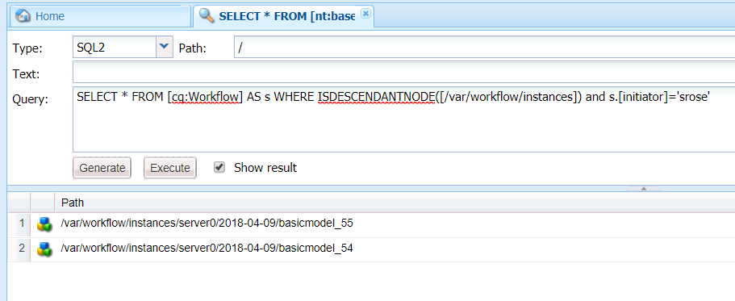

# Forms-centrerade arbetsflöden på OSGi | Hantera användardata {#forms-centric-workflows-on-osgi-handling-user-data}

Med Forms-centrerade AEM kan ni automatisera Forms-centrerade affärsprocesser. Arbetsflöden består av en serie steg som körs i en ordning som anges i den associerade arbetsflödesmodellen. Varje steg utför en specifik åtgärd, till exempel att tilldela en uppgift till en användare eller skicka ett e-postmeddelande. Arbetsflöden kan samverka med resurser i databasen, användarkonton och tjänster. Därför kan arbetsflöden samordna komplicerade aktiviteter som berör någon aspekt av Experience Manager.

Ett formulärcentrerat arbetsflöde kan aktiveras eller startas på något av följande sätt:

* Skicka ett program från AEM Inbox
* Skicka ett program från AEM [!DNL Forms]-appen
* Skicka ett anpassat formulär
* Använda en bevakad mapp
* Skicka ett interaktivt meddelande eller ett brev

Mer information om Forms-centrerade AEM arbetsflöden och funktioner finns i [Forms-centrerat arbetsflöde i OSGi](/help/forms/using/aem-forms-workflow.md).

## Användardata och datalager {#user-data-and-data-stores}

När ett arbetsflöde aktiveras genereras en nyttolast automatiskt för arbetsflödesinstansen. Varje arbetsflödesinstans tilldelas ett unikt instans-ID och ett tillhörande nyttolast-ID. Nyttolasten innehåller databasplatserna för användar- och formulärdata som är associerade med en arbetsflödesinstans. Dessutom lagras utkast och historiska data för en arbetsflödesinstans även i AEM.

Standarddatabasplatserna där nyttolast, utkast och historik för en arbetsflödesinstans finns är följande:

>[!NOTE]
>
>Du kan konfigurera olika platser för lagring av nyttolast, utkast och historikdata när du skapar ett arbetsflöde eller program. Granska arbetsflödet för att identifiera de platser där data lagras i ett arbetsflöde eller i ett program.

<table>
 <tbody>
  <tr>
   <td> </td>
   <td><b>AEM 6.4 [!DNL Forms]</b></td>
   <td><b>AEM 6.3 [!DNL Forms]</b></td>
  </tr>
  <tr>
   <td><strong>Arbetsflödesinstans  </strong></td>
   <td>/var/workflow/instances/[server_id]/&lt;date&gt;/[workflow-instance]/</td>
   <td>/etc/workflow/instances/[server_id]/[date]/[workflow-instance]/</td>
  </tr>
  <tr>
   <td><strong>Nyttolast</strong></td>
   <td>/var/fd/dashboard/payload/[server_id]/[date]/  [payload-id]/</td>
   <td>/etc/fd/dashboard/payload/[server_id]/[date]/  [payload-id]/</td>
  </tr>
  <tr>
   <td><strong>Utkast</strong></td>
   <td>/var/fd/dashboard/instances/[server_id]/  [date]/[workflow-instance]/draft/[workitem]/</td>
   <td>/etc/fd/dashboard/instances/[server_id]/  [date]/[workflow-instance]/draft/[workitem]/</td>
  </tr>
  <tr>
   <td><strong>Historik</strong></td>
   <td>/var/fd/dashboard/instances/[server_id]/  [date]/[workflow_instance]/history/</td>
   <td>/etc/fd/dashboard/instances/[server_id]/  [date]/[workflow_instance]/history/</td>
  </tr>
 </tbody>
</table>

## Få åtkomst till och ta bort användardata {#access-and-delete-user-data}

Du kan komma åt och ta bort användardata från en arbetsflödesinstans i databasen. För att uppnå detta måste du känna till instans-ID:t för arbetsflödesinstansen som är associerad med användaren. Du kan hitta instans-ID för en arbetsflödesinstans genom att använda användarnamnet för den användare som initierade arbetsflödesinstansen eller som är den aktuella tilldelaren för arbetsflödesinstansen.

Du kan dock inte identifiera eller så kan resultatet vara tvetydigt när du identifierar arbetsflöden som är kopplade till en initierare i följande scenarier:

* **Arbetsflödet som utlöses via en bevakad mapp**: Det går inte att identifiera en arbetsflödesinstans med hjälp av dess initierare om arbetsflödet utlöses av en bevakad mapp. I det här fallet kodas användarinformationen i de lagrade data.
* **Arbetsflödet har initierats från publiceringsinstansen AEM**: Alla arbetsflödesinstanser skapas med en tjänstanvändare när adaptiva formulär, interaktiv kommunikation eller brev skickas från AEM publiceringsinstans. I dessa fall hämtas inte användarnamnet för den inloggade användaren i arbetsflödets instansdata.

### Åtkomst till användardata {#access}

Så här identifierar och får du åtkomst till användardata som lagras för en arbetsflödesinstans:

1. Gå till `https://'[server]:[port]'/crx/de` AEM författarinstansen och navigera till **[!UICONTROL Tools > Query]**.

   Välj **[!UICONTROL SQL2]** i listrutan **[!UICONTROL Type]**.

1. Utför någon av följande frågor beroende på vilken information som är tillgänglig:

   * Kör följande om arbetsflödesinitieraren är känd:

   `SELECT &ast; FROM [cq:Workflow] AS s WHERE ISDESCENDANTNODE([path-to-workflow-instances]) and s.[initiator]='*initiator-ID*'`

   * Gör följande om användaren vars data du hittar är den som är tilldelad det aktuella arbetsflödet:

   `SELECT &ast; FROM [cq:WorkItem] AS s WHERE ISDESCENDANTNODE([path-to-workflow-instances]) and s.[assignee]='*assignee-id*'`

   Frågan returnerar platsen för alla arbetsflödesinstanser för den angivna arbetsflödesinitieraren eller den aktuella arbetsflödestilldelaren.

   Följande fråga returnerar till exempel två arbetsflödesinstanser från noden `/var/workflow/instances` vars arbetsflödesinitierare är `srose`.

   

1. Gå till en arbetsflödesinstanssökväg som returneras av frågan. Egenskapen status visar arbetsflödesinstansens aktuella status.

   

1. Navigera till `data/payload/` i arbetsflödets instansnod. Egenskapen `path` lagrar sökvägen till arbetsflödesinstansens nyttolast. Du kan navigera till sökvägen för att komma åt data som lagras i nyttolasten.

   

1. Navigera till utkastplatser och historik för arbetsflödesinstansen.

   Till exempel:

   `/var/fd/dashboard/instances/server0/2018-04-09/_var_workflow_instances_server0_2018-04-09_basicmodel_54/draft/`

   `/var/fd/dashboard/instances/server0/2018-04-09/_var_workflow_instances_server0_2018-04-09_basicmodel_54/history/`

1. Upprepa steg 3-5 för alla arbetsflödesinstanser som returneras av frågan i steg 2.

   >[!NOTE]
   >
   >AEM [!DNL Forms]-appen lagrar även data i offlineläge. Det är möjligt att data för en arbetsflödesinstans lagras lokalt på enskilda enheter och skickas till [!DNL Forms]-servern när programmet synkroniseras med servern.

### Ta bort användardata {#delete-user-data}

Du måste vara AEM administratör för att kunna ta bort användardata från arbetsflödesinstanser genom att utföra följande steg:

1. Följ instruktionerna i [Åtkomst till användardata](/help/forms/using/forms-workflow-osgi-handling-user-data.md#access) och notera följande:

   * Sökvägar till arbetsflödesinstanser som är associerade med användaren
   * Status för arbetsflödesinstanser
   * Sökvägar till nyttolaster för arbetsflödesinstanser
   * Banor till utkast och historik för arbetsflödesinstanser

1. Utför det här steget för arbetsflödesinstanser med statusen **KÖRNING**, **SUSPENDED** eller **STALE**:

   1. Gå till `https://'[server]:[port]'/aem/start.html` och logga in med administratörsautentiseringsuppgifter.
   1. Navigera till **[!UICONTROL Tools > Workflow> Instances]**.
   1. Välj relevanta arbetsflödesinstanser för användaren och välj **[!UICONTROL Terminate]** för att avsluta instanser som körs.

      Mer information om hur du arbetar med arbetsflödesinstanser finns i [Administrera arbetsflödesinstanser](/help/sites-administering/workflows-administering.md).

1. Gå till konsolen [!DNL CRXDE Lite], navigera till nyttolastsökvägen för en arbetsflödesinstans och ta bort noden `payload`.
1. Navigera till utkastssökvägen för en arbetsflödesinstans och ta bort noden `draft`.
1. Navigera till historiksökvägen för en arbetsflödesinstans och ta bort noden `history`.
1. Navigera till arbetsflödesinstanssökvägen för en arbetsflödesinstans och ta bort noden `[workflow-instance-ID]` för arbetsflödet.

   >[!NOTE]
   >
   >Om du tar bort arbetsflödesinstansnoden tas arbetsflödesinstansen bort för alla arbetsflödesdeltagare.

1. Upprepa steg 2-6 för alla arbetsflödesinstanser som identifieras för en användare.
1. Identifiera och ta bort offlineutkast och överföringsdata från AEM [!DNL Forms]-apputkorgen för arbetsflödesdeltagare för att undvika att skickas till servern.

Du kan också använda API:er för att komma åt och ta bort noder och egenskaper. Mer information finns i följande dokument.

* [Så här programmässigt kommer du åt AEM JCR](/help/sites-developing/access-jcr.md)
* [Tar bort noder och egenskaper](https://developer.adobe.com/experience-manager/reference-materials/spec/jcr/2.0/10_Writing.html#10.9%20Removing%20Nodes%20and%20Properties)
* [API-referens](https://helpx.adobe.com/se/experience-manager/6-3/sites-developing/reference-materials/javadoc/overview-summary.html)
