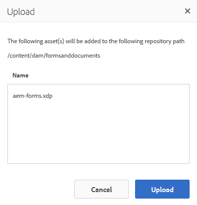
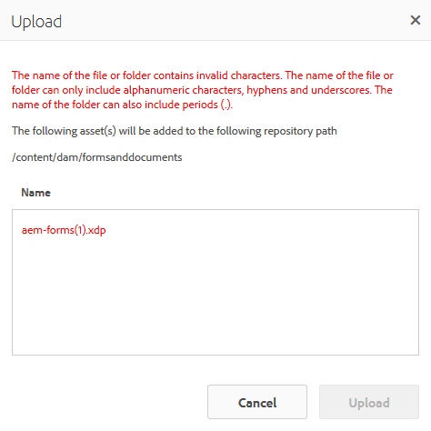

# Hämta XDP- och PDF-dokument i AEM Forms{#getting-xdp-and-pdf-documents-in-aem-forms}

## Översikt {#overview}

Du kan importera formulär från ditt lokala filsystem till CRX-databasen genom att överföra dem till AEM Forms. Överföringsåtgärden stöds för följande resurstyper:

* Formulärmallar (XFA-formulär)
* PDF-formulär
* Dokument (platta PDF-dokument)

Du kan överföra de resurstyper som stöds individuellt eller som ett ZIP-arkiv. Du kan bara överföra en resurs av den typen `Resource`tillsammans med ett XFA-formulär i ett ZIP-arkiv.

>[!NOTE]
>
>Kontrollera att du är medlem i gruppen för att kunna överföra XDP-filer `form-power-users` . Kontakta administratören om du vill bli medlem i gruppen.

## Överföra formulär {#uploading-forms}

1. Logga in i användargränssnittet för AEM Forms via `https://[server]:[port]/aem/forms.html`.
1. Navigera till mappen där du vill överföra formuläret eller mappen som innehåller formulär.
1. Tryck på **Skapa > Filöverföring** i verktygsfältet för åtgärder.

   

1. I dialogrutan Skicka formulär eller paket kan du bläddra och välja vilken fil du vill överföra. I filläsaren visas endast de filformat som stöds (ZIP, XDP och PDF).

   >[!NOTE]
   >
   >Ett filnamn får bara innehålla alfanumeriska tecken, bindestreck eller understreck.

1. Klicka på Överför när du har valt en fil för att överföra filerna eller klicka på Avbryt för att avbryta överföringen. I ett popup-fönster visas de resurser som har lagts till och de resurser som har uppdaterats på den aktuella platsen.

   >[!NOTE]
   >
   >För en ZIP-fil visas de relativa sökvägarna för alla resurser som stöds. Resurser som inte stöds i ZIP ignoreras och visas inte. Om ZIP-arkivet bara innehåller resurser som inte stöds visas ett felmeddelande i stället för popup-dialogrutan.

   

1. Om en eller flera resurser har ett ogiltigt filnamn visas ett fel. Korrigera de filnamn som är markerade i rött och ladda upp igen.

   

När överföringen är klar genererar ett bakgrundsarbetsflöde miniatyrer för varje resurs, baserat på resursens förhandsgranskning. Nya versioner av resurser åsidosätter befintliga resurser, om de överförs.

### Skyddat läge {#protected-mode}

Med AEM Forms-servern kan du köra JavaScript-kod. En skadlig JavaScript-kod kan skada en AEM Forms-miljö. Skyddat läge begränsar AEM Forms till att köra XDP-filer endast från tillförlitliga resurser och platser. Alla XDP som finns i användargränssnittet för AEM Forms betraktas som tillförlitliga resurser.

Det skyddade läget är aktiverat som standard. Om det behövs kan du inaktivera skyddat läge:

1. Logga in på AEM Web Console som administratör. URL:en är https://[server]:[port]/system/console/configMgr
1. Öppna Mobile Forms Configurations för redigering.
1. Avmarkera alternativet Skyddat läge och klicka på **Spara**. Skyddat läge är inaktiverat.

## Uppdaterar refererade XFA-formulär {#updating-referenced-xfa-forms}

I AEM Forms kan en XFA-formulärmall refereras av ett adaptivt formulär eller en annan XFA-formulärmall. En mall kan även referera till en resurs eller en annan XFA-mall.

Ett adaptivt formulär som refererar till en XFA har sina fält bundna till de fält som är tillgängliga i XFA. När en formulärmall uppdateras försöker det tillhörande adaptiva formuläret synkronisera med XFA. Mer information finns i [Synkronisera adaptiva formulär med tillhörande XFA](../../forms/using/synchronizing-adaptive-forms-xfa.md).

Om du tar bort en formulärmall skadas det beroende adaptiva formuläret eller formulärmallen. En sådan anpassningsbar form kallas ibland i allmänhet för en smutsig form. I användargränssnittet för AEM Forms hittar du de felaktiga formulären på följande två sätt.

* En varningsikon visas på miniatyrbilden för det adaptiva formuläret i resurslistan och följande meddelande visas när du håller pekaren över varningsikonen.\
   `Schema/Form Template for this adaptive form has been updated so please go to Authoring mode and rebase it with new version.`

En flagga används för att ange om en adaptiv form är smutsig. Den här informationen är tillgänglig på sidan för formuläregenskaper, tillsammans med formulärets metadata. Endast för rena adaptiva formulär `Model Refresh` visar en metadataegenskap `Recommended` värdet.

