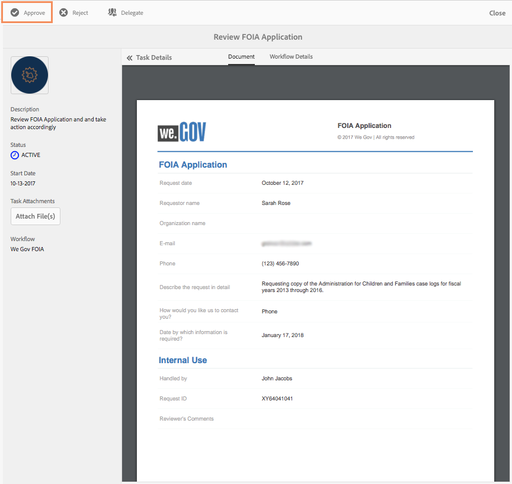
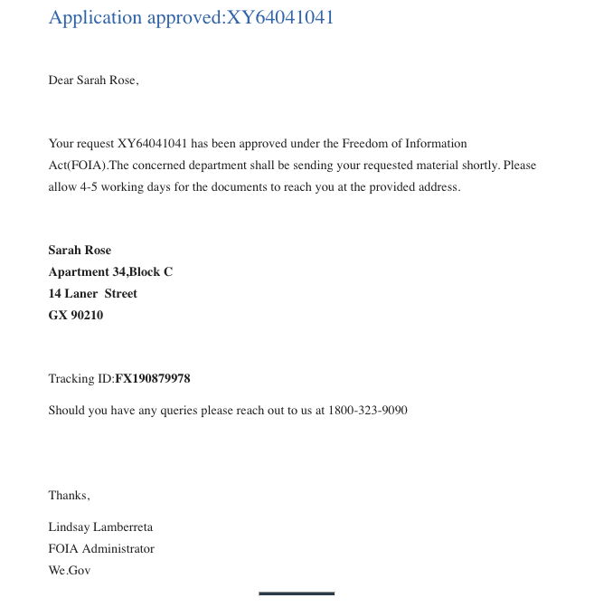

# Vi.Gov:s referenswebbplats FOIA genomgång {#we-gov-reference-site-foia-walkthrough}

## Krav {#pre-requisite}

Konfigurera din webbsida.Gov-referensplats enligt beskrivningen i [Konfigurera och konfigurera referenswebbplatserna](/help/forms/using/setup-reference-sites.md)för AEM-formulär.

## Scenario för lagen om informationsfrihet för webbplatser {#reference-site-freedom-of-information-act-scenario}

We.Gov är en statlig organisation som låter adoptivföräldrar registrera sig för barnsupport om de använder ett barn. We.Gov tillåter också föräldrar att begära information från följande myndigheter inom ramen för lagen om informationsfrihet:

* Försvarets logistikbyrå
* Department of Defense Office of Inspector General
* Department of Justice - Office of Information Policy
* Avdelningen för flottan
* Naturvårdsverket

Mer information om lagen om informationsfrihet finns på [www.foia.gov](https://www.foia.gov).

Scenariot omfattar följande personligheter:

* Sarah Rose, den person som begär information under
* John Jacobs, den person som hanterar begäran vidarebefordrar den till rätt avdelning
* Gloria Rios, en statstjänsteman som lämnar uppgifter i enlighet med begäran

## Sarah initierar en begäran om information under FOIA {#sarah-initiates-request-for-information-under-foia}

Enligt lagen om informationsfrihet begär Sarah en kopia av ärendeloggen från Administration for Children and Families för åren (FY) 2013 till 2016. Sarah lämnar in denna begäran till justitiedepartementet - Office of Information Policy och menar också att hon är villig att betala upp till 100 USD för tryck- och portokostnader.

### Så här fungerar det {#how-it-works}

### Se det själv {#see-it-yourself}

Öppna i webbläsaren `https://<hostname>:<PublishPort>/wegov`. Tryck på Program > Alla program på webbplatsen Web.Gov. På sidan Alla program trycker du på Apply under Application for FOIA Request.

## Sarah börjar sin ansökan om information under FOIA {#sarah-starts-her-application-for-information-under-foia}

Sarah klickar på **Apply** och på sidan&quot;Freedom of Information Act Request Form&quot; anger Sarah bland annat följande information:

* **** Kontor: Sarah anger vilken myndighet som begäran riktar sig till som justitiedepartementet - informationskontoret.

* **Betala**: Sarah anger att hon är villig att betala upp till 100 USD för utskrifts- och portokostnader.
* **Beskriv begäran i detalj**: Sarah anger&quot;Requesting copy of the Administration for Children and Families case logs for Fiscal year 2013 through 2016&quot;.

Begär kopia av ärendeloggen Administration for Children and Families för räkenskapsåren 2013 till 2016

Sarah kan när som helst trycka på Save för att spara utkastet av formuläret och komma tillbaka senare för att fylla i formuläret och skicka det. Sarah skickar formuläret.

>[!NOTE]
>
>Arbetsflödet från e-post fungerar endast med inloggade användare. I scenariot för referensplatsen ser du till att användaren Sarah Rose läggs till. Sarah inloggningsuppgifter är `srose/password`.

## John Jacobs tar emot och godkänner ansökan {#john-jacobs-receives-and-approves-the-application}

John Jacobs tar emot förfrågningarna och skickar dem till rätt person. Med AEM Inbox kan hon se alla inskickade program på ett och samma ställe.

### Så här fungerar det {#how-it-works-1}

När Sarah fyller i och skickar in FOIA-programmet skickas en anmälan till John Jacobs inkorg. John Jacobs kan visa den inskickade ansökan och godkänna eller avvisa den.

### Se det själv {#see-it-yourself-1}

Du kan få åtkomst till AEM-inkorgen på https://&lt;***värdnamn***>:&lt;***PublishPort***>/content/we-finance/global/en/login.html?resource=/aem/inbox.html. Logga in på AEM-inkorgen med jjacobs/password som användarnamn/lösenord för John Jacobs och se FOIA-programmet. Information om hur du använder AEM Inbox för formulärbaserade arbetsflödesuppgifter finns i [Hantera formulärprogram och uppgifter i AEM Inbox](/help/forms/using/manage-applications-inbox.md).

John Jacobs kan se, godkänna eller avvisa programmet från programkontrollpanelen. John Jacobs väljer och öppnar informationen och godkänner den efter att ha granskat begäran.

### <strong>Sarah får ett bekräftelsemeddelande via e-post</strong>{#strong-sarah-receives-an-acknowledgement-email-strong}

När John Jacobs har godkänt ansökan får Sarah ett e-postmeddelande med en bekräftelse från webbsidan We.Gov. Sarah informeras om de avgifter och den tid som krävs för att behandla hennes ansökan. E-postmeddelandet innehåller även e-post- och telefoninformation som kan kontaktas för uppdateringar av programmet.

## Gloria tar emot FOIA-begäran om godkännande på andra nivån {#gloria-receives-the-foia-request-for-second-level-approval}

När John Jacobs fyllt i den information som krävs och godkänt Sarah begäran går begäran till Gloria Rios för slutligt godkännande. Gloria granskar det bifogade dokumentet och godkänner begäran.

### Så här fungerar det {#how-it-works-2}

När John Jacobs godkänner FOIA-begäran skapas en PDF-fil eller ett dokument med registreringsuppgifter för programmet och skickas till Gloria Rios inkorg. Gloria kan visa den inskickade förfrågan och godkänna eller avvisa den.

### Se själv {#see-for-yourself}

Du kan få åtkomst till AEM-inkorgen på https://&lt;***värdnamn***>:&lt;***PublishPort***>/content/we-finance/global/en/login.html?resource=/aem/inbox.html. Logga in på AEM-inkorgen med hjälp av grios/password som användarnamn/lösenord för Gloria Rios och se FOIS-begäran.

Gloria öppnar förfrågan och undersöker informationen i FOIA-begäran. Efter att ha granskat detaljerna i begäran och kontrollerat om det går att skicka in de begärda dokumenten, godkänner Gloria begäran.

## Sarah får ett meddelande om att hennes begäran har godkänts {#sarah-receives-notification-that-her-request-is-approved}

När Gloria har godkänt FOIA-begäran får Sarah ett e-postmeddelande som meddelar henne att hennes ansökan har godkänts. E-postmeddelandet innehåller även information om den preliminära tidslinjen för att skicka dokumentet och kontaktuppgifter för uppföljning av begäran.

