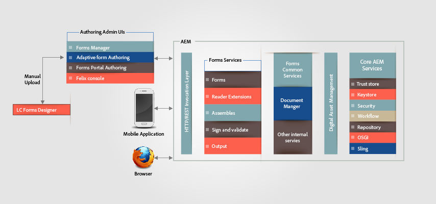

# Arkitektur för HTML5-formulär{#architecture-of-html-forms}

## Arkitektur {#architecture}

HTML5-formulärfunktioner distribueras som ett paket i den inbäddade AEM-instansen och visas som en REST-slutpunkt över HTTP/S med RESTful [Apache Sling Architecture](https://sling.apache.org/).

`` [ 01-aem-forms-architecture *View Full Size *](javascript:void(0).md)

.md)

### Använda Sling Framework {#using-sling-framework}

[Apache Sling](https://sling.apache.org/) är resurscentrerad. Den använder en begärande URL för att först matcha resursen. Varje resurs har en **sling:resourceType** -egenskap (eller **sling:resourceSuperType**). Baserat på den här egenskapen, förfrågningsmetoden och egenskaperna för begärande-URL:en, väljs sedan ett sling-skript för att hantera begäran. Det här snedstrecksskriptet kan vara en JSP eller en servlet. För HTML5-formulär fungerar **profilnoder** som försäljningsresurser och **profilåtergivning** fungerar som ett snedskript som hanterar begäran om att återge mobilformuläret med en viss profil. En **profilrenderare** är en JSP som läser parametrar från en begäran och anropar Forms OSGi-tjänsten.

Mer information om REST-slutpunkten och parametrar för begäran som stöds finns i [Återge formulärmall](/help/forms/using/rendering-form-template.md).

När en användare gör en begäran från en klientenhet, som en iOS- eller Android-webbläsare, löser Sling först profilnoden baserat på den begärda URL:en. Från den här profilnoden läses **sling:resourceSuperType** och **sling:resourceType** för att fastställa alla tillgängliga skript som kan hantera den här formuläråtergivningsbegäran. Sedan används väljare för Sling-begäran tillsammans med begärandemetoden för att identifiera det skript som lämpar sig bäst för att hantera denna begäran. När begäran når en profilåtergivnings-JSP anropar JSP:n Forms OSGi-tjänsten.

Mer information om Sling-skriptupplösningen finns i [AEM Sling Cheat Sheet](https://docs.adobe.com/content/docs/en/cq/current/developing/sling_cheatsheet.html) eller [Apache Sling Url-nedbrytning](https://sling.apache.org/site/url-decomposition.html).

#### Vanligt anropsflöde för formulärbearbetning {#typical-form-processing-call-flow}

HTML5-formulär cachelagrar alla mellanliggande objekt som krävs för att bearbeta (återgivning eller sändning) ett formulär vid den första begäran. Objekten som är beroende av data cachelagras inte eftersom sådana objekt troligtvis ändras.

Mobilformulär upprätthåller två olika cachenivåer, PreRender-cache och Render Cache. Cacheminnet för preRender innehåller alla fragment och bilder i en löst mall och Render-cachen innehåller återgivet innehåll som HTML.

Arbetsflöde för HTML5-formulär

HTML5-formulär cache-lagrar inte mallar som saknar referenser till fragment och bilder. Om HTML5-formulär tar längre tid än normalt kontrollerar du om det finns referenser och varningar som saknas i serverloggarna. Se även till att objektets maximala storlek inte nås.

Forms OSGi-tjänsten bearbetar en begäran i två steg:

* **Skapa** layout och ursprungligt formulärläge: Forms OSGi-renderingstjänsten anropar Forms Cache-komponenten för att avgöra om formuläret redan har cache-lagrats och inte har ogiltigförklarats. Om formuläret är cache-lagrat och giltigt, används den genererade HTML-koden från cachen. Om formuläret blir ogiltigt genererar återgivningstjänsten Forms OSGi den inledande formulärlayouten och formulärläget i XML-format. Denna XML konverteras till HTML-layout och inledande JSON-formulärtillstånd av Forms OSGi-tjänsten och cachelagras sedan för efterföljande förfrågningar.
* **Förifyllda formulär**: Vid återgivning anropas Forms OSGi-renderingstjänsten om en användare begär formulär med förifyllda data och genererar ett nytt formulärtillstånd med sammanfogade data. Eftersom layouten redan genereras i ovanstående steg är anropet snabbare än det första anropet. Detta anrop utför bara datasammanfogningen och kör skripten på data.

Om det finns någon uppdatering i formuläret eller något av resurserna som används i formuläret, upptäcks den av formulärets cachekomponent och cachen för det aktuella formuläret ogiltigförklaras. När Forms OSGi-tjänsten har slutfört bearbetningen lägger Profile Renderer jsp till JavaScript-biblioteksreferenser och format i det här formuläret och returnerar svaret till klienten. En vanlig webbserver som [Apache](https://httpd.apache.org/) kan användas här med HTML-komprimering aktiverat. En webbserver skulle minska svarsstorleken, nätverkstrafiken och den tid som krävs för att strömma data mellan servern och klientdatorn avsevärt.

När en användare skickar formuläret skickar webbläsaren formulärets status i JSON-format till [sändningstjänstproxyn](../../forms/using/service-proxy.md). skickar tjänstproxyn data-XML med JSON-data och skickar XML-data till slutpunkten.

## Komponenter {#components}

Du behöver tilläggspaketet AEM Forms för att kunna aktivera HTML5-formulär. Information om hur du installerar AEM Forms-tilläggspaket finns i [Installera och konfigurera AEM Forms](../../forms/using/installing-configuring-aem-forms-osgi.md).

### OSGi Components (adobe-lc-forms-core.jar) {#osgi-components-adobe-lc-forms-core-jar}

**Adobe XFA Forms Renderer (com.adobe.livecycle.adobe-lc-forms-core)** är visningsnamnet för HTML5-formulären OSGi-paketet när det visas från Bundle View i Felix Admin Console (https://[host]:[port]/system/console/bundles).

Den här komponenten innehåller OSGi-komponenter för rendering, cachehantering och konfigurationsinställningar.

#### Forms OSGi Service {#forms-osgi-service}

Denna OSGi-tjänst innehåller logik för att återge en XDP som HTML och hanterar överföringen av ett formulär för att generera data-XML. Den här tjänsten använder Forms-tjänstbehållaren. Forms-tjänstbehållaren anropar intern komponent `XMLFormService.exe` som utför bearbetningen.

Om en återgivningsbegäran tas emot anropar den här komponenten Forms-tjänstbehållaren för att generera layout- och tillståndsinformation som bearbetas ytterligare för att generera HTML- och JSON-formulärlägen i DOM.

Den här komponenten ansvarar också för att generera data-XML från det inskickade formulärtillståndet JSON.

#### Cachekomponent {#cache-component}

HTML5-formulär använder cachelagring för att optimera dataflödet och svarstiden. Du kan konfigurera cachetjänstens nivå för att finjustera avvägningen mellan prestanda och utrymmesanvändning.

<table>
 <tbody>
  <tr>
   <th>Cachestrategi</th>
   <th>Beskrivning</th>
  </tr>
  <tr>
   <td>Inget</td>
   <td>Cachelagra inte artefakter  </td>
  </tr>
  <tr>
   <td>Konservativ</td>
   <td>Cachelagra endast mellanliggande artefakter som genereras före återgivningen av formuläret, som en mall som innehåller textbundna fragment och bilder</td>
  </tr>
  <tr>
   <td>Aggressiv</td>
   <td>Cachelagra återgivet HTML-innehåll  Cachelagra alla artefakter som cachelagrats på den konservativa nivån.  <strong>Obs</strong>: Den här strategin ger bästa prestanda men kräver mer minne för att lagra cachelagrade artefakter.</td>
  </tr>
 </tbody>
</table>

HTML5-formulär utför cachelagring i minnet med LRU-strategi. Om cachestrategin är inställd på Ingen skapas ingen cache och befintliga cachedata rensas, om det finns några. Förutom cachelagringsstrategin kan du även konfigurera den totala cachestorleken i minnet, vilket kan bidra till att få den maximala gränsen för cachestorleken och om den går längre kommer LRU-läget att frigöra cacheresurser att användas.

>[!NOTE]
>
>Cacheminnet i minnet delas inte mellan klusternoder.

#### Konfigurationstjänst {#configuration-service}

Med konfigurationstjänsten kan du justera konfigurationsparametrar och cacheinställningar för HTML5-formulär.

Om du vill uppdatera de här inställningarna går du till CQ Felix Admin Console (finns på https://&lt;&#39;[server]:[port]&#39;/system/console/configMgr), söker efter och väljer Konfigurera mobilformulär.

Du kan konfigurera cachestorleken eller inaktivera cacheminnet med hjälp av konfigurationstjänsten. Du kan även aktivera felsökning med parametern Felsökningsalternativ. Mer information om felsökning av formulär finns i [Felsöka HTML5-formulär](/help/forms/using/debug.md).

### Körningskomponenter (adobe-lc-forms-runtime-pkg.zip) {#runtime-components-adobe-lc-forms-runtime-pkg-zip}

Körningspaketet innehåller de klientbibliotek som används för att återge HTML-formulär.

**Viktiga komponenter som är tillgängliga som en del av körtidspaketet:**

#### Skriptmotor {#scripting-engine}

Adobe XFA-implementeringen stöder två typer av skriptspråk för att möjliggöra användardefinierad logikkörning i formulär: JavaScript och FormCalc.

Skriptmotorn i HTML-formulär är skriven i JavaScript som har stöd för XFA skriptnings-API:t på båda dessa språk.

Vid återgivning översätts (och cachelagras) FormCalc-skriptet till JavaScript på servern som är genomskinligt för användaren eller designern.

Den här skriptmotorn använder en del av funktionen i ECMAScript5 som Object.defineProperty. Motorn/biblioteket levereras som CQ Client Lib med kategorinamnet **xfaforms.profile**. Det innehåller även API:t **för** FormBridge som gör att externa portaler eller appar kan interagera med formuläret. Med FormBridge kan ett externt program programmässigt dölja vissa element, hämta eller ange deras värden eller ändra deras attribut.

Mer information finns i artikeln [Form Bridge](/help/forms/using/form-bridge-apis.md) .

#### Layoutmotor {#layout-engine}

Layouten och den visuella aspekten av HTML5-formulären baseras på SVG 1.1-, jQuery-, BackBone- och CSS3-funktioner. Det ursprungliga utseendet för ett formulär genereras och cachelagras på servern. Den inledande layouten och eventuella ytterligare ändringar av formulärlayouten hanteras på klienten. För att uppnå detta innehåller körtidspaketet en layoutmotor som är skriven i JavaScript och baserad på jQuery/Backbone. Den här motorn hanterar allt dynamiskt beteende, som Lägg till/ta bort repeterbara instanser och Utbyggbar objektlayout. Den här layoutmotorn återger ett formulär en sida i taget. Inledningsvis visar en användare bara en sida och den vågräta rullningslisten bara första sidan. När en användare rullar nedåt börjar dock nästa sida återgivningen. Den här återgivningen sida för sida minskar den tid som krävs för att återge den första sidan i en webbläsare och förbättrar formulärets upplevda prestanda. Motorn/biblioteket är en del av CQ Client Lib med kategorinamnet **xfaforms.profile**.

Layoutmotorn innehåller också en uppsättning widgetar som används för att hämta värdet för formulärfält från en användare. De här widgetarna är utformade som [jQuery-gränssnittswidgetar](https://api.jqueryui.com/jQuery.widget/) som implementerar vissa ytterligare kontrakt för att fungera sömlöst med layoutmotorn.

Mer information om widgetar och motsvarande kontrakt finns i [Anpassade widgetar för HTML5-formulär](/help/forms/using/introduction-widgets.md).

#### Stilar {#styling}

Det format som är associerat med HTML-elementen läggs till antingen textbundet eller baserat på inbäddat CSS-block. Vissa vanliga format som inte är beroende av formulär är en del av CQ Client Lib med kategorinamnet xfaforms.profile.

Förutom standardegenskaper för format innehåller varje formulärelement även vissa CSS-klasser baserade på elementtyp, namn och andra egenskaper. Med hjälp av dessa klasser kan du omformatera element genom att ange deras egen CSS.

Mer information om standardformat och klasser finns i [Introduktion till format](/help/forms/using/css-styles.md).

#### Serverskript och webbtjänster {#server-side-script-and-web-services}

Skript som har markerats för att köras på servern eller som har markerats för att anropa en webbtjänst (oavsett var den har markerats för att köras) körs alltid på servern.

Klientskriptmotorn:

1. Gör ett synkront anrop till servern som skickar det aktuella formulärtillståndet i form av JSON
1. Kör skriptet eller webbtjänsten på servern
1. Skapar ett nytt JSON-läge
1. Sammanfogar det nya JSON-läget på klienten när svaret returneras.

#### Resurspaket för lokalisering {#localization-resource-bundles}

HTML5-formulär har stöd för italienska (it), spanska (es), brasiliansk portugisiska (pt_BR), förenklad kinesiska (zh_CN), traditionell kinesiska (endast begränsat stöd) (zh_TW), koreanska (ko_KR), engelska (en_US), franska (fr_FR), tyska (de_DE) och japanska (ja). Beroende på vilket språkområde som tas emot i begärandehuvudet skickas motsvarande resurspaket till klienten. Det här resurspaketet läggs till i profil-JSP som ett CQ-klientbibliotek med kategorinamnet **xfaforms.I18N**. Du kan åsidosätta logiken för att hämta språkpaketet i profilen.

### Sling Components (adobe-lc-forms-content-pkg.zip) {#sling-components-adobe-lc-forms-content-pkg-zip}

Sling-paketet innehåller innehåll som är relaterat till profiler och profilåtergivning.

#### Profiler {#profiles}

Profiler är de resursnoder som representerar ett formulär eller en formulärfamilj. På CQ-nivå är dessa profiler JCR-noder. Noderna finns i mappen **/content** i JCR-databasen och kan finnas i alla undermappar i mappen **/content** .

#### Profilåtergivare {#profile-renderers}

Profilnoden har en egenskap **sling:resourceSuperType** med värdet **xfaforms/profile**. Den här egenskapen skickar begäranden internt till snedställningsskriptet för profilnoder som finns i mappen **/libs/xfaforms/profile** . Dessa skript är JSP-sidor, som är behållare för att sätta ihop HTML-formulären och nödvändiga JS-/CSS-artefakter. Sidorna innehåller referenser till:

* **xfaforms.I18N.&lt;locale>**: Det här biblioteket innehåller lokaliserade data.
* **xfaforms.profile**: Det här biblioteket innehåller implementering för XFA Scripting and Layout Engine.

Dessa bibliotek är modellerade som CQ Client Libraries, vilket har fördelarna med automatisk sammanfogning, miniatyrbildnings- och komprimeringsfunktioner i JavaScript-bibliotek för CQ-ramverket.
Mer information om CQ Client Libs finns i [CQ Clientlib Documentation](https://docs.adobe.com/docs/en/cq/current/developing/components/clientlibs.html).

Så som beskrivs ovan anropar profilåtergivaren JSP Forms Service via en sling include. Denna JSP anger också olika felsökningsalternativ baserat på administratörskonfigurationen eller frågeparametrarna.

Med HTML5-formulär kan utvecklare skapa profil- och profilåtergivning för att anpassa formulärens utseende. Med HTML-formulär kan utvecklare t.ex. integrera formulär på en panel eller &lt;div> i en befintlig HTML-portal.
Mer information om hur du skapar anpassade profiler finns i [Skapa en anpassad profil](/help/forms/using/custom-profile.md).
[Kontakta supporten](https://www.adobe.com/account/sign-in.supportportal.html)
