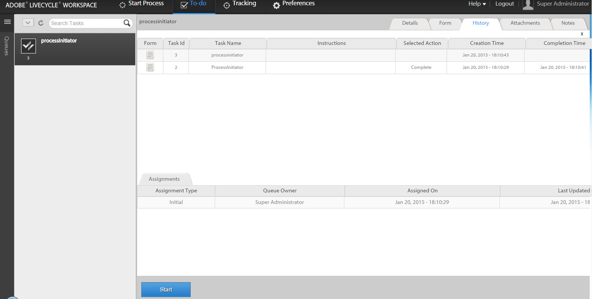

# Initiera en ny process med befintliga processdata på arbetsytan i AEM Forms{#initiating-a-new-process-with-existing-process-data-in-aem-forms-workspace}

Du kan initiera en ny process med data från en befintlig processdata. Behovet av att initiera en ny process från befintliga processdata uppstår när vi måste använda samma formulär ofta med få innehållsändringar som t.ex. för formulär som inte har betalats. Den här funktionen sparar tid och arbete åt användarna, särskilt när processen har långa formulär att fylla i.

Så här startar du en ny process från befintliga processdata:-

1. Gör något av följande:

   * Klicka på den processinstans vars data du vill använda i spårningen. Klicka på den aktivitetsrad som motsvarar startpunkten i vyn Processhistorik i den högra rutan.
   * I Spärra/knip väljer du en sökmall som visar en lista med processinstanser. Markera instansen vars data du vill använda.
   * I **[!UICONTROL To-Do]** väljer du uppgiften. Klicka på **[!UICONTROL History]** och välj den åtgärd som initierade processinstansen.

    

1. Klicka på **[!UICONTROL Start]**. Ett adaptivt formulär för den nya processinstansen visas med förfyllda data.

1. Uppdatera data efter behov och klicka på antingen **[!UICONTROL Complete]** eller en lämplig knapp i formuläret.
