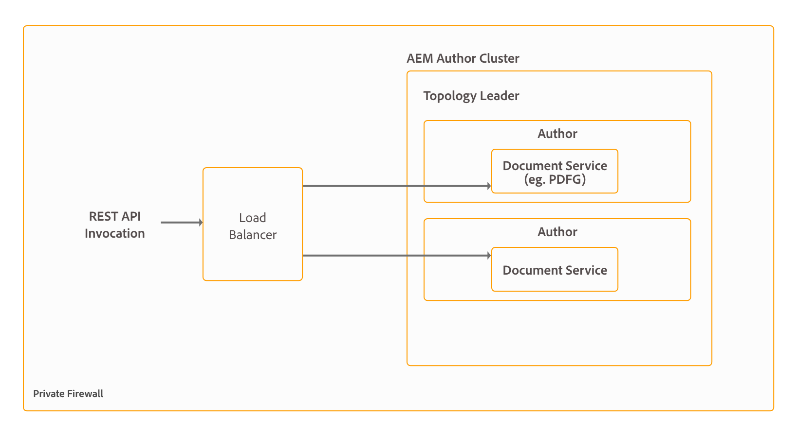

# Installera och konfigurera dokumenttjänster {#installing-and-configuring-document-services}

AEM Forms tillhandahåller en uppsättning OSGi-tjänster för att utföra olika åtgärder på dokumentnivå, till exempel tjänster för att skapa, sammanställa, distribuera och arkivera PDF-dokument, lägga till digitala signaturer för att begränsa åtkomst till dokument samt avkoda Barcoded Forms. Dessa tjänster ingår i AEM Forms tilläggspaket. Tillsammans kallas dessa tjänster dokumenttjänster. Listan över tillgängliga dokumenttjänster och deras viktigaste funktioner är följande:

* **Assembler-tjänst:** Gör att du kan kombinera, ordna om och förstärka PDF- och XDP-dokument och få information om PDF-dokument. Det hjälper även till att konvertera och validera PDF-dokument till PDF/A-standard, omformar PDF forms, XML-formulär och PDF forms till PDF/A-1b, PDF/A-2b och PDFA/A-3b. Mer information finns i [Assembler Service](/help/forms/using/assembler-service.md).

* **ConvertPDF-tjänst:** Gör att du kan konvertera PDF-dokument till PostScript eller bildfiler (JPEG, JPEG 2000, PNG och TIFF). Mer information finns i [Konvertera PDF-tjänst](/help/forms/using/using-convertpdf-service.md).

* **Barcoded Forms-tjänst:** Gör att du kan extrahera data från elektroniska bilder av streckkoder. Tjänsten accepterar TIFF- och PDF-filer som innehåller en eller flera streckkoder som indata och extraherar streckkodsdata. Mer information finns i [Barcoded Forms Service](/help/forms/using/using-barcoded-forms-service.md).

* **DocAssurance-tjänsten:** Gör att du kan kryptera och dekryptera dokument, utöka funktionaliteten i Adobe Reader med ytterligare användningsbehörighet och lägga till digitala signaturer i dina dokument. Tjänsten Doc Assurance innehåller tre tjänster: signatur, kryptering och läsartillägg. Mer information finns i [DocAssurance-tjänsten](/help/forms/using/overview-aem-document-services.md).

* **Krypteringstjänst:** Gör att du kan kryptera och dekryptera dokument. När ett dokument är krypterat blir innehållet oläsligt. En behörig användare kan dekryptera dokumentet för att få åtkomst till dess innehåll. Mer information finns i [Krypteringstjänst](/help/forms/using/overview-aem-document-services.md#encryption-service).

* **Forms-tjänst:** Gör att du kan skapa interaktiva klientprogram för datainhämtning som validerar, bearbetar, omvandlar och levererar formulär som vanligtvis skapas i Forms Designer. Forms-tjänsten återger alla formulärdesigner som du skapar i PDF-dokument. Mer information finns i [Forms-tjänsten](/help/forms/using/forms-service.md).

* **Utdatatjänst:** Gör att du kan skapa dokument i olika format, bland annat PDF, laserskrivarformat och etikettskrivarformat. Laserskrivarformat är PostScript och Printer Control Language (PCL). Mer information finns i [Utdatatjänst](/help/forms/using/output-service.md).

* **PDF Generator-tjänst:** PDF Generator-tjänsten tillhandahåller API:er för konvertering av interna filformat till PDF. Den konverterar även PDF till andra filformat och optimerar storleken på PDF-dokument. Mer information finns i [PDF Generator-tjänsten](aem-document-services-programmatically.md#pdfgeneratorservice).

* **Reader Extension-tjänsten:** Gör det möjligt för din organisation att enkelt dela interaktiva PDF-dokument genom att utöka funktionaliteten i Adobe Reader med ytterligare användningsbehörighet. Tjänsten aktiverar funktioner som inte är tillgängliga när ett PDF-dokument öppnas med Adobe Reader, t.ex. för att lägga till kommentarer i ett dokument, fylla i formulär och spara dokumentet. Mer information finns i [Reader Extension Service](/help/forms/using/overview-aem-document-services.md#reader-extension-service).

* **Signaturtjänst:** Gör att du kan arbeta med digitala signaturer och dokument på AEM-servern. Signaturtjänsten används till exempel vanligtvis i följande situationer:

   * AEM-servern certifierar ett formulär innan det skickas till en användare för att öppnas med Acrobat eller Adobe Reader.
   * AEM-servern validerar en signatur som har lagts till i ett formulär med Acrobat eller Adobe Reader.
   * AEM-servern signerar ett formulär för en offentlig notarius publicus.

  Signaturtjänsten får åtkomst till certifikat och autentiseringsuppgifter som lagras i förtroendearkivet. Mer information finns i [Signaturtjänst](/help/forms/using/aem-document-services-programmatically.md).

AEM Forms är en kraftfull plattform för större företag och dokumenttjänsterna är bara en av AEM Forms funktioner. En fullständig lista över funktioner finns i [Introduktion till AEM Forms](/help/forms/using/introduction-aem-forms.md).

## Distributionstopologi {#deployment-topology}

AEM Forms tilläggspaket är ett program som distribueras till AEM. I allmänhet krävs endast en AEM-instans (författare eller publicering) för att köra AEM Forms Document Services. Följande topologi rekommenderas för att köra AEM Forms Document Services. Mer information om topologier finns i [Arkitektur och distributionstopologier för AEM Forms](/help/forms/using/aem-forms-architecture-deployment.md).



>[!NOTE]
>
>Även om du kan använda AEM Forms för att konfigurera och köra alla funktioner från en enda server, bör du göra kapacitetsplanering, lastbalansering och konfigurera dedikerade servrar för specifika funktioner i en produktionsmiljö. I en miljö där PDF Generator-tjänsten används för att konvertera tusentals sidor om dagen och flera adaptiva formulär för datainhämtning kan du skapa separata AEM Forms-servrar för PDF Generator-tjänsten och adaptiva formulärfunktioner. Det ger optimala prestanda och skalar servrarna oberoende av varandra.

## Systemkrav {#system-requirements}

Innan du börjar installera och konfigurera AEM Forms Document Services bör du kontrollera att:

* Maskinvaru- och programvaruinfrastruktur finns på plats. En detaljerad lista över maskinvara och programvara som stöds finns i [Tekniska krav](/help/sites-deploying/technical-requirements.md).

* Installationssökvägen för AEM-instansen innehåller inte blanksteg.
* En AEM-instans körs. I AEM-terminologi är &quot;instance&quot; en kopia av AEM som körs på en server i författar- eller publiceringsläge. I allmänhet behöver du bara en AEM-instans (författare eller publicerad) för att köra AEM Forms Document Services:

   * **Författare**: En AEM-instans användes för att skapa, överföra och redigera innehåll och för att administrera webbplatsen. När innehållet är klart att publiceras replikeras det till publiceringsinstansen.
   * **Publicera**: En AEM-instans som skickar det publicerade innehållet till allmänheten via Internet eller ett internt nätverk.

* Minneskraven är uppfyllda. AEM Forms tilläggspaket kräver:

   * 15 GB temporärt utrymme för Microsoft® Windows-baserade installationer.
   * 6 GB temporärt utrymme för UNIX-baserade installationer.

* Klientprogramvara som krävs för att PDF generator ska kunna utföra konvertering i Microsoft® Windows och Linux® installeras:

   * **Microsoft® Windows**: Installera [Microsoft® Office](/help/forms/using/aem-forms-jee-supported-platforms.md#p-software-support-for-pdf-generator-p) eller [Apache OpenOffice](/help/forms/using/aem-forms-jee-supported-platforms.md#software-support-for-pdf-generator)
   * **Linux®**: Installera [Apache OpenOffice](/help/forms/using/aem-forms-jee-supported-platforms.md#p-software-support-for-pdf-generator-p)

>[!NOTE]
>
>* I Microsoft® Windows stöder PDF Generator konverteringsvägar för WebKit, Acrobat WebCapture och WebToPDF för att konvertera HTML-filer till PDF-dokument.
>* På UNIX-baserade operativsystem stöder PDF Generator konverteringsvägar för WebKit och WebToPDF för konvertering av HTML-filer till PDF-dokument.
>

### Extra krav för UNIX-baserat operativsystem {#extrarequirements}

Om du använder ett UNIX-baserat operativsystem installerar du följande 32-bitarspaket från installationsmediet för respektive operativsystem:
<table>
 <tbody>
  <tr>
   <td>
    <ul>
     <li>exponat</li>
    </ul> </td>
   <td>
    <ul>
     <li>libxcb</li>
    </ul> </td>
   <td>
    <ul>
     <li>freetype</li>
    </ul> </td>
   <td>
    <ul>
     <li>libXau</li>
    </ul> </td>
  </tr>
  <tr>
   <td>
    <ul>
     <li>libSM</li>
    </ul> </td>
   <td>
    <ul>
     <li>zlib</li>
    </ul> </td>
   <td>
    <ul>
     <li>libICE</li>
    </ul> </td>
   <td>
    <ul>
     <li>libuuid</li>
    </ul> </td>
  </tr>
  <tr>
   <td>
    <ul>
     <li>glibc</li>
    </ul> </td>
   <td>
    <ul>
     <li>libXext</li>
    </ul> </td>
   <td>
    <ul>
     <li>nss-softokn-free-bl</li>
    </ul> </td>
   <td>
    <ul>
     <li>fontconfig</li>
    </ul> </td>
  </tr>
  <tr>
   <td>
    <ul>
     <li>libX11</li>
    </ul> </td>
   <td>
    <ul>
     <li>libXrender</li>
    </ul> </td>
   <td>
    <ul>
     <li>libXrandr</li>
    </ul> </td>
   <td>
    <ul>
     <li>libXinerama</li>
    </ul> </td>
  </tr>
 </tbody>
</table>

* **(Endast PDF Generator**) Installera 32-bitarsversionen av biblioteken libcurl, libcrypto och libssl och skapa nedanstående symboler. Symbolerna pekar på den senaste versionen av respektive bibliotek:

   * /usr/lib/libcurl.so
   * /usr/lib/libcrypto.so
   * /usr/lib/libssl.so

* **(Endast PDF Generator)** PDF Generator-tjänsten stöder WebKit- och WebToPDF-vägar för konvertering av HTML-filer till PDF-dokument. Installera nedanstående 64-bitarsbibliotek om du vill aktivera konvertering för WebToPDF-vägar. I allmänhet är dessa bibliotek redan installerade. Om något bibliotek saknas installerar du det manuellt:

   * linux-gate.so.1
   * libz.so.1
   * libfontconfig.so.1
   * libfreetype.so.6
   * libdl.so.2
   * librt.so.1
   * libpthread.so.0
   * libstdc++.so.6
   * libm.so.6
   * libgcc_s.so.1
   * libc.so.6
   * ld-linux.so.2
   * libexpat.so.1

## Konfigurationer före installation {#preinstallationconfigurations}

Konfigurationer som listas i avsnittet med förinstallationskonfigurationer gäller endast för PDF Generator-tjänsten. Om du inte konfigurerar PDF Generator-tjänsten kan du hoppa över konfigurationsavsnittet före installation.

### Installera Adobe Acrobat och tredjepartsprogram {#install-adobe-acrobat-and-third-party-applications}

Om du ska använda PDF Generator-tjänsten för att konvertera filformat som Microsoft® Word, Microsoft® Excel, Microsoft® PowerPoint, OpenOffice, WordPerfect X7 och Adobe Acrobat till PDF-dokument måste du se till att dessa program är installerade på AEM Forms Server.

>[!NOTE]
>
>* Om din AEM Forms-server är offline eller i en säker miljö och Internet inte är tillgängligt för att aktivera Adobe Acrobat finns mer information i [Offlineaktivering](https://exception.licenses.adobe.com/aoes/aoes/v1/t1?locale=en) om hur du aktiverar sådana instanser av Adobe Acrobat.
>* Adobe Acrobat, Microsoft® Word, Excel och PowerPoint finns endast för Microsoft® Windows. Om du använder det UNIX-baserade operativsystemet måste du installera OpenOffice för att konvertera RTF-filer och Microsoft® Office-filer som stöds till PDF-dokument.
>* Stäng alla dialogrutor som visas när du har installerat Adobe Acrobat och tredjepartsprogram för alla användare som har konfigurerats att använda tjänsten PDF Generator.
>* Starta alla installerade program minst en gång. Stäng alla dialogrutor för alla användare som har konfigurerats att använda PDF Generator-tjänsten.
>* [Kontrollera förfallodatumet för dina Adobe Acrobat-serienummer](https://helpx.adobe.com/se/enterprise/kb/volume-license-expiration-check.html) och ange ett datum för att uppdatera licensen eller [migrera ditt serienummer](https://www.adobe.com/devnet-docs/acrobatetk/tools/AdminGuide/licensing.html#migrating-your-serial-number) baserat på förfallodatumet.

När du har installerat Acrobat öppnar du Microsoft® Word. På fliken **Acrobat** klickar du på **Skapa PDF** och konverterar en .doc- eller .docx-fil som finns på datorn till ett PDF-dokument. Om konverteringen lyckas är AEM Forms redo att använda Acrobat med PDF Generator-tjänsten.

### Konfigurera miljövariabler {#setup-environment-variables}

Ange miljövariabler för 64-bitars Java Development Kit, tredjepartsprogram och Adobe Acrobat. Miljövariablerna ska innehålla den absoluta sökvägen för den körbara fil som används för att starta motsvarande program, till exempel visas miljövariabler för ett fåtal program i tabellen nedan:

<table>
 <tbody>
  <tr>
   <td><p><strong>Program</strong></p> </td>
   <td><p><strong>Miljövariabel</strong></p> </td>
   <td><p><strong>Exempel</strong></p> </td>
  </tr>
  <tr>
   <td><p><strong>JDK (64-bitars)</strong></p> </td>
   <td><p>JAVA_HOME</p> </td>
   <td><p>C:\Program Files\Java\jdk1.8.0_74</p> </td>
  </tr>
  <tr>
   <td><p><strong>Adobe Acrobat</strong></p> </td>
   <td><p>Acrobat_PATH</p> </td>
   <td><p>C:\Program filer (x86)\Adobe\Acrobat 2015\Acrobat\Acrobat.exe</p> </td>
  </tr>
  <tr>
   <td><p><strong>Anteckningar</strong></p> </td>
   <td><p>Notepad_PATH</p> </td>
   <td><p>C:\WINDOWS\notepad.exe<br /> <strong></strong></p> </td>
  </tr>
  <tr>
   <td><p><strong>OpenOffice</strong></p> </td>
   <td><p>OpenOffice_PATH</p> </td>
   <td><p>C:\Program filer (x86)\OpenOffice 4</p> </td>
  </tr>
 </tbody>
</table>

>[!NOTE]
>
>* Alla miljövariabler och respektive sökvägar är skiftlägeskänsliga.
>* JAVA_HOME och Acrobat_PATH (endast Windows) är obligatoriska miljövariabler.
>* Miljövariabeln OpenOffice_PATH ställs in på installationsmappen i stället för på sökvägen till den körbara filen.
>* Ställ inte in miljövariabler för Microsoft® Office-program som Word, PowerPoint, Excel och Project, eller för AutoCAD. Om dessa program är installerade på servern startar tjänsten Generate PDF automatiskt dessa program.
>* Installera OpenOffice som /root på UNIX-baserade plattformar. Om OpenOffice inte är installerat som rot kan inte PDF Generator konvertera OpenOffice-dokument till PDF-dokument. Om du måste installera och köra OpenOffice som en icke-rotanvändare anger du sudo-rättigheter till användaren som inte är rotanvändare.
>* Om du använder OpenOffice på en UNIX-baserad plattform kör du följande kommando för att ange variabeln path:\
> `export OpenOffice_PATH=/opt/openoffice.org4`
>* På SUSE® Linux®-baserade plattformar (SLES 15 SP6 eller senare) följer du de här stegen för att konfigurera OpenOffice:
>     * Installera den senaste tillgängliga 32-bitarsvarianten av `OpenOffice 4.1.x` till en katalog som `/opt/openoffice4`.
>     * Ställ in miljövariabeln `OpenOffice_PATH` så att den pekar på den här platsen. Till exempel: `OpenOffice_PATH=/opt/openoffice4`.
>     * Kontrollera att variabeln `OpenOffice_PATH` är global (till exempel med `/etc/profile` eller systemspecifik motsvarighet) så att den är tillgänglig för alla användare vid inloggning.

### (Endast för IBM® WebSphere®) Konfigurera IBM® SSL-socketleverantör {#only-for-ibm-websphere-configure-ibm-ssl-socket-provider}

Utför följande steg för att konfigurera IBM® SSL-socketprovidern:

1. Skapa en kopia av filen java.security. Standardplatsen för filen är `[WebSphere_installation_directory]\Appserver\java_[version]\jre\lib\security`.
1. Öppna den kopierade java.security-filen för redigering.
1. Ändra standardfabrikerna för SSL-socket så att de använder JSSE2-fabrikerna i stället för standardfabrikerna i IBM® WebSphere®:

   **Standardinnehåll:**

   ```shell
   #ssl.SocketFactory.provider=com.ibm.jsse2.SSLSocketFactoryImpl
   #ssl.ServerSocketFactory.provider=com.ibm.jsse2.SSLServerSocketFactoryImpl
   #WebSphere socket factories (in cryptosf.jar)
   ssl.SocketFactory.provider=com.ibm.websphere.ssl.protocol.SSLSocketFactory
   ssl.ServerSocketFactory.provider=com.ibm.websphere.ssl.protocol.SSLServerSocketFactory
   ```

   **Ändrat innehåll:**

   ```shell
   ssl.SocketFactory.provider=com.ibm.jsse2.SSLSocketFactoryImpl
   ssl.ServerSocketFactory.provider=com.ibm.jsse2.SSLServerSocketFactoryImpl
   
   #WebSphere socket factories (in cryptosf.jar)
   #ssl.SocketFactory.provider=com.ibm.websphere.ssl.protocol.SSLSocketFactory
   #ssl.ServerSocketFactory.provider=com.ibm.websphere.ssl.protocol.SSLServerSocketFactory
   ```

1. Om du vill att AEM Forms Server ska kunna använda den uppdaterade java.security-filen när AEM Forms-servern startas lägger du till följande java-argument:

   `-Djava.security.properties= [path of newly created Java.security file].`

### (Endast Windows) Konfigurera filblocksinställningarna för Microsoft® Office {#configure-the-file-block-settings-for-microsoft-office}

Ändra inställningarna för Microsoft® Office Trust Center så att PDF Generator-tjänsten kan konvertera filer som skapats med äldre versioner av Microsoft® Office.

1. Öppna ett Microsoft® Office-program. Exempel: Microsoft® Word. Navigera till **[!UICONTROL File]**> **[!UICONTROL Options]**. Dialogrutan Alternativ visas.

1. Klicka på **[!UICONTROL Trust Center]** och sedan på **[!UICONTROL Trust Center Settings]**.
1. Klicka på **[!UICONTROL File Block Settings]** i **[!UICONTROL Trust Center settings]**.
1. Avmarkera **[!UICONTROL Open]** i listan **[!UICONTROL File Type]** för den filtyp som PDF Generator-tjänsten ska ha behörighet att konvertera till PDF-dokument.

### (Endast Windows) Bevilja privilegiet Ersätt en token på processnivå {#grant-the-replace-a-process-level-token-privilege}

Användarkontot som används för att starta programservern kräver privilegiet **Ersätt en token på processnivå**. Det lokala systemkontot har behörigheten **Ersätt en token** på processnivå som standard. För servrar som körs med en användare i gruppen Lokala administratörer måste privilegiet ges uttryckligen. Utför följande steg för att bevilja privilegiet:

1. Öppna Group Policy Editor för Microsoft® Windows. Om du vill öppna grupprincipredigeraren klickar du på **[!UICONTROL Start]**, skriver **gpedit.msc** i rutan Starta sökning och klickar på **[!UICONTROL Group Policy Editor]**.
1. Navigera till **[!UICONTROL Local Computer Policy]** > **[!UICONTROL Computer Configuration]** > **[!UICONTROL Windows Settings]** > **[!UICONTROL Security Settings]** > **[!UICONTROL Local Policies]** > **[!UICONTROL User Rights Assignment]** och redigera **[!UICONTROL Replace a process level token]**-principen och inkludera gruppen Administratörer.
1. Lägg till användaren i posten Ersätt en processnivåtoken.

>[!NOTE]
>
> Om AEM-servern körs som en tjänst under LocalSystem-kontot (LSA) är det inte nödvändigt att uttryckligen tilldela denna behörighet till en användare, vilket anges ovan.

### (Endast Windows) Aktivera PDF Generator-tjänsten för icke-administratörer {#enable-the-pdf-generator-service-for-non-administrators}

Du kan göra det möjligt för en icke-administratörsanvändare att använda PDF Generator-tjänsten. Normalt kan endast användare med administratörsbehörighet använda tjänsten:

1. Skapa en miljövariabel, PDFG_NON_ADMIN_ENABLED.
1. Ange värdet för miljövariabeln till TRUE.
1. Starta om AEM Forms.

>[!NOTE]
>
> Du bör använda kommandot Ctrl + C för att starta om SDK. Om du startar om AEM SDK med alternativa metoder, till exempel att stoppa Java-processer, kan det leda till inkonsekvenser i AEM utvecklingsmiljö.

### (Endast Windows) Inaktivera Kontroll av användarkonto (UAC) {#disable-user-account-control-uac}

1. Gå till **[!UICONTROL Start > Run]** och ange **[!UICONTROL MSCONFIG]** om du vill komma åt systemkonfigurationsverktyget.
1. Klicka på fliken **[!UICONTROL Tools]**, rulla nedåt och välj **[!UICONTROL Change UAC Settings]**. Klicka på **[!UICONTROL Launch]** om du vill köra kommandot i ett nytt fönster.
1. Justera skjutreglaget till nivån för Aldrig meddelande. När du är klar stänger du kommandofönstret och stänger fönstret Systemkonfiguration.
1. Kontrollera att registerinställningen för UAC är inställd på 0 (noll). Verifiera genom att utföra följande steg:

   1. Microsoft® rekommenderar att du säkerhetskopierar registret innan du ändrar det. Detaljerade steg finns i [Säkerhetskopiera och återställa registret i Windows](https://support.microsoft.com/en-us/help/322756).
   1. Öppna Registereditorn i Microsoft® Windows. Öppna Registereditorn genom att gå till Start > Kör, skriva regedit och klicka på OK.
   1. Navigera till `HKEY_LOCAL_MACHINE\SOFTWARE\Microsoft\Windows\CurrentVersion\policies\system\`. Kontrollera att värdet för EnableLUA är 0 (noll).
   1. Kontrollera att värdet för **EnableLUA** är 0 (noll). Om värdet inte är 0 ändrar du värdet till 0. Stäng Registereditorn.

1. Starta om datorn.

### (Endast Windows) Inaktivera felrapporteringstjänsten {#disable-error-reporting-service}

När du konverterar ett dokument till PDF med PDF Generator-tjänsten på Windows Server rapporteras ibland att ett problem har uppstått och den körbara filen måste stängas. Men det påverkar inte PDF-konverteringen eftersom den fortsätter i bakgrunden.

Du kan undvika att få felmeddelanden genom att inaktivera Windows-felrapportering. Mer information om hur du inaktiverar felrapportering finns i [https://technet.microsoft.com/en-us/library/cc754364.aspx](https://technet.microsoft.com/en-us/library/cc754364.aspx).

### (Endast Windows) Konfigurera konvertering av HTML till PDF {#configure-html-to-pdf-conversion}

PDF Generator-tjänsten tillhandahåller vägar eller metoder för WebKit, WebCapture och WebToPDF för att konvertera HTML-filer till PDF-dokument. Om du vill aktivera konvertering för WebKit- och Acrobat WebCapture-vägar i Windows kopierar du Unicode-teckensnittet till katalogen %windir%\fonts.

>[!NOTE]
>
>När du installerar nya teckensnitt i teckensnittsmappen startar du om AEM Forms-instansen.

### (Endast UNIX-baserade plattformar) Extra konfigurationer för konvertering från HTML till PDF  {#extra-configurations-for-html-to-pdf-conversion}

På UNIX-baserade plattformar stöder PDF Generator WebKit- och WebToPDF-vägar för konvertering av HTML-filer till PDF-dokument. Om du vill aktivera konvertering från HTML till PDF ska du göra följande konfigurationer, som passar din önskade konverteringsväg:

### (Endast UNIX-baserade plattformar) Aktivera stöd för Unicode-teckensnitt (endast WebKit) {#enable-support-for-unicode-fonts-webkit-only}

Kopiera Unicode-teckensnittet till någon av följande kataloger som passar ditt system:

* /usr/lib/X11/fonts/TrueType
* /usr/share/fonts/default/TrueType
* /usr/X11R6/lib/X11/fonts/ttf
* /usr/X11R6/lib/X11/fonts/TrueType
* /usr/X11R6/lib/X11/fonts/TrueType
* /usr/X11R6/lib/X11/fonts/TTF
* /usr/openwin/lib/X11/fonts/TrueType (Solaris™)

>[!NOTE]
>
>* I Red Hat® Enterprise Linux® 6.x och senare finns inte Courier-teckensnitt tillgängliga. Hämta arkivet font-ibm-type1-1.0.3.zip för att installera teckensnittet Courier. Extrahera arkivet på /usr/share/fonts. Skapa en symbolisk länk från /usr/share/X11/fonts till /usr/share/fonts.
>* Ta bort alla .lst-teckensnittscachefiler från katalogerna Html2PdfSvc/bin och /usr/share/fonts.
>* Kontrollera att katalogerna /usr/lib/X11/fonts och /usr/share/fonts finns. Om katalogerna inte finns använder du ln-kommandot för att skapa en symbolisk länk från /usr/share/X11/fonts till /usr/lib/X11/fonts och en annan symbolisk länk från /usr/share/fonts till /usr/share/X11/fonts. Se även till att teckensnitten finns på /usr/lib/X11/fonts.
>* Kontrollera att alla teckensnitt (Unicode och icke-unicode) är tillgängliga i katalogen /usr/share/fonts eller /usr/share/X11/fonts.
>* När du kör PDF Generator-tjänsten som en icke-rotanvändare ska du ge icke-rotanvändaren läs- och skrivåtkomst till alla teckensnittskataloger.
>* När du installerar nya teckensnitt i teckensnittsmappen startar du om AEM Forms-instansen.
>

## Installera AEM Forms-tilläggspaket {#install-aem-forms-add-on-package}

AEM Forms tilläggspaket är ett program som distribueras till AEM. Paketet innehåller AEM Forms Document Services och andra AEM Forms-funktioner. Så här installerar du paketet:

1. Öppna [Programvarudistribution](https://experience.adobe.com/downloads). Du behöver en Adobe ID för att logga in på Software Distribution.
1. Välj **[!UICONTROL Adobe Experience Manager]** som finns på rubrikmenyn.
1. I avsnittet **[!UICONTROL Filters]**:
   1. Välj **[!UICONTROL Forms]** i listrutan **[!UICONTROL Solution]**.
   2. Välj version och typ för paketet. Du kan också använda alternativet **[!UICONTROL Search Downloads]** för att filtrera resultaten.
1. Välj det paketnamn som gäller för ditt operativsystem, välj **[!UICONTROL Accept EULA Terms]** och välj **[!UICONTROL Download]**.
1. Öppna [Pakethanteraren](https://experienceleague.adobe.com/docs/experience-manager-65/administering/contentmanagement/package-manager.html?lang=sv-SE) och klicka på **[!UICONTROL Upload Package]** för att överföra paketet.
1. Markera paketet och klicka på **[!UICONTROL Install]**.

   Du kan även hämta paketet via den direktlänk som visas i artikeln [AEM Forms-utgåvor](https://experienceleague.adobe.com/docs/experience-manager-release-information/aem-release-updates/forms-updates/aem-forms-releases.html?lang=sv-SE).

1. När paketet har installerats uppmanas du att starta om AEM-instansen. **Stoppa inte servern omedelbart.** Innan du stoppar AEM Forms Server väntar du tills ServiceEvent REGISTERED- och ServiceEvent UNREGISTERED-meddelandena inte längre visas i filen `[AEM-Installation-Directory]/crx-quickstart/logs/error`.log och loggen är stabil.

## Konfiguration efter installation {#post-installation-configurations}

### Konfigurera Boot Delegation för RSA/BouncyCastle-bibliotek  {#configure-boot-delegation-for-rsa-bouncycastle-libraries}

1. Stoppa AEM-instansen. Gå till mappen [AEM installationskatalog]\crx-quickstart\conf\. Öppna filen sling.properties för redigering.

   Om du använder `[AEM installation directory]\crx-quickstart\bin\start.bat` för att starta en AEM-instans redigerar du sling.properties som finns på `[AEM_root]\crx-quickstart\`.

1. Lägg till följande egenskaper i filen sling.properties:

   ```shell
   sling.bootdelegation.class.com.rsa.jsafe.provider.JsafeJCE=com.rsa.*
   ```

1. (Endast AIX®) Lägg till följande egenskaper i filen sling.properties:

   ```shell
   sling.bootdelegation.xerces=org.apache.xerces.*
   ```

1. Spara och stäng filen.

### Konfigurera teckensnittshanterartjänsten  {#configuring-the-font-manager-service}

1. Logga in på [AEM Configuration Manager](http://localhost:4502/system/console/configMgr) som administratör.
1. Leta reda på och öppna tjänsten **[!UICONTROL CQ-DAM-Handler-Gibson Font Managers]**. Ange sökvägen till katalogerna System Fonts, Adobe Server Fonts och Customer Fonts. Klicka på **[!UICONTROL Save]**.

   >[!NOTE]
   >
   >Din rätt att använda teckensnitt som tillhandahålls av andra än Adobe regleras av de licensavtal som dessa parter ger dig med dessa teckensnitt och omfattas inte av din licens att använda Adobe-program. Adobe rekommenderar att du granskar och kontrollerar att du följer alla tillämpliga licensavtal som inte är från Adobe innan du använder teckensnitt som inte är från Adobe med Adobe, särskilt när det gäller användning av teckensnitt i en servermiljö.
   >När du installerar nya teckensnitt i teckensnittsmappen startar du om AEM Forms-instansen.
   >

### Konfigurera ett lokalt användarkonto för att köra PDF Generator-tjänsten  {#configure-a-local-user-account-to-run-the-pdf-generator-service}

Det krävs ett lokalt användarkonto för att köra PDF Generator-tjänsten. Anvisningar om hur du skapar en lokal användare finns i [Skapa ett användarkonto i Windows](https://support.microsoft.com/en-us/help/13951/windows-create-user-account) eller skapa ett användarkonto på UNIX-baserade plattformar.

1. Öppna sidan [AEM Forms PDF Generator Configuration](http://localhost:4502/libs/fd/pdfg/config/ui.html).

1. Ange autentiseringsuppgifter för ett lokalt användarkonto på fliken **[!UICONTROL User Accounts]** och klicka på **[!UICONTROL Submit]**. Tillåt åtkomst till användaren om du uppmanas att göra det i Microsoft® Windows. När den konfigurerade användaren läggs till visas den under avsnittet **[!UICONTROL Your user accounts]** på fliken **[!UICONTROL User Accounts]**.

### Konfigurera timeout-inställningar {#configure-the-time-out-settings}

1. Leta reda på och öppna tjänsten **[!UICONTROL Jacorb ORB Provider]** i [AEM konfigurationshanterare](http://localhost:4502/system/console/configMgr).

   Lägg till följande i fältet **[!UICONTROL Custom Properties.name]** och klicka på **[!UICONTROL Save]**. Tidsgränsen för väntande svar (kallas även CORBA-klienttimeout) anges till 600 sekunder.

   `jacorb.connection.client.pending_reply_timeout=600000`

1. Logga in på AEM författarinstans och navigera till **[!UICONTROL Adobe Experience Manager]** > **[!UICONTROL Tools]** > **[!UICONTROL Forms]** > **[!UICONTROL Configure PDF Generator]**. Standardwebbadressen är <http://localhost:4502/libs/fd/pdfg/config/ui.html>.

   Öppna fliken **[!UICONTROL General Configuration]** och ändra värdet för följande fält för din miljö:

<table>
 <tbody>
  <tr>
   <td>Fält</td>
   <td>Beskrivning</td>
   <td>Standardvärde</td>
  </tr>
  <tr>
   <td>Timeout för serverkonvertering</td>
   <td>En PDFG-konvertering förblir aktiv i det antal sekunder som anges i tidsgränsen för serverkonvertering</td>
   <td>270 sekunder<br /> </td>
  </tr>
  <tr>
   <td>Sekunder för PDFG-rensningsgenomsökning</td>
   <td>Antalet sekunder som krävs för att utföra efterkonverteringsåtgärder.<br /> </td>
   <td>3 600 sekunder</td>
  </tr>
  <tr>
   <td>Utgångsdatum i sekunder för jobb</td>
   <td>Varaktighet som PDF Generator-tjänsten får utföra en konvertering för. Kontrollera att värdet för Sekunder för jobbförfallodatum är större än värdet för PDFG-rensningsgenomsökning.</td>
   <td>7 200 sekunder</td>
  </tr>
 </tbody>
</table>

### (Endast Windows) Konfigurera Acrobat för tjänsten PDF Generator {#configure-acrobat-for-the-pdf-generator-service}

I Microsoft® Windows använder PDF Generator-tjänsten Adobe Acrobat för att konvertera filformat som stöds till ett PDF-dokument. Så här konfigurerar du Adobe Acrobat för tjänsten PDF Generator:

1. Öppna Acrobat och välj **[!UICONTROL Edit]**> **[!UICONTROL Preferences]**> **[!UICONTROL Updater]**. I Leta efter uppdateringar avmarkerar du **[!UICONTROL Automatically install updates]** och klickar på **[!UICONTROL OK]**. Stäng Acrobat.
1. Dubbelklicka på ett PDF-dokument i datorn. När Acrobat startas för första gången visas dialogrutorna för inloggning, välkomstskärm och licensavtal. Stäng de här dialogrutorna för alla användare som har konfigurerats att använda PDF Generator.
1. Kör batchfilen för PDF Generator-verktyget för att konfigurera Acrobat för PDF Generator-tjänsten:

   1. Öppna [AEM Package Manager](http://localhost:4502/crx/packmgr/index.jsp) och hämta filen `adobe-aemfd-pdfg-common-pkg-[version].zip` från Package Manager.
   1. Zippa upp den hämtade ZIP-filen. Öppna kommandotolken med administratörsbehörighet.
   1. Navigera till `[extracted-zip-file]\jcr_root\etc\packages\day\cq60\fd\adobe-aemds-common-pkg-[version]\jcr_root\etc\packages\day\cq60\fd\`
   1. Zippa upp `adobe-aemfd-pdfg-common-pkg-[version]`.
   1. Navigera till katalogen `[downloaded-adobe-aemfd-pdfg-common-pkg]\jcr_root\libs\fd\pdfg\tools\adobe-aemfd-pdfg-utilities-[version]`. Kör följande kommandofil:

      `Acrobat_for_PDFG_Configuration.bat`

      Acrobat är konfigurerat att köras med PDF Generator-tjänsten.

1. Kör [Systemberedskapsverktyget ](#SRT) för att validera Acrobat-installationen.

### (Endast Windows) Konfigurera primär väg för konvertering från HTML till PDF {#configure-primary-route-for-html-to-pdf-conversion-windows-only}

PDF Generator-tjänsten tillhandahåller flera vägar för konvertering av HTML-filer till PDF-dokument: Webkit, Acrobat WebCapture (endast Windows) och WebToPDF. Adobe rekommenderar att WebToPDF-vägen används eftersom den kan hantera dynamiskt innehåll och inte är beroende av 32-bitars bibliotek eller inte kräver några extra teckensnitt. WebToPDF-flödet kräver inte heller sudo- eller root-åtkomst för att köra konverteringen.

Den primära standardvägen för konvertering från HTML till PDF är Webkit. Så här ändrar du konverteringsflödet:

1. I AEM-författarinstans går du till **[!UICONTROL Tools]**> **[!UICONTROL Forms]**> **[!UICONTROL Configure PDF Generator]**.

1. Välj önskad konverteringsväg i listrutan **[!UICONTROL Primary Route for HTML to PDF conversions]** på fliken **[!UICONTROL General Configuration]**.

### Initiera Global Trust Store {#intialize-global-trust-store}

Med pålitlighetslagerhanteringen kan du importera, redigera och ta bort certifikat som du litar på på servern för validering av digitala signaturer och certifikatautentisering. Du kan importera och exportera valfritt antal certifikat. När ett certifikat har importerats kan du redigera pålitlighetsinställningarna och förtroendearkivets typ. Så här initierar du ett förtroendearkiv:

1. Logga in på AEM Forms-instansen som administratör.
1. Gå till **[!UICONTROL Tools]** > **[!UICONTROL Security]** > **[!UICONTROL Trust Store]**.
1. Klicka på **[!UICONTROL Create TrustStore]**. Ange lösenord och välj **[!UICONTROL Save]**.

### Konfigurera certifikat för Reader-tilläggstjänst och krypteringstjänst {#set-up-certificates-for-reader-extension-and-encryption-service}

Tjänsten DocAssurance kan lägga in användarrättigheter i PDF-dokument. Konfigurera certifikaten om du vill tillämpa användningsbehörighet på PDF-dokument.

Innan du konfigurerar certifikaten bör du kontrollera att du har en:

* Certifikatfil (.pfx).

* Lösenordet för den privata nyckeln som tillhandahålls med certifikatet.

* Alias för privat nyckel. Du kan köra kommandot för Java-nyckelverktyget för att visa alias för den privata nyckeln:
  `keytool -list -v -keystore [keystore-file] -storetype pkcs12`

* Lösenord för nyckelbehållarfil. Om du använder Adobe Reader Extensions-certifikat är lösenordet för nyckelfilen alltid detsamma som lösenordet för den privata nyckeln.

Utför följande steg för att konfigurera certifikaten:

1. Logga in på AEM Author-instansen som administratör. Gå till **[!UICONTROL Tools]** > **[!UICONTROL Security]** > **[!UICONTROL Users]**.
1. Klicka på fältet **[!UICONTROL name]** för användarkontot. Sidan **[!UICONTROL Edit User Settings]** öppnas. I AEM Author-instansen finns certifikat i KeyStore. Om du inte har skapat en KeyStore tidigare klickar du på **[!UICONTROL Create KeyStore]** och anger ett nytt lösenord för KeyStore. Om servern redan innehåller en KeyStore hoppar du över det här steget.  Om du använder Adobe Reader Extensions-certifikat är lösenordet för nyckelfilen alltid detsamma som lösenordet för den privata nyckeln.
1. Välj fliken **[!UICONTROL KeyStore]** på sidan **[!UICONTROL Edit User Settings]**. Expandera alternativet **[!UICONTROL Add Private Key from Key Store file]** och ange ett alias. Aliaset används för att utföra Reader Extensions-åtgärden.
1. Om du vill överföra certifikatfilen klickar du på **[!UICONTROL Select Key Store File]** och överför en &lt;filnamn>.pfx-fil.

   Lägg till **[!UICONTROL Key Store Password]**, **[!UICONTROL Private Key Password]** och **[!UICONTROL Private Key Alias]** som är associerad med certifikatet till respektive fält. Klicka på **[!UICONTROL Submit]**.

   >[!NOTE]
   >
   >I produktionsmiljön ersätter du dina utvärderingsreferenser med produktionsuppgifter. Se till att du tar bort dina gamla inloggningsuppgifter för Reader Extensions innan du uppdaterar en inloggningsuppgift som har gått ut eller utvärderar den.

1. Klicka på **[!UICONTROL Save & Close]** på sidan **[!UICONTROL Edit User Settings]**.

### Aktivera AES-256 {#enable-aes}

Om du vill använda AES 256-kryptering för PDF-filer hämtar och installerar du Java Cryptography Extension (JCE) Unlimited Strength Jurisdential Policy-filer. Ersätt filerna local_policy.jar och US_export_policy.jar i mappen jre/lib/security. Om du till exempel använder Sun JDK kopierar du de hämtade filerna till mappen `[JAVA_HOME]/jre/lib/security`.

Assembler-tjänsten är beroende av Reader Extensions-tjänsten, Signature-tjänsten, Forms-tjänsten och Output-tjänsten. Utför följande steg för att verifiera att de tjänster som krävs är igång:

1. Logga in på URL `https://'[server]:[port]'/system/console/bundles` som administratör.
1. Sök i följande tjänst och kontrollera att tjänsterna körs:

<table>
 <tbody>
  <tr>
   <th>Tjänstnamn</th>
   <th>Paketnamn</th>
  </tr>
  <tr>
   <td>Signaturtjänst</td>
   <td>adobe-aemfd-signatures</td>
  </tr>
  <tr>
   <td>Reader Extensions Service</td>
   <td>com.adobe.aemfd.adobe-aemfd-readerextensions<br /> </td>
  </tr>
  <tr>
   <td>Forms Service</td>
   <td>com.adobe.livecycle.adobe-lc-forms-bedrock-connector<br /> </td>
  </tr>
  <tr>
   <td>Output Service</td>
   <td>com.adobe.livecycle.adobe-lc-forms-bedrock-connector</td>
  </tr>
 </tbody>
</table>

### (Endast Windows) Konfigurera registerpost för Microsoft® Project {#configure-registry-entry-for-microsoft-project}

När du har installerat AEM Forms-tillägget och Microsoft® Project på datorn registrerar du ett bidrag för Microsoft® Project på 64-bitarsplatsen. Det underlättar körning av konverteringstester för Project till PDFG. Följande steg beskriver processen för registerposten:

1. Öppna Registereditorn för Microsoft® Windows (regedit), öppna Registereditorn, gå till Start > Kör, skriv regedit och klicka på OK.
1. Navigera till `Computer\HKEY_LOCAL_MACHINE\SOFTWARE\Adobe\Acrobat PDFMaker\<version>\Office\SupportedApp` och skapa ett nytt **binärt värderegister** och byt namn på det till **Projekt**.
1. Ändra datavärdet för det skapade binära registret till 01 och klicka på OK.
1. Stäng registerposten.


## Kända fel och felsökning {#known-issues-and-troubleshooting}

* Konverteringen från HTML till PDF misslyckas om en zippad indatafil innehåller HTML-filer med dubbelbytetecken i filnamn. Undvik det här problemet genom att inte använda dubbelbytetecken när du namnger HTML-filer.

* På UNIX-baserade operativsystem gör du följande för att hitta bibliotek som saknas:

1. Navigera till `[crx-repository]/bedrock/svcnative/HtmlToPdfSvc/bin/`.

1. Kör följande kommando för att lista alla bibliotek som WebToPDF kräver för konvertering från HTML till PDF.

   `ldd phantomjs`

   Kör följande kommando för att lista saknade bibliotek.

   `ldd phantomjs | grep not`

1. Installera de saknade biblioteken manuellt.

## Systemberedskap (SRT) {#SRT}

Verktyget [Systemberedskap](#srt-configuration) kontrollerar om datorn är korrekt konfigurerad för att köra PDF Generator-konverteringar. Verktyget genererar en rapport vid den angivna sökvägen. Så här kör du verktyget:

1. Öppna kommandotolken. Navigera till mappen `[extracted-adobe-aemfd-pdfg-common-pkg]\jcr_root\libs\fd\pdfg\tools`.

1. Kör följande kommando från kommandotolken:

   `java -jar forms-srt-[version].jar [Path_of_reports_folder] en`

   Kommandot genererar en rapport och skapar även filen srt_config.yaml. Du kan använda den för att konfigurera alternativ för SRT-verktyget. Det är valfritt att konfigurera alternativ för SRT-verktyget.

   >[!NOTE]
   >
   >* Om systemberedskapsverktyget rapporterar att filen pdfgen.api inte är tillgänglig i Acrobat plug-ins-mappen kopierar du filen pdfgen.api från katalogen `[extracted-adobe-aemfd-pdfg-common-pkg]\jcr_root\libs\fd\pdfg\tools\adobe-aemfd-pdfg-utilities-[version]\plugins\x86_win32` till katalogen `[Acrobat_root]\Acrobat\plug_ins`.

1. Navigera till `[Path_of_reports_folder]`. Öppna filen SystemReadinessTool.html. Verifiera rapporten och åtgärda problemen.

### Konfigurera alternativ för SRT-verktyget {#srt-configuration}

Du kan använda filen srt_config.yaml för att konfigurera olika inställningar för SRT-verktyget. Filformatet är:

```shell
   # =================================================================
   # SRT Configuration
   # =================================================================
   #Note - follow correct format to avoid parsing failures
   #for example, <param name>:<space><param value> 
   #locale: (mandatory field)Locale to be used for SRT. Supported locales [en/fr/de/ja].
   locale: en
   
   #aemTempDir: AEM Temp direcotry
   aemTempDir:
   
   #users: provide PDFG converting users list
   #users:
   # - user1
   # - user2
   users:
   
   #profile: select profile to run specific checks. Choose from [LCM], more will be added soon 
   profile:
   
   #outputDir: directory where output files will be saved
   outputDir:
```

* **Språk:** Det är en obligatorisk parameter. Det har stöd för engelska (en), tyska (de), franska (fr) och japanska (ja). Standardvärdet är en. Det påverkar inte PDF Generator tjänster som körs på AEM Forms i OSGi.
* **aemTempDir:** Det är en valfri parameter. Den anger tillfällig lagringsplats för Adobe Experience Manager.
* **användare:** Det är en valfri parameter. Du kan ange en användare som ska kontrollera om användaren har nödvändig behörighet och läs-/skrivåtkomst för kataloger som krävs för att köra PDF Generator. Om ingen användare anges hoppas användarspecifika kontroller över och visas som misslyckade i rapporten.
* **outputDir:** Ange platsen där SRT-rapporten ska sparas. Standardplatsen är den aktuella arbetskatalogen för SRT-verktyget.

## Felsökning

Om du får problem även efter att du har åtgärdat alla problem som rapporterats av SRT-verktyget utför du följande kontroller:

Kontrollera att [Systemberedskapsverktyget](#SRT) inte rapporterar något fel innan du utför följande kontroller.

+++ Adobe Acrobat

* Kontrollera att endast [version](aem-forms-jee-supported-platforms.md#software-support-for-pdf-generator) av Microsoft® Office (32-bitars) och Adobe Acrobat som stöds är installerade och att dialogrutorna för att öppna är avbrutna.
* Kontrollera att Adobe Acrobat Update Service är inaktiverad.
* Kontrollera att gruppfilen [Acrobat_for_PDFG_Configuration.bat](#configure-acrobat-for-the-pdf-generator-service) kördes med administratörsbehörighet.
* Se till att en PDF Generator-användare läggs till i PDF konfigurationsgränssnitt.
* Se till att behörigheten [Ersätt en processnivåtoken](#grant-the-replace-a-process-level-token-privilege) läggs till för PDF Generator-användaren.
* Kontrollera att Office COM-tillägget för Acrobat PDFMaker är aktiverat för Microsoft Office-program.

+++

+++OpenOffice

**Microsoft® Windows**

* Kontrollera att 32-bitars [version](aem-forms-jee-supported-platforms.md#software-support-for-pdf-generator) av Microsoft Office som stöds är installerad och att dialogrutorna för att öppna är avbrutna för alla program.
* Se till att en PDF Generator-användare läggs till i PDF konfigurationsgränssnitt.
* Kontrollera att PDF Generator-användaren är medlem i en administratörsgrupp och att privilegiet [Ersätt en token ](#grant-the-replace-a-process-level-token-privilege) för processnivå har angetts för användaren.
* Se till att användaren är konfigurerad i PDF Generator UI och utför följande åtgärder:
   1. Logga in på Microsoft® Windows med PDF Generator-användare.
   1. Öppna Microsoft® Office- eller OpenOffice-program och avbryt alla dialogrutor.
   1. Ange Adobe PDF som standardskrivare.
   1. Ange Acrobat som standardprogram för PDF-filer.
   1. Utför manuell konvertering med menyalternativet Arkiv > Skriv ut och Acrobat i Microsoft Office-program och avbryt alla dialogrutor.
   1. Avsluta alla konverteringsprocesser som winword.exe, powerpoint.exe och excel.exe.
   1. Starta om AEM Forms Server.

**Linux®**

* Installera den [version](aem-forms-jee-supported-platforms.md#software-support-for-pdf-generator) av OpenOffice som stöds. AEM Forms stöder både 32- och 64-bitarsversioner. När du har installerat öppnar du alla OpenOffice-program, avbryter alla dialogrutor och stänger programmen. Öppna programmen igen och se till att ingen dialogruta visas när du öppnar ett OpenOffice-program.

* Skapa en miljövariabel `OpenOffice_PATH` och ställ in den så att den pekar på OpenOffice-installationen anges i [ console](https://linuxize.com/post/how-to-set-and-list-environment-variables-in-linux/) - eller dt-profilen (enhetsträd).
* Om det uppstår problem när du installerar OpenOffice kontrollerar du att [32-bitars bibliotek](#extrarequirements) som krävs för OpenOffice-installation är tillgängliga.

+++

+++HTML till PDF konverteringsproblem

* Se till att teckensnittskataloger läggs till i PDF Generator config UI.

**Linux och Solaris (WebToPDF-konverteringsflöde)**

* Kontrollera att det finns ett 32-bitars bibliotek (libicudata.so.42) för Webkit-baserad HTMLToPDF-konvertering och att det finns 64-bitars (libicudata.so.42 libs för WebToPDF-baserad HTMLToPDF-konvertering.

* Kör följande kommando för att lista saknade bibliotek för WebToPDF:

  ```
  ldd phantomjs | grep not
  ```

**Linux® och Solaris™ (WebKit-konverteringsväg)**

* Kontrollera att katalogerna `/usr/lib/X11/fonts` och `/usr/share/fonts` finns. Om katalogerna inte finns skapar du en symbolisk länk från `/usr/share/X11/fonts` till `/usr/lib/X11/fonts` och en annan symbolisk länk från `/usr/share/fonts` till `/usr/share/X11/fonts`.

  ```
  ln -s /usr/share/fonts /usr/share/X11/fonts
  
  ln -s /usr/share/X11/fonts /usr/lib/X11/fonts
  ```

* Se till att IBM-teckensnitt kopieras under användare/resurs/teckensnitt.
* Kontrollera att glibc för att åtgärda spöksårbarheter finns på datorn. Använd din standardpakethanterare för att uppdatera till den senaste versionen av glibc. Det innehåller åtgärder för att åtgärda spöksårbarheter.
* Kontrollera att de senaste versionerna av 32-bitars lib curl-, libcrypto- och libssl-bibliotek är installerade på datorn. Skapa också symbolerna `/usr/lib/libcurl.so` (eller libcurl.a för AIX®), `/usr/lib/libcrypto.so` (eller libcrypto.a för AIX®) och `/usr/lib/libssl.so` (eller libssl.a för AIX®) som pekar på de senaste versionerna (32 bitar) av respektive bibliotek.

* Utför följande steg för IBM® SSL Socket Provider:
   1. Kopiera java.security-filen från `<WAS_Installed_JAVA>\jre\lib\security` till valfri plats på din AEM Forms-server. Standardplatsen är Standardplats = `<WAS_Installed>\Appserver\java_[version]\jre\lib\security`.

   1. Redigera java.security-filen på den kopierade platsen och ändra standardfabrikerna för SSL Socket med JSSE2-fabriker (använd JSSE2-fabriker i stället för WebSphere®).

      Ändra följande standardsocketfabriker för JSSE:

      ```
      #ssl.SocketFactory.provider=com.ibm.jsse2.SSLSocketFactoryImpl
      #ssl.ServerSocketFactory.provider=com.ibm.jsse2.SSLServerSocketFactoryImpl
      WebSphere socket factories (in cryptosf.jar)
      ssl.SocketFactory.provider=com.ibm.websphere.ssl.protocol.SSLSocketFactory
      ssl.ServerSocketFactory.provider=com.ibm.websphere.ssl.protocol.SSLServerSocketFactory
      ```

      med

      ```
      ssl.SocketFactory.provider=com.ibm.jsse2.SSLSocketFactoryImpl
      ssl.ServerSocketFactory.provider=com.ibm.jsse2.SSLServerSocketFactoryImpl
      WebSphere socket factories (in cryptosf.jar)
      #ssl.SocketFactory.provider=com.ibm.websphere.ssl.protocol.SSLSocketFactory
      #ssl.ServerSocketFactory.provider=com.ibm.websphere.ssl.protocol.SSLServerSocketFactory
      ```

+++

+++ Det går inte att lägga till en PDF Generator-användare (PDFG)

* Kontrollera att omdistribuerbara Microsoft® Visual C++ 2012 x86 och Microsoft® Visual C++ 2013 x86 (32-bitars) är installerade på Windows.

+++

+++Fel vid automatiseringstest

* För Microsoft® Office och OpenOffice utför du minst en konvertering manuellt (som varje användare) för att säkerställa att ingen dialogruta öppnas under konverteringen. Om någon dialogruta visas, stänger du den. Ingen sådan dialogruta ska visas vid automatisk konvertering.

* Kontrollera att testpaketet är installerat och aktivt innan du kör automatisering på en AEM Forms i OSGi-miljö.

+++

+++Flera användarkonverteringsfel

* Kontrollera serverloggarna för att kontrollera om konverteringen misslyckas för en viss användare.(Process Explorer kan hjälpa dig att kontrollera processen för olika användare)

* Kontrollera att den användare som konfigurerats för PDF Generator har lokala administratörsrättigheter.

* Kontrollera att PDF Generator-användare har läs-, skriv- och körbehörighet för tillfälliga LC- och PDFG-användare.

* För Microsoft® Office och OpenOffice utför du minst en konvertering manuellt (som varje användare) för att säkerställa att ingen dialogruta öppnas under konverteringen. Om någon dialogruta visas, stänger du den. Ingen sådan dialogruta ska visas vid automatisk konvertering.

* Utför en exempelkonvertering.

+++

+++Licensen för Adobe Acrobat som är installerad på AEM Forms Server upphör att gälla

* Om du har en befintlig licens för Adobe Acrobat och den har upphört att gälla [Ladda ned den senaste versionen av Adobe Application Manager](https://helpx.adobe.com/in/creative-suite/kb/aam-troubleshoot-download-install.html) och migrera ditt serienummer. Innan [du migrerar ditt serienummer](https://www.adobe.com/devnet-docs/acrobatetk/tools/AdminGuide/licensing.html#migrating-your-serial-number).

   * Använd följande kommandon för att generera prov.xml och serialisera om den befintliga installationen med prov.xml-filen i stället för kommandona i [migrera serienummerartikeln](https://www.adobe.com/devnet-docs/acrobatetk/tools/AdminGuide/licensing.html#migrating-your-serial-number).

         &quot;
         
         adobe_prtk —tool=VolumeSerialize —generate —serial=&lt;serialnum> [—leid=&lt;LEID>] [—regsuppress=ss] [—eulasuppress] [—locales=limited list of locales in xx_XX format or ALL>] [—provfile=&lt;Absolute path to prov.xml>]&lbrace;2&quot; 
     
         
         
   * Volymserialisera paketet (serialisera om den befintliga installationen med prov.xml-filen och den nya serienumret): Kör följande kommando från PRTK-installationsmappen som administratör för att serialisera och aktivera distribuerade paket på klientdatorer:

         &quot;
         adobe_prtk —tool=VolumeSerialize —provfile=C:\prov.xml -stream
         
         &quot;
     
* Vid storskaliga installationer använder du [Acrobat Customization Wizard](https://www.adobe.com/devnet-docs/acrobatetk/tools/Wizard/index.html) för att ta bort tidigare versioner av Reader och Acrobat. Anpassa installationsprogrammet och distribuera det till alla datorer i organisationen.

+++

+++ AEM Forms Server är offline eller säker och Internet är inte tillgängligt för att aktivera Acrobat.

* Du kan gå online inom 7 dagar efter det att du startat Adobe-produkten för att slutföra aktiveringen och registreringen online eller använda en internetaktiverad enhet och produktens serienummer för att slutföra processen. Mer information finns i [Aktivering offline](https://exception.licenses.adobe.com/aoes/aoes/v1/t1?locale=en).

+++

+++ Det går inte att konvertera Word- eller Excel-filen till PDF på Windows Server

När användare försöker konvertera Word- eller Excel-filer till PDF på Microsoft Windows Server uppstår följande fel:

*Felmeddelande från den primära konverteraren:
ALC-PDG-015-003-Systemet kan inte öppna indatafilen. Skicka filen igen eller kontakta systemadministratören.*

Information om hur du löser problemet finns i [Det går inte att konvertera Word- eller Excel-filen till PDF på Windows Server](/help/forms/using/disable-uac-for-pdfgconfiguration.md).

+++

+++ Det går inte att konvertera Excel-filer till PDF på Windows Server 2019

När du konverterar Microsoft Excel 2019 till PDF på Microsoft Windows Server 2019 måste du se till följande:

* När du använder tjänsten PDF Generator bör din Windows-dator inte ha någon aktiv fjärranslutning till AEM-servern (Windows RDP-session).
* Standardskrivaren måste ställas in på Adobe PDF.

  >[!NOTE]
  >* För Apple macOS och Ubuntu OS behöver du inte konfigurera de ovannämnda inställningarna.

+++

+++ Det går inte att konvertera XPS-filer till PDF-filer

Du löser problemet genom att [skapa en funktionsspecifik registernyckel i Windows](https://helpx.adobe.com/in/acrobat/kb/unable-convert-xps-to-pdfs.html).

+++


## Nästa steg {#next-steps}

Du har en fungerande AEM Forms Document Services-miljö. Du kan använda dokumenttjänster genom att:

* [Formulärbaserade arbetsflöden i OSGi](/help/forms/using/aem-forms-workflow.md)
* [Bevakade mappar](/help/forms/using/watched-folder-in-aem-forms.md)
* [API:er för dokumenttjänster](/help/forms/using/aem-document-services-programmatically.md)
