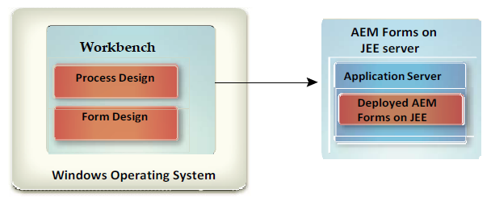

# Installera Workbench {#install-workbench}

Det här dokumentet innehåller anvisningar om hur du installerar och konfigurerar AEM Forms Workbench. Installationsprogrammet installerar även Forms Designer.

## Who should read this document? {#who-should-read-this-doc}

Det här dokumentet är avsett för administratörer och utvecklare som ansvarar för att installera, konfigurera, administrera eller distribuera Workbench. Här finns även information som behövs för att konfigurera systemet så att det stöder dina uppgraderade AEM Forms-processer. Informationen baseras på antagandet att alla som läser det här dokumentet känner till operativsystemet Microsoft® Windows®.

## Ytterligare information {#additional-information}

Resurserna i den här tabellen kan hjälpa dig att lära dig mer om och komma igång med AEM Forms.
<table>
 <tbody>
  <tr>
   <td>
<strong>Mer information om</strong>
 </td>
   <td>
<strong>Se</strong>
 </td>
  </tr>
  <tr>
   <td>
Procedurinformation för Workbench
 </td>
   <td>
<a href="https://helpx.adobe.com/content/dam/help/en/experience-manager/6-5/forms/pdf/WorkbenchHelp.pdf">Workbench Hjälp</a>    
 </td>
  </tr>
  <tr>
   <td>
Allmän information om AEM Forms och hur det integreras med andra Adobe-produkter
 </td>
   <td>
<a href="http://adobe.com/go/learn_aemforms_introduction_65">Översikt över</a>  AEM-formulär   
 </td>
  </tr>
  <tr>
   <td>
All tillgänglig dokumentation för AEM Forms
 </td>
   <td>
<a href="http://adobe.com/go/learn_aemforms_introduction_65">AEM Forms-dokumentation</a>   
 </td>
  </tr>
  <tr>
   <td>
Lappa uppdateringar, tekniska anteckningar och ytterligare information om den här produktversionen
 </td>
   <td>
Kontakta Adobe Enterprise Support</a>   
 </td>
  </tr>
 </tbody>
</table>

>[!NOTE]
>
>Flex Workspace används inte i AEM Forms. Det finns för AEM Forms-versionen.

## Innan du installerar {#before-you-install}

### Installationsöversikt för Workbench {#workbench-installation-overview}

Workbench är en integrerad utvecklingsmiljö (IDE) som utvecklare och formulärförfattare använder för att skapa automatiserade affärsprocesser och formulär. Det används också för att hantera de resurser och tjänster som processerna och formulären använder.

Följande bild visar Workbench-installationen:
* Processdesign med Workbench
* Formulärdesign med Designer

>[!NOTE]
>
>AEM Forms-servern kräver ett separat installationsprogram. Mer information finns i AEM Forms om JEE-installation.

## Systemkrav {#system-prerequisites}

I det här avsnittet beskrivs maskinvaru- och programvarukraven samt vilka plattformar som stöds.

### Lägsta maskin- och programvarukrav {#minimum-hardware-software-requirements}

**Workbench**Följande krav rekommenderas som minimum:
Diskutrymme för installation:
* 680 MB endast för Workbench.
* 2,15 GB på en enda enhet för en fullständig installation av Workbench, Designer och exempelpaketet.
* 400 MB för temporära installationskataloger - 200 MB i användarens \temp-katalog och 200 MB i Windows temporära katalog.

>[!NOTE]
>
>Om alla dessa platser finns på en enda enhet måste det finnas 1,5 GB ledigt utrymme under installationen. De filer som kopieras till de tillfälliga katalogerna tas bort när installationen är klar.

* Maskinvarukrav: Intel® Pentium® 4 eller AMD-motsvarighet, 1 GHz-processor.
* Java™ Runtime Environment (JRE) 7.0 update 51 or later updates to 7.0.
* Minst 1 024 × 768 pixlar eller högre bildskärmsupplösning med 16-bitars färg eller högre.
* TCP/IPv4- eller TCP/IPv6-nätverksanslutning till AEM Forms-servern.
* Installera Visual C++ Redistributable runtime Packages 2012 32-bit.
* Installera Visual C++ Redistributable runtime Packages 2013 32-bit.

>[!NOTE]
>
>Du måste ha administratörsbehörighet för att installera Workbench. Om du installerar med ett icke-administratörskonto uppmanas du att ange autentiseringsuppgifter för ett lämpligt konto.

### Plattformar som stöds {#supported-platforms}

Se den fullständiga listan över plattformar som stöds för Workbench på [plattformar](http://adobe.com/go/learn_aemforms_supportedplatforms_65)som stöds i AEM Forms.

## Installationsfrågor för Designer {#designer-installation-considerations}

Workbench-installationen innehåller som standard en motsvarande version av Designer som endast finns på engelska. Om Workbench-installationsprogrammet upptäcker en befintlig version av Designer på datorn kan installationen avslutas och du måste ta bort den aktuella versionen av Designer innan du kan fortsätta.
Tabellen nedan innehåller en fullständig lista över möjliga installationsscenarier för Designer som du kan stöta på, samt alla åtgärder du måste vidta när du installerar Workbench.

<table>
 <tbody>
  <tr>
   <td>
<strong>Installerad version av Designer</strong>
 </td>
   <td>
<strong>Nödvändiga åtgärder</strong>
 </td>
  </tr>
  <tr>
   <td>
Acrobat Pro eller Acrobat Pro Extended (inkluderar Designer)
 </td>
   <td>
Inget.  
Workbench-installationen identifierar en instans av Designer på datorn som installerats med antingen Acrobat Pro eller Acrobat Pro Extended. 
Olika versioner av Designer kan finnas samtidigt i samma system, till exempel Designer 6.4.x för Workbench 6.4 och Designer 6.5.0.x för Workbench 6.5. Du behöver inte avinstallera den version av Designer som har installerats med Acrobat 10 Pro eller Acrobat 10 Pro Extended eller senare.
 
 </td>
  </tr>
  <tr>
   <td>
Designer (fristående)
 </td>
   <td>
Inget.  Den version av Designer som ingår i Workbench är endast engelsk.  Installationsprogrammet för Workbench kommer inte att installera om en ny version av Designer. Istället kommer en uppdaterad version, som medföljer installationsprogrammet för Workbench, att korrigeras. På så sätt kan du även använda din lokaliserade version av Designer i Workbench.  
 </td>
  </tr>
 </tbody>
</table>

### Så här avinstallerar du Designer (fristående) i Windows 10 {#uninstall-designer-standalone-windows10}

1. Gå till **Kontrollpanelen > Program > Program och funktioner**
1. Välj **Adobe Designer** i listan Installerade program.
1. Klicka på **Avinstallera** och sedan på **Ja**.

## Installerar Workbench {#installing-workbench}

I det här kapitlet beskrivs hur du installerar Workbench.

### Installera och köra Workbench {#installing-and-running-workbench}

Innan du installerar Workbench måste du kontrollera att miljön innehåller den programvara och maskinvara som krävs för att köra den (se avsnitt: **Innan du installerar**).

**Så här installerar och kör du Workbench:**

1. Gör något av följande:
   * Navigera till katalogen \workbench på installationsmediet och dubbelklicka på filen run_windows_installer.bat.
   * Ladda ned och expandera Workbench till filsystemet. Navigera sedan till katalogen \workbench och dubbelklicka på filen run_windows_installer.bat.
   >[!IMPORTANT]
   >
   >Installationsprogrammet för Workbench körs bara från en lokal enhet. Den kan inte köras från en fjärrplats.

   >[!NOTE]
   >
   >Om du får felmeddelandet&quot;Det gick inte att skapa den virtuella Java-datorn&quot; skapar du en miljövariabel med namnet _JAVA_OPTIONS med värdet -Xmx512M och kör installationsprogrammet.

1. Klicka på Nästa på skärmen Introduktion.
1. Läs produktlicensavtalet, välj Jag accepterar villkoren i licensavtalet och klicka sedan på Nästa.
1. (Valfritt) Välj Installera Adobe Designer om du behöver det här verktyget för att skapa och ändra formulär.

   >[!NOTE]
   >
   >Du kan fortsätta använda Designer som installerats med Acrobat 10 genom att lämna det här alternativet avmarkerat.

1. Acceptera standardkatalogen enligt listan eller klicka på Välj och navigera till den katalog där du ska installera Workbench. Klicka sedan på Nästa.

   >[!NOTE]
   >
   >Installationskatalogsökvägen får inte innehålla tecknen # (pund) och $ (dollar).

1. Granska förinstallationssammanfattningen och klicka på Installera. Installationsprogrammet visar installationsförloppet.
1. Granska installationssammanfattningen. Välj Starta AEM Forms Workbench för att starta Workbench och klicka på Nästa.
1. Granska versionsinformationen och klicka på Klar.
1. Följande objekt är nu installerade på datorn:
   * **Workbench**: Om du vill köra Workbench från Start-menyn väljer du Alla program > AEM Forms > Workbench, om du väljer att spara genvägsmappen där. Mer information finns i dokumentationen <a href="https://helpx.adobe.com/content/dam/help/en/experience-manager/6-5/forms/pdf/WorkbenchHelp.pdf">Använda Workbench</a> .
   * **Designer**: Du kan öppna Designer inifrån Workbench. Mer information finns i avsnittet Komma igång i <a href="https://helpx.adobe.com/content/dam/help/en/experience-manager/6-5/forms/pdf/using-designer.pdf">Designer-hjälpen</a>.
   * **AEM Forms SDK**: Mer information om hur du använder SDK finns i <a href="http://www.adobe.com/go/learn_aemforms_programming_65">Programmering med AEM Forms</a>.

## Uppgraderingsprocesser {#upgrading-processes}

AEM Forms på JEE-processer kan uppgraderas till AEM Forms-program med hjälp av uppgraderingsguiden. Mer information finns i Uppgradera dokumentation om artefakter i Workbench-hjälpen.

### Konfigurera och logga in på en server {#configuring-and-logging-server}

Om du vill använda Workbench måste du ha en instans av AEM Forms igång, vanligtvis på en separat dator. Du måste ha ett användarnamn och lösenord för att kunna logga in på AEM Forms, samt information om var servern finns.

>[!NOTE]
>
>Om du konfigurerade AEM Forms att använda databasprovidern EMC Documentum eller IBM FileNet och du vill logga in i en annan databas än den som är konfigurerad som standard i administrationskonsolen för AEM-formulär anger du användarnamnet som username@Repository.

### Konfigurera timeout-inställningar {#configuring-timeout-settings}

Workbench gör som standard en timeout efter två timmar, oavsett aktivitet eller inaktivitet. Information om hur du redigerar timeoutinställningen finns i&quot;Konfigurera användarhantering > Konfigurera avancerade systemattribut&quot; i hjälpen <a href="https://docs.adobe.com/content/help/en/experience-manager-65/forms/administrator-help/configure-user-management/configure-advanced-system-attributes.html">till</a>administrationskonsolen.

### Konfigurera Workbench för anslutning via HTTPS {#configuring-workbench-to-connect-over-HTTPS}

Om du vill ansluta Workbench till en AEM Forms-server via HTTPS måste du se till att den certifikatutfärdare (CA) som utfärdade den offentliga nyckeln tolkas som tillförlitlig av Workbench. Om certifikatet inte identifieras som om det kommer från en betrodd källa måste du uppdatera cacert-filen som finns i katalogen [Workbench_HOME]/workbench/jre/lib/security.

>[!NOTE]
>
>[Workbench_HOME] representerar katalogen där du installerade Workbench. Standardplatsen är C:\Program Files (x86)\Adobe Experience Manager Forms Workbench.

Kontrollera att du ansluter till HTTPS med det namn som anges i certifikatet. Det här namnet är vanligtvis det fullständiga, kvalificerade värdnamnet.

**Så här uppdaterar du cacert-filen**:
1. Kontrollera att du har en kopia av SSL-certifikatet (Secure Sockets Layer). Kontakta antingen administratören som konfigurerade SSL-servern eller exportera certifikatet med en webbläsare.

   >[!NOTE]
   >
   >Om du vill exportera certifikatet öppnar du en webbläsare och loggar in på administrationskonsolen, installerar certifikatet i webbläsaren och exporterar sedan certifikatet från webbläsaren till en tillfällig lagringsplats (eller direkt till katalogen [Workbench_HOME]/workbench/jre/lib/security).

1. Kopiera certifikatet till katalogen [Workbench_HOME]/workbench/jre/lib/security.

1. Öppna ett kommandotolkfönster, navigera till [Workbench_HOME]/workbench/jre/bin och skriv sedan följande kommando:
   `keytool -import -storepass changeit -file [Workbench_HOME]\workbench\jre\lib\security\ssl_cert_for_certname.cer -keystore [Workbench_HOME]\workbench\jre\lib\security\cacerts -alias example`
Var:
   * change är standardlösenordet för cacerts-nyckelbehållaren.
   * certname är det certifikat du valde i steg 1.
   * är ett exempel på det alias som du väljer för certifikatet. Det här värdet kan ändras

1. När du uppmanas att lita på certifikatet skriver du Ja och trycker på Retur. Nyckelverktyget fortsätter att importera kontofilen till katalogen [Workbench_HOME]/workbench/jre/lib/security.

1. Stäng och starta om Workbench för att tillämpa ändringarna.

### Konfigurera cacheinställningar för dynamiskt genererade mallar {#configuring-cache-settings-for-dynamically-generated-templates}

Följande aspekter av cacheåtgärden bör beaktas om programmet genererar unika mallar direkt genom att automatiskt uppdatera XFA-innehåll. I själva verket använder varje transaktion en ny, unik mall.

När formulärgeneratorn eller utdataanvändaren söker efter, eller uppdaterar, poster i cachen efter en viss formulärmall, används flera nyckelvärden för att hitta den specifika cachepost som ska användas.

* **Mallfilens namn**: Plats och filnamn för mallen som används som primär unik identifierare för det cachelagrade formuläret.
* **Tidsstämpel**: Mallfilen innehåller en tidsstämpel som används för att bestämma formulärets senaste uppdateringstid.
* **Mall-UID**: Designer infogar en unik identifierare (UUID) för formuläret och dess version i varje mall. Varje gång formuläret uppdateras uppdateras det inbäddade UUID:t. En XDP-mall kan till exempel visa följande innehåll:

   `<?xml version="1.0" encoding="UTF-8"?>`
   `<?xfa generator="AdobeAEM formsDesignerES_V8.2" APIVersion="2.6.7185.0"?><xdp:xdp xmlns:xdp=http://ns.adobe.com/xdp/ timeStamp="2008-07-29T21:22:12Z" uuid="823e538f-ff6c-4961-b759-f7626978a223"><template xmlns="http://www.xfa.org/schema/xfa-template/2.6/">`

* **Återgivningsalternativ**: I den återgivna formulärcachen lagras cacheinnehållet separat för varje uppsättning unika återgivningsalternativ.

Forms-tjänsten tar emot mallar utifrån filnamn eller databasplats, eller efter värde som ett XML-objekt i minnet.
* **Mallar som skickas med referens**: Innehållsroten och formulärnamnet används. Om unika mallar med olika filnamn skickas i varje begäran med den här metoden kommer diskcachen att växa oändligt och aldrig återanvändas. För att förhindra detta bör unika mallar skickas med samma filnamn för att säkerställa att samma cache uppdateras för alla begäranden.
* **Mallar som skickas av värde**: Använder mallbyte som skickas tillsammans med data med parametern inDataDoc. Om unika mallar med olika UUID skickas med den här metoden kommer diskcachen att växa oändligt och aldrig återanvändas. För att förhindra detta bör UUID-attributet tas bort från alla mallar för att säkerställa att ingen cache skapas för mallen. Om du skickar samma UUID som inte är null kan cacheobjekten skapas, men det säkerställer att samma cache uppdateras vid varje begäran.

För att förhindra att cacheminnet växer i oändlighet bör du överväga följande faktorer för att återge dynamiskt genererade mallar med de nya API:erna för AEM Forms, som renderHTMLForm2 och renderPDFForm2.

När du använder de nya API:erna skickas mallen som ett dokumentobjekt, som hanteras i Forms-tjänsten baserat på om den är passiv eller inte.

För passiva dokument där UUID och innehållsroten fungerar som cachenyckel bör du tänka på följande:
* Cachen skapas inte för passiva indatamallar utan UUID.
* Om fler än en passiv indatamall med samma UUID och innehållsrot skickas, skrivs samma cache över.

För icke-passiva dokument där filnamnet och innehållsroten fungerar som cachenyckel bör du tänka på följande:
* För icke-passiva indatamallar beror cachelagringen på innehållsroten och filnamnet som dokumentet genererades från.
Samma cache används endast för begäranden med samma innehållsrot och mallfilnamn.
Följande bästa tillvägagångssätt säkerställer att cachen inte växer i oändlighet när dynamiskt genererade mallar skickas till Forms-tjänsten:
   * Ta bort UUID eller skicka samma UUID i alla dynamiskt genererade mallar.
   * Generera dokumentet antingen från mallbyte eller från samma filnamn på disken.

### Avinstallerar Workbench {#uninstalling-workbench}

Använd funktionen Lägg till eller ta bort program på Kontrollpanelen för att starta avinstallationsprogrammet. Workbench- och Designer-programmen har separata avinstallationsprogram.

## Konfigurera AEM Forms XDC Editor {#configuring-aem-forms-xdc-editor}

Med XDC-redigeringsprogrammet kan nätverksskrivaradministratörer skapa och ändra XDC-filer (XML Forms Architecture Device Configuration). XDC-filer beskriver skrivarens funktioner, till exempel skrivarens språk eller korrelationen mellan pappersstorlek och fackets placering.

Innan administratören för nätverksskrivaren använder XDC-redigeringsprogrammet ska du flytta XDC-exempelfilerna och läsa Skapa enhetsprofiler med XDC-redigeringsprogrammet.

**Så här hämtar du XDC-exempelfilerna**:
1. På AEM Forms-servern letar du reda på XDC-mappen i [AEM Forms-rotmappen]\sdk\samples\Output\IVS.
1. Kopiera innehållet i den här mappen till en katalog som är tillgänglig från Workbench- eller Eclipse-systemet.

**Så här får du hjälp** om XDC Editor:
1. Gå till dokumentationswebbplatsen för AEM Forms.
1. Klicka på fliken **Framkalla** och navigera till Skapa enhetsprofiler med XDC-redigeringsprogrammet. Hämta filen xdc_editor_help_web.zip och installera hjälpfilerna genom att följa instruktionerna i Viktigt-filen.

