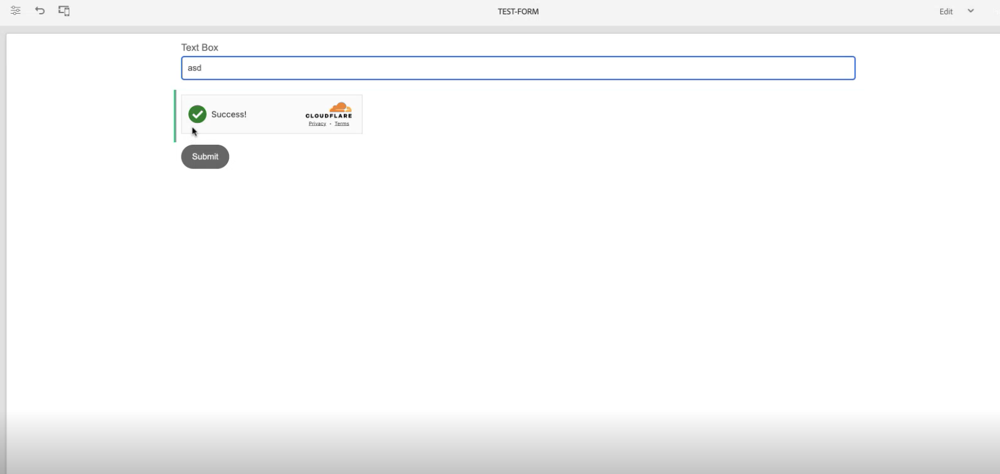

# Koppla samman din AEM Forms-miljö med Turnstile {#connect-your-forms-environment-with-turnstile-service}

<!--

 This feature is under the Early Adopter Program. You can write to aem-forms-ea@adobe.com from your official email id to join the early adopter program and request access to the capability. 

-->

 Den här funktionen är under det tidiga adopterprogrammet. Om du är intresserad av att delta i vårt program för tidig åtkomst för den här funktionen kan du skicka ett e-postmeddelande från din officiella adress till aem-forms-ea@adobe.com och begära åtkomst till 

CAPTCHA (Completely Automated Public Turing test to tell Computers and Humans Apart) är ett program som ofta används vid onlinetransaktioner för att skilja mellan människor och automatiserade program eller organ. Det utgör en utmaning och utvärderar användarens svar för att avgöra om det är en människa eller en robot som interagerar med webbplatsen. Det förhindrar användaren att fortsätta om testet misslyckas och gör onlinetransaktionerna säkra genom att förhindra att skräppost eller skadliga syften publiceras.

AEM Forms 6.5 stöder följande CAPTCHA-lösningar:

* [Turnstile Captcha](/help/forms/using/integrate-adaptive-forms-turnstile.md)
* [Google reCAPTCHA](/help/forms/using/captcha-adaptive-forms.md)
* [hCaptcha](/help/forms/using/integrate-adaptive-forms-hcaptcha.md)

<!-- -->

## Integrera AEM Forms med Turnstile Captcha

Cloudflare&#39;s Turnstile Captcha är en säkerhetsåtgärd som syftar till att skydda formulär och webbplatser från automatiserade robotar, skadliga attacker, spam och oönskad automatiserad trafik. Den visar en kryssruta när formuläret skickas in för att verifiera att det är humant, innan det går att skicka in formuläret.

### Förutsättningar för att integrera AEM Forms-miljön med Turnstile Captcha {#prerequisite}

Om du vill konfigurera Turnstile för AEM Forms måste du hämta [Turnstile sitekey och hemlig nyckel](https://developers.cloudflare.com/turnstile/get-started/) från Turnstile-webbplatsen.

### Konfigurera vändning {#steps-to-configure-hcaptcha}

Så här integrerar du AEM Forms med den färdiga tjänsten:

1. Skapa en konfigurationsbehållare i din AEM Forms-miljö. En konfigurationsbehållare innehåller molnkonfigurationer som används för att ansluta AEM Forms till externa tjänster. Så här skapar du en konfigurationsbehållare:
   1. Öppna AEM Forms-miljön.
   1. Gå till **[!UICONTROL Tools > General > Configuration Browser]**.
   1. I konfigurationsläsaren väljer du en befintlig mapp eller skapar en ny:
      * Så här skapar du en **ny mapp** och aktiverar molnkonfigurationer:
         1. Klicka på **[!UICONTROL Create]** i konfigurationsläsaren.
         1. Ange ett namn, en titel och markera **[!UICONTROL Cloud Configurations]** i dialogrutan Skapa konfiguration.
         1. Klicka på **[!UICONTROL Create]**.
      * Så här aktiverar du molnkonfiguration för en **befintlig mapp**:
         1. Markera mappen i Configuration Browser och klicka på **[!UICONTROL Properties]**.
         1. Aktivera **[!UICONTROL Cloud Configurations]** i dialogrutan Konfiguration.
         1. Klicka på **[!UICONTROL Save & Close]** för att spara konfigurationen.

1. Konfigurera dina Cloud Service:
   1. Gå till  > **[!UICONTROL Cloud Services]** och klicka på **[!UICONTROL Turnstile]** i AEM författarinstans.
      
   1. Välj en konfigurationsbehållare, skapad eller uppdaterad, enligt beskrivningen i föregående avsnitt. Klicka på **[!UICONTROL Create]**.
      
   1. Ange **[!UICONTROL Widget Type]** som hanterad, icke-interaktiv eller osynlig.
   1. Ange annan information som **[!UICONTROL Title]**, **[!UICONTROL Name]**.
   1. Ange **[!UICONTROL Site Key]** och **[!UICONTROL Secret Key]** för den färdiga tjänsten [ som hämtats i förutsättning ](#prerequisite).
   1. Klicka på **[!UICONTROL Create]**.

      

   >[!NOTE]
   > Användare behöver inte ändra validerings-URL:en på klientsidan och validerings-URL:en på serversidan eftersom de redan är förifyllda för aktiveringsvalidering.

   När Turnstile Captcha-tjänsten har konfigurerats kan den användas i din adaptiva form.

## Använd Turnstile i ett anpassat formulär {#using-turnstile-aem-6.5}

1. Öppna AEM Forms-miljön.
1. Gå till **[!UICONTROL Forms]** > **[!UICONTROL Forms and Documents]**.
1. Välj ett anpassat formulär och klicka på **[!UICONTROL Properties]**. I **[!UICONTROL Configuration Container]** väljer du din molnkonfiguration för Turnstle®.
1. Klicka på **[!UICONTROL Save & Close]**.

   Om du inte har någon sådan konfigurationsbehållare kan du läsa avsnittet [Anslut din AEM Forms-miljö med Turnstle](#connect-your-forms-environment-with-turnstile-service) för att lära dig hur du skapar en konfigurationsbehållare.

   

1. Välj ett anpassat formulär och klicka på **[!UICONTROL Edit]** för att öppna det anpassade formuläret i redigeraren.
1. Dra och släpp eller lägg till komponenten **[!UICONTROL Adaptive Form Turnstile]** i det adaptiva formuläret från komponentwebbläsaren.
1. Markera komponenten **[!UICONTROL Adaptive Form Turnstile]** och klicka på egenskapsikonen  . Dialogrutan Egenskaper öppnas. Ange följande egenskaper:

   <!---->
   

   * **[!UICONTROL Title]:** Ange titeln för Captcha-komponenten. Du kan enkelt identifiera en formulärkomponent med dess unika titel både i formuläret och i regelredigeraren.
   * **[!UICONTROL Configuration Settings]:** Välj en molnkonfiguration som har konfigurerats för Turnstle.
   * **[!UICONTROL Validation Message]:** Ange ett valideringsmeddelande för att validera Captcha vid formuläröverföring eller vid en användaråtgärd.
   * **[!UICONTROL Captcha Service]:** Välj CAPTCHA-tjänsten för att skicka formulär, här väljer du Turnstle®.
   * **[!UICONTROL Configuration Settings]:** Välj din molnkonfiguration som är konfigurerad för Turnstle®.
     >[!NOTE]
     >Du kan ha flera molnkonfigurationer i din miljö i liknande syfte. Välj tjänsten noggrant. Om ingen tjänst visas läser du [Ansluta AEM Forms-miljön med Turnstile](#connect-your-forms-environment-with-turnstile-service) för att lära dig hur du skapar en Cloud Service som ansluter AEM Forms-miljön till den färdiga tjänsten.
   * **Felmeddelande:** Ange felmeddelandet som ska visas för användaren när Captcha-överföringen misslyckas.
   * **Captcha-storlek:** Du kan välja visningsstorlek för utmaningsdialogrutan hCaptcha®. Använd alternativet **[!UICONTROL Compact]** om du vill visa en liten storlek och **[!UICONTROL Normal]** om du vill visa en relativt stor hCaptcha®-utmaningsdialogruta.

1. Välj **[!UICONTROL Done]**.

Nu är det bara berättigade formulär, där formuläranvändaren kan ta bort den utmaning som Turnstile-tjänsten utgör, som kan användas för att skicka in formuläret.

## Vanliga frågor

* **F: Kan jag använda mer än en Captcha-komponent i ett adaptivt formulär?**
* **Ans:** Det går inte att använda fler än en Captcha-komponent i ett adaptivt formulär. Du bör inte heller använda en Captcha-komponent i ett fragment eller en panel som är markerad för lazy loading.

## Se även {#see-also}

* [Använda CAPTCHA i anpassningsbara formulär](/help/forms/using/captcha-adaptive-forms.md)
* [Använda Captcha i anpassningsbara formulär](/help/forms/using/integrate-adaptive-forms-hcaptcha.md)