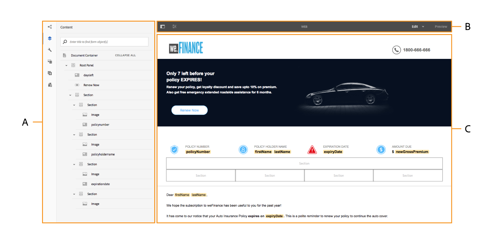
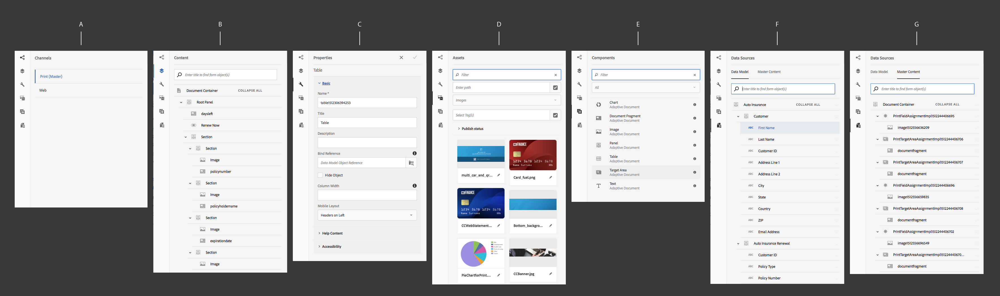

# Introduktion till gränssnittet för utveckling av interaktiv kommunikation{#introduction-to-interactive-communication-authoring-ui}

Användargränssnittet för att skapa [interaktiv kommunikation](/help/forms/using/interactive-communications-overview.md) är intuitivt och innehåller följande funktioner för att skapa trycksaker och webbkanaler i interaktiv kommunikation:

* WYSIWYG-dokumentredigerare med dra-och-släpp
* Integrerad databas för resurser - de resurser som överförs till och skapas på servern finns i resursläsaren i redigeringsgränssnittet för interaktiv kommunikation

När du [skapar en ny eller redigerar en befintlig interaktiv kommunikation](../../forms/using/create-interactive-communication.md)använder du följande element i användargränssnittet:

* [Sidebar](#sidebar)
* [Verktygsfältet Sida](#page-toolbar)
* [Komponentverktygsfältet](#component-toolbar)
* Innehållsområde

******S. Sidofält** B. Verktygsfältet Sida **C.** Innehållsområde

## Sidebar {#sidebar}

**************S. Kanalwebbläsare** B. Innehållsbläddraren **C.** Properties browser **D. Resursläsaren** E. Komponentbläddraren **F. Webbläsaren Datakällor - Datamodell** G. Webbläsaren Datakällor - Huvudinnehåll

<!-- Click to enlarge

-->

Sidlisten innehåller följande:

* **Kanalwebbläsare**

Med hjälp av webbläsaren Kanal kan du växla mellan tryck- och webbkanalerna i den interaktiva kommunikationen. Beroende på vilken kanal du har valt i webbläsaren visas alternativen i webbläsarna, till exempel Innehåll och Komponenter.

* **Innehållsläsaren** I innehållsläsaren kan du se dokumentets objekthierarki för den valda kanalen. Författaren kan navigera till en viss komponent genom att trycka på det elementet i dokumentobjektträdet. Författaren kan söka efter objekt i webbkanalen och ordna om dem från det här trädet.

* **Egenskapswebbläsaren**

   Gör att du kan redigera egenskaperna för en komponent. Egenskaperna ändras beroende på komponenten. Om du till exempel vill se egenskaper för dokumentbehållaren:
Markera en komponent, tryck sedan på  > **Dokumentbehållare** och tryck sedan på .

* **Resursläsaren** Segmenterar olika typer av innehåll, t.ex. layoutfragment, bilder, dokument, sidor, videor. Författaren kan dra och släppa material i den interaktiva kommunikationen.

* **Komponentwebbläsaren** innehåller komponenter som du kan använda för att skapa utskrifts- och webbkanaler för ett dokument. Du kan dra komponenter till den interaktiva kommunikationen för att lägga till element och konfigurera tillagda element enligt kraven. I följande tabell beskrivs komponenterna i komponentwebbläsaren för utskrifts- och webbkanaler:

| **Komponent** | **Utskriftskanal** | **Webbkanal** | **Funktionalitet** |
|---|---|---|---|
| Diagram | ✓ | ✓ | Lägger till ett diagram som du kan använda i en interaktiv kommunikation för visuell representation av tvådimensionella data som hämtats från ett objekt i en datamodell för formulär. |
| Dokumentfragment | ✓ | ✓ | Gör att du kan lägga till en återanvändbar komponent, text, lista eller villkor i en interaktiv kommunikation. Den återanvändbara komponenten som du lägger till i en interaktiv kommunikation kan antingen vara modellbaserad i form av formulärdata eller utan någon formulärdatamodell. |
| Bild | ✓ | ✓ | Gör att du kan infoga en bild. |
| Panel | - | ✓ | Panelkomponenten är en platshållare för att gruppera andra komponenter och styr hur en grupp med komponenter placeras i ett interaktivt meddelande. Med en panelkomponent kan du också göra en grupp komponenter repeterbara för slutanvändaren, t.ex. i flera poster som krävs för att fylla i inloggningsuppgifter. Det är också bra att använda en panel var för en flik i en interaktiv kommunikation med flera flikar. |
| Tabell | * | ✓ | Lägger till en tabell där du kan ordna data i rader och kolumner. |
| Målområde | ** | ✓ | Infogar ett målområde i en webbkanal för att ordna de webbkanalsspecifika komponenterna. |
| Text | - | ✓ | Lägger till text i webbkanalen i en interaktiv kommunikation. Text kan använda formulärdatamodellsobjekt för att göra innehållet dynamiskt. |

* Använd Layoutfragment i utskriftskanalen för att lägga till tabeller.

** I utskriftskanalen är målområdena fördefinierade i XDP/utskriftsmallen. Du kan inte lägga till nya målområden med hjälp av gränssnittet för redigering av interaktiv kommunikation.

* **Webbläsaren Datakällor** Datakällor visar de tillgängliga datakällorna i den formulärdatamodell som du valde när du skapade den interaktiva kommunikationen.

### Viktiga punkter för arbete med komponenter {#key-points-for-working-with-components}

De viktigaste punkterna när du arbetar med interaktiva kommunikationskomponenter är följande:

* Varje komponent har tillhörande egenskaper som styr dess utseende och funktion. Om du vill konfigurera egenskaperna för en komponent trycker du på komponenten och trycker på  för att öppna komponentegenskaperna i egenskapsläsaren.
* En komponent identifieras med sitt elementnamn. När du trycker på kan du ändra komponentens namn genom att ändra fältvärdet för elementnamn i egenskapsläsaren. Endast bokstäver, siffror, bindestreck (-) och understreck (_) godkänns i fältet Elementnamn. Andra specialtecken tillåts inte och elementnamnet måste börja med en bokstav.
* Du kan ändra egenskapen Title för en interaktiv kommunikationskomponent infogad i redigeraren utan att öppna egenskapsläsaren så länge titeln visas i den interaktiva kommunikationen. Så här gör du:

   1. Tryck för att markera en komponent som har en Title-egenskap och vars Hide title-egenskap är inaktiverad.
   1. Tryck på  för att göra titeln redigerbar.

   1. Ändra titeln och tryck på Retur-tangenten eller var som helst utanför komponenten för att spara ändringarna. Tryck på Esc för att ignorera ändringarna.

## Komponentverktygsfältet {#component-toolbar}

När du markerar en komponent visas ett verktygsfält där du kan arbeta med den. Du får alternativ för att klippa ut, klistra in, flytta och ange egenskaper för komponenterna. Dina alternativ är:

A.**Konfigurera**: När du trycker på **Konfigurera** visas komponentegenskaperna i sidofältet.

B.**Redigera regler**: När du trycker på Redigera regler visas Regelredigeraren där du kan redigera och skapa regler för den valda komponenten. I Regelredigeraren kan du även markera andra formulärobjekt (komponenter) och redigera/skapa regler för dessa formulärobjekt.

C.**Copy**: Du kan använda kopieringsalternativet för att kopiera en komponent och klistra in den på andra platser i den interaktiva kommunikationen.

D.**Klipp** ut: Du kan använda alternativet Klipp ut för att flytta en komponent från en plats till en annan i den interaktiva kommunikationen.

E. **Ta bort**: Gör att du kan ta bort komponenten från den interaktiva kommunikationen.

F. **Infoga komponent**: Gör att du kan infoga en komponent ovanför den markerade komponenten.

G. **Klistra in**: Gör att du kan klistra in komponenten som du klipper ut eller kopierar med alternativen som beskrivs ovan.

H. **Grupp**: Gör att du kan markera flera komponenter om du vill klippa ut, kopiera eller klistra in mer än en komponent tillsammans.

Jag. **Överordnad**: Gör att du kan välja en komponents överordnade.

**J.** Visa SOM-uttryck: Gör att du kan visa [SOM-uttrycket](../../forms/using/using-som-expressions-adaptive-forms.md) för komponenten.

**K: Gruppera** objekt i panelen: Gör att du kan gruppera komponenterna på en panel för att kunna utföra åtgärder på dessa komponenter samtidigt. Mer information finns i [Gruppera objekt på panelen](../../forms/using/create-interactive-communication.md#main-pars-header-1815149576).

L. **Lägg till underordnad panel** (endast för paneler): Gör att du kan lägga till en underordnad panel på panelen.

M: Verktygsfältet **Lägg** till panel (endast för paneler):Gör att du kan lägga till verktygsfältet för panelkomponenten. Sedan kan du utföra ytterligare åtgärder i verktygsfältet.

Med alternativet **Ersätt** i verktygsfältet kan du dessutom ersätta den befintliga komponenten med en alternativ komponent. Alternativet är inte tillgängligt för panelkomponenten.

## Verktygsfältet Sida {#page-toolbar}

Verktygsfältet Sida överst innehåller alternativ som gör att du kan förhandsgranska den interaktiva kommunikationen och ändra dess egenskaper. Du kan förhandsgranska den interaktiva kommunikationen när du redigerar den och göra ändringar i den. I verktygsfältet visas:

* Växla : Här kan du visa eller dölja sidofältet.
* Sidinformation, : Här kan du visa sidegenskaper.
* Emulatorlinjal : Gör att du kan emulera utseendet i din interaktiva kommunikation för olika visningsstorlekar, som surfplattor och telefoner.
* Redigera: Här kan du välja andra lägen, till exempel: Redigera, Formatera, Utvecklare och Design.

   * Redigera: Här kan du redigera egenskaperna för den interaktiva kommunikationen och dess komponenter. Du kan till exempel lägga till en komponent, släppa en bild och ange obligatoriska fält.
   * Format: Gör att du kan formatera komponenterna i din interaktiva kommunikation. I stilläge kan du till exempel markera en panel och ange dess bakgrundsfärg.
   * Utvecklare: Låter en utvecklare:

      * Upptäck vad interaktiv kommunikation består av.
      * Felsök vad som händer var och när, vilket i sin tur hjälper till att lösa problem.
   * Mål: Gör att du kan aktivera eller inaktivera anpassade komponenter eller komponenter som inte finns med i sidofältet.

* Förhandsgranska: Här kan du förhandsgranska hur den interaktiva kommunikationen ser ut när du publicerar den.

