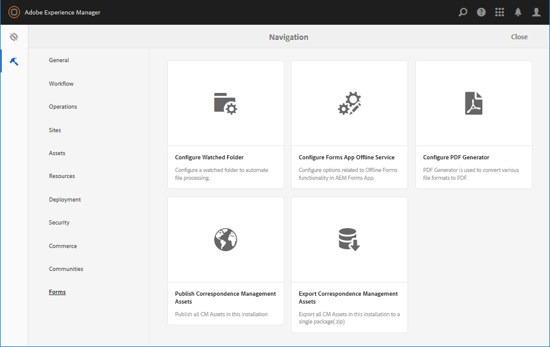
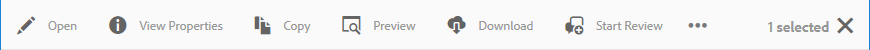

# Introduktion till hantering av formulär{#introduction-to-managing-forms}

AEM Forms har ett förenklat men ändå kraftfullt användargränssnitt för att skapa och hantera formulär, dokument, teman, bokstäver, dokumentfragment, dataordlistor och relaterade resurser. Det hjälper till att hantera hela livscykeln för formulär, dokument och relaterade resurser - från utvecklarens dator till att erbjuda dem på en portalserver för slutanvändarna. Du kan använda användargränssnittet i AEM Forms för att:

* Åtkomst till AEM Forms-komponenter
* Åtkomst till AEM Forms-konfigurationer

>[!NOTE]
>
>Mer information om andra AEM-verktyg och -alternativ finns i [Redigering](/help/sites-authoring/author.md).

## Åtkomst till AEM Forms-komponenter {#access-aem-forms-components}

Tillsammans med alternativ för att skapa formulär, dokument och relaterade resurser innehåller AEM alternativ för att skapa webbplatser, resurser, hantera en AEM-instans och mycket annat. Du kan klicka på  Experience Manager-logotypen för att navigera till alla tillgängliga verktyg. Tillsammans med länkar till konsolerna för andra komponenter innehåller den även länkar för AEM Forms. Om du vill navigera till AEM Forms klickar du på Experience Managers logotyp  >  > Forms. Länkar till följande konsoler visas:

* Formulär och dokument
* Teman
* Bokstäver
* Dokumentfragment
* Dataordlistor

### Formulär och dokument {#forms-documents}

I Forms &amp; Documents finns alternativ för att skapa en interaktiv kommunikation, adaptiv form, adaptiva formulärfragment och formuläruppsättning. Det är bara för AEM Forms på JEE som Forms &amp; Documents kan importera filer från lokal lagring och synkronisera AEM Forms-resurser med Workbench.

Knappen Skapa är utgångspunkten för processen att skapa eller överföra AEM Forms-resurser. Här finns alternativ för att skapa:

* **Interaktiv kommunikation**: En interaktiv kommunikation är en personaliserad, interaktiv och enhetsvänlig HTML-baserad digital korrespondens, ett kontoutdrag eller dokument. Interaktiv kommunikation är lyhörd i naturen och ändrar layout och design automatiskt baserat på användarenhet och inställningar. Mer information finns i Översikt över [interaktiv kommunikation](/help/forms/using/interactive-communications-overview.md)

* **** Adaptiv form: En adaptiv form är en engagerande och responsiv form. Du kan skapa ett anpassat formulär som dynamiskt anpassar sig till användarens indata genom att lägga till eller ta bort formuläravsnitt baserat på användarens svar, enhet eller arbetsmiljö. Artikeln [Introduktion till utveckling av adaptiva formulär](../../forms/using/introduction-forms-authoring.md) innehåller detaljerad information om de adaptiva formulären.

* **** Adaptivt formulärfragment:Alla formulär har utformats för ett specifikt ändamål, men det finns några vanliga segment i de flesta formulär, till exempel för att ge personliga uppgifter som namn och adress, familjeinformation, inkomstinformation och så vidare. Du kan skapa en enskild resurs för sådana avsnitt. Dessa återanvändbara, fristående segment kallas adaptiva formulärfragment. Mer information finns i artikeln [adaptiva formulärfragment](../../forms/using/adaptive-form-fragments.md) .

* **** Formuläruppsättning: En formuläruppsättning är en samling HTML5-formulär som grupperats tillsammans och presenteras som en enda formuläruppsättning för slutanvändarna. När användarna börjar fylla i en formuläruppsättning, överförs formulären smidigt från ett formulär till ett annat. Användaren kan sedan skicka alla blanketter, som en enhet, med bara ett klick. Mer information finns i [Formuläruppsättning i AEM-formulär](../../forms/using/formset-in-aem-forms.md).

* **** Mapp: AEM Forms användargränssnitt använder mappar för att ordna resurser. Det har stöd för två typer av mappar:

   * **** Allmän mapp: De här mapparna används för resurser som skapats i användargränssnittet i AEM Forms. De här mapparna har ingen strikt mappstruktur. Du kan byta namn på, skapa undermappar och lagra adaptiva formulär, interaktiv kommunikation, adaptiva formulärfragment, formulärmallar (XDP), PDF-formulär, dokument och relaterade resurser i dessa mappar.
   * **** Mappen Formulärarbetsflöde: Mappar för formulärarbetsflöden skapas när Workbench-processer (LiveCycle-arkiv) migreras och synkroniseras med användargränssnittet i AEM Forms. Det är inte tillåtet att byta namn, skapa en undermapp, skapa en interaktiv kommunikation, ett adaptivt formulärfragment eller en interaktiv kommunikation. Det är inte heller tillåtet att ta bort en versionsmapp eller skapa och överföra ett adaptivt formulär, ett adaptivt formulärfragment eller en interaktiv kommunikation parallellt med versionsmappen.

******S. Allmän mapp** B. Mappen Formulärarbetsflöde

Panelen Formulär och dokument innehåller även alternativ för att:

* **** Importera filer från lokal lagring: Du kan importera PDF-formulär och -dokument, formulärmallar (XFA-formulär) och andra resurser (bild- och XML-schema för XSD-filer). Stegvisa instruktioner finns i [Importera och exportera resurser till AEM-formulär](../../forms/using/import-export-forms-templates.md).
* **** Synkronisera AEM Forms-resurser med Workbench: Du kan använda alternativet Filer från Workbench för att synkronisera resurser mellan användargränssnittet i AEM Forms och Workbench. Den ser till att alla resurser är tillgängliga i AEM Forms användargränssnitt och Workbenchs urval av resurser i crx-databaser.

### Teman {#themes}

Ett tema innehåller formatinformation för komponenter och paneler. Teman har en oberoende identitet. Du kan återanvända ett tema på flera adaptiva formulär. Du kan ange format för en komponent eller ändra CSS-egenskaper för olika komponenter som används i alla formulär. Format innehåller egenskaper som bakgrundsfärger, lägesfärger, genomskinlighet och storlek. Du kan spara anpassningar i ett tema och portera dem till komponenter i formuläret som en förinställning. När du lägger till temat i formuläret återspeglas det angivna formatet i motsvarande komponenter i formuläret. Med AEM 6.2 Forms kan du skapa teman och använda dem i dina formulär.

Mer information om hur du skapar och använder teman finns i [Teman i AEM-formulär](../../forms/using/themes.md).

### Bokstäver {#letters}

Ett AEM-formulärbrev är en säker, personlig och interaktiv korrespondens. Du kan använda AEM Forms för att snabbt sammanställa bokstäver (kallas även korrespondenser) från både förgodkänt och skräddarsytt innehåll i en smidig process.

Mer information om hur du skapar och använder bokstäver finns i [Skapa brev](../../forms/using/create-letter.md).

### Dokumentfragment {#document-fragments}

Dokumentfragment är återanvändbara delar eller komponenter av en korrespondens som du kan använda för att skapa brev. Dokumentfragmenten är av typen text, lista, villkor och layoutfragment. Mer information om hur du skapar och använder dokumentfragment finns i [Skapa dokumentfragment](/help/forms/using/document-fragments.md).

### Dataordlistor {#data-dictionaries}

Vanligtvis behöver företagsanvändare inte känna till metadata-representationer som XSD (XML-schema) eller Java-klasser. De kräver dock vanligtvis åtkomst till dessa datastrukturer och attribut för att kunna bygga lösningar. Med AEM Forms kan man använda dataordlista för att kunna använda information från backend-datakällor utan att behöva känna till teknisk information om underliggande datamodeller.

Mer information om hur du skapar och använder dataordlistor finns i Skapa [dataordlisteartikel](../../forms/using/data-dictionary.md)

## Åtkomst till AEM Forms-konfigurationer {#accessing-aem-forms-configurations}

AEM-verktygspanelen innehåller verktyg för olika komponenter. Om du vill navigera till AEM Forms-specifika verktyg klickar du på Experience Managers logotyp  > tools  > Forms. Verktyg för följande funktioner visas:

* **** Konfigurera bevakad mapp: En administratör kan konfigurera en nätverksmapp, en så kallad bevakad mapp, så att när en användare placerar en fil (till exempel en PDF-fil) i den bevakade mappen, startas en förkonfigurerad åtgärd och filen ändras. Mer information finns i [Skapa och konfigurera en bevakad mapp](/help/forms/using/creating-configure-watched-folder.md).
* **** Konfigurera Forms App Offline Service:Offlinetjänsten för AEM Forms-appen cachelagrar sökvägarna eller URL:erna för resurserna som används i ett formulär. Cachelagring av sökvägar eller URL:er för resurserna som används i ett formulär förbättrar prestandan på serversidan. Information om hur du konfigurerar offlinekomponenten på serversidan i AEM Forms-appen finns i [Arbeta i offlineläge](/help/forms/using/work-offline-mode.md).

* **** Konfigurera PDF Generator: En administratör kan konfigurera inställningar för AEM Forms PDF Generator, lägga till användarkonton och importera eller exportera konfigurationen till PDF Generator.
* **** Publicera Correspondence Management Assets: Med AEM Forms kan du publicera alla bokstäver, dokumentfragment, datafält och relaterade beroenden från en författarinstans samtidigt. De publicerade resurserna innehåller alla Correspondence Management-resurser och relaterade beroenden. Mer information finns i [Publicera och avpublicera formulär och dokument](../../forms/using/publishing-unpublishing-forms.md#publishallthecorrespondencemanagementassets).
* **** Exportera Correspondence Management-resurser: Du kan hämta alla Correspondence Management-resurser och relaterade beroenden som ett paket från en AEM-formulärinstans. Mer information finns i [Importera och exportera resurser till AEM-formulär](../../forms/using/import-export-forms-templates.md#importandexportassetsincorrespondencemanagement)

## Gemensamma element i användargränssnittet {#commonelements}

* **** Vänster räl: Du kan klicka på den vänstra ikonen  upp tidslinjen och referera till funktioner i AEM-formulär.

   * **** Tidslinje: Du kan lägga till och visa kommentarer för en resurs som är tillgänglig för granskning på tidslinjen. Detaljerade anvisningar finns i [Skapa och hantera granskningar för resurser i formulär](../../forms/using/create-reviews-forms.md).
   * **** Referenser: En AEM Forms-resurs kan användas i flera AEM Forms-resurser. Ett dokumentfragment kan till exempel användas i flera bokstäver. Referenser är en lista över resurser (andra former eller resurser) som den valda resursen används i och även en lista över andra resurser som den valda resursen använder.

* **** Bläddra: En Breadcrumb representerar titeln på den aktuella konsolen eller mappen. Du kan klicka på alternativet Bläddra om du vill navigera mellan mappnivån som är högst upp i hierarkin.
* **** Visa växlare: Du kan klicka på  eller  för att snabbt växla mellan list- och kortvyn. Mer information om gemensamma komponenter i användargränssnittet finns i [Redigering](/help/sites-authoring/author.md).
* **** Sök: Med  kan du snabbt hitta och hoppa till det innehåll och de verktyg du behöver. Skriv namnet på innehållet eller produktfunktionen och välj bland förslagen. Skriv t.ex. &quot;Dokument&quot; för att snabbt hitta och navigera till konsolen Formulär och dokument eller Dokumentfragment. Mer information om sökning finns i AEM 6.2- [sökartikeln](/help/sites-authoring/search.md)

* **Verktygsfältet**&#x200B;Åtgärder: När du väljer en resurs visas verktygsfältet Åtgärder ovanför listan med resurser. Den innehåller alla hanteringsverktyg för den valda resursen. Du kan hålla muspekaren över en verktygsikon om du vill visa verktygstipset som beskriver dess funktioner

>[!NOTE]
>
>När en användare gör en sökning i en konsol med formulär och dokument innehåller listen bara **filter och alternativ**. Du kan använda Filter och alternativ för avancerad sökning.

* **Verktygsfältet**&#x200B;Åtgärder: När du väljer en resurs visas verktygsfältet Åtgärder ovanför listan med resurser. Den innehåller alla hanteringsverktyg för den valda resursen. Du kan hålla muspekaren över en verktygsikon om du vill visa verktygstipset som beskriver dess funktioner

Åtgärdsverktygsfältet för ett anpassat formulär

