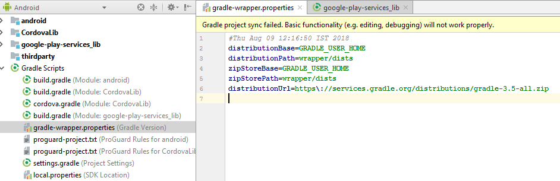

# Felsök AEM Forms-appen {#troubleshoot-aem-forms-app}

I den här artikeln beskrivs de felmeddelanden som kan visas när du skapar en AEM Forms-app och hur du löser dem.

Avsnitten i den här artikeln är:

* [Förlust av bifogade filer för iOS-användare](/help/forms/using/issues-aem-forms-app.md#attachment-loss-for-ios-users)
* [HTML 5-formulärutkast som skickas av arbetsyteanvändare visas inte på portalen](/help/forms/using/issues-aem-forms-app.md#html-form-drafts-submitted-by-workspace-users-are-not-visible-on-the-portal)
* [HTML5-formulär (inte cachelagrade) kan inte läsas in i AEM Forms-appen](/help/forms/using/issues-aem-forms-app.md#html-forms-not-cached-fail-to-load-in-aem-forms-app)
* [AEM Forms synkroniseras inte i Windows](/help/forms/using/issues-aem-forms-app.md#aem-forms-do-not-sync-on-windows)
* [Versionen av Gradle stöds inte](/help/forms/using/issues-aem-forms-app.md#unsupported-version-of-gradle)
* [Kompatibilitetsproblem med insticksprogram i Gradle och Android Gradle](/help/forms/using/issues-aem-forms-app.md#gradle-and-android-gradle-plug-in-compatibility-issues)

## Förlust av bifogade filer för iOS-användare {#attachment-loss-for-ios-users}

AEM Forms-app för iOS som är konfigurerad att synkroniseras med AEM Forms på OSGi stöder endast bilagor på fältnivå. Alla bilagor måste ha unika namn. Om flera bifogade filer har samma namn behålls bara en bifogad fil och alla andra med samma namn går förlorade. Utför följande steg för att förhindra dataförlust för användare på iOS-enheter:

1. Navigera till **Adobe Experience Manager > Verktyg > Åtgärder > Webbkonsol** på den anslutna servern.
1. Sök och klicka på **[!UICONTROL Adaptive Form and Interactive Communication Web Channel Configuration]**.
1. Aktivera **Gör filnamn unika** i dialogrutan [!UICONTROL Adaptive Form and Interactive Communication Web Channel Configuration].

   Om inställningen **Gör filnamn unika** är inaktiverad, förlorar användare data om de försöker skicka adaptiva formulär med flera bilagor.

1. Klicka på **Spara**.

## HTML 5-formulärutkast som skickas av arbetsyteanvändare visas inte på portalen {#html-form-drafts-submitted-by-workspace-users-are-not-visible-on-the-portal}

För HTML5-formulär som är aktiverade i AEM Forms-appen med **Spara som utkast** återgivningsprofil för HTML är de sparade utkasten inte synliga för arbetsyteanvändare. Så här visar du sparade utkast av HTML 5-formulär som skickats in av arbetsyteanvändare på portalen:

1. Öppna CRXDE och logga in med administratörsautentiseringsuppgifter.

   URL: `https://<server>:<port>/lc/crx/de/index.jsp`

1. Klicka på **+** i CRXDE-rotsökvägen i åtkomstkontrollistan under Åtkomstkontroll.
1. I dialogrutan **Lägg till nytt inlägg** klickar du på gruppsökningsknappen i fältet Principal.
1. I fältet Namn i dialogrutan Välj huvudnamn skriver du `PERM_WORKSPACE_USER` och klickar på **Sök**.
1. Välj gruppen `PERM_WORKSPACE_USER` i dialogrutan Välj huvudnamn och klicka på **OK**.
1. I dialogrutan Lägg till nytt inlägg är gruppen `PERM_WORKSPACE_USER` markerad i fältet Huvudnamn.

   Aktivera `jcr:read`-behörighet för användargruppen.

1. Klicka på **OK**.

## HTML5-formulär (inte cachelagrade) kan inte läsas in i AEM Forms-appen {#html-forms-not-cached-fail-to-load-in-aem-forms-app}

När AEM Forms-appen är ansluten till en äldre version av AEM Forms-servern går det inte att läsa in icke-cachelagrade HTML5-formulär i AEM Forms-appen.

Utför följande steg för att lösa problemet:

1. I författarinstansen går du till **Adobe Experience Manager > Verktyg > Konfigurera Workspace App Offline Service > Konfigurera nu**.
1. Klicka på **Manuell resurscache** på sidan **Offlinetjänst för Workspace-program**.

   URL: https://&lt;server>:&lt;port>/libs/fd/workspace-offline/content/config.html

1. Klicka på **+**-knappen på fliken **Manuell resurscache** för att lägga till en CRX-sökväg.
1. I fältet **Lägg till en ny resurs** skriver du: /etc.clientlibs/fd/xfaforms/I18N/en_US.js och klickar på **Lägg till**.
1. Klicka på **Spara**.

## AEM Forms synkroniseras inte i Windows {#aem-forms-do-not-sync-on-windows}

I AEM Forms App i Windows synkroniseras inte ett formulär med den anslutna servern om sökvägen till formuläret eller någon av dess resurser innehåller fler än eller lika med 256 tecken.

Ändra formulärets sökväg och dess resurser för att minska antalet tecken till färre än 256 tecken.

## Versionen av Gradle stöds inte {#unsupported-version-of-gradle}

**Felmeddelande:** Projektet använder en version av Gradle som inte stöds.

Felmeddelandet visas när du skapar AEM Forms-program i Android Studio. Problemet inträffar på grund av att en version av Gradle som inte stöds i systemet inte stöds.

**Upplösning:** Klicka på **Korrigera inkapsling av gråskala och importera projektet igen** för att lösa problemet.

## Kompatibilitetsproblem med insticksprogram i Gradle och Android Gradle {#gradle-and-android-gradle-plug-in-compatibility-issues}

**Felmeddelande:** Versionerna av Android Gradle-plugin och Gradle är inte kompatibla.

Felmeddelandet visas när du väljer alternativet **Skapa APK** på menyn **Skapa** i användargränssnittet i Android Studio.

**Upplösning:** Öppna **Gradle Scripts** > filen **gradle-wrapper.properties** och redigera egenskapen **distributionUrl** .

Android Studio-konsolen rekommenderar till exempel att du nedgraderar Gradle-versionen till 3.5. Redigera versionen i filen **distributionUrl** för **gradle-wrapper.properties** .

Välj **Build** > **Build APK** igen för att lösa felet och generera .apk-filen.

