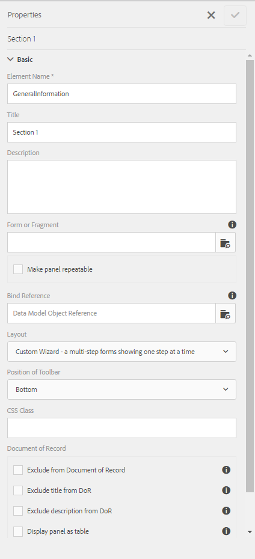
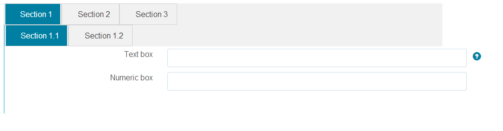
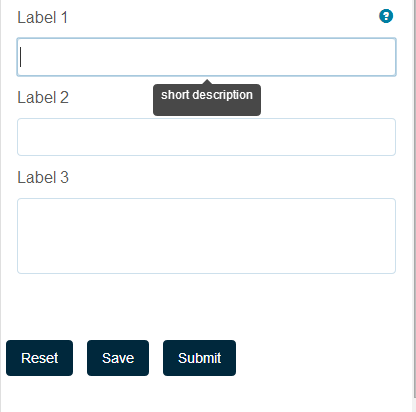

# Layoutfunktioner i anpassningsbara formulär{#layout-capabilities-of-adaptive-forms}

<span class="preview"> Adobe rekommenderar att du använder den moderna och utbyggbara datainhämtningen [Core Components](https://experienceleague.adobe.com/docs/experience-manager-core-components/using/adaptive-forms/introduction.html?lang=sv-SE) för [att skapa nya adaptiva Forms](/help/forms/using/create-an-adaptive-form-core-components.md) eller [att lägga till adaptiva Forms på AEM Sites-sidor](/help/forms/using/create-or-add-an-adaptive-form-to-aem-sites-page.md). De här komponenterna utgör ett betydande framsteg när det gäller att skapa adaptiva Forms-filer, vilket ger imponerande användarupplevelser. I den här artikeln beskrivs det äldre sättet att skapa Adaptiv Forms med baskomponenter. </span>

| Version | Artikellänk |
| -------- | ---------------------------- |
| AEM as a Cloud Service | [Klicka här](https://experienceleague.adobe.com/docs/experience-manager-cloud-service/content/forms/adaptive-forms-authoring/authoring-adaptive-forms-foundation-components/configure-layout-of-an-adaptive-form/layout-capabilities-adaptive-forms.html?lang=sv-SE) |
| AEM 6.5 | Den här artikeln |


Med Adobe Experience Manager (AEM) kan ni skapa lättanvända, anpassningsbara formulär som ger användarna dynamiska upplevelser. Formulärlayouten styr hur objekt och komponenter visas i ett anpassat formulär.

## Nödvändig kunskap {#prerequisite-knowledge}

Innan du får veta mer om de olika layoutfunktionerna i adaptiva formulär kan du läsa följande artiklar för att få mer information om adaptiva formulär.

[Introduktion till AEM Forms](../../forms/using/introduction-aem-forms.md)

[Introduktion till att skapa formulär](../../forms/using/introduction-forms-authoring.md)

## Typ av layout {#types-of-layouts}

Ett anpassningsbart formulär ger dig följande typer av layouter:

**Panellayout** Styr hur objekt eller komponenter i en panel visas på en enhet.

**Mobile Layout** Styr navigeringen i ett formulär på en mobil enhet. Om enhetens bredd är minst 768 pixlar betraktas layouten som en mobillayout och optimerad för en mobil enhet.

**Verktygsfältslayout** Styr placeringen av åtgärdsknappar i verktygsfältet eller panelens verktygsfält i ett formulär.

Alla dessa panellayouter definieras på följande plats:

`/libs/fd/af/layouts`.

>[!NOTE]
>
>Om du vill ändra layouten för ett anpassat formulär använder du redigeringsläget i AEM.


## Panellayout {#panel-layout}

En formulärförfattare kan koppla en layout till varje panel i ett anpassat formulär, inklusive rotpanelen.

Panellayouterna är tillgängliga på `/libs/fd/af/layouts/panel`-platsen.


Lista över panellayouter i anpassningsbara formulär

### Responsiv - allt på en sida utan navigering {#responsive-everything-on-one-page-without-navigation-br}

Använd den här panellayouten för att skapa en responsiv layout som anpassar sig till enhetens skärmstorlek utan att behöva använda någon särskild navigering.

Med den här layouten kan du placera flera **[!UICONTROL Panel adaptive form]**-komponenter efter varandra på panelen.


Ett formulär med responsiv layout som det visas på en liten skärm


Ett formulär med responsiv layout som det visas på en stor skärm

### Guide - ett flerstegsformulär med ett steg i taget {#wizard-a-multi-step-form-showing-one-step-at-a-time}

Använd den här panellayouten för guidad navigering i ett formulär. Använd till exempel den här layouten när du vill hämta in obligatorisk information i ett formulär och vägleda användarna steg för steg.

Använd komponenten `Panel adaptive form` om du vill skapa stegvisa navigeringar i en panel. När du använder den här layouten flyttas användaren till nästa steg först när det aktuella steget är klart

```javascript
window.guideBridge.validate([], this.panel.navigationContext.currentItem.somExpression)
```



Uttryck för att slutföra ett steg i guidelayouten för ett flerstegsformulär


Ett formulär som använder guiden

### Layout för dragspelsdesign {#layout-for-accordion-design}

Med den här layouten kan du placera komponenten `Panel adaptive form` på en panel med dragspelsformatsnavigering. Med den här layouten kan du även skapa upprepningsbara paneler. Med upprepningsbara paneler kan du lägga till eller ta bort paneler dynamiskt efter behov. Du kan definiera minsta och högsta antal gånger en panel upprepas. Panelens namn kan också bestämmas dynamiskt utifrån informationen som finns i panelobjekten.

Sammanfattningsuttryck kan användas för att visa de värden som slutanvändaren anger i titeln på den minimerade panelen.


Repeterbara paneler som skapats med dragspelslayout

### Fliklayout - flikar visas till vänster {#tabbed-layout-tabs-appear-on-the-left}

Med den här layouten kan du placera komponenten `Panel adaptive form` på en panel med tabbnavigering. Flikarna placeras till vänster om panelinnehållet.


Tabbar till vänster om en panel

### Fliklayout - flikarna visas högst upp {#tabbed-layout-tabs-appear-on-the-top}

Med den här layouten kan du placera komponenten `Panel adaptive form` på en panel med tabbnavigering. Flikarna placeras ovanpå panelinnehållet.



Tabbar som visas högst upp på en panel

## Mobillayouter {#mobile-layouts}

Mobillayouter möjliggör användarvänlig navigering på mobila enheter med relativt mindre skärmar. I mobila layouter används antingen flikformat eller guideformat för formulärnavigering. När du använder en Mobile-layout får du en layout för hela formuläret.

Den här layouten styr navigeringen med ett navigeringsfält och en navigeringsmeny. I navigeringsfältet visas ikonen **&lt;** och **>** som indikerar **nästa** och **föregående** navigeringssteg i formuläret.

Mobillayouterna är tillgängliga på `/libs/fd/af/layouts/mobile/`-platsen. Följande mobila layouter är som standard tillgängliga i anpassningsbara formulär.


Lista över mobila layouter i adaptiva formulär

När du använder en mobil layout är formulärmenyn tillgänglig genom att trycka på ikonen  för att komma åt olika formulärpaneler.

### Layout med panelrubriker i formulärrubriken {#layout-with-panel-titles-in-the-form-header}

I den här layouten, som namnet föreslår, visas panelrubriker tillsammans med navigeringsmenyn och navigeringsfältet. Den här layouten innehåller även ikoner för Nästa och Föregående för navigering.


Mobila layouter med paneltitlar i formulärrubriker

### Layout utan panelrubriker i formulärrubriken {#layout-without-panel-titles-in-the-form-header}

Den här layouten, som namnet föreslår, visar bara navigeringsmenyn och navigeringsfältet utan panelrubriker. Den här layouten innehåller även ikoner för Nästa och Föregående för navigering.


Mobila layouter utan panelrubriker i formulärrubrikerna

## Verktygsfältslayouter {#toolbar-layouts}

En verktygsfältslayout styr placeringen och visningen av de åtgärdsknappar som du lägger till i de anpassade formulären. Layouten kan läggas till på formulärnivå eller panelnivå.


En lista med verktygsfältslayouter i anpassningsbara formulär

Verktygsfältslayouter är tillgängliga på `/libs/fd/af/layouts/toolbar`-platsen. adaptiva formulär har som standard följande verktygsfältslayouter.

### Standardlayout för verktygsfältet {#default-layout-for-toolbar}

Den här layouten väljs som standardlayout när du lägger till åtgärdsknappar i ett anpassat formulär. Om du väljer den här layouten visas samma layout för både datorer och mobila enheter.

Du kan också lägga till flera verktygsfält som innehåller åtgärdsknappar som har konfigurerats med den här layouten. En åtgärdsknapp är kopplad till en formulärkontroll. Du kan konfigurera verktygsfälten så att de är före eller efter en panel.



Standardvy för verktygsfältet

### Mobil fast layout för verktygsfältet {#mobile-fixed-layout-for-toolbar}

Välj den här layouten om du vill ha alternativa layouter för datorer och mobila enheter.

För skrivbordslayouten kan du lägga till åtgärdsknappar med några specifika etiketter. Endast ett verktygsfält kan konfigureras med den här layouten. Om mer än ett verktygsfält är konfigurerat med den här layouten, finns det en överlappning för mobila enheter och bara ett verktygsfält visas. Du kan t.ex. ha ett verktygsfält längst ned eller längst upp i formuläret, eller, efter eller före paneler i formuläret.

För den mobila layouten kan du lägga till åtgärdsknappar med ikoner.


Mobil fast layout för verktygsfältet
