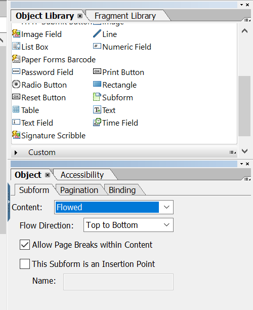

# Layoutdesign{#layout-design}

XFA-formulärmallar eller XDP-mallar är mallar för:

* [Bokstäver](/help/forms/using/create-letter.md)
* [Tryckkanal](/help/forms/using/web-channel-print-channel.md#printchannel) för [interaktiv kommunikation](/help/forms/using/interactive-communications-overview.md)

* Layoutfragment

En XDP har utformats i Adobe Forms Designer. I den här artikeln finns information om hur du utformar XDP:er för att skapa effektiva korrespondenser/interaktiv kommunikation, till exempel var formulärfält eller målområden ska användas och när layoutfragment ska användas.

## Skapa en layout för brev eller för tryckkanalen Interactive Communications {#creating-a-layout-for-letters-or-for-interactive-communications-print-channel}

En layout definierar den grafiska layouten för en brev-/tryckkanal i ett interaktivt meddelande. Layouten kan innehålla typiska formulärfält som &quot;Adress&quot; och &quot;Referensnummer&quot;. Den innehåller också tomma delformulär som anger målområden. Skapa layouten i formulärdesignern och när den är klar skickar Application Specialist den till AEM-servern. Därifrån kan du välja layout när du skapar en brevbrevmall eller en tryckt kanal för en interaktiv kommunikation.

Följ de här stegen för att skapa layouter för brev/tryckkanaler i interaktiv kommunikation:

1. Analysera layouten och avgöra vilket innehåll som upprepas på alla sidor. oftast anpassas sidhuvud och sidfot till den här kategorin. Det här innehållet placeras på mallsidor för layout. Det återstående innehållet går till layoutens innehållssidor. I en policyjacka kan logotypen och företagsadressen läggas till i mallsidans sidhuvud och sidfot. Anmärkning om annullering använder till exempel samma layout.
1. När du utformar innehållssidor delar du upp sidinnehållet i avsnitt. Varje avsnitt är utformat som ett delformulär inbäddat i själva layouten eller som en fragmentlayout. Om avsnittet innehåller tabeller, modellerar du avsnittet som ett layoutfragment.
1. En layout kan utformas så här:

   1. Gör varje avsnitt till ett separat delformulär som innehåller alla element i avsnittet.
   1. Gör varje avsnittsdelformulär underordnat till samma överordnade delformulär. Det överordnade delformulärets layout är inställd på att flöda så att avsnitten kan flyttas nedan om stora data sammanfogas i föregående avsnitt.
   1. Sektion Primär bosättning kan återanvändas även i andra layouter. Skapa den som en fragmentlayout.
   1. Avsnittet Ytterligare intresseinformation innehåller bara två element som placerats under varandra, kan innehålla stora data och är utformad som flödande.
   1. Andra avsnitt innehåller element vid specifika positioner så att de är utformade som positionerade layouter.
   1. Dela upp ett avsnitt i delformulär om avsnittet innehåller element vid specifika positioner och dessa element innehåller stora mängder data. Ordna sedan delformulären så att de fungerar som du vill.
   1. Lägg till ett målområde som platshållare för området Primär bosättning. Den här platshållaren är bunden till fragmentets primära plats vid designen av brev/interaktiv kommunikation.
   1. Överför layouten (och eventuella fragment som använder layouten) till AEM Forms-servern.

### Använd delformulär i en XDP-mall {#usesubformxdp}

När du har analyserat layouten som krävs för att skapa interaktiv kommunikation kan du skapa delformulär i XDP-mallen med Forms Designer. Tomma delformulärskomponenter som används i XDP-mallen resulterar i att målområden visas i utskriftskanalen i interaktiv kommunikation.

>[!NOTE]
>
>Lägg till innehåll i Print-kanalen i den interaktiva kommunikationen i stället för att lägga till innehåll i delformulärskomponenten i XDP-mallen. Lägg till innehåll i målområdena i Print-kanalen med [dokumentfragment, diagram, bilder](../../forms/using/create-interactive-communication.md#main-pars-header-741471925)och layoutfragment.

Utför följande steg för att använda delformulär i en XDP-mall:

1. Öppna Forms Designer, välj **Arkiv** > **Nytt** > **Använd ett tomt formulär**, tryck på **Nästa** och sedan på **Slutför** för att öppna formuläret för att skapa en mall.

   Kontrollera att alternativen **Objektbibliotek** och **Objekt** är markerade på menyn **Fönster** .

1. Dra och släpp **delformulärskomponenten** från **objektbiblioteket** till formuläret.

   

1. Markera delformuläret för att visa alternativen för delformuläret i **objektfönstret** i den högra rutan.
1. Välj fliken **Delformulär** och välj **Flödat** i listrutan **Innehåll** . Dra delformulärets vänstra slutpunkt för att justera längden.

   

1. På fliken **Bindning** :

   1. Ange ett namn för delformuläret i fältet **Namn** .
   1. Välj **Ingen databindning** i listrutan **Databindning** .

1. Markera på samma sätt rotdelformuläret i den vänstra rutan.

   

1. Välj fliken **Delformulär** och välj **Flödat** i listrutan **Innehåll** . På fliken **Bindningar** :

   1. Ange ett namn för delformuläret i fältet **Namn** .
   1. Välj **Ingen databindning** i listrutan **Databindning** .
   Upprepa steg 2 till 5 om du vill lägga till fler delformulär i XDP-mallen. Lägg bara till [text, dokumentfragment, bilder och diagram](../../forms/using/create-interactive-communication.md#main-pars-header-741471925) i målområdena när du skapar interaktiv kommunikation.

1. Välj **Arkiv** > **Spara som** för att spara filen i det lokala filsystemet:

   1. Navigera till platsen där du vill spara filen och ange ett namn för XDP-mallen.
   1. Välj **.xdp** i listrutan **Spara som typ** .

   1. Tryck på **Spara**.

### Använda bildfältskomponenten i en XDP-mall {#use-image-field-component-in-an-xdp-template}

Använd bildfältet eller delformulärskomponenten i XDP-mallen och lägg till en bild när du redigerar den interaktiva kommunikationen.

>[!NOTE]
>
>Lägg till en bild i utskriftskanalen i den interaktiva kommunikationen i stället för att lägga till en bild i bildfältet eller delformulärskomponenten i XDP-mallen. Mer information finns i [Lägga till innehåll i den interaktiva kommunikationen](../../forms/using/create-interactive-communication.md#step2).

Utför följande steg för att använda komponenten Bildfält i en XDP-mall:

1. Dra och släpp **bildfältskomponenten** från **objektbiblioteket** till formuläret.
1. Markera delformuläret för att visa alternativen för delformuläret i **objektfönstret** i den högra rutan.
1. På fliken **Bindning** :

   1. Ange ett namn för bildfältet i fältet **Namn** .
   1. Välj **Ingen databindning** i listrutan **Databindning** .

### Skapa XDP-mall för layoutfragment {#xdplayoutfragments}

Använd tabellkomponenten i Forms Designer för att skapa layoutfragment och använd dem sedan för att skapa tabeller när du skapar tryckkanalen i interaktiv kommunikation. Om du använder layoutfragment för att skapa tabeller ser du till att tabellinnehållet behåller strukturen när webbkanalen genereras automatiskt med hjälp av utskriftskanalen.

>[!NOTE]
>
>Ange text i tabellcellerna eller [skapa bindning med formulärdatamodellsobjekten](../../forms/using/create-interactive-communication.md#main-pars-header-570999227) medan du redigerar interaktiv kommunikation.

Utför följande steg för att använda tabellkomponenten i XDP-mallen med Forms Designer:

1. Dra och släpp **tabellkomponenten** från **objektbiblioteket** till formuläret.
1. I dialogrutan **Infoga tabell** :

   1. Ange antalet rader och kolumner för tabellen.
   1. Markera kryssrutan **Inkludera rubrikrad i tabell** om du vill inkludera en rad i tabellrubriken.
   1. Tryck på **OK**.

1. Tryck **+** i den vänstra rutan bredvid tabellens namn, högerklicka på cellnamnen i rubriken och andra rader och välj **Byt namn på objekt** för att byta namn på tabellcellerna.
1. Klicka på tabellrubrikens textfält i **designvyn** och byt namn på dem.
1. Dra och släpp **textfältskomponenten** från **objektbiblioteket** till varje tabellcell i **designvyn**. Utför det här steget om du vill kunna binda tabellceller till formulärdatamodellsobjekten när du redigerar interaktiv kommunikation.

   

1. Markera namnet på raden i den vänstra rutan och välj **Objekt** > **Bindning** > **Upprepa rad för varje dataobjekt**. Utför det här steget för att se till att om en bindning skapas mellan tabellcellerna på den här raden med formulärdatamodellsobjekt av samlingstyp, upprepas tabellraden automatiskt för varje dataobjekt som finns i databasen.

   Ange text i tabellcellerna eller [skapa bindning med formulärdatamodellsobjekten](../../forms/using/create-interactive-communication.md#main-pars-header-570999227) medan du redigerar interaktiv kommunikation.

1. Välj **Arkiv** > **Spara som** för att spara filen i det lokala filsystemet:

   1. Navigera till platsen där du vill spara filen och ange namnet på XDP-mallen.
   1. Välj **.xdp** i listrutan **Spara som typ** .

   1. Tryck på **Spara**.

### Överför XDP-mall till AEM Forms-servern {#uploadxdptemplate}

När du har skapat en XDP-mall med Forms Designer måste du överföra den till AEM Forms-servern så att mallen kan användas när du skapar den interaktiva kommunikationen.

1. Välj **Formulär** > **Formulär och dokument**.
1. Tryck på **Skapa** > **Filöverföring**.
1. Navigera till XDP-mallens plats i det lokala filsystemet och tryck på **Öppna** för att importera XDP-mallen till AEM Forms-servern.

## Använda schema {#using-schema}

Du kan använda ett schema i ett layout- eller layoutfragment, men det behövs inte. Om du använder ett schema bör du kontrollera följande:

1. Layout och alla fragmentlayouter som används i en bokstav/interaktiv kommunikation använder samma schema som bokstaven/interaktiv kommunikation.
1. Alla fält som måste fyllas i med data är bundna till schemat.

## Skapa relaterade fält {#creating-relatable-fields}

Som standard anses alla fält vara relaterade till olika andra datakällor. Om layouten innehåller fält som inte är relaterade till en datakälla namnger du fältet med suffixet &quot;_int&quot; (internal); pageCount_int.

Ett relaterbart fält måste:

* vara en XFA &lt;fält> eller &lt;exkl. grupp>
* har en XFA-bindningsreferens
* Om det är en &lt;exklGroup> måste det ha minst ett underordnat alternativknappsfält. annars kan dess värdetyp inte bestämmas

Ett relaterbart fält måste:

* har ett namn

Ett relaterbart fält får inte

* Inkludera ett &quot;_int&quot;-suffix i namnet
* har bindningen angiven som &quot;none&quot;
* vara underordnad ett &lt;exklGroup>-element

Så länge ett relaterbart fält uppfyller villkoren ovan kan det finnas på vilken plats som helst och på vilket kapslingsdjup som helst i layouten. Du kan använda relaterade fält på mallsidor.

Fälten är flexiblare i layoutkonfigurationen än målområdesdelformulär. de är dock knutna till en enda värdetyp. Du kan göra ett fält stort eller ange en fast bredd och höjd och så vidare. Den lösta modulen eller regelresultatet överförs till fältet.

## Bestäm när delformulär och textfält ska användas {#deciding-when-to-use-subforms-and-text-nbsp-fields}

Använd ett delformulär om du vill samla in flera modulinnehåll i en lodrät flödeslayout uppifrån och ned (flera stycken eller bilder). Layouten måste hantera det faktum att delformuläret växer i höjd så att innehållet får plats. Om du inte kan vara säker på att längden på innehållet som är associerat med delformuläret/målet aldrig överstiger det utrymme som är reserverat för delformuläret i layouten, skapar du delformuläret som ett underordnat formulär i en flödeslänkad delformulärsbehållare. Med den här processen ser du till att layoutobjekt under delformuläret flyttas nedåt när delformuläret växer.

Använd ett fält om du vill hämta moduldata eller data från dataordlisteelement till layoutens schema (eftersom fält är bundna till data) eller visa modulinnehåll på en mallsida. Kom ihåg att innehåll på en mallsida inte kan flöda med innehåll på innehållssidan, så du måste se till att bildfältet används som rubriklogotyp. Tabellen innehåller fler kriterier för att bestämma när ett delformulär eller fält ska användas i en layout.

<table>
 <tbody>
  <tr>
   <td>
<strong>Använd ett delformulär när</strong>
 </td>
   <td>
<strong>Använd ett textfält när</strong>
 </td>
  </tr>
  <tr>
   <td>
Den innehåller en kombination av element, till exempel Efternamn och Förnamn
 </td>
   <td>
Den innehåller ett enda element, till exempel ett principnummer.
 </td>
  </tr>
  <tr>
   <td>
Den innehåller flera stycken
 </td>
   <td>
Texten är figursatt och marginaljusterad
 </td>
  </tr>
  <tr>
   <td>
Upprepade, valfria och villkorsstyrda datagrupper är bundna till delformulär, vilket minskar risken för designfel som kan uppstå om skript används för att uppnå samma resultat
 </td>
   <td>
Element som organisationens logotyp och adress visas på alla sidor i ett brev/interaktiv kommunikation. I det här fallet skapar du formulärfält för dessa element och placerar dem på mallsidan. Om du anger att fältbindningen ska vara "Ingen databindning" visas inga fält som relaterade fält i Letter/Interactive Communication Editor. Om du vill relatera någon typ av innehåll till dessa fält måste de ha bindning.
 
Om din företagsadress innehåller mer än en rad med data kan du använda textfältet med alternativet "Tillåt flera rader" för att representera adressen i layouten.
 
Om datatypen för ett textfält är normal text, används den oformaterade textversionen av modulutdata i stället för RTF-versionen (all formatering ignoreras). Om du vill bevara formateringen anger du datatypen för textfältet till RTF.
 </td>
  </tr>
  <tr>
   <td>
Texten flödas
 </td>
   <td>
Textfält och bildfält används på mallsidor. Mallsidor kan inte använda delformulär som målområden.
 </td>
  </tr>
  <tr>
   <td>
Objekten grupperas och ordnas utan att delformuläret binds till ett dataelement
 </td>
   <td>
 
 </td>
  </tr>
  <tr>
   <td>
Det finns ett textfält i delformuläret. Delformuläret kan växa och inte skriva över andra objekt under det i layouten.
 </td>
   <td>
Ni behöver enkel åtkomst till data i postprocessen.
 </td>
  </tr>
 </tbody>
</table>

## Ställa in repetitiva element {#setting-up-repetitive-elements}

När element som organisationens logotyp och adress visas på alla sidor i ett brev/interaktiv kommunikation skapar du formulärfält för dessa element och placerar dem på mallsidan. Använd namnbindning (fältnamn) för dessa fält.

## Ange serveråtergivningsformat {#specify-the-server-nbsp-render-format}

Använd layoutens serveråtergivningsformat till dynamiskt XML-formulär, annars kan inga bokstäver/interaktiv kommunikation som baseras på den här layouten återges korrekt. Som standard är serveråtergivningsformatet i Forms Designer inställt på dynamiskt XML-formulär. För att vara säker på att du använder rätt format:

* I Designer klickar du på **Arkiv** > **Formuläregenskaper** > **Standardvärden** och kontrollerar att inställningen för PDF-återgivning/format är inställd på dynamiskt XML-formulär.

