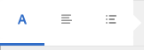
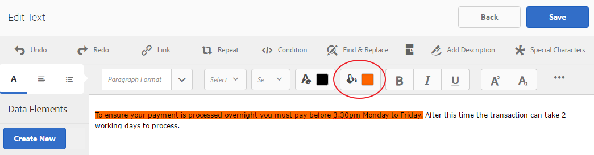

# Dokumentfragment{#document-fragments}

## Dokumentfragment {#document-fragments-1}

Dokumentfragment är återanvändbara delar/komponenter av en korrespondens som du kan använda för att skapa brev/korrespondens. Dokumentfragmenten är av följande typer:

* **Text**: En textresurs är en del av innehållet som består av ett eller flera textstycken. Ett stycke kan vara statiskt eller dynamiskt.
* **Lista**: List är en grupp dokumentfragment, inklusive text, listor, villkor och bilder. Ordningen på listelementen kan vara fast eller redigerbar. När du skapar en bokstav kan du använda några eller alla listelement för att återanvända ett mönster med element.
* **Villkor**: Med villkor kan du definiera vilket innehåll som ska inkluderas när korrespondensen skapas, baserat på angivna data. Villkoret beskrivs i termer av kontrollvariabler. En kontrollvariabel kan antingen vara ett dataordlisteelement eller en platshållare.
* **Layoutfragment**: Ett layoutfragment är en layout som kan användas i en eller flera bokstäver. Ett layoutfragment används för att skapa repeterbara mönster, särskilt dynamiska tabeller. Layouten kan innehålla typiska formulärfält som &quot;Adress&quot; och &quot;Referensnummer&quot;. Den innehåller också tomma delformulär som anger målområden. Layouterna (XDP) skapas i Designer och överförs sedan till AEM Forms.

## Text {#text}

En textresurs är en del av innehållet som består av ett eller flera textstycken. Ett stycke kan vara statiskt eller dynamiskt. Ett dynamiskt stycke innehåller referenser till dataelement, vars värden anges vid körning. Kundnamnet i en hälsningsfras kan till exempel vara ett dynamiskt dataelement med dess värde tillgängligt vid körning. Genom att ändra dessa värden kan samma brevmall användas för att generera brev för olika kunder.

Correspondence Management Solution har stöd för två typer av dynamiska dataobjekt (variabeldata):

* **Dataordlisteelement**: Dessa element är bundna till dataordlistan och hämtar deras värden från den angivna datakällan. En dataordlistevariabel kan vara skyddad eller oskyddad. När korrespondens skapas kan användaren ändra standardvärdet för oskyddade dataordlistevariabler, men inte ändra skyddade.
* **Platshållare**: Dessa är variabler som inte är bundna till någon backend-datakälla. De kräver att användaren fyller i ett värde när korrespondens skapas. Platshållarna är som standard oskyddade.

>[!NOTE]
>
>Mallarna för korrespondenshantering tvingar dig inte att skapa unika namn när du skapar platshållare. Om du skapar två platshållare med samma namn, t.ex. en text och ett villkor, och använder båda platshållarna i en bokstavsmall, används värdena för platshållaren som infogades senast för båda platshållarna. Om två platshållare har samma namn jämförs deras typer. Om typerna är olika blir deras typ String. I en modul kan du dock inte skapa flera platshållare med samma namn.

### Skapa text {#create-text}

1. Välj **Formulär** > **Dokumentfragment**.
1. Tryck på **Skapa** > **Text** eller markera en textresurs och tryck sedan på **Redigera**.
1. Ange följande information för texten:

   * **Titel: (Valfritt)** Ange titeln för textresursen. Titlar behöver inte vara unika och kan innehålla specialtecken och tecken som inte är engelska. Texterna refereras till av sina titlar (om de är tillgängliga) som miniatyrbilder och resursegenskaper.
   * **Namn:** Det unika namnet för textresursen. Det finns inga två resurser (text, villkor eller lista) i något läge med samma namn. I fältet Namn kan du bara ange engelska tecken, siffror och bindestreck. Fältet Namn fylls i automatiskt baserat på fältet Titel. De specialtecken, blanksteg, siffror och icke-engelska tecken som anges i fältet Titel ersätts med bindestreck i fältet Namn. Även om värdet i fältet Titel automatiskt kopieras till namnet kan du redigera värdet.
   * **Beskrivning**: Ange en beskrivning av resursen.
   * **Dataordlista**: Du kan också markera det datalexikon som du vill mappa till. Med det här attributet kan du lägga till referenser till dataordlisteelement i textresursen.
   * **Taggar**: Om du vill skapa en egen tagg anger du ett värde i textfältet och trycker på Retur. Du kan se taggen under textfältet med taggar. När du sparar den här texten skapas även de nya taggarna.

1. Tryck på **Nästa**. Korrespondenshanteringen visar redigeringssidan där du kan lägga till textstycken och dataelement i texten.

   Standardstavningskontrollen i webbläsaren kontrollerar stavningen i textredigeraren. Om du vill hantera stavnings- och grammatikkontrollen kan du redigera stavningskontrollinställningarna i webbläsaren eller installera plugin-program/tillägg för webbläsaren för att kontrollera stavning och grammatik.

   Du kan också använda de olika kortkommandona i textredigeraren för att hantera, redigera och formatera text. Mer information om kortkommandon för [textredigeraren](/help/forms/using/keyboard-shortcuts.md#p-formatting-p) finns i Kortkommandon för korrespondenshantering.

1. En textredigerare öppnas. Skriv texten. Använd verktygsfältet längst upp på sidan för att formatera texten, infoga villkor, länkar och sidbrytningar.

   [ 

   * **Länk**: Infoga [hypertextlänk](#insert-hyperlink) i texten.
   * **Upprepa**: Upprepa skriver ut samlingselement i Data Dictionary med hjälp av en avgränsare.
   * **Villkor**: Tryck för att infoga ett villkor. Infoga text baserad på villkor. Om villkoret är true visas texten med bokstaven, i annat fall inte.
   * **Lägg till beskrivning**: Lägg till anteckning i ett textstycke. Detta är metadata som är synliga för författaren men inte en del av det brev som skapas.
   * **Sidbrytning**: Om du anger sidbrytningsattributet för en textmodul som false bryts inte textmodulen över sidorna.
   En textredigerare öppnas. Ange texten. Verktygsfältet ändras beroende på vilken typ av redigeringar du väljer att göra: Stycke, Justering eller Lista:

   

   Välj typ av verktygsfält: Stycke, Justering eller Lista

   

   Verktygsfältet Stycke
   [ Verktygsfältet ](assets/paragrapheditingtoolbar-1.png)Justering

   

   Verktygsfältet Lista (klicka för att öppna en bild i full storlek)

1. Om du vill återanvända ett av flera textstycken som finns i ett annat program, till exempel från MS Word- eller HTML-sidor, kopierar och klistrar du in texten i textredigeraren. Formateringen av den kopierade texten behålls i textredigeraren.

   Du kan kopiera och klistra in ett eller flera textstycken i en redigerbar textmodul. Du kan t.ex. ha ett MS Word-dokument med en punktlista över godkända bevis för uppehälle, som följande:

   

   Du kan kopiera och klistra in texten direkt från MS Word-dokumentet i en redigerbar textmodul. Formateringen som punktlistor, teckensnitt och textfärger behålls i textmodulen.

   

   >[!NOTE]
   >
   >Formateringen av inklistrad text har dock vissa [begränsningar](https://helpx.adobe.com/aem-forms/kb/cm-copy-paste-text-limitations.html).

1. Infoga vid behov specialtecken i dokumentfragmentet. Du kan till exempel använda paletten Specialtecken för att infoga:

   * Valutasymboler som €,¥ och £
   * Matematiska symboler som t.ex.¥, Ð och ^
   * Interpunktionssymboler som ‟ och&quot;
   

   Correspondence Management har inbyggt stöd för 210 specialtecken. Administratören kan [lägga till stöd för fler/anpassade specialtecken genom anpassning](/help/forms/using/custom-special-characters.md).

1. Markera texten och tryck på Markera färg om du vill framhäva delar av texten i en redigerbar textbunden modul.

   

   Du kan antingen trycka direkt på grundfärgen **[A]** på paletten Grundfärger eller på **Välj** när du har använt reglaget **[B]** för att välja rätt färgton.

   Du kan också gå till fliken Avancerat och välja lämplig nyans, ljushet och mättnad **[C]** för att skapa den exakta färgen och sedan trycka på Välj **[D]** för att använda färgen för att markera texten.

   

1. Dra och släpp dataordlisteelement och platshållarelement från datapanelen till texten.

   Till:

   * Lägg till ett dataordlisteelement i texten, markera ett dataelement i listan och tryck på Infoga ( ). Om du väljer Skyddat är dataordlisteelementet skrivskyddat och visas i brevsredigeraren, men inte i användargränssnittet Skapa korrespondens eller Correspondence Creator.
   * Lägg till ett platshållarelement i texten, tryck på Create New (Skapa nytt) på panelen Data Elements och ange information för det nya dataelementet. Tryck sedan på Create (Skapa) för att lägga till det nya elementet i listan. Den nya platshållaren kan infogas i texten på samma sätt som dataordlisteelementet. Om du vill redigera en platshållare markerar du en platshållare och trycker på Redigera.
   

   Platshållarelement som anges i exempeldatafilen för en Data Dictionary

   

   Värden för platshållarelement i CCR-vyn ifyllda från variablerna i datamappen som anges i exempeldatafilen

   Du kan också använda symbolen @ för att söka efter och lägga till dataordlista och platshållarelement i textredigeraren. Placera markören där du vill infoga elementet. Skriv @ följt av söksträngen. Textredigeraren utför sökåtgärden på alla dataordlisteelement och platshållarelement som finns i textdokumentfragmentet. Sökåtgärden hämtar och visar elementen som innehåller söksträngen som en nedrullningsbar lista. Navigera genom sökresultaten och klicka på elementet som du vill infoga vid markörens plats. Tryck på Esc för att dölja sökresultaten.

1. Du kan använda textbundna villkor och upprepa för att göra brevet mycket sammanhangsberoende och välstrukturerat. Mer information om textbundna villkor och upprepning finns i [Textbundna villkor och upprepas med bokstäver](/help/forms/using/cm-inline-condition.md).
1. Tryck på **Spara**.

#### Infoga hyperlänk i en text {#insert-hyperlink}

Så här skapar du en hyperlänk i en textresurs:

1. Markera texten eller datamodellobjektet i textredigeraren.

2. Tryck på **[!UICONTROL Länk]**. Tryck på **[!UICONTROL Alt-textfältet]** för att ta bort det befintliga datamodellsobjektnamnet eller texten.

3. Ange URL-adressen och tryck på .

#### Söka och ersätta text {#searching-and-replacing-text}

När du arbetar med textelement som innehåller en stor textmängd måste du söka efter en viss textsträng. Du kan också behöva ersätta en viss textsträng med en alternativ sträng.

Med funktionen Sök och ersätt kan du söka efter (och ersätta) alla textsträngar i ett textelement. Funktionen innehåller även en kraftfull sökning efter reguljära uttryck.

#### Söka efter text i en textmodul {#to-search-text-in-a-text-module}

1. Öppna textmodulen i textredigeraren.

1. Tryck på Sök och ersätt.
1. Skriv den text du vill söka efter i textrutan Sök och tryck på Sök. Söktexten markeras i textmodulen.
1. Om du vill söka efter nästa förekomst av texten trycker du på Sök igen.

   Om du fortsätter att trycka på knappen Sök fortsätter sökningen nedåt på sidan. När den sista instansen av texten har hittats visar meddelandet **Slutet av modulen** att inga fler sökresultat hittades.

   Om ingen instans av söktexten hittas i textmodulen visas meddelandet: Det **gick inte att hitta** matchningen.

1. Om du trycker på Sök igen fortsätter sökningen högst upp på sidan.

#### Sökalternativ {#search-options}

**Matcha gemener/VERSALER:** Sökningen returnerar bara resultat med samma skiftläge.

**Hela ord:** Sökningen returnerar bara hela ord.

**Obs!** Om du anger specialtecken i textrutan Sök inaktiveras alternativet Hela ord.

**Reg ex:** Sök med reguljära uttryck. Följande reguljära uttryck söker till exempel efter e-postadresser i en textmodul:

`[a-zA-Z0-9._%+-]+@[a-zA-Z0-9.-]+\.[a-zA-Z]{2,4}`

#### Söka och ersätta text i en textmodul {#to-search-and-replace-text-in-a-text-module}

1. Öppna textmodulen i textredigeraren.
1. Tryck på Sök och ersätt.
1. Ange den text som du vill söka efter i textrutan Sök och den text som du vill ersätta söktexten med. Tryck sedan på Ersätt.
1. Om söktexten hittas ersätts texten med ersättningstexten.

   * Om en annan förekomst av söktexten hittas markeras den förekomsten i textmodulen. Om du trycker på Ersätt igen ersätts den markerade instansen och markören flyttas framåt, om en tredje instans hittas.
   * Om ingen annan instans hittas stannar markören vid den senast ersatta instansen.

1. Om du trycker på Sök igen fortsätter sökningen högst upp på sidan.

   Använd alternativet Ersätt alla om du vill ersätta alla förekomster av en text i textmodulen. När du gör oss&quot; visas antalet ersättningar som ett meddelande i dialogrutan Sök och ersätt.

#### God praxis/tips och tricks för textmoduler {#best-practices-tips-and-tricks-for-text-modules}

* Använd en konsekvent namnkonvention för att undvika duplicering.
* Använd lämplig databindning i textmoduler.
* Följande regler gäller när du använder textredigeraren när du ändrar en textresurs:

   * **Tillägg av variabel:** Tillåtet
   * **Borttagning av variabel:** Tillåtet
   * **Uppdatering av egenskaper:** Tillåtet
   * **Dataordlista har ändrats:** Tillåts tills dataordlisteelementet inte används. Du kan inte ändra dataordlistan vid uppdatering.

## Lista {#list}

En lista är en grupp dokumentfragment, inklusive text, (andra) listor, villkor och bilder. Ordningen på listelementen kan vara fast eller redigerbar. När du skapar en bokstav kan du använda några eller alla listelement för att återanvända ett mönster med element. Listor fungerar i princip som mål som kan kapslas i andra mål.

### Implementeringslistor {#implementing-lists}

Implementeringslistorna består av två steg:

1. Definiera kärnegenskaper som namn, beskrivning och dataordlista.
1. Avsnitt med innehåll som är en del av listan och sedan ange egenskaper som låsordning och biblioteksåtkomst för listan.

### Skapa en lista {#create-a-list}

En lista är en grupp med relaterat innehåll som kan användas i en brevmall som en enda enhet. Alla typer av innehåll kan läggas till i en lista. Listor kan också kapslas. Listmoduler kan anges som:

* **BESTÄLLD**: Det går inte att ändra ordningen i körningsmiljön Create Correspondence.
* **Biblioteksåtkomst**: Användare kan lägga till moduler i listan. Den här flaggan anger om biblioteksåtkomst är aktiverad. Om den är aktiverad (öppen) kan användaren lägga till moduler i listan när bokstaven förhandsgranskas.
* När du skapar en lista kan du ange en typ, till exempel:
* **Oformaterad**: Ingen ytterligare formatering används i listan.
* **Punktlista**: En lista formaterad med en enkel punkt.
* **Numrerad**: En numerisk lista där du kan välja mellan siffrorna Standard (1,2,..), Upper Roman (I, II, ...) och Lower Roman (i, ii, ...).
* **Ordnat**: En alfabetisk lista där du kan välja mellan gemener (a, b,..) och versaler (A, B,..).
* **Anpassad**: Du kan skapa valfria värden för Numrerad/Letter-typ och prefix och suffix.

1. Välj **Formulär** > **Dokumentfragment**.

1. Välj **Skapa** > **Lista**.

1. Ange följande information för listan:

   * **Titel (valfritt): Ange** listans rubrik. Titeln behöver inte vara unik och kan innehålla specialtecken och tecken som inte är engelska. Listor refereras till av deras titlar (om de är tillgängliga), t.ex. i miniatyrbilder och resursegenskaper.
   * **Namn:** Listans unika namn. Det finns inga två resurser (text, villkor eller lista) i något läge med samma namn. I fältet Namn kan du bara ange engelska tecken, siffror och bindestreck. Fältet Namn fylls automatiskt i med värdet i fältet Titel. De specialtecken, blanksteg, siffror och icke-engelska tecken som anges i fältet Titel ersätts med bindestreck i fältet Namn. Även om värdet i fältet Titel automatiskt kopieras till namnet kan du redigera värdet.
   * **Beskrivning (valfritt)**: Ange en beskrivning av resursen.
   * **Dataordlista (valfritt)**: Du kan också välja vilken datamordlista du vill ansluta till. Endast resurser som använder samma dataordlista som listan, eller resurser som inte har någon dataordlista tilldelad, kan läggas till i listan. Om du tilldelar ett datalexikon till en lista blir det enklare för den som skapar en brevmall att hitta rätt lista.
   * **Taggar (valfritt)**: Markera de taggar som ska användas. Du kan också skriva namnet på en ny tagg och skapa den. (Den nya taggen skapas när du trycker på **Spara**.)

1. Tryck på **Nästa**.
1. Tryck på **Lägg till resurs**.
1. Om du vill lägga till resurser i listan markerar du dem på sidan Välj resurser och trycker på **Klar**.

   

1. Resurserna läggs till på sidan Listobjekt.
Om du vill ändra ordningen på resurserna i listan trycker du på och håller ned pilikonen (  ) och drar. När användaren öppnar en brevmall i användargränssnittet Skapa korrespondens, monteras innehållet i den ordning som du definierade här.

   

1. Du kan välja följande alternativ för att ange hur listan fungerar i CCR-användargränssnittet:

   * **Biblioteksåtkomst**: Om du vill aktivera biblioteksåtkomst för att lägga till resurser trycker du på Library Access. När Library Access är aktiverat kan anspråksjusteraren lägga till mer innehåll i listan. I annat fall begränsas Anspråksjusteraren till det innehåll som du har definierat för listan.
   * **Lås ordning**: Om du vill låsa ordningen för resurserna i listan så att anspråksjusteraren inte kan ändra ordningen trycker du på Lås ordning. Om du inte markerar det här alternativet kan du ändra ordningen på listobjekten med Anspråksjustering.

   * **Lägg till punkter**: Använd det här alternativet om du vill använda ett punkt- eller nummerformat i modulen. Du kan antingen använda ett fördesignat listformat eller ett anpassat. Du kan också ange den text som ska visas före och efter varje listobjekt.
   * **Sidbrytning**: Välj det här alternativet ( ) om du vill lägga till en sidbrytning mellan listinnehållet. Om det här alternativet inte är markerat ( ) flyttas hela listan till nästa sida om innehållet i listan flödar över, i stället för att delas upp på sidan mellan listan.

   * **Tilldelningskonfiguration**: Använd det här alternativet om du vill ange minsta och högsta antal resurser som kan läggas till i listan.

1. Du kan välja följande alternativ för att ange hur varje resurs i listan fungerar vid körning:

   * **Redigerbar:** När det här alternativet är markerat kan innehållet redigeras i användargränssnittet Skapa korrespondens. (Det här alternativet är inte tillgängligt för list- och bildmodulerna.)
   * **Obligatoriskt:** När det här alternativet är markerat krävs innehållet i användargränssnittet Skapa korrespondens.
   * **Markerat:** När det här alternativet är markerat är innehållet förvalt i användargränssnittet Skapa korrespondens.
   * **Hoppa över format:** När det här alternativet är markerat hoppar innehållet över punkter och numrering i användargränssnittet Skapa korrespondens. (Det här alternativet är inte tillgängligt för Image-moduler. Mellan Hoppa över format, Stansat och Ignorera listformat kan bara ett av alternativen användas i en modul. Ett av dessa alternativ kan användas för en modul när du väljer Lägg till punkter för en modul.)
   * **Indrag:** Du kan ändra indragsnivån för varje modul/innehåll som är markerat som en del av listan. Indrag anges i Nivåer (med början från noll), så att varje indragsnivå motsvarar en utfyllnad på 36 punkter.
   * **Sammansatt:** När du väljer det här alternativet används den sammansatta numreringen som en kombination av den yttre (överordnade) listans format och dess eget format. Den sammansatta numreringen för den här kapslade listan baseras på den ordning i vilken den kapslade listan visas i den yttre listan.
   * **Ignorera listformat:** Om alternativet Sammansatt numrering är avmarkerat aktiveras alternativet att ignorera listformat. Den här markeringen ignorerar den kapslade listans eget format och numreringen fortsätter från den yttre listan. Därför behandlas modulerna i den kapslade listan som en del av den yttre listan, oavsett vilka format som har angetts i den kapslade listan. Om alternativet Ignorera listformat inte är markerat för en kapslad lista har de moduler som är en del av den kapslade listan ett eget numreringsformat.
   * **Håll ihop med nästa:** Anger sidbrytningen för resurserna i en lista. Om du ställer in egenskapen Behåll med nästa för en resurs i en lista på **På**, stannar resursen och nästa resurs på samma sida. Det innebär att innehållet i den valda resursen och nästa resurs inte bryts över flera sidor.

1. Tryck på **Spara**.

### God praxis/tips och tricks {#best-practices-tips-and-tricks}

* Använd en konsekvent namnkonvention för att undvika duplicering.
* Använd lämplig databordsbindning
* Följande regler gäller när du använder listredigeraren för att ändra en lista:

   * Uppdatering av egenskaper: Tillåtet
   * **Dataordlista har ändrats:** Tillåts tills inget objekt som använder dataordlistan är associerat med det. Du kan inte ändra dataordlistan vid uppdatering.

## Villkor {#conditions}

Villkoren gör att du kan definiera vilket innehåll som ska tas med när korrespondens/brev skapas, baserat på angivna data. Villkoret beskrivs i termer av kontrollvariabler. När du lägger till ett villkor kan du välja att ta med en resurs baserat på det värde som kontrollvariabeln har.

Baserat på de alternativ du väljer utvärderas antingen bara det första uttrycket som är sant, baserat på den aktuella villkorsvariabeln, eller hela villkoret. När du fyller i brevet i Skapa korrespondens (CCR) fungerar villkoren som&quot;vita rutor&quot;. Om ett villkor resulterar i en lista kommer alla obligatoriska och förmarkerade objekt i listan att returneras. Om något av dessa objekt är villkor eller själva listas, returneras även det resulterande innehållet, i den nedifrån och upp-och-ned-ordning som en platt lista med text- och bildinnehåll. Villkorsresultaten kan vara av valfri typ (text, lista, villkor eller bild).

### Genomförandevillkor {#implementing-conditions}

Villkorsredigeraren har ett [Expression Builder](/help/forms/using/expression-builder.md) -användargränssnitt som har stöd för att skapa uttryck med hjälp av flera platshållare och Data Dictionary-element. Du kan använda vanliga operander och lokala/globala funktioner i sådana uttryck. Varje uttryck kan associeras med visst innehåll och det kan också finnas ett standardavsnitt om inget av uttrycken utvärderas som true. Alla uttryck utvärderas i den sekvens i vilken de definieras och de första uttrycken som returnerar true markeras och det tillhörande innehållet returneras av den villkorliga modulen.

Om villkoren i en bokstav till exempel skiljer sig åt beroende på vilket läge kunden befinner sig i och dataordlistan innehåller ett element med namnet&quot;state&quot;, kan du lägga till villkoret enligt följande:
・ state = NY, välj T&amp;C_NY text paragraph ・ state = NC, markera T&amp;C_NC text paragraph

Med Villkorsredigeraren kan du ange ett standardvillkor. Om värdet för kontrollvariablerna inte matchar något av villkoren används innehållet som är associerat med standardvillkoret. I föregående exempel kan du lägga till den här villkorsraden:
・ Standard, välj T&amp;C_Rest

### Skapa ett villkor {#create-a-condition}

1. Välj **Formulär** > **Dokumentfragment**.
1. Välj **Skapa > Villkor**.
1. Ange följande information för listan:

   * **Titel (valfritt):** Ange villkorets titel. Titeln behöver inte vara unik och kan innehålla specialtecken och tecken som inte är engelska. Villkoren refereras till av deras titlar (om de är tillgängliga), t.ex. i miniatyrbilder och resursegenskaper.
   * **Namn:** Villkorets unika namn. Det finns inga två resurser (text, villkor eller lista) i något läge med samma namn. I fältet Namn kan du bara ange engelska tecken, siffror och bindestreck. Fältet Namn fylls i automatiskt baserat på fältet Titel. De specialtecken, blanksteg, siffror och icke-engelska tecken som anges i fältet Titel ersätts med bindestreck i fältet Namn. Även om värdet i fältet Titel automatiskt kopieras till namnet kan du redigera värdet.
   * **Beskrivning (valfritt)** Skriv en beskrivning av villkoret.
   * **Dataordlista (valfritt)**: Du kan också välja vilken datamordlista du vill ansluta till. Endast resurser som använder samma dataordlista som villkoret, eller resurser som inte har någon dataordlista tilldelad, kan läggas till i listan. Om du tilldelar ett datalexikon till en lista blir det enklare för personen som skapar en brevmall att hitta rätt villkor.
   * **Taggar (valfritt)**: Du kan också markera de taggar som ska användas. Du kan också skriva namnet på en ny tagg och skapa den. (Den nya taggen skapas när du trycker på **Spara**.)

1. Tryck på **Nästa**.
1. Tryck på **Lägg till resurs**.
1. Om du vill lägga till en resurs i villkoret markerar du den på sidan Välj resurser och trycker på **Klar**. Resurserna läggs till i rutan Uttryck.
1. Du kan välja följande alternativ för att ange hur villkoret fungerar under körning:

   * **Inaktivera utvärdering av flera resultat\Aktivera utvärdering** av flera resultat: När det här alternativet är aktiverat (visas som&quot;Aktivera flera..&quot;) utvärderas alla villkor och resultatet är summan av alla verkliga villkor. Om det här alternativet är inaktiverat (visas som&quot;Inaktivera flera..&quot;) utvärderas endast det första villkoret som är sant och blir villkorets utdata.
   * **Sidbrytning**: Välj det här alternativet ( ) om du vill lägga till en sidbrytning mellan villkorens moduler. Om det här alternativet inte är markerat ( ) flyttas hela villkoret till nästa sida, i stället för att brytas i sidan mellan villkoret, om ett villkor flödar över till nästa sida.

1. Om du vill ändra ordningen på resurserna i villkoret trycker du på och håller ned pilikonen (  ) och drar. När användaren öppnar en brevmall i användargränssnittet Skapa korrespondens, monteras innehållet i den ordning som du definierade här.
1. Tryck på **Ta bort** för att ta bort raden. Om du trycker på Delete för standardraden rensas bara resursinformationen.
1. Tryck på **Kopiera** för att duplicera en rad.
1. Tryck på **Redigera** om du vill ändra resursen eller redigera uttrycket.

   Ytterligare:

   * Uppdatera resursen genom att trycka på mappikonen under resurskolumnen.
   * Om du vill öppna uttrycksverktyget och infoga ett uttryck trycker du på mappikonen under uttryckskolumnen. Mer information om Expression Builder finns i [Expression Builder](/help/forms/using/expression-builder.md).

### God praxis/tips och tricks {#best-practices-tips-and-tricks-1}

* Använd en konsekvent namngivningskonvention för enkel sökning och för att undvika dubbelarbete.
* Villkoren fungerar som fallsatser, så villkorens ordning är viktig. Den första matchningen returneras.
* Använd lämplig databordsbindning
* Följande regler gäller när du använder villkorsredigeraren för att redigera ett villkor:

   * **Tillägg av variabel:** Tillåtet
   * **Borttagning av variabel:** Tillåtet
   * **Uppdatering av egenskaper:** Tillåtet
   * **Dataordlista har ändrats:** Tillåts tills dataordlisteelementet inte används.

## Layoutfragment {#layoutfragments}

Ett layoutfragment baseras på XDP:er som skapats i Designer. Om du vill skapa layoutfragment måste du skapa XDP-filerna och [överföra dem till AEM Forms](/help/forms/using/import-export-forms-templates.md).

Ett eller flera layoutfragment kan utgöra delar av en bokstav och definiera den grafiska layouten för dessa delar. Ett layoutfragment kan innehålla typiska formulärfält, t.ex. adress och referensnummer, och tomma delformulär som anger målområden. Dessutom kan du med layoutfragment skapa tabeller och infoga dem med bokstäver.

Ett vanligt användningssätt är att hitta återanvändbara layoutmönster i Bokstäver och skapa layoutfragment för dem. Till exempel hälsningsfras, adress och ämne i brevet, som visas i samma ordning med flera bokstäver. Ett annat exempel kan vara en tabell med ett liknande antal rader och kolumner som används i flera bokstäver.

Du kan skapa ett layoutfragment baserat på en befintlig XDP. Ett layoutfragment kan antingen bestå av fält och målområden eller av en eller flera tabeller. Tabellerna i en layout kan vara statiska eller dynamiska. En XDP skapas i Designer och [överförs till AEM Forms](/help/forms/using/import-export-forms-templates.md). En XDP kan utgöra strukturen antingen för ett layoutfragment eller för en bokstav. Mer information om [layoutdesign](/help/forms/using/layout-design-details.md).

Om du använder fragment som är bundna till målområden kan bokstaven ändras vid redigeringen. Layoutfragment med olika dimensioner kan skapas och rätt fragment kan bindas till målområdet. Med layoutfragment kan du också anpassa några av tabellegenskaperna:

1. Du kan öka antalet rader och kolumner.
1. Du kan ange sidhuvud och sidfot för fler rader och kolumner.
1. Du kan definiera förhållandet mellan tabellkolumnbredden. Vid körning ändras tabellkolumnernas storlek enligt den definierade kvoten och det tillgängliga utrymmet. Summan av breddförhållandet måste vara 100. I annat fall är det inte tillämpligt.
1. Om en tabell är en platshållare (innehåller endast en tom cell) kan du definiera typen (målområde/fält) för nya kolumner.
1. Du kan dölja sidhuvud- och sidfotsrader.

Skapa ett XFA-fragment med Designer innan du utför den här proceduren. Fragmentet kan innehålla tabeller för att ordna fält och målområden. I Designer kan du skapa två typer av tabeller: statisk och dynamisk. Statiska tabeller innehåller ett fast antal rader. Statiska tabeller kan innehålla målområden och fält. Målområdet och fälten kan inte bindas till upprepade DDE:er. En dynamisk tabell kan också ha en rad. De data som är bundna till tabellceller avgör antalet rader för dynamiska tabeller. En dynamisk tabell kan bara innehålla fält. DDE:er kan vara upprepande eller icke-upprepande.

Tänk på följande när du utformar tabeller:

1. Tabeller kan anpassas när layoutfragment skapas. Alternativet för anpassning är bara aktiverat när tabellens överordnade delformulär flödas.
1. För dynamiska tabeller använder alla fält, repeterbara rader och tabeller &quot;use name&quot;-bindning för att data ska sammanfogas korrekt.
1. För dynamiska tabeller är alla upprepade DDE:er som är bundna till tabellfälten en del av samma hierarki. För icke upprepande DDE:er finns ingen sådan begränsning.
1. När du sammanfogar layoutfragment i överordnade målområdestabeller ändras storleken enligt tillgängligt utrymme, men storleksändringen sker bara när layoutfragmentet inte innehåller något målområde eller fält direkt i det översta delformuläret. Målområde och fält i tabellen tillåts.
1. Du kan skapa platshållartabeller. Platshållartabeller har bara en tom cell.

* För platshållartabeller kan du anpassa följande egenskaper när fragment skapas.

   * radantal
   * antal kolumner
   * sidhuvud och sidfot för varje kolumn
   * typ (målområde/målfält) för varje kolumn
   * breddförhållande för varje kolumn

* För tabeller som inte är platshållare kan du anpassa följande egenskaper:

   * radantal
   * antal kolumner
   * sidhuvud och sidfot för ytterligare kolumner
   * breddförhållande för varje kolumn

Du kan kapsla fragment i en bokstav. Det innebär att du kan lägga till ett fragment i ett fragment. Correspondence Management-lösningen stöder upp till fyra kapslingsnivåer i en bokstav: **Letter**->**Fragment**->**Fragment**->**Fragment**->**Fragment.**

Ett detaljerat exempel på hur du använder statiska och dynamiska tabeller i layoutfragment finns i [Exempel med exempelfiler: med statiska och dynamiska tabeller i en bokstav](#examplewithsamplefiles).

### Skapa ett layoutfragment {#creating-a-layout-fragment}

1. Välj **Skapa** > **Layoutfragment**.
1. Correspondence Management visar tillgängliga XDP:er. Välj den XDP som du vill basera ditt layoutfragment på och tryck på **Nästa**.
1. Ange följande information för layouten:

   * **Titel (valfritt):** Ange layoutfragmentets titel. Titeln behöver inte vara unik och kan innehålla specialtecken och tecken som inte är engelska. Layoutfragment refereras till av sina titlar (när de är tillgängliga) som miniatyrbilder och resursegenskaper.
   * **Namn:** Layoutfragmentets unika namn. Det finns inga två resurser (text, villkor eller lista) i något läge med samma namn. I fältet Namn kan du bara ange engelska tecken, siffror och bindestreck. Fältet Namn fylls i automatiskt baserat på fältet Titel. De specialtecken, blanksteg, siffror och icke-engelska tecken som anges i fältet Titel ersätts med bindestreck i fältet Namn. Även om värdet i fältet Titel automatiskt kopieras till namnet kan du redigera värdet. Det här namnet visas i listan i användargränssnittet Hantera resurser.
   * **Beskrivning (valfritt)**: Beskrivning som visas i listan i användargränssnittet Hantera resurser.
   * **Taggar (valfritt)**: Du kan också markera de taggar som ska användas för villkoret. Du kan också skriva namnet på en ny tagg och skapa den.

1. Tryck på fliken **Tabell** och ange följande information för layouten:

   * **Konfiguration för**: Markera tabellen som konfigureras.Som ett suffix till tabellnamnet i listrutan är (statiskt) om tabellen är statisk eller (dynamiskt) om tabellen är en dynamisk tabell. Statiska tabeller innehåller ett fast antal rader. Statiska tabeller kan innehålla målområden och fält. Målområdet och fälten kan inte bindas till upprepade DDE:er. De data som är bundna till tabellceller avgör antalet rader för dynamiska tabeller.

   * **Rader**: Välj antalet rader för layouten. Det konfigurerade radantalet måste vara större än eller lika med det ursprungliga radantalet.
   * **Kolumner**: välj antalet kolumner för layouten. Det konfigurerade kolumnantalet måste vara större än eller lika med det ursprungliga kolumnantalet.
   För varje kolumn krävs följande uppgifter:

   * **Sidhuvud**: text som ska visas för rubriken
   * **Sidfot**: text som ska visas för sidfoten
   * **Typ**: typ av extra kolumn. Fält eller målområde. Typ är aktiverat för statiska platshållartabeller. Text kan definieras på kolumnnivå och inte på cellnivå. Alla celler i en utökad kolumn är av samma typ. För en dynamisk tabell är alla kolumner av fälttyp. För tabeller som inte är platshållare kan du inte definiera typen av ytterligare kolumner. I detta fall är typen av ytterligare celler i den utökade kolumnen densamma som typen av sista kolumn i den raden. och celltypen i ytterligare rader är samma som typen för den sista cellen i den kolumnen.
   * **Breddförhållande:** förhållandet mellan tabellkolumnbredderna.
   Ett detaljerat exempel på hur du använder statiska och dynamiska tabeller i layoutfragment finns i [Exempel med exempelfiler: med statiska och dynamiska tabeller i en bokstav](#main-pars-header-28).

1. Tryck på **Spara**.

### Överför en XDP till Correspondence Management {#upload-an-xdp-to-correspondence-management}

Instruktioner om hur du överför/importerar en XDP till Correspondence Management finns i [Importera och exportera resurser till AEM Forms](/help/forms/using/import-export-forms-templates.md).

### God praxis/tips och tricks {#best-practices-tips-and-tricks-2}

#### Ange standardbindning för delformulär {#set-the-default-subform-binding}

När du skapar målområden i Designer är det bra att ange standardbindningen för alla nya delformulär till &quot;none&quot;.

Så här anger du standardbindning:

1. I Designer trycker du på **Verktyg** > **Alternativ** > **Databindningar** > **Delformulärsbindning**.

1. Välj **Ingen databindning** i listan Standardbindning för nya delformulär.

Detta garanterar att delformulär som infogats med kommandot Infoga > Delformulär eller genom att dra och släppa från objektpaletten har bindningen &quot;none&quot; som standard. Det innebär som standard att alla nya delformulär är ett målområde såvida du inte lägger till innehåll i det, ändrar bindningsinställningen eller namnger delformuläret med suffixet&quot;_int&quot;.

#### Section 508-compliance {#section-compliance}

Om det färdiga brev som skapas i användargränssnittet Skapa korrespondens används för att fylla i ett senare arbetsflöde. Följ de här rekommendationerna för Section 508 när du skapar layouten. Annars visas PDF-brevet och du kan bortse från följande rekommendationer:

* Alla målområdesdelformulär och alla fält i en layout har en tabbordning.
* Fält med bildtexter är som standard 508-kompatibla. Fältets speak@priority är som standard inställt på&quot;anpassad&quot;, vilket innebär att skärmläsaren läser upp fältets bildtext, såvida inte anpassad uppläsningstext anges.
* Fält utan bildtexter anger en funktionsbeskrivning och visar att skärmläsare läser funktionsbeskrivningen genom att ange

`/field/assist/speak@priority="toolTip"` och ange verktygstipstext i `/field/assist/toolTip`.

#### Datumformat i Designer och Resurskonfigurationshanteraren {#date-formats-in-designer-and-asset-configuration-manager}

När du utformar en layout i Designer måste du se till att formaten för datumfält matchar datumformaten som anges i datavisningsformat i [Konfiguration](/help/forms/using/cm-configuration-properties.md)av Correspondence Management. Mer information finns i Formatera fältvärden och använda mönster i Designer-hjälpen.

#### Samla in datumintervall {#capturing-date-ranges}

När du hanterar en kombination av datum, till exempel startDate - endDate, ska du använda ett enda delformulär för att säkerställa korrekt justering i den färdiga bokstaven och för att minimera antalet fält.

#### Ange bindning på formulärnivå {#setting-form-level-binding}

När en layout innehåller många fält och målområden som är mappade till enskilda XML-element använder du bindning på formulärnivå och skapar en separat nod för varje element. Fält som är bundna på formulärnivå ignoreras när data mappas i Correspondence Management.

#### Använd inte målområden för delformulär på en mallsida {#do-not-use-subform-target-areas-in-a-master-page}

Delformulärets målområden på en mallsida är inte synliga i användargränssnittet Hantera resurser och det går inte att mappa data till dem.

#### Välja lämpliga positioner och typer för målområden {#choosing-appropriate-positions-and-types-for-target-areas}

Var försiktig när du utformar layouten när du väljer delformulär. Om layouten innehåller ett enskilt delformulär kan det vara en flödestyp. När du har placerat fält i delformuläret kan du kapsla in det i ett annat delformulär så att även det inkapslade delformuläret flödas och layouten inte störs.

#### Placera fält på mallsidor {#placing-fields-on-master-pages}

Observera följande när du placerar ett fält på en mallsida:

* Ange bindning för mallsidans fält till Använd globala data
* Placera inte fältet direkt under mallsidans rotsidområde.
* Lägg in fältet i ett namngivet delformulär och se till att bindningen för det namngivna delformuläret är inställd på Använd namn.

## Skapa tabeller med layoutfragment {#creating-tables-using-layout-fragments}

Många bokstavsmallar innehåller tabeller. Tabeller kan vara statiska, t.ex. en tabell med termer och villkor, där varje rad representerar ett villkor och varje del visas i en separat kolumn. Tabeller kan också vara dynamiska, till exempel kontoinformation, som innehåller information som kundnamn, konto-id, transaktionsnummer och transaktionsbelopp.

* **Statiska tabeller**: Tabeller skapas ibland med rader som har ett annat antal kolumner, t.ex. för en tabell med termer och villkor. Där varje rad representerar ett villkor och varje villkor kan ha olika underdelar. Varje del visas i en separat kolumn.
* **Dynamiska tabeller**: Med layoutfragment kan du binda en dynamisk tabells fält till DDE-samlingar. Vid tidpunkten för teckengenereringstabellen genereras rader enligt storleken på DDE:er för samlingar.

Dvd:n har ett samlingselement Nominee_details som har ett sammansatt element med tre primitiva element: Nominee_name, Nominee_address och Nominee_kön.
Den dynamiska XDP-filen har också samma rubriker. Du kan mappa dynamiska XDP-fält med de ovannämnda fälten i DD.

### Exempel med exempelfiler: Använda statiska och dynamiska tabeller i en bokstav {#examplewithsamplefiles}

I det här exemplet visas hur du kan skapa en dynamisk och statisk tabell, binda den dynamiska tabellen till DDE:er och sedan skapa en bokstav som innehåller de två tabellerna. När du arbetar med det här exemplet kan du antingen skapa filer från grunden eller använda indatafilerna som anges i stegen.

1. Skapa en dataordlista (DD) som du vill använda i exemplet, så som den visas i bilden.

   Välj sedan DD och exportera exempeldata. XML-filen som du hämtar innehåller medarbetardata och tre instanser för Nominee_details (som standard hämtas 3 instanser. Du kan lägga till eller ta bort efter behov). Uppdatera värdena och importera sedan testdata i DD. CMP-filen är paketet och innehåller DD. Importera DD till Correspondence Management.

   Mer information om hur du arbetar med Data Dictionary och testdata finns i [Data Dictionary](/help/forms/using/data-dictionary.md#p-working-with-test-data-p).

   

   [Hämta fil](assets/exportpackage_1431709897770.cmp.zip)

1. Skapa två XDP-filer (layoutfragment) i Designer: en dynamisk tabell och en statisk tabell. För båda layouterna:

   * Lägg till delformulär i tabellkolumnen. Se till att du ändrar layouten för tabellens överordnade delformulär till Flödat och tar bort bindningarna för delformuläret i tabellen.
   * Lägg till ett delformulär i tabellcellen. Se till att du ändrar layouten för tabellens överordnade delformulär till Flödat och tar bort bindningarna för delformuläret i tabellen.
   Eller använd de statiska och dynamiska XDP:er som är bifogade med det här steget.

   Mer information om att arbeta med Layoutfragment finns i [Layoutfragment](#layoutfragments).
Mer information om hur du utformar layouter finns i [Designer-hjälpen](https://help.adobe.com/en_US/AEMForms/6.1/DesignerHelp/).

   [Hämta fil](assets/static.xdp.zip)

   [Hämta fil](assets/dynamic.xdp.zip)

1. Överför XDP:er till AEM Forms.
1. Skapa ett layoutfragment baserat på den dynamiska XDP-filen. Egenskapernas flik Tabell visar att tabellen är dynamisk (fältet Konfiguration för). Antalet rader (1) och kolumner (3) härleds från XDP-/layoutfragmentet.

   Den här layoutens fält är senare bundna till den importerade DD-filen och i bokstaven skapas antalet rader dynamiskt baserat på antalet poster i testdatafilen (XML-datafilen som bifogas med DD-filen).

   

   Klicka för att öppna fullstor bild

1. Skapa ett layoutfragment baserat på den statiska XDP-filen. Egenskapernas flik Tabell visar att tabellen är statisk (fältet Konfiguration för). Antalet rader (1) och kolumner (3) härleds från XDP-/layoutfragmentet.

   Du kan ändra antalet kolumner och rader här. Beroende på vad du väljer på den här skärmen förblir antalet rader och kolumner i en statisk tabell fast i den bokstav som skapas med den här layouten.
   

1. Skapa ett brev med hjälp av båda layoutfragmenten i det. När du infogar den dynamiska XDP-filen i brevet anger du bindningen av fälten till datamappningslexikonets samlingselement.

   Mer information om hur du skapar bokstavs- och brevmallar finns i [Skapa brev](/help/forms/using/create-letter.md).

1. Spara brevet och förhandsgranska det. När du förhandsgranskar bokstaven visas värdena från datamordlistan i bokstaven. För den dynamiska tabellen finns det tre rader. Detta beror på att testdata har tre poster för dessa rader.

   För den statiska tabellen finns det så många rader och kolumner som du angav när du skapade layoutfragmentet.

   

   För den dynamiska tabellen visas de tre raderna enligt antalet poster i testdatafilen. Detta inträffade eftersom du när du lade till layouten till brevet skapade en bindning mellan den dynamiska tabellens fält och datamordlisteelementen. Värdena Namn, Adress och Kön fylls i från den testdatafil som du använde.

   

## Skapa en kopia av ett dokumentfragment {#create-a-copy-of-a-document-fragment}

Om du snabbt vill skapa ett dokumentfragment med egenskaper och innehåll som liknar ett befintligt dokumentfragment kan du kopiera och klistra in det.

1. Välj ett eller flera dokumentfragment i listan med dokumentfragment. Gränssnittet visar ikonen Kopiera.
1. Tryck på Kopiera. Gränssnittet visar ikonen Klistra in. Du kan också välja att gå in i en mapp innan du klistrar in. Olika mappar kan innehålla resurser med samma namn. Mer information om mappar finns i [Mappar och ordna resurser](/help/forms/using/import-export-forms-templates.md#folders-and-organizing-assets).
1. Tryck på Klistra in. Dialogrutan Klistra in visas. Om du kopierar och klistrar in dokumentfragmenten på samma plats, tilldelas namn och titlar automatiskt till de nya kopiorna av bokstäverna, men du kan redigera bokstävernas titlar och namn.
1. Om det behövs kan du redigera titeln och namnet som du vill spara kopian av dokumentfragmentet med.
1. Tryck på Klistra in. Kopian av dokumentfragmentet skapas.

