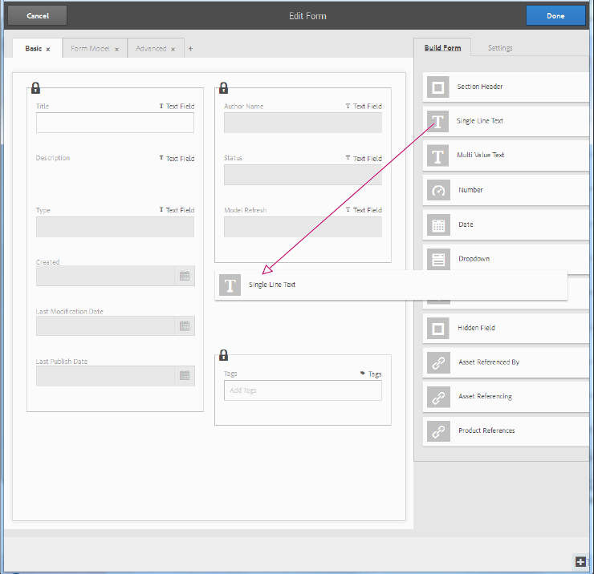

# Hantera formulärmetadata{#manage-form-metadata}

## Översikt  {#overview-nbsp}

Metadata gör det enklare att kategorisera och ordna resurser och hjälper användare som letar efter en viss resurs.

Som standard innehåller AEM Forms en definierad uppsättning metadata för varje resurstyp. Utöver standardmetadata kan du lägga till anpassade metadata för varje resurstyp. Med AEM Forms kan du också skapa, hantera och utbyta alla dessa metadata effektivt för dina formulär.

Om du är utvecklare eller webbplatsägare kan du anpassa Forms Portal, slutanvändargränssnittet för AEM Forms, så att det återspeglar de metadata du använder i organisationen. Mer information om Forms Portal finns i [Introduktion till att publicera formulär på en portal](../../forms/using/introduction-publishing-forms.md).

## Metadata i AEM-formulär {#metadata-in-aem-forms}

I AEM Forms beror listan med metadataegenskaper som är associerade med en resurs på dess typ. Om du lägger till en anpassad metadataegenskap läggs den till i alla resurser av den typ som de anpassade metadata lades till i.

### Resurstyper {#asset-types}

Följande resurstyper stöds i AEM Forms:

* Formulärmallar (XFA-formulär)
* PDF-formulär
* Dokument (platta PDF-filer)
* Anpassningsbara formulär
* Resurser
* XFS

#### Omfattande lista med metadata {#extensive-list-of-metadata}

Nedan följer en omfattande lista över metadataegenskaper som stöds i AEM Forms:

<table>
 <tbody> 
  <tr> 
   <td><strong>Egenskapsnamn</strong></td> 
   <td><strong>Tillgångstyp</strong></td> 
   <td><strong>Beskrivning</strong>  </td> 
  </tr> 
  <tr> 
   <td>Titel</td> 
   <td>Alla utom resurser</td> 
   <td>Formulärets visningsnamn.  </td> 
  </tr> 
  <tr> 
   <td>Beskrivning</td> 
   <td>Alla utom resurser</td> 
   <td>Beskrivning av formuläret. Användaren kan ange det här värdet.  </td> 
  </tr> 
  <tr> 
   <td>Typ</td> 
   <td>Alla</td> 
   <td>
Ett skrivskyddat värde som anger resurstypen. Den kan ha något av följande värden:
 
    <ul> 
     <li>Formulärmall</li> 
     <li>PDF-formulär, PDF-formulär (Acrobat) eller PDF-formulär (signerat)</li> 
     <li>Dokument, dokument (signerat)</li> 
     <li>Adaptiv form</li> 
     <li>Resurs</li> 
    </ul> </td> 
  </tr> 
  <tr> 
   <td>Skapad</td> 
   <td>Alla</td> 
   <td>Ett skrivskyddat värde som anger när resursen skapades.</td> 
  </tr> 
  <tr> 
   <td>Senaste ändringsdatum</td> 
   <td>Alla</td> 
   <td>Ett skrivskyddat värde som anger när resursen senast ändrades.</td> 
  </tr> 
  <tr> 
   <td>Författare</td> 
   <td>Alla utom resurser</td> 
   <td>
Ett skrivskyddat värde som automatiskt beräknas baserat på formulärtypen.
 
    <ul> 
     <li>PDF/Formulärmall/Dokument - hämtad från den överförda binära filen.</li> 
     <li>Anpassat formulär - Inloggad användare när formuläret skapas.</li> 
    </ul> </td> 
  </tr> 
  <tr> 
   <td>Status</td> 
   <td>Alla utom resurser</td> 
   <td>
 Ett skrivskyddat värde som definierar ett av följande lägen i ett formulär:
 
    <ul> 
     <li>Inget värde: Om ett formulär aldrig har publicerats.</li> 
     <li>Publicerat: När ett formulär publiceras.</li> 
     <li>Ändrad: När ett formulär ändrades efter att ha publicerats en gång.</li> 
    </ul> </td> 
  </tr> 
  <tr> 
   <td>Senaste publiceringsdatum</td> 
   <td>Alla utom resurser</td> 
   <td>Ett skrivskyddat värde som anger när formuläret senast publicerades.</td> 
  </tr> 
  <tr> 
   <td>Publicera på/av-tid</td> 
   <td>Alla utom resurser</td> 
   <td>
Tidpunkt då formuläret schemaläggs att automatiskt publiceras/avpubliceras. Användaren anger det här värdet när metadata redigeras.
 
    <ul> 
     <li>Både Publicera på- och Av-tid ska ligga efter aktuellt datum. </li> 
     <li>Publiceringstiden för publicering ska vara längre än publiceringstiden i tid. </li> 
    </ul> </td> 
  </tr> 
  <tr> 
   <td>Skicka URL</td> 
   <td>
Formulärmall
 
PDF-formulär
 </td> 
   <td>
Så här konfigurerar du en användardefinierad URL för att skicka formulärdata till en server.
 
Skicka-URL kan konfigureras med någon av följande metoder, listade i prioritetsordning:
 
    <ul> 
     <li>Ange en skicka-URL direkt i en formulärmall genom att använda HTTP-knappen när du skapar ett XFA-formulär i AEM Forms Designer.</li> 
     <li>I användargränssnittet för AEM-formulär väljer du ett formulär och anger en Skicka-URL när du redigerar metadataegenskaperna.</li> 
     <li>I Forms Portal redigerar du komponenten Search &amp; Lister och anger en Skicka-URL på fliken Formulärlänk.</li> 
    </ul> </td> 
  </tr> 
  <tr> 
   <td>HTML-återgivningsprofil</td> 
   <td>Formulärmall</td> 
   <td>Den HTML-återgivningsprofil som används vid återgivning av en formulärmall i HTML-format.</td> 
  </tr> 
  <tr> 
   <td>Återgivningsformat</td> 
   <td>
Formulärmall
 
Adaptiv form
 </td> 
   <td>
Med det här alternativet kan användaren ange formulärets återgivningsformat när formulären publiceras:
 
    <ul> 
     <li>HTML</li> 
     <li>PDF</li> 
     <li>Båda</li> 
    </ul> 
Det här alternativet används endast för att begränsa formulärens återgivningsformat på formulärportalen där de är synliga för slutanvändaren.
 </td> 
  </tr> 
  <tr> 
   <td>Taggar</td> 
   <td>Alla utom resurser</td> 
   <td>Etiketter som är kopplade till formuläret för att underlätta snabb och enkel sökning.</td> 
  </tr> 
  <tr> 
   <td>Referenser</td> 
   <td>
Adaptiv form
 
Formulärmall
 
Resurs
 </td> 
   <td>
Lista över resurser (andra formulär eller resurser) som det här formuläret är relaterat till. Dessa resurser kan delas in i följande två kategorier:
 
    <ul> 
     <li>Referenser: Resurser som det aktuella formuläret refererar till.</li> 
     <li>Refereras av: Resurser som refererar till den aktuella tillgången.</li> 
    </ul> 
De här resurserna visas som länkar och deras metadata kan du komma åt direkt genom att klicka på dem.  
 </td> 
  </tr> 
  <tr> 
   <td>Val av formulärmodell (XDP/XSD)</td> 
   <td>Adaptiv form</td> 
   <td>
Anger vilken formulärmodell som används när det adaptiva formuläret redigeras. Den här egenskapen kan ha följande värden:
 
    <ul> 
     <li>Formulärmall: En formulärmall väljs bland de som finns i databasen. Det här värdet kan uppdateras.</li> 
     <li>XML-schema: En XSD-fil överförs. Det här värdet kan uppdateras.</li> 
     <li>Inget</li> 
    </ul> 
    

      En formulärmodell som har valts kan uppdateras men inte tas bort. 
    
 </td> 
  </tr> 
 </tbody> 
</table>

## Visa formulärmetadata {#view-form-metadata}

Resurser har befintliga egenskapsvärden som kan visas i skrivskyddat läge. Dessa metadata kommer från när formuläret överförs eller när formuläret skapas.

1. Navigera till platsen för resursen som du vill visa metadata för.

1. Öppna egenskapssidan på något av följande sätt:

   1. Klicka på ikonen Visa egenskaper  i Snabbåtgärder.

      >[!NOTE]
      >
      >Snabbåtgärder är de åtgärdsobjekt som visas över en miniatyrbild när du håller muspekaren.

   1. Markera formuläret och klicka på ikonen Visa egenskaper  som visas i verktygsfältet.
   1. Navigera till sidan med formulärinformation genom att klicka på miniatyrbilden för formuläret när det inte är i markeringsläget. Klicka nu på  i det övre högra hörnet och klicka sedan på Egenskaper i listan under den.

1. Egenskapssidan som öppnas visar ett schema som bara innehåller de metadataegenskaper som innehåller vissa värden.

   Egenskapssidan har ett verktygsfält som innehåller två åtgärdsikoner:

   * Redigera:  Redigera egenskapsvärden för metadata
   * Visa:  Navigera till sidan med formulärinformation, som öppnar formuläret i förhandsgranskningsläget.
   Innehållsdelen är uppdelad i två delar:

   * Den vänstra panelen innehåller en miniatyrbild av formuläret
   * Den högra panelen innehåller metadataegenskaper i skrivskyddat läge, som är fördelade på olika flikar.

## Lägg till/uppdatera värden för formulärmetadata {#add-update-form-metadata-values}

Du kan redigera värdet för befintliga metadataegenskaper eller lägga till nya värden i ett befintligt egenskapsfält för metadata (till exempel när ett metadatafält är tomt).

### Uppdatera egenskapsvärden för metadata {#update-metadata-property-values}

1. Följ stegen som anges i föregående avsnitt för att öppna egenskapssidan där befintliga metadata för det valda formuläret kan visas.

1. Klicka på redigeringsikonen  i verktygsfältet för att ändra sidans läge från skrivskyddat till skrivskyddat.

1. Egenskapssidan som öppnas innehåller ett schema som innehåller en blandning av redigerbara inmatningsfält och statisk text.

1. Egenskaperna som visas i statisk text är de som du inte kan redigera.

1. Du kan navigera till andra flikar för att hitta inmatningsfält för metadataegenskaper som placeras under dem.

   Den här sidan har ett verktygsfält som innehåller två åtgärdsikoner som skiljer sig från dem i visningsläget:

   * Avbryt:  Avbryt alla ändringar av egenskapsvärden för metadata hittills
   * Klart:  Spara alla ändringar som gjorts i egenskapsvärden för metadata hittills
   Båda dessa åtgärder dirigerar användaren tillbaka till skrivskyddat läge för egenskapssidan som innehåller de uppdaterade värdena.

### Uppdatera formulärminiatyrbilden {#update-the-form-thumbnail}

På den vänstra panelen på egenskapssidan visas miniatyrbilden för formuläret. Som standard är den miniatyrbild som visas när formuläret skapas (anpassat formulär) eller när formuläret överförs.

För alla formulärtyper kan du välja att överföra en bild genom att klicka på **[!UICONTROL Överför bild]** och bläddra efter en bildfil från den lokala katalogen. Den markerade bilden används som miniatyrbild i stället för som standardbild.

För adaptiva formulär finns ytterligare funktioner som gör att användaren kan generera en miniatyrbild som en ögonblicksbild av den aktuella förhandsvisningen av adaptiva formulär. Eftersom AEM Forms även stöder utveckling av anpassningsbara formulär kan förhandsgranskningen av det anpassningsbara formuläret ändras varje gång du ändrar det. Den här funktionen för att generera en miniatyrbild hjälper dig att få en ny miniatyrbild för det adaptiva formuläret baserat på den aktuella förhandsvisningsstatusen. Klicka på **[!UICONTROL Generera förhandsgranskning]** för att utföra den här åtgärden.

>[!NOTE]
>
>* Använd en fyrkantig bild som miniatyrbild. När du använder en bild som inte är fyrkantig och visar miniatyrbilden i listvyn visas miniatyrbilden som bortklippt.
>* När en ny bild har överförts eller genererats ersätts miniatyrbilden av den här bilden och kan inte återställas till den föregående bilden.
>

## Lägg till anpassade metadata {#add-custom-metadata}

Förutom de metadata som finns i kartongen har AEM Forms stöd för nya anpassade metadata.

Ett verktyg (redigeringsprogram för metadataschema) finns för att definiera schemat för metadatalayouten. d.v.s. layouten för det som visas på sidan **[!UICONTROL Egenskaper]** i ett formulär. Med metadatarameditor kan du lägga till eller ändra ett anpassat schema för dina resurser.

AEM Forms visar metadatamappningar för de formulärtyper som stöds i det här verktyget. På så sätt kan du komma åt dessa scheman och använda funktionerna som finns i redigeraren för metadatamatchning för att lägga till anpassade egenskaper.

### Navigera i metadatamodeditorn {#navigate-the-metadata-schema-editor}

1. Navigera till **[!UICONTROL Verktyg > Resurser > Metadata Schemas]**.

1. Klicka på **[!UICONTROL formulär]** i de listade schemaformulären.

1. I listan som öppnas klickar du på resurstypen som du vill lägga till anpassade metadata för.

   >[!NOTE]
   >
   >Dessa scheman innehåller metadataegenskaper som anges utanför rutan och får inte ändras/redigeras (markera kryssrutan och klicka på Redigera från verktygsfältet) för att undvika funktionsproblem.

1. Alla resurstyper som du klickar på öppnas en lista som innehåller `extendedmetadata` alternativet. Redigera det här schemat.

1. Markera kryssrutan bredvid `extendedmetadata` och klicka sedan på ikonen Redigera  som visas i verktygsfältet.

1. AEM Forms öppnar metadatarammet/formulärbyggaren för den valda resurstypen (i det här fallet adaptiv form).

   

   Metadataredigerare

   1. Den vänstra panelen innehåller flikade avsnitt där fälten är placerade och den högra panelen visar alla tillgängliga gränssnittskomponenter och egenskaperna för fältet som är markerat från den vänstra panelen.

   1. Det låsta avsnittet går inte att redigera och innehåller fält för alla metadataegenskaper som anges i rutan.

   1. Du kan lägga till fler flikar genom att klicka på +-symbolen.

   1. Du kan lägga till ett anpassat fält av önskad typ genom att dra fältkomponenten från avsnittet **[!UICONTROL Skapa formulär]** till schemasidan.
   1. Specifikationerna för det här fältet finns under avsnittet **[!UICONTROL Inställningar]** när du har klickat på fältet.

### Lägg till anpassad metadataegenskap i schemaredigeraren {#add-custom-metadata-property-in-schema-editor}

1. Navigera till fliken (befintlig eller ny) där du vill lägga till den anpassade egenskapen.

1. Dra en komponent av önskad typ från avsnittet **[!UICONTROL Skapa formulär]** till vänster och placera den på en lämplig plats.

   >[!NOTE]
   >
   >Du kan inte flytta de låsta avsnitten, men du kan placera komponenten i något av de tomma utrymmena.

1. Klicka på en komponent som du just har dragit. Fyll i information för följande fält på fliken Inställningar som öppnas i den högra panelen:

   1. Ange en fältetikett som ska användas som visningsnamn ovanför fältet som placeras i schemat (till exempel: Avdelning)
   1. I egenskapsfältet Mappa till visas ett förifyllt värde **&#39;./jcr:content/metadata/default&quot;**. Ändra&quot;**default**&quot; till ett önskat egenskapsnamn, som används för att lagra egenskapen i crx-databasen (till exempel: &#39;./jcr:content/metadata/dec&#39;)

      >[!NOTE]
      >
      >Ändra inte prefixet&quot;./jcr:content/metadata/&#39; som den definierar sökvägen där egenskapen lagras.
      >
      >Egenskapsnamnet måste också vara unikt för att du inte ska kunna skriva värden för två eller flera egenskaper på samma plats i databasen. Vi rekommenderar att du ändrar värdet &#39;default&#39;.

   1. Fyll i andra inställningar baserat på behov. Till exempel: Välj alternativet Obligatoriskt om du vill göra fältet obligatoriskt.
   1. Om du vill ta bort ett fält som du har lagt till markerar du fältet och klickar sedan på ikonen Ta bort  .

1. Om det behövs följer du steg 1-3 för att lägga till en annan egenskap.
1. Klicka på **Klar** när du har gjort alla ändringar.

   Du har lagt till en anpassad metadataegenskap.

Alla adaptiva formulär i AEM Forms innehåller nu den här extra metadataegenskapen. Du kan redigera den från egenskapssidan.
