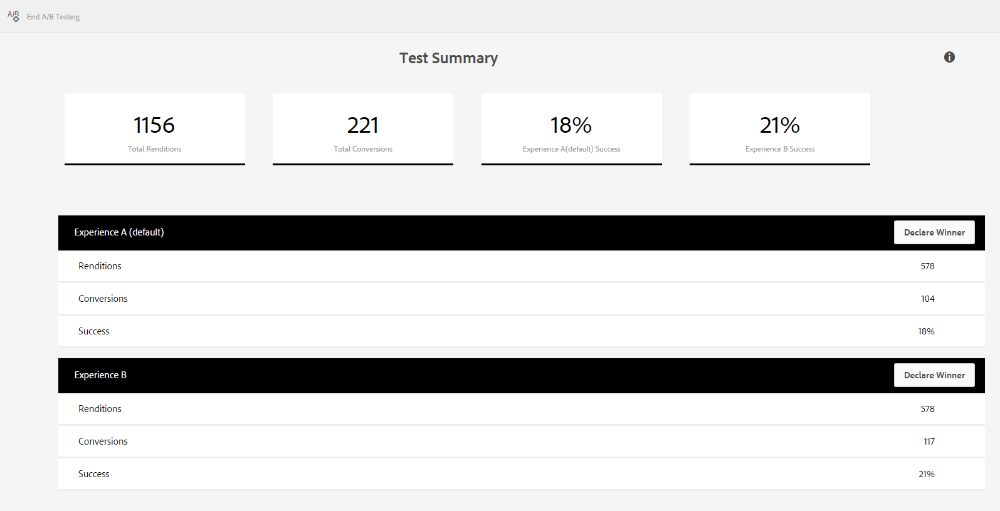

# Mät och förbättra effektiviteten och konverteringen av blanketter{#measure-and-improve-effectiveness-and-conversion-of-forms}

## Utmaningen {#the-challenge-br}

Organisationerna ger i allt större utsträckning sina kunder möjlighet att agera via digitala självtjänster i flera kanaler. Men i avsaknad av en-till-en-funktion blir det en utmaning att mäta framgången och experimentera med digitala formulär för att förbättra kundupplevelsen och öka konverteringsgraden.

För att maximera avkastningen måste organisationer övervaka hur kunderna interagerar med tjänster och experimentera med sina digitala artefakter (formulär) för att förbättra kundupplevelserna. För att mäta framgång och definiera en strategi för förbättring behöver organisationer få svar på frågor som:

* Hur många kunder försökte få åtkomst till eller hantera mina formulär?
* Hur många av dem slutförde transaktionen?
* Hur många övergav formuläret?
* Vilka problemområden har kunderna problem med?
* Vilka ändringar gör jag och hur testar jag vad som orsakar bättre konvertering?

## Lösningen {#the-solution}

AEM Forms kan integreras med [Adobe Marketing Cloud](https://www.adobe.com/marketing-cloud.html) -lösningar - [Adobe Analytics](https://www.adobe.com/marketing-cloud/web-analytics.html) och [Adobe Target](https://www.adobe.com/marketing-cloud/testing-targeting.html) - som hjälper er att övervaka och analysera hur era formulär fungerar och gör det möjligt att experimentera och identifiera upplevelser som leder till bättre konverteringsgrad.

## Arbetsflödet {#the-workflow}

Låt oss titta närmare på hur du kan mäta prestanda och förbättra konverteringsgraden för formulär.

### Målgrupper {#target-audience}

* Affärsanvändare och analytiker som ansvarar för marknadsföringsstrategier och framgång
* IT-personal som vill ha infrastruktur och lösningar för installation och underhåll

### Komponenter och funktioner i AEM Forms {#aem-forms-components-and-features-involved}

* Anpassningsbara formulär
* Integrering med Adobe Analytics för att samla in, ordna och rapportera kundinteraktioner med era adaptiva formulär
* Integrering med Adobe Target för att köra A/B-tester för adaptiva formulär

### Antaganden {#assumptions}

* Du har redan ett Adobe Marketing Cloud-konto och registrerat dig för lösningar med Analytics och Target.
* Du har ett publicerat adaptivt formulär som kunderna har tillgång till.

### Arbetsflödessteg {#workflow-steps}

#### Steg 1: Konfigurera Analytics och Target i AEM Forms {#step-configure-analytics-and-target-in-aem-forms-br}

**Konfigurera analys**

För att få djupgående insikter i hur kunderna interagerar med era formulär måste ni först konfigurera Analytics i AEM Forms. Utför följande steg:

1. Skapa en rapportsvit i Adobe Analytics
1. Skapa molntjänstkonfiguration i AEM
1. Skapa ramverk för molntjänster i AEM
1. Konfigurera konfigurationstjänsten AEM Forms Analytics i AEM
1. Aktivera analys i formuläret i AEM

Detaljerade steg finns i [Konfigurera analyser och rapporter för adaptiva formulär](../../forms/using/configure-analytics-forms-documents.md).

**Konfigurera mål**

Om du vill skapa och köra A/B-tester för dina adaptiva formulär konfigurerar du Target i AEM Forms enligt beskrivningen i [Konfigurera och integrera Target i AEM Forms](../../forms/using/ab-testing-adaptive-forms.md#p-set-up-and-integrate-target-in-aem-forms-p).

#### Steg 2: Visa analysrapport {#step-view-analytics-report-br}

När era kunder får tillgång till och interagerar med formulär som ni har aktiverat Analytics, hämtas deras interaktioner in i mycket säkra Analytics-databaser. Databaserna segmenteras av kunder och är tillgängliga via säkra anslutningar.

Du kan visa en rapport inifrån AEM för analysaktiverade formulär och analysera data. Så här visar du rapporten:

1. På AEM-servern går du till **Formulär > Formulär och dokument**.
1. Välj det formulär som du vill ha analysrapporten för.
1. Klicka på ikonen Analysrapporter. Rapporten visas.

Låt oss titta på de datapunkter som Analytics samlar in och rapporterar för formulär.

**Formuläranalysrapport**

Analysrapporten för adaptiva formulär innehåller följande KPI:er (Key Performance Indicators) på formulärnivå:

* **Genomsnittlig fyllningstid**: Genomsnittlig tid för att fylla i formuläret
* **Impressions**: Antal gånger som formuläret visades i sökresultaten

* **Återgivningar**: Antal gånger som formuläret har återgetts eller öppnats
* **Utkast**: Antal gånger som formuläret har sparats som utkast

* **Sändningar**: Antal gånger som formuläret har skickats in
* **Avbryt**: Antal gånger som användaren inte fyllt i formuläret
* **Besök/överföringar**: Andel besök per inlämning

Dessutom får du följande information om varje panel i formuläret:

* **Tid**: Genomsnittlig tid (sekunder) på panelen och dess fält

* **Fel**: Antal fel som påträffats på panelen och dess fält per 1 000 formuläråtergivningar

* **Hjälp**: Antal gånger som användare har använt sammanhangsberoende hjälp för panelen och dess fält per 1 000 formuläråtergivningar

Mer information om rapporter för formuläranalys finns i [Visa och förstå AEM Forms-analysrapporter](../../forms/using/view-understand-aem-forms-analytics-reports.md).

>[!NOTE]
>
>Ni kan visa detaljerade rapporter och få djupare insikter om era kunder och deras interaktioner med era formulär från ert Analytics-konto i Adobe Marketing Cloud.

#### Steg 3: Analysera datapunkter {#step-analyze-data-points}

I det här steget ska du analysera datapunkter i analysrapporten och sluta dig till hur formuläret fungerar. Om den inte uppfyller dina nyckeltal kommer du att skapa hypoteser baserat på data och hitta möjliga lösningar för att åtgärda problemen. Exempel:

* Om den genomsnittliga fyllningstiden för formuläret är längre än förväntat är det möjligt att formuläret är komplicerat för kunderna att förstå, att formuläret inte använder standardterminologi, att formuläret är för långt och så vidare. I det här fallet kanske du vill förenkla formulärstrukturen och fälten, arbeta om formulärdesignen, korta ned formulärets längd eller lägga till hjälpbeskrivningar och exempel för formulärfält som inte är standard.
* Om data indikerar att de flesta kunder använder hjälp för en formulärpanel är det uppenbart att kunderna är frågande om vilken information de ska fylla i. Du kan använda en alternativ terminologi eller lägga till exempelindata och hjälpbeskrivning för den panelen.
* Om avhopps- eller avhoppsfrekvensen för ett formulär är högre än förväntat kan det bero på att det tar lång tid att återge formuläret, att kunderna oavsiktligt landar på formuläret eller att det är för komplicerat. I det här fallet kanske du vill optimera formulärbeskrivningen som visas i sökresultaten, förenkla formuläret, optimera formuläret för snabbare inläsning och så vidare.

När du har analyserat dessa datapunkter och kommit fram till en hypotes kan du göra de ändringar som krävs i formuläret.

#### Steg 4: Validera analyser och korrigeringar {#step-validate-your-analysis-and-fixes}

I det här steget validerar du de ändringar du har gjort i formuläret och kontrollerar om det påverkar konverteringsgraden.

**Kör ett A/B-test**

Integrering av AEM Forms med Target gör det möjligt att skapa A/B-tester för adaptiva formulär. I A/B-tester presenterar ni slumpmässigt olika upplevelser av ett formulär för era kunder i realtid för att ta reda på vilken upplevelse som fungerar bättre eller orsakar fler konverteringar. När ni har betydande data som indikerar en upplevelse som ger bättre konvertering än den andra, kan ni deklarera att upplevelsen blir en vinnare och att den blir en standardupplevelse som är synlig för alla kunder.

Mer information om hur du skapar ett A/B-test för ett adaptivt formulär finns i [A/B-testning av adaptiva formulär](../../forms/using/ab-testing-adaptive-forms.md).

## God praxis {#best-practices}

De bästa sätten är de som du identifierar dig själv när du utför det här arbetsflödet. De är unika för din miljö och dina krav. Samla era kunskaper i arbetsflödet och dokumentera dem som bästa praxis.

Nedan följer några rekommendationer om hur du utformar formulär och kör A/B-tester:

**Formulärdesign**

* Gör formuläret enkelt, kort och enkelt att navigera i. Använd riktningsvisare för navigering.
* Använd standardtermer eller vanliga termer för formulärfält.
* Förklara fältet och obligatoriska indata, med exempel eller hjälp, där användarna kan bli förvirrade.
* Validera användarindata när de skriver in dem, när det är möjligt, för att undvika fel vid formulärinskickning.
* Optimera layouter för både datorer och mobila enheter.
* Fyll i information automatiskt för kända användare.

**A/B-tester**

* Skapa en hypotes och identifiera framgångsmått innan A/B-testet körs.
* Gör minimala variationer (helst en i taget) i den alternativa upplevelsen för att ta reda på vilken påverkan konverteringsgraden har.
* Testa ofta för att eliminera ineffektivitet.

