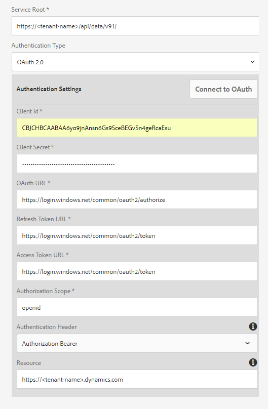

# Microsoft Dynamics OData-konfiguration{#microsoft-dynamics-odata-configuration}


Microsoft Dynamics är en CRM- och ERP-programvara (Enterprise Resource Planning) som innehåller företagslösningar för att skapa och hantera kundkonton, kontakter, leads, möjligheter och ärenden. [AEM Forms Data Integration](../../forms/using/data-integration.md) ger en OData-molntjänstkonfiguration som integrerar Forms med både online- och lokal Microsoft Dynamics-server. Det gör att du kan skapa formulärdatamodell baserat på de enheter, attribut och tjänster som definierats i Microsoft Dynamics-tjänsten. Formulärdatamodellen kan användas för att skapa anpassade formulär som interagerar med Microsoft Dynamics-servern för att möjliggöra affärsarbetsflöden. Exempel:

* Fråga Microsoft Dynamics-servern efter data och förifylla adaptiva formulär
* Skriv data i Microsoft Dynamics när formulär skickas med adaptiv form
* Skriv data i Microsoft Dynamics via anpassade entiteter som definierats i formulärdatamodellen och vice versa

Tilläggspaketet för AEM Forms innehåller även OData-referenskonfiguration som du kan använda för att snabbt integrera Microsoft Dynamics med AEM Forms.

När paketet är installerat är följande enheter och tjänster tillgängliga på din AEM Forms-instans:

* MS Dynamics OData Cloud-tjänst (OData-tjänst)
* Formulärdatamodell med förkonfigurerade Microsoft Dynamics-enheter och -tjänster.

OData-molntjänsten och formulärdatamodellen med förkonfigurerade Microsoft Dynamics-enheter och -tjänster är bara tillgängliga på din AEM Forms-instans om körningsläget för AEM-instansen är inställt som `samplecontent`(standard). Mer information om hur du konfigurerar körningslägen för en AEM-instans finns i [Körningslägen](/help/sites-deploying/configure-runmodes.md).

## Förutsättningar {#prerequisites}

Innan du börjar konfigurera och konfigurera Microsoft Dynamics måste du se till att du har:

* Tilläggspaketet [AEM Forms har installerats](../../forms/using/installing-configuring-aem-forms-osgi.md)
* Konfigurerade Microsoft Dynamics 365 online eller installerade en instans av någon av följande Microsoft Dynamics-versioner:

   * Lokal Microsoft Dynamics 365
   * Lokal Microsoft Dynamics 2016

* [Registrerade programmet för Microsoft Dynamics onlinetjänst med Microsoft Azure Active Directory](https://docs.microsoft.com/en-us/dynamics365/customer-engagement/developer/walkthrough-register-dynamics-365-app-azure-active-directory). Notera värdena för klient-ID (kallas även program-ID) och klienthemlighet för den registrerade tjänsten. De här värdena används när du [konfigurerar molntjänsten för din Microsoft Dynamics-tjänst](../../forms/using/ms-dynamics-odata-configuration.md#configure-cloud-service-for-your-microsoft-dynamics-service).

## Ange svars-URL för registrerat Microsoft Dynamics-program {#set-reply-url-for-registered-microsoft-dynamics-application}

Gör följande för att ange svars-URL:en för det registrerade Microsoft Dynamics-programmet:

>[!NOTE]
>
>Använd bara den här proceduren när du integrerar AEM Forms med Microsoft Dynamics onlineserver.

1. Gå till Microsoft Azure Active Directory-kontot och lägg till följande URL för molntjänstkonfiguration i **Svara-URL** -inställningarna för det registrerade programmet:

   `https://[server]:[port]/libs/fd/fdm/gui/components/admin/fdmcloudservice/createcloudconfigwizard/cloudservices.html`

   

1. Spara konfigurationen.

## Konfigurera Microsoft Dynamics för IFD {#configure-microsoft-dynamics-for-ifd}

Microsoft Dynamics använder anspråksbaserad autentisering för att ge åtkomst till data på Microsoft Dynamics CRM-servern till externa användare. Gör så här för att konfigurera Microsoft Dynamics för Internet-baserad distribution (IFD) och konfigurera anspråksinställningar om du vill aktivera det.

>[!NOTE]
>
>Använd bara den här proceduren när du integrerar AEM Forms med en lokal Microsoft Dynamics-server.

1. Konfigurera den lokala instansen av Microsoft Dynamics för IFD enligt beskrivningen i [Konfigurera IFD för Microsoft Dynamics](https://technet.microsoft.com/en-us/library/dn609803.aspx).
1. Kör följande kommandon med Windows PowerShell för att konfigurera anspråksinställningar för IFD-aktiverad Microsoft Dynamics:

   ```
   Add-PSSnapin Microsoft.Crm.PowerShell
    $ClaimsSettings = Get-CrmSetting -SettingType OAuthClaimsSettings
    $ClaimsSettings.Enabled = $true
    Set-CrmSetting -Setting $ClaimsSettings
   ```

   Mer information finns i [Appregistrering för CRM lokalt (IFD)](https://msdn.microsoft.com/sl-si/library/dn531010(v=crm.7).aspx#bkmk_ifd) .

## Konfigurera OAuth-klient på AD FS-dator {#configure-oauth-client-on-ad-fs-machine}

Gör följande för att registrera en OAuth-klient på AD FS-datorn (Active Directory Federation Services) och bevilja åtkomst på AD FS-datorn:

>[!NOTE]
>
>Använd bara den här proceduren när du integrerar AEM Forms med en lokal Microsoft Dynamics-server.

1. Kör följande kommando:

   `Add-AdfsClient -ClientId “<Client-ID>” -Name "<name>" -RedirectUri "<redirect-uri>" -GenerateClientSecret`

   Var:

   * `Client-ID` är ett klient-ID som du kan generera med valfri GUID-generator.
   * `redirect-uri` är URL:en till molntjänsten Microsoft Dynamics OData i AEM Forms. Standardmolntjänsten som installeras med AEM Forms-paketet distribueras på följande URL:
      `https://[server]:[port]/libs/fd/fdm/gui/components/admin/fdmcloudservice/createcloudconfigwizard/cloudservices.html`

1. Kör följande kommando för att bevilja åtkomst på AD FS-datorn:

   `Grant-AdfsApplicationPermission -ClientRoleIdentifier “<Client-ID>” -ServerRoleIdentifier <resource> -ScopeNames openid`

   Var:

   * `resource` är Microsoft Dynamics organisations-URL.

1. Microsoft Dynamics använder HTTPS-protokoll. Om du vill anropa AD FS-slutpunkter från Forms-servern installerar du Microsoft Dynamics platscertifikat till Java-certifikatarkivet med hjälp av kommandot på den dator som kör AEM Forms. `keytool`

## Konfigurera molntjänsten för din Microsoft Dynamics-tjänst {#configure-cloud-service-for-your-microsoft-dynamics-service}

Konfigurationen för **MS Dynamics OData-molntjänsten (OData Service)** innehåller OData-standardkonfigurationen. Så här konfigurerar du den för att ansluta till din Microsoft Dynamics-tjänst.

1. Navigera till **[!UICONTROL Verktyg > Molntjänster > Datakällor]** och tryck på `global` konfigurationsmappen.
1. Välj konfigurationen av **MS Dynamics OData Cloud-tjänsten (OData Service)** och tryck på **[!UICONTROL Egenskaper]**. Dialogrutan för konfigurationsegenskapen för molntjänster öppnas.

   På fliken **Autentiseringsinställningar** :

   1. Ange värdet för fältet **Tjänstrot** . Gå till Dynamics-instansen och navigera till **Developer Resources** för att visa värdet för fältet Service Root. Till exempel https://&lt;tenant-name>/api/data/v9.1/

   1. Ersätt standardvärdena i fälten **Klient-ID**(även kallat **program-ID**), **Klienthemlighet**, **OAuth-URL**, **Uppdatera token-URL********** ,¥Access-token-URL¥ och¥Resource¥ med värden från Microsoft Dynamics-tjänstkonfigurationen. Det är obligatoriskt att ange den dynamiska instansens URL i fältet **Resurs** för att konfigurera Microsoft Dynamics med en formulärdatamodell. Använd tjänstens rot-URL för att härleda den dynamiska instansens URL. Till exempel [https://org.crm.dynamics.com](https://org.crm.dynamics.com/).

   1. Ange **openID** i fältet **Authorization Scope** för auktoriseringsprocess i Microsoft Dynamics.
   

1. Klicka på **[!UICONTROL Anslut till OAuth]**. Du omdirigeras till inloggningssidan för Microsoft Dynamics.
1. Logga in med dina Microsoft Dynamics-autentiseringsuppgifter och godkänn för att tillåta molntjänstkonfigurationen att ansluta till Microsoft Dynamics-tjänsten. Det är en engångsuppgift att upprätta en anslutning mellan molntjänsten och tjänsten.

   Du omdirigeras sedan till konfigurationssidan för molntjänsten, som visar ett meddelande om att OData-konfigurationen har sparats.

Molntjänsten MS Dynamics OData Cloud Service (OData Service) är konfigurerad och ansluten till Dynamics-tjänsten.

## Skapa formulärdatamodell {#create-form-data-model}

När du installerar AEM Forms-paketet distribueras en formulärdatamodell,**Microsoft Dynamics FDM**, på din AEM-instans. Som standard använder formulärdatamodellen Microsoft Dynamics-tjänsten som konfigurerats i MS Dynamics OData Cloud-tjänsten (OData-tjänsten) som datakälla.

När formulärdatamodellen öppnas för första gången ansluter den till den konfigurerade Microsoft Dynamics-tjänsten och hämtar enheter från din Microsoft Dynamics-instans. Enheterna &quot;contact&quot; och &quot;lead&quot; från Microsoft Dynamics har redan lagts till i formulärdatamodellen.

Om du vill granska formulärdatamodellen går du till **[!UICONTROL Formulär > Dataintegreringar]**. Välj **Microsoft Dynamics FDM** och klicka på **Redigera** för att öppna formulärdatamodellen i redigeringsläge. Du kan även öppna formulärdatamodellen direkt från följande URL:

`https://[server]:[port]/aem/fdm/editor.html/content/dam/formsanddocuments-fdm/ms-dynamics-fdm`


Därefter kan du skapa ett anpassat formulär baserat på formulärdatamodellen och använda det i olika varianter av formuläranvändningen, till exempel:

* Fyll i anpassat formulär i förväg genom att fråga information från enheter och tjänster i Microsoft Dynamics
* Anropa Microsoft Dynamics-serveråtgärder som definierats i en formulärdatamodell med hjälp av adaptiva formulärregler
* Skriv skickade formulärdata till Microsoft Dynamics-enheter

Vi rekommenderar att du skapar en kopia av formulärdatamodellen som medföljer AEM Forms-paketet och konfigurerar datamodeller och tjänster så att de passar dina behov. Det ser till att framtida uppdateringar av paketet inte åsidosätter formulärdatamodellen.

Mer information om hur du skapar och använder formulärdatamodell i arbetsflöden finns i [Dataintegrering](../../forms/using/data-integration.md).
