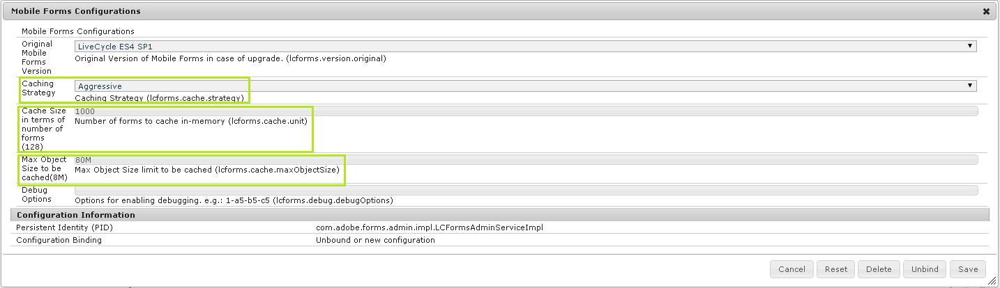

# Prestandajustering av AEM Forms Server{#performance-tuning-of-aem-forms-server}

I den här artikeln beskrivs strategier och bästa metoder som du kan implementera för att minska flaskhalsar och optimera prestandan för din AEM Forms-distribution.

## Cacheinställningar {#cache-settings}

Du kan konfigurera och styra cachelagringsstrategin för AEM Forms med komponenten **Mobile Forms Configurations** i AEM webbkonfigurationskonsol på:

* (AEM Forms på OSGi) `https://'[server]:[port]'/system/console/configMgr`
* (AEM Forms på JEE) `https://'[server]:[port]'/lc/system/console/configMgr`

De tillgängliga alternativen för cachelagring är följande:

* **Ingen**: Tvingar ingen artefakt att cachelagras. Detta saktar i praktiken ned prestanda och kräver hög minnestillgänglighet på grund av att cache saknas.
* **Konservativ**: Endast de mellanliggande artefakter som genereras innan formuläret renderas, till exempel en mall som innehåller textbundna fragment och bilder, cachelagras.
* **Aggressiv**: Tvingar dig att cachelagra nästan allt som kan cachas, inklusive återgivet HTML-innehåll förutom alla artefakter från den konservativa cachenivån. Det ger bästa prestanda men kräver också mer minne för att lagra cachelagrade artefakter. Aggressiv cachningsstrategi innebär att du får konstant tidsprestanda när du återger ett formulär när det återgivna innehållet cachas.

Standardinställningarna för cacheminnet för AEM Forms kanske inte är tillräckligt bra för att uppnå optimala prestanda. Därför rekommenderar vi att du använder följande inställningar:

* **Cachestrategi**: Aggressiv
* **Cachestorlek** (i antal formulär):
* **Maximal objektstorlek**: efter behov



>[!NOTE]
>
>Om du använder AEM Dispatcher för att cachelagra adaptiva formulär cache-lagras även adaptiva formulär som innehåller formulär med förfyllda data. Om sådana formulär hanteras från AEM Dispatcher-cache kan det leda till att förfyllda eller inaktuella data skickas till användarna. Använd därför AEM Dispatcher för att cachelagra adaptiva formulär som inte använder förifyllda data. Dessutom gör inte en Dispatcher-cache cachelagrade cachelagrade fragment automatiskt ogiltiga. Använd den alltså inte för att cachelagra formulärfragment. Använd [cache för anpassade formulär](../../forms/using/configure-adaptive-forms-cache.md) för sådana formulär och fragment.

## JVM-parametrar {#jvm-parameters}

För optimala prestanda bör du använda följande JVM `init`-argument för att konfigurera `Java heap` och `PermGen`.

```shell
set CQ_JVM_OPTS=%CQ_JVM_OPTS% -Xms8192m
set CQ_JVM_OPTS=%CQ_JVM_OPTS% -Xmx8192m
set CQ_JVM_OPTS=%CQ_JVM_OPTS% -XX:PermSize=256m
set CQ_JVM_OPTS=%CQ_JVM_OPTS% -XX:MaxPermSize=1024m
```

>[!NOTE]
>
>De rekommenderade inställningarna är för Windows 2008 R2 8 Core och Oracle HotSpot 1.7 (64 bitar) JDK och bör skalas upp eller ned enligt systemkonfigurationen.

## Använda en webbserver {#using-a-web-server}

Anpassningsbara formulär och HTML5-formulär återges i HTML5-format. Resultatet kan bli stort beroende på faktorer som formulärstorleken och bilderna i formuläret. För att optimera dataöverföringen rekommenderar vi att du komprimerar HTML-svaret med webbservern som begäran skickas från. Detta minskar svarsstorleken, nätverkstrafiken och den tid som krävs för att strömma data mellan server- och klientdatorer.

Så här aktiverar du exempelvis komprimering på 32-bitars Apache Web Server 2.0 med JBoss®:

>[!NOTE]
>
>Följande instruktioner gäller inte för andra servrar än 32-bitars Apache Web Server 2.0. Om du vill ha mer information om vilka steg som gäller för andra servrar läser du i motsvarande produktdokumentation.

I följande steg visas de ändringar som krävs för att aktivera komprimering med Apache Web Server

**Skaffa webbserverprogrammet Apache som kan användas i ditt operativsystem**

* Windows: hämta Apache-webbservern från Apache HTTP Server Project-webbplatsen.
* Solaris™ 64-bitars: ladda ned Apache-webbservern från Solaris™ webbplats i Sunfreeware.
* Linux®: Apache-webbservern är förinstallerad på ett Linux®-system.

Apache kan kommunicera med CRX via HTTP-protokollet. Konfigurationerna är avsedda för optimering med HTTP.

1. Avkommentera följande modulkonfigurationer i filen `APACHE_HOME/conf/httpd.conf`.

   ```shell
   LoadModule proxy_balancer_module modules/mod_proxy.so
   LoadModule proxy_balancer_module modules/mod_proxy_http.so
   LoadModule deflate_module modules/mod_deflate.so
   ```

   >[!NOTE]
   >
   >För Linux® är standardvärdet `APACHE_HOME` `/etc/httpd/`.

1. Konfigurera proxyn på port 4502 för crx.
Lägg till följande konfiguration i konfigurationsfilen `APACHE_HOME/conf/httpd.conf`.

   ```shell
   ProxyPass / https://<server>:4502/
   ProxyPassReverse / https://<server>:4502/
   ```

1. Aktivera komprimering. Lägg till följande konfiguration i konfigurationsfilen `APACHE_HOME/conf/httpd.conf`.

   **För HTML5-formulär**

   ```xml
   <Location /content/xfaforms>
       <IfModule mod_deflate.c>
           SetOutputFilter DEFLATE
           #Do not compress
           SetEnvIfNoCase Request_URI \.(?:gif|jpe?g|png)$ no-gzip dont-vary
           SetEnvIfNoCase Request_URI \.(?:exe|t?gz|zip|bz2|sit|rar)$ no-gzip dont-vary
           #Dealing with proxy servers
               <IfModule mod_headers.c>
                   Header append Vary User-Agent
               </IfModule>
       </IfModule>
   </Location>
   ```

   **För adaptiva formulär**

   ```xml
   <Location /content/forms/af>
       <IfModule mod_deflate.c>
           SetOutputFilter DEFLATE
           #Do not compress
           SetEnvIfNoCase Request_URI \.(?:gif|jpe?g|png)$ no-gzip dont-vary
           SetEnvIfNoCase Request_URI \.(?:exe|t?gz|zip|bz2|sit|rar)$ no-gzip dont-vary
           #Dealing with proxy servers
               <IfModule mod_headers.c>
                   Header append Vary User-Agent
               </IfModule>
       </IfModule>
   </Location>
   ```

   Använd `https://'server':80`, där `server` är namnet på den server där Apache-servern körs, för att få åtkomst till crx-servern.

## Använda ett antivirus på en server som kör AEM Forms {#using-an-antivirus-on-server-running-aem-forms}

Du kan uppleva långsam prestanda på servrar som kör ett antivirusprogram. Ett antivirusprogram som alltid är igång (genomsökning vid åtkomst) söker igenom alla filer i ett system. Det kan göra servern långsammare och AEM Forms prestanda påverkas.

För att förbättra prestandan kan du instruera antivirusprogrammet att utesluta följande AEM Forms-filer och -mappar från sökningen (vid åtkomst):

* AEM installationskatalog. Om det inte går att utesluta hela katalogen ska du utelämna följande:

   * [AEM installationskatalog]\crx-database\temp
   * [AEM installationskatalog]\crx-databas\databas
   * [AEM installationskatalog]\crx-database\launchpad

* Programserverns tillfälliga katalog. Standardplatsen är:

   * (JBoss®) [AEM installationskatalog]\jboss\standalone\tmp
   * (WebLogic) \Oracle\Middleware\user_projects\domains\LCDomain\servers\LCServer1\tmp
   * (WebSphere®) \Program Files\IBM\WebSphere\AppServer\profiles\AppSrv01\temp

* **(Endast AEM Forms på JEE)** GDS-katalog (Global Document Storage). Standardplatsen är:

   * (JBoss®) [appserver root]/server/&#39;server&#39;/svcnative/DocumentStorage
   * (WebLogic) [appserverdomain]/&#39;server&#39;/adobe/LiveCycleServer/DocumentStorage
   * (WebSphere®) [appserver root]/installedApps/adobe/&#39;server&#39;/DocumentStorage

* **(Endast AEM Forms på JEE)** AEM Forms Server loggar och tillfällig katalog. Standardplatsen är:

   * Serverloggar - [AEM Forms installationskatalog]\Adobe\AEM formulär\[app-server]\server\all\logs
   * Temporär katalog - [AEM Forms installationskatalog]\temp

>[!NOTE]
>
>* Om du använder en annan plats för GDS och en tillfällig katalog öppnar du AdminUI på `https://'[server]:[port]'/adminui`, går till **Hem > Inställningar > Core System Settings > Core Configurations** för att bekräfta platsen som används.
>
* Om AEM Forms Server fungerar långsamt även efter att de föreslagna katalogerna har utelämnats ska du även utelämna den körbara Java™-filen (java.exe).
>
