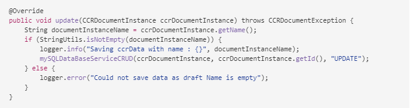

# Förbereda och skicka interaktiv kommunikation med agentens användargränssnitt {#prepare-and-send-interactive-communication-using-the-agent-ui}

Agentgränssnittet gör att agenterna kan förbereda och skicka interaktiv kommunikation till postprocessen. Agenten gör de ändringar som krävs och skickar den interaktiva kommunikationen till en postprocess, som e-post eller utskrift.

## Översikt {#overview}

När en interaktiv kommunikation har skapats kan agenten öppna den interaktiva kommunikationen i agentgränssnittet och förbereda en mottagarspecifik kopia genom att ange data och hantera innehåll och bilagor. Slutligen kan agenten skicka den interaktiva kommunikationen till en postprocess.

När agenten förbereder den interaktiva kommunikationen med hjälp av agentgränssnittet hanterar agenten följande aspekter av den interaktiva kommunikationen i agentgränssnittet innan den skickas till en postprocess:

* **Data**: Fliken Data i agentanvändargränssnittet visar alla variabler som kan redigeras av agenten och olåsta egenskaper för formulärdatamodellen i den interaktiva kommunikationen. Dessa variabler/egenskaper skapas när du redigerar eller skapar dokumentfragment som ingår i den interaktiva kommunikationen. Fliken Data innehåller även fält som är inbyggda i XDP/utskriftskanalmallen. Fliken Data visas bara när det finns variabler, formulärdatamodegenskaper eller fält i den interaktiva kommunikationen som kan redigeras av agenten.
* **Innehåll**: På fliken Innehåll hanterar agenten innehåll som dokumentfragment och innehållsvariabler i den interaktiva kommunikationen. Agenten kan göra de ändringar som är tillåtna i dokumentfragmentet när den interaktiva kommunikationen skapas i egenskaperna för dessa dokumentfragment. Agenten kan också ändra ordning på, lägga till/ta bort ett dokumentfragment och lägga till sidbrytningar, om det är tillåtet.
* **Bifogade filer**: Fliken Bifogade filer visas bara i agentgränssnittet om den interaktiva kommunikationen har några bilagor eller agenten har biblioteksåtkomst. Agenten får ändra eller redigera de bifogade filerna, men får inte göra det.

## Förbereda interaktiv kommunikation med hjälp av agentgränssnittet {#prepare-interactive-communication-using-the-agent-ui}

1. Välj **[!UICONTROL Forms]** > **[!UICONTROL Forms & Documents]**.
1. Välj lämplig interaktiv kommunikation och tryck **[!UICONTROL Open Agent UI]**.

   >[!NOTE]
   >
   >Agentgränssnittet fungerar bara om den valda interaktiva kommunikationen har en utskriftskanal.

   

   Agentgränssnittet visas med följande tre flikar baserat på innehållet och egenskaperna i det interaktiva kommunikationen: Data, innehåll och bifogad fil.

   

   Fortsätt till att ange data, hantera innehållet och hantera bilagor.

### Ange data {#enter-data}

1. På fliken Data anger du data för variabler, formulärdatamodegenskaper och utskriftsmallfält (XDP) efter behov. Fyll i alla obligatoriska fält markerade med en asterisk (&amp;ast;) för att aktivera knappen **Skicka** .

   Tryck på ett datafältvärde i förhandsvisningen av interaktiv kommunikation för att markera motsvarande datafält på fliken Data eller vice versa.

### Hantera innehåll {#manage-content}

På fliken Innehåll hanterar du innehåll som dokumentfragment och innehållsvariabler i den interaktiva kommunikationen.

1. Välj **[!UICONTROL Content]**. Fliken Innehåll i den interaktiva kommunikationen visas.

   

1. Redigera dokumentfragmenten efter behov på fliken Innehåll. Om du vill fokusera på det relevanta avsnittet i innehållshierarkin kan du antingen trycka på den relevanta raden eller det relevanta stycket i förhandsvisningen av interaktiv kommunikation eller trycka på avsnittet direkt i innehållshierarkin.

   Dokumentfragmentet med raden&quot;Gör en betalning online nu ... &quot; är markerat i förhandsvisningen i bilden nedan och samma dokumentfragment har markerats på fliken Innehåll.

   

   Genom att trycka på Markera markerade moduler i innehåll ( dmodulesincontentccr) längst upp till vänster i förhandsvisningen på fliken Innehåll eller Data kan du inaktivera eller aktivera funktioner för att gå till dokumentfragmentet när användaren trycker på/markerar den relevanta texten, stycket eller datafältet i förhandsvisningen.

   De fragment som agenten kan redigera när den skapar den interaktiva kommunikationen har ikonen Redigera markerat innehåll ( ). Tryck på ikonen Redigera markerat innehåll för att starta fragmentet i redigeringsläge och göra ändringar i det. Använd följande alternativ för att formatera och hantera text:

   * [Formateringsalternativ](#formattingtext)

      * [Kopiera och klistra in formaterad text från andra program](#pasteformattedtext)
      * [Markera delar av text](#highlightemphasize)
   * [Specialtecken](#specialcharacters)
   * [Kortkommandon](/help/forms/using/keyboard-shortcuts.md)

   Mer information om tillgängliga åtgärder för olika dokumentfragment i användargränssnittet för agenten finns i [Åtgärder och information i användargränssnittet](#actionsagentui)för agenten.

1. Om du vill lägga till en sidbrytning i utskriften av den interaktiva kommunikationen placerar du markören där du vill infoga en sidbrytning och väljer Sidbrytning före eller Sidbrytning efter ( ).

   En explicit platshållare för sidbrytningar infogas i interaktiv kommunikation. Om du vill se hur en explicit sidbrytning påverkar den interaktiva kommunikationen läser du i förhandsvisningen.

   

   Fortsätt att hantera de bifogade filerna i den interaktiva kommunikationen.

### Hantera bifogade filer {#manage-attachments}

1. Välj **[!UICONTROL Attachment]**. Agentgränssnittet visar de tillgängliga bifogade filerna som de har konfigurerats när interaktiv kommunikation skapas.

   Du kan välja att inte skicka en bifogad fil tillsammans med den interaktiva kommunikationen genom att trycka på visningsikonen och du kan trycka på krysset i den bifogade filen för att ta bort den (om agenten får ta bort eller dölja den bifogade filen) från den interaktiva kommunikationen. Ikonerna Visa och Ta bort är inaktiverade för bilagor som anges som obligatoriska när interaktiv kommunikation skapas.

   

1. Tryck på ikonen Biblioteksåtkomst ( ) för att komma åt innehållsbiblioteket och infoga DAM-resurser som bilagor.

   >[!NOTE]
   >
   >Ikonen Biblioteksåtkomst är bara tillgänglig om biblioteksåtkomst var aktiverat när interaktiv kommunikation skapades (i dokumentbehållaregenskaperna i utskriftskanalen).

1. Om ordningen på de bifogade filerna inte var låst när du skapade den interaktiva kommunikationen kan du ändra ordningen på de bifogade filerna genom att markera en bifogad fil och trycka på nedåtpilen och uppåtpilen.
1. Använd Förhandsgranska via webben och Förhandsgranska för att se om de två utdatafilerna är som du vill ha dem.

   Om du tycker att förhandsvisningarna är tillräckliga trycker du för **[!UICONTROL Submit]** att skicka/skicka interaktiv kommunikation till en postprocess. Om du vill göra ändringar avslutar du förhandsgranskningen och går tillbaka till ändringarna.

## Formatera text {#formattingtext}

När du redigerar ett textfragment i agentgränssnittet ändras verktygsfältet beroende på vilken typ av redigeringar du väljer att göra: Teckensnitt, Stycke eller Lista:

 

Verktygsfältet Teckensnitt


Verktygsfältet Stycke


Verktygsfältet Lista

### Markera/framhäv textdelar {#highlightemphasize}

Markera texten och tryck på Markera färg om du vill framhäva delar av texten i ett redigerbart fragment.


### Klistra in formaterad text {#pasteformattedtext}


### Infoga specialtecken i text {#specialcharacters}

Agentgränssnittet har inbyggt stöd för 210 specialtecken. Administratören kan [lägga till stöd för fler/anpassade specialtecken genom anpassning](/help/forms/using/custom-special-characters.md).

#### Leverans av bifogade filer {#attachmentdelivery}

* När den interaktiva kommunikationen återges med serversidans API:er som en interaktiv eller icke-interaktiv PDF innehåller den återgivna PDF-filen bilagor som PDF-bilagor.
* När en inläggsprocess som är kopplad till en interaktiv kommunikation läses in som en del av Skicka med agentgränssnittet, skickas bilagor som List&lt;com.adobe.idp.Document> inAttachmentDocs-parametern.
* Arbetsflöden för leveransfunktion, som e-post och utskrift, ger även bilagor tillsammans med PDF-versionen av Interactive Communication.

## Åtgärder och information som finns i agentens användargränssnitt {#actionsagentui}

### Dokumentfragment {#document-fragments}


* **Upp- och nedpilar**: Pilar för att flytta dokumentfragment uppåt eller nedåt i interaktiv kommunikation.
* **Ta bort**: Ta bort dokumentfragmentet från den interaktiva kommunikationen om det tillåts.
* **Sidbrytning före** (gäller för underordnade fragment i målområdet): Infogar sidbrytning före dokumentfragmentet.
* **Indrag**: Öka eller minska indrag för ett dokumentfragment.
* **Sidbrytning efter** (gäller för underordnade fragment i målområdet): Infogar sidbrytning efter dokumentfragmentet.


* Redigera (endast textfragment): Öppna RTF-redigerare för att redigera textdokumentfragmentet. Mer information finns i [Formatera text](#formattingtext).

* Markering (ögonikon): Inkluderar\exkluderar dokumentfragment från interaktiv kommunikation.
* Ofyllda värden (info): Anger antalet ofyllda variabler i dokumentfragmentet.

### Visa dokumentfragment {#list-document-fragments}


* Infoga tom rad: Infogar en ny tom rad.
* Markering (ögonikon): Inkluderar\exkluderar dokumentfragment från interaktiv kommunikation.
* Hoppa över punkter/nummer: Aktivera det här alternativet om du vill hoppa över punkter/numrering i listdokumentfragmentet.
* Ofyllda värden (info): Anger antalet ofyllda variabler i dokumentfragmentet.

## Spara interaktiv kommunikation som utkast {#save-as-draft}

Du kan använda agentgränssnittet för att spara ett eller flera utkast för varje interaktiv kommunikation och hämta utkastet senare för att fortsätta arbeta med det. Du kan ange olika namn för varje utkast för att identifiera det.

Adobe rekommenderar att du kör dessa instruktioner i följd för att spara ett interaktivt meddelande som ett utkast.

### Aktivera funktionen Spara som utkast {#before-save-as-draft}

Funktionen Spara som utkast är inte aktiverad som standard. Gör så här för att aktivera funktionen:

1. Implementera SPI ( [ccrDocumentInstance](https://helpx.adobe.com/experience-manager/6-5/forms/javadocs/com/adobe/fd/ccm/ccr/ccrDocumentInstance/api/services/CCRDocumentInstanceService.html) Service Provider Interface).

   Med SPI kan du spara utkastet till version av den interaktiva kommunikationen i databasen med ett utkast-ID som unik identifierare. Dessa instruktioner förutsätter att du har kunskap om hur du bygger ett OSGi-paket med ett Maven-projekt.

   Exempel på SPI-implementering finns i [Exempel på SPI-implementering](#sample-ccrDocumentInstance-spi)för ccrDocumentInstance.
1. Öppna `http://<hostname>:<port>/ system/console/bundles` och tryck **[!UICONTROL Install/Update]** för att ladda upp OSGi-paketet. Kontrollera att det överförda paketets status visas som **Aktiv**. Starta om servern om paketets status inte visas som **Aktiv**.
1. Gå till `https://'[server]:[port]'/system/console/configMgr`.
1. Tryck på **[!UICONTROL Create Correspondence Configuration]**.
1. Markera **[!UICONTROL Enable Save Using CCRDocumentInstanceService]** och tryck **[!UICONTROL Save]**.

### Spara interaktiv kommunikation som utkast {#save-as-draft-agent-ui}

Så här sparar du en interaktiv kommunikation som ett utkast:

1. Välj en interaktiv kommunikation i Forms Manager och tryck på **[!UICONTROL Open Agent UI]**.

1. Gör lämpliga ändringar i agentens användargränssnitt och tryck på **[!UICONTROL Save as Draft]**.

1. Ange namnet på utkastet i **[!UICONTROL Name]** fältet och tryck sedan på **[!UICONTROL Done]**.

När du har sparat det interaktiva meddelandet som ett utkast trycker du på **[!UICONTROL Save Changes]** för att spara ytterligare ändringar i utkastet.

### Hämta utkastet till interaktiv kommunikation {#retrieve-draft}

När du har sparat ett utkast för interaktiv kommunikation kan du hämta det och fortsätta arbeta med det. Hämta interaktiv kommunikation med:

`https://server:port/aem/forms/createcorrespondence.hmtl?draftid=[draftid]`

[DRAFID] refererar till den unika identifieraren för utkastversionen som genereras när en interaktiv kommunikation har sparats som ett utkast.

>[!NOTE]
>
>Om du gör några ändringar i det interaktiva meddelandet när du har sparat det som ett utkast, kommer utkastet inte att öppnas.

### Exempel på SPI-implementering av ccrDocumentInstance {#sample-ccrDocumentInstance-spi}

Implementera `ccrDocumentInstance` SPI för att spara ett interaktivt meddelande som ett utkast. Här följer ett exempel på implementering av `ccrDocumentInstance` SPI.

```javascript
package Implementation;

import com.adobe.fd.ccm.ccr.ccrDocumentInstance.api.exception.CCRDocumentException;
import com.adobe.fd.ccm.ccr.ccrDocumentInstance.api.model.CCRDocumentInstance;
import com.adobe.fd.ccm.ccr.ccrDocumentInstance.api.services.CCRDocumentInstanceService;
import org.apache.commons.lang3.StringUtils;
import org.osgi.service.component.annotations.Component;
import org.slf4j.Logger;
import org.slf4j.LoggerFactory;

import java.util.*;


@Component(service = CCRDocumentInstanceService.class, immediate = true)
public class CCRDraftService implements CCRDocumentInstanceService {

    private static final Logger logger = LoggerFactory.getLogger(CCRDraftService.class);

    private HashMap<String, Object> draftDataMap = new HashMap<>();

    @Override
    public String save(CCRDocumentInstance ccrDocumentInstance) throws CCRDocumentException {
        String documentInstanceName = ccrDocumentInstance.getName();
        if (StringUtils.isNotEmpty(documentInstanceName)) {
            logger.info("Saving ccrData with name : {}", ccrDocumentInstance.getName());
            if (!CCRDocumentInstance.Status.SUBMIT.equals(ccrDocumentInstance.getStatus())) {
                ccrDocumentInstance = mySQLDataBaseServiceCRUD(ccrDocumentInstance,null, "SAVE");
            }
        } else {
            logger.error("Could not save data as draft name is empty");
        }
        return ccrDocumentInstance.getId();
    }

    @Override
    public void update(CCRDocumentInstance ccrDocumentInstance) throws CCRDocumentException {
        String documentInstanceName = ccrDocumentInstance.getName();
        if (StringUtils.isNotEmpty(documentInstanceName)) {
            logger.info("Saving ccrData with name : {}", documentInstanceName);
            mySQLDataBaseServiceCRUD(ccrDocumentInstance, ccrDocumentInstance.getId(), "UPDATE");
        } else {
            logger.error("Could not save data as draft Name is empty");
        }
    }

    @Override
    public CCRDocumentInstance get(String id) throws CCRDocumentException {
        CCRDocumentInstance cCRDocumentInstance;
        if (StringUtils.isEmpty(id)) {
            logger.error("Could not retrieve data as draftId is empty");
            cCRDocumentInstance = null;
        } else {
            cCRDocumentInstance = mySQLDataBaseServiceCRUD(null, id,"GET");
        }
        return cCRDocumentInstance;
    }

    @Override
    public List<CCRDocumentInstance> getAll(String userId, Date creationTime, Date updateTime,
                                            Map<String, Object> optionsParams) throws CCRDocumentException {
        List<CCRDocumentInstance> ccrDocumentInstancesList = new ArrayList<>();

        HashMap<String, Object> allSavedDraft = mySQLGetALLData();
        for (String key : allSavedDraft.keySet()) {
            ccrDocumentInstancesList.add((CCRDocumentInstance) allSavedDraft.get(key));
        }
        return ccrDocumentInstancesList;
    }

    //The APIs call the service in the database using the following section.
    private CCRDocumentInstance mySQLDataBaseServiceCRUD(CCRDocumentInstance ccrDocumentInstance,String draftId, String method){
        if(method.equals("SAVE")){

            String autoGenerateId = draftDataMap.size() + 1 +"";
            ccrDocumentInstance.setId(autoGenerateId);
            draftDataMap.put(autoGenerateId, ccrDocumentInstance);
            return ccrDocumentInstance;

        }else if (method.equals("UPDATE")){

            draftDataMap.put(ccrDocumentInstance.getId(), ccrDocumentInstance);
            return ccrDocumentInstance;

        }else if(method.equals("GET")){

            return (CCRDocumentInstance) draftDataMap.get(draftId);

        }
        return null;
    }

    private HashMap<String, Object> mySQLGetALLData(){
        return draftDataMap;
    }
}
```

Operationerna `save`, `update`, `get`och `getAll` anropar databastjänsten för att spara en interaktiv kommunikation som ett utkast, uppdatera en interaktiv kommunikation, hämta data från databasen och hämta data för all interaktiv kommunikation som är tillgänglig i databasen. Det här exemplet använder `mySQLDataBaseServiceCRUD` som namn på databastjänsten.

I följande tabell förklaras exemplet på `ccrDocumentInstance` SPI-implementering. Det visar hur åtgärderna `save`, `update`, `get`och `getAll` anropar databastjänsten i exempelimplementeringen.

<table> 
 <tbody>
 <tr>
  <td><p><strong>Åtgärd</strong></p></td>
  <td><p><strong>Exempel på databastjänst</strong></p></td> 
   </tr>
  <tr>
   <td><p>Du kan antingen skapa ett utkast för en interaktiv kommunikation eller skicka det direkt. API:t för åtgärden Spara kontrollerar om den interaktiva kommunikationen skickas som ett utkast och innehåller ett utkastnamn. API:t anropar sedan tjänsten mySQLDataBaseServiceCRUD med Spara som indatametod.</p></br></br>[#$sd1_sf1_dp9]</td>
   <td><p>Tjänsten mySQLDataBaseServiceCRUD verifierar Spara som indatametod och genererar ett autogenererat utkast-ID och returnerar det till AEM. Logiken som används för att generera ett utkast-ID kan variera beroende på databasen.</p></br></br>[#$sd1_sf1_dp13]</td>
   </tr>
  <tr>
   <td><p>API:t för uppdateringsåtgärden hämtar status för Interactive Communication-utkastet och kontrollerar om Interactive Communication innehåller ett utkastsnamn. API:t anropar tjänsten mySQLDataBaseServiceCRUD för att uppdatera statusen i Database.</p></br></br>[#$sd1_sf1_dp17]</td>
   <td><p>Tjänsten mySQLDataBaseServiceCRUD verifierar Update som indatametod och sparar statusen för Interactive Communication-utkastet i databasen.</br></p></td>
   </tr>
   <tr>
   <td><p>API:t för get-åtgärden kontrollerar om den interaktiva kommunikationen innehåller ett utkast-ID. API:t anropar sedan tjänsten mySQLDataBaseServiceCRUD med Get som indatametod för att hämta data för den interaktiva kommunikationen.</br></p></td>
   <td><p>Tjänsten mySQLDataBaseServiceCRUD verifierar Get som indatametod och hämtar data för den interaktiva kommunikationen baserat på utkast-ID.</p></br></br>[#$sd1_sf1_dp29]</td>
   </tr>
   <tr>
   <td><p>API:t för åtgärden getAll anropar tjänsten mySQLGetALLData för att hämta data för all interaktiv kommunikation som har sparats i databasen.</br></p></td>
   <td><p>Tjänsten mySQLGetALLData hämtar data för alla interaktiva kommunikationer som har sparats i databasen.</p></br></br>[#$sd1_sf1_dp37]</td>
   </tr>
  </tbody>
</table>

Följande är ett exempel på den `pom.xml` fil som är en del av implementeringen:

```xml
<?xml version="1.0" encoding="UTF-8"?>
<project xmlns="http://maven.apache.org/POM/4.0.0"
         xmlns:xsi="http://www.w3.org/2001/XMLSchema-instance"
         xsi:schemaLocation="http://maven.apache.org/POM/4.0.0 http://maven.apache.org/xsd/maven-4.0.0.xsd">
    <modelVersion>4.0.0</modelVersion>

    <groupId>com.adobe.livecycle</groupId>
    <artifactId>draft-sample</artifactId>
    <version>2.0.0-SNAPSHOT</version>

    <name>Interact</name>
    <packaging>bundle</packaging>

    <dependencies>
        <dependency>
            <groupId>com.adobe.aemfd</groupId>
            <artifactId>aemfd-client-sdk</artifactId>
            <version>6.0.146</version>
        </dependency>
    </dependencies>


    <!-- ====================================================================== -->
    <!-- B U I L D D E F I N I T I O N -->
    <!-- ====================================================================== -->
    <build>
        <plugins>
            <plugin>
                <groupId>org.apache.felix</groupId>
                <artifactId>maven-bundle-plugin</artifactId>
                <version>3.3.0</version>
                <extensions>true</extensions>
                <executions>
                    <!--Configure extra execution of 'manifest' in process-classes phase to make sure SCR metadata is generated before unit test runs-->
                    <execution>
                        <id>scr-metadata</id>
                        <goals>
                            <goal>manifest</goal>
                        </goals>
                    </execution>
                </executions>
                <configuration>
                    <exportScr>true</exportScr>
                    <instructions>
                        <!-- Enable processing of OSGI DS component annotations -->
                        <_dsannotations>*</_dsannotations>
                        <!-- Enable processing of OSGI metatype annotations -->
                        <_metatypeannotations>*</_metatypeannotations>
                        <Bundle-SymbolicName>${project.groupId}-${project.artifactId}</Bundle-SymbolicName>
                    </instructions>
                </configuration>
            </plugin>
            <plugin>
                <groupId>org.apache.maven.plugins</groupId>
                <artifactId>maven-surefire-plugin</artifactId>
            </plugin>
            <plugin>
                <groupId>org.apache.maven.plugins</groupId>
                <artifactId>maven-compiler-plugin</artifactId>
                <configuration>
                    <source>8</source>
                    <target>8</target>
                </configuration>
            </plugin>
        </plugins>
    </build>
    <profiles>
        <profile>
            <id>autoInstall</id>
            <build>
                <plugins>
                    <plugin>
                        <groupId>org.apache.sling</groupId>
                        <artifactId>maven-sling-plugin</artifactId>
                        <executions>
                            <execution>
                                <id>install-bundle</id>
                                <phase>install</phase>
                                <goals>
                                    <goal>install</goal>
                                </goals>
                            </execution>
                        </executions>
                    </plugin>
                </plugins>
            </build>
        </profile>
    </profiles>

</project>
```

>[!NOTE]
>
>Se till att du uppdaterar beroendet till 6.0.146 eller en senare version i `aemfd-client-sdk` `pom.xml` filen.
