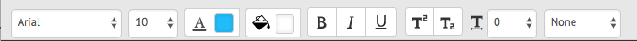

# Förbereda och skicka interaktiv kommunikation med agentens användargränssnitt {#prepare-and-send-interactive-communication-using-the-agent-ui}

Agentgränssnittet gör att agenterna kan förbereda och skicka interaktiv kommunikation till postprocessen. Agenten gör de ändringar som behövs och skickar den interaktiva kommunikationen till en postprocess, som e-post eller utskrift.

## Översikt {#overview}

När en interaktiv kommunikation har skapats kan agenten öppna den interaktiva kommunikationen i agentgränssnittet och förbereda en mottagarspecifik kopia genom att ange data och hantera innehåll och bilagor. Slutligen kan agenten skicka den interaktiva kommunikationen till en postprocess.

När agenten förbereder den interaktiva kommunikationen med hjälp av agentgränssnittet hanterar agenten följande aspekter av den interaktiva kommunikationen i agentgränssnittet innan den skickas till en postprocess:

* **Data**: Fliken Data i agentanvändargränssnittet visar alla variabler som kan redigeras av agenten och olåsta egenskaper för formulärdatamodellen i den interaktiva kommunikationen. Dessa variabler/egenskaper skapas när du redigerar eller skapar dokumentfragment som ingår i den interaktiva kommunikationen. Fliken Data innehåller även fält som är inbyggda i XDP/utskriftskanalmallen. Fliken Data visas bara när det finns variabler, formulärdatamodegenskaper eller fält i den interaktiva kommunikationen som kan redigeras av agenten.
* **Innehåll**: På fliken Innehåll hanterar agenten innehåll som dokumentfragment och innehållsvariabler i den interaktiva kommunikationen. Agenten kan göra de ändringar som är tillåtna i dokumentfragmentet när den interaktiva kommunikationen skapas i egenskaperna för dessa dokumentfragment. Agenten kan också ändra ordning på, lägga till/ta bort ett dokumentfragment och lägga till sidbrytningar, om det är tillåtet.
* **Bifogade filer**: Fliken Bifogade filer visas bara i agentgränssnittet om den interaktiva kommunikationen har några bilagor eller agenten har biblioteksåtkomst. Agenten får ändra eller redigera de bifogade filerna, men får inte göra det.

## Förbereda interaktiv kommunikation med hjälp av agentgränssnittet {#prepare-interactive-communication-using-the-agent-ui}

1. Välj **[!UICONTROL Formulär]** > **[!UICONTROL Formulär och dokument]**.
1. Välj lämplig interaktiv kommunikation och tryck på **[!UICONTROL Open Agent-gränssnittet]**.

   >[!NOTE]
   >
   >Agentgränssnittet fungerar bara om den valda interaktiva kommunikationen har en utskriftskanal.

   

   Agentgränssnittet visas med följande tre flikar baserat på innehållet och egenskaperna i det interaktiva kommunikationen: Data, innehåll och bifogad fil.

   

   Fortsätt till att ange data, hantera innehållet och hantera bilagor.

### Ange data {#enter-data}

1. På fliken Data anger du data för variabler, formulärdatamodegenskaper och utskriftsmallfält (XDP) efter behov. Fyll i alla obligatoriska fält markerade med en asterisk (&amp;ast;) för att aktivera knappen **Skicka** .

   Tryck på ett datafältvärde i förhandsvisningen av interaktiv kommunikation för att markera motsvarande datafält på fliken Data eller vice versa.

### Hantera innehåll {#manage-content}

På fliken Innehåll hanterar du innehåll som dokumentfragment och innehållsvariabler i den interaktiva kommunikationen.

1. Välj **[!UICONTROL Innehåll]**. Fliken Innehåll i den interaktiva kommunikationen visas.

   

1. Redigera dokumentfragmenten efter behov på fliken Innehåll. Om du vill fokusera på det relevanta avsnittet i innehållshierarkin kan du antingen trycka på den relevanta raden eller det relevanta stycket i förhandsvisningen av interaktiv kommunikation eller trycka på avsnittet direkt i innehållshierarkin.

   Dokumentfragmentet med raden&quot;Gör en betalning online nu ... &quot; är markerat i förhandsvisningen i bilden nedan och samma dokumentfragment har markerats på fliken Innehåll.

   

   Genom att trycka på Markera markerade moduler i innehåll ( dmodulesincontentccr) längst upp till vänster i förhandsvisningen på fliken Innehåll eller Data kan du inaktivera eller aktivera funktioner för att gå till dokumentfragmentet när användaren trycker på/markerar den relevanta texten, stycket eller datafältet i förhandsvisningen.

   De fragment som agenten kan redigera när den skapar den interaktiva kommunikationen har ikonen Redigera markerat innehåll ( ). Tryck på ikonen Redigera markerat innehåll för att starta fragmentet i redigeringsläge och göra ändringar i det. Använd följande alternativ för att formatera och hantera text:

   * [Formateringsalternativ](#formattingtext)

      * [Kopiera och klistra in formaterad text från andra program](#pasteformattedtext)
      * [Markera delar av text](#highlightemphasize)
   * [Specialtecken](#specialcharacters)
   * [Kortkommandon](/help/forms/using/keyboard-shortcuts.md)
   Mer information om tillgängliga åtgärder för olika dokumentfragment i användargränssnittet för agenten finns i [Åtgärder och information i användargränssnittet](#actionsagentui)för agenten.

1. Om du vill lägga till en sidbrytning i utskriften av den interaktiva kommunikationen placerar du markören där du vill infoga en sidbrytning och väljer Sidbrytning före eller Sidbrytning efter ( ).

   En explicit platshållare för sidbrytningar infogas i interaktiv kommunikation. Om du vill se hur en explicit sidbrytning påverkar den interaktiva kommunikationen läser du i förhandsvisningen.

   

   Fortsätt att hantera de bifogade filerna i den interaktiva kommunikationen.

### Hantera bifogade filer {#manage-attachments}

1. Välj **[!UICONTROL Bifogad fil]**. Agentgränssnittet visar de tillgängliga bifogade filerna som de har konfigurerats när interaktiv kommunikation skapas.

   Du kan välja att inte skicka en bifogad fil tillsammans med den interaktiva kommunikationen genom att trycka på visningsikonen och du kan trycka på krysset i den bifogade filen för att ta bort den (om agenten får ta bort eller dölja den bifogade filen) från den interaktiva kommunikationen. Ikonerna Visa och Ta bort är inaktiverade för bilagor som anges som obligatoriska när interaktiv kommunikation skapas.

   

1. Tryck på ikonen Biblioteksåtkomst ( ) för att komma åt innehållsbiblioteket och infoga DAM-resurser som bilagor.

   >[!NOTE]
   >
   >Ikonen Biblioteksåtkomst är bara tillgänglig om biblioteksåtkomst var aktiverat när interaktiv kommunikation skapades (i dokumentbehållaregenskaperna i utskriftskanalen).

1. Om ordningen på de bifogade filerna inte var låst när du skapade den interaktiva kommunikationen kan du ändra ordningen på de bifogade filerna genom att markera en bifogad fil och trycka på nedåtpilen och uppåtpilen.
1. Använd Förhandsgranska via webben och Förhandsgranska för att se om de två utdatafilerna är som du vill ha dem.

   Om du tycker att förhandsvisningarna är tillräckliga trycker du på **[!UICONTROL Skicka]** för att skicka/skicka interaktiv kommunikation till en postprocess. Om du vill göra ändringar avslutar du förhandsgranskningen och går tillbaka till ändringarna.

## Formatera text {#formattingtext}

När du redigerar ett textfragment i agentgränssnittet ändras verktygsfältet beroende på vilken typ av redigeringar du väljer att göra: Teckensnitt, Stycke eller Lista:

 

Verktygsfältet Teckensnitt

Verktygsfältet Stycke

Verktygsfältet Lista

### Markera/framhäv textdelar {#highlightemphasize}

Markera texten och tryck på Markera färg om du vill framhäva delar av texten i ett redigerbart fragment.

### Klistra in formaterad text {#pasteformattedtext}

### Infoga specialtecken i text {#specialcharacters}

Agentgränssnittet har inbyggt stöd för 210 specialtecken. Administratören kan [lägga till stöd för fler/anpassade specialtecken genom anpassning](/help/forms/using/custom-special-characters.md).

#### Leverans av bifogade filer {#attachmentdelivery}

* När den interaktiva kommunikationen återges med hjälp av API:er på serversidan som en interaktiv eller icke-interaktiv PDF, innehåller den återgivna PDF-filen bilagor som PDF-bilagor.
* När en inläggsprocess som är kopplad till en interaktiv kommunikation läses in som en del av Skicka med agentgränssnittet, skickas bilagor som List&lt;com.adobe.idp.Document> inAttachmentDocs-parametern.
* Arbetsflöden för leveransfunktion, som e-post och utskrift, ger även bilagor tillsammans med PDF-versionen av Interactive Communication.

## Åtgärder och information som finns i agentens användargränssnitt {#actionsagentui}

### Dokumentfragment {#document-fragments}

* **Upp- och nedpilar**: Pilar för att flytta dokumentfragment uppåt eller nedåt i interaktiv kommunikation.
* **Ta bort**: Ta bort dokumentfragmentet från den interaktiva kommunikationen om det tillåts.
* **Sidbrytning före** (gäller för underordnade fragment i målområdet): Infogar sidbrytning före dokumentfragmentet.
* **Indrag**: Öka eller minska indrag för ett dokumentfragment.
* **Sidbrytning efter** (gäller för underordnade fragment i målområdet): Infogar sidbrytning efter dokumentfragmentet.

* Redigera (endast textfragment): Öppna RTF-redigerare för att redigera textdokumentfragmentet. Mer information finns i [Formatera text](#formattingtext).

* Markering (ögonikon): Inkluderar\exkluderar dokumentfragment från interaktiv kommunikation.
* Ofyllda värden (info): Anger antalet ofyllda variabler i dokumentfragmentet.

### Visa dokumentfragment {#list-document-fragments}

* Infoga tom rad: Infogar en ny tom rad.
* Markering (ögonikon): Inkluderar\exkluderar dokumentfragment från interaktiv kommunikation.
* Hoppa över punkter/nummer: Aktivera det här alternativet om du vill hoppa över punkter/numrering i listdokumentfragmentet.
* Ofyllda värden (info): Anger antalet ofyllda variabler i dokumentfragmentet.

