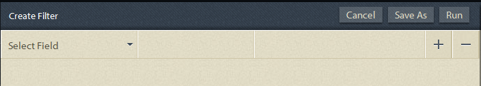

# Ad hoc-frågor i processrapportering{#ad-hoc-queries-in-process-reporting}

## Ad hoc-frågor i processrapportering {#ad-hoc-queries-in-process-reporting-1}

Med ad hoc-frågor i processrapportering kan du skapa anpassade frågor som du kan använda för att söka efter process- och uppgiftsinformation för de AEM Forms-processinstanser som definieras i AEM Forms-miljön.

Dessutom kan ad hoc-frågor definieras med hjälp av egenskapsfilter för process och uppgift. Dessa filter kan sedan sparas och användas för att köra rapporterna senare.

[**Processsökning **](/help/forms/using/process-reporting/adhoc-queries-in-process-reporting.md#p-process-task-search-p): Sök efter processinstanser med ett användardefinierat sökfilter baserat på processattribut.

[**Processinformation **](/help/forms/using/process-reporting/adhoc-queries-in-process-reporting.md#p-process-task-details-p): Visa information om en processinstans genom att ange process-ID.

**Uppgiftssökning**: Sök efter aktivitetsinstanser med ett användardefinierat sökfilter baserat på aktivitetsattribut.

**Uppgiftsinformation**: Visa information om en aktivitetsinstans genom att ange uppgifts-ID.

### Processer och uppgifter {#processes-and-tasks}

De steg du följer för att skapa filter och köra frågor för processinformation är desamma som för uppgifter.

Det innebär att användargränssnitten för processsökning och uppgiftssökning endast skiljer sig åt i de fält som du kan söka efter och i de fält som returneras i sökresultaten. Detta beror helt enkelt på att även om många av fälten är identiska är vissa fält specifika för processer och vissa fält är specifika för uppgifter.

I den här artikeln beskrivs avsnitten Process/Task Search och Process/Task Details. På lämpliga platser kommer eventuella skillnader att tas upp specifikt.

## Process-/uppgiftssökning {#process-task-search}

Du använder process-/uppgiftssökning för att definiera filter för frågor i process-/uppgiftsinstanser.

### Skapa en process-/uppgiftssökningsfråga {#to-create-a-process-task-search-query}

1. Om du vill visa de sparade process-/uppgiftssökningsfrågorna eller skapa en fråga klickar du på **Ad-frågor** och sedan på **Process-/uppgiftssökning**.

   

   Panelen **Mina filter** visas till höger om trädvyn.

   På panelen **Mina filter** kan du skapa nya ad hoc-frågor och klicka för att köra tidigare sparade frågor.

   

1. Om du vill köra en befintlig fråga klickar du bara på frågan på panelen **Mina filter** .
1. Om du vill skapa en fråga klickar du på **Lägg till** (+).

   Panelen **Skapa filter** visas.

   

   En fråga består av ett eller flera frågefilter. Om du vill skapa ett filter lägger du till en filterrad i frågan. Som standard läggs en filterrad till i frågan.

   **Definiera ett filter**

   1. Markera ett fält.

      

      >[!NOTE]
      >
      >Fältlistan innehåller fält som är specifika för AEM Forms-processen/uppgiften.

   1. Välj ett villkor.

      

      >[!NOTE]
      >
      >Vilka villkor som visas beror på vilket attribut som har valts för filtrering.

   1. Ange ett värde.

      

   1. Om du vill lägga till ytterligare ett filter i frågan klickar du på **Lägg till (+)** till höger om filterraden.

      Om du vill ta bort ett filter från frågan klickar du på **Ta bort (-)** till höger om filterraden.

      

När du har skapat en fråga använder du alternativen i det övre högra hörnet på panelen **Skapa filter** för att:

* **Avbryt**: Avbryt ändringarna och gå tillbaka till panelen **Mina filter** .
* **Kör**: Kör den aktuella frågan för att se och/eller verifiera resultatet. I det här fallet behöver du inte spara frågan innan du kör frågan. Du kan verifiera resultatet, göra eventuella ändringar och sedan spara frågan när du är nöjd med resultatet.
* **Spara**:Spara filtret. Filtret kan sedan visas och köras från panelen **Mina filter** .

### Alternativ på panelen Mina filter {#options-in-my-filters-panel}

Använd alternativen på panelen **Mina filter** för att **lägga till** , **redigera** **** eller¥Delete¥lc_pr_edit_¥filteran ad hoc-fråga.

### Så här kör du en sökfråga {#to-execute-a-search-query}

1. Om du vill köra en fråga klickar du på filtret på panelen **Mina filter** eller på knappen **Kör** om du skapar eller redigerar ett filter.
1. Resultatet av frågan visas på panelen **Rapport** i fönstret **Processrapportering** .

   

   Du kan numrera sökresultaten med hjälp av sidnumreringspanelen som visas längst ned i rapporten.

   

   I listrutan **Visa** väljer du hur många resultat som ska visas per sida.

   Ange ett sidnummer i textrutan **Sida** om du vill gå direkt till den sidan.

1. Följande fält visas i resultatet av en processsökning:

   * **Process-ID**: ID för processen. Fältet är hyperlänkat. Om du klickar på ett process-ID i det här fältet omdirigeras du till panelen **[!UICONTROL Processinformation]** för processen.
   * **Initierare**: Den AEM Forms-användare som startade processinstansen
   * **Skapad**: Datum och tid då processinstansen startades
   * **Slutförandetid**: Datum och tid då processinstansen slutfördes
   * **Varaktighet**: Varaktigheten från start till slutförande av processinstansen
   * **Status**: Processinstansens aktuella status.
   Som standard sorteras resultatet efter process-ID. Om du vill sortera resultatet efter något av fälten klickar du på fältrubriken.

   Eftersom sorteringen är en växlingsåtgärd kan du sortera resultatet i stigande ordning genom att klicka på en kolumnrubrik och sedan klicka på den igen för att sortera i fallande ordning.

   På samma sätt visas följande fält i ett resultat av en uppgiftssökning:

   * **Aktivitets-ID**: Aktivitetens ID. Fältet är hyperlänkat. Om du klickar på ett uppgifts-ID i det här fältet omdirigeras du till panelen **[!UICONTROL Uppgiftsinformation]** för uppgiften.
   * **Initierare**: Den AEM Forms-användare som startade processinstansen
   * **Skapad**: Datum och tid då processinstansen startades
   * **Slutförandetid**: Datum och tid då processinstansen slutfördes
   * **Varaktighet**: Varaktigheten från start till slutförande av processinstansen
   * **Status**: Processinstansens aktuella status.
   Som standard sorteras resultatet efter aktivitets-ID. Om du vill sortera resultatet efter något av fälten klickar du på fältrubriken. Resultatet sorteras efter den kolumn som indikeras av en mörk pil bredvid kolumnrubriken.

   Eftersom sorteringen är en växlingsåtgärd kan du sortera resultatet i stigande ordning genom att klicka på en fältrubrik och sedan sortera i fallande ordning genom att klicka på den igen. Den aktuella sorteringsordningen (stigande/fallande) anges med riktningen för den mörkare pilen bredvid kolumnrubriken.

   

1. Klicka på knappen  i det övre vänstra hörnet för att komprimera rutan **Mina filter** och utökar utrymmet för **rapportpanelen** .
1. Använd alternativen i det övre högra hörnet av panelen **Rapport **för att utföra åtgärder på frågeresultatet.

   * **Uppdatera**: Uppdaterar rapporten med de senaste data som finns i lagringen

   * **Exportera till CSV**: Exportera rapportdata till en kommaavgränsad fil.
   >[!NOTE]
   >
   >När du exporterar en rapport exporteras hela sökresultatet till en CSV-fil och inte bara till den aktuella sidan

## Process-/aktivitetsinformation {#process-task-details}

Du använder panelen **Processinformation** för att visa information om en viss process.

På samma sätt använder du panelen **Uppgiftsinformation** för att visa information om en viss uppgift.

### Visa process-/uppgiftsinformation {#to-view-process-task-details}

Du kan visa information om en viss AEM Forms-process/uppgift:

* **Från ett process-/uppgiftssökresultat**
* **Genom att ange process-/uppgifts-ID på panelen Process/Task Details**

#### Från ett process-/uppgiftssökresultat {#from-a-process-task-search-result}

1. Kör en process-/uppgiftssökning. Mer information finns i [Så här kör du en processsökfråga](#to-execute-a-search-query).

   Observera att de process-ID som visas i resultatet är hyperlänkade.

   

1. Klicka på ett process-ID i listan för att visa information om processen på panelen **Processinformation** .

   Frågeresultatet för **process-/uppgiftsinformation** visar detaljer om de uppgifter/formulär som finns i processen/uppgiften.

   Som standard sorteras resultatet efter Aktivitets-/formulär-ID. Om du vill sortera resultatet efter något av fälten klickar du på fältrubriken. Kolumnen som resultatet sorteras efter anges med en mörk pil bredvid kolumnrubriken.

   Eftersom sorteringen är en växlingsåtgärd kan du sortera resultatet i stigande ordning genom att klicka på en fältrubrik och sedan sortera i fallande ordning genom att klicka på den igen. Den aktuella sorteringsordningen (stigande/fallande) anges med riktningen för den mörkare pilen bredvid kolumnrubriken.

   **Resultat av processinformation**

   

   **** Vänster panel: Visar följande information om den valda processen:

   * Namn på process
   * Datum och tid för processskapande
   * Datum och tid för slutförande av process
   * Processens längd
   * Processstatus
   * Processinitierare
   **** Panelen längst upp till höger: Visar följande information om de uppgifter som utgör den valda processen:

   * Aktivitets-ID
   * Uppgiftsnamn
   * Aktivitetsägare
   * Datum/tid för skapande av uppgift
   * Datum/tid för aktivitetsuppdatering
   * Datum och tid för slutförande av uppgift
   * Aktivitetsvaraktighet
   * Uppgiftsstatus
   **** Panelen längst ned till höger: Visar följande information om processhistoriken för den valda processen:

   * Processnamn
   * Processinitierare
   * Datum och tid för processuppdatering
   * Datum och tid för slutförande av process
   * Processstatus
   **Resultat av aktivitetsinformation**

   

   **** Vänster panel: Visar följande information om den valda aktiviteten:

   * Aktivitetsnamn
   * ID för processen som den här aktiviteten tillhör
   * Uppgiftsbeskrivning
   * Datum/tid för skapande av uppgift
   * Datum och tid för slutförande av uppgift
   * Aktivitetsvaraktighet
   * Uppgiftsstatus
   * Markerat uppgiftsflöde
   **** Panelen längst upp till höger: Visar följande information om de formulär som utgör den valda uppgiften:

   * Foprm-ID
   * Datum och tid då formuläret skapades
   * Datum och tid för formuläruppdatering
   * Formulärmallens URL
   **** Panelen längst ned till höger: Visar följande information om processhistoriken för den valda uppgiften:

   * Typ av aktivitetstilldelning
   * Aktivitetsägare
   * Datum/tid då uppgiftstilldelningar skapades
   * Datum/tid för aktivitetsuppdatering

1. Klicka på **Tillbaka till process-/uppgiftssökning** om du vill gå tillbaka till sökresultatet som processen/uppgiftsinformationen fördjupades från.

   

   Om process-/uppgiftsinformationen hittas genom att ett visst process-/uppgifts-ID anges, kommer du tillbaka till **process-/uppgiftssökning** när du klickar på Tillbaka till process-/uppgiftssökning, utan att visa något sökresultat.

#### Genom att ange process-/uppgifts-ID på panelen Process/Task Details {#by-entering-the-process-task-id-in-the-process-task-details-panel-br}

1. Gå till panelen **Process/Aktivitetsinformation** .

   

1. Ange process-/uppgifts-ID i textrutan Process/Task ID.

   

   Fälten i frågeresultatet **Process/Uppgiftsinformation** är fält som är specifika för en AEM Forms-process/uppgift.

   För en process visar frågeresultatet information om de uppgifter som ingår i processen.

   För en uppgift visar frågeresultatet detaljerna i de formulär som ingår i uppgiften.

[Kontakta supporten](https://www.adobe.com/account/sign-in.supportportal.html)
