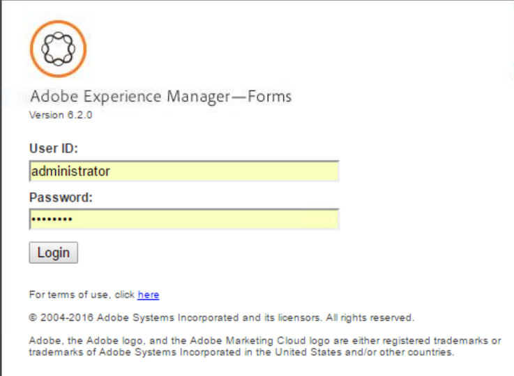

# Komma igång med processrapportering{#getting-started-with-process-reporting}

Med Process Reporting kan AEM Forms-användare ställa frågor om AEM Forms-processer som för närvarande är definierade i AEM Forms-implementeringen. Processrapportering kommer dock inte åt data direkt från AEM Forms-databasen. Data publiceras först till Process Reporting-databasen på schemalagd basis (*av* tjänsterna ProcessDataPublisher och ProcessDataStorage). Rapporterna och frågorna i Process Reporting genereras sedan från de processrapporteringsdata som publiceras till databasen. Processrapportering installeras som en del av modulen Formulärarbetsflöde.

I den här artikeln beskrivs stegen för hur du aktiverar publicering av AEM Forms-data till Process Reporting-databasen. Därefter kan du använda processrapportering för att köra rapporter och frågor. Artikeln innehåller även de alternativ som är tillgängliga för att konfigurera Process Reporting Services.

## Krav för processrapportering {#process-reporting-pre-requisites}

### Rensa processer som inte är nödvändiga {#purge-non-essential-processes}

Om du använder formulärarbetsflödet kan AEM Forms-databasen innehålla en stor mängd data

Publiceringstjänsterna för processrapportering kommer att publicera alla AEM Forms-data som för närvarande finns i databasen. Detta innebär att om databasen innehåller äldre data som du inte vill köra rapporter och frågor på, kommer alla dessa data också att publiceras i databasen, även om de inte behövs för rapportering. Du rekommenderas att rensa dessa data innan du kör tjänsterna för att publicera data i Process Reporting-databasen. Detta förbättrar prestandan för både utgivartjänsten och tjänsten som frågar efter data för rapportering.

Mer information om hur du rensar AEM Forms-processdata finns i [Tömma processdata](https://help.adobe.com/en_US/livecycle/11.0/AdminHelp/WS92d06802c76abadb-5145d5d12905ce07e7-7cb2.2.html).

>[!NOTE]
>
>Tips och tricks för rensningsverktyget finns i Adobe Developer Connection-artikeln om [rensningsprocesser och jobb](https://www.adobe.com/content/dam/Adobe/en/devnet/livecycle/pdfs/purging_processes_jobs.pdf).

## Konfigurerar Process Reporting Services {#configuring-process-reporting-services}

### Schemalägg publicering av processdata {#schedule-process-data-publishing}

Tjänsten Process Reporting publicerar schemalagda data från AEM Forms-databasen till Process Reporting-databasen.

Den här åtgärden kan vara resurskrävande och kan påverka prestanda för AEM Forms-servrarna. Du rekommenderas att schemalägga detta utanför AEM Forms-serverns lediga tidsrymder.

Som standard kommer publiceringen av data att köras varje dag kl. 02:00.

Gör så här för att ändra publiceringsschemat:

>[!NOTE]
>
>Om du kör implementeringen av AEM Forms på ett kluster utför du följande steg på varje nod i klustret.

1. Stoppa AEM Forms-serverinstansen.
1. &#x200B;

   * (Windows) Öppna `[JBoss root]/bin/run.conf.bat` filen i en redigerare.
   * (För Linux, AIX och Solaris) `[JBoss root]/bin/run.conf.sh` i en redigerare.

1. Lägg till JVM-argumentet `-Dreporting.publisher.cron = <expression>.`

   Exempel: Följande huvuduttryck gör att processrapportering publicerar AEM Forms-data till Process Reporting-databasen var femte timme:

   * `-Dreporting.publisher.cron = 0_0_0/5_*_*_?`

1. Spara och stäng `run.conf.bat` filen.

1. Starta om serverinstansen för AEM Forms.

1. Stoppa AEM Forms-serverinstansen.
1. Logga in på administrationskonsolen för WebSphere. Klicka på **Servrar** > **Programservrar** i navigeringsträdet och klicka sedan på servernamnet i den högra rutan.

1. Under Serverinfrastruktur klickar du på **Java och Process Management** > **Processdefinition**.

1. Klicka på **Java Virtual Machine** under Additional Properties (Ytterligare egenskaper).

   Lägg till argumentet i rutan Allmänt om JVM-argument `-Dreporting.publisher.cron = <expression>.`

   **Exempel**: Följande huvuduttryck gör att processrapportering publicerar AEM Forms-data till Process Reporting-databasen var femte timme:

   * `-Dreporting.publisher.cron = 0_0_0/5_*_*_?`

1. Klicka på **Använd**, klicka på OK och sedan på **Spara direkt i huvudkonfigurationen**.
1. Starta om serverinstansen för AEM Forms.
1. Stoppa AEM Forms-serverinstansen.
1. Logga in på WebLogic Administration Console. Standardadressen för WebLogic Administration Console är `https://[hostname]:[port]/console`.
1. Klicka på **Lås och redigera** under Ändringscenter.
1. Klicka på **Miljö** > **Servrar** under Domänstruktur och klicka på namnet på den hanterade servern i den högra rutan.
1. På nästa skärm klickar du på fliken **Konfiguration** > **Serverstart** .
1. Lägg till JVM-argumentet i rutan Argument `-Dreporting.publisher.cron = <expression>`.

   **Exempel**: Följande huvuduttryck gör att processrapportering publicerar AEM Forms-data till Process Reporting-databasen var femte timme:

   `-Dreporting.publisher.cron = 0_0_0/5_*_*_?`

1. Klicka på **Spara** och sedan på **Aktivera ändringar**.
1. Starta om serverinstansen för AEM Forms.

### Tjänsten ProcessDataStorage {#processdatastorage-service}

ProcessDataStorageProvider-tjänsten tar emot processdata från ProcessDataPublisher-tjänsten och sparar data i Process Reporting-databasen.

Vid varje publiceringscykel sparas data i undermappar till en fördefinierad rotmapp.

Du kan använda administrationskonsolen för att konfigurera roten (**standard**: `/content/reporting/pm`) plats och undermapp (**standard**: `/yyyy/mm/dd/hh/mi/ss`) hierarkiformat där processdata ska lagras.

#### Så här konfigurerar du lagringsplatser för processrapportering {#to-configure-the-process-reporting-repository-locations}

1. Logga in på **administrationskonsolen** med administratörsuppgifter. Standardwebbadressen för administrationskonsolen är `https://'[server]:[port]'/adminui`
1. Navigera till **Hem** > **Tjänster** > **Program och tjänster** >**Tjänsthantering** och öppna tjänsten **ProcessDataStorageProvider** .

   

   **RootFolder**

   Den CRX-plats där processdata ska lagras för rapportering.

   `Default`: `/content/reporting/pm`

   **Mapphierarki**

   Mapphierarkin där processdata ska lagras baserat på tiden då processen skapades.

   `Default`: `/yyyy/mm/dd/hh/mi/ss`

1. Click **Save**.

### Tjänsten ReportConfiguration {#reportconfiguration-service}

Tjänsten ReportConfiguration används av Process Reporting för att konfigurera frågetjänsten för processrapportering.

#### Så här konfigurerar du ReportingConfiguration-tjänsten {#to-configure-the-reportingconfiguration-service}

1. Logga in på **Configuration Manager** med autentiseringsuppgifter för CRX-administratör. Konfigurationshanterarens standardwebbadress är `https://'[server]:[port]'/lc/system/console/configMgr`
1. Öppna tjänsten **ReportingConfiguration** .
1. **Antal poster**

   När en fråga körs i databasen kan resultatet innehålla ett stort antal poster. Om resultatmängden är stor kan frågekörningen ta serverresurser i anspråk.

   För att hantera stora resultatuppsättningar delar tjänsten ReportConfiguration frågebearbetningen i grupper av poster. Detta minskar systembelastningen.

   `Default`: `1000`

   **CRX-lagringssökväg**

   Den CRX-plats där processdata ska lagras för rapportering.

   `Default`: `/content/reporting/pm`

   >[!NOTE]
   >
   >Detta är samma plats som anges i konfigurationsalternativet ProcessDataStorage **Root Folder**.
   >
   >
   >Om du uppdaterar alternativet Rotmapp i ProcessDataStorage-konfigurationen måste du uppdatera sökvägen till CRX-lagringssökvägen i tjänsten ReportConfiguration.

1. Klicka på **Spara** och stäng **CQ Configuration Manager**.

### ProcessDataPublisher-tjänst {#processdatapublisher-service}

Tjänsten ProcessDataPublisher importerar processdata från AEM Forms-databasen och publicerar data till tjänsten ProcessDataStorageProvider för lagring.

#### Så här konfigurerar du tjänsten ProcessDataPublisher {#to-configure-processdatapublisher-service-nbsp}

1. Logga in på **administrationskonsolen** med administratörsuppgifter.

   Standardwebbadressen är `https://'server':port]/adminui/`.

1. Navigera till **Hem** > **Tjänster** > **Program och tjänster** >**Tjänsthantering** och öppna tjänsten **ProcessDataPublisher** .

**Publicera data**

Aktivera det här alternativet om du vill starta publiceringen av processdata. Som standard är alternativet inaktiverat.

Aktivera bara processrapportering när alla konfigurationer som är relaterade till processrapportkomponenter har konfigurerats korrekt.

Du kan också använda det här alternativet för att inaktivera publicering av processdata när det inte längre behövs.

`Default`: `Off`

**Gruppintervall (sek)**

Varje gång tjänsten ProcessDataPublisher körs delar tjänsten först tiden sedan den senaste körningen av tjänsten via batchintervallet. Tjänsten bearbetar sedan varje intervall med AEM Forms-data separat.

Detta hjälper till att kontrollera storleken på data som utgivaren bearbetar från början till slut under varje körning (batch) i en cykel.

Om utgivaren till exempel körs varje dag, delas bearbetningen som standard i 24 batchar om en timme vardera i stället för att bearbeta hela data för en dag i en enda omgång.

`Default`: `3600`

`Unit`: `Seconds`

**Timeout för låsning (sek)**

Utgivartjänsten låser sig när den börjar bearbeta data så att flera instanser av utgivaren inte börjar köra och bearbeta data samtidigt.

Om en utgivartjänst som har låst sig är inaktiv i det antal sekunder som anges av Timeout-värdet för lås, kommer låset att släppas så att andra instanser av utgivartjänsten kan fortsätta bearbetningen.

`Default`: `3600`

`Unit`: `Seconds`

**Publicera data från**

AEM Forms-miljön innehåller data från den tidpunkt då miljön konfigurerades.

Som standard importerar ProcessDataPublisher-tjänsten alla data från AEM Forms-databasen.

Om du planerar att köra rapporter och frågor på data efter ett visst datum och en viss tid, bör du ange datum och tid beroende på dina rapporteringsbehov. Publiceringstjänsten kommer sedan att publicera datumet från den tidpunkten och framåt.

`Default`: `01-01-1970 00:00:00`

`Format`: `dd-MM-yyyy HH:mm:ss`

## Åtkomst till användargränssnittet för processrapportering {#accessing-the-process-reporting-user-interface}

Användargränssnittet för Process Reporting är webbläsarbaserat.

När du har konfigurerat Process Reporting kan du börja arbeta med Process Reporting på följande plats i AEM Forms-installationen:

`https://<server>:<port>/lc/pr`

### Logga in på processrapportering {#log-in-to-process-reporting}

När du navigerar till URL:en för processrapportering (https://&lt;server>:&lt;port>/lc/pr) visas inloggningsskärmen.

Ange dina autentiseringsuppgifter för att logga in i modulen Processrapportering.

>[!NOTE]
>
>Om du vill logga in i användargränssnittet för Process Reporting behöver du följande AEM Forms-behörighet:
>
>`PERM_PROCESS_REPORTING_USER`

När du loggar in på Process Reporting visas **[!UICONTROL startskärmen]** .

### Startskärmen för processrapportering {#process-reporting-home-screen}

**Trädvy för processrapportering:** Trädvyn till vänster på hemskärmen innehåller objekten för processrapportmodulerna.

Trädvyn består av följande objekt på den översta nivån:

**Rapporter:** Det här objektet innehåller färdiga rapporter som levereras med processrapportering.

Mer information om de fördefinierade rapporterna finns i [Fördefinierade rapporter i Processrapportering](/help/forms/using/process-reporting/pre-defined-reports-in-process-reporting.md).

**Adhoc-frågor:** Det här objektet innehåller alternativ för att utföra filterbaserad sökning efter processer och uppgifter.

Mer information om ad hoc-frågor finns i [Ad-hoc-frågor i processrapportering](/help/forms/using/process-reporting/adhoc-queries-in-process-reporting.md).

**Anpassad:** Noden Anpassad visar anpassade rapporter som du skapar.

Information om hur du skapar och visar anpassade rapporter finns i [Anpassade rapporter i processrapportering](/help/forms/using/process-reporting/process-reporting-custom-reports.md).

**Titelfält för processrapportering:** Titelfältet Processrapportering innehåller några allmänna alternativ som du kan använda när du arbetar i användargränssnittet.

**Processrapporttitel:** Rubriken Processrapportering visas i det vänstra hörnet av namnlisten.

Klicka på titeln när som helst för att gå tillbaka till hemskärmen.

**Senaste uppdateringstid:** Processdata publiceras på schemalagd basis från AEM Forms-databasen till Process Reporting-databasen.

Senaste uppdateringstid visar det senaste datumet och den senaste tiden fram till vilket datapresentationerna överfördes till Process Reporting-databasen.

Mer information om datapubliceringstjänsten och hur du schemalägger den här tjänsten finns i [Schemalägg publicering](/help/forms/using/process-reporting/install-start-process-reporting.md#p-schedule-process-data-publishing-p) av processdata i artikeln Komma igång med processrapportering.

**Processrapportanvändare:** Det inloggade användarnamnet visas till höger om tiden för senaste uppdatering.

**Listruta med namnlist för Processrapportering:** Listrutan till höger i namnlisten Processrapportering innehåller följande alternativ:

* **[!UICONTROL Synkronisera]**: Synkronisera den inbäddade processrapportdatabasen med AEM Forms-databasen.
* **[!UICONTROL Hjälp]**: Visa hjälpdokumentationen om processrapportering.
* **[!UICONTROL Utloggning]**: Logga ut från processrapportering

[Kontakta supporten](https://www.adobe.com/account/sign-in.supportportal.html)
