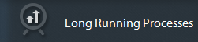
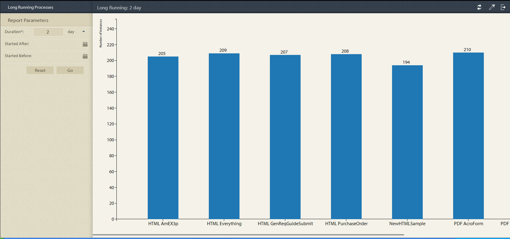

# Fördefinierade rapporter i processrapportering {#pre-defined-reports-in-process-reporting}

## Fördefinierade rapporter i processrapportering {#pre-defined-reports-in-process-reporting-1}

AEM Forms Process Reporting levereras med följande *färdiga* rapporter:

* **[Långa processer](#long-running-processes)**: En rapport över alla AEM Forms-processer som tog mer än en angiven tid att slutföra
* **[Process Duration Chart](#process-duration-report)**: En rapport över en specificerad AEM-formulärprocess efter varaktighet
* **[Arbetsflödesvolym](#workflow-volume-report)**: En rapport över pågående och slutförda instanser av angiven process per datum

## Långa processer {#long-running-processes}

Rapporten Långa processer visar de AEM Forms-processer som tagit mer än en angiven tid att slutföra.

### Så här kör du en rapport över en process som körs länge {#to-execute-a-long-running-process-report}

1. Om du vill visa listan med fördefinierade rapporter i Processrapportering klickar du på noden **Rapporter **i trädvyn **Processrapportering** .
1. Klicka på rapportnoden **Långa processer** .

   

   När du väljer en rapport visas panelen **Rapportparametrar** till höger om trädvyn.

   

   Parametrar:

   * **Varaktighet**(*obligatoriskt*): Ange varaktighet och tidsenhet. Visa alla AEM Forms-processer som har körts under längre tid än angivet.
   * **Startat efter** (*valfritt*): Välj ett datum. Filtrera rapporten så att processinstanser som har startats efter det angivna datumet visas.
   * **Startades före** (*valfritt*): Välj ett datum. Filtrera rapporten så att processinstanser som startats före det angivna datumet visas.

1. Klicka på **Gå** för att köra rapporten.

   Rapporten visas i panelen **Rapport **till höger i fönstret **Processrapportering** .

   

   Använd alternativen i det övre högra hörnet av panelen **Rapport **för att utföra följande åtgärder för rapporten.

   * **Uppdatera**: Uppdaterar rapporten med de senaste data som finns i lagringen
   * **Ändra förklaringsfärg**: Markera och ändra färgen på rapportförklaringen
   * **Exportera till CSV**: Exportera och hämta data från rapporten till en kommaavgränsad fil

## Processvaraktighet - rapport {#process-duration-report}

Processvaraktighetsrapporten visar antalet instanser av en formulärprocess i antal dagar som varje instans har körts.

### Så här kör du en rapport för processvaraktighet {#to-execute-a-process-duration-report}

1. Om du vill visa de fördefinierade rapporterna i Processrapportering klickar du på noden **Rapporter **i trädvyn **Processrapportering** .
1. Klicka på rapportnoden **Processvaraktighet** .

   

   När du väljer en rapport visas panelen **Rapportparametrar** till höger om trädvyn.

   

   Parametrar:

   * **Välj process **(*obligatoriskt*): Välj en AEM Forms-process.

1. Klicka på **Go **för att köra rapporten.

   Rapporten visas i panelen **Rapport **till höger i fönstret Processrapportering.

   

   Använd alternativen i det övre högra hörnet av panelen **Rapport **för att utföra följande åtgärder för rapporten.

   * **Uppdatera**: Uppdaterar rapporten med de senaste data som finns i lagringen
   * **Ändra förklaringsfärg**: Markera och ändra färgen på rapportförklaringen
   * **Exportera till CSV**: Exportera och hämta data från rapporten till en kommaavgränsad fil

## Rapport över arbetsflödesvolym {#workflow-volume-report}

Volymrapporten för arbetsflöde visar antalet instanser av en AEM-formulärprocess som körs och har slutförts per kalenderdag.

### Så här kör du en arbetsflödesvolymrapport {#to-execute-a-workflow-volume-report}

1. Om du vill visa de fördefinierade rapporterna i processrapportering går du till trädvyn **Processrapportering **och klickar på noden **Rapporter **.
1. Klicka på rapportnoden **Arbetsflödesvolym** .

   

   När du väljer en rapport visas panelen **Rapportparametrar** till höger om trädvyn.

   

   Parametrar:

   * **Välj process **(*obligatoriskt*): Välj en AEM Forms-process.

   * **Startat efter** (*valfritt*): Välj ett datum. Filtrerar rapporten så att processinstanser som startats efter det angivna datumet visas.

   * **Startades före** (*valfritt*): Välj ett datum. Filtrerar rapporten så att processinstanser som påbörjats före det angivna datumet visas.

1. Klicka på **Go **för att köra rapporten.

   Rapporten visas i panelen **Rapport **till höger i fönstret **Processrapportering** .

   

   Använd alternativen i det övre högra hörnet av panelen **Rapport **för att utföra följande åtgärder för rapporten.

   * **Uppdatera**: Uppdaterar rapporten med de senaste data som finns i lagringen
   * **Ändra förklaringsfärg**: Markera och ändra färgen på rapportförklaringen
   * **Exportera till CSV**: Exportera och hämta data från rapporten till en kommaavgränsad fil

[Kontakta supporten](https://www.adobe.com/account/sign-in.supportportal.html)
