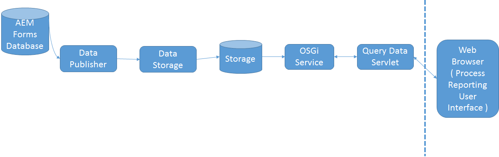

# Hur processrapportering fungerar{#how-process-reporting-works}

Processrapportering är rapporteringsmodulen för AEM Forms on JEE.

Med Process Reporting kan du köra rapporter om AEM Forms-processer och -uppgifter.

Processrapportering använder den inbäddade Process Reporting-databasen för att publicera formulärdata. Sedan används dessa data för att köra rapporter.

Processrapportering består av följande moduler:

* [ProcessDataPublisher-tjänst](#processdatapublisher-service-br-p)
* [Tjänsten ProcessDataStorage](#processdatastorageprovider-service-br-p)
* [OSGi-tjänst](#osgi-service-br-p)
* [Frågedataserver](#querydataservlet-service-br-p)
* [Användargränssnittet för processrapportering](#process-reporting-user-interface-br-p)

## Processrapporteringsarkitektur {#process-reporting-architecture-br}

## Processrapporteringsmoduler {#process-reporting-modules}

### ProcessDataPublisher-tjänst {#processdatapublisher-service-br}

ProcessDataPublisher-servern körs regelbundet i AEM Forms-databasen och extraherar de data som har ändrats sedan den senaste körningen av tjänsten. Sedan publiceras data till datalagringstjänsten för processdata.

Mer information om hur du konfigurerar tjänsten finns i [Konfigurera tjänsten](/help/forms/using/process-reporting/install-start-process-reporting.md#p-reportconfiguration-service-p)ProcessDataPublisher.

### Tjänsten ProcessDataStorageProvider {#processdatastorageprovider-service-br}

ProcessDataStorageProvider-tjänsten tar emot processdata från ProcessDataPublisher-tjänsten och sparar data i Process Reporting-databasen.

Mer information om hur du konfigurerar tjänsten finns i [Konfigurera tjänsten](/help/forms/using/process-reporting/install-start-process-reporting.md#p-to-configure-the-process-reporting-repository-locations-p)ProcessDataStorageProvider.

### OSGi-tjänst {#osgi-service-br}

QueryDataServlet använder den här tjänsten för att hämta rapportdata från Process Reporting-databasen.

### Tjänsten QueryDataServlet {#querydataservlet-service-br}

Tjänsten QueryDataServlet accepterar frågor från användargränssnittet för processrapportering.

Tjänsten använder sedan OSGi-tjänster för att hämta relevanta rapporteringsdata, bearbetar data och returnerar data till användargränssnittet.

### Användargränssnittet för processrapportering {#process-reporting-user-interface-br}

Användargränssnittet Process Reporting är ett webbläsarbaserat gränssnitt. Du använder det här gränssnittet för att visa process- och uppgiftsinformation som publiceras från AEM Forms-databasen.

En introduktion till användargränssnittet för processrapportering finns i [Användargränssnittet](/help/forms/using/process-reporting/introduction-process-reporting.md)för processrapportering.

### Tjänsten QueryDataServlet {#querydataservlet-service-br-1}

Tjänsten QueryDataServlet accepterar frågor från användargränssnittet för processrapportering.

Tjänsten använder sedan OSGi-tjänster för att hämta relevanta rapporteringsdata, bearbetar data och returnerar data till användargränssnittet.

### Anpassade rapporter {#custom-reports-br}

Du kan skapa egna anpassade rapporter och visa dessa rapporter på fliken Anpassade rapporter i användargränssnittet för processrapportering.

Anvisningar om hur du skapar en anpassad rapport finns i Skapa en anpassad rapport i artikeln [Anpassade rapporter i processrapportering](/help/forms/using/process-reporting/process-reporting-custom-reports.md).

[Kontakta supporten](https://www.adobe.com/account/sign-in.supportportal.html)
