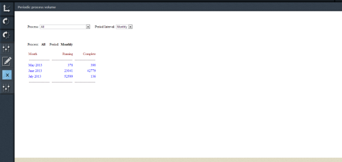

# Anpassade rapporter i processrapportering{#custom-reports-in-process-reporting}

Du kan använda REST-gränssnittet i QueryBuilder eller skapa en OSGi-tjänst med hjälp av QueryBuilder API för att skapa en anpassad rapport.

## Allmänna steg för att skapa en anpassad rapport {#generic-steps-to-build-a-custom-report}

Utför följande mallprocedur innan du lägger till en anpassad rapport:

1. Data som används i anpassade rapporter måste vara tillgängliga i processrapportering. För att säkerställa att data är tillgängliga schemalägger du ett cron-jobb eller använder **[alternativet Synkronisera](https://helpx.adobe.com/livecycle/help/process-reporting/install-start-process-reporting.html#Process%20Reporting%20Home%20screen)**i gränssnittet för processrapportering.
1. URL-begäran (som kapslar in den önskade frågan) måste returnera ett lämpligt frågeresultatobjekt. Om du vill skapa en fråga kan du använda REST-gränssnittet i [QueryBuilder](https://docs.adobe.com/docs/en/cq/current/dam/customizing_and_extendingcq5dam/query_builder.html) för att skapa en OSGi-tjänst med hjälp av QueryBuilder API. Du kan skapa dynamiska eller statiska frågor.

1. Skapa ett anpassat användargränssnitt för att visa resultaten. Du kan skapa ett fristående användargränssnitt eller integrera resultatet med befintliga processrapporteringsgränssnitt.

## Använda REST-gränssnittet i QueryBuilder {#using-the-rest-interface-of-the-querybuilder}

CRX QueryBuilder REST-gränssnittet exponerar funktionerna i Asset Share Query Builder via ett Java API och ett REST API. Läs om hur du använder [CRX QueryBuilder REST-gränssnittet](https://docs.adobe.com/docs/en/cq/current/dam/customizing_and_extendingcq5dam/query_builder.html)innan du utför följande steg:

1. Bläddra till URL:en `https://[server]:[port]/lc/bin/querybuilder.json`
1. Skapa en fråga baserat på lagringsnodens struktur och nodegenskaper i Process Reporting.

   Du kan ange valfria parametrar för att ange förskjutning, begränsning, träffar och egenskaper. Du kan hårdkoda argumenten för statiska rapporter och hämta parametrarna från gränssnittet för dynamiska rapporter.

   Så här hämtar du alla processnamn:

   `https://[Server]:[Port]/lc/bin/querybuilder.json?exact=false&p.hits=selective&p.properties=pmProcessTitle&path=%2fcontent%2freporting%2fpm&property=pmNodeType&property.operation=equals&property.value=ProcessType&type=sling%3aFolder`

   >[!NOTE]
   >
   >I varje fråga pekar parametern path på lagringsplatsen crx och tecknen escape-konverteras enligt URL-standarden.

## Skapa en tjänst med hjälp av Query Builder API {#creating-a-service-using-query-builder-api-nbsp}

Förutsättningen för att skapa en tjänst med hjälp av Query Builder API är [att skapa och distribuera CQ OSGI-paket](https://docs.adobe.com/docs/v5_2/html-resources/cq5_guide_developer/cq5_guide_developer.html) och [använda Query Builder API](https://docs.adobe.com/docs/en/cq/current/dam/customizing_and_extendingcq5dam/query_builder.html).

1. Skapa en OSGi-tjänst med lämpliga anteckningar. Så här kommer du åt QueryBuilder:

   ```
   @Reference(referenceInterface = QueryBuilder.class)
    private QueryBuilder queryBuilder;
   ```

1. Skapa en predikatgrupp. Kod för att skapa en predikatgrupp är:

   ```
   PredicateGroup predicateGroup = new PredicateGroup();
    predicateGroup.setAllRequired(true);
   ```

1. Lägg till predikat i den nyligen skapade prediateGroup. Ett par användbara predikatkonstruktioner är [JcrBoolPropertyPredicateEvaluator](https://docs.adobe.com/docs/en/cq/5-3/javadoc/com/day/cq/search/eval/JcrBoolPropertyPredicateEvaluator.html), [JcrPropertyPredicateEvaluator](https://docs.adobe.com/docs/en/cq/5-3/javadoc/com/day/cq/search/eval/JcrPropertyPredicateEvaluator.html), [RangePropertyPredicateEvaluator](https://docs.adobe.com/docs/en/cq/5-3/javadoc/com/day/cq/search/eval/RangePropertyPredicateEvaluator.html), [DateRangePredicateEvaluator](https://docs.adobe.com/docs/en/cq/5-3/javadoc/com/day/cq/search/eval/RelativeDateRangePredicateEvaluator.html)och [TypePredicateEvaluator](https://docs.adobe.com/docs/en/cq/5-3/javadoc/com/day/cq/search/eval/TypePredicateEvaluator.html).

   För statiska rapporter kan predikaten kodas, medan predikaten hämtas från begäran för dynamiska rapporter.

   Exempelkod för att hämta alla instanser av en process är:

   ```java
   Predicate predicate;
   
     //Add the path Constraint
     predicate = new Predicate(PathPredicateEvaluator.PATH);
     predicate.set(PathPredicateEvaluator.PATH, "/content/reporting/pm"); // should point to the crx path being used to store data
     predicate.set(PathPredicateEvaluator.EXACT, "false");
     predicateGroup.add(predicate);
   
     //type nt:unstructured
     predicate = new Predicate(TypePredicateEvaluator.TYPE);
     predicate.set(TypePredicateEvaluator.TYPE, "nt:unstructured");
     predicateGroup.add(predicate);
   
     //NodeType: Process Instance
     predicate = new Predicate(JcrPropertyPredicateEvaluator.PROPERTY);
     predicate.set(JcrPropertyPredicateEvaluator.PROPERTY, "pmNodeType");
     predicate.set(JcrPropertyPredicateEvaluator.OPERATION, JcrPropertyPredicateEvaluator.OP_EQUALS);
     predicate.set(JcrPropertyPredicateEvaluator.VALUE, "ProcessInstance");
     predicateGroup.add(predicate);
   
     //processName
     predicate = new Predicate(JcrPropertyPredicateEvaluator.PROPERTY);
     predicate.set(JcrPropertyPredicateEvaluator.PROPERTY, "pmProcessName");
     predicate.set(JcrPropertyPredicateEvaluator.OPERATION, JcrPropertyPredicateEvaluator.OP_EQUALS);
     predicate.set(JcrPropertyPredicateEvaluator.VALUE, processName); //processName variable stores the name of the process whose instances need to be searched
     predicateGroup.add(predicate);
   ```

1. Definiera frågan med hjälp av prediateGroup.

   `Query query = queryBuilder.createQuery(predicateGroup, session);`

1. Hämta resultatet av frågan.

   ```java
   query.setStart(offset); // hardcode or fetch from request
           if(hits == -1)         // hardcode or fetch from request
               hits = 0;
           query.setHitsPerPage(hits);
           SearchResult searchResult = query.getResult();
   ```

1. Iterera resultatet och omforma resultatet till önskat format. Kod för att skicka resultat i CSV-format är:

   ```java
   Iterator<Node> iter = searchResult.getNodes();
                   while(iter.hasNext()) {
                       Node node = iter.next();
                       row = new StringBuilder();
                       for (String property : includeProperties) { // the properties of the node which needs to be returned, or one can return all the properties too.
                           try {
                               row.append(node.getProperties(property).nextProperty().getString() + COMMA_SEPARATOR);
                           } catch (NoSuchElementException e) {
                               //Adding separator for no value
                               row.append(COMMA_SEPARATOR);
                           } catch (RepositoryException e) {
                               e.printStackTrace();
                           }
                       }
                       row.deleteCharAt(row.lastIndexOf(COMMA_SEPARATOR));
                       row.append(NEW_LINE);
                       out.write(row.toString().getBytes());
   ```

1. Använd `org.apache.felix maven-bundle-plugin` för att skapa ett OSGi-paket för serverleten.

1. Distribuera paketet på CRX-servern.

### Exempel på tjänst {#service-example}

I följande serviceexempel räknas instanser av en process som är i **tillståndet** RUNNING och **COMPLETE** vid slutet av varje månad, kvartal och år.

```java
package custom.reporting.service;

import java.text.DateFormatSymbols;
import java.util.Calendar;
import java.util.HashMap;
import java.util.Iterator;
import java.util.LinkedHashMap;
import java.util.Map;
import java.util.SortedSet;
import java.util.TreeSet;

import javax.jcr.Node;
import javax.jcr.Session;

import org.apache.felix.scr.annotations.Component;
import org.apache.felix.scr.annotations.Reference;
import org.apache.felix.scr.annotations.Service;

import com.day.cq.search.Predicate;
import com.day.cq.search.PredicateGroup;
import com.day.cq.search.Query;
import com.day.cq.search.QueryBuilder;
import com.day.cq.search.eval.JcrPropertyPredicateEvaluator;
import com.day.cq.search.eval.PathPredicateEvaluator;
import com.day.cq.search.eval.TypePredicateEvaluator;
import com.day.cq.search.result.SearchResult;

@Component(metatype = true, immediate = true, label = "PeriodicProcessVolume", description = "Service for supporting cutom reports pluggable to Process Reporting.")
@Service(value = PeriodicProcessVolume.class)
public class PeriodicProcessVolume {

    private static String[] monthNameList = new DateFormatSymbols().getMonths();
    private static String[] quaterNameList = { "I", "II", "III", "IV" };

    private final Map<Integer, Map<Integer, Long[]>> monthly = new HashMap<Integer, Map<Integer, Long[]>>();
    private final Map<Integer, Map<Integer, Long[]>> quaterly = new HashMap<Integer, Map<Integer, Long[]>>();
    private final Map<Integer, Long[]> yearly = new HashMap<Integer, Long[]>();

    @Reference(referenceInterface = QueryBuilder.class)
    private QueryBuilder queryBuilder;

    private void addConstraints(PredicateGroup predicateGroup, String processName) {
        Predicate predicate;

        //Add the path Constraint
        predicate = new Predicate(PathPredicateEvaluator.PATH);
        predicate.set(PathPredicateEvaluator.PATH, "/content/reporting/pm");
        predicate.set(PathPredicateEvaluator.EXACT, "false");
        predicateGroup.add(predicate);

        //type nt:unstructured
        predicate = new Predicate(TypePredicateEvaluator.TYPE);
        predicate.set(TypePredicateEvaluator.TYPE, "nt:unstructured");
        predicateGroup.add(predicate);

        //NodeType: Process Instance
        predicate = new Predicate(JcrPropertyPredicateEvaluator.PROPERTY);
        predicate.set(JcrPropertyPredicateEvaluator.PROPERTY, "pmNodeType");
        predicate.set(JcrPropertyPredicateEvaluator.OPERATION, JcrPropertyPredicateEvaluator.OP_EQUALS);
        predicate.set(JcrPropertyPredicateEvaluator.VALUE, "ProcessInstance");
        predicateGroup.add(predicate);

        //processName
        if (processName != null) {
            predicate = new Predicate(JcrPropertyPredicateEvaluator.PROPERTY);
            predicate.set(JcrPropertyPredicateEvaluator.PROPERTY, "pmProcessName");
            predicate.set(JcrPropertyPredicateEvaluator.OPERATION, JcrPropertyPredicateEvaluator.OP_EQUALS);
            predicate.set(JcrPropertyPredicateEvaluator.VALUE, processName);
            predicateGroup.add(predicate);
        }
    }

    private Long[] setFrequency(Long[] frequency, int index) {
        if (frequency == null) {
            frequency = new Long[2];
            frequency[0] = 0L;
            frequency[1] = 0L;
        }
        frequency[index] = frequency[index] + 1L;
        return frequency;
    }

    public void populateValues(Session session, String processName) {
        PredicateGroup predicateGroup = new PredicateGroup();
        predicateGroup.setAllRequired(true);
        try {
            addConstraints(predicateGroup, processName);

            long batchSize = 10000L;
            long start = 0l;

            while (true) {
                Query query = queryBuilder.createQuery(predicateGroup, session);
                query.setStart(start);
                query.setHitsPerPage(batchSize);
                SearchResult searchResult = query.getResult();
                Iterator<Node> itr = searchResult.getNodes();
                long length = 0;
                while (itr.hasNext()) {
                    length++;
                    Node n = itr.next();
                    Calendar calender = n.getProperty("pmCreateTime").getDate();
                    String status = n.getProperty("pmStatus").getString();
                    int index = 0;
                    if ("COMPLETE".equals(status)) {
                        index = 1;
                    } else if ("RUNNING".equals(status)) {
                        index = 0;
                    } else {
                        continue;
                    }
                    int month = calender.get(Calendar.MONTH);
                    int year = calender.get(Calendar.YEAR);
                    int quater;
                    if (month < 3) {
                        quater = 1;
                    } else if (month < 6) {
                        quater = 2;
                    } else if (month < 9) {
                        quater = 3;
                    } else {
                        quater = 4;
                    }

                    Long frequency[];
                    Map<Integer, Long[]> yearMonthMap = this.monthly.get(year);
                    if (yearMonthMap == null) {
                        yearMonthMap = new HashMap<Integer, Long[]>();
                    }
                    frequency = yearMonthMap.get(month);
                    frequency = setFrequency(frequency, index);
                    yearMonthMap.put(month, frequency);
                    this.monthly.put(year, yearMonthMap);

                    Map<Integer, Long[]> yearQuaterMap = this.quaterly.get(year);
                    if (yearQuaterMap == null) {
                        yearQuaterMap = new HashMap<Integer, Long[]>();
                    }
                    frequency = yearQuaterMap.get(quater);
                    frequency = setFrequency(frequency, index);
                    yearQuaterMap.put(quater, frequency);
                    this.quaterly.put(year, yearQuaterMap);

                    frequency = this.yearly.get(year);
                    frequency = setFrequency(frequency, index);
                    this.yearly.put(year, frequency);
                }

                if (length < batchSize) {
                    break;
                } else {
                    start = start + batchSize;
                }
            }
        } catch (Exception e) {
            e.printStackTrace();
        }

    }

    public Map<String, Long[]> getMonthly() {
        Map<String, Long[]> result = new LinkedHashMap<String, Long[]>();
        SortedSet<Integer> years = new TreeSet<Integer>(monthly.keySet());
        for (Integer year : years) {
            Map<Integer, Long[]> yearMonthMap = monthly.get(year);
            SortedSet<Integer> months = new TreeSet<Integer>(yearMonthMap.keySet());
            for (Integer month : months) {
                String str = monthNameList[month] + " " + year;
                result.put(str, yearMonthMap.get(month));
            }
        }
        return result;
    }

    public Map<String, Long[]> getQuaterly() {
        Map<String, Long[]> result = new LinkedHashMap<String, Long[]>();
        SortedSet<Integer> years = new TreeSet<Integer>(quaterly.keySet());
        for (Integer year : years) {
            Map<Integer, Long[]> quaterMonthMap = quaterly.get(year);
            SortedSet<Integer> quaters = new TreeSet<Integer>(quaterMonthMap.keySet());
            for (Integer quater : quaters) {
                String str = quaterNameList[quater - 1] + " " + year;
                result.put(str, quaterMonthMap.get(quater));
            }
        }
        return result;
    }

    public Map<Integer, Long[]> getYearly() {
        return yearly;
    }

}
```

Exempelfilen `pom.xml`som ska skapas ovanför tjänsten är:

```java
<project xmlns="https://maven.apache.org/POM/4.0.0" xmlns:xsi="https://www.w3.org/2001/XMLSchema-instance" xsi:schemaLocation="https://maven.apache.org/POM/4.0.0 https://maven.apache.org/maven-v4_0_0.xsd">
    <modelVersion>4.0.0</modelVersion>

    <!-- ====================================================================== -->
    <!-- P R O J E C T  D E S C R I P T I O N                                   -->
    <!-- ====================================================================== -->
    <groupId>com.custom</groupId>
    <artifactId>sample-report-core</artifactId>
    <packaging>bundle</packaging>
    <name>PR Sample Report</name>
    <description>Bundle providing support for a custom report pluggable to process reporting.</description>
    <version>1</version>

    <!-- ====================================================================== -->
    <!-- B U I L D   D E F I N I T I O N                                        -->
    <!-- ====================================================================== -->
    <build>
        <plugins>
          <plugin>
              <groupId>org.apache.felix</groupId>
              <artifactId>maven-bundle-plugin</artifactId>
              <version>2.3.7</version>
              <extensions>true</extensions>
              <configuration>
                    <instructions>
                        <Bundle-Category>sample-report</Bundle-Category>
                        <Export-Package>
                            custom.reporting.service.*;
                        </Export-Package>
                     </instructions>
              </configuration>
          </plugin>
          <plugin>
                <groupId>org.apache.felix</groupId>
                <artifactId>maven-scr-plugin</artifactId>
                <version>1.11.0</version>
                <executions>
                    <execution>
                        <id>generate-scr-scrdescriptor</id>
                        <goals>
                            <goal>scr</goal>
                        </goals>
                        <configuration>
                            <!-- Private service properties for all services. -->
                            <properties>
                                <service.vendor>Sample Report</service.vendor>
                            </properties>
                        </configuration>
                    </execution>
                </executions>
            </plugin>
        </plugins>
    </build>

    <!-- ====================================================================== -->
    <!-- D E P E N D E N C I E S                                                -->
    <!-- ====================================================================== -->
    <dependencies>
        <dependency>
          <groupId>com.day.cq</groupId>
          <artifactId>cq-search</artifactId>
          <version>5.6.4</version>
        </dependency>

        <dependency>
          <groupId>javax.jcr</groupId>
          <artifactId>jcr</artifactId>
          <version>2.0</version>
        </dependency>

        <dependency>
          <groupId>org.apache.felix</groupId>
          <artifactId>org.apache.felix.scr.annotations</artifactId>
          <version>1.9.0</version>
        </dependency>
    </dependencies>
</project>
```

## Skapa ett separat gränssnitt {#creating-a-separate-ui-nbsp}

Förutsättningen för att skapa ett separat användargränssnitt för att visa resultat är [Sling Basics](https://docs.adobe.com/docs/en/cq/5-6-1/developing/the_basics.html), [Creating a CRX Node](https://docs.adobe.com/docs/en/crx/current/developing/development_tools/developing_with_crxde_lite.html#Creating%20a%20Node) och som ger rätt [åtkomstbehörighet](https://docs.adobe.com/docs/en/crx/current/developing/development_tools/developing_with_crxde_lite.html#Access%20Control).

1. Skapa en CRX-nod på `/apps` noden och ge lämplig behörighet. (PERM_PROCESS_REPORTING_USER)
1. Definiera renderaren vid `/content` noden.
1. Lägg till JSP- eller HTML-filer i noden som skapades i steg 1. Du kan också lägga till CSS-filer.

   

   En exempelnod med JSP- och CSS-filer

1. Lägg till javascript-kod för att starta ett Ajax-anrop till querybuilder REST API eller till tjänsten. Lägg också till lämpliga argument.

1. Lägg till en lämplig hanterare i Ajax-anropet för att tolka och visa resultatet. Du kan analysera resultatet i flera format (json/csv/user defined) och visa det i en tabell eller i andra former.

1. (Valfritt) Lägg till en lämplig felhanterare i Ajax-anropet.

Ett exempel på JSP-kod som använder både OSGi Service och QueryBuilder API är:

```
<%@taglib prefix="sling" uri="https://sling.apache.org/taglibs/sling/1.0"%>
<%request.setAttribute("silentAuthor", new Boolean(true));%>
<%@include file="/libs/foundation/global.jsp"%>
<%@ page import="java.util.Map,
java.util.Set,
com.adobe.idp.dsc.registry.service.ServiceRegistry,
javax.jcr.Session,
org.apache.sling.api.resource.ResourceResolver,
custom.reporting.service.PeriodicProcessVolume"%>
<%
response.setContentType("text/html");
response.setCharacterEncoding("utf-8");
%><!DOCTYPE HTML>
<html>
    <head>
        <meta charset="UTF-8">

        <link rel="stylesheet" href="/lc/apps/sample-report-process-reporting/custom-reports/periodicProcessVolume/style.css">
        <title>REPORT Monthly / Qaterly / Yearly</title>
        <script type="text/javascript">

            <%
                slingResponse.setCharacterEncoding("utf-8");
                ResourceResolver resolver = slingRequest.getResourceResolver();
                String processName = slingRequest.getParameter("processName");
                Session session = resolver.adaptTo(Session.class);
                custom.reporting.service.PeriodicProcessVolume periodicProcessVolume = sling.getService(custom.reporting.service.PeriodicProcessVolume.class);
                periodicProcessVolume.populateValues(session, processName);
                if (processName == null) {
                    processName = "All";
                }
            %>
            var lineSeprator = "<td class='seprator'>----------------</td>";
            var tableEnder = "<tr>" + lineSeprator + lineSeprator + lineSeprator + "</tr>";

            var tableColHeader = "<td class='colHead colNum'>Running</td>";
            tableColHeader += "<td class='colHead  colNum'>Complete</td></tr>";
            tableColHeader += tableEnder;

            var monthly = "<table><tr><td class='colHead colStr'>Month</td>";
            monthly += tableColHeader;

            <%
                Map<String, Long[]> monthlyMap = periodicProcessVolume.getMonthly();
                Set<String> monthKeys = monthlyMap.keySet();
                for (String key: monthKeys) {
                    Long[] frequencies = monthlyMap.get(key);
            %>

            monthly += "<tr><td class='colStr'> <%= key %> </td>";
            monthly += "<td class='colNum'> <%= frequencies[0] %> </td>";
            monthly += "<td class='colNum'> <%= frequencies[1] %> </td></tr>";
            <%
                }
            %>

            monthly += tableEnder;

            var quaterly = "<table><tr><td class='colHead colStr'>Quater</td>";
            quaterly += tableColHeader;

            <%
                Map<String, Long[]> quaterMap = periodicProcessVolume.getQuaterly();
                Set<String> quaterKeys = quaterMap.keySet();
                for (String key: quaterKeys) {
                    Long[] frequencies = quaterMap.get(key);
            %>

            quaterly += "<tr><td class='colStr'> <%= key %> </td>";
            quaterly += "<td class='colNum'> <%= frequencies[0] %> </td>";
            quaterly += "<td class='colNum'> <%= frequencies[1] %> </td></tr>";
            <%
                }
            %>

            quaterly += tableEnder;

            var yearly = "<table><tr><td class='colHead colStr'>Year</td>";
            yearly += tableColHeader;

            <%
                Map<Integer, Long[]> yearMap = periodicProcessVolume.getYearly();
                Set<Integer> yearKeys = yearMap.keySet();
                for (Integer key: yearKeys) {
                    Long[] frequencies = yearMap.get(key);
            %>

            yearly += "<tr><td class='colStr'> <%= key %> </td>";
            yearly += "<td class='colNum'> <%= frequencies[0] %> </td>";
            yearly += "<td class='colNum'> <%= frequencies[1] %> </td></tr>";
            <%
                }
            %>

            yearly += tableEnder;

            function reloadFrame(value) {
                if (value === '-1') {
                    window.location = "/lc/content/process-reporting-runtime/custom-reports/periodicProcessVolume.html";
                } else {
                    window.location = "/lc/content/process-reporting-runtime/custom-reports/periodicProcessVolume.html?processName=" + value;
                }
            }

            function populateTable(selection) {
                if (selection === 0) {
                    document.getElementById('tableHeading').innerHTML = 'Monthly';
                    document.getElementById('volumeTable').innerHTML = monthly;
                } else if (selection === 1) {
                    document.getElementById('tableHeading').innerHTML = 'Quaterly';
                    document.getElementById('volumeTable').innerHTML = quaterly;
                } else {
                    document.getElementById('tableHeading').innerHTML = 'Yearly';
                    document.getElementById('volumeTable').innerHTML = yearly;
                }
            }

            function fetchProcesses() {
                var xmlhttp = new XMLHttpRequest(),
                    request = '';
                xmlhttp.onreadystatechange = function() {
                   if (xmlhttp.readyState === 4 && xmlhttp.status === 200) {
                       var responseText,
                           response,
                           items,
                           hits = [],
                           responseSize = 0,
                           processName,
                           selectedIndex = 0,
                           comboBox;
                       responseText = xmlhttp.responseText;
                       if (responseText !== undefined && responseText !== null) {
                           response = JSON.parse(responseText);
                           responseSize = response.results;
                           hits = response.hits;
                       }

                       items = "<option value='-1'>All</option>";

                       for(var i = 0; i < responseSize; i++) {
                           processName = hits[i].pmProcessTitle;
                           if (processName === '<%= processName %>') {
                               selectedIndex = i + 1;
                           }
                           items += "<option value='" + processName + "'>" + processName + "</option>"
                       }

                       comboBox = document.getElementById('processSelection');
                       comboBox.innerHTML = items;
                       comboBox.selectedIndex = selectedIndex;
                   }
               };
               request = "/lc/bin/querybuilder.json?";
               request += "exact=false&";
               request += "p.hits=selective&";
               request += "p.properties=pmProcessTitle&";
               request += "path=%2fcontent%2freporting%2fpm&";
               request += "property=pmNodeType&";
               request += "property.operation=equals&";
               request += "property.value=ProcessType&";
               request += "type=sling%3aFolder";

               xmlhttp.open("POST", request, true);
               xmlhttp.setRequestHeader("Content-type","application/json");
               xmlhttp.send();
            }

        </script>
    </head>
    <body onLoad="fetchProcesses();populateTable(0);">
        Process:
        <select id="processSelection" onchange="reloadFrame(this.value);"></select>
        &nbsp &nbsp Period Interval:
        <select name="periodSelection" onchange="populateTable(this.selectedIndex);">
            <option value="1">Monthly</option>
            <option value="2">Quaterly</option>
            <option value="3">Yearly</option>
        </select>
        <br> <br> <br> <br>
        <div class="inline"> Process: &nbsp <b><%= processName %></b> &nbsp &nbsp Period: &nbsp </div> <b> <div id="tableHeading" class="inline"> </div> </b>
        <br><br>
        <div id="volumeTable"> </div>

    </body>
</html>
```

## Integrera rapportgränssnitt i befintligt processrapporteringsgränssnitt {#integrating-report-ui-in-existing-process-reporting-ui-nbsp}

Förutsättningen för att skapa ett separat användargränssnitt för att visa resultat är [Sling Basics](https://wem.help.adobe.com/enterprise/en_US/10-0/wem/developing/the_basics.html), [Creating a CRX Node](https://docs.adobe.com/docs/en/crx/current/developing/development_tools/developing_with_crxde_lite.html#Creating%20a%20Node) och som ger rätt [åtkomstbehörighet](https://docs.adobe.com/docs/en/crx/current/developing/development_tools/developing_with_crxde_lite.html#Access%20Control).

1. Skapa ett separat användargränssnitt.
1. Skapa en underordnad `nt:unstructured` nod vid `/content/process-reporting-runtime/custom-reports` noden för varje rapport som kan kopplas in.

   * **id**- Anger rapportens unika ID-nummer.
   * **name**- Anger rapportens namn. Namnet visas i användargränssnittet.
   * **link**- Anger relativ länk till renderaren för det separata användargränssnittet. Länken skapas i steg 1.
   * **description**- Anger rapportens enradsbeskrivning. Du kan lämna beskrivningsfältet tomt.
   * **icon**- Anger bilden som ska representera rapporten i bilder. Du kan lämna ikonfältet tomt.
   

   Egenskaper för nod

1. Rapportens användargränssnitt är integrerat med processrapportens användargränssnitt. När du har integrerat användargränssnittet ser det uppdaterade användargränssnittet ut ungefär som i följande bilder:

   

   Användargränssnitt för nytillagda anpassade rapporter

   

   Resultatskärmen för anpassade rapporter

## Exempelpaket {#sample-package}

Importera paketet för att integrera anpassade rapporter och användargränssnitt som beskrivs i artikeln till användargränssnittet för processhantering. `sample-report-pkg-1.zip`

[Få](assets/sample-report-pkg-1.zip)kontakt med[filsupporten](https://www.adobe.com/account/sign-in.supportportal.html)
