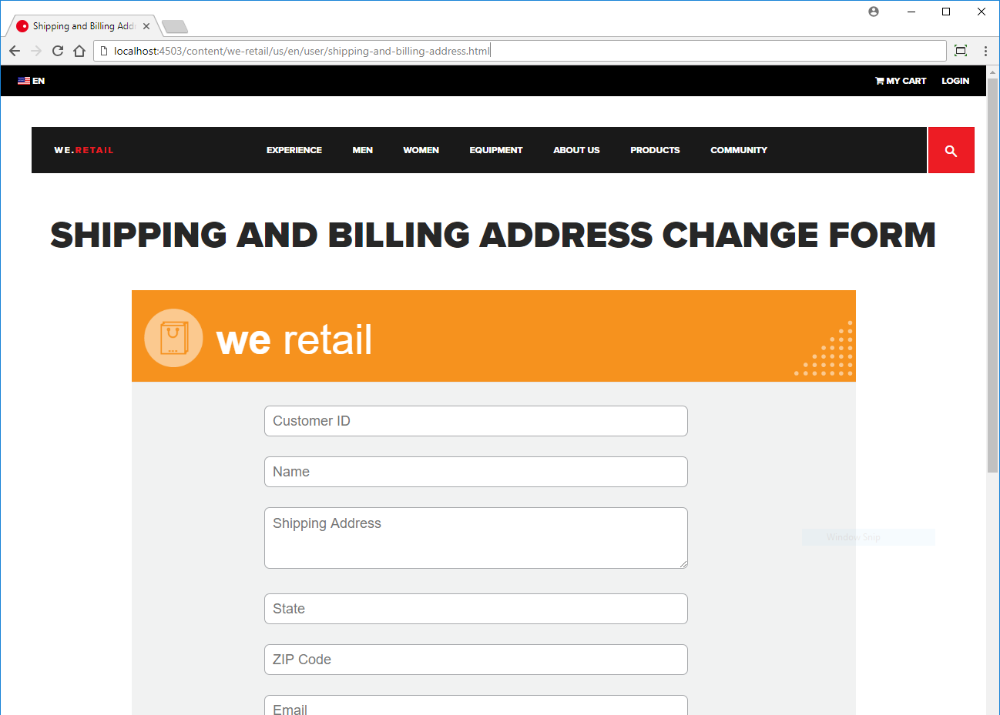

# Självstudiekurs: Publicera ditt adaptiva formulär {#tutorial-publish-your-adaptive-form}

Den här självstudiekursen är ett steg i serien [Create Your First Adaptive Form](https://helpx.adobe.com/experience-manager/6-3/forms/using/create-your-first-adaptive-form.html) . Vi rekommenderar att du följer serien i kronologisk ordning för att förstå, utföra och demonstrera det fullständiga exemplet på självstudiekurser.

När det adaptiva formuläret är klart kan du publicera det för att göra det tillgängligt för slutanvändarna. Slutanvändarna kan öppna det publicerade formuläret på vilken enhet och webbläsare som helst. När ett anpassat formulär publiceras kopieras formuläret och det tillhörande innehållet från en AEM författarinstans till en AEM publiceringsinstans. Formuläret görs tillgängligt för slutanvändaren via publiceringsinstansen.

Du kan publicera ett anpassat formulär på följande sätt:

* [Publicera det adaptiva formuläret som en AEM sida](../../forms/using/publish-your-adaptive-form.md#publish-the-adaptive-form-as-an-aem-page)
* [Bädda in det anpassningsbara formuläret på en AEM Sites-sida](#embed-the-adaptive-form-in-an-aem-sites-page)
* [Bädda in det adaptiva formuläret på en extern webbsida (en icke-AEM webbsida som finns på andra AEM)](../../forms/using/publish-your-adaptive-form.md)

## Innan du startar {#before-you-start}

* **[Konfigurera en publiceringsinstans](https://helpx.adobe.com/experience-manager/6-3/forms/using/installing-configuring-aem-forms-osgi.html)** för AEM Forms: Publiceringsinstansen är en offentlig instans av AEM som [!DNL Forms] körs i publiceringsläge. I en produktionsmiljö ligger publiceringsinstansen utanför organisationens brandvägg.
* **[Konfigurera replikering och omvänd replikering](https://helpx.adobe.com/experience-manager/6-3/help/sites-deploying/replication.html)**: Vid replikering kopieras innehåll från författarinstansen till en publiceringsinstans och användarindata returneras (till exempel formulärindata) från publiceringsinstansen till författarinstansen.

## Publicera det adaptiva formuläret som en AEM sida {#publish-the-adaptive-form-as-an-aem-page}

När det adaptiva formuläret publiceras som en AEM sida innehåller hela webbsidan bara det publicerade formuläret. Du kan använda URL:en för det adaptiva formuläret för att länka det från en annan webbsida. Så här publicerar du det adaptiva formuläret **shipping-address-add-update-form** som en AEM sida:

1. Logga in AEM författarinstansen och leta formuläret shipping-address-add-update-form adaptive i AEM [!DNL Forms] [!DNL Forms] UI.
   `https://localhost:4502/aem/forms.html/content/dam/formsanddocuments`
1. Välj adaptiv blankett för leverans-address-add-update-form och tryck på **[!UICONTROL Publish]**. En dialogruta med resurser som är kopplade till det adaptiva formuläret visas. Tryck på **[!UICONTROL Publish]**. Det anpassningsbara formuläret publiceras och en dialogruta visas.
1. Öppna formuläret i publiceringsinstansen. Formuläret kan fyllas i och skickas av användaren.
   `https://localhost:4503/content/forms/af/shipping-address-add-update-form.html`

## Bädda in det anpassningsbara formuläret på en AEM Sites-sida {#embed-the-adaptive-form-in-an-aem-sites-page}

AEM [!DNL Forms] gör det möjligt för formulärutvecklare att sömlöst bädda in anpassningsbara formulär på en AEM [!DNL Sites] sida. Det inbäddade adaptiva formuläret fungerar fullt ut och användarna kan fylla i och skicka formuläret utan att behöva lämna sidan. Det hjälper användaren att stanna kvar i sitt sammanhang för andra element på webbsidan och interagera samtidigt med formuläret.

AEM [!DNL Forms] tillhandahåller en komponent, AEM [!DNL Forms] Container, för att bädda in ett adaptivt formulär på en AEM [!DNL Sites] sida. Komponenten är som standard inte synlig i AEM [!DNL Sites] behållare. Följ de här stegen för att aktivera AEM [!DNL Forms] behållarkomponenten och bädda in det adaptiva formuläret på en AEM [!DNL Sites] sida:

1. Skapa och öppna en sida på webbplatsen We.Retail för redigering. Till exempel [https://localhost:4502/editor.html/content/we-retail/us/en/user/shipping-and-billing-address.html](https://localhost:4502/editor.html/content/we-retail/us/en/user/shipping-and-billing-address.html). Det anpassningsbara formuläret är inbäddat på [!DNL Sites] sidan.

   Du kan även bädda in det adaptiva formuläret på en befintlig webbsida. [!DNL Site's] . Exempel: sidan ABOUT US [https://localhost:4502/editor.html/content/we-retail/us/en/about-us.html](https://localhost:4502/editor.html/content/we-retail/us/en/about-us.html). Du sparar tid när du skapar en sida. Stegen nedan använder den nya sidan.

   Webbplatsen We.Retail levereras med AEM. Om du inte har installerat webbplatsen We.Retail går du till [We.Retail Reference Implementation](https://helpx.adobe.com/experience-manager/6-3/help/sites-developing/we-retail.html) för att installera webbplatsen.

1. Tryck på  sidinformation och välj **[!UICONTROL Edit Template]** alternativet på den nyligen skapade webbsidan We.Retail. Sidmallen öppnas på en ny flik i webbläsaren.
1. Tryck inuti **[!UICONTROL layout container]** kartongen och tryck på . Expandera **[!UICONTROL Allowed Components]** dragspelet på **[!UICONTROL General]** fliken, markera **[!UICONTROL AEM Form]** alternativet och tryck på . AEM [!DNL Forms] behållarkomponent är aktiverad för sidan.

1. Öppna webbläsarfliken som innehåller AEM [!DNL Sites] sida som öppnats i steg 1. Tryck på **[!UICONTROL Drag components here]** rutan och tryck **+.** Tryck i **[!UICONTROL Insert New Component]** lådan **[!UICONTROL AEM Form]**. Komponenten läggs till **[!UICONTROL AEM Forms Container]** på sidan.
1. Tryck på **[!UICONTROL AEM Forms container]** komponenten och tryck på . En dialogruta med egenskaper för AEM [!DNL Forms] behållare visas. I **[!UICONTROL Asset Path]** fältet bläddrar du till och väljer formuläret shipping-address-add-update-form adaptive. Tryck på . Det anpassningsbara formuläret är inbäddat på sidan.
1. Publicera både det adaptiva formuläret och [!DNL Sites] sidan. Här är några saker du bör hålla i minnet:

   * Om du publicerar AEM [!DNL Sites] sida för första gången och den innehåller ett inbäddat formulär publicerar du [!DNL Sites] sidan och det inbäddade formuläret.
   * Om du bara ändrar det inbäddade formuläret på en publicerad webbplatssida publicerar du det ursprungliga formuläret och ändringarna återspeglas på den publicerade webbplatssidan. Den publicerade webbplatssidan innehåller en referens till formuläret och behöver inte publicera om sidan.
   * Om du ändrar [!DNL Sites] sidan och det inbäddade formuläret publicerar du om [!DNL Sites] sidan och formuläret.

      
   Formuläret för ändring av leverans- och faktureringsadress har lagts till på en AEM [!DNL Sites] sida.

## Bädda in det anpassningsbara formuläret på en extern webbsida {#embed-the-adaptive-form-in-an-external-webpage}

Du kan bädda in ett adaptivt formulär på en extern webbsida (en icke-AEM webbsida som är värd utanför AEM) genom att infoga några rader med JavaScript på den externa webbsidan. JavaScript-koden skickar en HTTP-begäran till AEM [!DNL Forms] server för det adaptiva formuläret och relaterade resurser och lägger till det adaptiva formuläret på webbsidan. Mer information finns i [Bädda in det adaptiva formuläret på en extern webbsida](/help/forms/using/embed-adaptive-form-external-web-page.md).
