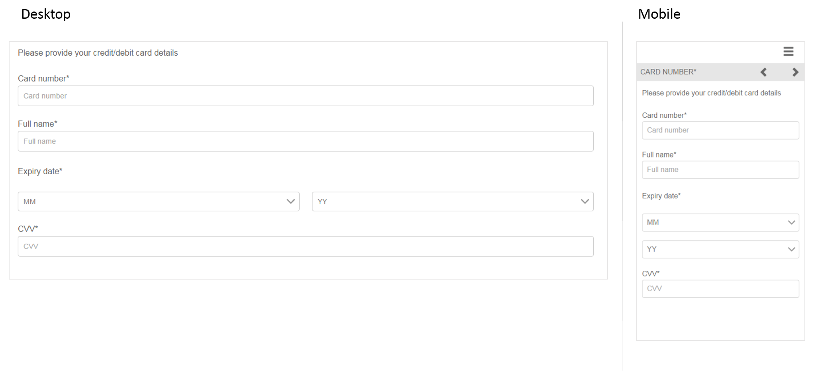
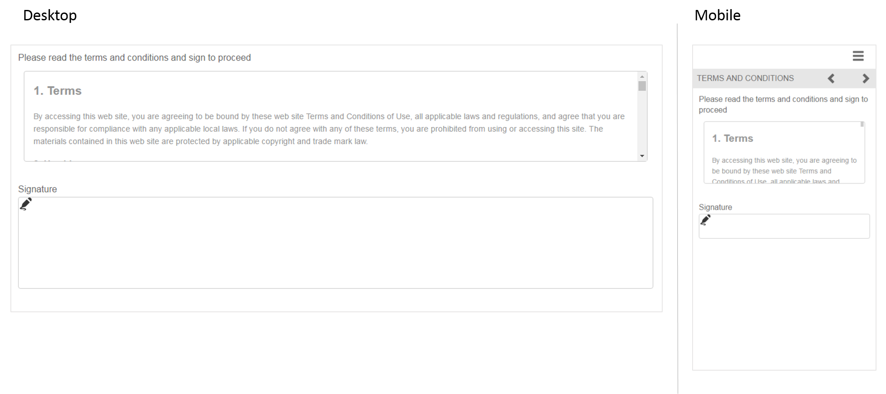

# Referera till adaptiva formulärfragment{#reference-adaptive-form-fragments}

[Anpassat formulärfragment](../../forms/using/adaptive-form-fragments.md) är en grupp fält eller en panel som innehåller en grupp fält som du kan använda när du skapar ett formulär. Du kan skapa ett formulär snabbt och enkelt. Du kan dra och släppa ett anpassat formulärfragment i ett formulär med hjälp av resursläsaren i sidofältet, och du kan redigera det i formulärredigeraren.

För formulärförfattare med adaptiv formatering finns referensfragment i AEM Forms-paketet [AEM-FORMS-6.3-REFERENCE-FRAGMENTS](https://www.adobeaemcloud.com/content/marketplace/marketplaceProxy.html?packagePath=/content/companies/public/adobe/packages/cq630/fd/AEM-FORMS-6.3-REFERENCE-FRAGMENTS). Den innehåller följande fragment:

* Adress
* Kontaktinformation
* Kreditkortsinformation
* Aktuell anställning
* Information om beroende
* Anställningshistorik
* Inkomster och utgifter
* Namn
* Villkor
* Villkor med Klottra

När du installerar paketet skapas en referensfragmentmapp med referensfragment under Formulär och dokument. Information om hur du installerar ett paket finns i [Arbeta med paket](/help/sites-administering/package-manager.md).

## Adress {#address}

Inkluderar fält som anger postadress. De tillgängliga fälten är gatuadress, postnummer, ort, stat och land. Den innehåller även en förkonfigurerad webbtjänst som fyller i ort och delstat för ett visst amerikanskt postnummer.

<!--[Click to enlarge

](assets/address-1.png)-->

## Kontaktinformation {#contact-information}

Inkluderar fält för att hämta telefonnummer och e-postadress.

<!--[Click to enlarge

](assets/contact-info-1.png)-->

## Kreditkortsinformation {#credit-card-information}

Inkluderar fält för att samla in kreditkortsinformation som kan användas för att bearbeta betalningar.
[ Fragment för ](assets/cc-info-1.png)

## Aktuell anställning {#current-employment}

Innehåller fält för att samla in aktuella anställningsdetaljer som anställningsstatus, anställningsområde, beteckning, organisation och datum för anslutning.

<!--[Click to enlarge

](assets/current-emp-1.png)-->

## Information om beroende {#dependents-information}

Inkluderar fält som anger information om ett eller flera beroenden, t.ex. namn, relation och ålder, i tabellformat.

<!--[Click to enlarge

](assets/dependents-info-1.png)-->

## Anställningshistorik {#employment-history}

Inkluderar fält som fångar anställningshistorik. Det gör det möjligt att lägga till flera organisationer.

<!--[Click to enlarge

](assets/emp-history-1.png)-->

## Inkomster och utgifter {#income-expenditure}

Inkluderar fält för att samla in månatligt kassaflöde och utgifter. Formulär som kräver att användaren anger ekonomiska uppgifter kan använda det här avsnittet för att hämta in inkomster och utgifter.

<!--[Click to enlarge

](assets/income-1.png)-->

## Namn {#name}

Inkluderar fält för att ange rubrik, förnamn, mellannamn och efternamn.

<!--[Click to enlarge

](assets/name-1.png)-->

## Villkor {#terms-conditions}

Anger villkor som användare ska godkänna innan de skickar in ett formulär.

<!--[Click to enlarge

](assets/tnc-1.png)-->

## Villkor med Klottra {#terms-conditions-with-scribble}

Anger villkor som användare ska godkänna och signera innan de skickar in ett formulär.

<!--[Click to enlarge

](assets/tnc-scribble-1.png)-->
