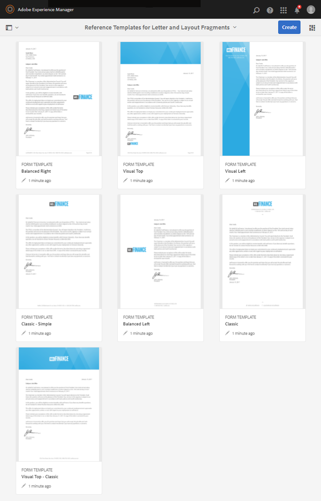

# Mallar för referensbrev {#reference-letter-templates}

I Correspondence Management innehåller en brevmall typiska formulärfält, layoutfunktioner som sidhuvud och sidfot samt tomma målområden för innehållsplacering.

Correspondence Management tillhandahåller brevmallar i AEM Forms-paketet [AEM-FORMS-REFERENCE-LAYOUT-TEMPLATES](https://www.adobeaemcloud.com/content/marketplace/marketplaceProxy.html?packagePath=/content/companies/public/adobe/packages/cq630/fd/AEM-FORMS-6.3-REFERENCE-LAYOUT-TEMPLATES). Information om hur du installerar ett paket finns i [Arbeta med paket](/help/sites-administering/package-manager.md). Du kan anpassa mallarna i Designer efter företagets grafiska profil och behov. Paketet innehåller följande mallar:

* Klassisk
* Klassisk enkel
* Balanserad vänster
* Balanserad höger
* Visual Left
* Visual Top
* Visual Top - Classic

När du har installerat paketet visas layoutmallarna (XDP) i mappen templates på följande plats:

`https://[server]:[port]/[context-root]/aem/forms.html/content/dam/formsanddocuments/templates-folder`

Följande är de gemensamma fälten i alla mallar i det här paketet:

* Date
* Hälsning
* Stänger text
* Signaturtext

När du har installerat paketet AEM-FORMS-6.3-REFERENCE-LAYOUT-TEMPLATES visas mallarna i mappen templates

## Klassisk {#classic}

Klassisk mall med en logotyp överst passar för ett vanligt professionellt brev.

PDF-förhandsgranskning av ett brev som skapats med mallen Klassisk

## Klassisk enkel {#classic-simple}

Inkluderar fält för att hämta telefonnummer och e-postadress. En klassisk enkel mall liknar den klassiska mallen förutom att den inte har fält där du kan ange mottagarens adress.

PDF-förhandsgranskning av ett brev som skapats med den klassiska enkla mallen

## Balanserad vänster {#balanced-left}

Mallen Balanced Left innehåller logotyp till vänster om brevet.

PDF-förhandsgranskning av ett brev som skapats med mallen Balanserat vänster

## Balanserad höger {#balanced-right}

Mallen Balanced Right har företagslogotypen till vänster och ger utrymme för att ange mottagarnas adress på själva brevet. Mallen för balanserat höger innehåller också en sidfot som flödar om när brevet har flera sidor.

PDF-förhandsgranskning av ett brev som skapats med mallen för balanserat höger

## Visual Left {#visual-left}

Mallen Visual Left har ett sidohuvud till vänster på sidan med företagets logotyp placerad över sidhuvudet. Mallen Visual Left har ett ämnesfält men ingen sidfot.

PDF-förhandsgranskning av ett brev som skapats med mallen Visual Left

## Visual Top {#visual-top}

Visuell toppmall har en visuell marginal högst upp. Mallen Visual Top innehåller ett fält där du kan ange mottagarens adress på själva sidan. Mallen Visual Top innehåller ämnesfältet och en sidfot som flödar om för bokstäver som sträcker sig över flera sidor.

PDF-förhandsgranskning av ett brev som skapats med mallen Visual Top

## Visual Top - Classic {#visual-top-classic}

Mallen Visual Top - Classic har en rubrik ovanför sidan med företagslogotypen. Mallen Visual Top - Classic har ett fält där du kan ange ett ämne men ingen sidfot.

PDF-förhandsgranskning av ett brev som skapats med mallen Visual Top - Classic

