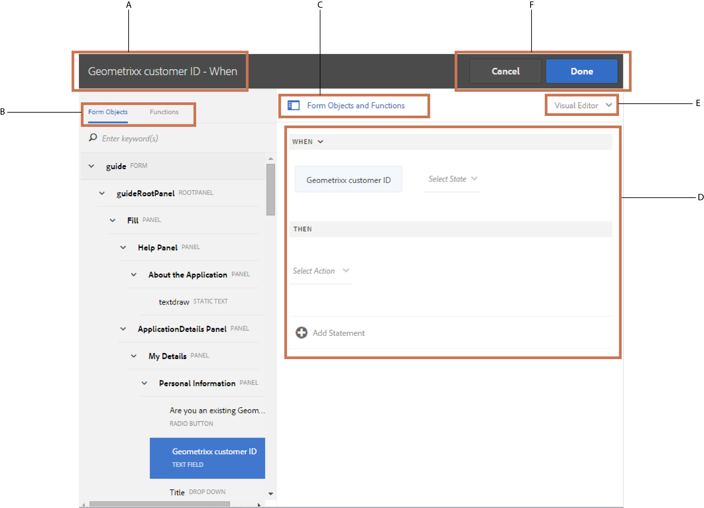
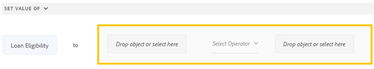

# Anpassad formulärregelredigerare{#adaptive-forms-rule-editor}

<span class="preview"> Adobe rekommenderar att du använder den moderna och utbyggbara datainhämtningen [Core Components](https://experienceleague.adobe.com/docs/experience-manager-core-components/using/adaptive-forms/introduction.html) för [att skapa nya adaptiva Forms](/help/forms/using/create-an-adaptive-form-core-components.md) eller [att lägga till adaptiva Forms på AEM Sites-sidor](/help/forms/using/create-or-add-an-adaptive-form-to-aem-sites-page.md). De här komponenterna utgör ett betydande framsteg när det gäller att skapa adaptiva Forms-filer, vilket ger imponerande användarupplevelser. I den här artikeln beskrivs det äldre sättet att skapa Adaptiv Forms med baskomponenter. </span>

| Version | Länk till artikel |
| -------- | ---------------------------- |
| AEM as a Cloud Service | [Klicka här](https://experienceleague.adobe.com/docs/experience-manager-cloud-service/content/forms/adaptive-forms-authoring/authoring-adaptive-forms-foundation-components/add-rules-and-use-expressions-in-an-adaptive-form/rule-editor.html) |
| AEM 6.5 | Den här artikeln |

## Överblick {#overview}

Regelredigeringsfunktionen i Adobe Experience Manager Forms gör det möjligt för användare och utvecklare av formulär att skriva regler för anpassningsbara formulärobjekt. Dessa regler definierar åtgärder som ska utlösas av formulärobjekt baserat på förinställda villkor, användarindata och användaråtgärder i formuläret. Det effektiviserar formulärifyllningen ytterligare och ger större precision och snabbhet.

Regelredigeraren har ett intuitivt och förenklat användargränssnitt för att skriva regler. Regelredigeraren erbjuder en visuell redigerare för alla användare. Regelredigeraren är dessutom bara avsedd för användare som har behörighet att använda formulär. Regelredigeraren har en kodredigerare som kan skriva regler och skript.
<!-- Some of the key actions that you can perform on adaptive form objects using rules are:

* Show or hide an object
* Enable or disable an object
* Set a value for an object
* Validate the value of an object
* Execute functions to compute the value of an object
* Invoke a form data model service and perform an operation
* Set property of an object -->

Regelredigeraren ersätter skriptfunktionerna i AEM 6.1 Forms och tidigare versioner. Befintliga skript bevaras dock i den nya regelredigeraren. Mer information om hur du arbetar med befintliga skript i regelredigeraren finns i [Effekten av regelredigeraren på befintliga skript](#impact-of-rule-editor-on-existing-scripts).

Användare som läggs till i användargruppen för formulär kan skapa nya skript och redigera befintliga. Användare i gruppen för formuläranvändare kan använda skript men inte skapa eller redigera skript.

## Förstå en regel {#understanding-a-rule}

En regel är en kombination av åtgärder och villkor. I regelredigeraren omfattar åtgärderna aktiviteter som att dölja, visa, aktivera, inaktivera eller beräkna värdet för ett objekt i ett formulär. Villkor är booleska uttryck som utvärderas genom att kontroller och åtgärder utförs på ett formulärobjekts status, värde eller egenskap. Åtgärder utförs baserat på det värde ( `True` eller `False`) som returneras när ett villkor utvärderas.

Regelredigeraren innehåller en uppsättning fördefinierade regeltyper, till exempel När, Visa, Dölj, Aktivera, Inaktivera, Ange värde för och Validera, som hjälper dig att skriva regler. Med varje regeltyp kan du definiera villkor och åtgärder i en regel. I dokumentet förklaras dessutom varje regeltyp i detalj.

En regel följer vanligtvis någon av följande konstruktioner:

**Condition-Action** I den här konstruktionen definierar en regel först ett villkor följt av en åtgärd som ska utlösas. Konstruktionen är jämförbar med if-then-programsatsen i programmeringsspråk.

Regeltypen **När** används i regelredigeraren för att framtvinga konstruktorn för villkorsåtgärd.

**Åtgärdsvillkor** I den här konstruktionen definierar en regel först en åtgärd som ska utlösas följt av villkor för utvärdering. En annan variant av den här konstruktionen är action-condition-alternate action, som också definierar en alternativ åtgärd som ska utlösas om villkoret returnerar False.

Regeltyperna Visa, Dölj, Aktivera, Inaktivera, Ange värde för och Validera i regelredigeraren framtvingar regelkonstruktionen för åtgärdsvillkor. Som standard är den alternativa åtgärden för Visa Dölj och Aktivera Inaktivera, och omvänt. Du kan inte ändra den alternativa standardåtgärden.

>[!NOTE]
>
>De tillgängliga regeltyperna, inklusive villkor och åtgärder som du definierar i regelredigeraren, beror också på vilken typ av formulärobjekt du skapar en regel på. Regelredigeraren visar endast giltiga regeltyper och alternativ för att skriva villkor och åtgärdssatser för en viss formulärobjekttyp. Du kan till exempel inte se regeltyperna Validera, Ange värde för, Aktivera och Inaktivera för ett panelobjekt.

Mer information om tillgängliga regeltyper i regelredigeraren finns i [Tillgängliga regeltyper i regelredigeraren](#available-rule-types-in-rule-editor).

### Riktlinjer för val av regelkonstruktion {#guidelines-for-choosing-a-rule-construct}

Även om du kan uppnå de flesta användningsexemplen genom att använda valfri regelkonstruktion finns det några riktlinjer för att välja en konstruktion framför en annan. Mer information om tillgängliga regler i regelredigeraren finns i [Tillgängliga regeltyper i regelredigeraren](#available-rule-types-in-rule-editor).

* En typisk tumregel när du skapar en regel är att tänka på den i kontexten för det objekt som du skriver en regel för. Tänk på att du vill dölja eller visa fältet B baserat på det värde som användaren anger i fältet A. I det här fallet utvärderar du ett villkor i fält A och baserat på det värde som returneras utlöser du en åtgärd i fält B.

  Om du skriver en regel i fält B (det objekt som du utvärderar ett villkor för) ska du därför använda konstruktorn condition-action eller regeltypen When. Använd på samma sätt konstruktionen action-condition eller Visa eller Dölj regel i fält A.

* Ibland måste du utföra flera åtgärder baserat på ett villkor. I sådana fall bör du använda konstruktorn condition-action. I den här konstruktionen kan du utvärdera ett villkor en gång och ange flera åtgärdssatser.

  Om du till exempel vill dölja fält B, C och D baserat på villkoret som kontrollerar värdet som användaren anger i fält A, skriver du en regel med villkorsstyrd konstruktion eller Regeltyp för När i fält A och anger åtgärder som styr synligheten för fält B, C och D. I annat fall behöver du tre separata regler för fälten B, C och D, där varje regel kontrollerar villkoret och visar eller döljer respektive fält. I det här exemplet är det effektivare att skriva Regeltypen När för ett objekt i stället för att visa eller dölja regeltypen för tre objekt.

* Om du vill aktivera en åtgärd baserat på flera villkor bör du använda konstruktorn action-condition. Om du till exempel vill visa och dölja fält A genom att utvärdera villkor i fält B, C och D, använder du Visa eller Dölj regeltyp i fält A.
* Använd villkorskonstruktion för villkorsåtgärd eller åtgärd om regeln innehåller en åtgärd för ett villkor.
* Om en regel söker efter ett villkor och utför en åtgärd omedelbart när ett värde anges i ett fält eller när ett fält avslutas, rekommenderar vi att du skriver en regel med villkorsstyrd åtgärd eller med regeltypen När i fältet som villkoret utvärderas i.
* Villkoret i regeln När utvärderas när en användare ändrar värdet på objektet som regeln När används på. Men om du vill att åtgärden ska utlösas när värdet ändras på serversidan, som att fylla i värdet i förväg, rekommenderar vi att du skriver en When-regel som utlöser åtgärden när fältet initieras.
* När du skriver regler för nedrullningsbara listor, alternativknappar eller kryssruteobjekt fylls alternativen eller värdena för dessa formulärobjekt i förväg i regelredigeraren.

## Tillgängliga operatortyper och händelser i regelredigeraren {#available-operator-types-and-events-in-rule-editor}

Regelredigeraren innehåller följande logiska operatorer och händelser som du kan använda för att skapa regler.

* **är lika med**
* **är inte lika med**
* **Börjar med**
* **Slutar med**
* **Innehåller**
* **är tom**
* **är inte tom**
* **Har markerat:** Returnerar true när användaren väljer ett visst alternativ för en kryssruta, nedrullningsbar alternativknapp.
* **Är initierad (händelse):** Returnerar true när ett formulärobjekt återges i webbläsaren.
* **Har ändrats (händelse):** Returnerar true när användaren ändrar det angivna värdet eller det valda alternativet för ett formulärobjekt.

## Tillgängliga regeltyper i regelredigeraren {#available-rule-types-in-rule-editor}

Regelredigeraren innehåller en uppsättning fördefinierade regeltyper som du kan använda för att skriva regler. Vi tittar närmare på varje regeltyp. Mer information om hur du skriver regler i regelredigeraren finns i [Skriv regler](#write-rules).

### När {#whenruletype}

Regeltypen **When** följer regelkonstruktionen **condition-action-alternate action** eller ibland bara **condition-action** -konstruktionen. I den här regeltypen anger du först ett villkor för utvärdering följt av en åtgärd som ska utlösas om villkoret uppfylls ( `True`). När du använder regeltypen When kan du använda flera AND- och OR-operatorer för att skapa [kapslade uttryck.](#nestedexpressions)

Med hjälp av regeltypen När kan du utvärdera ett villkor för ett formulärobjekt och utföra åtgärder på ett eller flera objekt.

I klartext är en typisk When-regel strukturerad på följande sätt:

`When on Object A:`

`(Condition 1 AND Condition 2 OR Condition 3) is TRUE;`

`Then, do the following:`

Åtgärd 2 om objekt B;
OCH
Åtgärd 3 om objekt C;

_

När du har en komponent med flera värden, till exempel alternativknappar eller listor, hämtas alternativen automatiskt och görs tillgängliga för regelskaparen när du skapar en regel för den komponenten. Du behöver inte ange alternativvärdena igen.

En lista har till exempel fyra alternativ: Röd, Blå, Grön och Gul. När regeln skapas hämtas alternativen (alternativknappar) automatiskt och görs tillgängliga för regelskaparen enligt följande:


När du skriver en When-regel kan du utlösa åtgärden Clear Value Of. Åtgärden Rensa värde för rensar värdet för det angivna objektet. Med alternativet Radera värde för i programsatsen When kan du skapa komplexa villkor med flera fält.


**Dölj** Döljer det angivna objektet.

**Visa** Visar det angivna objektet.

**Aktivera** Aktiverar det angivna objektet.

**Inaktivera** Inaktiverar det angivna objektet.

**Anropa tjänsten** Anropar en tjänst som konfigurerats i en formulärdatamodell. När du väljer åtgärden Anropa tjänst visas ett fält. När användaren knackar på fältet visas alla tjänster som konfigurerats i alla formulärdatamodeller i AEM. När du väljer en datamodelltjänst för ett formulär visas ytterligare fält där du kan mappa formulärobjekt med in- och utdataparametrar för den angivna tjänsten. Se exempelregel för att anropa datamodelltjänster för formulär.

Utöver formulärdatamodelltjänsten kan du ange en direkt WSDL-URL för att anropa en webbtjänst. En datamodelltjänst för formulär har dock många fördelar och det rekommenderade sättet att anropa en tjänst.

Mer information om hur du konfigurerar tjänster i formulärdatamodellen finns i [AEM Forms-dataintegrering](/help/forms/using/data-integration.md).

**Ange värdet** beräknar och ställer in värdet för det angivna objektet. Du kan ställa in objektvärdet på en sträng, värdet för ett annat objekt, det beräknade värdet med hjälp av matematiska uttryck eller funktioner, värdet för ett objekts egenskap eller utdatavärdet från en konfigurerad datamodelltjänst för formulär. När du väljer webbtjänstalternativet visas alla tjänster som är konfigurerade i alla formulärdatamodeller på din AEM. När du väljer en datamodelltjänst för ett formulär visas ytterligare fält där du kan mappa formulärobjekt med in- och utdataparametrar för den angivna tjänsten.

Mer information om hur du konfigurerar tjänster i formulärdatamodellen finns i [AEM Forms-dataintegrering](/help/forms/using/data-integration.md).

Regeltypen **[!UICONTROL Set Property]** gör att du kan ange värdet för en egenskap för det angivna objektet baserat på en villkorsåtgärd. Du kan ställa in egenskapen på något av följande:

* visible (Boolean)
* dorExclusion (Boolean)
* chartType (String)
* title (String)
* enabled (Boolean)
* mandatory (Boolean)
* validationsDisabled (Boolean)
* validateExpMessage (String)
* value (Number, String, Date)
* objekt (lista)
* valid (Boolean)
* errorMessage (String)

Här kan du definiera regler för att lägga till kryssrutor dynamiskt i det anpassade formuläret. Du kan använda en anpassad funktion, ett formulärobjekt eller en objektegenskap för att definiera en regel.


Om du vill definiera en regel baserat på en anpassad funktion väljer du **Funktionsutdata** i listrutan och drar och släpper en anpassad funktion på fliken **Funktioner**. Om villkorsåtgärden uppfylls läggs antalet kryssrutor som definierats i den anpassade funktionen till i det adaptiva formuläret.

Om du vill definiera en regel baserat på ett formulärobjekt väljer du **Formulärobjekt** i listrutan och drar och släpper ett formulärobjekt på fliken **Formulärobjekt**. Om villkorsåtgärden uppfylls läggs antalet kryssrutor som är definierade i formulärobjektet till i det adaptiva formuläret.

Med en regel för att ange egenskap som baseras på en objektegenskap kan du lägga till antalet kryssrutor i ett anpassat formulär baserat på en annan objektegenskap som ingår i det adaptiva formuläret.

I följande bild visas ett exempel på hur du dynamiskt lägger till kryssrutor baserat på antalet nedrullningsbara listor i det anpassade formuläret:


**Rensa värdet** rensar värdet för det angivna objektet.

**Ange fokus** Anger fokus för det angivna objektet.

**Spara formulär** Sparar formuläret.

**Skicka in Forms** Skicka formuläret.

**Återställ formulär** Återställer formuläret.

**Validera formulär** Validerar formuläret.

**Lägg till instans** Lägger till en instans av den angivna repeterbara panelen eller tabellraden.

**Ta bort instans** Tar bort en instans av den angivna repeterbara panelen eller tabellraden.

**Navigera till** Navigerar till annan interaktiv kommunikation, adaptiva formulär, andra resurser som bilder eller dokumentfragment eller en extern URL. Mer information finns i [Lägg till knapp i den interaktiva kommunikationen](../../forms/using/create-interactive-communication.md#addbuttontothewebchannel).

### Ange värdet för {#set-value-of}

Med regeltypen **[!UICONTROL Set Value of]** kan du ange värdet för ett formulärobjekt beroende på om det angivna villkoret är uppfyllt eller inte. Värdet kan anges till ett värde för ett annat objekt, en stränglitteral, ett värde som härleds från ett matematiskt uttryck eller en funktion, ett värde för en egenskap för ett annat objekt eller utdata från en datamodelltjänst för ett formulär. På samma sätt kan du söka efter ett villkor för en komponent, en sträng, en egenskap eller värden som härletts från en funktion eller ett matematiskt uttryck.

Regeltypen Ange värde för är inte tillgänglig för alla formulärobjekt, t.ex. paneler och knappar i verktygsfält. En standardregel för uppsättningsvärde för har följande struktur:


Ange värdet för objekt A till:

(sträng ABC) ELLER
(objektegenskap X för objekt C) ELLER
(värde från en funktion) ELLER
(värde från ett matematiskt uttryck) ELLER
(utdatavärde för en datamodellstjänst eller webbtjänst)

När (valfritt):

(Villkor 1 OCH Villkor 2 OCH Villkor 3) är SANT;


I följande exempel används värdet i fältet som indata och fältets värde `Relation` anges till utdata från `Relation` argumentet `getDependent` i `dependentid` formulärdatamodelltjänsten.


Exempel på Ange värderegel med datamodelltjänst för formulär

>[!NOTE]
>
>Dessutom kan du använda Ange värde för regel för att fylla i alla värden i en nedrullningsbar listekomponent från utdata från en formulärdatamodelltjänst eller en webbtjänst. Se dock till att det utdataargument du väljer är av en arraytyp. Alla värden som returneras i en array blir tillgängliga i den angivna listrutan.

### Visa {#show}

Med regeltypen **Visa** kan du skriva en regel som visar eller döljer ett formulärobjekt baserat på om ett villkor är uppfyllt eller inte. Regeltypen Visa utlöser även åtgärden Dölj om villkoret inte uppfylls eller returnerar `False`.

En vanlig Visa-regel är strukturerad på följande sätt:


`Show Object A;`

`When:`

`(Condition 1 OR Condition 2 OR Condition 3) is TRUE;`

`Else:`

`Hide Object A;`


### Dölj {#hide}

På liknande sätt som med regeltypen Visa kan du använda regeltypen **Dölj** för att visa eller dölja ett formulärobjekt baserat på om ett villkor är uppfyllt eller inte. Dölj regeltyp utlöser även åtgärden Visa om villkoret inte uppfylls eller returnerar `False`.

En vanlig Dölj-regel är strukturerad på följande sätt:


`Hide Object A;`

`When:`

`(Condition 1 AND Condition 2 AND Condition 3) is TRUE;`

`Else:`

`Show Object A;`


### Aktivera {#enable}

Med regeltypen **Aktivera** kan du aktivera eller inaktivera ett formulärobjekt baserat på om ett villkor är uppfyllt eller inte. Regeltypen Aktivera utlöser även åtgärden Inaktivera om villkoret inte uppfylls eller returnerar `False`.

En vanlig Aktivera-regel är strukturerad på följande sätt:


`Enable Object A;`

`When:`

`(Condition 1 AND Condition 2 AND Condition 3) is TRUE;`

`Else:`

`Disable Object A;`


### Inaktivera {#disable}

På liknande sätt som för regeltypen Aktivera kan du med regeltypen **Inaktivera** aktivera eller inaktivera ett formulärobjekt baserat på om ett villkor är uppfyllt eller inte. Regeltypen Inaktivera utlöser också åtgärden Aktivera om villkoret inte uppfylls eller returnerar `False`.

En vanlig inaktiveringsregel är strukturerad på följande sätt:


`Disable Object A;`

`When:`

`(Condition 1 OR Condition 2 OR Condition 3) is TRUE;`

`Else:`

`Enable Object A;`

### Validera {#validate}

Regeltypen **Validera** validerar värdet i ett fält med hjälp av ett uttryck. Du kan till exempel skriva ett uttryck för att kontrollera att textrutan för att ange namn inte innehåller specialtecken eller siffror.

En vanlig valideringsregel är strukturerad enligt följande:

`Validate Object A;`

`Using:`

`(Expression 1 AND Expression 2 AND Expression 3) is TRUE;`

>[!NOTE]
>
>Om det angivna värdet inte överensstämmer med regeln Validera kan du visa ett valideringsmeddelande för användaren. Du kan ange meddelandet i fältet **[!UICONTROL Script validation message]** i komponentegenskaperna i sidofältet.


### Ange alternativ för {#setoptionsof}

Regeltypen **Ange alternativ för** gör att du kan definiera regler för att lägga till kryssrutor dynamiskt i det anpassade formuläret. Du kan använda en formulärdatamodell eller en anpassad funktion för att definiera regeln.

Om du vill definiera en regel baserat på en anpassad funktion väljer du **Funktionsutdata** i listrutan och drar och släpper en anpassad funktion på fliken **Funktioner**. Antalet kryssrutor som definieras i den anpassade funktionen läggs till i det anpassade formuläret.


Mer information om hur du skapar en anpassad funktion finns i [anpassade funktioner i regelredigeraren](#custom-functions).

Så här definierar du en regel baserad på en formulärdatamodell:

1. Välj **Tjänstutdata** i listrutan.
1. Markera datamodellsobjektet.
1. Välj en objektegenskap för datamodell i listrutan **Visningsvärde**. Antalet kryssrutor i det adaptiva formuläret härleds från antalet instanser som definierats för den egenskapen i databasen.
1. Välj en objektegenskap för datamodell i listrutan **Spara värde**.


## Förstå användargränssnittet för regelredigeraren {#understanding-the-rule-editor-user-interface}

Regelredigeraren har ett omfattande men ändå enkelt användargränssnitt för att skriva och hantera regler. Du kan starta användargränssnittet för regelredigeraren inifrån ett anpassat formulär i redigeringsläge.

Så här startar du användargränssnittet för regelredigeraren:

1. Öppna ett anpassat formulär i redigeringsläge.
1. Markera det formulärobjekt som du vill skriva en regel för och välj  i komponentverktygsfältet. Användargränssnittet för regelredigeraren visas.

   

   Alla befintliga regler för de markerade formulärobjekten visas i den här vyn. Mer information om hur du hanterar befintliga regler finns i [Hantera regler](#manage-rules).

1. Välj **[!UICONTROL Create]** om du vill skriva en ny regel. Den visuella redigeraren för regelredigerarens användargränssnitt öppnas som standard när du startar regelredigeraren första gången.

   

Vi tittar närmare på varje komponent i regelredigeringsgränssnittet.

### A. Visning av komponentregel {#a-component-rule-display}

Visar titeln på det adaptiva formulärobjektet genom vilket du startade regelredigeraren och den regeltyp som är vald. I ovanstående exempel startas regelredigeraren från ett anpassat formulärobjekt med namnet Lön och den valda regeltypen är När.

### B. Formulärobjekt och -funktioner {#b-form-objects-and-functions-br}

Panelen till vänster i regelredigerarens användargränssnitt innehåller två flikar - **[!UICONTROL Forms Objects]** och **[!UICONTROL Functions]**.

På fliken Formulärobjekt visas en hierarkisk vy över alla objekt som finns i det anpassade formuläret. Där visas objektens namn och typ. När du skriver en regel kan du dra och släppa formulärobjekt till regelredigeraren. När du skapar eller redigerar en regel och drar och släpper ett objekt eller en funktion i en platshållare, får platshållaren automatiskt rätt värdetyp.

De formulärobjekt som har en eller flera giltiga regler markerade med en grön prick. Om någon av de regler som tillämpas på ett formulärobjekt är ogiltig markeras formulärobjektet med en gul prick.

Fliken Funktioner innehåller en uppsättning inbyggda funktioner, till exempel Summa av, Min av, Max av, Medelvärde av, Antal av och Validera formulär. Du kan använda dessa funktioner för att beräkna värden i repeterbara paneler och tabellrader och använda dem i åtgärds- och villkorssatser när du skriver regler. Du kan dock också skapa [anpassade funktioner](#custom-functions) .


>[!NOTE]
>
>Du kan utföra textsökning på objekt och funktionsnamn och titlar på flikarna Forms Objekt och Funktioner.

I det vänstra trädet för formulärobjekten kan du markera de formulärobjekt som ska visa de regler som tillämpas på vart och ett av objekten. Du kan inte bara navigera bland reglerna för de olika formulärobjekten, du kan även kopiera och klistra in regler mellan formulärobjekten. Mer information finns i [Kopiera och klistra in regler](#copy-paste-rules).

### C. Växla mellan formulärobjekt och funktioner {#c-form-objects-and-functions-toggle-br}

När användaren knackar på knappen växlar knappen formulärobjekt och funktionsruta.

### D. Visuell regelredigerare {#d-visual-rule-editor}

Visuell regelredigerare är det område i det visuella redigeringsläget i regelredigerarens användargränssnitt där du skriver regler. Här kan du välja en regeltyp och definiera villkor och åtgärder. När du definierar villkor och åtgärder i en regel kan du dra och släppa formulärobjekt och funktioner från rutan Formulärobjekt och funktioner.

Mer information om hur du använder den visuella regelredigeraren finns i [Skriva regler](#write-rules).

### E. Visual-code editors switch {#e-visual-code-editors-switcher}

Användare i gruppen för formuläranvändare har åtkomst till kodredigeraren. Kodredigeraren är inte tillgänglig för andra användare. Om du har behörighet kan du växla från visuellt redigeringsläge till kodredigeringsläge för regelredigeraren, och omvänt, använda väljaren precis ovanför regelredigeraren. När du startar regelredigeraren första gången öppnas den i det visuella redigeringsläget. Du kan skriva regler i det visuella redigeringsläget eller växla till kodredigeringsläget för att skriva ett regelskript. Observera dock att om du ändrar en regel eller skriver en regel i kodredigeraren kan du inte växla tillbaka till den visuella redigeraren för den regeln om du inte rensar kodredigeraren.

AEM Forms spårar det regelredigeringsläge som du använde när du skrev en regel sist. När du startar regelredigeraren nästa gång öppnas den i det läget. Du kan dock konfigurera ett standardläge så att regelredigeraren öppnas i det angivna läget. Så här gör du:

1. Gå till AEM på `https://[host]:[port]/system/console/configMgr`.
1. Klicka för att redigera **[!UICONTROL Adaptive Form and Interactive Communication Web Channel Configuration]**.
1. välj **[!UICONTROL Visual Editor]** eller **[!UICONTROL Code Editor]** i listrutan **[!UICONTROL Default Mode for Rule Editor]**

1. Klicka på **[!UICONTROL Save]**.

### F. Knapparna Klar och Avbryt {#f-done-and-cancel-buttons}

Knappen **[!UICONTROL Done]** används för att spara en regel. Du kan spara en ofullständig regel. Ofullständiga är dock ogiltiga och kan inte köras. Sparade regler för ett formulärobjekt visas nästa gång du startar regelredigeraren från samma formulärobjekt. Du kan hantera befintliga regler i den vyn. Mer information finns i [Hantera regler](#manage-rules).

Knappen **[!UICONTROL Cancel]** ignorerar alla ändringar du har gjort i en regel och stänger regelredigeraren.

## Skriv regler {#write-rules}

Du kan skriva regler med den visuella regelredigeraren eller kodredigeraren. När du startar regelredigeraren första gången öppnas den i det visuella redigeringsläget. Du kan växla till kodredigeringsläget och skriva regler. Observera dock att om du skriver eller ändrar en regel i kodredigeraren kan du inte växla till den visuella redigeraren för den regeln om du inte rensar kodredigeraren. När du startar regelredigeraren nästa gång öppnas den i det läge som du använde när du skapade regeln senast.

Låt oss först titta på hur man skriver regler med visuell redigerare.

### Använda den visuella redigeraren {#using-visual-editor}

Låt oss förstå hur du skapar en regel i den visuella redigeraren med hjälp av följande exempelformulär.


I avsnittet Krav för lån i exempelformuläret för låneansökan måste de sökande ange sin äktenskapsstatus, lön och, om de är gifta, sin makas lön. Baserat på användarens indata beräknar regeln beloppet för rätt till lån och visas i fältet Låneberättigande. Använd följande regler för att implementera scenariot:

* Fältet för makens lön visas endast när äktenskapsstatus är gift.
* Låneberättigandebeloppet är 50 % av den totala lönen.

Utför följande steg för att skriva regler:

1. Först skriver du regeln för att styra synligheten för fältet för makslön baserat på det alternativ som användaren väljer för alternativknappen för civilstånd.

   Öppna låneansökningsformuläret i redigeringsläge. Markera komponenten **Marital status** och välj . Välj sedan **[!UICONTROL Create]** för att starta regelredigeraren.

   

   När du startar regelredigeraren markeras regeln När som standard. Dessutom anges formulärobjektet (i det här fallet Marital status) från vilket du startade regelredigeraren i programsatsen When.

   Du kan inte ändra eller ändra det markerade objektet, men du kan välja en annan regeltyp med hjälp av den nedrullningsbara menyn. Om du vill skapa en regel för ett annat objekt väljer du Avbryt om du vill avsluta regelredigeraren och starta den igen från det önskade formulärobjektet.

1. Välj listrutan **[!UICONTROL Select State]** och välj **[!UICONTROL is equal to]**. Fältet **[!UICONTROL Enter a String]** visas.

   

   I alternativknappen Marital status tilldelas alternativen **Gift** och **En** **0** respektive **1** värden. Du kan verifiera tilldelade värden på fliken Titel i dialogrutan Redigera som visas nedan.

   

1. Ange **0** i fältet **Ange en sträng** i regeln.

   

   Du har definierat villkoret som `When Marital Status is equal to Married`. Definiera sedan åtgärden som ska utföras om villkoret är sant.

1. Välj **[!UICONTROL Show]** i listrutan **[!UICONTROL Select Action]** i programsatsen then.

   

1. Dra-och-släpp fältet **Använd lön** för make/maka från fliken Formulärobjekt i fältet **Släpp objekt eller välj här**. Du kan också markera **Släpp-objektet eller markera här** och markera fältet **Muslön** på snabbmenyn, som listar alla formulärobjekt i formuläret.

   

   Regeln visas så här i regelredigeraren.

   

   Välj **Klar** om du vill spara regeln.

1. Upprepa steg 1 till 5 om du vill definiera en annan regel som döljer fältet för makens lön om äktenskapsstatus är Enskild. Regeln visas så här i regelredigeraren.

   

   >[!NOTE]
   >
   >Du kan också skriva en Show-regel i fältet för makarnas lön, i stället för två When-regler i fältet för civilstånd, för att implementera samma beteende.

   

1. Skriv sedan en regel för att beräkna lånebeloppet, som är 50 % av den totala lönen, och visa det i fältet Låneberättigande. För att uppnå detta skapar du **Ange värdet för**-regler i fältet Lånekvalificering.

   I redigeringsläget markerar du fältet **[!UICONTROL Loan Eligibility]** och väljer . Välj sedan **[!UICONTROL Create]** för att starta regelredigeraren.

1. Välj **[!UICONTROL Set Value Of]**-regel i listrutan Regel.

   

1. Välj **[!UICONTROL Select Option]** och välj **[!UICONTROL Mathematical Expression]**. Ett fält som skriver matematiskt uttryck öppnas.

   

1. I uttrycksfältet:

   * Markera eller dra-och-släpp från fliken Forms-objekt i fältet **Lön** i det första **Släpp-objektet eller välj här**.

   * Välj **Plus** i fältet **Välj operator**.

   * Markera eller dra och släpp från fliken Forms-objekt i fältet **Makuslön** i det andra **Släpp-objektet eller välj här**.

   

1. Välj sedan i det markerade området runt uttrycksfältet och välj **Utöka uttryck**.

   

   I fältet för utökat uttryck väljer du **dividerat med** i fältet **Välj operator** och **Nummer** i fältet **Välj alternativ**. Ange sedan **2** i nummerfältet.

   

   >[!NOTE]
   >
   >Du kan skapa komplexa uttryck med hjälp av komponenter, funktioner, matematiska uttryck och egenskapsvärden i fältet Välj alternativ.

   Skapa sedan ett villkor som körs när true returneras.

1. Välj **Lägg till villkor** om du vill lägga till en When-sats.

   

   I programsatsen When:

   * Markera eller dra-och-släpp från fliken Forms-objekt i fältet **Marital status** i det första **Släpp-objektet eller välj här**-fältet.

   * Välj i **s lika med** i fältet **Välj operator**.

   * Välj String i det andra **Drop-objektet eller markera här**-fältet och ange **Gift** i fältet **Ange en sträng**.

   Regeln visas slutligen så här i regelredigeraren.  

   Välj **Klar** om du vill spara regeln.

1. Upprepa steg 7 till 12 för att definiera en annan regel som beräknar låneberättigandet om civilstånd är enkel. Regeln visas så här i regelredigeraren.

   

>[!NOTE]
>
>Du kan också använda regeln Ange värde för för för att beräkna låneberättigandet i regeln När som du skapade för att visa och dölja fältet Makslön. Den resulterande kombinerade regeln när Marital status är enkel visas så här i regelredigeraren.
>
>På samma sätt kan du skriva en kombinerad regel för att kontrollera synligheten för fältet för makars lön och beräkna rätten till lån när civilstånd är gifta.


### Använda kodredigeraren {#using-code-editor}

Användare som läggs till i gruppen för formuläranvändare kan använda kodredigeraren. Regelredigeraren genererar automatiskt JavaScript-koden för alla regler som du skapar med den visuella redigeraren. Du kan växla från den visuella redigeraren till kodredigeraren för att visa den genererade koden. Men om du ändrar regelkoden i kodredigeraren kan du inte växla tillbaka till den visuella redigeraren. Om du föredrar att skriva regler i kodredigeraren i stället för i den visuella redigeraren kan du skriva reglerna på nytt i kodredigeraren. Med den visuella kodredigeraren kan du växla mellan de två lägena.

Kodredigeraren JavaScript är uttrycksspråket i adaptiva formulär. Alla uttryck är giltiga JavaScript-uttryck och använder API:er för adaptiva formulär. Dessa uttryck returnerar värden av vissa typer. En fullständig lista över adaptiva formulärklasser, händelser, objekt och offentliga API:er finns i [API-referens för JavaScript-bibliotek för adaptiva formulär](https://helpx.adobe.com/experience-manager/6-5/forms/javascript-api/index.html).

Mer information om riktlinjer för att skriva regler i kodredigeraren finns i [Adaptiva formuläruttryck](/help/forms/using/adaptive-form-expressions.md).

När du skriver JavaScript-kod i regelredigeraren hjälper följande visuella tecken dig med strukturen och syntaxen:

* Syntaxhögdagrar
* Automatiskt indrag
* Tips och förslag för formulärobjekt, funktioner och deras egenskaper
* Automatisk komplettering av formulärkomponentnamn och vanliga JavaScript-funktioner


#### Anpassade funktioner i regelredigeraren {#custom-functions}

Förutom användningsklara funktioner som *Summan av* som listas under Funktioner Output, kan du skriva anpassade funktioner som du ofta behöver. Kontrollera att den funktion du skriver åtföljs av `jsdoc` ovan.

Ytterligare `jsdoc` krävs:

* Om du vill ha anpassad konfiguration och beskrivning.
* Eftersom det finns flera sätt att deklarera en funktion i `JavaScript,` och kommentarer kan du hålla reda på funktionerna.

Mer information finns i [usejsdoc.org](https://jsdoc.app/).

`jsdoc` taggar som stöds:

* **Privat**
Syntax: `@private`
En privat funktion ingår inte som en anpassad funktion.

* **Namn**
Syntax: `@name funcName <Function Name>`
Du kan också `,` använda: `@function funcName <Function Name>` **eller** `@func` `funcName <Function Name>` .
  `funcName` är namnet på funktionen (inga blanksteg tillåts).
  `<Function Name>` är funktionens visningsnamn.

* **Medlem**
Syntax: `@memberof namespace`
Kopplar ett namnutrymme till funktionen.

* **Parameter**
Syntax: `@param {type} name <Parameter Description>`
Du kan också använda: `@argument` `{type} name <Parameter Description>` **eller** `@arg` `{type}` `name <Parameter Description>` .
Visar parametrar som används av funktionen. En funktion kan ha flera parametertaggar, en tagg för varje parameter i ordningen för förekomst.
  `{type}` representerar parametertyp. Tillåtna parametertyper är:

   1. string
   1. tal
   1. boolesk
   1. omfång

  Omfång används för att referera till fält i ett adaptivt formulär. När ett formulär använder lazy loading kan du använda `scope` för att komma åt dess fält. Du kan komma åt fält antingen när fälten har lästs in eller om fälten har markerats som globala.

  Alla andra parametertyper kategoriseras under någon av ovanstående. Ingen stöds inte. Välj en av typerna ovan. Typer är inte skiftlägeskänsliga. Blanksteg tillåts inte i parametern `name`. `<Parameter Descrption>` `<parameter>  can have multiple words. </parameter>`

* **Returtyp**
Syntax: `@return {type}`
Du kan också använda `@returns {type}` .
Lägger till information om funktionen, till exempel dess mål.
{type} representerar funktionens returtyp. Följande returtyper tillåts:

   1. string
   1. tal
   1. boolesk

  Alla andra returtyper kategoriseras under en av ovanstående. Ingen stöds inte. Välj en av typerna ovan. Returtyperna är inte skiftlägeskänsliga.

* **Detta**
Syntax: `@this currentComponent`

  Använd @this för att referera till den adaptiva formulärkomponenten som regeln är skriven för.

  Följande exempel baseras på fältvärdet. I följande exempel döljer regeln ett fält i formuläret. Delen `this` i `this.value` refererar till den underliggande adaptiva formulärkomponenten, som regeln är skriven för.

  ```
     /**
     * @function myTestFunction
     * @this currentComponent
     * @param {scope} scope in which code inside function will be executed.
     */
     myTestFunction = function (scope) {
        if(this.value == "O"){
              scope.age.visible = true;
        } else {
           scope.age.visible = false;
        }
     }
  ```

>[!NOTE]
>
>Kommentarer före anpassade funktioner används för sammanfattning. Sammanfattningen kan sträcka sig över flera rader tills en tagg påträffas. Begränsa storleken till en enda storlek om du vill ha en kortfattad beskrivning i regelbyggaren.

<!--
**Adding a custom function**

For example, you want to add a custom function which calculates area of a square. Side length is the user input to the custom function, which is accepted using a numeric box in your form. The calculated output is displayed in another numeric box in your form. To add a custom function, you have to first create a client library, and then add it to the CRX repository.

Perform the following steps to create a client library and add it in the CRX repository.

1. Create a client library. For more information, see [Using Client-Side Libraries](/help/sites-developing/clientlibs.md).
2. In CRXDE, add a property `categories`with string type value as `customfunction` to the `clientlib` folder.

   >[!NOTE]
   >
   >`customfunction`is an example category. You can choose any name for the category you create in the `clientlib`folder.

After you have added your client library in the CRX repository, use it in your adaptive form. It lets you use your custom function as a rule in your form. Perform the following steps to add the client library in your adaptive form.

1. Open your form in edit mode.
   To open a form in edit mode, select a form and select **Open**.
1. In the edit mode, select a component, then select  &gt; **Adaptive Form Container**, and then select .
1. In the sidebar, under Name of Client Library, add your client library. ( `customfunction` in the example.)

   

1. Select the input numeric box, and select  to open the rule editor.
1. Select **Create Rule**. Using options shown below, create a rule to save the squared value of the input in the Output field of your form.
   [ ](assets/add-custom-rule.png)Select **Done**. Your custom function is added.

#### Function declaration supported types {#function-declaration-supported-types}

**Function Statement**

```javascript
function area(len) {
    return len*len;
}
```

This function is included without `jsdoc` comments.

**Function Expression**

```javascript
var area;
//Some codes later
/** */
area = function(len) {
    return len*len;
};
```

**Function Expression and Statement**

```javascript
var b={};
/** */
b.area = function(len) {
    return len*len;
}
```

**Function Declaration as Variable**

```javascript
/** */
var x1,
    area = function(len) {
        return len*len;
    },
    x2 =5, x3 =true;
```

Limitation: custom function picks only the first function declaration from the variable list, if together. You can use function expression for every function declared.

**Function Declaration as Object**

```javascript
var c = {
    b : {
        /** */
        area : function(len) {
            return len*len;
        }
    }
};
```

>[!NOTE]
>
>Ensure that you use `jsdoc` for every custom function. Although `jsdoc`comments are encouraged, include an empty `jsdoc`comment to mark your function as custom function. It enables default handling of your custom function.
-->

Du kan också använda anpassade funktioner i regelredigeraren. Instruktioner om hur du skapar anpassade funktioner finns i artikeln [Anpassade funktioner i Adaptiv Forms](/help/forms/using/create-and-use-custom-functions.md).

## Hantera regler {#manage-rules}

Alla befintliga regler för ett formulärobjekt visas när du markerar objektet och väljer . Du kan visa titeln och förhandsgranska regelsammanfattningen. I användargränssnittet kan du dessutom expandera och visa hela regelsammanfattningen, ändra ordningen på regler, redigera regler och ta bort regler.


Du kan utföra följande åtgärder på regler:

* **Utöka/komprimera**: Innehållskolumnen i regellistan visar regelinnehållet. Om hela regelinnehållet inte visas i standardvyn kan du expandera innehållet  genom att markera det.

* **Ändra ordning**: Alla nya regler som du skapar staplas längst ned i regellistan. Reglerna körs uppifrån och ned. Regeln längst upp körs först, följt av andra regler av samma typ. Om du till exempel har reglerna When, Show, Enable och When vid den första, andra, tredje respektive fjärde positionen uppifrån, kommer regeln When överst att köras först följt av regeln When vid den fjärde positionen. Sedan körs reglerna Visa och Aktivera.
Du kan ändra ordningen på en regel genom att trycka på  mot den eller dra och släppa den i önskad ordning i listan.

* **Redigera**: Om du vill redigera en regel markerar du kryssrutan bredvid regeltiteln. Ytterligare alternativ för att redigera och ta bort regeln visas. Välj **Redigera** om du vill öppna den valda regeln i regelredigeraren i visuellt läge eller kodredigeringsläge beroende på vilket läge som används för att skapa regeln.

* **Ta bort**: Om du vill ta bort en regel markerar du regeln och väljer **Ta bort**.

* **Aktivera/inaktivera**: Du kan behöva göra uppehåll i användningen av en regel tillfälligt. Du kan välja en eller flera regler och välja Inaktivera i verktygsfältet Åtgärder för att inaktivera dem. Om en regel är inaktiverad körs den inte vid körningen. Om du vill aktivera en inaktiverad regel kan du markera den och välja Aktivera i verktygsfältet Åtgärder. Statuskolumnen för regeln visar om regeln är aktiverad eller inaktiverad.


## Kopiera och klistra in regler {#copy-paste-rules}

Du kan kopiera och klistra in en regel från ett fält till andra liknande fält för att spara tid.

Så här kopierar och klistrar du in regler:

1. Markera det formulärobjekt som du vill kopiera en regel från och välj  i komponentverktygsfältet. Användargränssnittet för regelredigeraren visas med formulärobjektet markerat och de befintliga reglerna visas.

   

   Mer information om hur du hanterar befintliga regler finns i [Hantera regler](#manage-rules).

1. Markera kryssrutan bredvid regeltiteln. Ytterligare alternativ för att hantera regeln visas. Välj **Kopiera**.

   

1. Markera ett annat formulärobjekt som du vill klistra in regeln i och välj **Klistra in**. Dessutom kan du redigera regeln för att göra ändringar i den.

   >[!NOTE]
   >
   >Du kan bara klistra in en regel i ett annat formulärobjekt om det formulärobjektet har stöd för den kopierade regelns händelse. En knapp stöder till exempel händelsen click. Du kan klistra in en regel med en klickningshändelse på en knapp, men inte i en kryssruta.

1. Välj **Klar** om du vill spara regeln.

## Kapslade uttryck {#nestedexpressions}

Med regelredigeraren kan du använda flera AND- och OR-operatorer för att skapa kapslade regler. Du kan blanda flera AND- och OR-operatorer i regler.

Nedan visas ett exempel på en kapslad regel som visar ett meddelande till användaren om rätt att vårdas av ett barn när de obligatoriska villkoren är uppfyllda.


Du kan också redigera genom att dra och släppa villkor i en regel. Markera och hovra över handtaget ( ) före ett villkor. När pekaren ändras till en handsymbol enligt nedan drar och släpper du villkoret någonstans i linjen. Regelstrukturen ändras.


## Villkor för datumuttryck {#dateexpression}

Med regelredigeraren kan du använda datumjämförelser för att skapa villkor.

Följande är ett exempelvillkor som visar ett statiskt textobjekt om inteckningen på huset redan har tagits, vilket användaren anger genom att fylla i datumfältet.

När datumet för inteckningen av egendomen som fyllts i av användaren är tidigare visas en anteckning om inkomstberäkningen i det adaptiva formuläret. I följande regel jämförs det datum som användaren fyller i med det aktuella datumet och om det datum som användaren fyller i är tidigare än det aktuella datumet visas textmeddelandet (Inkommande) i formuläret.


När det ifyllda datumet infaller tidigare än det aktuella datumet visas textmeddelandet (intäkt) enligt följande:


## Nummerjämförelsevillkor {#number-comparison-conditions}

Med regelredigeraren kan du skapa villkor som jämför två tal.

Följande är ett exempelvillkor som visar ett statiskt textobjekt om antalet månader en sökande stannar på sin nuvarande adress är mindre än 36.


När användaren uppger att han/hon har bott på sin nuvarande adress i mindre än 36 månader visas ett meddelande i formuläret om att ytterligare bevis på hemvist kan begäras.


## Regelredigerarens effekt på befintliga skript {#impact-of-rule-editor-on-existing-scripts}

I AEM Forms-versioner före AEM 6.1 av Forms funktionspaket 1 använde formulärförfattare och utvecklare för att skriva uttryck på fliken Skript i dialogrutan Redigera komponent för att lägga till dynamiskt beteende i adaptiva formulär. Fliken Skript har ersatts av regelredigeraren.

Alla skript och uttryck som du måste ha skrivit på fliken Skript är tillgängliga i regelredigeraren. Du kan inte visa eller redigera dem i den visuella redigeraren, men om du är en del av gruppen för användare med funktionshinder kan du redigera skript i kodredigeraren.

## Exempelregler {#example}

### Anropa datamodelltjänst för formulär {#invoke}

Överväg en webbtjänst `GetInterestRates` som tar lånebelopp, löptid och sökandens kreditpoäng som indata och returnerar en låneplan som inkluderar EMI-belopp och ränta. Du skapar en formulärdatamodell med webbtjänsten som datakälla. Du lägger till datamodellsobjekt och en `get`-tjänst i formulärmodellen. Tjänsten visas på fliken Tjänster i formulärdatamodellen. Skapa sedan en anpassningsbar blankett som innehåller fält från datamodellsobjekt för att hämta in användarens indata för lånebelopp, löptid och kreditpoäng. Lägg till en knapp som utlöser webbtjänsten för att hämta planinformation. Utdata fylls i i lämpliga fält.

I följande regel visas hur du konfigurerar åtgärden Anropa tjänst för att slutföra exempelscenariot.


Anropa formulärdatamodelltjänst med hjälp av regel för anpassningsbara formulär

>[!NOTE]
>
>Om indata är av arraytyp visas fälten som stöder arrayer i den nedrullningsbara utdatafältet.

### Utlösa flera åtgärder med hjälp av regeln När {#triggering-multiple-actions-using-the-when-rule}

I en låneansökan vill du ta reda på om lånesökanden är en befintlig kund eller inte. Baserat på den information som användaren anger, bör fältet för kund-ID visas eller döljas. Du vill också fokusera på fältet för kund-ID om användaren är en befintlig kund. Formuläret för låneansökan innehåller följande komponenter:

* En alternativknapp, **Är du en befintlig Geometrixx?**, som innehåller alternativen Ja och Nej. Värdet för Ja är **0** och Nej är **1**.

* Ett textfält, **Geometrixx kund-ID**, som anger kund-ID:t.

När du skriver en When-regel på alternativknappen för att implementera det här beteendet, visas regeln på följande sätt i den visuella regelredigeraren.  

Regel i den visuella redigeraren

I exempelregeln är programsatsen i avsnittet När villkoret, som när returnerar True, utför de åtgärder som anges i avsnittet Sedan.

Regeln visas enligt följande i kodredigeraren.


Regel i kodredigeraren

### Använda ett funktionsutdata i en regel {#using-a-function-output-in-a-rule}

I ett inköpsorderformulär har du följande tabell där användarna fyller i sina beställningar. I denna tabell:

* Den första raden är upprepningsbar, så användarna kan beställa flera produkter och ange olika kvantiteter. Dess elementnamn är `Row1`.
* Titeln på cellen i kolumnen Produktkvantitet på den repeterbara raden är Kvantitet. Elementnamnet för cellen är `productquantity`.
* Den andra raden i tabellen är inte repeterbar och cellens rubrik i kolumnen Produktkvantitet i den här raden är Total Quantity.


**A.** Rad1 **B.** Kvantitet **C.** Totalt antal

Nu vill du lägga till angivna kvantiteter i kolumnen Produktkvantitet för alla produkter och visa summan i cellen Total kvantitet. Du kan uppnå detta genom att skriva en Set Value Of-regel i cellen Total Quantity enligt nedan.


Regel i den visuella redigeraren

Regeln visas enligt följande i kodredigeraren.


Regel i kodredigeraren

### Validera ett fältvärde med uttryck {#validating-a-field-value-using-expression}

I inköpsorderformuläret som förklaras i föregående exempel vill du hindra användare från att beställa mer än en kvantitet av en produkt till ett pris som överstiger 10000. Du kan skriva en valideringsregel enligt nedan.


Regel i den visuella redigeraren

Regeln visas enligt följande i kodredigeraren.


Regel i kodredigeraren
