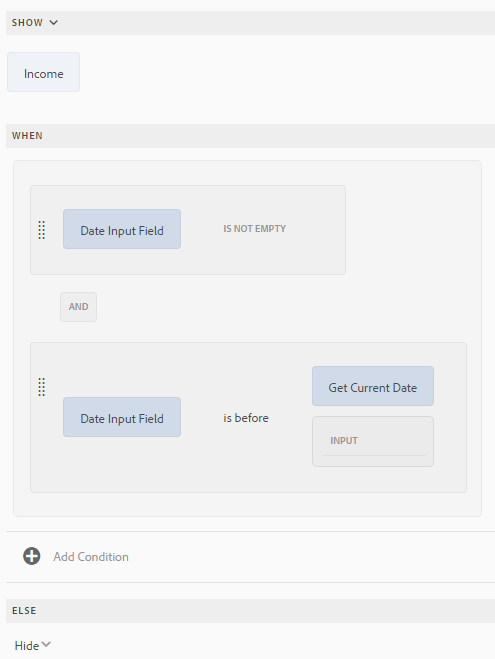

# Anpassad formulärregelredigerare{#adaptive-forms-rule-editor}

## Översikt {#overview}

Regelredigeringsfunktionen i Adobe Experience Manager Forms ger formuläranvändare och utvecklare möjlighet att skriva regler för anpassningsbara formulärobjekt. Dessa regler definierar åtgärder som ska utlösas av formulärobjekt baserat på förinställda villkor, användarindata och användaråtgärder i formuläret. Det effektiviserar formulärifyllningen ytterligare och ger större precision och hastighet.

Regelredigeraren har ett intuitivt och förenklat användargränssnitt för att skriva regler. Regelredigeraren erbjuder en visuell redigerare för alla användare. Regelredigeraren är dessutom bara avsedd för användare som har behörighet att använda formulär och har en kodredigerare som kan skriva regler och skript. Några av de viktigaste åtgärderna som du kan utföra på anpassningsbara formulärobjekt med hjälp av regler är:

* Visa eller dölja ett objekt
* Aktivera eller inaktivera ett objekt
* Ange ett värde för ett objekt
* Validera ett objekts värde
* Utför funktioner för att beräkna värdet för ett objekt
* Anropa en formulärdatamodelltjänst och utföra en åtgärd
* Ange ett objekts egenskap

Regelredigeraren ersätter skriptfunktionerna i AEM 6.1-formulär och tidigare versioner. Befintliga skript bevaras dock i den nya regelredigeraren. Mer information om hur du arbetar med befintliga skript i regelredigeraren finns i [Effekten av regelredigeraren på befintliga skript](../../forms/using/rule-editor.md#p-impact-of-rule-editor-on-existing-scripts-p).

Användare som läggs till i användargruppen för formulär kan skapa nya skript och redigera befintliga. Användare i gruppen för formuläranvändare kan använda skript men inte skapa eller redigera skript.

## Förstå en regel {#understanding-a-rule}

En regel är en kombination av åtgärder och villkor. I regelredigeraren omfattar åtgärderna aktiviteter som att dölja, visa, aktivera, inaktivera eller beräkna värdet för ett objekt i ett formulär. Villkor är booleska uttryck som utvärderas genom att kontroller och åtgärder utförs på ett formulärobjekts status, värde eller egenskap. Åtgärder utförs baserat på det värde ( `True` eller `False`) som returneras när ett villkor utvärderas.

Regelredigeraren innehåller en uppsättning fördefinierade regeltyper, till exempel När, Visa, Dölj, Aktivera, Inaktivera, Ange värde för och Validera, som hjälper dig att skriva regler. Varje regeltyp gör att du kan definiera villkor och åtgärder i en regel. I dokumentet förklaras dessutom varje regeltyp i detalj.

En regel följer vanligtvis någon av följande konstruktioner:

**Condition-Action** I den här konstruktionen definierar en regel först ett villkor följt av en åtgärd som ska utlösas. Konstruktionen är jämförbar med if-then-programsatsen i programmeringsspråk.

I regelredigeraren använder **När** -regeltypen villkorsåtgärdskonstruktionen.

**Åtgärdsvillkor** I den här konstruktionen definierar en regel först en åtgärd som ska utlösas följt av villkor för utvärdering. En annan variant av den här konstruktionen är action-condition-alternate action, som också definierar en alternativ åtgärd som ska utlösas om villkoret returnerar False.

Regeltyperna Visa, Dölj, Aktivera, Inaktivera, Ange värde för och Validera i regelredigeraren framtvingar regelkonstruktionen för åtgärdsvillkor. Som standard är den alternativa åtgärden för Visa Dölj och Aktivera inaktiveras, och vice versa. Du kan inte ändra den alternativa standardåtgärden.

>[!NOTE]
>
>De tillgängliga regeltyperna, inklusive villkor och åtgärder som du definierar i regelredigeraren, beror också på vilken typ av formulärobjekt du skapar en regel på. Regelredigeraren visar endast giltiga regeltyper och alternativ för att skriva villkor och åtgärdssatser för en viss formulärobjekttyp. Du kan till exempel inte se regeltyperna Validera, Ange värde för, Aktivera och Inaktivera för ett panelobjekt.

Mer information om vilka regeltyper som finns i regelredigeraren finns i [Tillgängliga regeltyper i regelredigeraren](../../forms/using/rule-editor.md#p-available-rule-types-in-rule-editor-p).

### Riktlinjer för val av regelkonstruktion {#guidelines-for-choosing-a-rule-construct}

Även om du kan uppnå de flesta användningsexemplen genom att använda valfri regelkonstruktion finns det några riktlinjer för att välja en konstruktion framför en annan. Mer information om tillgängliga regler i regelredigeraren finns i [Tillgängliga regeltyper i regelredigeraren](../../forms/using/rule-editor.md#p-available-rule-types-in-rule-editor-p).

* En typisk tumregel när du skapar en regel är att tänka på den i kontexten för det objekt som du skriver en regel för. Tänk på att du vill dölja eller visa fältet B baserat på det värde som användaren anger i fältet A. I det här fallet utvärderar du ett villkor i fält A och baserat på det värde som returneras utlöser du en åtgärd i fält B.

   Om du skriver en regel i fält B (det objekt som du utvärderar ett villkor för) ska du därför använda konstruktorn condition-action eller regeltypen When. Använd på samma sätt konstruktionen action-condition eller Visa eller Dölj regel i fält A.

* Ibland måste du utföra flera åtgärder baserat på ett villkor. I sådana fall bör du använda konstruktorn condition-action. I den här konstruktionen kan du utvärdera ett villkor en gång och ange flera åtgärdssatser.

   Om du till exempel vill dölja fält B, C och D baserat på villkoret som kontrollerar värdet som användaren anger i fält A, skriver du en regel med villkorsstyrd konstruktion eller Regeltyp för När i fält A och anger åtgärder som styr synligheten för fält B, C och D. I annat fall behöver du tre separata regler för fälten B, C och D, där varje regel kontrollerar villkoret och visar eller döljer respektive fält. I det här exemplet är det effektivare att skriva Regeltypen När för ett objekt i stället för att visa eller dölja regeltypen för tre objekt.

* Om du vill aktivera en åtgärd baserat på flera villkor bör du använda konstruktorn action-condition. Om du till exempel vill visa och dölja fält A genom att utvärdera villkor i fält B, C och D, använder du Visa eller Dölj regeltyp i fält A.
* Använd villkorskonstruktion för villkorsåtgärd eller åtgärd om regeln innehåller en åtgärd för ett villkor.
* Om en regel söker efter ett villkor och utför en åtgärd omedelbart när ett värde anges i ett fält eller när ett fält avslutas, rekommenderar vi att du skriver en regel med en villkorsstyrd åtgärd eller med regeltypen När i fältet som villkoret utvärderas i.
* Villkoret i regeln När utvärderas när en användare ändrar värdet på objektet som regeln När används på. Om du vill att åtgärden ska utlösas när värdet ändras på serversidan, som vid förifyllning av värdet, rekommenderar vi att du skriver en When-regel som utlöser åtgärden när fältet initieras.
* När du skriver regler för nedrullningsbara listor, alternativknappar eller kryssruteobjekt fylls alternativen eller värdena för dessa formulärobjekt i förväg i regelredigeraren.

## Tillgängliga operatortyper och händelser i regelredigeraren {#available-operator-types-and-events-in-rule-editor}

Regelredigeraren innehåller följande logiska operatorer och händelser som du kan använda för att skapa regler.

* **Är lika med**
* **Är inte lika med**
* **Börjar med**
* **Slutar med**
* **Innehåller**
* **Är tom**
* **Är inte tom**
* **Har markerat:** Returnerar true när användaren väljer ett visst alternativ för en kryssruta, listruta eller alternativknapp.
* **Har initierats (händelse):** Returnerar true när ett formulärobjekt återges i webbläsaren.
* **Har ändrats (händelse):** Returnerar true när användaren ändrar det angivna värdet eller det valda alternativet för ett formulärobjekt.

## Tillgängliga regeltyper i regelredigeraren {#available-rule-types-in-rule-editor}

Regelredigeraren innehåller en uppsättning fördefinierade regeltyper som du kan använda för att skriva regler. Vi tittar närmare på varje regeltyp. Mer information om hur du skriver regler i regelredigeraren finns i [Skriva regler](../../forms/using/rule-editor.md#p-write-rules-p).

### När {#whenruletype}

Regeltypen **När** följer **konstruktorn för villkorsstyrd åtgärd-alternativ åtgärd** , eller ibland bara **konstruktorn för villkorsstyrd åtgärd** . I den här regeltypen anger du först ett villkor för utvärdering följt av en åtgärd som ska utlösas om villkoret är uppfyllt ( `True`). När du använder regeltypen When kan du använda flera AND- och OR-operatorer för att skapa [kapslade uttryck](#nestedexpressions).

Med regeltypen När kan du utvärdera ett villkor i ett formulärobjekt och utföra åtgärder på ett eller flera objekt.

Med enkla ord är en vanlig When-regel strukturerad enligt följande:

`When on Object A:`

`(Condition 1 AND Condition 2 OR Condition 3) is TRUE;`

`Then, do the following:`

Åtgärd 2 på objekt B.
ANDAction 3 på objekt C,

_

När du har en komponent med flera värden, till exempel alternativknappar eller listor, hämtas alternativen automatiskt och görs tillgängliga för regelskaparen när du skapar en regel för den komponenten. Du behöver inte ange alternativvärdena igen.

En lista har till exempel fyra alternativ: Rött, blått, grönt och gult. När regeln skapas hämtas alternativen (alternativknappar) automatiskt och görs tillgängliga för regelskaparen enligt följande:


När du skriver en When-regel kan du utlösa åtgärden Clear Value Of. Med åtgärden Clear Value Of rensas det angivna objektets värde. Om du har värdet Radera för som ett alternativ i programsatsen När kan du skapa komplexa villkor med flera fält.


**Dölj** Döljer det angivna objektet.

**Visa** Visar det angivna objektet.

**Aktivera** Aktiverar det angivna objektet.

**Inaktivera** Inaktiverar det angivna objektet.

**Anropa tjänst** Anropar en tjänst som konfigurerats i en formulärdatamodell. När du väljer åtgärden Anropa tjänst visas ett fält. När användaren knackar på fältet visas alla tjänster som konfigurerats i alla formulärdatamodeller på AEM-instansen. När du väljer en datamodelltjänst för ett formulär visas ytterligare fält där du kan mappa formulärobjekt med in- och utdataparametrar för den angivna tjänsten. Se exempelregel för att anropa datamodelltjänster för formulär.

Utöver formulärdatamodelltjänsten kan du ange en direkt WSDL-URL för att anropa en webbtjänst. En datamodelltjänst för formulär har dock många fördelar och det rekommenderade sättet att anropa en tjänst.

Mer information om hur du konfigurerar tjänster i formulärdatamodell finns i [AEM Forms-dataintegrering](/help/forms/using/data-integration.md).

**Ange värdet för** Computes och ställer in värdet för det angivna objektet. Du kan ställa in objektvärdet på en sträng, värdet för ett annat objekt, det beräknade värdet med hjälp av matematiska uttryck eller funktioner, värdet för ett objekts egenskap eller utdatavärdet från en konfigurerad datamodelltjänst för formulär. När du väljer webbtjänstalternativet visas alla tjänster som konfigurerats i alla formulärdatamodeller på din AEM-instans. När du väljer en datamodelltjänst för ett formulär visas ytterligare fält där du kan mappa formulärobjekt med in- och utdataparametrar för den angivna tjänsten.

Mer information om hur du konfigurerar tjänster i formulärdatamodell finns i [AEM Forms-dataintegrering](/help/forms/using/data-integration.md).

Med regeltypen **Ange egenskap** kan du ange värdet för en egenskap för det angivna objektet baserat på en villkorsåtgärd.

Här kan du definiera regler för att lägga till kryssrutor dynamiskt i det anpassade formuläret. Du kan använda en anpassad funktion, ett formulärobjekt eller en objektegenskap för att definiera en regel.


Om du vill definiera en regel baserat på en anpassad funktion väljer du **Funktionsutdata** i listrutan och drar och släpper en anpassad funktion på fliken **Funktioner** . Om villkorsåtgärden uppfylls läggs antalet kryssrutor som definierats i den anpassade funktionen till i det adaptiva formuläret.

Om du vill definiera en regel baserat på ett formulärobjekt väljer du **Formulärobjekt** i listrutan och drar och släpper ett formulärobjekt på fliken **Formulärobjekt** . Om villkorsåtgärden uppfylls läggs antalet kryssrutor som är definierade i formulärobjektet till i det adaptiva formuläret.

En regel för att ange egenskap baserad på en objektegenskap gör att du kan lägga till antalet kryssrutor i ett anpassat formulär baserat på en annan objektegenskap som ingår i det adaptiva formuläret.

I följande bild visas ett exempel på hur du dynamiskt lägger till kryssrutor baserat på antalet nedrullningsbara listor i det anpassade formuläret:


**Rensa värdet för** rensar värdet för det angivna objektet.

**Ange fokus** Anger fokus för det angivna objektet.

**Spara formulär** Sparar formuläret.

**Skicka formulär** skickar formuläret.

**Återställ formulär** Återställer formuläret.

**Validera formulär** Validerar formuläret.

**Lägg till instans** Lägger till en instans av den angivna repeterbara panelen eller tabellraden.

**Ta bort instans** Tar bort en instans av den angivna repeterbara panelen eller tabellraden.

**Navigera till** Navigerar till annan interaktiv kommunikation, adaptiva formulär, andra resurser som bilder eller dokumentfragment eller en extern URL. Mer information finns i [knappen Lägg till i den interaktiva kommunikationen](../../forms/using/create-interactive-communication.md#addbuttontothewebchannel).

### Ange värdet för {#set-value-of}

Med **[!UICONTROL Ange värde för]** regeltyp kan du ange värdet för ett formulärobjekt beroende på om det angivna villkoret är uppfyllt eller inte. Värdet kan anges till ett värde för ett annat objekt, en stränglitteral, ett värde som härleds från ett matematiskt uttryck eller en funktion, ett värde för en egenskap för ett annat objekt eller utdata från en datamodelltjänst för ett formulär. På samma sätt kan du söka efter ett villkor för en komponent, en sträng, en egenskap eller värden som härletts från en funktion eller ett matematiskt uttryck.

Observera att regeltypen Ange värde för inte är tillgänglig för alla formulärobjekt, till exempel paneler och knappar i verktygsfält. En standarduppsättningsvärde för regel har följande struktur:


Ange värdet för objekt A till:

(sträng ABC) OR(objektegenskap X för objekt C) OR(värde från en funktion) OR(värde från ett matematiskt uttryck) OR(utdatavärde för en datamodelltjänst eller webbtjänst),

När (valfritt):

(Villkor 1 OCH villkor 2 OCH villkor 3) är SANT.


I följande exempel används värdet i `dependentid` fältet som indata och värdet i `Relation` fältet anges som utdata för `Relation` argumentet i `getDependent` formulärdatamodellstjänsten.


Exempel på Ange värderegel med datamodelltjänst för formulär

>[!NOTE]
>
>Dessutom kan du använda Ange värde för regel för att fylla i alla värden i en nedrullningsbar listekomponent från utdata från en formulärdatamodelltjänst eller en webbtjänst. Se dock till att det utdataargument du väljer är av en arraytyp. Alla värden som returneras i en array blir tillgängliga i den angivna listrutan.

### Visa {#show}

Med regeltypen **Visa** kan du skriva en regel som visar eller döljer ett formulärobjekt baserat på om ett villkor är uppfyllt eller inte. Regeltypen Visa utlöser även åtgärden Dölj om villkoret inte uppfylls eller returneras `False`.

En vanlig Visa-regel är strukturerad på följande sätt:


`Show Object A;`

`When:`

`(Condition 1 OR Condition 2 OR Condition 3) is TRUE;`

`Else:`

`Hide Object A;`


### Dölj {#hide}

På liknande sätt som för regeltypen Visa kan du använda **Dölj** -regeltypen för att visa eller dölja ett formulärobjekt baserat på om ett villkor är uppfyllt eller inte. Dölj-regeltypen aktiverar även åtgärden Visa om villkoret inte uppfylls eller returneras `False`.

En vanlig Dölj-regel är strukturerad på följande sätt:


`Hide Object A;`

`When:`

`(Condition 1 AND Condition 2 AND Condition 3) is TRUE;`

`Else:`

`Show Object A;`


### Aktivera {#enable}

Med **regeltypen Aktivera** kan du aktivera eller inaktivera ett formulärobjekt baserat på om ett villkor är uppfyllt eller inte. Regeltypen Aktivera utlöser även åtgärden Inaktivera om villkoret inte uppfylls eller returneras `False`.

En vanlig Aktivera-regel är strukturerad på följande sätt:


`Enable Object A;`

`When:`

`(Condition 1 AND Condition 2 AND Condition 3) is TRUE;`

`Else:`

`Disable Object A;`


### Disable {#disable}

Ungefär som med regeltypen Aktivera kan du med **regeltypen Inaktivera** aktivera eller inaktivera ett formulärobjekt baserat på om ett villkor är uppfyllt eller inte. Regeltypen Inaktivera utlöser också åtgärden Aktivera om villkoret inte uppfylls eller returneras `False`.

En vanlig inaktiveringsregel är strukturerad enligt följande:


`Disable Object A;`

`When:`

`(Condition 1 OR Condition 2 OR Condition 3) is TRUE;`

`Else:`

`Enable Object A;`

### Validate {#validate}

Regeltypen **Validera** validerar värdet i ett fält med hjälp av ett uttryck. Du kan till exempel skriva ett uttryck för att kontrollera att textrutan för att ange namn inte innehåller specialtecken eller siffror.

En vanlig valideringsregel är strukturerad enligt följande:

`Validate Object A;`

`Using:`

`(Expression 1 AND Expression 2 AND Expression 3) is TRUE;`

>[!NOTE]
>
>Om det angivna värdet inte överensstämmer med regeln Validera kan du visa ett valideringsmeddelande för användaren. Du kan ange meddelandet i **[!UICONTROL skriptvalideringsmeddelandefältet]** i komponentegenskaperna i sidofältet.


### Ange alternativ för {#setoptionsof}

Med **regeltypen Ange alternativ för** regler kan du definiera regler för att lägga till kryssrutor dynamiskt i det anpassade formuläret. Du kan använda en formulärdatamodell eller en anpassad funktion för att definiera regeln.

Om du vill definiera en regel baserat på en anpassad funktion väljer du **Funktionsutdata** i listrutan och drar och släpper en anpassad funktion på fliken **Funktioner** . Antalet kryssrutor som definieras i den anpassade funktionen läggs till i det anpassade formuläret.


Mer information om hur du skapar en anpassad funktion finns i [Anpassade funktioner i regelredigeraren](../../forms/using/rule-editor.md#main-pars-header-296220653).

Så här definierar du en regel baserad på en formulärdatamodell:

1. Välj **Serviceutdata** i listrutan.
1. Markera datamodellsobjektet.
1. Välj en objektegenskap för datamodell i listrutan **Visningsvärde** . Antalet kryssrutor i det adaptiva formuläret härleds från antalet instanser som definierats för den egenskapen i databasen.
1. Välj en objektegenskap för datamodell i listrutan **Spara värde** .


## Om regelredigerarens användargränssnitt {#understanding-the-rule-editor-user-interface}

Regelredigeraren har ett omfattande men ändå enkelt användargränssnitt för att skriva och hantera regler. Du kan starta användargränssnittet för regelredigeraren inifrån ett anpassat formulär i redigeringsläge.

Så här startar du användargränssnittet för regelredigeraren:

1. Öppna ett anpassat formulär i redigeringsläge.
1. Tryck på det formulärobjekt som du vill skriva en regel för och tryck på i komponentverktygsfältet. Användargränssnittet för regelredigeraren visas.

   

   Alla befintliga regler för de markerade formulärobjekten visas i den här vyn. Mer information om hur du hanterar befintliga regler finns i [Hantera regler](../../forms/using/rule-editor.md#p-manage-rules-p).

1. Tryck på **[!UICONTROL Skapa]** för att skriva en ny regel. Den visuella redigeraren för regelredigerarens användargränssnitt öppnas som standard när du startar regelredigeraren första gången.
[ 

   Klicka för att visa förstorad bild

   ](assets/rule-editor-ui-1.png)Vi tittar närmare på varje komponent i regelredigeringsgränssnittet.

### S. Visning av komponentregel {#a-component-rule-display}

Visar titeln på det adaptiva formulärobjektet genom vilket du startade regelredigeraren och den regeltyp som är vald. I ovanstående exempel startas regelredigeraren från ett anpassat formulärobjekt med namnet Lön och den valda regeltypen är När.

### B. Formulärobjekt och -funktioner {#b-form-objects-and-functions-br}

Panelen till vänster i regelredigerarens användargränssnitt innehåller två flikar - **[!UICONTROL Formulärobjekt]** och **[!UICONTROL Funktioner]**.

På fliken Formulärobjekt visas en hierarkisk vy över alla objekt som finns i det anpassade formuläret. Där visas objektens namn och typ. När du skriver en regel kan du dra och släppa formulärobjekt till regelredigeraren. När du skapar eller redigerar en regel när du drar och släpper ett objekt eller en funktion till en platshållare, får platshållaren automatiskt rätt värdetyp.

De formulärobjekt som har en eller flera giltiga regler markerade med en grön punkt. Om någon av reglerna som tillämpas på ett formulärobjekt är ogiltig markeras formulärobjektet med en gul punkt.

Fliken Funktioner innehåller en uppsättning inbyggda funktioner, till exempel summan av, Min av, Max av, Medel av, Antal, och Validera formulär. Du kan använda de här funktionerna för att beräkna värden i repeterbara paneler och tabellrader och använda dem i action- och condition-satser när du skriver regler. Du kan dock även skapa [anpassade funktioner](../../forms/using/rule-editor.md#custom-functions) .


>[!NOTE]
>
>Du kan utföra textsökning på objekt och funktionsnamn och titlar på flikarna Formulärobjekt och Funktioner.

I det vänstra trädet för formulärobjekten kan du trycka på formulärobjekten för att visa reglerna som tillämpas på vart och ett av objekten. Du kan inte bara navigera bland reglerna för de olika formulärobjekten, du kan även kopiera och klistra in regler mellan formulärobjekten. Mer information finns i [Kopiera och klistra in regler](../../forms/using/rule-editor.md#p-copy-paste-rules-p).

### C. Växla mellan formulärobjekt och funktioner {#c-form-objects-and-functions-toggle-br}

När användaren knackar på knappen växlar knappen formulärobjekt och funktionsruta.

### D. Visuell regelredigerare {#d-visual-rule-editor}

Visuell regelredigerare är det område i det visuella redigeringsläget i regelredigerarens användargränssnitt där du skriver regler. Det gör att du kan välja en regeltyp och därefter definiera villkor och åtgärder. När du definierar villkor och åtgärder i en regel kan du dra och släppa formulärobjekt och funktioner från rutan Formulärobjekt och funktioner.

Mer information om hur du använder den visuella regelredigeraren finns i [Skriva regler](../../forms/using/rule-editor.md#p-write-rules-p).

### E. Visual-code editors switch {#e-visual-code-editors-switcher}

Användare i gruppen för formuläranvändare har åtkomst till kodredigeraren. Kodredigeraren är inte tillgänglig för andra användare. Om du har behörighet kan du växla från visuellt redigeringsläge till kodredigeringsläge för regelredigeraren, och vice versa, med väljaren precis ovanför regelredigeraren. När du startar regelredigeraren första gången öppnas den i det visuella redigeringsläget. Du kan skriva regler i det visuella redigeringsläget eller växla till kodredigeringsläget för att skriva ett regelskript. Observera dock att om du ändrar en regel eller skriver en regel i kodredigeraren kan du inte växla tillbaka till den visuella redigeraren för den regeln om du inte rensar kodredigeraren.

AEM Forms spårar det regelredigeringsläge som du använde när du skrev en regel. När du startar regelredigeraren nästa gång öppnas den i det läget. Du kan dock konfigurera ett standardläge så att regelredigeraren öppnas i det angivna läget. Så här gör du:

1. Gå till AEM-webbkonsolen på `https://[host]:[port]/system/console/configMgr`.
1. Klicka för att redigera tjänsten **[!UICONTROL för konfiguration av]** adaptiva formulär.
1. välj **[!UICONTROL Visuell redigerare]** eller **[!UICONTROL kodredigerare]** i listrutan **[!UICONTROL Standardläge för regelredigeraren]**

1. Click **[!UICONTROL Save]**.

### F. Knapparna Klar och Avbryt {#f-done-and-cancel-buttons}

Knappen **[!UICONTROL Klar]** används för att spara en regel. Du kan spara en ofullständig regel. Ofullständiga är dock ogiltiga och kan inte köras. Sparade regler för ett formulärobjekt visas nästa gång du startar regelredigeraren från samma formulärobjekt. Du kan hantera befintliga regler i den vyn. Mer information finns i [Hantera regler](../../forms/using/rule-editor.md#p-manage-rules-p).

Knappen **[!UICONTROL Avbryt]** tar bort alla ändringar du har gjort i en regel och stänger regelredigeraren.

## Skriv regler {#write-rules}

Du kan skriva regler med den visuella regelredigeraren eller kodredigeraren. När du startar regelredigeraren första gången öppnas den i det visuella redigeringsläget. Du kan växla till kodredigeringsläget och skriva regler. Observera dock att om du skriver eller ändrar en regel i kodredigeraren kan du inte växla till den visuella redigeraren för den regeln om du inte rensar kodredigeraren. När du startar regelredigeraren nästa gång öppnas den i det läge som du använde när du skapade regeln senast.

Låt oss först se hur man skriver regler med den visuella redigeraren.

### Använda den visuella redigeraren {#using-visual-editor}

Låt oss förstå hur du skapar en regel i den visuella redigeraren med hjälp av följande exempelformulär.


I avsnittet Krav för lån i exempelformuläret för låneansökan måste de sökande ange sin äktenskapsstatus, lön och, om de är gifta, sin makas lön. Baserat på användarens indata beräknar regeln beloppet för rätt till lån och visas i fältet Låneberättigande. Använd följande regler för att implementera scenariot:

* Fältet för makens lön visas endast när äktenskapsstatus är gift.
* Låneberättigandebeloppet är 50 % av den totala lönen.

Utför följande steg för att skriva regler:

1. Först skriver du regeln för att styra synligheten för fältet för makslön baserat på det alternativ som användaren väljer för alternativknappen för civilstånd.

   Öppna låneansökningsformuläret i redigeringsläge. Tryck på **Marital Status** -komponenten och tryck på . Tryck sedan på **[!UICONTROL Skapa]** för att starta regelredigeraren.

   

   När du startar regelredigeraren markeras regeln När som standard. Dessutom anges formulärobjektet (i det här fallet Marital status) från vilket du startade regelredigeraren i programsatsen When.

   Du kan inte ändra eller ändra det markerade objektet, men du kan välja en annan regeltyp med hjälp av den nedrullningsbara menyn. Om du vill skapa en regel för ett annat objekt trycker du på Avbryt för att avsluta regelredigeraren och starta den igen från det önskade formulärobjektet.

1. Tryck på listrutan **[!UICONTROL Välj läge]** och markera **[!UICONTROL är lika med]**. Fältet **[!UICONTROL Ange en sträng]** visas.

   

   I alternativknappen Marital status tilldelas alternativen **Gift** och **Enskilt** värde **0** respektive **1** . Du kan verifiera tilldelade värden på fliken Titel i dialogrutan Redigera som visas nedan.

   

1. Ange **0** i fältet **Ange en sträng** i regeln.

   

   Du har definierat villkoret som `When Marital Status is equal to Married`. Definiera sedan åtgärden som ska utföras om villkoret är sant.

1. Välj **[!UICONTROL Visa]** i listrutan **[!UICONTROL Välj åtgärd]** i programsatsen sedan.

   

1. Dra och släpp fältet **Muslön** från fliken Formulärobjekt i objektet **Släpp eller markera här** . Du kan också trycka på objektet **Släpp eller markera här** och markera fältet **Musmatur** på snabbmenyn, som listar alla formulärobjekt i formuläret.

   

   Regeln visas så här i regelredigeraren.

   

   Tryck på **Klar** för att spara regeln.

1. Upprepa steg 1 till 5 om du vill definiera en annan regel som döljer fältet för makens lön om äktenskapsstatus är Enskild. Regeln visas så här i regelredigeraren.

   

   >[!NOTE]
   >
   >Du kan också skriva en Show-regel i fältet för makarnas lön, i stället för två When-regler i fältet för civilstånd, för att implementera samma beteende.

   

1. Skriv sedan en regel för att beräkna lånebeloppet, som är 50 % av den totala lönen, och visa det i fältet Låneberättigande. För att uppnå detta skapar du **Ange värde för** regler i fältet Låneberättigande.

   I redigeringsläget trycker du på fältet **[!UICONTROL Låneberättigande]** och trycker på . Tryck sedan på **[!UICONTROL Skapa]** för att starta regelredigeraren.

1. Välj **[!UICONTROL Ange värde för]** regel i listrutan Regel.

   

1. Tryck på **[!UICONTROL Välj alternativ]** och välj **[!UICONTROL Matematiskt uttryck]**. Ett fält som skriver matematiskt uttryck öppnas.

   

1. I uttrycksfältet:

   * Markera eller dra och släpp från fliken Formulärobjekt i fältet **Lön** i det första **Släpp-objektet eller välj här** .

   * Välj **Plus** i fältet **Välj operator** .

   * Markera eller dra och släpp från fliken Formulärobjekt i fältet **Makuslön** i det andra **Släpp-objektet eller välj här** .
   

1. Tryck sedan på det markerade området runt uttrycksfältet och tryck på **Extend Expression**.

   

   I fältet för utökat uttryck väljer du **dividerat med** i fältet **Välj operator** och **Nummer** i fältet **Välj alternativ** . Ange sedan **2** i nummerfältet.

   

   >[!NOTE]
   >
   >Du kan skapa komplexa uttryck med hjälp av komponenter, funktioner, matematiska uttryck och egenskapsvärden i fältet Välj alternativ.

   Skapa sedan ett villkor som körs när true returneras.

1. Tryck på **Lägg till villkor** för att lägga till en When-sats.

   

   I programsatsen When:

   * Markera eller dra och släpp från fliken Formulärobjekt i fältet **Marital status** i det första **Släpp-objektet eller välj här** .

   * Välj **är lika med** i fältet **Välj operator** .

   * Välj String i det andra **Drop-objektet eller markera här** -fältet och ange **Gift** i fältet **Ange en sträng** .
   Regeln visas slutligen så här i regelredigeraren.  

   Tryck på **Klar** för att spara regeln.

1. Upprepa steg 7 till 12 för att definiera en annan regel som beräknar låneberättigandet om civilstånd är enkel. Regeln visas så här i regelredigeraren.

   

>[!NOTE]
>
>Du kan också använda regeln Ange värde för för för att beräkna låneberättigandet i regeln När som du skapade för att visa och dölja fältet Makslön. Den resulterande kombinerade regeln när Marital status är enkel visas så här i regelredigeraren.
>
>På samma sätt kan du skriva en kombinerad regel för att kontrollera synligheten för fältet för makars lön och beräkna rätten till lån när civilstånd är gifta.


### Använda kodredigeraren {#using-code-editor}

Användare som läggs till i gruppen för formuläranvändare kan använda kodredigeraren. Regelredigeraren genererar automatiskt JavaScript-koden för alla regler som du skapar med den visuella redigeraren. Du kan växla från den visuella redigeraren till kodredigeraren för att visa den genererade koden. Men om du ändrar regelkoden i kodredigeraren kan du inte växla tillbaka till den visuella redigeraren. Om du föredrar att skriva regler i kodredigeraren i stället för i den visuella redigeraren kan du skriva reglerna på nytt i kodredigeraren. Med den visuella kodredigeraren kan du växla mellan de två lägena.

Kodredigeraren JavaScript är uttrycksspråket i adaptiva formulär. Alla uttryck är giltiga JavaScript-uttryck och använder API:er för skriptmodell för adaptiva formulär. Dessa uttryck returnerar värden av vissa typer. En fullständig lista över adaptiva formulärklasser, händelser, objekt och offentliga API:er finns i API-referens för [JavaScript-bibliotek för adaptiva formulär](https://helpx.adobe.com/experience-manager/6-5/forms/javascript-api/index.html).

Mer information om riktlinjer för att skriva regler i kodredigeraren finns i [Adaptiva formuläruttryck](/help/forms/using/adaptive-form-expressions.md).

När du skriver JavaScript-kod i regelredigeraren kan du använda följande visuella tips för att få hjälp med strukturen och syntaxen:

* Syntaxhögdagrar
* Automatiskt indrag
* Tips och förslag för formulärobjekt, funktioner och deras egenskaper
* Automatisk komplettering av formulärkomponentnamn och vanliga JavaScript-funktioner


#### Anpassade funktioner i regelredigeraren {#custom-functions}

Förutom de färdiga funktionerna, som *Summa av* , som listas under Funktioner Output, kan du skriva egna funktioner som du ofta behöver. Kontrollera att den funktion du skriver åtföljs av `jsdoc` ovanstående.

Följande `jsdoc` krävs:

* Om du vill ha anpassad konfiguration och beskrivning.
* Eftersom det finns flera sätt att deklarera en funktion i `JavaScript,` och kommentarer kan du hålla reda på funktionerna.

For more information, see [usejsdoc.org](https://usejsdoc.org/).

Taggar `jsdoc` som stöds:

* **Privat** syntax: `@private`En privat funktion ingår inte som en anpassad funktion.

* **Namnsyntax**: Du kan `@name funcName <Function Name>`också `,` använda: `@function funcName <Function Name>` eller ****`@func` `funcName <Function Name>`.
   `funcName` är namnet på funktionen (inga blanksteg tillåts).
   `<Function Name>` är funktionens visningsnamn.

* **Medlemssyntax**: Kopplar `@memberof namespace`ett namnutrymme till funktionen.

* **Parametersyntax**: Du kan `@param {type} name <Parameter Description>`också använda: `@argument``{type} name <Parameter Description>` eller **** `@arg``{type}` `name <Parameter Description>`.
Visar parametrar som används av funktionen. En funktion kan ha flera parametertaggar, en tagg för varje parameter i ordningen för förekomst.
   `{type}` representerar parametertyp. Tillåtna parametertyper är:

   1. string
   1. tal
   1. boolean
   Alla andra parametertyper kategoriseras under någon av ovanstående. Ingen stöds inte. Välj en av typerna ovan. Typer är inte skiftlägeskänsliga. Blanksteg tillåts inte i parametern `name`. `<Parameter Descrption>` `<parameter>  can have multiple words. </parameter>`

* **Returtypssyntax**: Du kan `@return {type}`också använda `@returns {type}`.
Lägger till information om funktionen, till exempel dess mål.
{type} representerar funktionens returtyp. Tillåtna returtyper är:

   1. string
   1. tal
   1. boolean
   Alla andra returtyper kategoriseras under en av ovanstående. Ingen stöds inte. Välj en av typerna ovan. Returtyperna är inte skiftlägeskänsliga.

>[!NOTE]
>
>Kommentarer före anpassade funktioner används för sammanfattning. Sammanfattningen kan sträcka sig över flera rader tills en tagg påträffas. Begränsa storleken till en enda storlek om du vill ha en kortfattad beskrivning i regelbyggaren.

**Lägga till en anpassad funktion**

Du kan t.ex. lägga till en egen funktion som beräknar en kvadratyta. Sidlängd är användarens indata till den anpassade funktionen, som accepteras med en numerisk ruta i formuläret. Beräknade utdata visas i en annan numerisk ruta i formuläret. Om du vill lägga till en anpassad funktion måste du först skapa ett klientbibliotek och sedan lägga till det i CRX-databasen.

Utför följande steg för att skapa ett klientbibliotek och lägga till det i CRX-databasen.

1. Skapa ett klientbibliotek. Mer information finns i [Använda bibliotek](/help/sites-developing/clientlibs.md)på klientsidan.
1. I CRXDE lägger du till en egenskap `categories`med strängtypsvärde som `customfunction` i `clientlib` mappen.

   >[!NOTE]
   >
   >`customfunction`är en exempelkategori. Du kan välja vilket namn som helst för kategorin som du skapar i `clientlib`mappen.

När du har lagt till ditt klientbibliotek i CRX-databasen kan du använda det i ditt adaptiva formulär. Du kan använda den anpassade funktionen som en regel i formuläret. Utför följande steg för att lägga till klientbiblioteket i ditt adaptiva formulär.

1. Öppna formuläret i redigeringsläge.
Om du vill öppna ett formulär i redigeringsläge markerar du ett formulär och trycker på **Öppna**.
1. Markera en komponent i redigeringsläget, tryck sedan på  > **Adaptiv formulärbehållare** och tryck sedan på .
1. Lägg till ditt klientbibliotek i sidofältet under Klientbibliotekets namn. ( `customfunction` i exemplet.)

   

1. Markera den numeriska rutan och tryck på  för att öppna regelredigeraren.
1. Tryck på **Skapa regel**. Använd alternativen som visas nedan för att skapa en regel som sparar indatavärdet i fyrkantiga värden i formulärutdatafältet.
   [ ](assets/add-custom-rule.png)regelTryck **på Klar**. Din anpassade funktion har lagts till.

#### Typer som stöds för funktionsdeklaration {#function-declaration-supported-types}

**Funktionssats**

```
function area(len) {
    return len*len;
}
```

Den här funktionen inkluderas utan `jsdoc` kommentarer.

**Funktionsuttryck**

```
var area;
//Some codes later
/** */
area = function(len) {
    return len*len;
};
```

**Funktionsuttryck och -programsats**

```
var b={};
/** */
b.area = function(len) {
    return len*len;
}
```

**Funktionsdeklaration som variabel**

```
/** */
var x1,
    area = function(len) {
        return len*len;
    },
    x2 =5, x3 =true;
```

Begränsning: den anpassade funktionen väljer bara den första funktionsdeklarationen från variabellistan, om den kombineras. Du kan använda funktionsuttryck för varje deklarerad funktion.

**Funktionsdeklaration som objekt**

```
var c = {
    b : {
        /** */
        area : function(len) {
            return len*len;
        }
    }
};
```

>[!NOTE]
>
>Se till att du använder `jsdoc` för alla anpassade funktioner. Även om `jsdoc`kommentarer uppmuntras bör du inkludera en tom `jsdoc`kommentar för att markera funktionen som anpassad funktion. Den aktiverar standardhantering av din anpassade funktion.

## Hantera regler {#manage-rules}

Alla befintliga regler för ett formulärobjekt visas när du trycker på objektet och trycker på . Du kan visa titeln och förhandsgranska regelsammanfattningen. I gränssnittet kan du dessutom expandera och visa hela regelsammanfattningen, ändra ordningen på regler, redigera regler och ta bort regler.


Du kan utföra följande åtgärder på regler:

* **Expandera/komprimera**: Kolumnen Innehåll i regellistan visar regelinnehållet. Om hela regelinnehållet inte visas i standardvyn expanderar du det genom att trycka på  .

* **Ändra ordning**: Alla nya regler som du skapar staplas längst ned i regellistan. Reglerna körs uppifrån och ned. Regeln längst upp körs först följt av andra regler av samma typ. Om du till exempel har reglerna When, Show, Enable och When vid första, andra, tredje respektive fjärde positionen uppifrån, kommer regeln When överst att köras först följt av regeln When vid den fjärde positionen. Sedan körs reglerna Visa och Aktivera.
Du kan ändra ordningen på en regel genom att trycka på  mot den eller dra och släppa den i önskad ordning i listan.

* **Redigera**: Om du vill redigera en regel markerar du kryssrutan bredvid regeltiteln. Ytterligare alternativ för att redigera och ta bort regeln visas. Tryck på **Redigera** för att öppna den valda regeln i regelredigeraren i visuellt läge eller kodredigeringsläge beroende på vilket läge som används för att skapa regeln.

* **Ta bort**: Om du vill ta bort en regel markerar du den och trycker på **Delete**.

* **Aktivera/inaktivera**: Du kan behöva göra uppehåll i användningen av en regel tillfälligt. Du kan välja en eller flera regler och inaktivera dem genom att trycka på Inaktivera i verktygsfältet Åtgärder. Om en regel är inaktiverad körs den inte vid körningen. Om du vill aktivera en inaktiverad regel kan du markera den och trycka på Aktivera i åtgärdsverktygsfältet. Statuskolumnen för regeln visar om regeln är aktiverad eller inaktiverad.


## Kopiera och klistra in regler {#copy-paste-rules}

Du kan kopiera och klistra in en regel från ett fält till andra liknande fält för att spara tid.

Så här kopierar och klistrar du in regler:

1. Tryck på det formulärobjekt du vill kopiera en regel från och tryck på i komponentverktygsfältet. Användargränssnittet för regelredigeraren visas med formulärobjektet markerat och de befintliga reglerna visas.

   

   Mer information om hur du hanterar befintliga regler finns i [Hantera regler](../../forms/using/rule-editor.md#p-manage-rules-p).

1. Markera kryssrutan bredvid regeltiteln. Ytterligare alternativ för att hantera regeln visas. Tryck på **Kopiera**.

   

1. Markera ett annat formulärobjekt som du vill klistra in regeln i och tryck på **Klistra in**. Dessutom kan du redigera regeln för att göra ändringar i den.

   >[!NOTE]
   >
   >Du kan bara klistra in en regel i ett annat formulärobjekt om det formulärobjektet har stöd för den kopierade regelns händelse. En knapp stöder till exempel händelsen click. Du kan klistra in en regel med en klickningshändelse på en knapp, men inte i en kryssruta.

1. Tryck på **Klar** för att spara regeln.

## Kapslade uttryck {#nestedexpressions}

Med regelredigeraren kan du använda flera AND- och OR-operatorer för att skapa kapslade regler. Du kan blanda flera AND- och OR-operatorer i regler.

Nedan visas ett exempel på en kapslad regel som visar ett meddelande till användaren om rätt att vårdas av ett barn när de obligatoriska villkoren är uppfyllda.


Du kan också redigera genom att dra och släppa villkor i en regel. Tryck och hovra över handtaget ( ) före ett villkor. När pekaren ändras till en handsymbol enligt nedan drar och släpper du villkoret någonstans i linjen. Regelstrukturen ändras.


## Villkor för datumuttryck {#dateexpression}

Regelredigeraren låter dig använda datumjämförelser för att skapa villkor.

Följande är ett exempelvillkor som visar ett statiskt textobjekt om inteckningen på huset redan har tagits, vilket användaren anger genom att fylla i datumfältet.

När datumet för inteckningen av egendomen som fyllts i av användaren är tidigare visas en anteckning om inkomstberäkningen i det adaptiva formuläret. I följande regel jämförs det datum som användaren fyller i med det aktuella datumet och om det datum som användaren fyller i är tidigare än det aktuella datumet visas textmeddelandet (Inkommande) i formuläret.



När det ifyllda datumet infaller tidigare än det aktuella datumet visas textmeddelandet (intäkt) enligt följande:


## Nummerjämförelsevillkor {#number-comparison-conditions}

Med regelredigeraren kan du skapa villkor som jämför två tal.

Följande är ett exempelvillkor som visar ett statiskt textobjekt om antalet månader en sökande stannar på sin nuvarande adress är mindre än 36.


När användaren uppger att han/hon har bott på sin nuvarande adress i mindre än 36 månader visas ett meddelande i formuläret om att ytterligare bevis på hemvist kan begäras.


## Regelredigerarens effekt på befintliga skript {#impact-of-rule-editor-on-existing-scripts}

I AEM Forms-versioner före AEM 6.1 Forms-funktionspaket 1 använde formulärförfattare och utvecklare för att skriva uttryck på fliken Skript i dialogrutan Redigera komponent för att lägga till dynamiskt beteende i adaptiva formulär. Fliken Skript har ersatts av regelredigeraren.

Alla skript och uttryck som du måste ha skrivit på fliken Skript är tillgängliga i regelredigeraren. Du kan inte visa eller redigera dem i den visuella redigeraren, men om du är en del av gruppen för användare med funktionshinder kan du redigera skript i kodredigeraren.

## Exempelregler {#example}

### Anropa datamodelltjänst för formulär {#invoke}

Betrakta en webbtjänst `GetInterestRates` som tar lånebelopp, löptid och sökandens kreditpoäng som indata och returnerar en låneplan som inkluderar EMI-belopp och ränta. Du skapar en formulärdatamodell med webbtjänsten som datakälla. Du lägger till datamodellsobjekt och en `get` tjänst i formulärmodellen. Tjänsten visas på fliken Tjänster i formulärdatamodellen. Skapa sedan en anpassningsbar blankett som innehåller fält från datamodellsobjekt för att hämta in användarens indata för lånebelopp, löptid och kreditpoäng. Lägg till en knapp som utlöser webbtjänsten för att hämta planinformation. Utdata fylls i i lämpliga fält.

I följande regel visas hur du konfigurerar åtgärden Anropa tjänst för att slutföra exempelscenariot.


Anropa formulärdatamodelltjänst med hjälp av regel för anpassningsbara formulär

### Utlösa flera åtgärder med hjälp av regeln När {#triggering-multiple-actions-using-the-when-rule}

I en låneansökan vill du ta reda på om lånesökanden är en befintlig kund eller inte. Baserat på den information som användaren anger, bör fältet för kund-ID visas eller döljas. Du vill också fokusera på fältet för kund-ID om användaren är en befintlig kund. Formuläret för låneansökan innehåller följande komponenter:

* En alternativknapp, **Är du en befintlig Geometrixx-kund?**, som innehåller alternativen Ja och Nej. Värdet för Ja är **0** och Nej är **1**.

* Ett textfält, **Geometrixx, med kundens ID**, som anger kundens ID.

När du skriver en When-regel på alternativknappen för att implementera det här beteendet, visas regeln på följande sätt i den visuella regelredigeraren.  

Regel i den visuella redigeraren

I exempelregeln är programsatsen i avsnittet När villkoret, som när returnerar True, utför de åtgärder som anges i avsnittet Sedan.

Regeln visas enligt följande i kodredigeraren.


Regel i kodredigeraren

### Använda ett funktionsutdata i en regel {#using-a-function-output-in-a-rule}

I ett inköpsorderformulär har du följande tabell där användarna fyller i sina beställningar. I denna tabell:

* Den första raden är upprepningsbar, så användarna kan beställa flera produkter och ange olika kvantiteter. Dess elementnamn är `Row1`.
* Titeln på cellen i kolumnen Produktkvantitet på den repeterbara raden är Kvantitet. Elementnamnet för den här cellen är `productquantity`.
* Den andra raden i tabellen är inte repeterbar och cellens rubrik i kolumnen Produktkvantitet i den här raden är Total Quantity.


**S.** Rad1 **B.** Kvantitet **C.** Total kvantitet

Nu vill du lägga till angivna kvantiteter i kolumnen Produktkvantitet för alla produkter och visa summan i cellen Total kvantitet. Du kan uppnå detta genom att skriva en Set Value Of-regel i cellen Total Quantity enligt nedan.


Regel i den visuella redigeraren

Regeln visas enligt följande i kodredigeraren.


Regel i kodredigeraren

### Validera ett fältvärde med uttryck {#validating-a-field-value-using-expression}

I inköpsorderformuläret som förklaras i föregående exempel vill du hindra användare från att beställa mer än en kvantitet av en produkt till ett pris som överstiger 10000. Du kan skriva en valideringsregel enligt nedan.


Regel i den visuella redigeraren

Regeln visas enligt följande i kodredigeraren.


Regel i kodredigeraren

