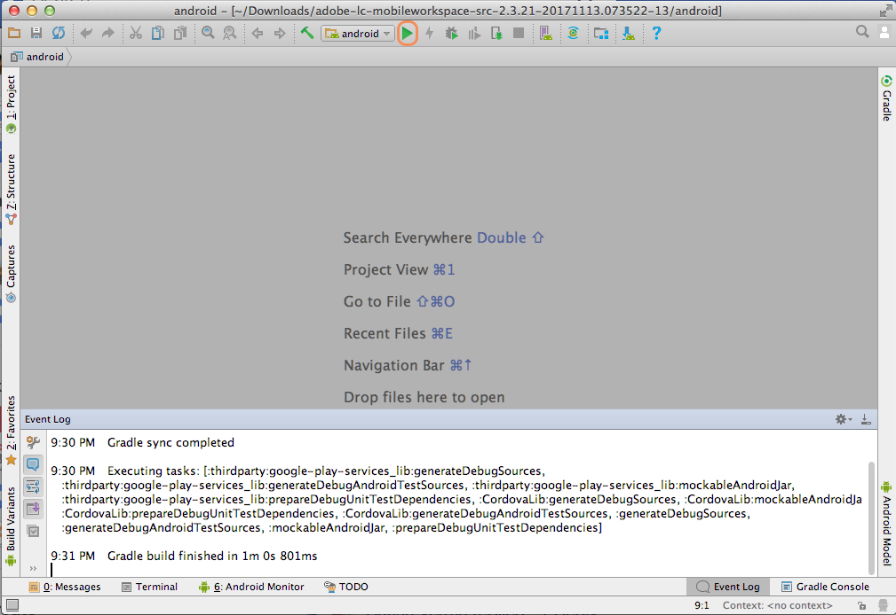

# Konfigurera Android-studioprojektet och bygg Android-appen {#set-up-the-android-studio-project-and-build-the-android-app}

Den här artikeln handlar om att skapa AEM Forms App 6.3.1.1 och senare versioner. Information om hur du skapar en app från källkoden för källkoden i AEM Forms App 6.3 finns i [Konfigurera Eclipse-projektet och skapa Android™-appen](/help/forms/using/setup-eclipse-project-build-installer.md).

AEM Forms tillhandahåller den fullständiga källkoden för AEM Forms-appen. Källan innehåller alla komponenter för att skapa en anpassad AEM Forms-app. Källkodsarkivet, `adobe-lc-mobileworkspace-src-<version>.zip`, är en del av `adobe-aemfd-forms-app-src-pkg-<version>.zip`-paketet för programvarudistribution.

Så här hämtar du programkällan för AEM Forms:

1. Öppna [Programvarudistribution](https://experience.adobe.com/downloads). Du behöver en Adobe ID för att logga in på Software Distribution.
1. Tryck på **[!UICONTROL Adobe Experience Manager]** som finns i rubrikmenyn.
1. I avsnittet **[!UICONTROL Filters]**:
   1. Välj **[!UICONTROL Forms]** i listrutan **[!UICONTROL Solution]**.
   2. Välj version och typ för paketet. Du kan också använda alternativet **[!UICONTROL Search Downloads]** för att filtrera resultaten.
1. Tryck på det paketnamn som gäller för ditt operativsystem, välj **[!UICONTROL Accept EULA Terms]** och tryck på **[!UICONTROL Download]**.
1. Öppna [Pakethanteraren](https://docs.adobe.com/content/help/en/experience-manager-65/administering/contentmanagement/package-manager.html) och klicka på **[!UICONTROL Upload Package]** för att överföra paketet.
1. Markera paketet och klicka på **[!UICONTROL Install]**.

Följande bild visar det extraherade innehållet i `adobe-lc-mobileworkspace-src-<version>.zip`.

Följande bild visar katalogstrukturen för mappen `android`i mappen `src`mappen.

## Bygg AEM Forms-standardapp {#set-up-the-xcode-project}

1. Utför följande steg för att konfigurera ett projekt i Android™ Studio och ange en signeringsidentitet:

   Logga in på en dator där Android™ Studio är installerat och konfigurerat.

1. Kopiera det hämtade `adobe-lc-mobileworkspace-src-<version>.zip`-arkivet till:

   **För MAC-användare**:  `[User_Home]/Projects`

   **För Windows®-användare**:  `%HOMEPATH%\Projects`

   >[!NOTE]
   >
   >För Windows® rekommenderar vi att du behåller android-projektet i systemenheten.

1. Extrahera arkivet i följande katalog:

   **För MAC-användare**:  `[User_Home]/Projects/[your-project]`

   **För Windows®-användare**:  `%HOMEPATH%\Projects\[your-project]`

   >[!NOTE]
   >
   >Vi rekommenderar att du behåller det extraherade android-projektet i systemenheten innan du importerar projektet till Android Studio.

1. Starta Android™ Studio.

   **För MAC-användare**: Uppdatera  `local.properties` filen som finns i  `[User_Home]/Projects/[your-project]/android` mappen och peka  `sdk.dir` variabeln mot  `SDK` platsen på skrivbordet.

   **För Windows®-användare**: Uppdatera  `local.properties` filen som finns i  `%HOMEPATH%\Projects\[your-project]\android` mappen och peka  `sdk.dir` variabeln mot  `SDK` platsen på skrivbordet.

1. Klicka på **[!UICONTROL Finish]** för att skapa projektet.

   Projektet är tillgängligt i ADT Project Explorer.

   

1. I Android™ Studio väljer du **[!UICONTROL Import Project (Eclipse ADT, Gradle, Etc.)]**.
1. I projektutforskaren markerar du rotkatalogen för projektet som du vill skapa i textrutan **Rotkatalog**:

   **För Mac-användare:** [User_Home]/Projects/MobileWorkspace/src/android

   **För Windows®-användare:** %HOMEPATH%\Projects\MobileWorkspace\src\android

1. När projektet har importerats visas ett popup-fönster med alternativet att uppdatera Android™-pluginmodulen Gradle. Klicka på lämplig knapp beroende på dina behov.

   

1. När du har skapat en övertoning visas följande skärm. Anslut lämplig enhet eller emulator till systemet och klicka på **[!UICONTROL Run Android™]**.

   

1. Android™ Studio visar anslutna enheter och tillgängliga emulatorer. Välj den enhet som du vill köra programmet på och klicka sedan på **OK**.

   

När du har skapat projektet kan du välja att installera programmet med Android™ Debug Bridge eller Android™ Studio.

### Använda Android™ Debug Bridge {#andriod-debug-bridge}

Du kan installera programmet på en Android™-enhet via [Android™ Debug Bridge](https://developer.android.com/tools/help/adb.html) med följande kommando:

**För MAC-användare**:  `adb install [User_Home]/Projects/[your-project]/adobe-lc-mobileworkspace-src-[version]/android/build/outputs/apk/android-debug.apk`

**För Windows®-användare**:  `adb install %HOMEPATH%\Projects\[your-project]\adobe-lc-mobileworkspace-src-[version]\android\build\outputs\apk\android-debug.apk`
