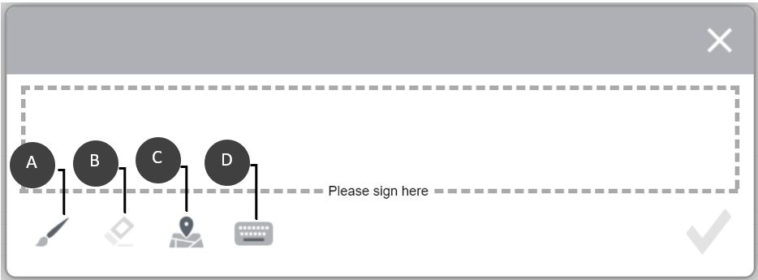

# Använda elektroniska signaturer i ett formulär med (inaktuella) klottersignaturer{#apply-electronic-signatures-to-a-form-using-deprecated-scribble-signatures}

Du kan använda komponenten (Föråldrat) **Klottsignatur** och komponenten **Signatursteg** för att rita (Klottra) signatur i ett anpassat formulär. Underskriftsstegkomponenten visar en PDF-version av det adaptiva formuläret. Du måste aktivera alternativet Dokument för post eller formulärmallsbaserade adaptiva formulär för att kunna använda signaturstegskomponenten.

Båda komponenterna har ett fönster, som visas nedan, för att signera ett formulär. Du kan också klicka på geopositioneringsikonen  för att lägga till geopositionering i signaturen.

## Konfigurera ett anpassningsbart formulär att använda en skriptsignatur {#configure-an-adaptive-form-to-use-scribble-signature}

1. Alternativet Skapa ett postdokument aktiverat eller ett anpassat formulär som bygger på en formulärmall. Stegvis information finns i [Skapa ett anpassat formulär](../../forms/using/creating-adaptive-form.md).
1. Dra och släpp komponenten **Klottsignatur** från komponentwebbläsaren till det adaptiva formuläret.
1. Tryck på ikonen **Konfigurera**  . Egenskaper öppnas i webbläsaren och egenskaper för komponenten Skriptsignatur visas. Konfigurera egenskaper för komponenten Scribble Signature.
1. Dra och släpp signaturstegskomponenten från komponentwebbläsaren till det anpassningsbara formuläret.

   >[!NOTE]
   >
   >Komponenten Signatursteg får full bredd som är tillgänglig för formuläret. Vi rekommenderar att du inte har någon annan komponent i avsnittet som innehåller komponenten Signatursteg.

1. Tryck på **Formulärbehållare** i innehållsläsaren och tryck på **ikonen Konfigurera**  . Egenskaper öppnas i webbläsaren och egenskaper för behållare för adaptiva formulär visas. Navigera till **Adaptiv formulärbehållare** > **Elektronisk signatur** och avmarkera alternativet **Aktivera Adobe Sign** . Tryck på ikonen Klar  för att spara ändringarna.

   >[!NOTE]
   >
   >När du lägger till en komponent för signatursteg i ett anpassat formulär markeras alternativet Aktivera Adobe Sign automatiskt.

1. Tryck på ikonen **Konfigurera**  . Egenskaper öppnas i webbläsaren och egenskaper för signatursteg visas. Konfigurera följande egenskaper:

   * **Elementnamn**: Ange komponentens namn.

   * **** Titel: Ange komponentens unika namn.
   * **** Mallmeddelande: Ange det meddelande som ska visas när signatur-PDF-filen läses in. Adobe Sign-tjänsterna tar lite tid att förbereda och läsa in PDF-signaturer.
   * **** Underteckningstjänst: Välj alternativet **Skriptsignatur** .

   * **CSS-klass**: Ange CSS-klass för klientbiblioteket, om det finns någon. Vi rekommenderar att du använder [teman](../../forms/using/themes.md) och [infogade format](../../forms/using/inline-style-adaptive-forms.md) i stället för CSS-klassen.
   Tryck på ikonen Klar  för att spara ändringarna. Signaturen har konfigurerats.

   När du fyller i ett formulär visas nu en PDF-version av anpassningsbara formulär och alternativ för att signera PDF-dokumentet finns. Mer information finns i [Signera ett anpassat formulär med Klottsignatur](../../forms/using/signing-forms-using-scribble.md#sign-an-adaptive-form-using-scribble-signature).

## Signera ett anpassat formulär med Scribble Signature {#sign-an-adaptive-form-using-scribble-signature}

1. När du har fyllt i ett anpassat formulär och kommit till sidan Signatursteg visas signaturskärmen.

   

1. Klicka på **[!UICONTROL Signera]**. Dialogrutan för klottersignering visas. Signera formuläret och klicka på ikonen Klar  för att spara signaturen.

   

1. Klicka på Slutför för att slutföra signeringsprocessen.

   

Signaturerna läggs till i formuläret och formulärkontrollen flyttas till nästa panel.

