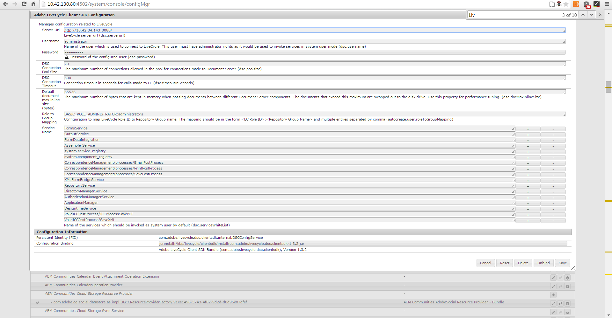

# Efterbearbetning av brev och interaktiv kommunikation{#post-processing-of-letters-and-interactive-communications}

## Efterbearbetning {#post-processing}

Agenter kan associera och köra arbetsflöden för efterbearbetning av brev och interaktiv kommunikation. Bokföringsprocessen som ska köras kan väljas i egenskapsvyn i brevmallen. Du kan ställa in postprocesser för e-post, utskrift, fax eller arkivering av dina slutliga brev.

Om du vill associera postprocesser med brev eller interaktiv kommunikation måste du först konfigurera postprocesserna. Två typer av arbetsflöden kan utföras på skickade brev:

1. **** Formulärarbetsflöde: Det här är AEM Forms om arbetsflöden för JEE-processhantering. Instruktioner för att konfigurera [formulärarbetsflöde](../../forms/using/submit-letter-topostprocess.md#main-pars-header-3).

1. **** AEM-arbetsflöde: AEM-arbetsflöden kan också användas som efterbearbetning för skickade brev. Instruktioner för att konfigurera [AEM-arbetsflöde](../../forms/using/aem-forms-workflow.md).

## Formulärarbetsflöde {#formsworkflow}

1. Öppna Adobe Experience Manager Web Console-konfiguration för servern i AEM med följande URL: `https://<server>:<port>/<contextpath>/system/console/configMgr`

   

1. På den här sidan letar du upp SDK-konfigurationen för AEM Forms-klienten och expanderar den genom att klicka på den.
1. Ange namnet på AEM-formulären på JEE-servern i URL-adressen för servern, inloggningsinformation och klicka sedan på **Spara**.

   

1. Ange användarnamn och lösenord.
1. Kontrollera att sun.util.calendar har lagts till i Brandväggskonfiguration för deserialisering.

   Gå till Konfiguration av brandvägg för deserialisering och lägg till sun.util.calendar under Whitelisted-klasser för paketprefix.

1. Nu är dina servrar mappade och postprocesserna i AEM Forms på JEE är tillgängliga i AEM-användargränssnittet när du skapar brev.

   

1. Om du vill autentisera en process/tjänst kopierar du processens namn och går tillbaka till sidan Adobe Experience Manager Web Console Console Configurations > AEM Forms Client SDK Configuration och lägger till processen som en ny tjänst.

   Om listrutan på egenskapssidan för brevet till exempel visar processens namn som Forms Workflow -> ValidCCPostProcess/SaveXML lägger du till ett tjänstnamn som `ValidCCPostProcess/SaveXML`.

1. Om du vill använda AEM Forms i JEE-arbetsflöden för efterbearbetning ställer du in de parametrar och utdata som behövs. Standardvärden för parametrarna anges nedan.

   Gå till sidan Konfiguration av Adobe Experience Manager Web Console > **[!UICONTROL Konfiguration]** för hantering av korrespondenshantering och ange följande parametrar:

   1. **** inPDFDoc (PDF-dokumentparameter): Ett PDF-dokument som indata. Indata innehåller den återgivna bokstaven som indata. De angivna parameternamnen kan konfigureras. De kan konfigureras från Correspondence Management-konfigurationer från konfigurationen.
   1. **** inXMLDoc (XML-dataparameter): Ett XML-dokument som indata. Indata innehåller data som användaren anger i form av XML.
   1. **** inXDPDoc (XDP-dokumentparameter): Ett XML-dokument som indata. Indata innehåller underliggande layout (XDP).
   1. **** inAttachmentDocs (parametern Bifogade dokument): En listindataparameter. Indata innehåller alla bilagor som indata.
   1. **** redirectURL (Redirect URL Output): En utdatatyp som anger den URL som ska omdirigeras till.
   Ditt formulärarbetsflöde måste ha antingen PDF-dokumentparameter eller XML-dataparameter som indata med samma namn som anges i **[!UICONTROL Correspondence Management Configurations]**. Detta krävs för att processen ska visas i listrutan Efterprocess.

## Inställningar för Publish-instansen {#settings-on-the-publish-instance}

1. logga in på `https://localhost:publishport/aem/forms`.
1. Navigera till **[!UICONTROL Bokstäver]** för att visa det publicerade brevet som är tillgängligt på publiceringsinstansen.
1. Konfigurera AEM DS-inställningarna. Se [Konfigurera AEM DS-inställningar](../../forms/using/configuring-the-processing-server-url-.md).

>[!NOTE]
>
>När du använder antingen Forms- eller AEM-arbetsflöden måste du konfigurera tjänsten DS-inställningar innan du skickar något från publiceringsservern. I annat fall ska inlämningen av formuläret misslyckas.

## Hämtning av bokstavsinstanser {#letter-instances-retrieval}

Sparade bokstavsinstanser kan hanteras ytterligare, t.ex. hämtning av bokstavsinstanser och borttagning av bokstavsinstanser, med hjälp av följande API:er som definieras i LetterInstanceService.

<table>
 <tbody>
  <tr>
   <td><strong>API på serversidan</strong></td>
   <td><strong>Åtgärdsnamn</strong></td>
   <td><strong>Beskrivning</strong></td>
  </tr>
  <tr>
   <td>
Public LetterInstanceVO
 
getLetterInstance(String letterInstanceId)
 
Aktiverar ICCException; 
 </td>
   <td>getLetterInstance</td>
   <td>Hämta den angivna bokstavsinstansen </td>
  </tr>
  <tr>
   <td>Public void deleteLetterInstance(String letterInstanceId) returnerar ICCException; </td>
   <td>deleteLetterInstance </td>
   <td>Den angivna bokstavsinstansen har tagits bort </td>
  </tr>
  <tr>
   <td>List getAllLetterInstances(Query) returnerar ICCException; </td>
   <td>getAllLetterInstances </td>
   <td>Denna API hämtar bokstavsinstanser baserat på indatametern. Om du vill hämta alla bokstavsinstanser kan frågeparametern skickas som null.  </td>
  </tr>
  <tr>
   <td>Public Boolean letterInstanceExists(String letterInstanceName) returnerar ICCException; </td>
   <td>letterInstanceExists </td>
   <td>Kontrollera om det finns en LetterInstance med det angivna namnet </td>
  </tr>
 </tbody>
</table>

## Associera en postprocess med ett brev {#associating-a-post-process-with-a-letter}

I användargränssnittet för CCR utför du följande steg för att associera en postprocess med en bokstav:

1. Håll muspekaren över ett brev och tryck på **Visa egenskaper**.
1. Välj **Redigera**.
1. Välj den inläggsprocess som ska associeras med bokstaven i Grundläggande egenskaper med hjälp av listrutan Bokför process. Både AEM- och Forms-relaterade efterprocesser listas i listrutan.
1. Tryck på **Spara**.
1. När du har konfigurerat brevet med Post Process, publicerar du brevet och kan välja att göra det på publiceringsinstansen, anger du behandlings-URL:en i tjänsten AEM DS Settings. Detta garanterar att efterbearbetningen körs på bearbetningsinstansen.

## Läsa in ett utkast {#reloaddraft}

En förekomst av ett utkast till bokstav kan läsas in på nytt i användargränssnittet med följande URL:

`https://<server>:<port>/aem/forms/`

`createcorrespondence.html?/random=$&cmLetterInstanceId=$<LetterInstanceId>`

LetterInstaceID: Unikt ID för den skickade bokstavsinstansen.

Mer information om hur du sparar ett utkast finns i [Spara utkast och skicka](../../forms/using/create-correspondence.md#savingdrafts)brev.
