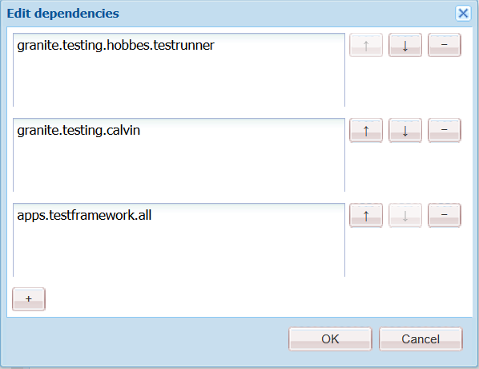

# Självstudiekurs: Testa ditt adaptiva formulär{#tutorial-testing-your-adaptive-form}


Den här självstudiekursen är ett steg i serien [Create Your First Adaptive Form](https://helpx.adobe.com/experience-manager/6-3/forms/using/create-your-first-adaptive-form.html) . Vi rekommenderar att du följer serien i kronologisk ordning för att förstå, utföra och demonstrera det fullständiga exemplet på självstudiekurser.

När det adaptiva formuläret är klart är det viktigt att du testar adaptivet innan du distribuerar det till slutanvändarna. Du kan manuellt testa (funktionstesta) alla fält eller automatisera testningen av ditt adaptiva formulär. När du har flera adaptiva formulär blir det en svår uppgift att manuellt testa alla fält i alla adaptiva formulär.

AEM Forms tillhandahåller ett testramverk, Calvin, som automatiserar testningen av dina anpassade formulär. Med hjälp av ramverket kan du skriva och köra gränssnittstester direkt i en webbläsare. Ramverket innehåller JavaScript-API:er för att skapa tester. Med automatiserad testning kan du testa hur ett anpassat formulär fungerar i förväg, skicka in upplevelser av ett anpassat formulär, uttrycksregler, från validering, lazy loading och gränssnittsinteraktioner. I den här självstudiekursen får du hjälp med att skapa och köra automatiska tester på ett adaptivt formulär. I slutet av den här självstudiekursen kan du:

* [Skapa en testsvit för ditt adaptiva formulär](../../forms/using/testing-your-adaptive-form.md#step-create-a-test-suite)
* [Skapa tester för ditt adaptiva formulär](../../forms/using/testing-your-adaptive-form.md#step-create-a-test-case-to-prefill-values-in-an-adaptive-form)
* [Kör testsviten och tester som skapats för ditt adaptiva formulär](#step-run-all-the-tests-in-a-suite-or-individual-tests-cases)

## Steg 1: Skapa en testsvit {#step-create-a-test-suite}

Testsviter har en samling testfall. Du kan ha flera testsviter. Vi rekommenderar att du har en separat testsvit för varje formulär. Så här skapar du en testsvit:

1. Logga in som administratör på AEM Forms-författarinstansen. Öppna CRXDE Lite. Du kan trycka på AEM-logotyp > **Verktyg** > **Allmänt** > **CRXDE Lite** eller öppna [https://localhost:4502/crx/de/index.jsp](https://localhost:4502/crx/de/index.jsp) i en webbläsare för att öppna CRXDE Lite.

1. Navigera till /etc/clientlibs i CRXDE Lite. Högerklicka på undermappen /etc/clientlibs och klicka på **Skapa** > **Skapa nod.** I fältet Namn skriver du **WeRetailFormTestCase**. Markera typen som **cq:ClientLibraryFolder** och klicka på **OK**. Det skapar en nod. Du kan använda vilket namn som helst istället för WeRetailFormTestCase.
1. Lägg till följande egenskaper i noden WeRetailFormTestCase och tryck på **Save ALL**.

<table>
 <tbody>
  <tr>
   <td><strong>Egenskap</strong></td>
   <td><strong>Typ</strong></td>
   <td><strong>Flera</strong></td>
   <td><strong>Värde</strong></td>
  </tr>
  <tr>
   <td> kategorier</td>
   <td>Sträng</td>
   <td>Aktiverad</td>
   <td>
    <ul>
     <li>granite.testing.hobbes.tests<br /> </li>
     <li>granite.testing.calvin.tests</li>
    </ul> </td>
  </tr>
  <tr>
   <td>beroenden</td>
   <td>Sträng</td>
   <td>Aktiverad</td>
   <td>
    <ul>
     <li>granite.testing.hobbes.teberg <br /> </li>
     <li>granite.testing.calvin <br /> </li>
     <li>apps.testframework.all</li>
    </ul> </td>
  </tr>
 </tbody>
</table>

Se till att varje egenskap läggs till i en separat ruta enligt nedan:



1. Högerklicka på noden **[!UICONTROL WeRetailFormTestCase]** och klicka på **Skapa** > **Skapa fil**. Skriv `js.txt` och klicka på **OK** i fältet Namn.
1. Öppna js.txt-filen för redigering, lägg till följande kod och spara filen:

   ```
   #base=.
    init.js
   ```

1. Skapa en fil, init.js, i `WeRetailFormTestCases`noden. Lägg till nedanstående kod i filen och tryck på **[!UICONTROL Spara alla]**.

   ```
   (function(window, hobs) {
       'use strict';
       window.testsuites = window.testsuites || {};
     // Registering the test form suite to the sytem
     // If there are other forms, all registration should be done here
       window.testsuites.testForm3 = new hobs.TestSuite("We retail - Tests", {
           path: '/etc/clientlibs/WeRetailFormTestCases/init.js',
           register: true
       });
    // window.testsuites.testForm2 = new hobs.TestSuite("testForm2");
   }(window, window.hobs));
   ```

   Ovanstående kod skapar en testsvit med namnet **We retail - Tests**.

1. Öppna AEM-testningsgränssnittet (AEM > Verktyg > Åtgärder > Testning). Testsviten - **We retail - Tests** - listas i användargränssnittet.

   

## Steg 2: Skapa ett testfall för att förifylla värden i ett anpassat formulär {#step-create-a-test-case-to-prefill-values-in-an-adaptive-form}

Ett testfall är en uppsättning åtgärder för att testa en viss funktion. Du kan till exempel fylla i alla fält i ett formulär i förväg och validera några fält för att se till att korrekta värden anges.

En åtgärd är en specifik aktivitet i ett adaptivt formulär som att klicka på en knapp. Så här skapar du ett testfall och åtgärder för att validera användarindata för varje adaptivt formulärfält:

1. Navigera till `/content/forms/af/create-first-adaptive-form` mappen i CRXDE-listan. Högerklicka på noden **[!UICONTROL create-first-adaptive-form]** folder och klicka på **[!UICONTROL Create]**> **[!UICONTROL Create File]**. Skriv `prefill.xml` och klicka på **[!UICONTROL OK]** i fältet Namn. Lägg till följande kod i filen:

   ```xml
   <?xml version="1.0" encoding="UTF-8"?><afData>
     <afUnboundData>
       <data>
         <customer_ID>371767</customer_ID>
         <customer_Name>John Jacobs</customer_Name>
         <customer_Shipping_Address>1657 1657 Riverside Drive Redding</customer_Shipping_Address>
         <customer_State>California</customer_State>
         <customer_ZIPCode>096001</customer_ZIPCode>
        </data>
     </afUnboundData>
     <afBoundData>
       <data xmlns:xfa="https://www.xfa.org/schema/xfa-data/1.0/"/>
     </afBoundData>
   </afData>
   ```

1. Navigera till `/etc/clientlibs`. Högerklicka på `/etc/clientlibs` undermappen och klicka på **[!UICONTROL Skapa]**> **[!UICONTROL Skapa nod]**.

   I fälttypen **[!UICONTROL Namn]** `WeRetailFormTests`. Markera texten som `cq:ClientLibraryFolder` och klicka på **[!UICONTROL OK]**.

1. Lägg till följande egenskaper i noden **[!UICONTROL WeRetailFormTests]** .

<table>
 <tbody>
  <tr>
   <td><strong>Egenskap</strong></td>
   <td><strong>Typ</strong></td>
   <td><strong>Flera</strong></td>
   <td><strong>Värde</strong></td>
  </tr>
  <tr>
   <td> kategorier</td>
   <td>Sträng</td>
   <td>Aktiverad</td>
   <td>
    <ul>
     <li>granite.testing.hobbes.tests<br /> </li>
     <li>granite.testing.hobbes.tests.testForm</li>
    </ul> </td>
  </tr>
  <tr>
   <td>beroenden</td>
   <td>Sträng</td>
   <td>Aktiverad</td>
   <td>
    <ul>
     <li>granite.testing.calvin.tests</li>
    </ul> </td>
  </tr>
 </tbody>
</table>

1. Skapa en fil, js.txt, i noden **[!UICONTROL WeRetailFormTests]** . Lägg till följande i filen:

   ```shell
   #base=.
   prefillTest.js
   ```

   Klicka på **[!UICONTROL Spara alla]**.

1. Skapa en fil `prefillTest.js`i **[!UICONTROL noden WeRetailFormTests]** . Lägg till nedanstående kod i filen. Koden skapar ett testfall. Testfallet fyller i alla fält i ett formulär i förväg och validerar vissa fält för att säkerställa att korrekta värden anges.

   ```
   (function (window, hobs) {
       'use strict';
   
       var ts = new hobs.TestSuite("Prefill Test", {
           path: '/etc/clientlibs/WeRetailFormTests/prefillTest.js',
           register: false
       })
   
       .addTestCase(new hobs.TestCase("Prefill Test")
           // navigate to the testForm which is to be test
           .navigateTo("/content/forms/af/create-first-adaptive-form/shipping-address-add-update-form.html?wcmmode=disabled&dataRef=crx:///content/forms/af/create-first-adaptive-form/prefill.xml")
           // check if adaptive form is loaded
           .asserts.isTrue(function () {
               return calvin.isFormLoaded()
           })
           .asserts.isTrue(function () {
               return calvin.model("customer_ID").value == 371767;
           })
           .asserts.isTrue(function () {
               return calvin.model("customer_ZIPCode").value == 96001;
           })
       );
   
       // register the test suite with testForm
       window.testsuites.testForm3.add(ts);
   
   }(window, window.hobs));
   ```

   Testfallet skapas och kan köras. Du kan skapa testfall för att validera olika aspekter av ett adaptivt formulär, som att kontrollera körning av beräkningsskript, validera mönster och validera skickaupplevelsen av ett adaptivt formulär. Mer information om olika aspekter av testning av adaptiva formulär finns i Automatisera testning av adaptiva formulär.

## Steg 3: Kör alla tester i en svit eller i enskilda testfall {#step-run-all-the-tests-in-a-suite-or-individual-tests-cases}

En testsvit kan ha flera testfall. Du kan köra alla testfall i en testsvit samtidigt eller individuellt. När du kör ett test anger ikonerna resultatet:

* En bockmarkeringsikon anger att testet har slutförts: 
* En X-ikon anger att testet misslyckades: 

1. Navigera till AEM-ikonen > **[!UICONTROL Verktyg]**> **[!UICONTROL Åtgärder]**> **[!UICONTROL Testning]**
1. Så här kör du alla tester i Test Suite:

   1. Tryck på **[!UICONTROL We retail - Tests (1)]** på testpanelen. Det sviten utökas till att visa en lista med test.
   1. Tryck på knappen **[!UICONTROL Kör test]** . Det tomma området till höger på skärmen ersätts med adaptiv form när testet utförs.
   

1. Så här kör du ett test från Test Suite:

   1. Tryck på **[!UICONTROL We retail - Tests (1)]** på testpanelen. Det sviten utökas till att visa en lista med test.
   1. Tryck på **[!UICONTROL Prefill Test]** och tryck på **[!UICONTROL Run tests]** . Det tomma området till höger på skärmen ersätts med adaptiv form när testet utförs.

1. Tryck på testnamnet, Prefill test, för att granska resultatet av Test Case. Resultatpanelen öppnas. Tryck på namnet på testfallet i panelen Resultat för att visa all information om testet.

   

Nu är den anpassningsbara blanketten klar för publicering.
