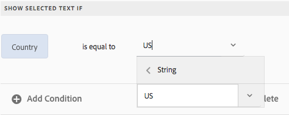

# Texter i interaktiv kommunikation{#texts-in-interactive-communications}

## Översikt {#overview}

Ett textdokumentfragment består av ett eller flera textstycken. Ett stycke kan vara statiskt eller dynamiskt. Ett dynamiskt stycke kan innehålla egenskaper och variabler för formulärdatamodellen. Du kan också använda regler och upprepa i ett textdokumentfragment. Kundnamnet i en hälsningsfras kan till exempel vara en FDM-egenskap (Form Data Model) vars värde är tillgängligt vid körning. Genom att ändra dessa värden kan samma interaktiva kommunikation användas för att förbereda interaktiv kommunikation för olika kunder med hjälp av agentens användargränssnitt.

Textdokumentavsnittet i Interaktiv kommunikation har stöd för följande typer av dynamiska data:

* **Datamodellsobjekt**: Dataegenskaperna använder en backend-datakälla.
* **Regelbaserat innehåll**: Delar av innehållet i en text som visas eller döljs baserat på en regel. En regel kan också baseras på egenskaper och variabler för formulärdatamodellen.
* **Variabler**: I textdokumentfragment är variabler inte bundna till en backend-datakälla. Agenten fyller i/väljer värden i variabler eller binder variablerna till datakällor när den förbereder interaktiva kommunikationen för att skicka den till en postprocess.
* **Upprepa**: Du kan ha dynamisk information i din interaktiva kommunikation, t.ex. transaktioner i en kreditkortsräkning, vars antal kan ändras kontinuerligt för varje genererad interaktiv kommunikation. Om du använder upprepning kan du formatera och strukturera sådan dynamisk information. Mer information finns i [Textbundna villkor och upprepa](https://helpx.adobe.com/experience-manager/6-3/forms/using/cm-inline-condition.html).

## Skapa text {#createtext}

1. Välj **[!UICONTROL Formulär]** > **[!UICONTROL Dokumentfragment]**.
1. Välj **[!UICONTROL Skapa]** > **[!UICONTROL Text]**.
1. Ange följande information:

   * **[!UICONTROL Titel]**: (Valfritt) Ange titeln för textdokumentfragmentet. Titlar behöver inte vara unika och kan innehålla specialtecken och tecken som inte är engelska. Texterna refereras till av sina titlar (om de är tillgängliga) som miniatyrbilder och egenskaper.
   * **[!UICONTROL Namn]**: Det unika namnet på texten, i en mapp. Det får inte finnas två dokumentfragment (text, villkor eller lista) i något läge med samma namn i en mapp. I fältet Namn kan du bara ange engelska tecken, siffror och bindestreck. Fältet Namn fylls i automatiskt baserat på fältet Titel. De specialtecken, blanksteg, siffror och icke-engelska tecken som anges i fältet Titel ersätts med bindestreck i fältet Namn. Även om värdet i fältet Titel automatiskt kopieras till namnet kan du redigera värdet.

   * **[!UICONTROL Beskrivning]**: Skriv en beskrivning av texten.
   * **[!UICONTROL Formulärdatamodell]**: Du kan också välja alternativknappen Formulärdatamodell om du vill skapa texten baserat på en formulärdatamodell. När du väljer alternativknappen för formulärdatamodell visas fältet **[!UICONTROL Formulärdatamodell]** . Bläddra och välj en formulärdatamodell. När du skapar text och villkor för en interaktiv kommunikation måste du se till att du använder samma datamodell som du tänker använda i den interaktiva kommunikationen. Mer information om formulärdatamodell finns i [Dataintegrering](/help/forms/using/data-integration.md).

   * **[!UICONTROL Taggar]**: Om du vill skapa en egen tagg anger du ett värde i textfältet och trycker på Retur. När du sparar den här texten skapas de nya taggarna.

1. Tryck på **[!UICONTROL Nästa]**.

   Sidan Skapa text visas. Om du har valt att skapa en formulärdatamodellbaserad text visas egenskaperna för formulärdatamodellen i den vänstra rutan.

1. Skriv texten och använd följande alternativ för formatering, villkorsändring och infogning av egenskaper och variabler för formulärdatamodeller i texten:

   * [Formulärdatamodell](#formdatamodel)
   * [Variabler](#variables)
   * [Regelredigerare](#rules)
   * [Formateringsalternativ](#formatting)

      * [Kopiera och klistra in formaterad text från andra program](#paste)

      * [Markera delar av text](#highlight)
   * [Upprepa](/help/forms/using/cm-inline-condition.md)
   * [Specialtecken](#special)
   * [Söka och ersätta text](#searching)
   * [Kortkommandon](/help/forms/using/keyboard-shortcuts.md)
   >[!NOTE]
   >
   >Du kan lägga till element i formulärdatamodellen, element i dataordlistan och variabler med symbolen @ i textredigeraren. När du anger en sträng som föregås av @ i textredigeraren genomsöks alla datamodellselement, datamordlisteelement och variabler, och element eller variabler som innehåller den sökda strängen visas. Du kan navigera bland sökresultaten och välja ett element eller en variabel. Om det inte finns något matchande resultat visas meddelandet *Inga matchande resultat hittades* .

1. Tryck på **[!UICONTROL Spara]**.

   Texten skapas. Nu kan du använda texten som byggsten när du skapar en interaktiv kommunikation.

## Redigera text {#edittext}

Du kan redigera ett befintligt textdokumentfragment genom att följa stegen nedan. Du kan också redigera ett textdokumentfragment i en interaktiv kommunikationsredigerare.

1. Välj **[!UICONTROL Formulär]** > **[!UICONTROL Dokumentfragment]**.
1. Navigera till ett textdokumentfragment och markera det.
1. Tryck på **[!UICONTROL Redigera]**.
1. Gör de ändringar som krävs. Mer information om alternativ i text finns i [Skapa text](#createtext).
1. Tryck på **[!UICONTROL Spara]** och sedan på **[!UICONTROL Stäng]**.

## Anpassa ett textdokumentfragment med hjälp av egenskaper för formulärdatamodell {#formdatamodel}

Du kan anpassa textdokumentfragment genom att infoga egenskaper för formulärdatamodellen. Genom att infoga egenskaper för formulärdatamodellen i text kan du hämta och fylla i mottagarspecifika data från den associerade datakällan samtidigt som du förhandsgranskar en interaktiv kommunikation. Mer information om formulärdatamodell finns i [AEM Forms-dataintegrering](/help/forms/using/data-integration.md).

Om du har angett en formulärdatamodell när du skapar en text visas egenskaperna i formulärdatamodellen i den vänstra rutan i textredigeraren. Den angivna formulärdatamodellen ska vara densamma för textdokumentfragmentet och den interaktiva kommunikation som innehåller det.

* Om du vill infoga en formulärdatamodellsegenskap i text placerar du markören där du vill infoga egenskapen, markerar **[A]** -egenskapen i den vänstra rutan genom att trycka på den och trycker sedan på **[!UICONTROL [B]Lägg till markerad]**. Du kan också bara dubbeltrycka på egenskapen för att infoga den vid**[ C ]**-markörens position. Egenskaper för formulärdatamodellen markeras med en bakgrundsfärg i webbläsaren.

Du kan också söka efter och lägga till en formulärdatamodellsegenskap med symbolen @ i textredigeraren. Placera markören där du vill infoga egenskapen. Skriv @ följt av söksträngen. Sökåtgärden utförs på alla formulärdatamodegenskaper och variabler som är tillgängliga i dokumentfragmentet. Egenskaperna eller variablerna som innehåller söksträngen hämtas och visas som en nedrullningsbar lista. Navigera genom sökresultaten och klicka på den egenskap som du vill infoga vid markörens plats. Tryck på Esc för att dölja sökresultaten.

* Om du vill att agenterna ska kunna redigera värdet för en formulärdatamodellegenskap i agentens användargränssnitt medan [Förbered och skicka interaktiv kommunikation](/help/forms/using/prepare-send-interactive-communication.md) med agentens användargränssnitt, trycker du på **[D]** -låsikonen för den egenskapen och ser till att den är i ett olåst läge. Egenskapens standardläge är låst och en agent kan inte redigera egenskapen i agentens användargränssnitt.

Du kan också använda egenskaper för formulärdatamodell för att konstruera regler för att visa eller dölja delar av innehåll. Mer information finns i [Skapa regler i text](#rules).

## Skapa och använda variabler i ett textdokumentfragment {#variables}

Variabler är platshållare som kan bindas när du skapar en interaktiv kommunikation. Variabler kan bindas till en formulärdatamodell eller ett textfragment. Variabler kan också lämnas kvar så att agenten kan fylla i dem.

Du kan använda variabler i stället för formulärdatamodellsegenskaper när:

* Ett textdokumentfragment ska användas i flera interaktiva kommunikationer där bindningen måste vara annorlunda för olika interaktiva kommunikationer.
* Textdokumentfragmentet har ingen formulärdatamodell när det skapas. Du kan infoga variabler och senare binda dem till egenskaperna för formulärdatamodellen när du skapar den interaktiva kommunikationen.
* Du måste binda och hämta text från ett textdokumentfragment. Endast de textdokumentfragment som kan bindas till variabler ska inte ha några variabler inuti.

När du skapar eller redigerar ett textdokumentfragment kan du skapa och infoga variabler. Variablerna som du skapar visas på fliken Data i agentens användargränssnitt. Agenten anger värdena för variablerna medan [Förbered och skicka interaktiv kommunikation med agentens användargränssnitt](/help/forms/using/prepare-send-interactive-communication.md).

### Skapa variabler {#createvariables}

1. Tryck på **[!UICONTROL Variabler]** i den vänstra rutan.

   Rutan Variabler visas.

   

1. Tryck på **[!UICONTROL Skapa]**.

   Rutan Skapa variabler visas.

1. Ange följande information och tryck på **[!UICONTROL Skapa]**:

   * **[!UICONTROL Namn]** : Variabelns namn.
   * **[!UICONTROL Beskrivning]** : Du kan också ange en beskrivning av variabeln.
   * **[!UICONTROL Typ]** : Välj en typ av variabel: Sträng, Nummer, Boolean eller Datum.
   * **[!UICONTROL Tillåt endast]** specifika värden: För String- och Number-variabler kan du se till att agenten väljer från en viss uppsättning värden för en platshållare i agentens användargränssnitt. Om du vill ange värdeuppsättningen markerar du det här alternativet och anger sedan kommaavgränsade värden som tillåts i fältet **[!UICONTROL Värden]** .

1. Tryck på **[!UICONTROL Skapa]**.

   Variabeln skapas och visas i variabelrutan.

1. Om du vill infoga en variabel i texten placerar du markören på lämplig plats, markerar variabeln och trycker på **[!UICONTROL Lägg till markerade]**.

   

   Variabler markeras med ljusblå bakgrundsfärg, medan egenskaper för formulärdatamodell markeras med en bläddringsfärg.

   Du kan också söka efter och lägga till variabler med symbolen @ i textredigeraren. Placera markören där du vill infoga variabeln. Skriv @ följt av söksträngen. Sökåtgärden utförs på alla formulärdatamodegenskaper och variabler som är tillgängliga i dokumentfragmentet. Egenskaperna och variablerna som innehåller söksträngen hämtas och visas som en nedrullningsbar lista. Navigera genom sökresultaten och klicka på variabeln som du vill infoga vid markörens plats. Tryck på Esc för att dölja sökresultaten.

1. Tryck på **[!UICONTROL Spara]**.

## Skapa regler i text {#rules}

Med hjälp av regelredigeraren i en text kan du skapa regler som visar eller döljer textsträngar eller innehållsdelar baserat på **förinställda villkor**. Dessa villkor kan utformas utifrån:

* Strängar
* Nummer
* Matematiskt uttryck
* Datum
* Egenskaper för associerad formulärdatamodell
* Alla variabler som du kan ha skapat i texten

### Skapa regler i text {#create-rules-in-text}

1. När du skapar eller redigerar en text markerar du den textsträng, det stycke eller det innehåll som du vill göra villkorsstyrd med hjälp av regeln.

   

1. Tryck på **[!UICONTROL Skapa regel]**.

   Dialogrutan Skapa regel visas. Förutom sträng, tal, matematiskt uttryck och datum finns följande även i regelredigeraren för att skapa satser för reglerna:

   * Egenskaper för associerad formulärdatamodell
   * Alla variabler som du kan ha skapat
   Välj lämpligt alternativ som ska utvärderas.

    

   >[!NOTE]
   >
   >Samlingsegenskapen stöds inte för att skapa regler för villkorlig formatering och visning av text.

1. Välj lämplig operator för att utvärdera regeln, till exempel Är lika med, Innehåller och Börjar med.

   

1. Infoga det utvärderande uttrycket, värdet, datamodegenskapen eller variabeln.

   

   Regel som visar den markerade texten om mottagarens plats är USA enligt FDM-källdata

   * När du skapar eller redigerar en regel kan du också trycka på  (Ändra storlek) för att utöka dialogrutan Skapa regel/Redigera regel. I den utökade dialogrutan med hela fönster kan du dra och släppa egenskaper och variabler för formulärdatamodeller för att skapa regler. Tryck på Ändra storlek igen för att gå tillbaka till dialogrutan Skapa regel.
   * Du kan också skapa flera villkor i en regel.
   * Du kan också skapa överlappande regler, där en regel tillämpas på en del av ett innehåll som redan har en regel.

1. Tryck på **[!UICONTROL Klar]**.

   Regeln tillämpas. Texten eller innehållet som regeln används på markeras med grönt. När du håller pekaren över markeringens vänstra handtag visas den tillämpade regeln.

   

   När du klickar på den vänstra handtaget för den tillämpade regeln får du möjlighet att redigera eller ta bort regeln.

## Formatera text {#formatting}

När du skapar eller redigerar text ändras verktygsfältet beroende på vilken typ av redigeringar du väljer att göra: Stycke, Justering eller Lista:
[ 

Välj typ av verktygsfält: Stycke, Justering eller Lista

](assets/toolbarselection.png) Verktygsfältet 

Verktygsfältet Teckensnittsredigering

Justering (verktygsfält)

Verktygsfältet Lista

### Markera/framhäv textdelar {#highlight}

Markera texten och tryck på Markeringsfärg om du vill framhäva delar av text i ett redigerbart dokumentfragment.

Du kan antingen trycka direkt på grundfärgen **[A]** på paletten Grundfärger eller på **Välj** när du har använt reglaget **[B]** för att välja rätt färgton.

Du kan också gå till fliken Avancerat och välja lämplig nyans, ljushet och mättnad **[C]** för att skapa den exakta färgen och sedan trycka på Välj **[D]** för att använda färgen för att markera texten.

### Klistra in formaterad text {#paste}

Om du vill återanvända ett av flera textstycken som finns i ett annat program, till exempel från Microsoft® Word- eller HTML-sidor, kopierar och klistrar du in texten i textredigeraren. Formateringen av den kopierade texten behålls i textredigeraren.

Du kan kopiera och klistra in ett eller flera textstycken i ett redigerbart textdokumentfragment. Du kan t.ex. ha ett Microsoft® Word-dokument med en punktlista över godkända intyg för uppehälle, som följande:

Du kan kopiera och klistra in texten direkt från Microsoft® Word-dokumentet i ett redigerbart textdokumentfragment. Formateringen som punktlistor, teckensnitt och textfärger behålls i textdokumentfragmentet.

>[!NOTE]
>
>Formateringen av inklistrad text har dock vissa [begränsningar](https://helpx.adobe.com/aem-forms/kb/cm-copy-paste-text-limitations.html).

## Infoga specialtecken i text {#special}

Infoga vid behov specialtecken i dokumentfragmentet. Du kan till exempel använda paletten Specialtecken för att infoga:

* Valutasymboler som €,¥ och £
* Matematiska symboler som t.ex.¥, Ð och ^
* Interpunktionssymboler som ‟ och&quot;

Textredigeraren har inbyggt stöd för 210 specialtecken. Administratören kan [lägga till stöd för fler/anpassade specialtecken genom anpassning](/help/forms/using/custom-special-characters.md).

## Söka och ersätta text {#searching}

När du arbetar med textdokumentfragment som innehåller en stor mängd text måste du söka efter en viss textsträng. Du kan också behöva ersätta en viss textsträng med en alternativ sträng.

Med funktionen Sök och ersätt kan du söka efter (och ersätta) valfri textsträng i ett textdokumentfragment. Funktionen innehåller även en kraftfull sökning efter reguljära uttryck.

1. Öppna ett textdokumentfragment för [redigering](#edittext).
1. Tryck på **[!UICONTROL Sök och ersätt]**.

1. Ange den text du vill söka efter i textrutan **[!UICONTROL Sök]** och den nya texten (ersättningstexten) i textrutan **[!UICONTROL Ersätt]** och tryck på **[!UICONTROL Ersätt]**.

1. Om den sökta texten hittas ersätts texten med ersättningstexten.

   * Om en annan förekomst av söktexten hittas markeras den förekomsten i textdokumentfragmentet. Om du trycker på **[!UICONTROL Ersätt]** igen ersätts den markerade instansen och markören flyttas framåt, om en tredje instans hittas.
   * Om det inte går att hitta någon annan instans visas ett meddelande i dialogrutan Sök och ersätt: Slutet av modulen har nåtts.
   Du kan också trycka på Ersätt alla om du vill ersätta alla matchningar på en gång.

   Sök och ersätt innehåller även en kraftfull sökning efter reguljära uttryck. Om du vill använda regex i sökningen väljer du **[!UICONTROL Reg ex]** och trycker sedan på **[!UICONTROL Sök]** eller **[!UICONTROL Ersätt]**.

