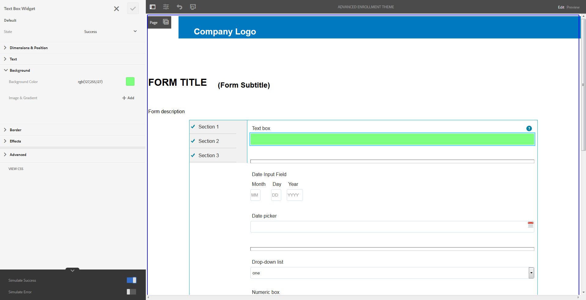

# Skapa och använda teman {#creating-and-using-themes}

## Introduktion {#introduction}

Du kan skapa och använda teman för att utforma en adaptiv form eller en interaktiv kommunikation. Ett tema innehåller formatinformation för komponenterna och panelerna. Format innehåller egenskaper som bakgrundsfärger, lägesfärger, genomskinlighet, justering och storlek. När du använder ett tema återspeglas det angivna formatet i motsvarande komponenter. Temat hanteras oberoende av varandra utan någon referens till en adaptiv form eller interaktiv kommunikation.

Du kan:

* Skapa ett tema
* Redigera och kopiera ett befintligt tema
* Hämta och överföra ett befintligt tema till AEM Forms-servern
* Hantera beroenden för ett tema

## Skapa, hämta eller överföra ett tema {#creating-downloading-or-uploading-a-theme}

Med AEM Forms kan du skapa, ladda ned och ladda upp teman. Ett tema skapas som andra resurser som formulär, dokument och brev. Temat sparas som en separat enhet, komplett med metaegenskaper som formulär. Teman som är en separat enhet tillåter återanvändning i flera adaptiva formulär och interaktiv kommunikation. Du kan också flytta ett tema till en annan instans av AEM Forms och återanvända det.

### Skapa ett tema {#creating-a-theme}

Så här skapar du ett tema:

1. Klicka på **Adobe Experience Manager**, klicka på **Formulär** och sedan på **Teman**.

1. Klicka på **Skapa > Tema**på sidan Teman.
En guide för att skapa ett tema startas.

1. Ange temats **namn** och **namn** på fliken Grundläggande i guiden Skapa tema. Dessa är obligatoriska fält.

1. På fliken Avancerat finns två fält:

   * **Klientlib-plats**: Plats i databasen där klienten för temat lagras.

   * **Kategorin** Clientlib: Innehåller ett textfält där du kan ange kategorinamn för temat.

1. Klicka på **Skapa** och sedan på **Redigera** för att öppna temat i temeredigeraren, eller klicka på **Klar** för att återgå till temasidan.

### Hämta ett tema {#downloading-a-theme}

Du kan exportera teman som en zip-fil och använda dem i andra projekt eller AEM-instanser. Så här hämtar du ett tema:

1. Klicka på **Adobe Experience Manager**, klicka på **Formulär** och sedan på **Teman**.

1. På sidan Teman **väljer** du ett tema och klickar på **Hämta**. En dialogruta med information om temat visas.

1. Klicka på **Hämta**. Temat laddas ned som en zip-fil.

>[!NOTE]
>
>Om du hämtar ett tema som har ett associerat adaptivt formulär och det tillhörande adaptiva formuläret är baserat på en anpassad mall, hämtar du även den anpassade mallen. När du överför det hämtade temat och anpassningsbara formulär till en AEM Forms-server överför du även den relaterade anpassade mallen.

### Överföra ett tema {#uploading-a-theme}

Du kan använda skapade teman med formatförinställningar i ditt projekt. Du kan importera temapaket som andra skapar genom att överföra dem till ditt projekt.

Så här överför du ett tema:

1. Klicka på **Adobe Experience Manager**, klicka på **Formulär** och sedan på **Teman**.

1. Klicka på **Skapa > Filöverföring** på sidan Teman.
1. I filöverföringsprompten bläddrar du till och väljer ett temapaket på datorn och klickar på **Överför**.
Det överförda temat är tillgängligt på temasidan.

## Metadata för ett tema {#metadata-of-a-theme}

Lista med metaegenskaper för ett tema (finns på egenskapssidan för ett tema).

<table>
 <tbody>
  <tr>
   <th>
<strong>ID</strong>
 
 
 </th>
   <th><strong>Namn</strong></th>
   <th><strong>Kan redigeras</strong></th>
   <th><strong>Egenskapsbeskrivning</strong></th>
  </tr>
  <tr>
   <td>1.</td>
   <td>Titel</td>
   <td>Ja</td>
   <td>Visningsnamn för temat.</td>
  </tr>
  <tr>
   <td>2.</td>
   <td>Beskrivning</td>
   <td>Ja</td>
   <td>Beskrivning av temat.</td>
  </tr>
  <tr>
   <td>3.</td>
   <td>Typ</td>
   <td>Nej</td>
   <td>
    <ul>
     <li>Typ av tillgång.</li>
     <li>Värdet är alltid tema.</li>
    </ul> </td>
  </tr>
  <tr>
   <td>4.</td>
   <td>Skapad</td>
   <td>Nej</td>
   <td>Datum när temat skapades</td>
  </tr>
  <tr>
   <td>5.</td>
   <td>Författarnamn</td>
   <td>Ja</td>
   <td>Författare till temat. Beräknas när temat skapas.</td>
  </tr>
  <tr>
   <td>6.</td>
   <td>Senast ändrat den</td>
   <td>Nej</td>
   <td>Datum när temat senast ändrades.</td>
  </tr>
  <tr>
   <td>7.</td>
   <td>Status</td>
   <td>Nej</td>
   <td>Temats status (ändrad/publicerad).</td>
  </tr>
  <tr>
   <td>8.</td>
   <td>Publicera i tid</td>
   <td>Ja</td>
   <td>Det är dags att automatiskt publicera temat.</td>
  </tr>
  <tr>
   <td>9.</td>
   <td>Publicera utanför tid</td>
   <td>Ja</td>
   <td>Det är dags att automatiskt avpublicera temat.</td>
  </tr>
  <tr>
   <td>10.</td>
   <td>Taggar</td>
   <td>Ja</td>
   <td>En etikett som är kopplad till temat för identifiering och som används för att förbättra sökningen.</td>
  </tr>
  <tr>
   <td>11.</td>
   <td>Referenser</td>
   <td>Länkar</td>
   <td>
    <ul>
     <li>Innehåller avsnittet 'Refererad av'. Visar formulär som använder temat.</li>
     <li>Eftersom temat inte refererar till någon annan resurs finns det inget referensavsnitt.</li>
    </ul> </td>
  </tr>
  <tr>
   <td>12.</td>
   <td>Klientlib-plats</td>
   <td>Ja</td>
   <td>
    <ul>
     <li>Den användardefinierade databassökvägen inom '/etc' där de klienter som motsvarar temat lagras.</li>
     <li>Standardvärde - '/etc/clientlibs/fd/themes' + relativ sökväg för temaresursen.</li>
     <li>Om platsen inte finns genereras mapphierarkin automatiskt.</li>
     <li>När det här värdet ändras flyttas nodstrukturen för klientlib till den nya plats som anges.  <em><strong>Obs!</strong> Om du ändrar standardplats för klientlib tilldelar du <code>crx:replicate, rep:write, rep:glob:*, rep:itemNames:: js.txt, jcr:read </code>och <code>forms-users</code> till <code>crx:replicate</code><code>jcr:read </code><code>fd-service</code> den nya platsen i CRXDE-databasen. Bifoga även en annan ACL genom att lägga till <code>deny jcr:addChildNodes</code> för <code>forms-user</code></em></li>
    </ul> </td>
  </tr>
  <tr>
   <td>13.</td>
   <td>Kategorinamn för Clientlib</td>
   <td>Ja</td>
   <td>
    <ul>
     <li>Det användardefinierade namnet för kategorin clientlib för det här temat.</li>
     <li>Ett fel visas om namnet redan används av något annat befintligt tema.</li>
     <li>Standardvärde - beräknas med hjälp av temaplatsen.</li>
     <li>När det här värdet ändras uppdateras kategorinamnet på motsvarande clientlib-nod. Det är inte nödvändigt att uppdatera Clientlib-kategorinamnet i jsp-filerna eftersom clientlib-kategorinamnet används som referens.</li>
    </ul> </td>
  </tr>
 </tbody>
</table>

## Om Theme Editor {#about-the-theme-editor}

AEM Forms levereras med Theme Editor. Det är ett användarvänligt och webbdesignervänligt gränssnitt för utvecklare som tillhandahåller funktioner som krävs för att enkelt specificera hur olika adaptiva formulär och interaktiva kommunikationselement ska formateras. När du skapar ett tema lagras det som en separat enhet, som formulär, interaktiv kommunikation, brev, dokumentfragment och dataordlistor.

Med Theme Editor kan du anpassa stilar för de komponenter som är formaterade i ett tema. Du kan anpassa hur ett formulär eller en interaktiv kommunikation ser ut på en enhet.

Temaredigeraren är uppdelad i två paneler:

* **Arbetsyta** - visas till höger. Här visas ett exempel på en adaptiv form eller interaktiv kommunikation där alla formatändringar återspeglas direkt. Du kan också markera objekt direkt på arbetsytan för att leta upp format som är kopplade till dem och redigera formaten. En enhetsupplösningslinjal längst upp styr arbetsytan. Om du väljer en brytpunkt för upplösning från linjalen visas förhandsvisningen av exempelformuläret eller den interaktiva kommunikationen för respektive upplösning. Arbetsytan beskrivs i detalj [nedan](../../forms/using/themes.md#using-canvas).

* **Sidofält**- visas på vänster sida. Den har följande objekt:

   * **Väljare:** Visar den komponent som är markerad för formatering och dess egenskaper som du kan formatera. Väljaren representerar alla komponenter av en typ. Om du väljer en textrutekomponent i ett tema för formatering ärver alla textrutor i formuläret eller den interaktiva kommunikationen formatet. Med väljare kan du välja en allmän komponent eller en specifik komponent för formatering. En fältkomponent är till exempel en allmän komponent och en textruta är en specifik komponent.

      **Formatera allmän komponent:**
Ett fält kan vara ett numeriskt fält, t.ex. age, eller ett textfält, t.ex. adress.
När du formaterar ett fält formateras alla fält, till exempel ålder, namn och adress.

      **Formateringsspecifik komponent**:
En specifik komponent påverkar objekt i den specifika kategorin. När du formaterar den numeriska rutkomponenten i temat ärver bara det numeriska ruteobjektet formatet.

      Ett textrutefält som adress är t.ex. längre och ett numeriskt rutefält som ålder är kortare. Du kan markera ett numeriskt rutfält, minska dess längd och använda det i formuläret. Bredden på alla numeriska rutfält minskas i formuläret.

      När du anpassar alla fältkomponenter med en viss bakgrundsfärg ärver alla fält, som ålder, namn och adress, bakgrundsfärgen. När du markerar en numerisk ruta, t.ex. ålder, och minskar bredden på den, minskas bredden på alla numeriska rutor, t.ex. ålder, antalet personer i en familj. Bredden på textrutor ändras inte.

   * **Läge:** Gör att du kan anpassa format för ett objekt i ett visst läge. Du kan till exempel ange hur ett objekt ska se ut när det är i standardläge, fokusläge, inaktiverat läge, hovring eller felläge.
   * **Egenskapskategorier:** Formategenskaper delas upp i olika kategorier. Till exempel Dimension &amp; Position, Text, Bakgrund, Kant och Effekter. Under varje kategori anger du formatinformation. Under Bakgrund kan du till exempel ange Bakgrundsfärg och Bild och övertoning.

   * **Avancerat:** Gör att du kan lägga till anpassad CSS till ett objekt, vilket åsidosätter de egenskaper som visuella kontroller definierar om det finns en överlappning.

   * **Visa CSS**: Gör att du kan visa CSS för den markerade komponenten
   I sidofältet finns dessutom en pil längst ned. När du klickar på pilen får du ytterligare två alternativ: **Simulera lyckade** och **simulera fel.** Dessa alternativ, tillsammans med de alternativ som beskrivs ovan, beskrivs i detalj [nedan](../../forms/using/themes.md#using-rail).

[ Redigera ](assets/themes-1.png) **A.** Sidofält **B.** Arbetsyta

### Formatkomponenter {#styling-components}

Du kan använda ett tema i flera adaptiva formulär och interaktiv kommunikation, som importerar komponentformateringen som du har angett i temat. Du kan formatera olika komponenter som titlar, beskrivning, paneler, fält, ikoner och textrutor. Använd widgetar för att konfigurera komponentegenskaper i ett tema. Det krävs ingen tidigare kunskap om CSS eller LESS, men det önskas även om du kan skriva CSS-kod eller använda anpassade väljare i avsnittet CSS-åsidosättningar. Avsnittet CSS-åsidosättningar visas när du markerar en komponent i sidofältet.

Alternativ i sidofältet som gör att du kan markera och formatera olika komponenter.

Om du klickar på redigeringsknappen mot en komponent i sidlisten markeras komponenten på arbetsytan. Du kan också formatera komponenten med alternativen i sidlisten.

Vissa komponenter som textruta, numerisk ruta, alternativknapp och kryssruta är kategoriserade under generiska komponenter som Fält. Du kan till exempel anpassa stilen på alternativknappar. Välj alternativknappar för formatering genom att välja **Fält > Widget > Alternativknapp**.

Klicka på **UTÖKA ALLA** i sidofältet om du vill visa, markera och formatera komponenter som inte är synliga framför.

### Layout på formatpanelen {#styling-panel-layouts-br}

Temana i AEM Forms stöder formatering av element i panelernas layout i formulär och interaktiv kommunikation. Formatering av element i färdiga layouter och anpassade layouter stöds.

De färdiga panelerna är:

* Tabbar till vänster
* Tabbar överst
* Dragspel
* Responsiv
* guide
* Mobil layout

   * Panelrubriker i sidhuvudet
   * Utan panelrubriker i sidhuvudet

Väljarna varierar för olika layouter.
Skräddarsydda layouter från Theme Editor innehåller:

* Definiera komponenterna för en layout som kan formateras och CSS-väljare för att unikt identifiera dessa komponenter
* Definiera CSS-egenskaper som kan tillämpas på dessa komponenter
* Definiera formaten för de här komponenterna interaktivt från användargränssnittet

### Olika format för olika skärmstorlekar {#different-styles-for-different-screen-sizes-br}

Skrivbords- och mobillayouter kan ha något eller helt olika format. För mobila enheter har surfplattor och telefoner liknande layouter förutom komponentstorlekar.

Använd Theme Editor-brytpunkter för att definiera alternativ formatering för olika skärmstorlekar. Du kan välja en basenhet eller upplösning som du börjar bygga temat på, och formatvariationerna för andra upplösningar genereras automatiskt. Du kan ändra formateringen för alla upplösningar.

>[!NOTE]
>
>Temat skapas först med hjälp av ett formulär eller en interaktiv kommunikation och används sedan på olika formulär eller interaktiv kommunikation. Brytpunkterna som används när teman skapas kan skilja sig från det formulär eller den interaktiva kommunikation som temat används i. CSS-mediefrågor baseras på det formulär eller den interaktiva kommunikation som används för att skapa teman, och inte på det formulär eller den interaktiva kommunikation som temat används på.

### Kontexten för formategenskaper ändras i sidofältet när objekt markeras {#styling-properties-context-changes-in-sidebar-on-selecting-objects}

När du markerar en komponent på arbetsytan visas dess formategenskaper i sidlisten. Markera objekttypen och dess läge och ange sedan dess format.

### Nyligen använda format i Theme Editor {#recently-used-styles-in-theme-editor}

Temaredigeraren cachelagrar upp till 10 format som används på en komponent. Du kan använda de cachelagrade formaten med andra komponenter i ett tema. Nyligen använda format är tillgängliga direkt under den markerade komponenten i sidlisten som en listruta. Till att börja med är listan över senast använda format tom.

När du formaterar en komponent cachelagras formaten och visas i listrutan. I det här exemplet är textrutans etikett formaterad för att ändra teckenstorlek och färg. Du kan följa liknande steg när du väljer en bild eller ändrar färger för att formatera en komponent. Lägg märke till hur formatet cachelagras och visas i listrutan när fältetikettens format ändras.

I det här exemplet ändras formatet för fältetiketten och när du väljer Responsiv panelbeskrivning för formatet läggs en listpost till i resursbiblioteket. Posten i resursbiblioteket kan användas för att ändra formatet för responsiv panelbeskrivning.

När ett format läggs till i resursbiblioteket är det tillgängligt för andra teman och i [formatläget](../../forms/using/inline-style-adaptive-forms.md) för formulärredigeraren eller det interaktiva gränssnittet för kommunikationsredigeraren. På samma sätt gäller att om du använder stilläget för formulärredigeraren eller gränssnittet för den interaktiva kommunikationsredigeraren när du formaterar en komponent cachelagras stilen och är tillgänglig i teman.

Med plusknappen mot resursbiblioteket kan du spara formatet med ett namn som du anger permanent. Med plusknappen sparas formatet även om du inte klickar på knappen Spara i sidlisten för att tillämpa formatet på en komponent. Den plusknapp som används för att spara ett format för senare bruk är inte tillgänglig i formatläget.

När du anger ett anpassat namn för ett format kopplas formatet till ett tema och är inte längre tillgängligt för andra teman. Så här tar du bort ett sparat format:

1. Klicka på **Temaalternativ**  > **Hantera format** i verktygsfältet CANVAS.
1. Välj ett sparat format i dialogrutan Hantera format och klicka på **Ta bort**.

   

### Förhandsgranska, spara och ignorera ändringar {#live-preview-save-and-discard-changes}

Ändringar som görs i formateringen återspeglas direkt i formuläret eller i interaktiv kommunikation som läses in på arbetsytan. Med direktförhandsvisning kan du interaktivt definiera och se hur formateringen påverkas. När du ändrar en komponents format aktiveras knappen **Klar** i sidofältet. Använd knappen **Klar** om du vill behålla ändringarna.

>[!NOTE]
>
>När ett ogiltigt tecken anges i ett fält ändras fältets färggräns till rött och ett felmeddelande visas i skärmens övre vänstra hörn. Om du t.ex. anger alfabet i en textruta som accepterar numeriska tecken som indata, har inmatningsramens kantlinjefärg ändrats till röd. Du kan inte spara ett sådant tema utan att lösa felet som visas högst upp.

### Tema med en annan anpassningsbar form eller interaktiv kommunikation {#theme-with-another-adaptive-form-or-interactive-communication}

När du skapar ett tema skapas det med ett formulär som levereras med Theme Editor. Du anger format för komponenter i det här formuläret. I stället för det formulär som levereras med Theme Editor kan du välja ett formulär eller en interaktiv kommunikation som du vill använda som formatering och förhandsgranska resultatet.

Så här ersätter du det aktuella formuläret eller den interaktiva kommunikationen på arbetsytan i temeredigeraren:

1. Klicka på **Temaalternativ** >  > **Konfigurera** på panelen TEMAREDIGERARE.

1. På fliken Allmänt bläddrar du och väljer ett formulär eller en interaktiv kommunikation för fältet **Adaptivt formulär/dokument** .

### Gör om/Ångra {#redo-undo}

Du kan ångra eller göra om oönskade ändringar som inträffar av misstag. Använd gör om-/ångra-knapparna på arbetsytan.

Ångra/gör om-knappar på arbetsytan

Knappar för att göra om/ångra visas när du formaterar en komponent i temeredigeraren.

## Använda Theme Editor {#using-the-theme-editor}

Med Theme Editor kan du redigera ett tema som du har skapat eller överfört. Navigera till **Formulär och dokument > Teman**, markera ett tema och öppna det. Temat öppnas i temaredigeraren.

Som nämnts ovan har temaredigeraren två paneler: Sidofältet och arbetsytan.

Anpassa framgångsläget för komponenten för textrutewidgeten i Theme Editor. Komponenten markeras i Canvas och dess läge markeras i sidlisten. De formateringsalternativ som finns i sidofältet används för att anpassa utseendet på en komponent.

### Använda Canvas {#using-canvas}

Temat skapas antingen i det färdiga formuläret eller med ett valfritt formulär eller interaktiv kommunikation. Arbetsytan visar förhandsgranskningen av formuläret eller den interaktiva kommunikation som används för att skapa temat med anpassningar som anges i temat. Linjalen ovanför formuläret används för att bestämma layouten baserat på visningsstorleken på enheten.

I verktygsfältet Arbetsyta ser du:

* **Växla panelen** Sida vid : Här kan du visa eller dölja sidofältet.
* **Temaalternativ** : Tillhandahåller tre alternativ

   * Konfigurera: Innehåller alternativ för att välja förhandsgranskningsformulär eller interaktiv kommunikation, grundläggande klientlib och typekit-konfiguration.
   * Visa tema-CSS: Genererar CSS för det valda temat.
   * Hantera format: Alternativ för att hantera text- och bildformat
   * Hjälp: Kör en guidad visning av en bild i Theme Editor.

* **Emulatorns** : Emulerar temats utseende för olika visningsstorlekar. En visningsstorlek behandlas som en brytpunkt i emulatorn. Du kan markera en brytpunkt och ange ett format för den. Skrivbordet och surfplattan är till exempel två brytpunkter. Du kan ange olika format för varje brytpunkt.

När du markerar en komponent på arbetsytan visas komponentens verktygsfält ovanpå. Med komponentverktygsfältet kan du välja komponenter eller växla till generiska komponenter. Du kan till exempel markera en numerisk textruta på en panel. Följande alternativ visas i komponentens verktygsfält:

* **Widget** för numeriska rutor: Gör att du kan markera komponenten och anpassa dess utseende i sidofältet.
* **Fältwidget**: Gör att du kan välja den generiska komponenten för formatering. I det här exemplet markeras alla textindatakomponenter (textruta/numerisk ruta/numerisk nummerlista/datumindata) för formatering.

* : Gör att du kan växla till en allmän komponent för formatering. Om du markerar en numerisk ruta och trycker på den här ikonen markeras fältkomponenten. Om du markerar en fältkomponent och trycker på den här ikonen markeras panelen. Om du fortsätter att trycka på den här ikonen för markering, kommer du att välja layouten för formatering.

>[!NOTE]
>
>Vilka alternativ som är tillgängliga i komponentverktygsfältet varierar beroende på vilken komponent du väljer.

Komponentverktygsfältet i den numeriska rutan på arbetsytan

### Använda sidofält {#using-rail}

Sidofältet i temeredigeraren innehåller alternativ för att anpassa format för komponenter i ett tema och använda väljare. Med väljarna kan du välja en grupp komponenter eller enskilda komponenter, och du kan söka efter väljare i sidofältet. Du kan skriva väljare för anpassade komponenter.

När du väljer en komponent på arbetsytan eller väljare i sidofältet visas alla alternativ som du kan använda för att anpassa dess format i sidlisten.
Nedan visas de alternativ som visas i sidofältet när du markerar en komponent:

* Läge
* Egenskapssida
* Simulera fel/lyckade

#### Läge {#state}

Ett läge är en indikator på användarinteraktion med en komponent. När en användare t.ex. anger feldata i en textruta ändras textrutans status till ett feltillstånd. Med temaredigeraren kan du ange format för ett visst läge.

Alternativen för att anpassa lägesformat varierar för olika komponenter.

#### Egenskapssida {#property-sheet}

<table>
 <tbody>
  <tr>
   <td><strong>Egenskap</strong></td>
   <td><strong>Användning</strong></td>
  </tr>
  <tr>
   <td>
Mått och position
 </td>
   <td>
Gör att du kan formatera justering, storlek, placering och placering av komponenter i temat. 
 
Du kan välja mellan visningsinställningar, utfyllnad, marginal, bredd, höjd och Z-index.
 
Du kan också använda layoutläget för att definiera komponenternas bredd med ett enkelt dra och släpp-gränssnitt. Mer information finns i <a href="../../forms/using/resize-using-layout-mode.md">Använda layoutläget för att ändra storlek på komponenter</a>.
 </td>
  </tr>
  <tr>
   <td>
Text
 </td>
   <td>
Här kan du anpassa textformaten i temats komponent.
 
Du vill till exempel ändra hur texten som anges i textrutan ser ut.
 
Du kan välja mellan teckensnittsfamilj, bredd, färg, storlek, radhöjd, textjustering, teckenavstånd, textindrag, understrykning, kursiv stil, textomformning, vertikal justering, baslinje och riktning. 
 </td>
  </tr>
  <tr>
   <td>
Bakgrund 
 </td>
   <td>
Gör att du kan fylla komponentens bakgrund med en bild eller en färg. 
 </td>
  </tr>
  <tr>
   <td>
Kantlinje
 </td>
   <td>
Här kan du välja hur kanten för komponenten ska se ut. Du vill till exempel att textrutan ska ha en djup röd, tjock kant med en prickad linje. 
 
Du kan välja mellan bredd, stil, radie och färg för ramen.
 </td>
  </tr>
  <tr>
   <td>
Effekter
 </td>
   <td>
Gör att du kan lägga till specialeffekter i komponenter som opacitet, blandningsläge och skuggor. 
 </td>
  </tr>
  <tr>
   <td>
Avancerat
 </td>
   <td>
Gör att du kan lägga till:

    <ul>
     <li>Egenskaper för <code>::before</code> - och <code>::after</code> pseudoelement om du vill lägga till innehåll efter eller före standardinnehållet i väljaren och formatera det.  Se <a href="https://www.w3schools.com/css/css_pseudo_elements.asp" target="_blank">CSS-pseudoelement</a>.</li>
     <li>Anpassad CSS-kod infogas i en komponent och anpassade väljare skrivs. </li>
    </ul> 
När du lägger till en anpassad CSS-kod åsidosätter den anpassningen som du lade till med alternativen i sidofältet. 
 </td>
  </tr>
 </tbody>
</table>

#### Simulera fel/lyckade {#simulate-error-success}

Alternativen Simulera fel och Slutfört finns längst ned i sidlisten. Du kan visa dem med en Visa/dölj-pil längst ned i sidlisten. Med hjälp av temaredigeraren kan du formatera olika lägen för en komponent.

Du kan till exempel lägga till ett numeriskt fält i formuläret och ange dess format i temaredigeraren. När en användare skriver ett alfanumeriskt värde i fältet vill du att bakgrundsfärgen för textrutan ska ändras. Du markerar det numeriska fältet i temat och använder lägesalternativet i sidofältet. Du väljer felläget i sidlisten och ändrar bakgrundsfärgen till röd. Om du vill förhandsgranska beteendet kan du använda alternativet Simulera fel i sidofältet. Alternativen Simulera fel och Slutfört beskrivs i detalj nedan:

* **Simulera lyckade**:
Gör att du kan se hur en komponent ser ut om du anger dess format för ett lyckat tillstånd. I ett formulär kan kunderna till exempel ange lösenord. Användare kan ange lösenord enligt de riktlinjer som du anger. När en användare skriver ett lösenord enligt alla riktlinjer du anger ändras textrutan till grön. När textrutan blir grön är den klar. Du kan ange en stil för en komponent i ett lyckat tillstånd och simulera dess utseende med alternativet Simulera lyckade.

* **Simulera fel**:
Gör att du kan se hur en komponent ser ut om du anger dess format för feltillstånd. I ett formulär kan kunderna till exempel ange lösenord. Användare kan ange lösenord enligt de riktlinjer som du anger. När en användare skriver ett lösenord som inte följer alla riktlinjer som du anger blir textrutan röd. När textrutan blir röd är den i feltillstånd. Du kan ange format för en komponent i feltillstånd och simulera dess utseende med alternativet Simulera fel.

### Formatera en komponent {#styling-a-component}

I ditt formulär finns det till exempel två typer av textrutor: en som bara accepterar numeriska värden och en annan som accepterar alfanumeriska värden. Du kan anpassa formateringen för textrutan som bara accepterar numeriska värden (en numerisk ruta).

Utför följande steg för att anpassa formateringen för en viss komponent (en numerisk ruta i det här exemplet):

1. I temeredigeraren markerar du den numeriska rutan på arbetsytan.
1. När du markerar den numeriska rutan visas komponentens verktygsfält med tre alternativ:

   * **Widget för Numerisk ruta**
   * **Fältwidget** på 

1. Välj **Numerisk rutwidget**.
1. Sidofältets rubrik ändras till Numerisk rutwidget och visar alternativ för att anpassa dess utseende.
Använd alternativet **Dimension och position** i sidofältet för att anpassa komponentens storlek. Kontrollera att läget är **Standard**.

I stället för att välja **Numerisk rutwidget** väljer du **Fältwidget** i komponentverktygsfältet och utför stegen ovan. När du väljer dimensioner för alternativet **Fältwidget** får alla textrutor utom den numeriska rutan samma storlek.

### Formatera fält för ett visst läge {#styling-fields-given-state}

Med komponentverktygsfältet kan du även ange komponentformat för de olika lägena. Om en komponent till exempel är inaktiverad är den i inaktiverat läge. Vanliga lägen för en komponent som du kan formatera i temaredigeraren är: Standard, Focus, Disabled, Error, Success och Hover. Du kan markera en komponent på arbetsytan och använda alternativet Läge i sidofältet för att anpassa dess utseende.

Följ de här stegen för att anpassa formateringen för en komponent i ett visst läge:

1. Markera en komponent på arbetsytan och välj lämpligt alternativ i komponentens verktygsfält.
I sidofältet visas alternativ för att anpassa komponentens format.
1. Välj ett läge i sidofältet. Exempel: Feltillstånd.
1. Använd alternativ som **Kant, Bakgrund** i sidlisten för att anpassa komponentens utseende.
1. Använd alternativet **Simulera fel** längst ned i sidlisten för att se hur formateringen ser ut vid redigering.

När du anpassar en komponents format efter att du har angett dess läge, visas anpassningen bara för komponenten för det angivna läget. Om du till exempel anpassar komponentens format när hovringsläget är markerat. Anpassningen visas för komponenten när du flyttar pekaren över komponenten i det återgivna formuläret eller den interaktiva kommunikationen som du använder temat för.

Om du vill simulera beteendet för andra lägen än fel och lyckade, använder du förhandsgranskningsläget. Om du vill använda förhandsgranskningsläget klickar du på **Förhandsgranska** i sidverktygsfältet.

### Formatera layouter för mindre skärmar {#styling-layouts-for-smaller-displays}

Använd linjalen på arbetsytan för att markera brytpunkter för enheter med mindre skärmar. Klicka på emulatorns  på arbetsytan för att visa linjaler och brytpunkter. Med brytpunkterna kan du förhandsgranska ett formulär eller interaktiv kommunikation för visningsstorlekar som gäller olika enheter som telefoner och surfplattor. Det finns stöd för flera visningsstorlekar i Theme Editor.

Så här formaterar du komponenter för olika brytpunkter:

1. Markera en brytpunkt ovanför linjalen på arbetsytan.
En brytpunkt representerar en mobil enhet och dess visningsstorlek.
1. Använd sidofältet för att anpassa formateringen av formulär eller interaktiva kommunikationskomponenter i temat för den valda visningsstorleken.
1. Se till att anpassningen sparas.

Du kan formatera formulär eller interaktiva kommunikationskomponenter för flera enheter. Formulär- och interaktiva kommunikationskomponenter för datorer och mobila enheter kan ha helt olika format.

### Använda webbteckensnitt i ett tema {#using-web-fonts-in-a-theme}

Du kan nu använda teckensnitt som finns i en webbtjänst i ett adaptivt formulär eller i en interaktiv kommunikation. Färdig, [Typekit](https://typekit.com/), Adobes webbteckensnittstjänst, är tillgänglig som en konfiguration. Om du vill använda Typekit skapar du ett kit och teckensnitt i det, och hämtar Kit-id från [Typekit-webbplatsen](https://typekit.com/).

Utför följande steg för att konfigurera Typekit i AEM:

1. I författarinstansen klickar du på adobeexperienceManagerAdobe Experience Manager > Tools  > Deployment > Cloud Services.
1. På sidan **Cloud Services** går du till **Tredjepartstjänster** > **Typekit** och klickar på **Konfigurera nu** under Typekit. Om det redan finns en konfiguration klickar du på **+** -knappen för att skapa en ny instans.
1. I dialogrutan **Skapa konfiguration** anger du en rubrik för konfigurationen och klickar på **Skapa**.

   Du omdirigeras till konfigurationssidan.

1. Ange ditt kit-ID i dialogrutan Redigera komponent som visas och klicka på **OK**.

Utför följande steg för att konfigurera ett tema så att det använder TypeKit-konfigurationen:

1. Öppna ett tema i temaredigeraren i författarinstansen.
1. Navigera till **Temaalternativ**  > **Konfigurera** i temaredigeraren.
1. I **fältet Typekit-konfiguration** väljer du ett kit och klickar på **Spara**.

   Nu ser du att teckensnitten har lagts till i temats egenskap font-family.

### Visa och välja teckensnitt i temaredigeraren {#listing-and-selecting-fonts-in-theme-editor}

Du kan använda tjänsten för temakonfiguration för att lägga till fler teckensnitt i temaredigeraren. Gör så här för att lägga till teckensnitt:

1. Logga in på AEM Web Console med administratörsbehörighet. URL:en för AEM Web Console är `https://'[server]:[port]'/system/console/configMgr`.
1. Öppna **tjänsten** Adaptiv formulärtemakonfiguration.

   

1. Klicka på +, ange teckensnittets namn och klicka på **Spara**. Teckensnittet läggs till och är tillgängligt i temaredigeraren.

#### Välja teckensnitt i temaredigeraren {#selecting-fonts-in-theme-editor}

Du kan använda plusknappen (+) för att lägga till ett teckensnitt. När du lägger till ett teckensnitt visas det i sidlisten.

Förutom alternativet för temakonfiguration kan du även lägga till ditt teckensnitt från temaredigeraren. Skriv det teckensnitt du vill använda i fältet för teckensnittsfamiljen under sidofältet och tryck på returtangenten på tangentbordet.

När du väljer ett teckensnitt läggs det till i listan över teckensnittsfamiljer. Du kan använda alternativet Mask i temaredigeraren för att inaktivera eller aktivera de listade teckensnitten.

Du kan se ändringen av komponentens teckensnitt.

Fältet Teckensnittsfamilj har stöd för flera teckensnitt. När du skriver ett teckensnitt letar webbläsaren efter det och använder det på den markerade komponenten. Om webbläsaren inte kan hitta något teckensnitt söker den efter ett teckensnitt som finns bredvid det i familjen. Du kan börja med att skriva det teckensnitt du söker efter. Om du inte hittar det teckensnitt du vill använda kan du skriva ett generiskt teckensnitt i familjen och använda det.

#### Maskformat som används i temaredigeraren {#mask-styles-applied-in-theme-editor}

Du kan maskera format som används i ett tema. I temaredigerarens sidlist kan du använda eyeicon för att inaktivera ett format som används. Om du till exempel ändrar dimensionerna för en komponent i ett formulär eller i en interaktiv kommunikation kan du använda maskknappen till vänster om en egenskap för att inaktivera den. När du sparar ett tema behålls de valda maskningsalternativen.

I exemplet nedan visas maskerade och omaskerade format i ett tema.

## Använda ett tema i ett formulär eller interaktiv kommunikation {#applying-a-theme-to-a-form-or-interactive-communication-br}

Så här använder du ett tema i ett anpassat formulär:

1. Öppna formuläret i redigeringsläge. Om du vill öppna ett formulär i redigeringsläge markerar du ett formulär och klickar på **Öppna**.
1. Markera en komponent i redigeringsläget, klicka på  > **Adaptiv formulärbehållare** och klicka sedan på .

   Du kan redigera egenskaperna för formuläret i sidlisten.

1. Klicka på **Format** i sidlisten.
1. Välj temat i listrutan **Adaptivt** formulärtema och klicka på **Klar** .

Så här använder du ett tema i en interaktiv kommunikation:

1. Öppna din interaktiva kommunikation i redigeringsläge. Om du vill öppna en interaktiv kommunikation i redigeringsläge markerar du ett formulär och klickar på **Öppna**.
1. Markera en komponent i redigeringsläget, klicka på  >**Dokumentbehållare** och klicka sedan på .

   Du kan redigera egenskaperna för formuläret i sidlisten.

1. Välj temat i listrutan **Tema** under** Basic** och klicka på **Done** 

### Ändra tema för ett formulär vid körning {#change-theme-of-a-form-at-runtime}

Ett tema formaterar olika komponenter i ett formulär. Du kan använda egenskapen för att dynamiskt ändra temat för ett formulär `themeOverride` . En vanlig URL för ett formulär är:

`https://<server>:<port>/content/forms/af/test.html`

Du kan använda parametern themeOverride för att tillämpa ett tema på körningen.

`https://<server>:<port>/content/forms/af/test.html?themeOverride=/content/dam/formsanddocuments-themes/simpleEnrollmentTheme`

Med det här `themeOverride` alternativet kan du ange en sökväg till ett tema. Formulärets tema ändras och formuläret uppdateras med uppdaterade format.

## Hämta specifikt utseende med teman {#specific-af-appearance}

Med AEM Forms, tillsammans med det färdiga standardtemat för arbetsytan, finns det många andra teman. Om du vill utforma formuläret eller interaktiv kommunikation med andra teman, tillsammans med ytterligare ändringar, kopierar du temat från temabiblioteksmappen. Klistra in de kopierade temana utanför temabiblioteksmappen och redigera det kopierade temat efter de ändringar du vill.

Så här kopierar du ett tema:

1. Gå till **Adobe Experience Manager > Formulär > Teman** i redigeringsinstansen.
1. Öppna mappen Temabibliotek.
1. I temabiblioteksmappen håller du pekaren över motsvarande färdiga tema och trycker på **Kopiera**.
1. Klistra in det kopierade temat utanför temabiblioteksmappen.
1. Anpassa det kopierade temat.

När du har anpassat temat kan du använda det i formuläret eller i den interaktiva kommunikationen.

>[!NOTE]
>
>Ändra inte de teman som är tillgängliga i temabiblioteksmappen. Den här mappen innehåller systemteman. Alla ändringar du har gjort i dessa teman skrivs över när du installerar en nyare version eller snabbkorrigering av AEM Forms.

## Inverkan på andra användningsområden för anpassade formulär {#impact-on-other-adaptive-form-use-cases}

* **Publicera/avpublicera ett formulär:** När du publicerar ett formulär publiceras även det tema som används på (om det inte redan är publicerat)
* **Importera/exportera ett formulär:** När du importerar eller exporterar ett formulär importeras eller exporteras även det tillhörande temat automatiskt.
* **Referenser till ett formulär:** Avsnittet Referenser i formulärreferenser innehåller en extra post för temat.
* **Senast ändrad i ett formulär:** Uppdaterades när det associerade temat ändras.
* **A/B-testning:** Du kan använda ett annat tema för två versioner av formuläret i A/B-testning. Information om de två temana lagras individuellt på de två stödlinebehållarna.

## CSS-genereringssekvens {#css-generation-sequence}

När du väljer Visa CSS samlar temaredigeraren in all formatinformation och skapar en CSS. Den samlar in information i följande ordning:

1. En formatering som definieras i temats grundläggande klientbibliotek.
1. Användardefinierad formatering, som anges med egenskaperna i sidofältet.
1. CSS-format som tillhandahålls med alternativet CSS-åsidosättning.

En textrutas bakgrundsfärg är till exempel blå i basklientbiblioteket. Du ändrar den till rosa med hjälp av egenskaperna i sidlisten. När du genererar CSS ser du textrutans bakgrundsfärg som rosa. När bakgrundsfärgen har ändrats med hjälp av egenskaperna använder en annan författare alternativet CSS-åsidosättning för att ändra textrutan för bakgrundsfärgen till vit. När du genererar CSS ser du bakgrundsfärgen som vit i den genererade CSS-koden.

## Felsöka format {#debugging-styles}

När du anger format för komponenter i Theme Editor genereras en CSS. När du formaterar en allmän komponent formateras även flera komponenter som ingår i den. När du till exempel formaterar ett fält formateras även textrutan och etiketten i det. När du formaterar textrutan i fältet får den sin egen CSS. Om du vill felsöka den CSS som genererats för fältet och komponenten, innehåller Theme Editor alternativ som gör att du kan visa CSS.

Du kan se den genererade CSS-koden med följande alternativ:

* **Alternativet Visa CSS** i sidofältet: När du markerar en komponent i temat kan du se alternativet VISA CSS i sidofältet. Den visar den genererade CSS, inklusive CSS för `::before` - och `::after` pseudoelement.
* **Alternativet Visa tema i CSS** i verktygsfältet på arbetsytan: I verktygsfältet för arbetsytan klickar du på  > **Visa temans CSS**. Du kan se hela temats CSS som genererats från de egenskaper som du har definierat i Theme Editor.

## Felsökning, rekommendationer och bästa praxis {#troubleshooting-recommendations-and-best-practices}

* **Undvika resurser från ett annat tema**

   När du redigerar ett tema kan du bläddra bland och lägga till resurser (till exempel bilder) från andra teman. Du redigerar till exempel bakgrunden på en sida. Om du till exempel väljer **Sida** , > **Bakgrund** > **Lägg till** > **Bild**, visas en dialogruta där du kan bläddra bland och lägga till bilder i andra teman.

* Du kan stöta på problem med det aktuella temat om en resurs läggs till från ett annat tema och det andra temat flyttas eller tas bort. Du bör undvika att bläddra bland och lägga till resurser från andra teman.
* **Använda clientlib, temaredigerare och intern formatering**

   * **Basklientlib**:

      Basklientbiblioteket innehåller formatinformation. Om du vill använda formatinformation i klientbibliotek i teman.

      1. Navigera till **Experience Manager > Formulär > Teman**.
      1. Välj ett tema på sidan Teman och klicka på **Visa egenskaper**.
      1. Klicka på **Avancerat** på egenskapssidan som öppnas.
      1. Gå till fliken Avancerat, i fältet Klientbiblioteksplats, bläddra och välj det klientbibliotek som du vill använda.
      1. Click **Save**.
      Det format du anger i klientbiblioteket importeras i det tema som använder det. Du kan till exempel ange format för textruta, numerisk ruta och växla i klientbiblioteket. När du importerar ditt klientbibliotek till temat importeras format för textruta, numerisk ruta och växel. Du kan sedan formatera andra komponenter med hjälp av temaredigeraren.
Du kan också skapa ett tema, skapa kopior av det och sedan ändra formatet som finns i de kopierade temana för liknande användningsfall.
Se [Hämta specifikt utseende med teman](#specific-af-appearance)

   * **Theme Editor:**

      Med Theme Editor kan du skapa teman för att utforma formuläret eller för interaktiv kommunikation. Du kan ange komponenternas format i ett tema, vilket ger enhetlighet i utseende och känsla i flera formulär eller interaktiv kommunikation som du utvecklar. Du bör ange formatinformation i ett tema och sedan använda temat i ett formulär.

   * **Textbunden formatering:**

      Du kan formatera komponenter med stilläget i formuläret eller med den interaktiva kommunikationsredigeraren för flera kanaler när du arbetar med ett formulär. Om du använder formatläge för att ändra formulärkomponentens format åsidosätts den formatering som anges i temat. Om du vill ändra format för vissa komponenter i ett visst formulär läser du i [Textbunden formatering för komponenter](../../forms/using/inline-style-adaptive-forms.md).

* **Använda bibliotek på klientsidan**

   Om du vill skapa klientbibliotek för att importera formatinformation läser du [Använda bibliotek](/help/sites-developing/clientlibs.md)på klientsidan. När du har skapat ett klientbibliotek kan du importera det till ditt tema enligt stegen ovan.

* **Ändra layoutbredd för behållarpanelen**

   Du bör inte ändra bredden på behållarpanelens layout. När du anger bredden på en behållarpanel blir den statisk och anpassas inte till olika skärmar.

* **När formulärredigeraren eller temaredigeraren ska användas för att arbeta med sidhuvud och sidfot**

   Använd temaredigeraren om du vill formatera sidhuvud och sidfot med formatalternativ som teckensnittsformat, bakgrund och genomskinlighet.
Om du vill ange information som logotypbild, företagsnamn i sidhuvud och copyrightinformation i sidfoten använder du alternativen för formulärredigeraren.
