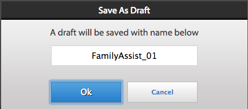

# Arbeta med att göra-listor{#working-with-to-do-lists}

När du visar dina Att göra-listor kan du se uppgifter från en affärsprocess som är tilldelade dig, eller till grupper som du tillhör eller som är delade uppgifter för andra användare. Du kan öppna, arbeta med och slutföra uppgifter efter behov, till exempel godkänna eller avvisa en begäran eller lägga till mer information. När du har slutfört en uppgift skickas den till nästa person i affärsprocessen,

## Om att göra-listor {#about-todo-lists}

På arbetsytan i AEM Forms finns följande tre typer av Att göra-listor:

* Enskilda listor, som innehåller uppgifter som har tilldelats direkt till dig.
* Grupplistor, som innehåller uppgifter som har tilldelats en grupp. Alla medlemmar i gruppen kan öppna och slutföra uppgifterna. Om du vill öppna en uppgift måste en medlem i en grupp göra anspråk på uppgiften först.
* Delade listor, som innehåller uppgifter som har tilldelats en användare som har delat sin Att göra-lista med dig och eventuellt andra användare. Alla användare som delar en lista kan göra anspråk på, öppna och slutföra delade uppgifter.

Du kan utföra vissa åtgärder utan att öppna uppgiften genom att klicka på de ikoner som visas när du håller pekaren över en uppgift.

>[!NOTE]
>
>En utropstecken anger att uppgiften har hög prioritet.

## Vanliga uppgifter {#typical-tasks}

När du öppnar och arbetar med en uppgift beror de verktyg som är tillgängliga på uppgiften. Olika åtgärder kräver att du utför olika åtgärder och av den anledningen kanske vissa verktyg inte är tillgängliga. De typiska uppgifter du kan få beskrivs nedan.

**Ange information**: Du får en uppgift som kräver att du fyller i och skickar ett formulär.

**Granska information**: Du får en uppgift som kräver att du granskar informationen och signerar innehållet.

**Fleranvändargranskning**: Du får en uppgift samtidigt som andra användare tar emot uppgiften. Du och de andra användarna måste antingen ange information eller granska innehållet, eller båda. Följande verktyg kan vara tillgängliga för den här typen av uppgifter:

* Visa instruktionerna för uppgiften
* Visa slutförandestatus för alla användare som har tilldelats uppgiften
* Visa kommentarer för alla användare som har tilldelats uppgiften
* Lägga till kommentarer till uppgiften själv

Ytterligare verktyg som kan vara tillgängliga med någon av ovanstående åtgärder är bland annat följande:

* Framåt
* Dela
* Konsult
* Retur
* Anteckningar
* Bifogade filer

## Öppna uppgifter {#opening-tasks}

Du kan öppna och låsa uppgifter från din att göra-lista eller göra anspråk på och öppna uppgifter från en grupp eller delad att göra-lista. När du öppnar en uppgift visas den i huvudrutan. De andra uppgifterna visas i uppgiftslistan bredvid listan Att göra.

Om det finns en URL för uppgiftssammanfattning öppnas vyn Sammanfattning som standard i stället för formuläret som är kopplat till en uppgift. Även om en användare aktiverar alternativet&quot;Öppna formuläret i maximerat läge&quot; i Tilldela uppgift, öppnas inte formuläret i maximerat läge.

>[!NOTE]
>
>När du öppnar en uppgift, beroende på vad som är standard för uppgiften, kan det tillhörande formuläret visas i helskärmsläge.

### Öppna och låsa en uppgift från listan {#open-and-lock-a-task-from-your-list}

När du öppnar en uppgift från din att göra-lista kan du låsa uppgiften om listan delas, så att ingen annan användare som har åtkomst till listan kan arbeta med uppgiften.

1. På sidan Att göra väljer du din lista för att göra i den vänstra rutan. Alla åtgärder visas i den mittersta rutan.

   >[!NOTE]
   >
   >Du kan filtrera uppgifterna genom att välja processtypen i listan Att göra. Du kan välja att göra-listan och visa alla uppgifter i att göra-listan igen.

1. Lås uppgiften om det behövs. Om du vill låsa en uppgift klickar du på ikonen Alla alternativ för uppgiften och väljer Lås. Håll pekaren över uppgiften för att alternativet ska vara tillgängligt.

   >[!NOTE]
   >
   >Du kan även låsa eller låsa upp en uppgift på en flik när uppgiften är öppen.

   

   Menyn Alla alternativ för en uppgift

1. Öppna uppgiften genom att klicka på den.

### Öppna och begära en uppgift från en delad lista eller grupplista {#open-and-claim-a-task-from-a-shared-or-group-list}

När du öppnar och gör anspråk på en uppgift från en grupp eller delad lista, flyttas uppgiften från gruppen eller den delade listan till din individuella Att göra-lista. Andra användare med åtkomst till listan hindras från att arbeta med uppgiften.

1. Välj en grupp eller delad Att göra-lista i den vänstra rutan. Alla åtgärder visas i den mittersta rutan.
1. Gör något av följande:

   * Om du vill göra anspråk på en uppgift, utan att öppna den, från en grupp eller delad Att göra-lista, klickar du på **Gör anspråk** genom att hålla pekaren över uppgiften. När en uppgift är öppen är anspråksknappen också tillgänglig i åtgärdsfältet nedanför åtgärdsrutan. När du gör anspråk på en uppgift flyttas den från gruppen eller den delade Att göra-listan till din lista.
   * Om du vill göra anspråk på och öppna en uppgift från en grupp eller delad Att göra-lista klickar du på **Gör anspråk på och öppnar**.

## Arbeta med uppgifter {#working-with-tasks}

När du har öppnat en uppgift beror uppgiften på vilka flikar som visas i huvudrutan och vilka verktyg som är tillgängliga. Flikarna som du kan se beskrivs nedan:

**Aktivitetssammanfattning**: När en uppgift öppnas kan du i rutan Sammanfattning av uppgifter visa information om uppgiften, om den finns, med en URL som anges i processen vid steget Tilldela uppgift. Om du använder åtgärdssammanfattningsfönstret kan ytterligare och relevant information för en uppgift visas för att öka värdet för slutanvändaren av arbetsytan i AEM Forms. Fliken är inte tillgänglig om URL:en för uppgiftssammanfattning inte finns.

**Information**: Ger information om den aktuella uppgiften och processen som den tillhör.

**Formulär**: Visar formuläret som är associerat med uppgiften. Formuläret kan vara av många filtyper, bland annat PDF, HTML, Guide och SWF. Formuläret kan se ut som ett vanligt utskrivbart eller webbaserat formulär eller vägleda dig genom en serie guideliknande paneler för att samla in information.

**Historik**: Visar de uppgifter som ingår i processinstansen och det tillhörande formuläret, uppgiftstilldelningar och bilagor för varje uppgift.

**Bifogade filer**: Visar befintliga bilagor som är associerade med uppgiften och lägger till bilagor, om det behövs.

**Anteckningar**: Visar befintliga anteckningar som är associerade med uppgiften och lägger till anteckningar om det behövs.

När du arbetar med en uppgift beskrivs de verktyg du kan se och de åtgärder du kan vidta nedan.

### Vidarebefordra, dela eller rådfråga en uppgift {#forward-share-or-consult-on-a-task}

Du kan vidarebefordra en uppgift tillsammans med anteckningar eller bilagor till en annan användare eller dela uppgiften eller rådfråga en annan användare. Om du ändrar formulärdata som är kopplade till en uppgift, sparar du formuläret som ett utkast innan du vidarebefordrar, delar eller läser uppgiften. Annars skickas uppgiften utan det uppdaterade formuläret. När du har vidarebefordrat och delat en uppgift kan den användare som tar emot uppgiften göra anspråk på och slutföra den eller returnera den till dig. Om du läser en uppgift kan användaren bara returnera uppgiften till dig.

1. Om du ändrar ett formulär som är kopplat till en uppgift som du vill behålla klickar du på **Spara**. Alternativet Spara är tillgängligt i åtgärdsfältet längst ned på varje flik. Annars skickas uppgiften utan det uppdaterade formuläret.

   >[!NOTE]
   >
   >Knappen Spara är inte tillgänglig för vissa formulär, beroende på vilken åtgärd du arbetar med.

1. Klicka på någon av följande knappar på en flik:

   * **Framåt**
   * **Dela**
   * **Konsult**
   >[!NOTE]
   >
   >Beroende på vilken uppgift det är kan du även utföra dessa åtgärder från Att göra-listan utan att öppna uppgiften.

1. I popup-dialogrutans fönster söker du efter och markerar namnet på användaren som ska vidarebefordra, dela eller läsa uppgiften med.

### Returnera en uppgift {#return-a-task}

1. Klicka på **Retur** på valfri flik. Uppgiften återgår till att göra-listan för den användare som tidigare vidarebefordrade uppgiften till dig, eller som delade eller konsulterade uppgiften med dig.

### Ta en uppgift offline {#take-a-task-offline}

Du kan arbeta med en uppgift offline och senare skicka in formuläret från Adobe® Reader® eller Adobe® Acrobat® Professional eller Adobe® Acrobat® Standard. När formuläret skickas startas din e-postklient med rätt e-postadress för servern. Du kan sedan skicka det ifyllda formuläret via e-post till servern.

1. Klicka på **Offline** på valfri flik.
1. Ange ett filnamn för att spara formuläret under och klicka på **Spara**. Formuläret som är kopplat till uppgiften sparas lokalt och uppgiften finns kvar i din Att göra-lista tills formuläret skickas.

### Arbeta med bilagor {#work-with-attachments}

Du kan lägga till, uppdatera, ta bort eller spara bifogade filer lokalt.

**Lägg till en bifogad fil**

1. Klicka på **Bläddra** på fliken **Bifogade filer** för att välja den fil som ska bifogas.
1. Välj **behörighetsnivå** för den bifogade filen för andra användare som deltar i processen. Om du väljer **Läs** kan andra användare spara filen lokalt. Om du väljer någon av redigeringsbehörigheterna kan andra användare även överföra en ny fil som ersätter den bifogade filen.

   >[!NOTE]
   >
   >Du kan också lägga till kommentarer bredvid dina bifogade filer.

1. Klicka på **Överför**. Filen bifogas till formuläret.

**Visa en bifogad fil**

1. Klicka på filnamnet på den bifogade filen på fliken **Bifogade filer** för att visa den.

**Spara en bifogad fil lokalt**

1. Klicka på en bifogad fil för att öppna den. Spara den öppna bifogade filen lokalt.

**Uppdatera en bifogad fil**

1. Klicka på **Redigera** för den bifogade filen. Välj den fil som du vill ersätta den befintliga bifogade filen med genom att klicka på **Bläddra**.

**Ta bort en bifogad fil**

1. Klicka på **Ta bort** för en bifogad fil.

### Spara arbetet utan att slutföra uppgiften {#save-your-work-without-completing-the-task}

1. Tryck på **Spara** på valfri flik.

   Dialogrutan Spara som utkast visas. Standardnamnet för utkastet är uppgiftsnamnet från uppgiftsmallen.

   

   >[!NOTE]
   >
   >Du kan konfigurera arbetsytan så att den information som användaren anger som ett utkast sparas automatiskt med jämna mellanrum. Om Spara automatiskt är aktiverat och en användare arbetar med ett utkast, sparas utkastet regelbundet. Om du sparar automatiskt används uppgiftens standardnamn automatiskt.
   >
   >
   >Mer information finns i Spara utkast regelbundet i [Hantera inställningar](/help/forms/using/getting-started-livecycle-html-workspace.md).

1. I dialogrutan Spara som utkast anger du ett unikt namn för uppgiften och trycker på **OK**.

   

   Utkastet sparas med det angivna namnet. Uppgiften finns kvar i din Att göra-lista och alla ändringar du har gjort i formuläret sparas i mappen Utkast. I din Att göra-lista kan du dessutom söka efter utkastet med utkastnamnet för att fortsätta arbeta med det.

   

## Slutföra uppgifter {#completing-tasks}

Hur du slutför en uppgift beror på själva uppgiften och din roll i processen. Du kan bli ombedd att godkänna eller neka en begäran, tillhandahålla innehåll, granska och verifiera information eller ange att du har agerat.

Du kan slutföra en uppgift på flera olika sätt:

* Använda de åtgärder som är tillgängliga på flikarna
* Använda de inbyggda åtgärderna i själva formuläret
* Från din Att göra-lista, utan att öppna uppgiftenObs! Det här alternativet är tillgängligt om `isMustOpenToComplete` fältet inte är markerat i `Assign Task` steget i Workbench när du utformar en process.
* Om du får e-postmeddelanden via e-post

När du har slutfört en uppgift kan en bekräftelsedialogruta visas som bekräftar åtgärden. Du kan till exempel se en dialogruta där du ombeds bekräfta att den information som du har angett är giltig.

>[!NOTE]
>
>Om du har ändrat en uppgift men inte är redo att slutföra den, kan du spara den som ett utkast genom att klicka på Spara och sedan gå tillbaka till den.

### Slutför en uppgift {#complete-a-task}

1. Utför något av följande steg:

   * Markera uppgiften och klicka på lämplig knapp för nästa steg som krävs i processen längst ned i listan.
   * Om formuläret inte har några knappar och knappen Slutför på arbetsytan i AEM Forms är tillgänglig klickar du på **Slutför**.
   * Om formuläret har knappar och knappen Slutför inte är tillgänglig på arbetsytan i AEM Forms klickar du på lämplig knapp i formuläret för nästa steg i processen.
   Om formuläret inte har några knappar och knappen Slutför i AEM Forms inte är tillgänglig visas ett meddelande om att formuläret inte kan skickas.

1. Om en bekräftelsedialogruta visas gör du något av följande:

   * Klicka på **OK** om du har slutfört uppgiften och är klar att signera den.
   * Klicka på **Avbryt** om du vill återgå till uppgiften och inte är redo att signera den.

>[!NOTE]
>
>Du kan se knappen Skicka i HTML-formulär när Processegenskaper används i ett formulär. Den här knappen visas inte när samma formulär återges som PDF. Slutför en åtgärd genom att klicka på knappen Skicka längst ned på AEM Forms-arbetsytan, utanför formuläret och inte på knappen Skicka i formuläret.

### Godkänn uppgifter gruppvis {#bulk-approve-tasks}

Du kan skicka flera uppgifter från din Att göra-lista. Det går endast att skicka uppgifter med samma process, med samma uppgiftsnamn, och samma flödesalternativ.

>[!NOTE]
>
>Det här alternativet är tillgängligt om fältet isMustOpenToComplete inte har valts i steget Tilldela uppgift i Workbench när en process designas.

1. På sidan Att göra väljer du din lista för att göra i den vänstra rutan. Alla åtgärder visas i den mittersta rutan.
1. Välj **Aktivera gruppläge**. Kryssrutor visas framför uppgifterna i listan.

   >[!NOTE]
   >
   >Det här alternativet är inte tillgängligt för uppgifter för vilka fältet isMustOpenToComplete har valts i steget Tilldela uppgift i Workbench när en process designas. Kryssrutor för sådana uppgifter i Att göra-listan förblir alltid inaktiverade.

1. Välj uppgifter för bulkgodkännande. Flera uppgifter i samma process, med samma uppgiftsnamn, och samma flödesalternativ kan väljas. När du har valt en uppgift för godkännande är det bara de uppgifter som har samma process, med samma uppgiftsnamn och samma flödesalternativ, som är aktiverade. Resten är inaktiverade.

   

1. Klicka på det tillgängliga alternativet Skicka. De valda uppgifterna skickas.

   

## Delta i uppgifter via e-post {#participating-in-tasks-through-email}

Du kan ta emot och slutföra uppgifter via e-post. Genom att delta i uppgifter via e-post slipper du regelbundet kontrollera din att-göra-lista innehåller nya uppgifter eller kontrollera om det finns status för en uppgift på spårningssidan.

Först anger du dina inställningar för AEM Forms-arbetsytan så att du får e-postmeddelanden. AEM Forms-arbetsytan kan skicka e-postmeddelanden för uppgifter i din Att göra-lista eller vilka gruppAtt göra-listor du tillhör. Administratören avgör när e-postmeddelanden skickas och vem som tar emot dem.

E-postmeddelandena kan innehålla en länk som öppnar uppgiften på arbetsytan i AEM Forms, en bifogad fil som används för uppgiften eller åtgärder för att slutföra uppgiften via e-post. Om ett formulär ingår i e-postmeddelandet kan du öppna formuläret och slutföra åtgärden om knapparna för att slutföra uppgiften finns i formuläret. Om åtgärder för att slutföra uppgiften ingår i e-postmeddelandet kan du slutföra uppgiften genom att klicka på åtgärderna i e-postmeddelandet eller genom att svara på e-postmeddelandet med åtgärden som är skriven som första rad i e-postmeddelandet.

**Obs**: Information om hur du konfigurerar arbetsytan så att den använder rätt e-postmallar finns i [AEM Forms JEE Administrator Guide](https://help.adobe.com/en_US/AEMForms/6.1/AdminHelp/).

När du slutför en uppgift via e-post tas uppgiften bort från din Att göra-lista på arbetsytan i AEM Forms.

>[!NOTE]
>
>Om användaren inte är inloggad på AEM Forms-arbetsytan i webbläsaren och öppnar en länk till en Att göra-uppgift, kan länken för att göra-uppgift inte öppnas och ett undantag visas. Logga in på arbetsytan i AEM Forms innan du klickar på länkar i e-postmeddelanden.

>[!NOTE]
>
>Du kan inte vidarebefordra ett e-postmeddelande för att tilldela en uppgift till någon annan. Du kan bara vidarebefordra uppgifter till andra användare från AEM Forms-arbetsytan.

### Ta emot e-postmeddelanden {#receive-email-notification-messages}

1. Klicka på **Inställningar**.
1. Välj **Ja** i listan **Meddela aktivitetshändelser via e-post**.
1. Om du vill inkludera formuläret och data med e-postmeddelandet väljer du **Ja** i listan **Bifoga formulär i e-post**.

## Delta i uppgifter via mobila enheter {#participating-in-tasks-through-mobile-devices}

Du kan använda arbetsyteappen AEM Forms för att delta i uppgifter från din mobila enhet. Innan du installerar programmet bör du kontakta systemadministratören för att kontrollera att din organisation stöder användningen av arbetsytan i AEM Forms.

## Om deadlines och påminnelser {#about-deadlines-and-reminders}

En *deadline* bestämmer vilket datum och vilken tid du måste slutföra en uppgift innan. När en deadline har passerats dirigerar servern aktiviteten till nästa steg i processen (som kan vara en annan användares Att göra-lista) och sedan visas deadlineikonen på uppgiften. Deadalikonen visas oavsett vilka regler som är kopplade till processen.

En *påminnelse* meddelar dig om en åtgärd som du behöver åtgärda. Påminnelser inträffar vid en förbestämd tidpunkt och sedan med regelbundna intervall tills du slutför den associerade uppgiften. När du får en påminnelse visas påminnelseikonen på uppgiften.

Affärsprocessen avgör beteende och tidpunkt för deadlines och påminnelser. Alla processer har inte deadlines och påminnelser. Administratören anger om e-postmeddelanden ska skickas för deadlines och påminnelser. Du kan ange om du vill få e-postmeddelanden.

## Arbeta med uppgifter från gruppköer och delade köer {#working-with-tasks-from-group-and-shared-queues}

Alla uppgifter som är tilldelade dig visas i listan Att göra (kö).

Alla grupper och delade Att göra-listor som du har åtkomst till visas också i den vänstra rutan på Att göra-sidan. Du kan slutföra uppgifter från alla Att göra-listor som du har tillgång till.

En lista med att göra-uppgifter för en grupp kan ha fler än en medlem. En administratör konfigurerar grupper att göra-listor baserat på organisationens specifika krav. Gruppera Att göra-listor är ett sätt att distribuera arbete bland flera personer som har liknande ansvarsområden.

Alla i teamet hanterar t.ex. låneblanketter. Alla dessa uppgifter skickas till en gruppAtt göra-lista som alla medlemmar i gruppen har åtkomst till. Varje medlem i din grupp har åtkomst till uppgifterna från Att göra-listan.

En delad Att göra-lista visas när en annan användare delar sin Att göra-lista med dig eller delar en uppgift explicit med dig. Sedan kan du visa uppgifterna i användarens Att göra-lista och slutföra dem för användarens räkning. Om du till exempel tar semester kan du välja att dela din Att göra-lista med en medarbetare som slutför dina uppgifter medan du är borta.

>[!NOTE]
>
>Du kan även ange inställningar för frånvaro för att vidarebefordra uppgifter till andra användare medan du är borta.

Om du vill arbeta med en uppgift från en grupp eller delad Att göra-lista, gör anspråk på uppgiften först. Du blir sedan ägare av uppgiften tills du slutför den eller vidarebefordrar den till en annan användare.

### Delningsköer {#sharing-queues}

Du kan dela din att göra-lista med en annan användare, som sedan kan visa de nya uppgifterna i din att göra-lista och agera på dem åt dig. Om det finns några uppgifter i din att göra-lista innan du delar din att göra-lista kan den andra användaren inte visa dem. Användaren kan bara visa och göra anspråk på de uppgifter som finns i din Att göra-lista efter att du har gett åtkomst till din Att göra-lista.

Tänk på att för att en användare ska kunna se en uppgift i en delad kö måste processdesignern aktivera alternativet Lägg till åtkomstkontrollista för delad kö på fliken ACL (Task Access Control List) i användartjänsten.

>[!NOTE]
>
>Om du tänker vara borta från kontoret kan du även ange inställningar för att vidarebefordra uppgifter till andra användare när du är borta, i stället för att dela hela din Att göra-lista.

**Dela din kö**

1. Klicka på ikonen + på fliken **Köer** på fliken **Inställningar** för Användare som för närvarande delar min kö.
1. Sök efter och välj namnet på användaren.
1. Klicka på knappen **Dela** för att dela kön med den valda användaren.
1. Markera namnet på användaren och klicka på **Dela**.

   >[!NOTE]
   >
   >Du kan ta bort en användare från att dela din Att göra-lista genom att klicka på **X** -ikonen i slutet av den rad där användaren finns med.

### Åtkomst till andra köer {#accessing-other-queues}

Du kan begära åtkomst till en annan användares Att göra-lista för att visa och göra anspråk på nya uppgifter i användarens Att göra-lista.

När du begär åtkomst till en annan användares Att göra-lista får användaren en uppgift i sin Att göra-lista för att antingen godkänna eller neka din begäran. När användaren har slutfört uppgiften får du ett meddelande i din Att göra-lista.

Om du får åtkomst till en annan användares Att göra-lista kan du inte visa några uppgifter som fanns i användarens Att göra-lista innan du beviljades åtkomst. Du kan bara visa de uppgifter som finns i användarens Att göra-lista efter att du har fått tillgång till Att göra-listan.

**Öppna en annan kö**

1. Öppna fliken **Köer** på fliken **Inställningar** .
1. Klicka på + för de användarköer som jag har åtkomst till. Sök efter användarens namn i popup-dialogrutan.
1. Markera namnet på användaren och klicka på **Begäran**.

   >[!NOTE]
   >
   >Du kan ta bort din åtkomst till en annan Att göra-lista genom att markera användarnamnet i listan Användare som jag har åtkomst till och klicka på **X** i slutet av raden där användarnamnet anges. Du kan inte ta bort din åtkomst till en annan Att göra-lista när en begäran om att få åtkomst till Att göra-listan fortfarande väntar.

## Ange inställningar utanför kontoret {#setting-out-of-office-preferences}

Om du tänker vara utanför kontoret kan du ange vad som ska hända med uppgifter som har tilldelats dig för den perioden.

Du kan ange startdatum och -tid och slutdatum och sluttid så att dina inställningar som inte är på kontoret börjar gälla. Om du befinner dig i en annan tidszon än servern används tidszonen för servern.

Du kan ange en standardperson som alla dina uppgifter skickas till. Du kan också ange undantag för uppgifter från specifika processer som ska skickas till en annan användare eller som ska finnas kvar i din Att göra-lista tills du kommer tillbaka. Om den utsedda personen även är utanför kontoret, kommer uppgiften att utföras av den användare som han/hon har utsett. Om uppgiften inte kan tilldelas till en användare som inte är utanför kontoret finns uppgiften kvar i din Att göra-lista.

>[!NOTE]
>
>När du inte är på kontoret finns alla uppgifter som tidigare fanns i din Att göra-lista kvar där och vidarebefordras inte till andra användare.

### Ange inställningar för frånvaro {#set-out-of-office-preferences}

1. Klicka på **Inställningar** och sedan på **Frånvaro**.
1. Gör något av följande för att ange när du inte är på kontoret:

   * Om du vill ange att du inte är på kontoret nu för en obegränsad tidsperiod väljer du **Frånvarande** i listan **Jag är för närvarande** , men lägger inte till något datumintervall.
   * Om du vill ange ett startdatum och en starttid som du inte är på kontoret och klickar på + för **Frånvaroschema**. Använd kalendern och tidslistan för att ange startdatum och starttid. Om du inte anger något slutdatum eller någon sluttid räknas du som ledig från kontoret på obestämd tid från startdatumet och -tiden tills du ändrar dina inställningar.

1. Om du vill ange hur dina uppgifter ska hanteras som standard, väljer du något av följande alternativ på menyn **Vid frånvaro: Standardanvändare för aktivitetslista** utanför kontoret:

   * Välj **Tilldela** inte om du vill behålla uppgifter i listan Att göra förrän du kommer tillbaka.
   * Välj **Sök efter användare** om du vill söka efter en användare som du vill tilldela uppgifter till. När du väljer en användare kan du även visa användarens frånvaroschema.

1. Om du vill ange undantag till standardinställningen klickar du på + för **Processundantag**, väljer den process som ett undantag ska skapas för och väljer sedan en annan användare eller väljer **Tilldela** inte från **listan som** ska tilldelas.

   >[!NOTE]
   >
   >Processdesignern kan ange att uppgifter från vissa processer alltid ska hållas privata och inte vidarebefordras till andra användare. Den här inställningen åsidosätter alla inställningar som du gör.

1. När du är klar med inställningarna klickar du på **Spara**. Om dina inställningar indikerar att du inte är på kontoret för tillfället, träder ändringarna i kraft omedelbart. Annars börjar de gälla vid angivet startdatum och angiven starttid. Om du loggar in när du inte är på kontoret beaktas du inte på kontoret förrän du ändrar dina inställningar.

[Kontakta supporten](https://www.adobe.com/account/sign-in.supportportal.html)
