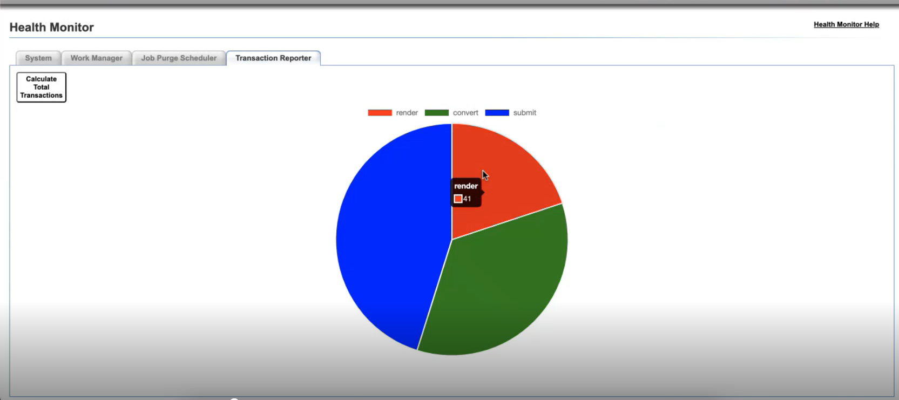

# Aktivera och visa transaktionsrapporter för AEM Forms i JEE {#transaction-reports-overview}

<!--Transaction reports in AEM Forms on JEE let you keep a count of all transactions taken place on your AEM Forms deployment. The objective is to provide information about product usage and helps business stakeholders understand their digital processing volumes. Examples of a transaction include:

* Submission of a document
* Rendition of a document
* Conversion of a document from one file format to another 

For more information on what is considered a transaction, see [Billable APIs](../../forms/using/transaction-reports-billable-apis-jee.md). Transaction log helps you to gain information about the number of documents submitted, rendered, and converted.-->

## Aktivera transaktionsrapportering {#enable-transaction-reporting}

Som standard är transaktionsregistrering inaktiverad. Så här aktiverar du transaktionsrapportering:

1. Navigera till `/adminui` på din AEM Forms på JEE, till exempel `http://10.14.18.10:8080/adminui`.
1. Logga in som **administratör**.
1. Gå till **Inställningar** > **Systeminställningar** > **Konfigurationer**.
1. Klicka i kryssrutan för att **aktivera transaktionsrapportering** och **spara** inställningarna.

   

1. Starta om servern.
1. Förutom ändringarna på servern måste du på klientsidan uppdatera filen `adobe-livecycle-client.jar` i ditt projekt, om du använder samma.

<!--
* You can [enable transaction recording](../../forms/using/viewing-and-understanding-transaction-reports.md#setting-up-transaction-reports) from AEM Web Console. view transaction reports on author, processing, or publish instances. View transaction reports on author or processing instances for an aggregated sum of all transactions. View transaction reports on the publish instances for a count of all transactions that take place only on that publish instance from where the report is run.
-->

<!--Do not author content (Create adaptive forms, interactive communication, themes, and other authoring activities) and process documents (Use workflows, document services, and other processing activities) on the same AEM instance. Keep the transaction recording disabled for AEM Forms servers used to author content. Keep the transaction recording enabled for AEM Forms servers used to process documents.-->

## Visa transaktionsrapport {#view-transaction-report}

När du aktiverar transaktionsrapportering blir informationen om antalet transaktioner tillgänglig via [transaktionsrapporten via kontrollpanelen](#transaction-report-dashboard) och en detaljerad [transaktionsrapport via loggfilen](#transaction-report-logfile). Båda förklaras nedan:

### Transaktionsrapport via kontrollpanelen {#transaction-report-dashboard}

Transaktionsrapport via kontrollpanelen ger totalt antal transaktioner för varje typ av transaktion. Du kan t.ex. få information om det totala antalet formulär som återges, konverteras och skickas enligt bilden. Så här hämtar du transaktionsrapporten:

1. Navigera till `/adminui` på din AEM Forms på JEE, till exempel: `http://10.13.15.08:8080/adminui`.
1. Logga in som **administratör**.
1. Klicka på Hälsoövervakning.
1. Navigera till fliken **Transaktionsrapportör**, klicka på **Beräkna totala transaktioner**, nu ser du att ett cirkeldiagram representerar antalet PDF forms som har skickats, återgetts eller konverterats.




### Transaktionsrapport via loggfil {#transaction-report-logfile}

Transaktionsrapport via loggfil innehåller detaljerad information om varje transaktion. Om du vill få åtkomst till transaktionsloggar följer du kontextsökvägen i förhållande till serverns start. Transaktioner hämtas som standard i en separat loggfil `transaction_log.log`. **filsökvägen** är relativ till serverns startkontext. Standardsökvägen för olika servrar anges nedan:

```
For Jboss Turnkey:
"<AEM_Forms_Installation>/jboss/bin/transaction_log.log"

For IBM Websphere: 
"<IBM_WAS_Profile_path>/transaction_log.log"

For Oracle Weblogic:
"<Weblogic_Domain_path>/transaction_log.log"

For Jboss Cluster:
"<Jboss home>/transaction_log.log"
```

Exempel på en exempeltransaktion:
`[2024-02-28 06:11:27] [INFO] TransactionRecord{service='GeneratePDFService', operation='HtmlFileToPDF', internalService='GeneratePDFService', internalOperation='HtmlFileToPDF', transactionOperationType='CONVERT', transactionCount=1, elapsedTime=1906, transactionDate=Wed Feb 28 06:11:25 UTC 2024}`

#### Transaktionspost {#transaction-record-structure-jee}

Transaktionsloggens struktur definierar hur varje transaktion registreras med hjälp av dess olika parametrar, till exempel service, operation, transaktionstyp och andra. Dessa ges i detalj nedan. Transaktionspostens struktur är följande:

```
TransactionRecord
{
    service='...', 
    operation='...', 
    internalService='...', 
    internalOperation='...', 
    transactionOperationType='...', 
    transactionCount=..., 
    elapsedTime=..., 
    transactionDate=...
}
```

* **service**: Tjänstens namn.
* **operation**: Åtgärdsnamn.
* **internalService**: Anroparens namn om det finns ett internt anrop, annars samma som tjänstens namn.
* **internalOperation**: Namnet på anroparen i det finns ett internt anrop, i annat fall samma som åtgärdsnamnet.
* **transactionOperationType**: Typ av transaktion (Submit, Render, Convert).
* **transactionCount**: Totalt antal transaktioner.
* **förfluten tid**: Tid mellan anropsinitieringen och mottaget svar.
* **transactionDate**: Tidsstämpeln anger när tjänsten anropades.

**Exempel på transaktionslogg**:

```
[2024-02-14 14:23:25] [INFO] TransactionRecord
{
    service='BarcodedFormsService', 
    operation='decode', 
    internalService='BarcodedFormsService', 
    internalOperation='decode', 
    transactionOperationType='CONVERT', 
    transactionCount=1, 
    elapsedTime=47405, 
    transactionDate=Wed Feb 14 14:22:37 UTC 2024
}
```

## Inspelningsfrekvens för transaktioner {#transaction-recording-frequency}

<!--Transaction persistence involves updating the total transaction count for SUBMIT, CONVERT, and RENDER operations on the server periodically: -->

Frekvensen för registrering av transaktioner bestäms av uppdateringsåtgärderna på servern för varje formulär som har skickats, återgetts eller konverterats.

* I **dashboard** uppdateras antalet transaktioner regelbundet, standardvärdet är 1 minut. Du kan uppdatera frekvensen genom att ställa in systemegenskapen på `"com.adobe.idp.dsc.transaction.recordFrequency"`. I AEM Forms för JEE på JBoss® lägger du till `-Dcom.adobe.idp.dsc.transaction.recordFrequency=5` i `JAVA_OPTS` för att ange uppdateringsfrekvensen till 5 minuter.

* I **transaktionsloggar** uppdateras varje transaktion omedelbart när ett formulär har skickats, återgetts eller konverterats.

<!-- A transaction remains in the buffer for a specified period (Flush Buffer time + Reverse replication time). By default, it takes approximately 90 seconds for the transaction count to reflect in the transaction report.

Actions like submitting a PDF Form, using Agent UI to preview an interactive communication, or using non-standard form submission methods are not accounted as transactions. AEM Forms provides an API to record such transactions. Call the API from your custom implementations to record a transaction.

## Supported Topology {#supported-topology}

Transaction reports are available only on AEM Forms on OSGi environment. It supports author-publish, author-processing-publish, and only processing topologies. For example, topologies, see [Architecture and deployment topologies for AEM Forms](../../forms/using/transaction-reports-overview.md).

The transaction count is reverse replicated from publish instances to author or processing instances. An indicative author-publish topology is displayed below:


>[!NOTE]
>
>AEM Forms transaction reports does not support topologies that contain only publish instances.

### Guidelines for using transaction reports {#guidelines-for-using-transaction-reports}

* Disable transaction reports on all author instances as reports on author instances includes transactions registered during authoring activities.
* Enable the **Show transactions from publish only** option on the author instance to view cumulative transactions from all publish instances. You can also view transaction reports on each publish instance for actual transactions on that particular publish instance only.
* Do not use author instances to run workflows and process documents.
* Before using transaction reporting, if you are have a toplogy with publish servers, ensure that the reverse replication is enabled for all the publish instances.
* Transaction data is reverse-replicated from a publish instance to only corresponding author or processing instance. The author or processing instance cannot further replicate data to another instance. For example, if you have author-processing-publish topology, aggregated transaction data is replicated only to the processing instance.-->

## Relaterade artiklar {#related-articles}

* [Lista över fakturerbara API:er för AEM Forms i JEE](../../forms/using/transaction-reports-billable-apis-jee.md)
* [Registrera en transaktion för anpassade komponent-API:er för AEM Forms i JEE](/help/forms/using/record-transaction-custom-component-jee.md)
