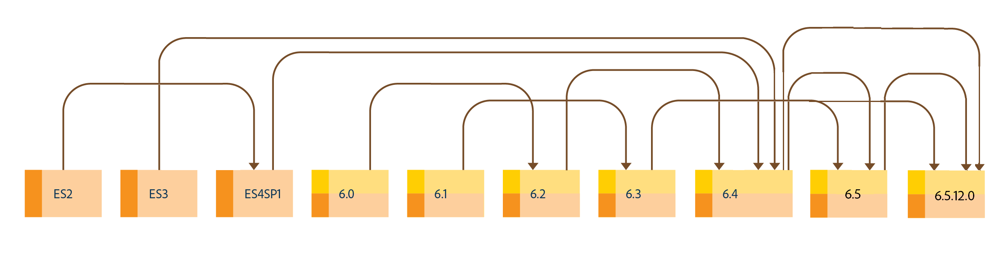

# Uppgradera till AEM 6.5-formulär{#upgrade-to-aem-forms}

AEM 6.5 Forms innehåller flera nya funktioner och förbättringar som effektiviserar skapandet, hanteringen och användarupplevelsen med formulär och korrespondenser. Mer information om alla nya funktioner och förbättringar i AEM 6.5-formulär finns i [Sammanfattningsdokument](../../forms/using/whats-new.md)om nya funktioner.

Du kan uppgradera din befintliga installation av LiveCycle eller AEM Forms för att få tillgång till nya funktioner och förbättringar som finns i AEM 6.5 Forms samtidigt som befintliga data, processer och resurser bevaras intakta. Vid uppgradering bevaras också metadata och processernas status. Du kan välja ett uppgraderingsalternativ för att komma igång med uppgraderingen.

I följande diagram visas de tillgängliga uppgraderingssökvägarna för AEM Forms i OSGi:

Du kan uppgradera direkt från:

* AEM 6.3 Forms on OSGi
* AEM 6.4-formulär på OSGi

Du kan också utföra en uppgradering från

* AEM 6.0-formulär på OSGi
* AEM 6.1-formulär på OSGi
* AEM 6.2 Forms on OSGi

I följande diagram visas de tillgängliga uppgraderingssökvägarna för AEM Forms på JEE:

Du kan uppgradera direkt från:

* AEM 6.4-formulär på JEE
* AEM 6.4-formulär på JEE

Du kan också utföra en uppgradering från

* LiveCycle ES2
* LiveCycle ES3
* LiveCycle ES4 SP1
* AEM 6.0-formulär på JEE
* AEM 6.1-formulär på JEE
* AEM 6.2 Forms on JEE

<!--
[Work in Progress]

Migration involves moving only assets (PDF, XDP, images, adaptive forms, correspondence management assets) from one server to another - processes (LCA), settings, configurations, and a few other pieces of metadata are not migrated. Perform the following steps to migrate to AEM 6.3 Forms:

1. Set up a fresh environment of [AEM 6.3 Forms](https://adobe.com/go/learn_aemforms_documentation_63).
1. Move XDP or other compatible assets to the freshly set instance. For detailed instructions, see [Importing and exporting assets to AEM Forms](../../forms/using/import-export-forms-templates.md). 
1. Build the required services, if any.

   For example, if you are using AEM Forms on JEE Document Services, changes are required in the code to use document services available in AEM Forms on OSGi.

1. Perform post-installation activities:

    * **Run Migration Utility**

      The migration utility makes the adaptive forms and correspondence management assets of earlier versions compatible with AEM 6.3 forms. You can download the utility from AEM package share. For step-by-step information to configure and use the migration utility, see [migration utility](../../forms/using/migration-utility.md) documentation.

    * **Reconfigure Adobe Sign**

      If you had Adobe Sign configured in the previous version of AEM Forms, then reconfigure Adobe Sign from AEM Cloud services. For more details, see [Integrate Adobe Sign with AEM Forms](../../forms/using/adobe-sign-integration-adaptive-forms.md).

      Moreover, AEM 6.3 Forms release has introduced many new Adobe Sign features. For step-by-step information to use Adobe Sign, see [Using Adobe Sign in an adaptive form](../../forms/using/working-with-adobe-sign.md).

    * **Reconfigure analytics and reports**

      In AEM 6.3 Forms, traffic variable for source and success event for impression are not available. So, when you upgrade to AEM 6.3 Forms, AEM Forms stops sending data to Adobe Analytics server and analytics reports for adaptive forms are not available. Moreover, AEM 6.3 Forms introduces traffic variable for the version of form analytics and success event for the amount of time spent on a field. So, reconfigure analytics and reports for your AEM Forms environment. For detailed steps, see [Configuring analytics and reports](../../forms/using/configure-analytics-forms-documents.md).

      Methods to calculate average fill time for forms and average read time for have changed. So, when you upgrade to AEM 6.3 forms, older data (data from previous AEM Forms release) for these metrics is available only in Adobe Analytics. It is not visible in AEM Forms analytics reports. For these metrics, AEM Forms analytics reports display data which is captured after performing the upgrade.
      
      -->
