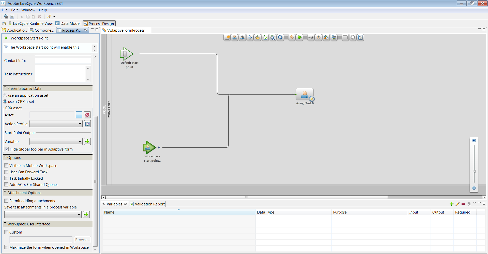

# Använda ett adaptivt formulär i HTML Workspace{#using-an-adaptive-form-in-html-workspace}

AEM Forms på JEE erbjuder möjligheten att använda ett adaptivt formulär i HTML Workspace.

Eftersom man kan välja en XDP-fil under processdesignen har man lagt till möjligheten att bläddra i en befintlig databas AEM adaptiva formulär. Funktionen ger Process Designer möjlighet att konfigurera ett adaptivt formulär i Start Point och i Task.

## Processdesignupplevelse {#process-design-experience}

Gör följande för att aktivera anpassade formulär som ska användas i processdesign:

* I Tilldela uppgift och Startpunkt kan du bläddra till en adaptiv formulärresurs i CRX-databasen när du tilldelar en formulärresurs till en uppgift.
* I egenskapsbladet Tilldela uppgift/Startpunkt för Workbench kan du dölja det översta/globala verktygsfältet i ett anpassat formulär.
* Du kan använda nya åtgärdsprofiler för att rendera och skicka åtgärder i anpassningsbara formulär.

### Export och import av LiveCyclen {#livecycle-application-export-and-import}

Eftersom adaptiva formulär finns i AEM innehåller LiveCyclets programexport endast referenser för adaptiva formulär som används. Därför är export och import av LiveCyclen en tvåstegsprocess. LiveCyclet innehåller processdefinitioner osv. Ett separat paket som innehåller adaptiva formulär exporteras som en ZIP-fil från AEM. Vid import importeras LiveCyclet via Workbench och anpassningsbara formulär importeras via AEM.

## Användarupplevelse av anpassningsbara formulär i HTML Workspace {#user-experience-of-adaptive-form-in-html-workspace}

HTML Workspace har vissa adaptiva formulärspecifika kontroller förutom kontroller som är tillgängliga för mobilformulär. En användare kan lägga till bilagor, spara, signera, skicka och navigera i anpassade formulär i HTML Workspace när användaren öppnar en uppgift eller startpunkt. Nedan beskrivs närmare:

1. Om du vill bifoga filer använder du uppgiftsbilagor, vilket var fallet i Mobile Forms. Alla knappar av typen bifogad fil i anpassat formulär är dolda.

1. Om du vill spara ett anpassat formulär klickar du på **Spara**, vilket var fallet i Mobile Forms. Alla knappar av typen Spara i anpassat formulär är dolda.

1. Om du vill skicka ett anpassat formulär använder du knappen **Skicka** eller de tillgängliga åtgärderna för att dirigera, vilket var fallet i Mobile Forms. Alla knappar av typen Skicka i anpassat formulär är dolda.

1. **Synlighet för globalt verktygsfält för anpassat formulär**: Om Process Designer döljer verktygsfältet på global nivå/översta nivån visas inte verktygsfältet och knapparna i anpassningsbara formulär.

1. **Workspace navigeringskontroller för Adaptiv Forms**: Knapparna Nästa/Föregående finns tillsammans med knapparna Spara, Skicka och Vidarebefordra för ett adaptivt formulär i HTML Workspace. Klicka på knapparna Nästa/Föregående så att du kan navigera i paneler med anpassningsbara formulär i HTML Workspace. Knapparna Nästa/Föregående ger djup navigering, på liknande sätt som navigeringskontrollerna i mobilvyn för adaptiva formulär.

1. **eSign-tjänster och sammanfattningskomponenten i det adaptiva formuläret**: Sammanfattningskomponenten fungerar inte i HTML Workspace. Det innebär att om ett adaptivt formulär har en Sammanfattningskomponent visas det inte på arbetsytan. I stället för att skicka automatiskt i e-signeringskomponenten klickar arbetsytans användare på Skicka eller en vägåtgärd i HTML Workspace. När ett dokument har signerats visas det som ett platt signerat dokument. Klicka på **Skicka** eller en vägåtgärd så att du kan stänga/slutföra uppgiften eller Startpunkten.\
   Det signerade dokumentet samlas in från eSign-servern och XML-datafilen vidarebefordras till nästa steg i processen.

## Steg för att använda adaptiva formulär i processdesign {#steps-to-use-adaptive-forms-in-process-design}

1. Öppna Adobe Experience Manager Forms Workbench.

1. Gå till **Arkiv > Nytt > Program** eller använd det befintliga programmet för att skapa ett program.

   

   Skapa program

1. Skapa en process eller använd en befintlig process i programmet.

   

   Skapa process

1. Skapa en startpunkt eller Tilldela uppgift och dubbelklicka på den.
1. Under avsnittet **[!UICONTROL Presentation & Data]** väljer du **[!UICONTROL use a CRX asset]** och klickar på ellipserna före resursen.

   

   Använda en CRX-resurs

1. Markera det adaptiva formulär som skapats med Hantera Assets-gränssnitt och klicka på **[!UICONTROL OK]**.

   

   Välj ett anpassat formulär

   >[!NOTE]
   >
   >Mer information om hur du skapar ett anpassat formulär finns i [Skapa ett anpassat formulär](../../forms/using/creating-adaptive-form.md).
   >
   >
   >Mer information om hur du skapar en process finns i [Skapa och hantera processer](https://help.adobe.com/en_US/AEMForms/6.1/WorkbenchHelp/WS92d06802c76abadb-1cc35bda128261a20dd-7ff7.2.html).
