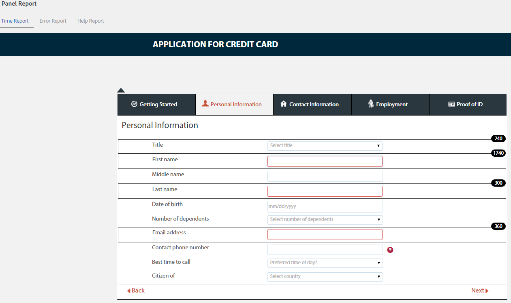

# Visa och förstå analysrapporter för AEM Forms {#view-and-understand-aem-forms-analytics-reports}

Adobe Experience Manager Forms kan integreras med Adobe Analytics så att ni kan hämta in och spåra prestandamått för era publicerade formulär och dokument. Syftet med att analysera dessa värden är att fatta välgrundade beslut baserat på uppgifter om de ändringar som krävs för att göra formulär eller dokument mer användbara.

## Ställa in analyser {#setting-up-analytics}

Analysfunktionen i AEM Forms är tillgänglig som en del av AEM Forms-tilläggspaketet. Mer information om hur du installerar tilläggspaketet finns i [Installera och konfigurera AEM-formulär](../../forms/using/installing-configuring-aem-forms-osgi.md).

Förutom tilläggspaketet behöver du ett Adobe Analytics-konto. Information om lösningen finns i [Adobe Analytics](https://www.adobe.com/solutions/digital-analytics.html).

När du har AEM Forms-tilläggspaketet och ett Adobe Analytics-konto integrerar du Adobe Analytics-kontot med AEM Forms och aktiverar spårning i formulär och dokument enligt beskrivningen i [Konfigurera analyser och rapporter](../../forms/using/configure-analytics-forms-documents.md).

### Hur användarinteraktionsinformation registreras {#how-user-interaction-information-is-recorded}

När en användare interagerar med formuläret registreras interaktionerna och skickas till Analytics-servern. I följande lista visas serveranrop för olika användaraktiviteter:

* 2 samtal per fält per besök
* 1 för panelbesök
* 1 för att spara
* 2 för att skicka
* 2 för att spara
* 1 för hjälp
* 1 för varje valideringsfel
* 1 för formuläråtergivning + 1 för standardpanel besök + 1 för standardfältet 1st
* 2 för att överge formuläret

>[!NOTE]
>
>Denna lista är inte uttömmande.

### Visa analysrapporter {#summary-report}

Följ de här stegen för att visa analysrapporter:

1. Logga in på AEM-portalen på `https://[hostname]:'port'`
1. Klicka på **Formulär > Formulär och dokument**.
1. Välj det formulär som du vill visa analysrapporterna för.
1. Välj **Mer > Analysrapporter**.

**S.** Analysrapport, kommando

AEM Forms visar analysrapporter för formuläret och för varje panel i formuläret, enligt nedan.

**S.** Konvertering **B.** Sammanfattning på formulärnivå **C.** Sammanfattning på panelnivå **D.** Webbläsare för besökare - filter **E.** Operativsystem för besökare - filter **F.** Besökarnas språk - filter

Som standard visas analysrapporten för de senaste sju dagarna. Du kan visa rapporter för de senaste 15 dagarna, den senaste månaden och så vidare, eller ange ett datumintervall.

>[!NOTE]
>
>Alternativen Senaste 7 dagarna och Senaste 15 dagarna inkluderar inte data för den dag du genererar analysrapporten. Om du vill inkludera den aktuella dagens data måste du ange datumintervallet inklusive den aktuella dagen och sedan köra rapporten.

### Konverteringsdiagram för adaptiva formulär och HTML5-formulär {#conversions-graph-for-adaptive-and-html-forms}

Med konverteringsdiagrammet på formulärnivå får du insikt i hur formuläret fungerar med följande nyckeltal:

* **Återgivningar**: Antalet gånger som ett formulär öppnas
* **Besökare**: Antalet besökare i formuläret
* **Sändningar**: Antal gånger som formuläret skickas in

### Analysrapport för adaptiva formulär och HTML5-formulär {#analytics-report-for-adaptive-and-html-forms}

I avsnittet Sammanfattning på formulärnivå får du information om hur formuläret fungerar med följande nyckeltal:

* **Genomsnittlig fyllningstid**: Genomsnittlig tid för att fylla i formuläret. När användarna lägger tid på formuläret men inte skickar in det, inkluderas den tiden inte i beräkningen.
* **Återgivningar**: Antal gånger som formuläret har återgetts eller öppnats
* **Utkast**: Antal gånger som formuläret har sparats som utkast
* **Sändningar**: Antal gånger som formuläret har skickats in
* **Avbryt**: Antal gånger som användarna började fylla i formuläret och sedan gick utan att fylla i det
* **Unika besökare**: Antal gånger som formuläret återges av unika besökare. Mer information om unika besökare finns i [Unika besökare, besök och kundbeteende](https://helpx.adobe.com/analytics/kb/unique-visitors-visitor-behavior.html).

### Panelrapport {#bottom-summary-report}

I avsnittet Sammanfattning på panelnivå finns följande information om varje panel i formuläret:

* **Genomsnittlig fyllningstid**: Genomsnittlig tid som har ägnats åt panelen, oavsett om formuläret har skickats eller inte
* **Fel påträffades**: Genomsnittligt antal fel som användarna har påträffat i fälten på en panel. Fel som påträffas uppstår genom att det totala antalet fel i ett fält divideras med antalet återgivningar av formuläret.
* **Hjälp tillgänglig**: Genomsnittligt antal gånger som användare har använt sammanhangsberoende hjälp för fälten i panelen. Hjälpen Åtkomst fås genom att det totala antalet gånger som hjälpen är tillgänglig för ett fält divideras med antalet återgivningar av formuläret.

#### Detaljerad panelrapport {#detailed-panel-report}

Du kan också visa information för varje panel genom att klicka på panelens namn i Panelrapport.

Den detaljerade rapporten visar värden för alla fält i panelen.

Panelrapporten har tre flikar:

* **Tidsrapport**(standard): Visar hur många sekunder som har ägnats åt att fylla i fälten på panelen
* **Felrapport**: Visar antalet fel som användare har råkat ut för när de fyller i fälten
* **Hjälprapport**: Antal gånger som hjälpen för ett visst fält användes

Du kan navigera mellan panelerna om det finns flera tillgängliga paneler.

### Filter: Webbläsare, operativsystem och språk {#filters-browser-os-and-language}

I tabellerna Webbläsardistribution, Operativsystemsdistribution och Språkdistribution visas återgivningar, besökare och inskickade filer i olika webbläsare, operativsystem och språk för formuläranvändare. De här tabellerna har som standard högst fem poster. Du kan klicka på Visa fler om du vill visa fler poster och klicka på Visa färre om du vill gå tillbaka till de vanliga fem posterna eller färre.

Om du vill filtrera analysdata ytterligare kan du klicka på en post i någon av tabellerna. Om du till exempel klickar på Google Chrome i tabellen Webbläsardistribution återges rapporten igen med data som är relevanta för webbläsaren Google Chrome enligt följande:

Om du visar panelrapporten när du har använt ett filter visas även panelrapportdata enligt det använda filtret.

När ett filter har använts:

* Distributionstabellerna blir skrivskyddade eftersom bara ett filter kan användas åt gången.
* Det tillämpade filtrets tabell försvinner.
* Du kan klicka på stängningsknappen (markerad nedan) för att ta bort det använda filtret.

### A/B-testning {#a-b-testing}

Om du har A/B-testning aktiverat och konfigurerat för formuläret har rapportsidan en listruta som du kan använda för att visa A/B-testrapporten. A/B-testrapporten visar den jämförande prestandan för två versioner av formuläret som du har konfigurerat.

Mer information om A/B-testning finns i [Skapa och hantera A/B-tester för adaptiva formulär](../../forms/using/ab-testing-adaptive-forms.md).
