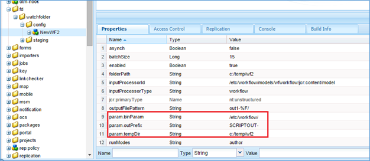

# Bevakad mapp i AEM Forms{#watched-folder-in-aem-forms}

En administratör kan konfigurera en nätverksmapp, en s.k. bevakad mapp, så att när en användare monterar en fil (t.ex. en PDF-fil) i den bevakade mappen så startas ett förkonfigurerat arbetsflöde, en tjänst eller ett skript för att bearbeta den tillagda filen. När tjänsten har utfört den angivna åtgärden sparas resultatfilen i en angiven utdatamapp. Mer information om arbetsflöde, tjänst och skript finns i [Olika metoder för att bearbeta filer](../../forms/using/watched-folder-in-aem-forms.md#main-pars-header-4).

## Skapa en bevakad mapp {#create-a-watched-folder}

Du kan använda någon av följande metoder för att skapa en bevakad mapp i filsystemet:

* När du konfigurerar egenskaperna för en speciell nod i konfigurationen för bevakad mapp anger du den fullständiga sökvägen till den överordnade katalogen i egenskapen folderPath och lägger till namnet på den bevakade mapp som ska skapas, vilket visas i följande exempel: `C:/MyPDFs/MyWatchedFolder`\
   Mappen `MyWatchedFolder`finns inte. AEM Forms försöker skapa mappen med den angivna sökvägen.

* Skapa en mapp på filsystemet innan du konfigurerar en bevakad mappslutpunkt och ange sedan den fullständiga sökvägen i egenskapen folderPath. Mer information om egenskapen folderPath finns i Egenskaper [för](../../forms/using/watched-folder-in-aem-forms.md#main-pars-header-1)bevakad mapp.

>[!NOTE]
>
>I en klustermiljö måste mappen som används som en bevakad mapp vara tillgänglig, skrivbar och delad i filsystemet eller nätverket. Varje programserverinstans i klustret måste ha åtkomst till samma delade mapp. I Windows skapar du en mappad nätverksenhet på alla servrar och anger sökvägen till den mappade nätverksenheten i egenskapen folderPath.

## Skapa nod för konfiguration av bevakad mapp {#create-watched-folder-configuration-node}

Om du vill konfigurera en bevakad mapp skapar du en konfigurationsnod för bevakad mapp. Så här skapar du konfigurationsnoden:

1. Logga in på CRX-DE-listan som administratör och navigera till mappen /etc/fd/watchfolder/config.

1. Skapa en nod av typen `nt:unstructured`. Till exempel bevakad mapp

   >[!NOTE]
   >
   >Namnet på noden Bevakade mappar får inte innehålla mellanslag och specialtecken.

1. Lägg till följande egenskaper i noden:

   * `folderPath`
   * `inputProcessorType`
   * `inputProcessorId`
   * `outputFilePattern`
   En fullständig lista över egenskaper som stöds finns i Egenskaper [för](../../forms/using/watched-folder-in-aem-forms.md#main-pars-header-1)bevakad mapp.

1. Klicka på **Spara alla**. När noden har skapats och egenskaperna har sparats. Mapparna `input`, `result`, `failure`, `preserve`och `stage`skapas på den sökväg som anges i `folderPath` egenskapen.

   Sökningsjobbet startar skanningen av den bevakade mappen med ett angivet tidsintervall.

## Egenskaper för bevakad mapp {#watchedfolderproperties}

Du kan konfigurera följande egenskaper för en bevakad mapp.

* **folderPath (String)**: Sökvägen till mappen som ska genomsökas med definierade tidsintervall. För en klustrad miljö måste mappen finnas på en delad plats med alla servrar som har fullständig åtkomst till servern. Det är en obligatorisk egenskap.
* **inputProcessorType (String)**: Den typ av process som ska startas. Du kan ange arbetsflöde, skript eller tjänst. Det är en obligatorisk egenskap.
* **inputProcessorId (String)**: Beteendet för egenskapen inputProcessorId baseras på det värde som anges för egenskapen inputProcessorType. Det är en obligatorisk egenskap. I följande lista visas alla möjliga värden för egenskapen inputProcessorType och motsvarande krav för egenskapen inputProcessorType:

   * Ange arbetsflödesmodellen som ska köras för arbetsflödet. Till exempel /etc/workflow/models/&lt;arbetsflödes_namn>/jcr:content/model
   * För skript anger du JCR-sökvägen för skriptet som ska köras. Till exempel /etc/fd/watchfolder/test/testScript.ecma
   * För tjänsten anger du det filter som används för att hitta en OSGi-tjänst. Tjänsten är registrerad som en implementering av gränssnittet com.adobe.aemfd.watchfolder.service.api.ContentProcessor.

* **runModes (String)**: En kommaavgränsad lista med tillåtna körningslägen för körning av arbetsflöde. Några exempel är:

   * author

   * publicera

   * författare, publicera

   * publicera, författare

**Obs**: *Om servern som är värd för den bevakade mappen inte har något av det angivna körningsläget aktiveras alltid den bevakade mappen oavsett serverns körningslägen.*

* **outputFilePattern (String)**: Utdatafilens mönster. Du kan ange en mapp eller ett filmönster. Om ett mappmönster anges har utdatafilerna namn enligt arbetsflödena. Om ett filmönster anges har utdatafilerna namn som beskrivs i filmönstret. [Fil- och mappmönstret](../../forms/using/watched-folder-in-aem-forms.md#p-file-and-folder-patterns-p) kan även ange en katalogstruktur för utdatafilerna. Det är en obligatorisk egenskap.

* **stageFileExpirationDuration (Long, default -1)**: Antalet sekunder som väntar innan en indatafil/indatamapp som redan har hämtats för bearbetning kan behandlas som om tidsgränsen har överskridits och markerats som ett fel. Den här förfallomekanismen aktiveras bara när värdet för den här egenskapen är ett positivt tal.

   **** Obs! Även *när en inmatning har markerats som att tidsgränsen nåtts med den här mekanismen kan den fortfarande bearbetas i bakgrunden, men bara ta längre tid än förväntat. Om indatainnehållet förbrukades innan timeoutmekanismen startades kan bearbetningen till och med slutföras senare och utdata dumpas i resultatmappen. Om innehållet inte förbrukades innan tidsgränsen uppnåddes är det troligtvis så att bearbetningen misslyckas senare när innehållet används, och det här felet loggas även i felmappen för samma indata. Om bearbetningen av indata inte aktiveras på grund av ett tillfälligt fel i jobb/arbetsflöde (vilket är det scenario som utgångsmekanismen avser), kommer ingen av dessa två situationer att inträffa. För alla poster i felmappen som markerats som misslyckade på grund av en timeout (sök efter meddelanden i formatet &quot;Fil som inte bearbetats efter lång tid, markerat som misslyckad!&quot; i felloggen) är det tillrådligt att söka igenom resultatmappen (och även själva felmappen för en annan post för samma indata) för att kontrollera om någon av de händelser som beskrivs ovan faktiskt inträffade.*

* 
* **** deleteExpiredStageFileOnlyWhenThrottled (Boolean, standard true): Anger om förfallomekanismen endast ska aktiveras när bevakade mappar stryps. Mekanismen är mer relevant för begränsade bevakade mappar eftersom ett litet antal filer som ligger kvar i ett obearbetat tillstånd (på grund av tillfälliga fel i jobb/arbetsflöde) kan kväva bearbetningen för hela gruppen när strypning är aktiverat. Om den här egenskapen behålls som true (standard) aktiveras inte förfallomekanismen för bevakade mappar som inte är begränsade. Om egenskapen behålls som false aktiveras mekanismen alltid så länge egenskapen stageFileExpirationDuration är ett positivt tal.

* **pollInterval (lång)**: Intervallet i sekunder för skanning av den bevakade mappen för indata. Om inte inställningen Gräns är aktiverad ska avsökningsintervallet vara längre än tiden för att bearbeta ett genomsnittligt jobb. annars kan systemet bli överbelastat. Standardvärdet är 5. Mer information finns i beskrivningen för Batchstorlek. Värdet för pollinterval måste vara större än eller lika med ett.
* **excludeFilePattern (String)**: En semikolonavgränsad lista (;) med mönster som används av en bevakad mapp för att avgöra vilka filer och mappar som ska sökas igenom och plockas upp. Alla filer och mappar med det här mönstret skannas inte för bearbetning. Den här inställningen är användbar när indata är en mapp med flera filer. Innehållet i mappen kan kopieras till en mapp med ett namn som hämtas av den bevakade mappen. Detta förhindrar att den bevakade mappen hämtar en mapp för bearbetning innan mappen kopieras helt till indatamappen. Standardvärdet är null.\
   Du kan använda [filmönster](../../forms/using/watched-folder-in-aem-forms.md#p-file-and-folder-patterns-p) för att exkludera:

   * Filer med specifika filnamnstillägg; till exempel *.dat, *.xml, .pdf, *.*
   * Filer med särskilda namn; data* skulle till exempel exkludera filer och mappar med namnen data1, data2 och så vidare.
   * Filer med sammansatta uttryck i namnet och tillägget, som i följande exempel:

      * Data[0-9][0-9][0-9].[dD][aA][tT]
      * *.[dD][Aa][Tt]
      * *.[xx][mm][Ll]

Mer information om filmönster finns i [Om filmönster](../../forms/using/watched-folder-in-aem-forms.md#p-file-and-folder-patterns-p).

* **includeFilePattern (String)**: En semikolonavgränsad lista (;) med mönster som den bevakade mappen använder för att avgöra vilka mappar och filer som ska sökas igenom och hämtas. Om till exempel IncludeFilePattern är indata* hämtas alla filer och mappar som matchar indata*. Detta inkluderar filer och mappar med namnen input1, input2 och så vidare. Standardvärdet är * och anger alla filer och mappar. Du kan använda filmönster för att inkludera:

   * Filer med specifika filnamnstillägg; till exempel *.dat, *.xml, .pdf, *.*
   * Filer med särskilda namn; till exempel data.* skulle innehålla filer och mappar med namnen data1, data2 och så vidare.

* Filer med sammansatta uttryck i namnet och tillägget, som i följande exempel:

   * Data[0-9][0-9][0-9].[dD][aA][tT]

      * *.[dD][Aa][Tt]
      * *.[xx][mm][Ll]

Mer information om filmönster finns i [Om filmönster](../../forms/using/watched-folder-in-aem-forms.md#p-file-and-folder-patterns-p)

* **waitTime (Long)**: Tiden i millisekunder som du vill vänta innan du skannar en mapp eller fil efter att den har skapats. Om väntetiden till exempel är 3 600 000 millisekunder (en timme) och filen skapades för en minut sedan, kommer filen att hämtas efter 59 eller fler minuter. Standardvärdet är 0. Den här inställningen är användbar för att säkerställa att en fil eller mapp kopieras helt till indatamappen. Om du till exempel har en stor fil att bearbeta och det tar tio minuter att hämta filen anger du väntetiden till 10*60 *1000 millisekunder. Detta förhindrar att den bevakade mappen skannar in filen om den inte är tio minuter gammal.
* **purgeDuration (Long)**: Filer och mappar i resultatmappen tas bort när de är äldre än det här värdet. Detta värde mäts i dagar. Den här inställningen är användbar för att säkerställa att resultatmappen inte blir full. Värdet -1 dagar anger att resultatmappen aldrig ska tas bort. Standardvärdet är -1.
* **resultFolderName (String)**: Mappen där de sparade resultaten lagras. Om resultaten inte visas i den här mappen kontrollerar du felmappen. Skrivskyddade filer bearbetas inte och sparas i felmappen. Värdet kan vara en absolut eller relativ sökväg med följande filmönster:

   * %F = filnamnsprefix
   * %E = filnamnstillägg
   * %Y = år (full)
   * %y = år (de två sista siffrorna)
   * %M = månad
   * %D = dag i månaden
   * %d = dag på året
   * %H = timme (24-timmars klocka)
   * %h = timme (12-timmars klocka)
   * %m = minut
   * %s = sekund
   * %l = millisekund
   * %R = slumptal (mellan 0 och 9)
   * %P = process- eller jobb-ID
   Om den till exempel är 2009-08-17 och du anger C:/Test/WF0/error/%Y/%M/%D/%H/ är resultatmappen C:/Test/WF0/error/2009/07/17/20

   Om sökvägen inte är absolut men relativ skapas mappen i den bevakade mappen. Standardvärdet är result/%Y/%M/%D/, som är resultatmappen i den bevakade mappen. Mer information om filmönster finns i [Om filmönster](../../forms/using/watched-folder-in-aem-forms.md#p-file-and-folder-patterns-p).

>[!NOTE]
>
>Ju mindre resultatmapparna är, desto bättre prestanda för Bevakade mappar. Om den beräknade inläsningen för den bevakade mappen till exempel är 1 000 filer varje timme kan du prova ett mönster som result/%Y%M%D%H så att en ny undermapp skapas varje timme. Om inläsningen är mindre (till exempel 1 000 filer per dag) kan du använda ett mönster som result/%Y%M%D.

* **errorFolderName (String)**: Mappen där felfiler sparas. Den här platsen är alltid relativ till den bevakade mappen. Du kan använda filmönster enligt beskrivningen för resultatmappen. Skrivskyddade filer bearbetas inte och sparas i felmappen. Standardvärdet är fel/%Y/%M/%D/.
* **** preserveFolderName (String): Den plats där filerna lagras efter att bearbetningen har slutförts. Sökvägen kan vara en absolut, relativ eller null-katalogsökväg. Du kan använda filmönster enligt beskrivningen för resultatmappen. Standardvärdet är preserve/%Y/%M/%D/.
* **batchSize (Long)**: Antalet filer eller mappar som ska hämtas per skanning. Används för att förhindra överbelastning av systemet. Om du läser in för många filer samtidigt kan det orsaka en krasch. Standardvärdet är 2.

   Inställningarna för avsökningsintervall och Gruppstorlek avgör hur många filer i Bevakade mappar som ska tas upp vid varje avsökning. Bevakad mapp använder en Quartz-trådpool för att skanna indatamappen. Trådpoolen delas med andra tjänster. Om skanningsintervallet är litet genomsöks indatamappen ofta av trådarna. Om filer ofta placeras i den bevakade mappen bör du hålla sökintervallet litet. Om filerna tas bort sällan bör du använda ett större inläsningsintervall så att de andra tjänsterna kan använda trådarna.

   Om det finns en stor mängd filer som tas bort gör du gruppstorleken stor. Om till exempel tjänsten som startas av slutpunkten Bevakade mappar kan bearbeta 700 filer per minut, och användarna släpper filer i indatamappen i samma takt, och du sedan anger värdet 350 för Gruppstorlek och 30 sekunder för att få prestandan Bevakade mappar utan att kostnaden för att skanna den Bevakade mappen för ofta påverkas.

   När filer släpps i den bevakade mappen listas filerna i indata, vilket kan försämra prestanda om skanningen sker varje sekund. Om du ökar skanningsintervallet kan prestandan förbättras. Om filvolymen som tas bort är liten justerar du batchstorleken och avsökningsintervallet. Om till exempel 10 filer tas bort varje sekund, kan du prova att ange pollInterval till 1 sekund och Batch Size till 10

* **throttleOn (Boolean)**: När det här alternativet är markerat begränsas antalet övervakade mappjobb som AEM Forms bearbetar vid en given tidpunkt. Det maximala antalet jobb bestäms av värdet för Batchstorlek. Standardvärdet är true. (Se [Begränsning](../../forms/using/watched-folder-in-aem-forms.md#p-about-throttling-p).)

* **overwriteDuplicateFilename (Boolean)**: När värdet är True skrivs filerna i resultatmappen och i den bevarade mappen över. Om värdet är Falskt används filer och mappar med ett numeriskt indexsuffix för namnet. Standardvärdet är Falskt.
* **preserveOnFailure (Boolean)**: Bevara indatafiler om det inte går att utföra åtgärden på en tjänst. Standardvärdet är true.
* **inputFilePattern (String)**: Anger mönstret för indatafilerna för en bevakad mapp. Skapar en vitlista över filerna.
* **asynk (Boolean)**: Identifierar anropstypen som asynkron eller synkron. Standardvärdet är true (asynkront). Filbearbetningen är en resurskrävande uppgift. Behåll värdet för asynch-flaggan till true för att förhindra att huvudtråden i sökningsjobbet kvävs. I en klustermiljö är det viktigt att flaggan är true för att det ska gå att använda belastningsutjämning för de filer som bearbetas på de tillgängliga servrarna. Om flaggan är false försöker sökningsjobbet att utföra bearbetning för varje fil/mapp på den översta nivån sekventiellt i sin egen tråd. Ange inte flaggan till false utan en specifik orsak, till exempel arbetsflödesbaserad bearbetning i en enskild serverkonfiguration.

>[!NOTE]
>
>Arbetsflödena är asynkrona. Även om du anger värdet som false startas arbetsflödena i asynkront läge.

* **enabled (Boolean)**: Inaktiverar och aktiverar skanning för en bevakad mapp. Ange true om du vill att skanningen av den bevakade mappen ska börja. Standardvärdet är true.
* **** payloadMapperFilter: När en mapp konfigureras som bevakad mapp skapas en mappstruktur i den bevakade mappen. Strukturen har mappar för att tillhandahålla indata, ta emot utdata (resultat), spara data för fel, bevara data för långvariga processer och spara data för olika faser. Mappstrukturen för en bevakad mapp kan fungera som en nyttolast för formulärcentrerade arbetsflöden. Med en nyttolastmappare kan du definiera strukturen för en nyttolast som använder en bevakad mapp för indata, utdata och bearbetning. Om du till exempel använder standardmapparen mappas innehållet i den bevakade mappen med [nyttolast]\input och [nyttload]\output. Det finns två körklara implementeringar av nyttolastmappare. Om du inte har [någon anpassad implementering](../../forms/using/watched-folder-in-aem-forms.md#creating-a-custom-payload-mapper-filter)kan du använda en körklar implementering:

   * **** Standardmappare: Använd standardnyttolastmapparen för att behålla in- och utdatamaterialet för de bevakade mapparna i separata in- och utdatamappar i nyttolasten. I arbetsflödets nyttolastsökväg använder du [nyttolast]/indata/och sökvägar för [nyttolast]/utdata för att hämta och spara innehåll.

   * **** Enkel filbaserad nyttolastmappare: Använd den enkla filbaserade nyttolastmapparen för att behålla in- och utdatamaterialet direkt i nyttolastmappen. Ingen extra hierarki skapas, som standardmappare.

### Anpassade konfigurationsparametrar {#custom-configuration-parameters}

Tillsammans med ovanstående konfigurationsegenskaper för bevakad mapp kan du även ange anpassade konfigurationsparametrar. De anpassade parametrarna skickas till filbehandlingskoden. Det gör att koden kan ändra sitt beteende baserat på parameterns värde. Så här anger du en parameter:

1. Logga in på CRXDE-Lite och navigera till konfigurationsnoden Bevakade mappar.
1. Lägg till en egenskapsparam.&lt;property_name> till konfigurationsnoden Bevakade mappar. Egenskapstypen kan bara vara Boolean, Date, Decimal, Double, Long och String. Du kan ange egenskaper för ett och flera värden.

**** Obs! Om egenskapens datatyp är Dubbel anger du ett decimaltecken i värdet för dessa egenskaper. För alla egenskaper, där datatypen är Dubbel och inget decimaltecken anges i värdet, konverteras typen till Lång.

Dessa egenskaper skickas som en oföränderlig mappning av typen Map&lt;String, Object> till bearbetningskoden. Bearbetningskoden kan vara ECMAScript, Workflow eller Service. Värdena som anges för egenskaperna är tillgängliga som nyckelvärdepar i kartan. Key är namnet på egenskapen och value är egenskapens värde. Mer information om anpassade konfigurationsparametrar finns i följande bild:



Ett exempel på en övervakad mappkonfigurationsnod med obligatoriska egenskaper, några valfria egenskaper och några konfigurationsparametrar.

#### Variabler för arbetsflöden {#mutable-variables-for-workflows}

Du kan skapa variabler som kan ändras för arbetsflödesbaserade filbearbetningsmetoder. Dessa variabler fungerar som behållare för data som flödar mellan stegen i ett arbetsflöde. Så här skapar du sådana variabler:

1. Logga in på CRXDE-Lite och navigera till konfigurationsnoden Bevakade mappar.

1. Lägg till egenskapen workflow.var.&lt;variable_name> till konfigurationsnoden Bevakade mappar.

   Egenskapstypen kan bara vara Boolean, Date, Decimal, Double, Long och String. Egenskaper med flera värden stöds också. För flervärdesegenskaper är värdet som är tillgängligt för arbetsflödessteget en matris av angiven typ.

   >[!NOTE]
   >
   > Om egenskapens datatyp är Dubbel anger du ett decimaltecken i värdet för dessa egenskaper. För alla egenskaper, där datatypen är Dubbel och inget decimaltecken anges i värdet, konverteras typen till Lång.

>[!NOTE]
>
>JCR-specifikationen anger ett standardvärde för egenskaperna. Standardvärdena är tillgängliga för stegen i ett arbetsflöde för bearbetning. Ange alltså korrekta standardvärden.


## Olika metoder för bearbetning av filer {#variousmethodsforprocessingfiles}

Du kan starta ett arbetsflöde, en tjänst eller ett skript för att bearbeta dokumenten i en bevakad mapp.

### Använda en tjänst för att bearbeta filer i en bevakad mapp {#using-a-service-to-process-files-of-a-watched-folder-nbsp}

En tjänst är en anpassad implementering av `com.adobe.aemfd.watchfolder.service.api.ContentProcessor` gränssnittet. Den registreras med OSGi tillsammans med några anpassade egenskaper. Implementeringens anpassade egenskaper gör den unik och hjälper till att identifiera implementeringen.

#### Anpassad implementering av ContentProcessor-gränssnittet {#custom-implementation-of-the-contentprocessor-interface}

Den anpassade implementeringen accepterar en bearbetningskontext (ett objekt av typen com.adobe.aemfd.watchfolder.service.api.ProcessorContext), läser indatadokument och konfigurationsparametrar från kontexten, bearbetar indata och lägger tillbaka utdata i\
kontext. ProcessorContext har följande API:er:

* **getWatchFolderId**: Returnerar ID:t för den bevakade mappen.
* **getInputMap**: Returnerar en karta av typen Karta. Kartans nycklar är indatafilens filnamn och ett dokumentobjekt som innehåller filens innehåll. Använd API:t getinputMap för att läsa indatafilerna.
* **getConfigParameters**: Returnerar en oföränderlig karta av typen Map. Kartan innehåller\
   konfigurationsparametrarna för en bevakad mapp.

* **setResult**: Implementeringen av ContentProcessor\
   använder API:t för att skriva utdatadokumentet till resultatmappen. Du kan ange ett namn för utdatafilen till API:t setResult. API:t kan välja att använda eller ignorera den angivna filen beroende på vilket utdatamapp/filmönster som har angetts. Om ett mappmönster anges har utdatafilerna namn enligt arbetsflödena. Om ett filmönster anges har utdatafilerna namn som beskrivs i filmönstret.

Följande kod är till exempel en anpassad implementering av ContentProcessor-gränssnittet med en anpassad foo=bar-egenskap.

```java
@Component(metatype = true, immediate = true, label = "WF Test Service", description = "WF Test Service")
@Service(value = {OutputWriter.class, ContentProcessor.class})
@Property(name = "foo", value = "bar")
public class OutputWriter implements ContentProcessor {
```

Om du anger egenskapen inputProcessorId som (foo=bar) och egenskapen inputProcessorType som Service när du [konfigurerar en bevakad mapp](../../forms/using/watched-folder-in-aem-forms.md#p-create-watched-folder-configuration-node-p)används den ovannämnda tjänsten (anpassad implementering) för att bearbeta indatafilerna för den bevakade mappen.

Följande exempel är också en anpassad implementering av ContentProcessor-gränssnittet. I exemplet godkänner tjänsten indatafiler, kopierar filerna till en temporär plats och returnerar ett dokumentobjekt med innehållet i filen. Innehållet i dokumentobjektet sparas i resultatmappen. Den fysiska sökvägen till resultatmappen är konfigurerad i konfigurationsnoden [](../../forms/using/watched-folder-in-aem-forms.md#p-create-watched-folder-configuration-node-p)Bevakade mappar.

```java
@Component(immediate = true)
@Service(value = ContentProcessor.class)
@Property(name = "serviceSelector", value = "testProcessor1")
public class TestContentProcessor1 implements ContentProcessor {
    @Override
    public void processInputs(ProcessorContext context) throws Exception {
        Map.Entry<String, Document> e = context.getInputMap().entrySet().iterator().next();
        File f = new File((String) context.getConfigParameters().get("tempDir"),
                context.getConfigParameters().get("outPrefix") + e.getKey());
        e.getValue().copyToFile(f);
        context.setResult(f.getName(), new Document(f, true));
    }
}
```

### Använda skript för att bearbeta filer i en bevakad mapp {#using-scripts-to-process-files-of-a-watched-folder}

Skript är den anpassade ECMAScript-kod som skrivs till för att bearbeta dokument som placeras i den bevakade mappen. Ett skript representeras som en JCR-nod. Förutom ECMAScript-standardvariablerna (log, sling med flera) har skriptet variabeln processorContext. Variabeln är av typen ProcessorContext. ProcessorContext har följande API:er:

* **getWatchFolderId**: Returnerar ID:t för den bevakade mappen.
* **getInputMap**: Returnerar en karta av typen Karta. Kartans nycklar är indatafilens filnamn och ett dokumentobjekt som innehåller filens innehåll. Använd API:t getinputMap för att läsa indatafilerna.
* **getConfigParameters**: Returnerar en oföränderlig karta av typen Map. Kartan innehåller konfigurationsparametrarna för en bevakad mapp.
* **setResult**: I ContentProcessor-implementeringen används API:t för att skriva utdatadokumentet till resultatmappen. Du kan ange ett namn för utdatafilen till API:t setResult. API:t kan välja att använda eller ignorera den angivna filen beroende på vilket utdatamapp/filmönster som har angetts. Om ett mappmönster anges har utdatafilerna namn enligt arbetsflödena. Om ett filmönster anges har utdatafilerna namn som beskrivs i filmönstret.

Följande kod är ett exempel på ECMAScript. Den godkänner indatafiler, kopierar filerna till en temporär plats och returnerar ett dokumentobjekt med innehållet i filen. Innehållet i dokumentobjektet sparas i resultatmappen. Den fysiska sökvägen till resultatmappen är konfigurerad i konfigurationsnoden [](../../forms/using/watched-folder-in-aem-forms.md#p-create-watched-folder-configuration-node-p)Bevakade mappar.

>[!NOTE]
>
>Utdatamappen och filnamnsprefixet bestäms utifrån konfigurationsparametrarna för den bevakade mappen.

```java
var inputMap = processorContext.getInputMap();
var params = processorContext.getConfigParameters();
var entry = inputMap.entrySet().iterator().next();
var tempFile = new Packages.java.io.File(params.get("tempDir"), params.get("outPrefix") + entry.getKey());
entry.getValue().copyToFile(tempFile);    
processorContext.setResult(tempFile.getName(), new Packages.com.adobe.aemfd.docmanager.Document(tempFile, true));
```

#### Placering av skript och säkerhetsfrågor {#location-of-scripts-and-security-considerations}

Som standard finns en behållarmapp (/etc/fd/watchfolder/scripts) där kunderna kan placera sina skript, och standardtjänstanvändaren som används av ramverket för bevakade mappar har de behörigheter som krävs för att läsa skript från den här platsen.

Om du tänker placera dina skript på en anpassad plats är det troligt att standardtjänstanvändaren inte har läsbehörighet över den anpassade platsen. Så här anger du nödvändig behörighet till den anpassade platsen:

1. Skapa en systemanvändare programmatiskt eller via konsolen https://[server]:[port]/crx/explorer. Du kan också använda en befintlig systemanvändare. Det är viktigt att du arbetar med systemanvändare här i stället för med vanliga användare.
1. Ge läsbehörighet till den nyskapade eller befintliga systemanvändaren på den anpassade plats där skripten lagras. Du kan ha flera anpassade platser. Ange minst läsbehörighet för alla anpassade platser.
1. I Felix konfigurationskonsol (/system/console/configMgr) letar du reda på tjänstanvändarmappningen för de bevakade mapparna. Mappningen ser ut som &quot;Mappning: adobe-aemds-core-watch-folder=...&#39;.
1. Klicka på mappningen. För posten &#39;adobe-aemds-core-watch-folder:scripts=fd-service&#39; ändrar du fd-service till ID:t för den anpassade systemanvändaren. Klicka på Spara.

Nu kan du använda konfigurerad anpassad plats för att spara skripten.

### Använda ett arbetsflöde för att bearbeta filer i en bevakad mapp {#using-a-workflow-to-process-files-of-a-watched-folder}

Med arbetsflöden kan ni automatisera Experience Manager-aktiviteter. Arbetsflöden består av en serie steg som körs i en viss ordning. Varje steg utför en distinkt aktivitet som att aktivera en sida eller skicka ett e-postmeddelande. Arbetsflöden kan samverka med resurser i databasen, användarkonton och Experience Manager-tjänster. Därför kan arbetsflöden koordinera komplicerade saker.

* Tänk på följande innan du skapar ett arbetsflöde:
* Resultatet av ett steg måste vara tillgängligt för alla efterföljande steg.\
   Stegen måste kunna uppdatera (eller till och med ta bort) befintliga utdata som genererats av föregående steg.
* Variablerna används för att flöda anpassade dynamiska data mellan stegen.

Utför följande steg för att bearbeta filer med hjälp av arbetsflöden:

1. Skapa en implementering av `com.adobe.aemfd.watchfolder.workflow.api.WorkflowContextProcessor` gränssnittet. Det liknar implementeringen som skapats för en tjänst.

   >[!NOTE]
   >
   >Du kan skapa den fullständiga implementeringen helt i ECMAScript.

1. I ett steg i arbetsflödet letar du reda på OSGi-tjänsten av typen com.adobe.aemfd.watchfolder.workflow.api.WorkflowContextService och anropar metoden execute() för tjänsten med följande argument.

   * Din anpassade implementering av WorkflowContextProcessor-gränssnittet
   * workItem
   * workflowSession
   * metadata

Om du använder Java-programmeringsspråket för att implementera arbetsflödet, tillhandahåller AEM-arbetsflödesmotorn värden för variablerna workItem, workflowSession och metadata. Dessa variabler skickas som argument till execute()-metoden för den anpassade WorkflowProcess-implementeringen.

Om du använder ECMAScript för att implementera arbetsflödet, tillhandahåller AEM-arbetsflödesmotorn värden för graniteWorkItem, graniteWorkflowSession och metadatavariabler. Dessa variabler skickas som argument till metoden WorkflowContextService.execute().

Argumentet för processWorkflowContext() är ett objekt av typen com.adobe.aemfd.watchfolder.workflow.api.WorkflowContext. WorkflowContext-gränssnittet har följande API:er för att underlätta de arbetsflödesspecifika överväganden som nämns ovan:

* getWorkItem: Returnerar värdet för WorkItem-variabeln. Variablerna skickas till metoden WorkflowContextService.execute().
* getWorkflowSession: Returnerar värdet för WorkflowSession-variabeln. Variablerna skickas till metoden WorkflowContextService.execute().
* getMetadata: Returnerar värdet för metadatavariabeln. Variablerna skickas till metoden WorkflowContextService.execute().
* getCommitedVariables: Returnerar en skrivskyddad objektmappning som representerar variabler som angetts i föregående steg. Om en variabel inte ändras i något av föregående steg returneras standardvärdet som angavs när den bevakade mappen konfigurerades.
* getCommitedResults: Returnerar en skrivskyddad dokumentmappning. Kartan representerar de utdatafiler som genereras av föregående steg.
* setVariable: WorkflowContextProcessor-implementeringen använder variabeln för att ändra variablerna som representerar anpassade dynamiska data som flödar mellan stegen. Variablernas namn och typ är identiska med namnet på de variabler som angavs när den bevakade mappen [konfigurerades](../../forms/using/watched-folder-in-aem-forms.md#p-configure-the-watched-folder-p). Om du vill ändra värdet för en variabel anropar du API:t setVariable med ett värde som inte är null. Om du vill ta bort en variabel anropar du setVariable() med ett null-värde.

Följande ProcessorContext API:er är också tillgängliga:

* getWatchFolderId: Returnerar ID:t för den bevakade mappen.
* getInputMap: Returnerar en karta av typen Map&lt;String, Document>. Kartans nycklar är indatafilens filnamn och ett dokumentobjekt som innehåller filens innehåll. Använd API:t getinputMap för att läsa indatafilerna.
* getConfigParameters: Returnerar en oföränderlig karta av typen Map&lt;String, Object>. Kartan innehåller konfigurationsparametrarna för en bevakad mapp.
* setResult: I ContentProcessor-implementeringen används API:t för att skriva utdatadokumentet i resultatmappen. Du kan ange ett namn för utdatafilen till API:t setResult. API:t kan välja att använda eller ignorera den angivna filen beroende på vilket utdatamapp/filmönster som har angetts. Om ett mappmönster anges har utdatafilerna namn enligt arbetsflödena. Om ett filmönster anges har utdatafilerna namn som beskrivs i filmönstret

Att tänka på för setResult API, när det används i arbetsflöden:

* Om du vill lägga till ett nytt utdatadokument som bidrar till det övergripande arbetsflödet anropar du API:t setResult med ett filnamn som inte har använts som utdatafilnamn i något föregående steg.
* Om du vill uppdatera utdata som genererats i ett tidigare steg anropar du API:t setResult med ett filnamn som redan används i ett tidigare steg.
* Om du vill ta bort utdata som genererats av ett tidigare steg anropar du setResult med ett filnamn som redan används av ett tidigare steg och null som innehåll.

>[!NOTE]
>
>Anrop av setResult API med null-innehåll i andra scenarier resulterar i ett fel.

Följande exempel implementeras som ett arbetsflödessteg. I exemplet använder ECMAscript en variabel stepCount för att spåra hur många gånger ett steg anropas i den aktuella arbetsflödesinstansen.\
Namnet på utdatamappen är en kombination av aktuellt stegnummer, det ursprungliga filnamnet och det prefix som anges i parametern outPrefix.

ECMAScript hämtar en referens för arbetsflödets kontexttjänst och skapar en implementering av WorkflowContextProcessor-gränssnittet. Implementeringen av WorkflowContextProcessor accepterar indatafiler, kopierar filen till en tillfällig plats och returnerar ett dokument som representerar den kopierade filen. Baserat på värdet för den booleska variabeln purgePrevious, tar det aktuella steget bort utdata som genererades senast i samma steg när steget startades i den aktuella arbetsflödesinstansen. Slutligen anropas metoden wfSvc.execute för att köra WorkflowContextProcessor-implementeringen. Innehållet i utdatadokumentet sparas i resultatmappen på den fysiska sökvägen som anges i konfigurationsnoden Bevakade mappar.

```java
log.error("Watch-folder workflow script called for step: " + graniteWorkItem.getNode().getTitle());
var wfSvc = sling.getService(Packages.com.adobe.aemfd.watchfolder.workflow.api.WorkflowContextService);
// Custom WorkflowContextProcessor implementation which defines the processWorkflowContext() method purely in JS
var impl = { processWorkflowContext: function (wfContext) {
    var wfId = wfContext.getWatchFolderId();
    var inputMap = wfContext.getInputMap();
    var paramMap = wfContext.getConfigParameters();
    var preResults = wfContext.getCommittedResults();
    var preVars = wfContext.getCommittedVariables();
    log.info("WF ID: " + wfId); // workflowId of type String
    log.info("Inputs: " + inputMap); // Input map of type Map<String, Document>
    log.info("Params: " + paramMap); // Config params of type Map<String, Object>
    log.info("Old results: " + preResults);
    log.info("Old variables: " + preVars);            
    var currStepNumber = new Packages.java.lang.Long(new Packages.java.lang.Long(preVars.get("stepCount")).longValue() + 1);    
    log.info("Current step number: " + currStepNumber);
    wfContext.setVariable("stepCount", currStepNumber);
    var entry = inputMap.entrySet().iterator().next();
    var tempFile = new Packages.java.io.File(paramMap.get("tempDir"), paramMap.get("outPrefix") + "STEP-" + currStepNumber + "-" + entry.getKey());
    entry.getValue().copyToFile(tempFile);
    var fName = tempFile.getName();
    var outDoc = new Packages.com.adobe.aemfd.docmanager.Document(tempFile, true);
    wfContext.setResult(tempFile.getName(), outDoc);
    var prevStepOutName = paramMap.get("outPrefix") + "STEP-" + (currStepNumber - 1) + "-" + entry.getKey();
    if (preResults.containsKey(prevStepOutName) && paramMap.get("purgePrevious").booleanValue()) {
        log.info("Purging previous step output " + prevStepOutName);        
        wfContext.setResult(prevStepOutName, null);
    }
} }
wfSvc.execute(impl, graniteWorkItem, graniteWorkflowSession, metaData);
log.info("Exiting workflow script!")
```

### Skapa nyttolastmappningsfilter för att mappa strukturen för en bevakad mapp till nyttolasten för ett arbetsflöde {#create-payload-mapper-filter-to-map-structure-of-a-watched-folder-to-the-payload-of-a-workflow}

 När du skapar en bevakad mapp skapas en mappstruktur i den mapp som bevakas. Mappstrukturen har mapparna stage, result, preserve, input och error. Mappstrukturen kan fungera som indatanyttolast för arbetsflödet och acceptera utdata från ett arbetsflöde. Den kan även visa eventuella felpunkter.

Om nyttolastens struktur skiljer sig från den bevakade mappens struktur kan du skriva egna skript för att mappa strukturen för den bevakade mappen till nyttolasten. Ett sådant skript kallas nyttolastmappningsfilter. Som standard innehåller AEM Forms ett nyttolastmappningsfilter för att mappa strukturen för den bevakade mappen till en nyttolast.

#### Skapa ett anpassat nyttolastmappningsfilter {#creating-a-custom-payload-mapper-filter}

1. Ladda ned [Adobe Client SDK](https://repo.adobe.com/nexus/content/groups/public/com/adobe/aemfd/aemfd-client-sdk/6.3.0/aemfd-client-sdk-6.3.0.jar).
1. Konfigurera klient-SDK i byggsökvägen för det maven-baserade projektet. För att komma igång kan du ladda ned och öppna följande maven-baserade projekt i den utvecklingsmiljö du vill.
1. Redigera filterkoden för nyttolastsmappare som finns i exempelpaketet efter dina behov.
1. Använd maven för att skapa ett paket med det anpassade nyttolastmappningsfiltret.
1. Använd [AEM-paketkonsolen](https://localhost:4502/system/console/bundles) för att installera paketet.

   Nu visas ett anpassat nyttolastmappfilter i användargränssnittet för AEM-bevakade mappar. Du kan använda den i ditt arbetsflöde.

   Följande exempelkod implementerar en enkel filbaserad mappare för filerna som sparas i förhållande till en nyttolast. Du kan använda den för att komma igång.

   ```java
   package com.adobe.aemfd.watchfolder.workflow;
   import com.adobe.aemfd.docmanager.Document;
   import com.adobe.aemfd.watchfolder.workflow.api.payload.PayloadMapper;
   import com.adobe.aemfd.watchfolder.workflow.api.payload.WorkflowExecutionContext;
   import com.adobe.aemfd.watchfolder.workflow.api.payload.WorkflowInitializationContext;
   import com.adobe.aemfd.watchfolder.workflow.api.payload.WorkflowVariable;
   import com.adobe.granite.workflow.exec.Workflow;
   import org.apache.felix.scr.annotations.Component;
   import org.apache.felix.scr.annotations.Service;
   import org.apache.sling.api.resource.ResourceResolver;
   import javax.jcr.Binary;
   import javax.jcr.Node;
   import java.util.Collection;
   import java.util.HashMap;
   import java.util.Map;
   @Component(immediate = true)
   @Service(value = PayloadMapper.class)
   public class SimpleFileBasedPayloadMapper implements PayloadMapper {
   @Override
   public Node createPayload(WorkflowInitializationContext wfInitCtxt, Node stagingFolder, String uniquePayloadName,
   Map<String, Binary> inputs, Collection<WorkflowVariable> variableDefs) throws Exception {
   Node dirNode = stagingFolder.addNode(uniquePayloadName, "sling:Folder");
   for (Map.Entry<String, Binary> bins: inputs.entrySet()) {
   Node fileNode = dirNode.addNode(bins.getKey(), "nt:file");
   Node resNode = fileNode.addNode ("jcr:content", "nt:resource");
   resNode.setProperty("jcr:data", bins.getValue());
   }
   return dirNode;
   }
   @Override
   public Map<String, Document> getInputs(WorkflowInitializationContext wfInitCtxt, WorkflowExecutionContext wfExecCtxt,
   Node payload, ResourceResolver resourceResolver) throws Exception {
   return null; //To change body of implemented methods use File | Settings | File Templates.
   }
   @Override
   public void setOutput(WorkflowInitializationContext wfInitCtxt, WorkflowExecutionContext wfExecCtxt, Node payload,
   String fileName, Binary contents, int outputMode) throws Exception {
   //To change body of implemented methods use File | Settings | File Templates.
   }
   @Override
   public Map<String, Document> getIntermediateOutputs(WorkflowInitializationContext wfInitCtxt,
   WorkflowExecutionContext wfExecCtxt, Node payload,
   ResourceResolver resourceResolver) throws Exception {
   return null; //To change body of implemented methods use File | Settings | File Templates.
   }
   @Override
   public Map<String, Document> getFinalOutputs(WorkflowInitializationContext wfInitCtxt, Workflow workflow, Node payload,
   ResourceResolver resourceResolver) throws Exception {
   Map<String, Object> params = wfInitCtxt.getConfigParameters();
   Map<String, Document> result = new HashMap<String, Document>();
   for (Map.Entry<String, Object> me: params.entrySet()) {
   String key = me.getKey();
   if (key.startsWith("pm.outfile.")) {
   String fName = (String) me.getValue();
   Document d = new Document(payload.getPath() + "/" + fName, resourceResolver);
   result.put(fName, d);
   }
   }
   return result;
   }
   @Override
   public void setVariable(WorkflowInitializationContext wfInitCtxt, WorkflowExecutionContext wfExecCtxt, Node payload,
   WorkflowVariable variable) throws Exception {
   //To change body of implemented methods use File | Settings | File Templates.
   }
   @Override
   public Map<String, Object> getVariables(WorkflowInitializationContext wfInitCtxt, WorkflowExecutionContext wfExecCtxt,
   Node payload) throws Exception {
   return null; //To change body of implemented methods use File | Settings | File Templates.
   }
   }
   ```

## Hur användare interagerar med en bevakad mapp {#how-users-interact-with-a-watched-folder}

För en bevakad mappslutpunkt kan användare starta filbearbetningsåtgärder genom att kopiera eller dra indatafiler eller -mappar från sina datorer till en bevakad mapp. Filerna bearbetas i den ordning de kommer in.

För övervakade mappslutpunkter kan användaren kopiera filen till roten för den bevakade mappen om ett jobb bara kräver en indatafil.

Om jobbet innehåller mer än en indatafil måste användaren skapa en mapp utanför hierarkin Bevakade mappar som innehåller alla nödvändiga filer. Den nya mappen bör innehålla indatafilerna (och eventuellt en DDX-fil om processen kräver det). När jobbmappen har skapats kopierar användaren den till indatamappen för den bevakade mappen.

>[!NOTE]
>
>Kontrollera att programservern har tagit bort åtkomsten till filerna i den bevakade mappen. Om AEM Forms inte kan ta bort filerna från indatamappen efter att de har skannats in, kommer den associerade processen att startas oavbrutet.

## Mer information om bevakade mappar {#additional-information-about-the-watched-folders}

### Om Begränsning {#about-throttling}

När du har aktiverat begränsning för en bevakad mappslutpunkt begränsas antalet övervakade mappjobb som bearbetas vid en given tidpunkt. Det maximala antalet jobb bestäms av värdet för Gruppstorlek, som också kan konfigureras i slutpunkten för bevakad mapp. När begränsningsgränsen nås avsöks inkommande dokument i indatakatalogen för den bevakade mappen inte. Dokumentet finns även kvar i indatakatalogen tills andra jobb för bevakade mappar har slutförts och ytterligare ett avsökningsförsök görs. För synkron bearbetning räknas alla jobb som bearbetas i en enda omröstning mot begränsningsgränsen, även om jobben bearbetas i följd i en enda tråd.

>[!NOTE]
>
>Begränsningen skalas inte med ett kluster. När du har aktiverat begränsning kommer klustret som helhet inte att bearbeta mer än det antal jobb som har angetts i gruppstorleken vid en given tidpunkt. Den här gränsen är klusterbred och gäller inte för alla noder i klustret. Om du till exempel har en gruppstorlek på 2 kan begränsningen nås med en enda nod som bearbetar två jobb, och inga andra noder kommer att anropa indatakatalogen tills ett av jobben är klart.

#### Så här fungerar strypning {#how-throttling-works}

Bevakad mapp skannar indatamappen vid varje pollInterval, hämtar antalet filer som anges i gruppstorleken och anropar måltjänsten för var och en av dessa filer. Om till exempel gruppstorleken är fyra hämtar Bevakad mapp fyra filer vid varje skanning, skapar fyra anropsbegäranden och anropar måltjänsten. Om Bevakade mappar anropas startas fyra jobb igen innan dessa begäranden har slutförts, oavsett om de föregående fyra jobben har slutförts eller inte.

Begränsning förhindrar att bevakad mapp anropar nya jobb när tidigare jobb inte har slutförts. Bevakade mappar identifierar pågående jobb och bearbetar nya jobb baserat på batchstorleken minus pågående jobb. I det andra anropet anropas bara tre jobb till om antalet slutförda jobb är tre och ett jobb fortfarande pågår.

* Bevakad mapp är beroende av antalet filer som finns i scenmappen för att ta reda på hur många jobb som pågår. Om filerna inte bearbetas i scenmappen anropas inga fler jobb av den bevakade mappen. Om batchstorleken till exempel är fyra och tre jobb stoppas, kommer Bevakad mapp endast att anropa ett jobb i efterföljande anrop. Det finns flera scenarier som kan göra att filer förblir obearbetade i scenmappen. När jobb har stoppats kan administratören avsluta processen på sidan Processhantering, så att Bevakad mapp flyttar filerna från scenmappen.
* Om AEM Forms-servern kraschar innan Bevakade mappar anropar jobben kan administratören flytta filerna från scenmappen. Mer information finns i [Felpunkter och återställning](../../forms/using/watched-folder-in-aem-forms.md#p-failure-points-and-recoveryfailure-points-and-recovery-p).
* Om AEM Forms-servern körs men Bevakade mappar inte körs när tjänsten Job Manager anropas tillbaka, vilket inträffar när tjänster inte startar i den ordnade sekvensen, kan administratören flytta filerna från scenmappen. Mer information finns i [Felpunkter och återställning](../../forms/using/watched-folder-in-aem-forms.md#p-failure-points-and-recoveryfailure-points-and-recovery-p).

### Felpunkter och återställningFelpunkter och återställning {#failure-points-and-recoveryfailure-points-and-recovery}

Vid varje omröstning låses indatamappen av Bevakad mapp, filerna som matchar inkluderingsfilmönstret flyttas till scenmappen och indatamappen låses upp. Låsning krävs så att två trådar inte kan hämta samma uppsättning filer och bearbeta dem två gånger. Chansen att detta händer ökar med ett litet pollInterval och en stor batchstorlek. När filer har flyttats till scenmappen låses indatamappen upp så att andra trådar kan skanna in mappen. Det här steget ger hög genomströmning eftersom andra trådar kan skanna medan en tråd bearbetar filerna.

När filer har flyttats till scenmappen skapas en anropsbegäran för varje fil och måltjänsten anropas. Det kan finnas tillfällen då bevakad mapp inte kan återskapa filerna i scenmappen:

* Om servern kraschar innan Bevakad mapp kan skapa en anropsbegäran finns filerna i scenmappen kvar i scenmappen och återställs inte.

* Om Bevakad mapp har skapat anropsbegäran för var och en av filerna i scenmappen och servern kraschar, finns det två beteenden baserade på anropstypen:

   * **Synkron**: Om Bevakad mapp är konfigurerad att anropa tjänsten synkront förblir alla filer i scenmappen obearbetade i scenmappen.
   * **Asynkron**: I det här fallet är den bevakade mappen beroende av tjänsten Jobbhanteraren. Om tjänsten Jobbhanteraren anropar den bevakade mappen, flyttas filerna i scenmappen till mappen för bevarande eller fel baserat på resultatet av anropet. Om tjänsten Jobbhanteraren inte anropar den bevakade mappen kommer filerna inte att bearbetas i scenmappen. Detta inträffar när den bevakade mappen inte körs när jobbhanteraren anropar tillbaka.

#### Återställa obearbetade källfiler i scenmappen {#recover-unprocessed-source-files-in-the-stage-folder}

Om den bevakade mappen inte kan bearbeta källfilerna i scenmappen kan du återställa de obearbetade filerna.

1. Starta om programservern eller noden.

1. Stoppa bevakad mapp från att bearbeta nya indatafiler. Om du hoppar över det här steget blir det mycket svårare att avgöra vilka filer som inte bearbetas i scenmappen. Om du vill förhindra att Bevakade mappar bearbetar nya indatafiler gör du något av följande:

   * Ändra egenskapen includeFilePattern för den bevakade mappen till något som inte matchar någon av de nya indatafilerna (ange till exempel NOMATCH).
   * Skjut upp processen som skapar nya indatafiler.
   Vänta tills AEM Forms återställer och bearbetar alla filer. De flesta filerna bör återställas och alla nya indatafiler bearbetas korrekt. Hur lång tid du väntar på att Bevakade mappar ska återställas och bearbetas beror på hur lång åtgärden ska vara och hur många filer som ska återställas.

1. Avgör vilka filer som inte kan bearbetas. Om du väntade en viss tid och slutförde det föregående steget och det fortfarande finns obearbetade filer kvar i scenmappen går du till nästa steg.

   >[!NOTE]
   >
   >Du kan titta på datum- och tidsstämpeln för filerna i scenkatalogen. Beroende på antalet filer och den normala bearbetningstiden kan du avgöra vilka filer som är tillräckligt gamla för att anses ha fastnat.

1. Kopiera de obearbetade filerna från scenkatalogen till indatakatalogen.

1. Om du förhindrade att Bevakad mapp bearbetar nya indatafiler i steg 2, ändrar du Inkludera filmönster till dess tidigare värde eller återaktiverar den process som du inaktiverade.

### Kedja bevakade mappar tillsammans {#chain-watched-folders-together}

Bevakade mappar kan sammanfogas så att ett resultatdokument för en bevakad mapp är indatadokumentet för nästa bevakade mapp. Varje bevakad mapp kan anropa en annan tjänst. Genom att konfigurera bevakade mappar på det här sättet kan flera tjänster anropas. En bevakad mapp kan till exempel konvertera PDF-filer till Adobe PostScript® och en andra bevakad mapp kan konvertera PostScript-filerna till PDF/A-format. Det gör du genom att ställa in resultatmappen för den bevakade mappen som definieras av din första slutpunkt så att den pekar på indatamappen för den bevakade mappen som definieras av din andra slutpunkt.

Utdata från den första konverteringen går till \path\result. Indata för den andra konverteringen är \path\result, och utdata från den andra konverteringen går till \path\result\result (eller den katalog som du definierar i rutan Resultatmapp för den andra konverteringen).

### Fil- och mappmönster {#file-and-folder-patterns}

Administratörer kan ange vilken typ av fil som kan anropa en tjänst. Du kan skapa flera filmönster för varje bevakad mapp. Ett filmönster kan vara någon av följande filegenskaper:

* Filer med filnamnstillägg; till exempel *.dat, *.xml, .pdf, *.*
* Filer med särskilda namn; till exempel data.*
* Filer med sammansatta uttryck i namnet och tillägget, som i följande exempel:

   * Data[0-9][0-9][0-9].[dD][aA][tT]
   * *.[dD][Aa][Tt]
   * *.[xx][mm][Ll]

* Administratören kan definiera filmönstret för utdatamappen där resultaten ska lagras. För utdatamappar (resultat, bevarande och fel) kan administratören ange något av följande filmönster:
* %Y = år (full)
* %y = år (de två sista siffrorna)
* %M = månad,
* %D = dag i månaden,
* %d = dag på året,
* %h = timme,
* %m = minut,
* %s = sekund,
* %R = slumptal mellan 0 och 9
* %J = Jobbnamn

Sökvägen till resultatmappen kan till exempel vara C:\Adobe\Adobe LiveCycle ES4\BarcodedForms\%y\%m\%d.

Mappningar av utdataparametrar kan även ange ytterligare mönster, som:

* %F = Källfilens namn
* %E = Filnamnstillägg för källa

Om mappningsmönstret för utdataparametrar slutar med &quot;File.separator&quot; (som är sökvägsavgränsaren) skapas en mapp och innehållet kopieras till den mappen. Om mönstret inte avslutas med &quot;File.separator&quot; skapas innehållet (resultatfilen eller mappen) med det namnet.

## Använda PDF Generator med en bevakad mapp {#using-pdf-generator-with-a-watched-folder}

Du kan konfigurera en bevakad mapp för att initiera ett arbetsflöde, en tjänst eller ett skript för att bearbeta indatafilerna. I följande avsnitt konfigurerar vi en bevakad mapp att initiera ett ECMAScript. ECMAScript använder PDF Generator för att konvertera Microsoft Word-dokument (.docx) till PDF-dokument.

Utför följande steg för att konfigurera en bevakad mapp med PDF Generator:

1. [Skapa ett ECMAScript](../../forms/using/watched-folder-in-aem-forms.md#p-create-an-ecmascript-p)
1. [Skapa ett arbetsflöde](../../forms/using/watched-folder-in-aem-forms.md#p-create-a-workflow-p)
1. [Konfigurera den bevakade mappen](../../forms/using/watched-folder-in-aem-forms.md#p-configure-the-watched-folder-p)

### Skapa ett ECMAScript {#create-an-ecmascript}

ECMAScript använder PDF Generators createPDF-API för att konvertera Microsoft Word-dokument (.docx) till PDF-dokument. Så här skapar du skriptet:

1. Öppna CRXDE lite i ett webbläsarfönster. URL:en är https://[server]:[port]/crx/de.

1. Navigera till /etc/workflow/scripts och skapa en mapp med namnet PDFG.

1. I PDFG-mappen skapar du en fil med namnet pdfg-openOffice-sample.ecma och lägger till följande kod i filen:

   ```java
   var wfSvc = sling.getService(Packages.com.adobe.aemfd.watchfolder.workflow.api.WorkflowContextService);
   // Custom ContentProcessor implementation which defines the processInputs() method purely in JS
   var impl = { processWorkflowContext: function (wrkfContext) {
   
     //  var logger = Packages.org.slf4j.LoggerFactory.getLogger("cmb-mergeandprint-sample.ecma");
                   var inputMap=wrkfContext.getInputMap();
   
                   var distiller = sling.getService(com.adobe.pdfg.service.api.DistillerService);
                   var generatePDF = sling.getService(com.adobe.pdfg.service.api.GeneratePDFService);
                   var pdfgConfig = sling.getService(com.adobe.pdfg.service.api.PDFGConfigService);
       var result = new Packages.java.util.HashMap();
       var entry = inputMap.entrySet().iterator().next();
       var pdfgOut = generatePDF.createPDF(entry.getValue(), ".docx", "Standard OpenOffice", "Standard", "No Security", null, null);
                   var convertedDoc = pdfgOut.get("ConvertedDoc");
   //   logger.info("SuccessFully saved the document to Ouput Node");
       wrkfContext.setResult(entry.getKey().substring(0, entry.getKey().lastIndexOf('.'))+".pdf",convertedDoc); // Ownership flag set to true for auto temp-file deletion.
   
   } }
   
   wfSvc.execute(impl, graniteWorkItem, graniteWorkflowSession, metaData);
   ```

1. Spara och stäng filen.

### Skapa ett arbetsflöde {#create-a-workflow}

1. Öppna gränssnittet för AEM-arbetsflödet i ett webbläsarfönster.\
   https://[servernamn]:[port]/arbetsflöde

1. Klicka på **Nytt** i modellvyn. Ange **titel** i dialogrutan Nytt arbetsflöde och klicka på **OK**.

   

1. Markera det nya arbetsflödet och klicka på **Redigera**. Arbetsflödet öppnas i ett nytt fönster.

1. Ta bort standardarbetsflödessteget. Dra och släpp processteget från sparken till arbetsflödet.

   .png)

1. Högerklicka på Processsteg och välj **Redigera**. Fönstret Stegegenskaper visas.

1. Välj ECMAScript på fliken Process. Skriptet pdfg-openOffice-sample.ecma som skapas i [Skapa ett ECMAScript](#p-create-an-ecmascript-p). Aktivera alternativet **Avancerat** för hanterare och klicka på **OK**.

   

### Konfigurera den bevakade mappen {#configure-the-watched-folder}

1. Öppna CRXDE lite i ett webbläsarfönster. https://[server]:[port]/crx/de/

1. Navigera till mappen /etc/fd/watchfolder/config/ och skapa en nod av typen nt:undefined.

   

1. Lägg till följande egenskaper i noden:

   * folderPath (String): Sökvägen till mappen som ska genomsökas med definierade tidsintervall. Mappen måste finnas på en delad plats där alla servrar har fullständig åtkomst till servern.\
      inputProcessorType (String): Den typ av process som ska startas. I den här självstudiekursen anger du arbetsflöde.

   * inputProcessorId (String): Beteendet för egenskapen inputProcessorId baseras på det värde som anges för egenskapen inputProcessorType. I det här exemplet är värdet för egenskapen inputProcessorType arbetsflöde. Ange därför följande sökväg för PDFG-arbetsflödet för egenskapen inputProcessorId: /etc/workflow/models/pdfg/jcr:content/model

   * outputFilePattern (String): Utdatafilens mönster. Du kan ange en mapp eller ett filmönster. Om ett mappmönster anges har utdatafilerna namn enligt arbetsflödena. Om ett filmönster anges har utdatafilerna namn som beskrivs i filmönstret.
   Förutom de obligatoriska egenskaper som nämns ovan, har Bevakade mappar även stöd för några valfria egenskaper. En fullständig lista och en beskrivning av valfria egenskaper finns i Egenskaper för [bevakad mapp](../../forms/using/watched-folder-in-aem-forms.md#main-pars-header-1).

