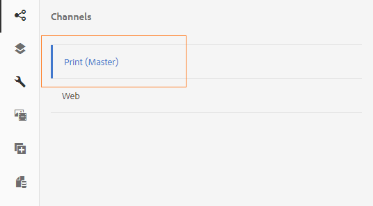

# Skriva ut kanal och webbkanal{#print-channel-and-web-channel}

Interaktiv kommunikation kan distribueras via två kanaler: tryck och webb. Tryckkanalen används för att skapa PDF- och pappersdokument, t.ex. ett tryckt brev som påminnelse om betalning av försäkringspremier, medan webbkanalen används för att leverera onlineupplevelser, t.ex. kreditkortsutdrag på en webbplats.

Författare av interaktiv kommunikation kan återanvända resurser som dokumentfragment och bilder för att skapa både utskrifts- och webbversioner av interaktiv kommunikation.

En av förutsättningarna för [att skapa en interaktiv kommunikation](../../forms/using/create-interactive-communication.md) är att mallarna för utskrift och/eller webbkanal är tillgängliga på servern. Mallförfattare skapar själva webbkanalsmallen i AEM, men utskriftskanalmallen XDP skapas i Adobe Forms Designer och överförs till servern.

## Utskriftskanal {#printchannel}

Utskriftskanalen i en interaktiv kommunikation använder XFA-formulärmallen, XDP. En XDP är utformad i Adobe Forms Designer. Mer information om hur du skapar utskriftskanalmallar finns i [Layoutdesign](../../forms/using/layout-design-details.md). Om du vill använda en utskriftskanalmall i din interaktiva kommunikation måste du överföra mallen till AEM Forms-servern.

### Ladda upp utskriftskanalmall för interaktiv kommunikation {#upload-interactive-communication-print-channel-template}

Om du vill överföra mallen måste du vara medlem i gruppen formulär-användare. Följ de här stegen för att överföra utskriftskanalmallen (XDP) till AEM Forms:

1. Välj **[!UICONTROL Forms]** > **[!UICONTROL Forms & Documents]**.

1. Välj **[!UICONTROL Create]** > **[!UICONTROL File Upload]**.

   Navigera och välj lämplig utskriftskanalmall (XDP) och välj **[!UICONTROL Open]**.

## Webbkanal {#web-channel}

Mallförfattare och administratörer kan skapa, redigera och aktivera webbmallar. Om du vill att andra användare ska kunna skapa webbmallar måste du ge dem behörighet. Mer information finns i [Administrera användar-, grupp- och åtkomsträttigheter](/help/sites-administering/user-group-ac-admin.md).

### Redigerar webbkanalsmall {#authoring-web-channel-template}

Om du vill skapa en webbkanalmall måste du först skapa en mallmapp. När du har skapat en webbmall i en mallmapp måste du aktivera mallen så att formuläranvändarna kan skapa en webbkanal för en interaktiv kommunikation som är baserad på mallen.

Så här skapar du en webbkanalsmall:

1. Skapa en mallmapp om du vill behålla dina webbmallar för interaktiv kommunikation, om du inte redan har en. Mer information finns i Mallmappar i [Sidmallar - Redigerbar](/help/sites-developing/page-templates-editable.md).

   1. Välj **[!UICONTROL Tools]**  > **[!UICONTROL Configuration Browser]**.
      * Mer information finns i dokumentationen för [Configuration Browser](/help/sites-administering/configurations.md).
   1. Välj **[!UICONTROL Create]** på sidan Konfigurationsläsare.
   1. I dialogrutan Skapa konfiguration anger du en rubrik för mappen, markerar **[!UICONTROL Editable Templates]** och väljer **[!UICONTROL Create]**.

      Mappen skapas och visas på sidan Konfigurationsläsare.

1. Navigera till rätt mallmapp och skapa en webbmall.

   1. Navigera till rätt mallmapp genom att välja **[!UICONTROL Tools]** > **[!UICONTROL Templates]** > **`[Folder]`**.
   1. Välj **[!UICONTROL Create]**.
   1. Välj **[!UICONTROL Interactive Communication - Web Channel]** och välj **[!UICONTROL Next]**.
   1. Ange en malltitel och beskrivning och välj sedan **[!UICONTROL Create]**.

      Mallen skapas och en dialogruta visas.

   1. Välj **[!UICONTROL Open]** för att öppna mallen som du har skapat i mallredigeraren.

      Mallredigeraren visas.

      

      När du skapar eller redigerar en mall finns det olika aspekter som mallskaparen kan definiera. Att skapa eller redigera en mall liknar att skapa sidor. Mer information finns i Redigera mallar - Mallförfattare i [Skapa sidmallar](/help/sites-authoring/templates.md).

1. Aktivera mallen om du vill tillåta att den här mallen används för att skapa interaktiv kommunikation.

   1. Välj **[!UICONTROL Tools]**  > **[!UICONTROL Templates]**.
   1. Navigera till rätt mall, markera den och markera **[!UICONTROL Enable]**. I varningsmeddelandet väljer du **[!UICONTROL Enable]**.

      Mallen är aktiverad och dess status visas som Aktiverad. Nu kan du skapa en interaktiv kommunikation där du kan använda den nya webbkanalsmallen.

### Skriva ut kanal som master för webbkanal {#print-channel-as-master-for-web-channel}

När du skapar en interaktiv kommunikation kan författare välja det här alternativet för att skapa webbkanalen synkroniserat med utskriftskanalen. Om du använder en tryckkanal som huvudkanal för webbkanalen kan du säkerställa att innehållet, arvet och databindningen för webbkanalen hämtas från tryckkanalen och att ändringarna som görs i den kan återspeglas i webbkanalen. De som skapar interaktiv kommunikation får dock bryta arvet för specifika komponenter i webbkanalen efter behov.

 
