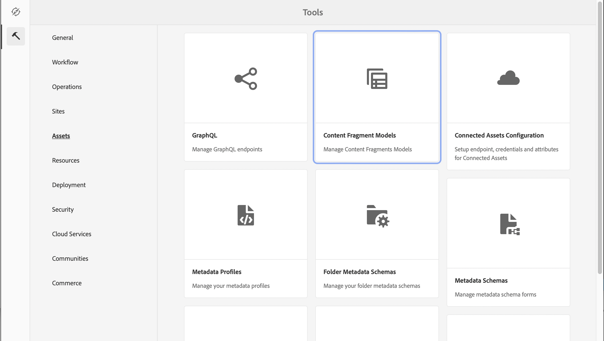

# Läs om hur du skapar modeller för innehållsfragment i AEM {#architect-headless-content-fragment-models}

## Story hittills {#story-so-far}

I början av [AEM Headless Content Author Trney](overview.md) den [Grundläggande om innehållsmodellering för Headless med AEM](basics.md) har omfattat de grundläggande begrepp och termer som är relevanta för utvecklingen av headless.

Den här artikeln bygger vidare på dessa så att du förstår hur du skapar egna modeller för innehållsfragment för AEM headless-projekt.

## Syfte {#objective}

* **Målgrupp**: Nybörjare
* **Syfte**: koncept och mekanismer för att modellera innehåll för headless CMS med Content Fragments Models.

<!-- which persona does this? -->
<!-- and who allows the configuration on the folders? -->

<!--
## Enabling Content Fragment Models {#enabling-content-fragment-models}

At the very start you need to enable Content Fragment Models for your site, this is done in the Configuration Browser; under Tools > General > Configuration Browser. You can either select to configure the global entry, or create a configuration. For example:

>[!NOTE]
>
>See Additional Resources - Content Fragments in the Configuration Browser
-->

## Skapa modeller för innehållsfragment {#creating-content-fragment-models}

Sedan kan du skapa modellerna för innehållsfragment och definiera strukturen. Detta kan du göra under Verktyg > Resurser > Content Fragment Models.

När du har valt detta navigerar du till modellens plats och väljer **Skapa**. Här kan du ange olika nyckeldetaljer.

Alternativet **Aktivera modell** aktiveras som standard. Det innebär att din modell kommer att vara tillgänglig för användning (när du skapar innehållsfragment) så snart du har sparat den. Du kan inaktivera detta om du vill - det finns möjligheter att senare aktivera (eller inaktivera) en befintlig modell.

Bekräfta med **Skapa** så kan du **Öppna** din modell för att börja definiera strukturen.

## Definiera modeller för innehållsfragment {#defining-content-fragment-models}

När du först öppnar en ny modell ser du en stor tom yta till vänster och en lång lista med **Datatyper** till höger:

Så vad ska man göra?

Du kan dra instanser av **Datatyper** till vänster - du definierar redan din modell!

När du har lagt till en datatyp måste du definiera **Egenskaper** för det fältet. De beror på vilken typ som används. Till exempel:

Du kan lägga till så många fält du behöver. Till exempel:

### Dina innehållsförfattare {#your-content-authors}

Innehållsförfattarna kan inte se de faktiska datatyper och egenskaper som du har använt för att skapa modeller. Det innebär att du kan behöva ange hjälp och information om hur specifika fält fylls i. Grundläggande information får du om du använder fältetiketten och standardvärdet, men mer komplex ärendespecifik dokumentation kan behöva övervägas.

>[!NOTE]
>
>Se Ytterligare resurser - modeller för innehållsfragment.

## Hantera modeller för innehållsfragment {#managing-content-fragment-models}

<!-- needs more details -->

Hantera dina modeller för innehållsfragment inkluderar:

* Om du aktiverar (eller inaktiverar) dem blir de tillgängliga för författare när du skapar innehållsfragment.
* Borttagning - borttagning behövs alltid, men du måste vara medveten om att du tar bort en modell som redan används för innehållsfragment, särskilt fragment som redan är publicerade.

## Publicering {#publishing}

<!-- needs more details -->

Modeller för innehållsfragment måste publiceras när/innan beroende innehållsfragment publiceras.

>[!NOTE]
>
>Om en författare försöker publicera ett innehållsfragment för vilket modellen ännu inte har publicerats, visas detta i en urvalslista och modellen publiceras med fragmentet.

Så snart en modell har publicerats *låst* till skrivskyddat läge på författaren. Detta syftar till att förhindra ändringar som kan leda till fel i befintliga GraphQL-scheman och -frågor, särskilt i publiceringsmiljön. Den anges i konsolen av **Låst**.

När modellen är **Låst** (i läget SKRIVSKYDDAD) kan du se innehåll och struktur i modeller, men du kan inte redigera dem direkt, men du kan hantera dem **Låst** modeller från antingen konsolen eller modellredigeraren.

## What&#39;s Next {#whats-next}

Nu när du har lärt dig grunderna är nästa steg att börja skapa egna modeller för innehållsfragment.

## Ytterligare resurser {#additional-resources}

* [Authoring Concepts](/help/sites-authoring/author.md)

* [Grundläggande hantering](/help/sites-authoring/basic-handling.md) - den här sidan är huvudsakligen baserad på **Webbplatser** konsol, men många/de flesta funktioner är också relevanta för navigering till och åtgärder på, **Modeller för innehållsfragment** under **Resurser** konsol.

* [Arbeta med innehållsfragment](/help/assets/content-fragments/content-fragments.md)

   * [Modeller för innehållsfragment](/help/assets/content-fragments/content-fragments-models.md)

      * [Definiera innehållsfragmentmodellen](/help/assets/content-fragments/content-fragments-models.md#defining-your-content-fragment-model)

      * [Aktivera eller inaktivera en innehållsfragmentmodell](/help/assets/content-fragments/content-fragments-models.md#enabling-disabling-a-content-fragment-model)

      * [Tillåt modeller för innehållsfragment i resursmappen](/help/assets/content-fragments/content-fragments-models.md#allowing-content-fragment-models-assets-folder)

      * [Ta bort en innehållsfragmentmodell](/help/assets/content-fragments/content-fragments-models.md#deleting-a-content-fragment-model)

      * [Publicera en innehållsfragmentmodell](/help/assets/content-fragments/content-fragments-models.md#publishing-a-content-fragment-model)

      * [Avpublicera en innehållsfragmentmodell](/help/assets/content-fragments/content-fragments-models.md#unpublishing-a-content-fragment-model)

      * [Låsta (publicerade) modeller för innehållsfragment](/help/assets/content-fragments/content-fragments-models.md#locked-published-content-fragment-models)

* Komma igång-guider

   * [Skapa innehållsfragmentmodeller Headless Quick Start Guide](/help/sites-developing/headless/getting-started/create-content-model.md)
